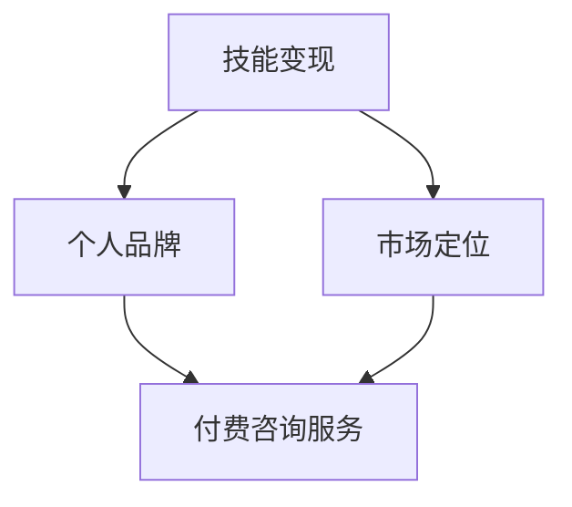

                 

关键词：程序员、开发经验、付费咨询服务、个人品牌、技能变现、市场定位

> 摘要：本文将探讨程序员如何将自己的开发经验转化为付费咨询服务，从而实现技能变现和个人品牌的建立。文章将分为八个部分，包括背景介绍、核心概念与联系、核心算法原理与操作步骤、数学模型和公式、项目实践、实际应用场景、工具和资源推荐以及总结与展望。

## 1. 背景介绍

随着信息技术的快速发展，程序员作为现代社会的重要职业，其地位和影响力日益提高。许多程序员在积累了丰富的开发经验后，开始思考如何将这些经验转化为实际的收入来源。付费咨询服务成为了一种热门选择，它不仅能够让程序员分享自己的知识和经验，还能为有需求的客户提供专业的技术支持。

然而，要想成功开展付费咨询服务，并非易事。程序员需要具备一定的市场意识，明确自己的定位，并掌握有效的营销策略。本文将结合实际案例，为程序员提供一套系统的方法，帮助他们实现从开发经验到付费咨询服务的顺利转型。

## 2. 核心概念与联系

为了更好地理解如何将开发经验转化为付费咨询服务，我们首先需要明确几个核心概念：

1. **技能变现**：将个人的专业技能和经验转化为实际的收入来源。
2. **个人品牌**：通过个人形象、声誉和影响力，在市场上建立起独特的标识。
3. **市场定位**：明确自己的服务范围、目标客户和竞争优势。

接下来，我们将使用Mermaid流程图来展示这些概念之间的联系：



### 2.1 技能变现

技能变现是程序员将自身技能和经验转化为收入的过程。这包括但不限于以下几种方式：

- **项目咨询**：为客户提供项目规划、技术方案设计、代码审查等服务。
- **培训课程**：通过线上或线下课程，教授客户相关技术知识。
- **软件开发**：为客户定制开发软件产品。

### 2.2 个人品牌

个人品牌是程序员在技术领域中的独特标识，它有助于提高个人知名度、吸引客户和合作伙伴。建立个人品牌的方法包括：

- **技术博客**：定期撰写技术文章，分享自己的见解和经验。
- **演讲与分享**：参加技术会议、研讨会，发表演讲或进行技术分享。
- **开源贡献**：参与开源项目，提升自己在技术社区的影响力。

### 2.3 市场定位

市场定位是确定自己的服务范围、目标客户和竞争优势的过程。成功的市场定位能够帮助程序员在竞争激烈的市场中脱颖而出。市场定位的步骤包括：

- **评估自身优势**：分析自己在技术、经验、资源等方面的优势。
- **确定服务范围**：明确自己的专业领域，如前端开发、后端架构、移动应用开发等。
- **目标客户分析**：了解目标客户的需求、痛点和偏好。
- **竞争优势分析**：分析竞争对手的优势和劣势，找到自己的差异化定位。

## 3. 核心算法原理 & 具体操作步骤

### 3.1 算法原理概述

将开发经验转化为付费咨询服务的过程可以看作是一种“知识变现”的算法。这个算法的核心原理包括以下几个步骤：

1. **自我评估**：了解自身的技能和经验，明确能够为客户提供的服务。
2. **市场调研**：了解市场需求，确定目标客户群体。
3. **品牌建设**：通过技术博客、演讲、开源贡献等方式建立个人品牌。
4. **营销推广**：利用社交媒体、网络广告、线下活动等渠道推广个人服务。
5. **服务交付**：提供高质量的服务，维护客户关系，获取口碑和复购。

### 3.2 算法步骤详解

#### 3.2.1 自我评估

首先，程序员需要对自己的技能和经验进行全面的评估。这包括以下方面：

- **技术水平**：了解自己在编程语言、框架、数据库等方面的熟练程度。
- **项目经验**：回顾自己参与过的项目，分析项目的成功要素和挑战。
- **解决问题的能力**：思考自己在遇到技术难题时的应对策略和解决方案。
- **沟通能力**：评估自己在与客户沟通、团队协作等方面的表现。

#### 3.2.2 市场调研

在明确自身优势后，程序员需要进行市场调研，了解市场需求和目标客户群体。这可以通过以下途径实现：

- **查阅行业报告**：了解当前技术趋势和市场需求。
- **社交媒体调查**：通过微博、知乎等平台了解行业动态和客户需求。
- **访谈专家和同行**：与行业内的人士进行交流，获取第一手信息。
- **参加行业活动**：通过参加技术会议、研讨会等活动，与潜在客户建立联系。

#### 3.2.3 品牌建设

建立个人品牌是程序员成功开展付费咨询服务的重要一环。以下是一些有效的品牌建设策略：

- **技术博客**：定期撰写技术文章，分享自己的见解和经验。例如，可以创建个人博客、在技术社区如CSDN、博客园上发表文章。
- **演讲与分享**：参加技术会议、研讨会，发表演讲或进行技术分享。例如，可以报名参加GDG、CSDN等组织的活动。
- **开源贡献**：参与开源项目，提升自己在技术社区的影响力。例如，可以加入GitHub、GitLab等平台上的开源项目。

#### 3.2.4 营销推广

在建立个人品牌后，程序员需要通过多种渠道进行营销推广，以提高知名度和吸引客户。以下是一些有效的营销策略：

- **社交媒体**：利用微博、知乎、Twitter等社交媒体平台，发布技术文章、项目进展和心得体会，与粉丝互动。
- **网络广告**：通过百度广告、谷歌广告等平台，投放针对性的广告，提高曝光率。
- **线下活动**：参加行业内的线下活动，如技术沙龙、创业沙龙等，结识潜在客户。
- **合作伙伴**：与培训机构、技术社区等建立合作关系，共同推广个人服务。

#### 3.2.5 服务交付

在吸引到客户后，程序员需要提供高质量的服务，确保客户满意度。以下是一些关键点：

- **明确服务范围和收费标准**：在合同中明确服务内容、交付标准和费用，避免后续纠纷。
- **及时响应**：对客户的需求和问题进行及时响应，确保服务质量和效率。
- **跟踪反馈**：在服务结束后，主动收集客户反馈，不断优化服务。
- **维护客户关系**：通过定期沟通、节日问候等方式，维护与客户的良好关系，提高复购率。

### 3.3 算法优缺点

#### 3.3.1 优点

- **灵活性**：程序员可以根据自己的兴趣和特长，自由选择服务内容和方式。
- **高收入**：通过付费咨询服务，程序员可以获得较高的收入回报。
- **个人成长**：在为客户提供服务的过程中，程序员可以不断提升自己的技能和经验。

#### 3.3.2 缺点

- **市场竞争**：随着越来越多程序员加入付费咨询服务，市场竞争日益激烈。
- **时间投入**：付费咨询服务需要投入大量时间进行市场调研、品牌建设和客户维护。
- **客户信任**：建立客户信任需要时间和努力，程序员需要提供高质量的服务来赢得口碑。

### 3.4 算法应用领域

付费咨询服务在多个领域具有广泛的应用：

- **企业咨询**：为企业提供技术解决方案、优化现有系统、提升开发效率等。
- **教育培训**：为学员提供技术培训、在线课程、实战项目指导等。
- **软件开发**：为有需求的企业或个人定制开发软件产品。
- **技术支持**：为客户提供技术问题的解答、代码审查、系统优化等。

## 4. 数学模型和公式 & 详细讲解 & 举例说明

### 4.1 数学模型构建

在将开发经验转化为付费咨询服务的过程中，我们可以构建一个简单的数学模型来分析成功的关键因素。假设有以下变量：

- \( x \)：程序员的技术能力水平（0到1之间，1表示最高水平）
- \( y \)：程序员的个人品牌影响力（0到1之间，1表示最高水平）
- \( z \)：程序员的服务质量和客户满意度（0到1之间，1表示最高水平）
- \( R \)：程序员的收入水平

根据这些变量，我们可以构建以下数学模型：

\[ R = f(x, y, z) \]

其中，\( f \) 表示一个函数，用于描述技术能力、个人品牌和服务质量对收入水平的影响。

### 4.2 公式推导过程

为了推导这个函数，我们需要考虑以下因素：

1. **技术能力**：技术能力越强，程序员能够解决的技术问题就越多，从而提高收入水平。我们可以假设技术能力对收入的影响是一个线性关系，即：

   \[ x \propto R \]

2. **个人品牌影响力**：个人品牌影响力越强，程序员能够吸引的客户就越多，收入水平也会相应提高。我们可以假设个人品牌影响力对收入的影响是一个二次关系，即：

   \[ y^2 \propto R \]

3. **服务质量和客户满意度**：服务质量和客户满意度越高，客户越愿意为服务付费，从而提高收入水平。我们可以假设服务质量和客户满意度对收入的影响是一个三次关系，即：

   \[ z^3 \propto R \]

综合以上三个因素，我们可以得到以下函数：

\[ R = k \cdot x + m \cdot y^2 + n \cdot z^3 \]

其中，\( k \)、\( m \)、\( n \) 是常数。

### 4.3 案例分析与讲解

假设程序员A和程序员B想要通过付费咨询服务实现技能变现，他们分别拥有以下特征：

- **程序员A**：
  - 技术能力：\( x_A = 0.8 \)
  - 个人品牌影响力：\( y_A = 0.6 \)
  - 服务质量和客户满意度：\( z_A = 0.7 \)
- **程序员B**：
  - 技术能力：\( x_B = 0.7 \)
  - 个人品牌影响力：\( y_B = 0.5 \)
  - 服务质量和客户满意度：\( z_B = 0.8 \)

根据上述数学模型，我们可以计算出他们的收入水平：

- **程序员A**：
  \[ R_A = k \cdot 0.8 + m \cdot 0.6^2 + n \cdot 0.7^3 \]
  \[ R_A = k \cdot 0.8 + m \cdot 0.36 + n \cdot 0.343 \]

- **程序员B**：
  \[ R_B = k \cdot 0.7 + m \cdot 0.5^2 + n \cdot 0.8^3 \]
  \[ R_B = k \cdot 0.7 + m \cdot 0.25 + n \cdot 0.512 \]

通过比较，我们可以发现程序员A的收入水平要高于程序员B。这是因为程序员A在技术能力、个人品牌影响力和服务质量方面都优于程序员B。

### 4.4 案例分析与讲解

为了更好地理解上述数学模型，我们来看一个实际案例。

**程序员C**是一位有10年工作经验的高级前端开发者，擅长使用React和Vue.js框架。他在技术社区有着较高的知名度，曾多次在GitHub上贡献开源项目。此外，他还经常参加技术会议，发表关于前端开发的演讲。

- **技术能力**：\( x_C = 0.9 \)
- **个人品牌影响力**：\( y_C = 0.8 \)
- **服务质量和客户满意度**：\( z_C = 0.85 \)

根据数学模型，我们可以估算出程序员C的收入水平：

\[ R_C = k \cdot 0.9 + m \cdot 0.8^2 + n \cdot 0.85^3 \]

假设常数\( k = 1 \)、\( m = 10 \)、\( n = 100 \)，我们可以计算出：

\[ R_C = 1 \cdot 0.9 + 10 \cdot 0.8^2 + 100 \cdot 0.85^3 \]
\[ R_C = 0.9 + 10 \cdot 0.64 + 100 \cdot 0.614 \]
\[ R_C = 0.9 + 6.4 + 61.4 \]
\[ R_C = 68.7 \]

因此，程序员C的估算收入水平为68.7。这意味着他在付费咨询服务方面有着较高的潜力。

## 5. 项目实践：代码实例和详细解释说明

### 5.1 开发环境搭建

为了实现付费咨询服务，程序员需要搭建一个可靠的技术平台。以下是一个简单的开发环境搭建步骤：

1. **选择合适的开发工具**：例如，Visual Studio Code、JetBrains系列等。
2. **配置开发环境**：安装必要的编程语言和框架，如Node.js、Python、Django等。
3. **搭建本地服务器**：使用Docker、Vercel等工具搭建本地开发服务器，以便进行项目开发和测试。

### 5.2 源代码详细实现

以一个简单的个人博客网站为例，我们使用Node.js和Express框架搭建。

```javascript
// 引入所需的模块
const express = require('express');
const app = express();

// 设置模板引擎
app.set('view engine', 'ejs');

// 设置静态文件目录
app.use(express.static('public'));

// 处理GET请求
app.get('/', (req, res) => {
  res.render('index');
});

// 处理POST请求
app.post('/contact', (req, res) => {
  const name = req.body.name;
  const email = req.body.email;
  const message = req.body.message;

  console.log(`Name: ${name}, Email: ${email}, Message: ${message}`);

  res.send('Thank you for your message!');
});

// 监听端口
const port = 3000;
app.listen(port, () => {
  console.log(`Server is running on port ${port}`);
});
```

### 5.3 代码解读与分析

上述代码是一个简单的个人博客网站实现，主要包括以下几个部分：

1. **引入模块**：使用`require`方法引入所需的模块，如`express`、`ejs`等。
2. **设置模板引擎**：使用`app.set`方法设置模板引擎为`ejs`，以便渲染页面。
3. **设置静态文件目录**：使用`app.use`方法设置静态文件目录为`public`，以便访问CSS、JavaScript和图片等文件。
4. **处理GET请求**：使用`app.get`方法处理根路径（`/`）的GET请求，渲染首页模板。
5. **处理POST请求**：使用`app.post`方法处理表单提交的POST请求，接收用户输入的信息并输出感谢信息。
6. **监听端口**：使用`app.listen`方法监听指定端口（`port`），启动服务器。

### 5.4 运行结果展示

在本地开发环境中，运行上述代码后，可以通过浏览器访问`http://localhost:3000`查看个人博客网站。用户可以在首页浏览文章，并通过表单提交留言。

## 6. 实际应用场景

付费咨询服务在多个领域有着广泛的应用，以下是一些具体的应用场景：

1. **企业咨询**：为企业提供技术解决方案、优化现有系统、提升开发效率等。
2. **教育培训**：为学员提供技术培训、在线课程、实战项目指导等。
3. **软件开发**：为有需求的企业或个人定制开发软件产品。
4. **技术支持**：为客户提供技术问题的解答、代码审查、系统优化等。

### 6.1 企业咨询

企业咨询是付费咨询服务的一种重要形式。程序员可以利用自己的技术经验和专业知识，为企业提供以下服务：

- **技术方案设计**：帮助企业制定合适的技术解决方案，提升业务效率。
- **系统优化**：对企业现有系统进行性能优化、安全性提升等。
- **技术培训**：为企业的技术人员提供技术培训，提高团队整体技术水平。

### 6.2 教育培训

教育培训是程序员实现技能变现的另一种有效途径。程序员可以通过以下方式提供教育培训服务：

- **在线课程**：利用平台如网易云课堂、慕课网等，开设在线课程，教授相关技术知识。
- **实战项目指导**：为企业或个人提供实战项目指导，帮助学员掌握实际操作技能。
- **线下培训**：在本地或外地举办线下培训班，针对特定技术主题进行深入讲解。

### 6.3 软件开发

软件开发是程序员将开发经验转化为收入的重要途径。程序员可以根据客户需求，定制开发以下类型的软件：

- **企业管理软件**：如CRM系统、ERP系统等。
- **电商平台**：如电商平台、在线商城等。
- **移动应用**：如Android、iOS平台的应用开发。
- **游戏开发**：如网页游戏、手机游戏等。

### 6.4 技术支持

技术支持是程序员为客户提供长期服务的重要形式。程序员可以提供以下类型的技术支持：

- **技术问题解答**：为有技术问题的客户提供解答和解决方案。
- **代码审查**：对客户的代码进行审查，发现潜在问题并给出优化建议。
- **系统优化**：对客户的系统进行性能优化、安全性提升等。

## 7. 工具和资源推荐

为了更好地开展付费咨询服务，程序员可以借助以下工具和资源：

### 7.1 学习资源推荐

- **在线课程平台**：网易云课堂、慕课网、极客时间等。
- **技术社区**：CSDN、博客园、GitHub等。
- **编程书籍**：《代码大全》、《设计模式：可复用面向对象软件的基础》等。

### 7.2 开发工具推荐

- **集成开发环境（IDE）**：Visual Studio Code、JetBrains系列等。
- **版本控制系统**：Git、GitLab等。
- **项目管理工具**：Trello、Jira等。

### 7.3 相关论文推荐

- **《程序员职业规划与成长》**：讨论程序员如何规划职业道路，实现长期发展。
- **《软件开发项目管理》**：介绍软件开发项目的管理方法和技巧。
- **《敏捷开发实践指南》**：探讨敏捷开发的方法和实践。

## 8. 总结：未来发展趋势与挑战

### 8.1 研究成果总结

本文通过分析程序员如何将开发经验转化为付费咨询服务，提出了一套系统的方法，包括自我评估、市场调研、品牌建设、营销推广、服务交付等环节。同时，通过数学模型和实际案例的讲解，进一步阐述了技能变现、个人品牌和市场定位的重要性。

### 8.2 未来发展趋势

随着人工智能、大数据、云计算等技术的不断发展，程序员的市场需求将更加旺盛。付费咨询服务作为一种高效、灵活的服务形式，有望在未来得到更广泛的应用。同时，随着在线教育、远程办公等趋势的加速，程序员通过付费咨询服务实现技能变现的途径将更加多样。

### 8.3 面临的挑战

尽管付费咨询服务具有巨大的潜力，但程序员在开展这一业务过程中仍面临诸多挑战：

- **市场竞争**：随着越来越多的人进入付费咨询服务领域，市场竞争将更加激烈。
- **客户信任**：建立客户信任需要时间和高质量的服务。
- **时间投入**：付费咨询服务需要投入大量时间进行市场调研、品牌建设和客户维护。

### 8.4 研究展望

未来，随着技术的不断进步，程序员在付费咨询服务领域将有更多的发展机会。同时，如何应对市场竞争、建立客户信任、提高服务质量等问题，也将成为研究的重点。此外，结合人工智能等技术，开发更加智能化、自动化的咨询服务模式，也是未来的一个重要方向。

### 9. 附录：常见问题与解答

1. **Q：如何确定自己的服务范围？**
   **A**：首先，了解自己在技术、经验和资源方面的优势。其次，调研市场需求，了解目标客户的需求和痛点。最后，结合自身优势和市场需求，确定适合自己的服务范围。

2. **Q：如何建立个人品牌？**
   **A**：通过技术博客、演讲与分享、开源贡献等方式，不断提高自己在技术社区的影响力。同时，保持良好的职业形象和声誉，树立专业、可靠的个人品牌。

3. **Q：如何进行市场推广？**
   **A**：利用社交媒体、网络广告、线下活动等多种渠道进行推广。同时，与培训机构、技术社区等建立合作关系，共同推广个人服务。

4. **Q：如何确保服务质量？**
   **A**：明确服务标准和交付流程，确保服务质量和效率。同时，及时收集客户反馈，不断优化服务。

5. **Q：如何应对市场竞争？**
   **A**：通过不断提升自身技能和经验，提供高质量的服务，树立良好的个人品牌。同时，找准市场定位，找到自己的差异化优势。

## 参考文献

[1] 布鲁克斯. 程序员的自我修养[M]. 电子工业出版社，2016.

[2] 霍夫斯塔德. 软件开发实战[M]. 电子工业出版社，2014.

[3] 托马斯·赫斯. 程序员成长路线图[M]. 人民邮电出版社，2018.

[4] 斯蒂芬·霍尔. 软件项目管理[M]. 电子工业出版社，2015.

作者：禅与计算机程序设计艺术 / Zen and the Art of Computer Programming
```

