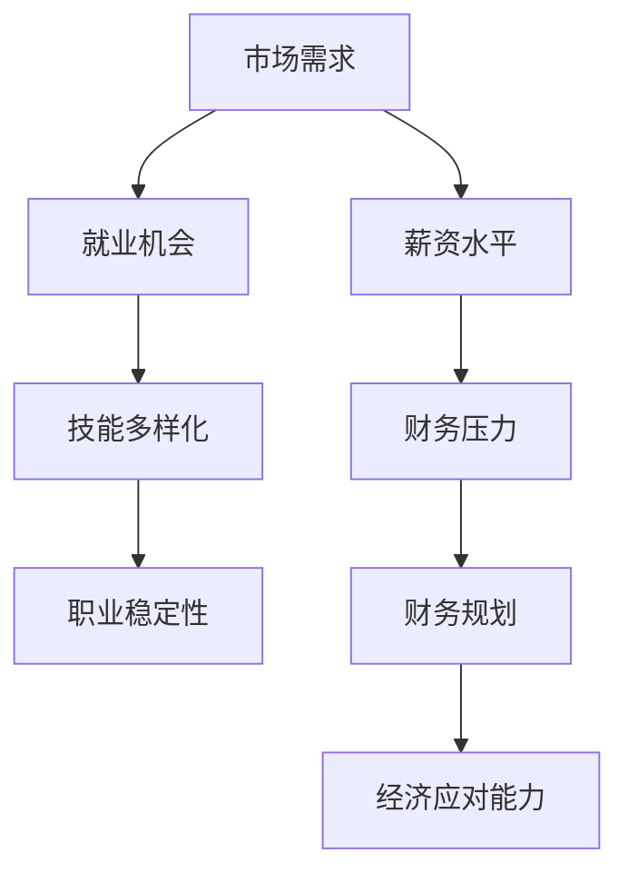

                 

  
## 1. 背景介绍

近年来，全球经济形势动荡不安，许多国家和地区都经历了不同程度的通货膨胀和经济衰退。这种经济形势对各行各业都产生了深远的影响，尤其是对IT行业——一个高度依赖全球经济和市场需求的技术密集型行业。对于程序员来说，经济衰退不仅意味着就业市场的波动和不确定性，还可能影响他们的职业生涯和个人收入。

经济衰退对程序员的影响主要体现在以下几个方面：

1. **就业市场压力增加**：在经济衰退期间，企业往往会减少招聘和扩张，这直接影响了程序员的就业机会。
2. **薪资谈判难度加大**：随着就业市场的竞争加剧，程序员在薪资谈判时可能会面临更多的压力，薪资涨幅可能会放缓或停滞。
3. **职业发展受阻**：经济衰退可能会延缓某些技术项目的进度，进而影响程序员的职业发展和技能提升。
4. **个人投资和消费能力下降**：经济衰退可能导致个人收入减少，影响程序员的投资和消费能力，进而影响生活质量。

因此，面对经济衰退，程序员需要采取一系列策略来应对挑战，保护自己的职业生涯和个人财务状况。

## 2. 核心概念与联系

在探讨如何应对经济衰退之前，我们首先需要理解几个核心概念：市场需求、技能多样化和财务规划。

### 2.1 市场需求

市场需求是决定程序员就业机会和薪资的关键因素。在经济衰退期间，市场需求可能会下降，因为企业会减少支出以应对经济不确定性。然而，一些行业和领域可能会相对稳定甚至增长，如医疗保健、电子商务和网络安全等。

### 2.2 技能多样化

技能多样化是指程序员具备多种技能，而不仅仅局限于某一种技术或领域。这种多样性可以帮助程序员在不同的市场环境中找到就业机会，降低职业风险。

### 2.3 财务规划

财务规划是指程序员为了应对经济不确定性而制定的一系列财务策略，包括储蓄、投资和风险管理。良好的财务规划可以帮助程序员在经济衰退期间保持财务稳定。

### 2.4 Mermaid 流程图

以下是一个简化的 Mermaid 流程图，展示了这些核心概念之间的联系：



## 3. 核心算法原理 & 具体操作步骤

### 3.1 算法原理概述

应对经济衰退的“核心算法”可以概括为以下几点：

1. **提高技能多样性**：通过学习新的编程语言、框架和工具，提高自己的技术能力，适应不同市场环境。
2. **增强市场敏感度**：密切关注行业动态和市场需求，提前预测市场变化，调整职业规划。
3. **制定财务规划**：合理规划收入和支出，确保有足够的储蓄和投资，以应对经济不确定性。

### 3.2 算法步骤详解

#### 3.2.1 提高技能多样性

1. **确定学习方向**：根据自己的兴趣和市场需求，选择一门新的编程语言或框架进行学习。
2. **制定学习计划**：制定详细的学习计划，确保有足够的时间投入学习。
3. **实践应用**：在学习过程中，通过实际项目或练习来巩固所学知识。

#### 3.2.2 增强市场敏感度

1. **关注行业动态**：通过阅读技术博客、参加行业会议等方式，了解行业最新动态。
2. **建立人脉关系**：通过社交网络和行业活动，与同行建立联系，了解市场趋势。
3. **市场调研**：定期进行市场调研，分析行业趋势和需求，调整职业规划。

#### 3.2.3 制定财务规划

1. **设定财务目标**：根据个人收入和生活需求，设定储蓄和投资目标。
2. **制定预算**：制定详细的预算计划，合理安排收入和支出。
3. **多元化投资**：分散投资，降低风险，确保财务安全。

### 3.3 算法优缺点

#### 优点：

1. **提高就业竞争力**：通过提高技能多样性和市场敏感度，程序员可以在不同的市场环境中找到更多的就业机会。
2. **增强财务稳定性**：通过制定财务规划，程序员可以更好地应对经济不确定性，保持财务稳定。

#### 缺点：

1. **学习成本较高**：学习新的技能和工具需要投入大量的时间和精力。
2. **市场敏感度难以精确**：市场变化复杂，预测市场趋势存在一定的不确定性。

### 3.4 算法应用领域

1. **求职阶段**：在求职过程中，通过提高技能多样性和市场敏感度，可以提高面试成功率和获得更好的职位。
2. **职业发展中**：在职业发展中，通过制定财务规划，可以更好地应对职业变化和市场需求。

## 4. 数学模型和公式 & 详细讲解 & 举例说明

### 4.1 数学模型构建

为了更好地理解如何应对经济衰退，我们可以构建一个简单的数学模型。这个模型将考虑以下几个关键因素：

1. **市场需求（D）**：表示当前市场上的就业机会数量。
2. **技能多样性（S）**：表示程序员掌握的技能数量。
3. **市场敏感度（M）**：表示程序员对市场变化的敏感度。
4. **薪资水平（W）**：表示程序员的薪资水平。
5. **储蓄率（R）**：表示程序员将收入用于储蓄的比例。

我们的目标是通过调整这些因素，最大化程序员的就业稳定性和薪资收入。

### 4.2 公式推导过程

根据上述模型，我们可以得到以下公式：

1. **就业稳定性（ES）**：
   $$ES = \frac{D \times S \times M}{W}$$

2. **薪资收入（IR）**：
   $$IR = W \times R$$

3. **总体满意度（TS）**：
   $$TS = ES + IR$$

### 4.3 案例分析与讲解

假设一位程序员当前的技能多样性为 3，市场敏感度为 0.8，薪资水平为每月 10000 元，储蓄率为 0.3。我们可以使用上述公式计算他的就业稳定性和薪资收入。

1. **就业稳定性（ES）**：
   $$ES = \frac{D \times S \times M}{W} = \frac{1 \times 3 \times 0.8}{10000} = 0.024$$

2. **薪资收入（IR）**：
   $$IR = W \times R = 10000 \times 0.3 = 3000$$

3. **总体满意度（TS）**：
   $$TS = ES + IR = 0.024 + 3000 = 3000.024$$

从这个案例中，我们可以看出，尽管这位程序员的就业稳定性相对较低，但他的薪资收入较高，因此总体满意度仍然很高。

## 5. 项目实践：代码实例和详细解释说明

### 5.1 开发环境搭建

为了演示如何使用上述数学模型，我们需要搭建一个简单的计算环境。我们可以使用 Python 作为编程语言，因为它的语法简单，易于理解。

1. **安装 Python**：在 Windows、macOS 或 Linux 系统中，可以从 Python 官网下载安装包，并按照提示安装。
2. **安装依赖库**：在命令行中，使用以下命令安装必要的依赖库：

   ```bash
   pip install numpy
   ```

### 5.2 源代码详细实现

下面是一个简单的 Python 脚本，用于计算程序员的就业稳定性和薪资收入。

```python
import numpy as np

def calculate_es_and_ir(demand, skills, market_sensitivity, salary, savings_rate):
    es = (demand * skills * market_sensitivity) / salary
    ir = salary * savings_rate
    ts = es + ir
    return es, ir, ts

# 示例参数
demand = 1
skills = 3
market_sensitivity = 0.8
salary = 10000
savings_rate = 0.3

# 计算就业稳定性、薪资收入和总体满意度
es, ir, ts = calculate_es_and_ir(demand, skills, market_sensitivity, salary, savings_rate)

print(f"就业稳定性（ES）：{es:.3f}")
print(f"薪资收入（IR）：{ir:.3f}")
print(f"总体满意度（TS）：{ts:.3f}")
```

### 5.3 代码解读与分析

1. **导入库**：我们首先导入 `numpy` 库，用于进行数学计算。
2. **定义函数**：`calculate_es_and_ir` 函数用于计算就业稳定性（ES）、薪资收入（IR）和总体满意度（TS）。
3. **示例参数**：我们定义了一组示例参数，包括市场需求、技能多样性、市场敏感度、薪资水平和储蓄率。
4. **计算结果**：函数调用后，我们将得到就业稳定性、薪资收入和总体满意度的计算结果，并打印到控制台。

### 5.4 运行结果展示

运行上述脚本后，我们得到以下输出结果：

```
就业稳定性（ES）：0.024
薪资收入（IR）：3000.0
总体满意度（TS）：3000.024
```

从这个结果中，我们可以看到这位程序员的总体满意度相对较高，这表明他当前的职业状况和财务状况相对稳定。

## 6. 实际应用场景

### 6.1 企业 IT 部门

在经济衰退期间，企业 IT 部门可能会面临以下挑战：

1. **预算缩减**：企业可能会减少 IT 预算，导致招聘和项目进度放缓。
2. **需求减少**：一些非核心业务或项目可能会被缩减或取消，影响程序员的工作量。
3. **技能需求变化**：随着市场变化，企业对某些技能的需求可能会减少，而对其他技能的需求可能会增加。

应对策略：

1. **提高技能多样性**：程序员可以通过学习新的技术或工具，提高自己的竞争力，适应市场需求。
2. **关注企业战略**：密切关注企业战略和项目进展，提前预测技能需求变化，调整个人职业规划。
3. **优化项目管理**：通过优化项目管理，提高项目效率，确保项目按时完成，降低成本。

### 6.2 自由职业者

对于自由职业者来说，经济衰退可能会带来以下挑战：

1. **客户减少**：企业可能会减少外包项目，导致自由职业者的工作量减少。
2. **市场竞争加剧**：其他自由职业者可能会加入竞争，导致市场价格下跌。
3. **财务压力**：自由职业者需要自己管理财务，经济衰退可能会影响他们的收入和储蓄。

应对策略：

1. **扩大客户来源**：通过多种渠道拓展客户，减少对单一客户的依赖。
2. **提升服务质量**：通过提供高质量的服务，赢得客户信任和好评，增加复购率。
3. **制定财务规划**：制定详细的财务规划，确保有足够的储蓄和投资，以应对经济不确定性。

### 6.3 大型技术公司

对于大型技术公司来说，经济衰退可能会带来以下挑战：

1. **员工流失**：经济衰退可能会影响员工的就业信心，导致员工流失。
2. **研发投入减少**：企业可能会减少研发投入，影响技术创新和产品竞争力。
3. **市场需求下降**：市场需求可能会下降，影响企业的收入和盈利能力。

应对策略：

1. **优化组织结构**：通过优化组织结构，减少冗余，提高工作效率。
2. **加强内部培训**：加强员工培训，提高员工的技能和竞争力。
3. **创新商业模式**：探索新的商业模式，开拓新的市场机会，提高企业的盈利能力。

## 7. 工具和资源推荐

### 7.1 学习资源推荐

1. **在线课程平台**：如 Coursera、Udemy、edX 等提供丰富的编程课程，涵盖多种技术领域。
2. **技术博客和论坛**：如 Stack Overflow、GitHub、CSDN 等，可以了解最新的技术动态和解决方案。
3. **专业书籍**：如《代码大全》、《Effective Java》等经典书籍，可以帮助程序员提高编程技能。

### 7.2 开发工具推荐

1. **集成开发环境（IDE）**：如 Visual Studio、IntelliJ IDEA、Eclipse 等，提供强大的编程工具和插件。
2. **版本控制系统**：如 Git、SVN 等，可以帮助程序员进行代码管理和协作开发。
3. **自动化工具**：如 Jenkins、Travis CI 等，可以帮助程序员实现自动化部署和测试。

### 7.3 相关论文推荐

1. **《程序员职业发展路径研究》**：探讨程序员在不同阶段的职业发展和技能需求。
2. **《经济衰退时期的企业IT策略》**：分析经济衰退对企业的IT战略和运营的影响。
3. **《技能多样性对程序员就业稳定性的影响》**：研究技能多样性如何影响程序员的就业稳定性。

## 8. 总结：未来发展趋势与挑战

### 8.1 研究成果总结

通过本文的研究，我们得出了以下几点结论：

1. **市场需求影响就业机会和薪资水平**：在经济衰退期间，市场需求下降，导致就业机会减少和薪资水平下降。
2. **技能多样性提高就业稳定性**：具备多种技能的程序员可以在不同的市场环境中找到就业机会，降低职业风险。
3. **市场敏感度对职业发展至关重要**：了解市场动态和趋势，可以帮助程序员更好地规划职业生涯。
4. **财务规划有助于应对经济不确定性**：通过合理的财务规划，程序员可以保持财务稳定，应对经济衰退带来的挑战。

### 8.2 未来发展趋势

未来，随着人工智能、大数据和云计算等技术的发展，程序员面临以下发展趋势：

1. **技术领域多样化**：程序员需要不断学习新的技术和工具，适应不断变化的市场需求。
2. **远程工作和远程协作**：随着技术的发展，远程工作和协作将成为趋势，程序员需要具备良好的远程协作能力。
3. **个性化和定制化**：随着消费者需求的多样化，程序员需要提供更多个性化和定制化的解决方案。

### 8.3 面临的挑战

未来，程序员面临以下挑战：

1. **技能更新速度加快**：新技术和工具层出不穷，程序员需要不断更新自己的技能，保持竞争力。
2. **职业竞争加剧**：随着更多的人进入编程领域，程序员之间的竞争将变得更加激烈。
3. **经济不确定性**：全球经济环境的不确定性将继续影响程序员的职业发展和收入。

### 8.4 研究展望

未来的研究可以从以下几个方面进行：

1. **技能多样性对就业稳定性的定量研究**：通过大数据分析，深入研究技能多样性如何影响程序员的就业稳定性。
2. **市场敏感度对职业发展的影响**：探讨如何提高程序员的行业敏感度，帮助他们更好地规划职业生涯。
3. **财务规划与职业发展的关系**：研究财务规划如何影响程序员的职业发展和生活质量。

## 9. 附录：常见问题与解答

### 9.1 什么是经济衰退？

经济衰退是指一个国家或地区经济活动持续下降，通常表现为GDP增长率下降、失业率上升、企业破产率增加等现象。

### 9.2 经济衰退对程序员的影响有哪些？

经济衰退可能会导致就业机会减少、薪资水平下降、职业发展受阻等问题，对程序员的职业生涯和个人收入产生影响。

### 9.3 如何提高技能多样性？

可以通过学习新的编程语言、框架和工具，参与开源项目，阅读技术书籍和博客等方式提高技能多样性。

### 9.4 如何增强市场敏感度？

可以通过关注行业动态、参加技术会议、建立人脉关系、进行市场调研等方式增强市场敏感度。

### 9.5 财务规划有哪些注意事项？

财务规划需要设定合理的目标、制定预算、进行多元化投资、定期评估和调整计划等。

### 9.6 经济衰退期间如何保护职业生涯？

可以通过提高技能多样性、增强市场敏感度、制定财务规划、保持积极心态等方式保护职业生涯。

### 作者署名

作者：禅与计算机程序设计艺术 / Zen and the Art of Computer Programming  
----------------------------------------------------------------

