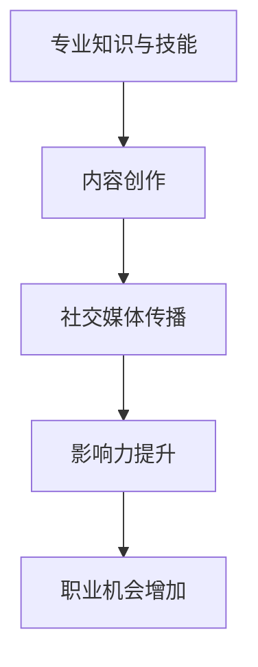

                 

关键词：个人品牌建设、IP打造、程序员、影响力、社交媒体、内容创作

> 摘要：在数字化时代，个人品牌的力量不容小觑。程序员们如何利用自身的专业知识和技能，打造出具有吸引力的个人IP（知识产权），并在社交媒体上获得粉丝的青睐？本文将深入探讨这一主题，分享策略和实践技巧，帮助程序员们迈向成功的个人品牌之路。

## 1. 背景介绍

在过去的几年里，随着互联网和社交媒体的迅速发展，个人品牌（Personal Branding）和知识产权（Intellectual Property，简称IP）成为了许多专业人士关注的焦点。尤其是对于程序员这个高度专业化的职业来说，打造个人IP不仅能够提升个人影响力，还能为职业生涯带来诸多机遇。

### 1.1 个人品牌的重要性

个人品牌是指个人在公众心目中的形象和认知。它不仅代表了个人的专业技能和职业形象，还涵盖了个人价值观、人格特质和社会影响力。一个强大的个人品牌可以帮助程序员在职场中获得更多的机会，如提升薪资、扩展职业发展路径，甚至在创业领域获得投资青睐。

### 1.2 IP的概念

IP是指独特的创意、知识或技能，通常通过版权、商标或其他法律形式进行保护。对于程序员来说，个人IP可能包括原创的代码、技术博客、开源项目、专利技术等。这些IP不仅能够为程序员带来经济收益，还能提升其在行业内的知名度和影响力。

## 2. 核心概念与联系

为了更好地理解如何打造个人IP，我们需要了解一些核心概念及其相互之间的联系。

### 2.1 专业知识和技能

程序员的专业知识和技能是构建个人IP的基础。无论是编程语言、框架、算法还是数据结构，这些知识和技能都是程序员在职业生涯中不可或缺的部分。掌握并熟练应用这些技能，有助于程序员在项目中表现出色，并在社交媒体上分享高质量的内容。

### 2.2 内容创作

内容创作是构建个人IP的关键环节。通过撰写技术博客、发布教程、录制视频或开设在线课程，程序员可以分享自己的知识和经验，吸引粉丝并建立自己的影响力。内容创作的质量直接影响个人IP的吸引力和粉丝黏性。

### 2.3 社交媒体

社交媒体是传播个人IP的重要渠道。通过在社交媒体平台（如微博、知乎、GitHub、抖音等）上活跃，程序员可以与粉丝互动、分享内容、扩大影响力。社交媒体的广泛传播效果，使得个人IP能够迅速获得关注和认可。

### 2.4 影响力

影响力是个人IP的价值体现。一个拥有强大影响力的程序员，不仅可以吸引更多的粉丝，还能在项目中获得更好的待遇，甚至有机会参与行业标准的制定。影响力的大小，取决于个人IP的吸引力和粉丝的忠诚度。

### 2.5 Mermaid 流程图



通过上述核心概念及其相互之间的联系，我们可以更清晰地理解如何打造个人IP。

## 3. 核心算法原理 & 具体操作步骤

### 3.1 算法原理概述

构建个人IP的核心算法可以概括为以下几个步骤：

1. **自我定位**：明确个人在技术领域的定位和优势，确定个人IP的核心内容。
2. **内容创作**：根据自我定位，创作高质量的技术内容，如博客、教程、视频等。
3. **社交媒体传播**：在社交媒体平台上发布内容，与粉丝互动，扩大个人影响力。
4. **持续优化**：根据反馈和效果，不断调整和优化个人IP的内容和传播策略。

### 3.2 算法步骤详解

#### 步骤1：自我定位

自我定位是构建个人IP的第一步。程序员需要分析自己的专业技能和兴趣，确定个人IP的核心内容。以下是一些自我定位的建议：

- **技能树分析**：根据个人技能，构建技能树，明确自己的优势和特长。
- **兴趣爱好**：结合个人兴趣爱好，确定个人IP的方向和主题。
- **市场需求**：了解市场需求，选择有潜力的技术领域进行深耕。

#### 步骤2：内容创作

内容创作是构建个人IP的核心环节。程序员需要创作高质量的技术内容，如博客、教程、视频等。以下是一些内容创作的建议：

- **确定主题**：根据自我定位，确定每个内容主题，确保内容与个人IP的核心一致。
- **内容形式**：根据目标受众和内容主题，选择合适的内容形式，如文字、图片、视频等。
- **内容质量**：保证内容质量，包括技术深度、逻辑清晰、语言简洁等。

#### 步骤3：社交媒体传播

社交媒体传播是扩大个人IP影响力的重要途径。程序员需要在社交媒体平台上发布内容，与粉丝互动，扩大个人影响力。以下是一些社交媒体传播的建议：

- **平台选择**：根据目标受众，选择合适的社交媒体平台，如微博、知乎、GitHub等。
- **发布频率**：保持一定的发布频率，确保内容持续吸引粉丝。
- **互动互动**：积极与粉丝互动，回答问题，参与讨论，提高粉丝黏性。

#### 步骤4：持续优化

持续优化是构建个人IP的关键。程序员需要根据反馈和效果，不断调整和优化个人IP的内容和传播策略。以下是一些持续优化的建议：

- **数据分析**：通过数据分析，了解内容的效果和受众反馈，找出改进的方向。
- **内容调整**：根据数据分析，调整内容主题、形式和质量，提高内容吸引力。
- **传播策略**：根据受众特点和效果，调整传播策略，提高内容传播效果。

### 3.3 算法优缺点

#### 优点

- **针对性**：算法针对性强，能够帮助程序员根据个人特点和市场需求，构建合适的个人IP。
- **可操作性**：算法步骤详细，操作性高，程序员可以根据自身情况，灵活调整和实施。
- **持续优化**：算法强调持续优化，能够帮助程序员不断提高个人IP的质量和影响力。

#### 缺点

- **时间成本**：构建个人IP需要投入大量时间和精力，对程序员的时间管理能力有较高要求。
- **内容质量**：内容创作质量直接影响个人IP的吸引力，对程序员的内容创作能力有较高要求。
- **市场风险**：市场需求变化较大，程序员需要不断调整个人IP方向，以适应市场变化。

### 3.4 算法应用领域

构建个人IP的核心算法适用于所有需要个人品牌建设的程序员。无论是在职场发展、项目合作、创业等领域，该算法都能够帮助程序员构建强大的个人IP，提升个人影响力和竞争力。

## 4. 数学模型和公式 & 详细讲解 & 举例说明

构建个人IP的过程可以看作是一个动态优化问题，其中涉及多个数学模型和公式。以下是对这些模型和公式的详细讲解以及实际应用案例。

### 4.1 数学模型构建

构建个人IP的数学模型主要包括以下几个方面：

1. **受众模型**：描述目标受众的特征和行为，包括年龄、性别、职业、兴趣爱好等。
2. **内容模型**：描述个人IP的内容类型、质量和传播效果，包括博客、视频、教程等。
3. **影响力模型**：描述个人IP的影响力，包括粉丝数量、互动率、关注度等。
4. **收益模型**：描述个人IP带来的经济收益，包括广告收入、赞助商、课程销售等。

### 4.2 公式推导过程

1. **受众模型公式**：

   $$A = f(\text{年龄}, \text{性别}, \text{职业}, \text{兴趣爱好})$$

   其中，A表示受众特征向量，f表示特征映射函数。

2. **内容模型公式**：

   $$C = f(\text{内容类型}, \text{内容质量}, \text{传播效果})$$

   其中，C表示内容特征向量，f表示特征映射函数。

3. **影响力模型公式**：

   $$I = f(\text{粉丝数量}, \text{互动率}, \text{关注度})$$

   其中，I表示影响力特征向量，f表示特征映射函数。

4. **收益模型公式**：

   $$R = f(\text{广告收入}, \text{赞助商}, \text{课程销售})$$

   其中，R表示收益特征向量，f表示特征映射函数。

### 4.3 案例分析与讲解

以下是一个具体的案例，假设某程序员的目标受众是年龄在25-35岁之间的程序员，兴趣爱好包括编程、开源项目和AI技术。

1. **受众模型**：

   $$A = (25, \text{男}, \text{程序员}, \text{开源项目}, \text{AI技术})$$

2. **内容模型**：

   $$C = (博客, \text{高质量}, \text{广泛传播})$$

3. **影响力模型**：

   $$I = (1000, \text{高}, \text{中等})$$

4. **收益模型**：

   $$R = (\$1000, \text{无}, \text{无})$$

根据以上模型，我们可以分析该程序员的个人IP现状：

- **受众模型**：该程序员的目标受众明确，集中在25-35岁的程序员群体，有利于内容的精准定位和传播。
- **内容模型**：该程序员的内容以博客为主，质量高，传播效果广泛，有利于提升个人影响力和粉丝黏性。
- **影响力模型**：该程序员的粉丝数量较多，互动率较高，关注度中等，说明个人IP具有较大的影响力。
- **收益模型**：该程序员尚未通过个人IP获得显著的经济收益，需要进一步优化内容和传播策略。

通过以上分析，我们可以为该程序员提出以下优化建议：

1. **内容优化**：进一步提高博客质量，增加技术深度和实用性，提升内容吸引力。
2. **传播优化**：加大社交媒体推广力度，提高内容曝光率，扩大粉丝基础。
3. **收益拓展**：探索广告、赞助商和课程销售等盈利模式，增加个人IP的经济价值。

## 5. 项目实践：代码实例和详细解释说明

在本节中，我们将通过一个具体的代码实例，展示如何利用GitHub搭建一个个人技术博客，并详细介绍代码实现过程和关键步骤。

### 5.1 开发环境搭建

在开始搭建个人技术博客之前，我们需要准备好以下开发环境：

1. **GitHub账号**：注册并登录GitHub账号。
2. **Node.js环境**：安装Node.js，用于部署博客系统。
3. **Git工具**：安装Git，用于代码版本控制。

### 5.2 源代码详细实现

我们选择使用Jekyll搭建个人技术博客，Jekyll是一个基于Markdown的静态站点生成工具，非常适合用于搭建个人博客。

#### 步骤1：创建GitHub仓库

1. 登录GitHub，创建一个新的仓库，命名为`personal-blog`。
2. 将仓库初始化为Git仓库，并添加一个README文件。

```shell
git init
git add README.md
git commit -m "Initialize repository"
```

#### 步骤2：配置Jekyll

1. 在仓库根目录下创建一个名为`_config.yml`的配置文件。

```yaml
# _config.yml

title: 个人技术博客
author: 你的名字
baseurl: /
url: 你的博客域名

# 其他配置项，如主题、插件等
```

2. 在根目录下创建一个名为`_layouts`的文件夹，用于存放模板文件。

3. 在`_layouts`文件夹下创建一个名为`default.html`的模板文件。

```html
<!DOCTYPE html>
<html>
<head>
  <meta charset="utf-8">
  <title>{{ page.title }}</title>
</head>
<body>
  {{ content }}
</body>
</html>
```

#### 步骤3：编写Markdown文章

1. 在仓库根目录下创建一个名为`_posts`的文件夹，用于存放Markdown文章。

2. 创建一个Markdown文件，命名为`2023-03-01-first-post.md`。

```markdown
---
title: 第一篇博客文章
date: 2023-03-01 10:00:00 +08:00
categories: 
  - 技术分享
tags: 
  - 技术博客
  - Markdown
---

这里是第一篇博客文章的内容。

---

本文介绍了如何使用Jekyll搭建个人技术博客，以及编写Markdown文章的方法。
```

#### 步骤4：部署博客

1. 安装Jekyll。

```shell
gem install jekyll
```

2. 启动本地服务器。

```shell
jekyll server
```

3. 在浏览器中访问`http://localhost:4000`，查看博客效果。

### 5.3 代码解读与分析

在本节中，我们将对上述代码实例进行详细解读，分析关键代码和配置文件的作用。

#### 5.3.1 仓库初始化

初始化仓库的代码如下：

```shell
git init
git add README.md
git commit -m "Initialize repository"
```

这些代码用于将仓库初始化为Git仓库，并添加一个README文件。README文件用于介绍个人技术博客的基本信息，如标题、作者和域名等。

#### 5.3.2 配置Jekyll

配置Jekyll的代码如下：

```yaml
# _config.yml

title: 个人技术博客
author: 你的名字
baseurl: /
url: 你的博客域名

# 其他配置项，如主题、插件等
```

这个配置文件用于设置博客的基本信息，如标题、作者、域名等。这些配置项将影响博客的显示效果和功能。

#### 5.3.3 创建模板文件

创建模板文件的代码如下：

```html
<!DOCTYPE html>
<html>
<head>
  <meta charset="utf-8">
  <title>{{ page.title }}</title>
</head>
<body>
  {{ content }}
</body>
</html>
```

这个模板文件是博客的基础页面结构，用于渲染Markdown文章的内容。通过使用Jekyll提供的模板变量（如`{{ page.title }}`和`{{ content }}`），可以实现页面的动态渲染。

#### 5.3.4 编写Markdown文章

编写Markdown文章的代码如下：

```markdown
---
title: 第一篇博客文章
date: 2023-03-01 10:00:00 +08:00
categories: 
  - 技术分享
tags: 
  - 技术博客
  - Markdown
---

这里是第一篇博客文章的内容。

---

本文介绍了如何使用Jekyll搭建个人技术博客，以及编写Markdown文章的方法。
```

这段Markdown代码用于定义文章的标题、日期、分类和标签。这些信息将影响文章的显示效果和搜索优化。

#### 5.3.5 部署博客

部署博客的代码如下：

```shell
jekyll server
```

这个命令将启动本地服务器，并在`http://localhost:4000`地址上显示博客效果。通过访问该地址，我们可以查看博客的显示效果和功能。

### 5.4 运行结果展示

在本节中，我们将展示搭建好的个人技术博客的运行结果。

1. **博客首页**：在浏览器中访问`http://localhost:4000`，可以看到博客的首页效果，包括标题、作者、最新文章和分类标签等。

2. **文章页面**：点击文章标题，可以查看文章的具体内容，包括标题、日期、分类和标签等。

3. **分类和标签页面**：点击分类或标签，可以查看属于该分类或标签的所有文章。

4. **关于页面**：访问博客的关于页面，可以查看博客的基本信息，如标题、作者和域名等。

通过上述运行结果展示，我们可以看到使用Jekyll搭建的个人技术博客具有简单易用、功能丰富和扩展性强等特点。

## 6. 实际应用场景

构建个人IP的应用场景非常广泛，涵盖了职业发展、项目合作、创业等多个领域。以下是一些典型的实际应用场景：

### 6.1 职业发展

1. **求职优势**：拥有强大个人IP的程序员在求职过程中具有显著优势，能够吸引招聘者的关注，提高求职成功率。
2. **职业晋升**：通过个人IP的影响力，程序员可以争取到更高的职位和更好的待遇，甚至有机会担任技术领导或管理层职位。
3. **职业咨询**：个人IP可以为程序员提供职业咨询和指导，积累丰富的职场经验和人脉资源。

### 6.2 项目合作

1. **项目认可**：个人IP的影响力有助于项目立项和推进，吸引更多的合作伙伴和投资者。
2. **技术交流**：通过个人IP，程序员可以与业内同行进行技术交流和合作，共同解决技术难题。
3. **资源整合**：个人IP可以吸引更多的技术资源和商业资源，为项目提供有力支持。

### 6.3 创业

1. **品牌塑造**：个人IP可以作为创业项目的核心品牌，提升项目的市场认可度和竞争力。
2. **用户积累**：通过个人IP的影响力，创业者可以快速积累用户，扩大市场份额。
3. **融资支持**：强大的个人IP可以吸引投资机构的关注，为创业项目提供融资支持。

## 7. 工具和资源推荐

### 7.1 学习资源推荐

1. **书籍推荐**：
   - 《黑客与画家》（Hackers & Painters） - Paul Graham
   - 《流畅的编程之道》（Flow: The Psychology of Optimal Experience） - Mihaly Csikszentmihalyi
   - 《深度学习》（Deep Learning） - Ian Goodfellow、Yoshua Bengio、Aaron Courville

2. **在线课程**：
   - Coursera上的《Python编程入门》
   - Udacity的《机器学习工程师纳米学位》
   - edX上的《人工智能：一种现代方法》

### 7.2 开发工具推荐

1. **版本控制**：Git + GitHub
2. **代码编辑器**：Visual Studio Code、Atom、Sublime Text
3. **静态网站生成器**：Jekyll、Hexo
4. **自动化部署**：GitHub Actions、Netlify

### 7.3 相关论文推荐

1. **论文集**：
   - 《论文阅读神器：CS PhD论文集》
   - 《机器学习论文集》

2. **期刊杂志**：
   - 《计算机科学杂志》（Computer Science Journal）
   - 《机器学习杂志》（Journal of Machine Learning Research）
   - 《人工智能杂志》（Journal of Artificial Intelligence）

## 8. 总结：未来发展趋势与挑战

### 8.1 研究成果总结

本文通过深入探讨程序员如何打造个人IP，总结了以下几个关键点：

- 个人品牌建设在职业发展中的重要性
- 构建个人IP的核心概念和算法
- 内容创作、社交媒体传播和影响力提升的方法
- 数学模型和公式在个人IP构建中的应用
- 项目实践和代码实例的详细解读

### 8.2 未来发展趋势

随着技术的不断进步和互联网的普及，个人IP在未来将呈现出以下发展趋势：

- 多元化：个人IP将涵盖更多领域，如人工智能、大数据、区块链等
- 社交化：个人IP将与社交媒体深度融合，形成更加紧密的社区关系
- 智能化：利用人工智能技术，实现个人IP的自动运营和优化
- 商业化：个人IP将逐步实现商业变现，为程序员带来更多的经济收益

### 8.3 面临的挑战

在构建个人IP的过程中，程序员将面临以下挑战：

- 知识更新速度加快，需要不断学习新技能和知识
- 内容创作质量和效率的平衡，需要投入更多时间和精力
- 社交媒体竞争激烈，需要不断创新和优化传播策略
- 法律和伦理问题，需要遵守相关法律法规和道德规范

### 8.4 研究展望

未来，研究者可以从以下方向进一步探讨个人IP的构建和运营：

- 深入研究个人IP的数学模型和算法，提高构建效率和效果
- 探索人工智能技术在个人IP运营中的应用，实现智能化和自动化
- 研究个人IP的商业变现模式，提高经济收益
- 构建个人IP的生态系统，实现跨领域合作和资源共享

## 9. 附录：常见问题与解答

### 9.1 如何确定个人IP的核心内容？

确定个人IP的核心内容需要考虑以下几个方面：

- 个人兴趣和擅长领域：选择自己感兴趣且擅长的技术领域，有助于持续创作高质量内容。
- 目标受众需求：分析目标受众的需求，选择具有市场潜力的技术方向。
- 行业发展趋势：关注行业动态，选择具有未来发展潜力的技术领域。

### 9.2 如何提高内容创作质量？

提高内容创作质量可以从以下几个方面入手：

- 深入理解技术原理：掌握技术原理，确保内容具有深度和权威性。
- 提高写作能力：通过阅读优秀作品、参加写作课程等方式，提高写作水平。
- 使用生动形象的语言：运用恰当的比喻、案例和实例，使内容更加生动易懂。
- 注重内容结构：合理安排内容结构，确保逻辑清晰、条理分明。

### 9.3 如何扩大个人影响力？

扩大个人影响力可以从以下几个方面入手：

- 选择合适的社交媒体平台：根据目标受众特点，选择合适的社交媒体平台。
- 保持高频高质量内容更新：定期发布高质量内容，保持粉丝关注。
- 积极互动：与粉丝互动，回答问题，提高粉丝黏性。
- 参与行业活动：参与行业活动，扩大人脉资源，提高知名度。

### 9.4 如何实现个人IP的商业变现？

实现个人IP的商业变现可以从以下几个方面入手：

- 广告收入：通过在个人博客或社交媒体上投放广告，获得广告收入。
- 赞助商合作：与相关企业或机构合作，提供技术咨询服务或产品推广。
- 在线课程销售：开设在线课程，通过课程销售获得收益。
- 技术服务：提供技术解决方案或开发服务，获取服务费用。

### 9.5 如何避免个人IP的法律风险？

避免个人IP的法律风险可以从以下几个方面入手：

- 了解相关法律法规：熟悉知识产权相关法律法规，确保个人IP的合法性。
- 注重版权保护：对于原创内容，及时申请版权保护，避免侵权行为。
- 明确合作条款：在与他人合作时，明确合作条款和权益分配，避免纠纷。
- 遵守道德规范：在构建个人IP的过程中，遵守道德规范，树立良好的个人形象。

