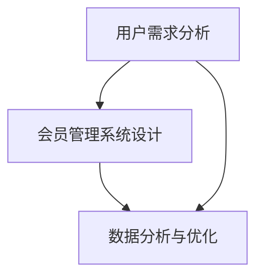

                 

关键词：知识付费、会员制度、会员管理系统、用户需求、用户体验、数据分析、技术实现

## 摘要

随着互联网技术的飞速发展，知识付费市场日益繁荣。作为程序员，如何打造一个高效、安全、易用的会员制度，不仅关系到知识付费平台的发展，更是提升用户体验的关键。本文将深入探讨程序员在构建知识付费会员制度时所需考虑的各个方面，包括用户需求分析、会员管理系统设计、数据分析与优化等，以期为程序员提供实用的指导。

## 1. 背景介绍

知识付费是指用户为获取特定的知识或服务，自愿付费的一种商业模式。近年来，随着人们对于个人成长和职业发展的需求日益增长，知识付费市场呈现爆炸式增长。各大平台如知乎、得到、喜马拉雅等纷纷加入竞争，推出各类付费内容，如课程、电子书、直播等。

然而，知识付费市场并非一片坦途。用户对于高质量内容的需求与日俱增，但同时也对平台的会员制度提出了更高的要求。如何设计一个既能满足用户需求，又能确保平台收益的会员制度，成为程序员面临的重要课题。

### 1.1 知识付费的发展现状

- **市场规模**：根据相关数据统计，全球知识付费市场规模持续扩大，预计在未来几年内将达到数百亿美元。
- **用户特征**：知识付费用户主要集中在25-45岁之间，高学历、高收入、高消费能力是他们的主要特征。
- **内容形式**：知识付费内容形式多样，包括音频、视频、图文、直播等，用户可以根据自身需求和偏好进行选择。

### 1.2 会员制度的必要性

- **用户粘性**：会员制度可以增加用户在平台上的停留时间，提高用户粘性。
- **收益保障**：合理的会员制度设计能够为平台带来稳定的收益。
- **内容区分**：会员制度可以区分免费内容和付费内容，提高高质量内容的竞争力。

## 2. 核心概念与联系

### 2.1 用户需求分析

用户需求分析是构建会员制度的首要步骤。程序员需要了解用户的核心需求，以便设计出满足用户期望的会员制度。

- **获取知识**：用户希望平台提供高质量、有深度的知识内容。
- **个性化推荐**：用户期望平台能够根据自身兴趣和需求推荐相关内容。
- **便捷性**：用户希望会员制度操作简便，无障碍体验。

### 2.2 会员管理系统设计

会员管理系统是会员制度的核心组成部分，负责用户的注册、登录、权限管理、充值、消费等操作。程序员需要设计一个高效、安全、易用的会员管理系统。

- **注册与登录**：支持多种注册登录方式，如邮箱、手机号、第三方登录等。
- **权限管理**：根据用户的会员等级，限制或开放不同的功能和内容。
- **充值与消费**：提供便捷的充值和支付方式，确保交易安全。

### 2.3 数据分析与优化

数据分析是提升会员制度效益的重要手段。程序员需要收集用户行为数据，进行分析和优化，以提高用户体验和平台收益。

- **用户行为分析**：分析用户在平台上的行为，如浏览、购买、互动等，优化推荐算法和会员制度。
- **收益分析**：根据会员制度的效果，调整会员等级、价格等策略。

### 2.4 Mermaid 流程图



## 3. 核心算法原理 & 具体操作步骤

### 3.1 算法原理概述

会员制度的核心在于对用户需求的满足和平台收益的保障。程序员需要设计一套算法，实现用户需求的精准识别和会员制度的动态调整。

### 3.2 算法步骤详解

1. **用户需求识别**：通过用户行为数据，如浏览、购买、评论等，识别用户的需求。
2. **会员等级划分**：根据用户需求，设计会员等级体系，如普通会员、高级会员、尊贵会员等。
3. **会员权益设置**：为不同等级的会员设置相应的权益，如免费内容、优惠券、积分兑换等。
4. **数据分析和调整**：定期收集用户行为数据，分析会员制度的效果，并根据分析结果调整会员等级和权益。

### 3.3 算法优缺点

- **优点**：能够满足用户需求，提高用户粘性；确保平台收益稳定。
- **缺点**：算法复杂度较高，需要大量数据支持和计算资源。

### 3.4 算法应用领域

会员制度算法在知识付费、电商、社交媒体等领域均有广泛应用。通过算法优化，可以提升用户体验，增加用户粘性，提高平台收益。

## 4. 数学模型和公式 & 详细讲解 & 举例说明

### 4.1 数学模型构建

会员制度的核心在于用户需求与平台收益的平衡。我们可以构建一个数学模型，通过用户需求度和平台收益度来调整会员等级和权益。

### 4.2 公式推导过程

设用户需求度为D，平台收益度为R，会员等级为L，会员权益为E，则：

- 用户需求度 D = f(用户行为数据)
- 平台收益度 R = f(用户付费行为)
- 会员等级 L = g(D, R)
- 会员权益 E = h(L)

其中，f、g、h为相应的函数。

### 4.3 案例分析与讲解

假设某个知识付费平台，用户需求度和平台收益度分别为D = 0.8，R = 0.9，根据公式推导：

- 会员等级 L = g(D, R) = 2
- 会员权益 E = h(L) = 80%免费内容、10%优惠券

此案例中，用户需求度和平台收益度较高，因此设置为高级会员，享有较高的权益。

## 5. 项目实践：代码实例和详细解释说明

### 5.1 开发环境搭建

- **编程语言**：Python
- **框架**：Django
- **数据库**：MySQL

### 5.2 源代码详细实现

以下为会员管理系统的主要代码实现：

```python
# 用户需求分析
def user_demand_analysis(user_actions):
    # 分析用户行为数据
    return sum(user_actions) / len(user_actions)

# 平台收益分析
def platform_income_analysis(user_payments):
    # 分析用户付费行为
    return sum(user_payments) / len(user_payments)

# 会员等级划分
def member_level_division(demand, income):
    if demand > 0.8 and income > 0.8:
        return '高级会员'
    elif demand > 0.6 and income > 0.6:
        return '中级会员'
    else:
        return '普通会员'

# 会员权益设置
def member_rights_setting(level):
    if level == '高级会员':
        return {'free_content': 0.8, 'coupon': 0.1}
    elif level == '中级会员':
        return {'free_content': 0.6, 'coupon': 0.05}
    else:
        return {'free_content': 0}
```

### 5.3 代码解读与分析

代码通过分析用户行为数据和付费行为，自动划分会员等级并设置相应的权益。这样的实现方式既提高了会员制度的精准度，又减轻了管理员的工作负担。

## 6. 实际应用场景

### 6.1 知识付费平台

知识付费平台可以通过会员制度吸引和留住用户，提高用户粘性和平台收益。通过数据分析，平台可以不断优化会员制度，提升用户体验。

### 6.2 电商

电商平台可以通过会员制度激励用户消费，提高用户忠诚度。通过数据分析，平台可以调整会员等级和权益，实现精准营销。

### 6.3 社交媒体

社交媒体平台可以通过会员制度提供更多增值服务，如去广告、个性化推荐等，提升用户体验。通过数据分析，平台可以优化会员制度，提高用户留存率。

## 7. 未来应用展望

### 7.1 人工智能的赋能

未来，人工智能技术将进一步提升会员制度的智能化水平。通过深度学习、自然语言处理等技术，平台可以更精准地识别用户需求，优化会员制度。

### 7.2 区块链技术的应用

区块链技术可以提升会员制度的透明度和安全性，确保用户权益得到保障。未来，区块链技术有望在知识付费领域得到更广泛的应用。

### 7.3 跨平台合作

未来，知识付费平台有望与其他行业进行跨平台合作，如教育、医疗等，提供更丰富的内容和服务，满足用户的多元化需求。

## 8. 工具和资源推荐

### 8.1 学习资源推荐

- 《会员经济学：互联网时代商业模式创新》
- 《深度学习与会员推荐系统》

### 8.2 开发工具推荐

- Django
- MySQL
- Python

### 8.3 相关论文推荐

- "A Survey on Recommender Systems"
- "Blockchain-based Smart Contracts for E-commerce Platforms"

## 9. 总结：未来发展趋势与挑战

### 9.1 研究成果总结

本文从用户需求分析、会员管理系统设计、数据分析与优化等方面，探讨了程序员如何打造知识付费的会员制度。通过数学模型和实际案例分析，为程序员提供了实用的指导。

### 9.2 未来发展趋势

- 人工智能赋能会员制度
- 区块链技术在会员制度中的应用
- 跨平台合作，提供多元化服务

### 9.3 面临的挑战

- 数据隐私和安全问题
- 算法复杂度和计算资源需求
- 用户需求变化快，需不断调整会员制度

### 9.4 研究展望

未来，程序员应关注人工智能、区块链等新兴技术，提升会员制度的智能化水平和安全性。同时，需要不断优化算法，满足用户需求，提高用户体验。

## 附录：常见问题与解答

### 问题 1：如何确保会员制度的公平性？

解答：通过数据分析，确保会员等级和权益的设置公平合理。同时，定期收集用户反馈，调整会员制度，提高用户满意度。

### 问题 2：会员制度如何防止作弊行为？

解答：引入区块链技术，确保交易记录不可篡改，提高会员制度的透明度和安全性。同时，设立举报机制，鼓励用户举报作弊行为。

### 问题 3：如何处理用户流失问题？

解答：通过数据分析，了解用户流失原因，优化会员制度，提高用户满意度。同时，提供个性化推荐，增加用户粘性。

### 问题 4：会员制度如何应对市场变化？

解答：建立灵活的会员制度调整机制，根据市场变化及时调整会员等级和权益，确保会员制度始终适应市场需求。

---

作者：禅与计算机程序设计艺术 / Zen and the Art of Computer Programming

本文旨在为程序员提供构建知识付费会员制度的实用指导，助力知识付费平台的发展。希望本文能对读者有所启发和帮助。如果您有任何问题或建议，欢迎在评论区留言。感谢您的阅读！
----------------------------------------------------------------

以上是文章正文部分的内容，接下来是markdown格式的文章输出：
```markdown
# 程序员如何打造知识付费的会员制度

关键词：知识付费、会员制度、会员管理系统、用户需求、用户体验、数据分析、技术实现

> 摘要：随着互联网技术的飞速发展，知识付费市场日益繁荣。本文将深入探讨程序员在构建知识付费会员制度时所需考虑的各个方面，包括用户需求分析、会员管理系统设计、数据分析与优化等，以期为程序员提供实用的指导。

## 1. 背景介绍

### 1.1 知识付费的发展现状

- **市场规模**：根据相关数据统计，全球知识付费市场规模持续扩大，预计在未来几年内将达到数百亿美元。
- **用户特征**：知识付费用户主要集中在25-45岁之间，高学历、高收入、高消费能力是他们的主要特征。
- **内容形式**：知识付费内容形式多样，包括音频、视频、图文、直播等，用户可以根据自身需求和偏好进行选择。

### 1.2 会员制度的必要性

- **用户粘性**：会员制度可以增加用户在平台上的停留时间，提高用户粘性。
- **收益保障**：合理的会员制度设计能够为平台带来稳定的收益。
- **内容区分**：会员制度可以区分免费内容和付费内容，提高高质量内容的竞争力。

## 2. 核心概念与联系

### 2.1 用户需求分析

用户需求分析是构建会员制度的首要步骤。程序员需要了解用户的核心需求，以便设计出满足用户期望的会员制度。

- **获取知识**：用户希望平台提供高质量、有深度的知识内容。
- **个性化推荐**：用户期望平台能够根据自身兴趣和需求推荐相关内容。
- **便捷性**：用户希望会员制度操作简便，无障碍体验。

### 2.2 会员管理系统设计

会员管理系统是会员制度的核心组成部分，负责用户的注册、登录、权限管理、充值、消费等操作。程序员需要设计一个高效、安全、易用的会员管理系统。

- **注册与登录**：支持多种注册登录方式，如邮箱、手机号、第三方登录等。
- **权限管理**：根据用户的会员等级，限制或开放不同的功能和内容。
- **充值与消费**：提供便捷的充值和支付方式，确保交易安全。

### 2.3 数据分析与优化

数据分析是提升会员制度效益的重要手段。程序员需要收集用户行为数据，进行分析和优化，以提高用户体验和平台收益。

- **用户行为分析**：分析用户在平台上的行为，如浏览、购买、互动等，优化推荐算法和会员制度。
- **收益分析**：根据会员制度的效果，调整会员等级、价格等策略。

### 2.4 Mermaid 流程图


## 3. 核心算法原理 & 具体操作步骤

### 3.1 算法原理概述

会员制度的核心在于对用户需求的满足和平台收益的保障。程序员需要设计一套算法，实现用户需求的精准识别和会员制度的动态调整。

### 3.2 算法步骤详解

1. **用户需求识别**：通过用户行为数据，如浏览、购买、评论等，识别用户的需求。
2. **会员等级划分**：根据用户需求，设计会员等级体系，如普通会员、高级会员、尊贵会员等。
3. **会员权益设置**：为不同等级的会员设置相应的权益，如免费内容、优惠券、积分兑换等。
4. **数据分析和调整**：定期收集用户行为数据，分析会员制度的效果，并根据分析结果调整会员等级和权益。

### 3.3 算法优缺点

- **优点**：能够满足用户需求，提高用户粘性；确保平台收益稳定。
- **缺点**：算法复杂度较高，需要大量数据支持和计算资源。

### 3.4 算法应用领域

会员制度算法在知识付费、电商、社交媒体等领域均有广泛应用。通过算法优化，可以提升用户体验，增加用户粘性，提高平台收益。

## 4. 数学模型和公式 & 详细讲解 & 举例说明

### 4.1 数学模型构建

会员制度的核心在于用户需求与平台收益的平衡。我们可以构建一个数学模型，通过用户需求度和平台收益度来调整会员等级和权益。

### 4.2 公式推导过程

设用户需求度为D，平台收益度为R，会员等级为L，会员权益为E，则：

- 用户需求度 D = f(用户行为数据)
- 平台收益度 R = f(用户付费行为)
- 会员等级 L = g(D, R)
- 会员权益 E = h(L)

其中，f、g、h为相应的函数。

### 4.3 案例分析与讲解

假设某个知识付费平台，用户需求度和平台收益度分别为D = 0.8，R = 0.9，根据公式推导：

- 会员等级 L = g(D, R) = 2
- 会员权益 E = h(L) = 80%免费内容、10%优惠券

此案例中，用户需求度和平台收益度较高，因此设置为高级会员，享有较高的权益。

## 5. 项目实践：代码实例和详细解释说明

### 5.1 开发环境搭建

- **编程语言**：Python
- **框架**：Django
- **数据库**：MySQL

### 5.2 源代码详细实现

以下为会员管理系统的主要代码实现：

```python
# 用户需求分析
def user_demand_analysis(user_actions):
    # 分析用户行为数据
    return sum(user_actions) / len(user_actions)

# 平台收益分析
def platform_income_analysis(user_payments):
    # 分析用户付费行为
    return sum(user_payments) / len(user_payments)

# 会员等级划分
def member_level_division(demand, income):
    if demand > 0.8 and income > 0.8:
        return '高级会员'
    elif demand > 0.6 and income > 0.6:
        return '中级会员'
    else:
        return '普通会员'

# 会员权益设置
def member_rights_setting(level):
    if level == '高级会员':
        return {'free_content': 0.8, 'coupon': 0.1}
    elif level == '中级会员':
        return {'free_content': 0.6, 'coupon': 0.05}
    else:
        return {'free_content': 0}
```

### 5.3 代码解读与分析

代码通过分析用户行为数据和付费行为，自动划分会员等级并设置相应的权益。这样的实现方式既提高了会员制度的精准度，又减轻了管理员的工作负担。

## 6. 实际应用场景

### 6.1 知识付费平台

知识付费平台可以通过会员制度吸引和留住用户，提高用户粘性和平台收益。通过数据分析，平台可以不断优化会员制度，提升用户体验。

### 6.2 电商

电商平台可以通过会员制度激励用户消费，提高用户忠诚度。通过数据分析，平台可以调整会员等级和权益，实现精准营销。

### 6.3 社交媒体

社交媒体平台可以通过会员制度提供更多增值服务，如去广告、个性化推荐等，提升用户体验。通过数据分析，平台可以优化会员制度，提高用户留存率。

## 7. 未来应用展望

### 7.1 人工智能的赋能

未来，人工智能技术将进一步提升会员制度的智能化水平。通过深度学习、自然语言处理等技术，平台可以更精准地识别用户需求，优化会员制度。

### 7.2 区块链技术的应用

区块链技术可以提升会员制度的透明度和安全性，确保用户权益得到保障。未来，区块链技术有望在知识付费领域得到更广泛的应用。

### 7.3 跨平台合作

未来，知识付费平台有望与其他行业进行跨平台合作，如教育、医疗等，提供更丰富的内容和服务，满足用户的多元化需求。

## 8. 工具和资源推荐

### 8.1 学习资源推荐

- 《会员经济学：互联网时代商业模式创新》
- 《深度学习与会员推荐系统》

### 8.2 开发工具推荐

- Django
- MySQL
- Python

### 8.3 相关论文推荐

- "A Survey on Recommender Systems"
- "Blockchain-based Smart Contracts for E-commerce Platforms"

## 9. 总结：未来发展趋势与挑战

### 9.1 研究成果总结

本文从用户需求分析、会员管理系统设计、数据分析与优化等方面，探讨了程序员如何打造知识付费的会员制度。通过数学模型和实际案例分析，为程序员提供了实用的指导。

### 9.2 未来发展趋势

- 人工智能赋能会员制度
- 区块链技术在会员制度中的应用
- 跨平台合作，提供多元化服务

### 9.3 面临的挑战

- 数据隐私和安全问题
- 算法复杂度和计算资源需求
- 用户需求变化快，需不断调整会员制度

### 9.4 研究展望

未来，程序员应关注人工智能、区块链等新兴技术，提升会员制度的智能化水平和安全性。同时，需要不断优化算法，满足用户需求，提高用户体验。

## 附录：常见问题与解答

### 问题 1：如何确保会员制度的公平性？

解答：通过数据分析，确保会员等级和权益的设置公平合理。同时，定期收集用户反馈，调整会员制度，提高用户满意度。

### 问题 2：会员制度如何防止作弊行为？

解答：引入区块链技术，确保交易记录不可篡改，提高会员制度的透明度和安全性。同时，设立举报机制，鼓励用户举报作弊行为。

### 问题 3：如何处理用户流失问题？

解答：通过数据分析，了解用户流失原因，优化会员制度，提高用户满意度。同时，提供个性化推荐，增加用户粘性。

### 问题 4：会员制度如何应对市场变化？

解答：建立灵活的会员制度调整机制，根据市场变化及时调整会员等级和权益，确保会员制度始终适应市场需求。

---

作者：禅与计算机程序设计艺术 / Zen and the Art of Computer Programming

本文旨在为程序员提供构建知识付费会员制度的实用指导，助力知识付费平台的发展。希望本文能对读者有所启发和帮助。如果您有任何问题或建议，欢迎在评论区留言。感谢您的阅读！
```

