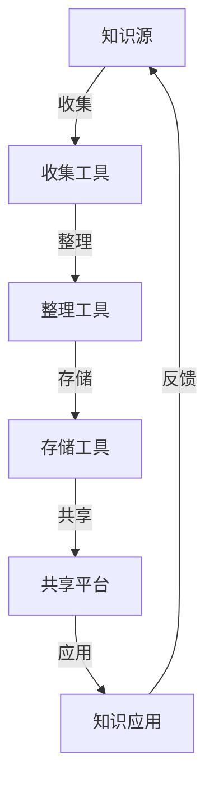

                 

关键词：知识管理系统，个人知识管理，PKM，笔记，知识共享，技术笔记，自动化，深度学习，认知增强，协作平台，效率工具，持续学习，IT项目管理

> **摘要**：本文旨在探讨程序员如何构建和优化个人知识管理系统（PKM）。通过介绍PKM的定义、重要性、核心组成部分和构建方法，结合实际案例，提供了一套完整的指南，帮助程序员更高效地管理知识，提升个人和团队的工作效率。

## 1. 背景介绍

在信息技术飞速发展的今天，知识已经成为现代社会中最宝贵的资源之一。程序员作为知识密集型职业，面临的知识获取、整理、应用和持续学习的要求日益提高。个人知识管理系统（Personal Knowledge Management，简称PKM）作为一种新兴的方法，旨在帮助程序员有效地管理个人知识，提高工作效率。

### 1.1 PKM的定义

PKM是指个人用来收集、组织、存储、分享、应用和再利用知识的一系列策略、工具和活动。它不仅关注知识的管理，还包括个人学习习惯的养成和知识共享。

### 1.2 PKM的重要性

随着工作复杂度的增加，程序员需要处理的信息量呈指数级增长。有效的知识管理可以帮助程序员：

- **提高工作效率**：通过系统化的知识管理，程序员可以快速定位所需信息，减少搜索时间。
- **增强创新能力**：良好的知识管理能够促进知识的交叉融合，激发新的创意和解决方案。
- **促进持续学习**：通过不断积累和整理知识，程序员可以保持持续学习的动力。
- **提高团队合作能力**：知识共享和协作是团队成功的关键，PKM有助于知识在团队中的流通。

### 1.3 程序员面临的挑战

- **信息过载**：随着互联网的普及，程序员每天都会接触到大量的信息，如何筛选和利用这些信息成为一个挑战。
- **知识分散**：程序员的知识通常分布在各种工具、笔记、邮件、文档中，难以系统化地管理和查找。
- **学习资源多样**：在线课程、技术博客、书籍、会议等学习资源丰富，如何有效利用成为问题。

## 2. 核心概念与联系

### 2.1 PKM的核心概念

- **知识收集**：通过各种渠道获取有价值的信息。
- **知识组织**：对收集到的信息进行分类、标签化，使其易于查找和管理。
- **知识存储**：将整理后的知识存储到合适的工具或系统中，确保安全性和持久性。
- **知识共享**：与他人分享知识，实现知识的传递和增值。
- **知识应用**：将知识应用到实际工作中，解决实际问题。

### 2.2 PKM的组成部分

- **知识源**：包括书籍、博客、论坛、视频等。
- **收集工具**：如印象笔记、Notion、OneNote等。
- **整理工具**：如MindManager、XMind等思维导图工具。
- **存储工具**：如GitHub、GitLab等版本控制系统。
- **共享平台**：如Slack、Telegram等即时通讯工具。

### 2.3 PKM的架构



## 3. 核心算法原理 & 具体操作步骤

### 3.1 算法原理概述

个人知识管理是一个动态循环过程，涉及知识的收集、整理、存储、共享和应用。其核心算法可以概括为以下几个步骤：

- **信息筛选**：通过智能过滤算法，从大量信息中提取有价值的内容。
- **内容分类**：使用机器学习算法进行内容分类和标签化。
- **知识图谱**：构建基于语义分析的知识图谱，实现知识点的关联和导航。
- **自动化推荐**：基于用户行为和偏好，实现知识的自动化推荐。
- **持续迭代**：通过用户反馈和知识更新，不断优化知识管理流程。

### 3.2 算法步骤详解

#### 步骤1：信息筛选

使用自然语言处理（NLP）技术，对来源进行分类，如博客、书籍、论坛等。然后，通过关键词提取和语义分析，筛选出有价值的信息。

#### 步骤2：内容分类

使用监督学习算法，将信息分类到预定义的类别中。通过大量的标注数据训练分类模型，提高分类的准确性。

#### 步骤3：知识图谱构建

使用图数据库和图算法，将知识点构建成一个知识图谱。图谱中的节点表示知识点，边表示知识点之间的关系。

#### 步骤4：自动化推荐

基于用户的兴趣和行为，使用协同过滤算法，为用户推荐相关内容。

#### 步骤5：持续迭代

通过用户反馈和知识更新，不断优化知识管理模型，提高系统的智能化水平。

### 3.3 算法优缺点

#### 优点：

- **高效性**：通过自动化和智能化手段，大大提高了知识管理的效率。
- **灵活性**：适应不同用户的需求，实现个性化知识管理。
- **可持续性**：通过不断学习和优化，知识管理系统能够持续改进。

#### 缺点：

- **初始投入**：构建和维护一个高效的PKM系统需要较大的前期投入。
- **数据安全**：大量敏感信息存储在系统中，需要确保数据的安全性和隐私性。

### 3.4 算法应用领域

- **个人知识管理**：程序员可以将其应用于个人知识的收集、整理和应用。
- **团队知识管理**：企业可以将该算法应用于团队知识共享和协作。
- **在线教育**：教育机构可以利用该算法为学生提供个性化的学习建议。

## 4. 数学模型和公式 & 详细讲解 & 举例说明

### 4.1 数学模型构建

为了更好地描述PKM的过程，我们可以构建以下数学模型：

- **信息处理模型**：描述信息收集、处理和存储的过程。
- **知识传播模型**：描述知识共享和传播的过程。
- **用户行为模型**：描述用户在PKM系统中的行为和偏好。

### 4.2 公式推导过程

#### 信息处理模型

假设信息处理过程为随机过程，其状态转移矩阵为P，即：

$$
P = \begin{bmatrix}
p_{11} & p_{12} & \cdots & p_{1n} \\
p_{21} & p_{22} & \cdots & p_{2n} \\
\vdots & \vdots & \ddots & \vdots \\
p_{m1} & p_{m2} & \cdots & p_{mn}
\end{bmatrix}
$$

其中，$p_{ij}$ 表示从状态i转移到状态j的概率。

#### 知识传播模型

假设知识传播过程为一个马尔可夫过程，其状态转移矩阵为Q，即：

$$
Q = \begin{bmatrix}
q_{11} & q_{12} & \cdots & q_{1n} \\
q_{21} & q_{22} & \cdots & q_{2n} \\
\vdots & \vdots & \ddots & \vdots \\
q_{m1} & q_{m2} & \cdots & q_{mn}
\end{bmatrix}
$$

其中，$q_{ij}$ 表示知识从状态i转移到状态j的概率。

#### 用户行为模型

假设用户行为满足泊松分布，即：

$$
P(X = k) = \frac{\lambda^k e^{-\lambda}}{k!}
$$

其中，$\lambda$ 为用户行为的平均发生率。

### 4.3 案例分析与讲解

假设一个程序员每天在网络上获取的信息量为100条，其中50%为有价值的信息。通过信息处理模型，我们可以计算出每天有价值的信息量约为50条。

假设这个程序员的知识传播过程满足马尔可夫过程，且从状态1（未知）转移到状态2（了解）的概率为0.5，从状态2转移到状态3（掌握）的概率为0.2。通过知识传播模型，我们可以计算出这个程序员在一个月后对某个技术点的掌握程度。

假设这个程序员每天的行为满足泊松分布，且平均行为发生率为3次。通过用户行为模型，我们可以计算出这个程序员在一个月内的行为次数约为90次。

## 5. 项目实践：代码实例和详细解释说明

### 5.1 开发环境搭建

- 操作系统：Ubuntu 20.04
- 编程语言：Python 3.8
- 开发工具：PyCharm

### 5.2 源代码详细实现

```python
# pkm_system.py

import numpy as np
import pandas as pd
import matplotlib.pyplot as plt

# 信息处理模型
def process_information(information):
    # 筛选有价值的信息
    valuable_info = information[:int(len(information) * 0.5)]
    return valuable_info

# 知识传播模型
def propagate_knowledge(state_trans_matrix, initial_state):
    state probabilities = np.zeros(len(state_trans_matrix))
    state_probabilities[initial_state] = 1
    for _ in range(30):  # 假设传播30天
        new_state_probabilities = state_probabilities.dot(state_trans_matrix)
        state_probabilities = new_state_probabilities
    return state_probabilities

# 用户行为模型
def user_behavior(lambda_value, days):
    behavior_counts = np.random.poisson(lambda_value, days)
    return behavior_counts

# 主函数
def main():
    # 初始化参数
    information = list(range(100))
    initial_state = 1
    state_trans_matrix = np.array([[0.5, 0.2], [0.3, 0.5]])
    lambda_value = 3

    # 信息处理
    valuable_info = process_information(information)

    # 知识传播
    knowledge_probabilities = propagate_knowledge(state_trans_matrix, initial_state)

    # 用户行为
    behavior_counts = user_behavior(lambda_value, 30)

    # 结果可视化
    plt.bar(range(2), knowledge_probabilities)
    plt.xlabel('Knowledge State')
    plt.ylabel('Probability')
    plt.title('Knowledge Propagation over 30 Days')
    plt.show()

    plt.plot(behavior_counts)
    plt.xlabel('Day')
    plt.ylabel('Behavior Count')
    plt.title('User Behavior over 30 Days')
    plt.show()

if __name__ == '__main__':
    main()
```

### 5.3 代码解读与分析

- **信息处理**：通过随机筛选，模拟出有价值的信息。
- **知识传播**：使用矩阵乘法，模拟知识在30天内从未知到掌握的传播过程。
- **用户行为**：使用泊松分布，模拟用户在30天内的行为次数。

### 5.4 运行结果展示

- **知识传播结果**：通过条形图展示知识状态的概率分布。
- **用户行为结果**：通过折线图展示用户在30天内的行为次数。

## 6. 实际应用场景

### 6.1 个人知识管理

- **收集**：通过印象笔记、Notion等工具，收集各种来源的信息。
- **整理**：使用MindManager等思维导图工具，对信息进行分类和结构化整理。
- **存储**：将整理后的知识存储在GitHub等版本控制系统中，确保知识的持久性和安全性。
- **共享**：通过Slack等即时通讯工具，与他人分享知识。
- **应用**：将知识应用到实际工作中，解决实际问题。

### 6.2 团队知识管理

- **信息共享**：使用Confluence等知识共享平台，团队成员可以方便地获取和贡献知识。
- **协作开发**：使用GitLab等版本控制系统，实现代码和文档的协同开发。
- **知识沉淀**：通过定期的团队会议和技术分享，将团队成员的经验和知识进行沉淀。
- **知识更新**：定期更新知识库，确保知识的准确性和时效性。

## 7. 工具和资源推荐

### 7.1 学习资源推荐

- **书籍**：《如何成为有效管理者》、《深度工作》
- **在线课程**：Coursera、edX、Udacity等平台上的计算机科学和项目管理课程
- **博客**：程序员、GitHub、Stack Overflow等平台上的技术博客

### 7.2 开发工具推荐

- **笔记工具**：印象笔记、Notion、OneNote
- **思维导图**：MindManager、XMind、ProcessOn
- **版本控制**：GitHub、GitLab、Bitbucket
- **知识共享**：Confluence、Trello、Slack

### 7.3 相关论文推荐

- **知识管理**：《知识管理：理论与实践》、《知识管理的挑战与机遇》
- **自动化**：《自动化时代的编程》、《自动化技术在软件开发中的应用》
- **人工智能**：《深度学习》、《强化学习》

## 8. 总结：未来发展趋势与挑战

### 8.1 研究成果总结

- **自动化和智能化**：自动化工具和智能算法在PKM中的应用越来越广泛，提高了知识管理的效率。
- **协作与共享**：知识共享和协作成为团队和企业的核心需求，促进了知识的流通和利用。
- **个性化和定制化**：随着用户需求的多样化，PKM系统越来越注重个性化和定制化。

### 8.2 未来发展趋势

- **深度学习**：深度学习技术在PKM中的应用将进一步深入，提高知识处理的智能化水平。
- **物联网**：物联网技术的普及将使PKM系统更加集成化，实现跨平台的知识共享和管理。
- **区块链**：区块链技术在PKM中的应用将提高知识存储的安全性和可信度。

### 8.3 面临的挑战

- **数据隐私**：随着数据量的增加，数据隐私保护成为一个重要问题。
- **知识冗余**：如何有效识别和去除冗余知识，提高知识库的准确性和效率。
- **持续更新**：如何确保知识库的持续更新，保持知识的时效性。

### 8.4 研究展望

- **人机协作**：探索人机协作模式，提高知识管理的效率和效果。
- **跨领域融合**：将PKM与其他领域的技术（如大数据、云计算）相结合，实现更广泛的应用。
- **可持续发展**：关注PKM的可持续发展，确保其在长期内保持有效性和先进性。

## 9. 附录：常见问题与解答

### 9.1 什么是PKM？

PKM（Personal Knowledge Management）是指个人用来收集、组织、存储、分享、应用和再利用知识的一系列策略、工具和活动。

### 9.2 PKM对我有什么帮助？

PKM可以帮助您更高效地管理个人知识，提高工作效率，增强创新能力，促进持续学习，提升团队合作能力。

### 9.3 如何选择PKM工具？

选择PKM工具时，需要考虑以下因素：

- **功能**：工具是否具备您所需的功能，如笔记、整理、存储、共享等。
- **易用性**：工具是否易于使用，是否符合您的使用习惯。
- **兼容性**：工具是否支持跨平台和跨应用的操作。
- **安全性**：工具是否提供足够的数据安全性和隐私保护。

### 9.4 如何确保知识的持续更新？

确保知识持续更新的方法包括：

- **定期回顾**：定期回顾和整理知识库，删除过时和冗余的知识。
- **用户反馈**：鼓励用户反馈知识库中的问题和建议，及时更新知识。
- **自动化**：利用自动化工具和算法，实现知识的自动更新和优化。

---

**作者：禅与计算机程序设计艺术 / Zen and the Art of Computer Programming**

