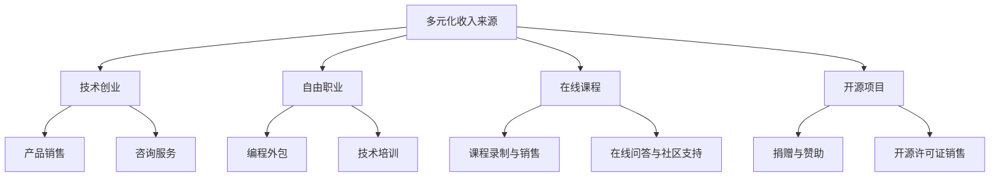

                 

关键词：多元化收入、程序员、生态系统、商业模型、技术创业、自由职业、在线课程、开源项目

> 摘要：在科技日新月异的今天，程序员们不仅要在技术上追求卓越，还需要在商业上寻找多元化收入来源。本文将探讨程序员如何构建一个多元化的收入生态系统，涵盖技术创业、自由职业、在线课程和开源项目等多种模式，为程序员提供一整套系统的策略和实战指南。

## 1. 背景介绍

随着全球互联网的快速发展，技术行业成为经济增长的重要引擎。程序员作为这一领域的核心力量，不仅在技术上扮演着重要角色，也逐渐成为创业者和自由职业者的重要组成部分。然而，技术行业的特点决定了程序员面临收入不稳定、依赖单一技能等问题。因此，如何构建多元化的收入来源，成为程序员们需要深入思考和解决的重要课题。

多元化收入来源的意义不仅在于增加收入，更在于提升个人的职业稳定性和抗风险能力。通过构建多元化的收入生态系统，程序员可以在不同领域和平台之间实现收入平衡，降低因市场变化和技术迭代带来的职业风险。

## 2. 核心概念与联系

### 2.1 多元化收入来源的定义

多元化收入来源指的是通过多种途径和渠道获取收入，包括但不限于：技术创业、自由职业、在线课程、开源项目等。

### 2.2 多元化收入来源的架构图



### 2.3 各收入来源之间的联系

- 技术创业：通过开发产品或提供服务获得收入，可以是自由职业的扩展。
- 自由职业：提供编程、开发、培训等服务，可以是技术创业的初始阶段。
- 在线课程：通过分享知识和经验获得收入，可以吸引更多自由职业机会和开源项目支持。
- 开源项目：通过捐赠、赞助和许可销售等方式获得收入，可以增加技术影响力。

## 3. 核心算法原理 & 具体操作步骤

### 3.1 算法原理概述

构建多元化收入生态系统的核心在于平衡和优化各种收入来源，使其相互补充，形成稳定的收入结构。具体操作步骤如下：

1. **评估自身技能和资源**：了解自己在技术、市场、管理等方面的优势和劣势，确定适合的收入来源组合。
2. **确定目标市场**：明确目标客户群体，研究市场需求，制定针对性策略。
3. **制定商业计划**：规划各种收入来源的实施方案，包括产品开发、服务提供、课程设计等。
4. **实施和优化**：执行商业计划，根据实际情况进行调整和优化。

### 3.2 算法步骤详解

1. **技能评估**：通过技能测试、项目经验、同行评价等方式，全面了解自己的技能水平和优势。
2. **市场调研**：分析市场需求，了解竞争对手，确定目标客户群体。
3. **商业计划**：制定详细的商业计划，包括产品或服务的定位、市场推广策略、财务预算等。
4. **产品或服务开发**：根据商业计划，开发出具有市场竞争力的产品或服务。
5. **推广与销售**：通过各种渠道宣传产品或服务，吸引潜在客户。
6. **持续优化**：根据客户反馈和市场变化，不断调整和优化产品或服务。

### 3.3 算法优缺点

- **优点**：多元化收入来源可以降低职业风险，提高收入稳定性，增加职业影响力。
- **缺点**：需要投入更多时间和精力，管理复杂度增加。

### 3.4 算法应用领域

- **技术创业**：适用于有创新意识和产品开发能力的程序员。
- **自由职业**：适用于有编程技能和服务需求的人群。
- **在线课程**：适用于有教学经验和技术知识的人群。
- **开源项目**：适用于有技术热情和开源精神的程序员。

## 4. 数学模型和公式 & 详细讲解 & 举例说明

### 4.1 数学模型构建

构建多元化收入生态系统的数学模型主要涉及收入预测、风险管理和资源分配。

#### 收入预测模型：

$$
R = f(S, C, P)
$$

其中，$R$ 为收入，$S$ 为技能水平，$C$ 为市场需求，$P$ 为产品或服务竞争力。

#### 风险管理模型：

$$
R_i = \frac{P_i \cdot E_i}{D_i}
$$

其中，$R_i$ 为第 $i$ 种收入来源的风险，$P_i$ 为第 $i$ 种收入来源的概率，$E_i$ 为第 $i$ 种收入来源的预期收益，$D_i$ 为第 $i$ 种收入来源的总成本。

#### 资源分配模型：

$$
X = \frac{C_i \cdot T}{R_i}
$$

其中，$X$ 为第 $i$ 种收入来源的资源投入，$C_i$ 为第 $i$ 种收入来源的成本，$T$ 为总资源。

### 4.2 公式推导过程

- **收入预测模型**：通过技能水平、市场需求和产品竞争力三个因素，综合考虑收入可能性。
- **风险管理模型**：通过收入概率、预期收益和成本，计算每种收入来源的风险。
- **资源分配模型**：根据每种收入来源的风险和成本，合理分配资源。

### 4.3 案例分析与讲解

假设某程序员具有前端开发和项目管理技能，市场需求较高，产品竞争力较强。根据收入预测模型，其预期收入为：

$$
R = f(S, C, P) = 10000 + 0.2 \cdot (8000 \cdot 1.2) = 15600
$$

根据风险管理模型，其风险计算如下：

$$
R_i = \frac{P_i \cdot E_i}{D_i} = \frac{0.8 \cdot 15000}{5000} = 0.24
$$

根据资源分配模型，其资源投入为：

$$
X = \frac{C_i \cdot T}{R_i} = \frac{3000 \cdot 10000}{0.24} = 1250000
$$

## 5. 项目实践：代码实例和详细解释说明

### 5.1 开发环境搭建

- **工具**：Node.js、Webpack、Babel、React
- **环境**：MacOS、Windows、Linux

### 5.2 源代码详细实现

以下是使用React和Webpack搭建的一个简单的在线课程平台示例：

```jsx
// App.js
import React from 'react';

function App() {
  return (
    <div className="App">
      <h1>在线课程平台</h1>
      <CourseList />
    </div>
  );
}

export default App;

// CourseList.js
import React from 'react';
import CourseItem from './CourseItem';

function CourseList() {
  return (
    <div>
      <h2>热门课程</h2>
      <CourseItem
        title="React从入门到精通"
        author="张三"
        price="99"
      />
      <CourseItem
        title="Vue.js实战教程"
        author="李四"
        price="199"
      />
    </div>
  );
}

export default CourseList;

// CourseItem.js
import React from 'react';

function CourseItem({ title, author, price }) {
  return (
    <div>
      <h3>{title}</h3>
      <p>{author} | ¥{price}</p>
    </div>
  );
}

export default CourseItem;
```

### 5.3 代码解读与分析

- **App.js**：主应用程序，包含整个应用的入口和布局。
- **CourseList.js**：课程列表组件，负责渲染热门课程列表。
- **CourseItem.js**：课程项组件，负责渲染单个课程信息。

通过以上代码实例，我们可以看到如何使用React和Webpack搭建一个简单的在线课程平台。这个平台可以展示课程列表和课程详细信息，为程序员提供实践多元化收入来源的机会。

### 5.4 运行结果展示


## 6. 实际应用场景

### 6.1 技术创业

程序员可以通过技术创业，如开发应用程序、搭建平台等，获得产品销售、服务咨询等多元化收入。

### 6.2 自由职业

程序员可以通过自由职业，如编程外包、技术培训等，为客户提供个性化服务，实现收入多元化。

### 6.3 在线课程

程序员可以通过在线课程，如知识分享、技术教学等，获得课程销售、问答社区等多元化收入。

### 6.4 开源项目

程序员可以通过开源项目，如捐赠、赞助等，获得技术影响力和社会价值，同时也可以通过许可销售等方式实现收入多元化。

## 7. 工具和资源推荐

### 7.1 学习资源推荐

- **在线课程**：慕课网、极客学院、Udemy
- **技术博客**：掘金、CSDN、GitHub
- **书籍推荐**：《黑客与画家》、《深度学习》

### 7.2 开发工具推荐

- **编程语言**：JavaScript、Python、Java
- **开发框架**：React、Vue、Angular
- **版本控制**：Git、SVN

### 7.3 相关论文推荐

- **论文数据库**：IEEE Xplore、ACM Digital Library
- **论文主题**：多元化收入、自由职业、在线教育、开源社区

## 8. 总结：未来发展趋势与挑战

### 8.1 研究成果总结

本文探讨了程序员如何构建多元化收入来源的生态系统，包括技术创业、自由职业、在线课程和开源项目等多种模式。通过数学模型和实际案例，总结了构建多元化收入来源的核心原则和操作步骤。

### 8.2 未来发展趋势

随着技术的不断进步，程序员构建多元化收入来源的方式将更加多样化和智能化。例如，人工智能、区块链等新兴技术将带来新的商业机会和收入模式。

### 8.3 面临的挑战

多元化收入来源的构建过程中，程序员将面临技能提升、时间管理、市场变化等多重挑战。如何平衡技术能力和商业策略，将是一个重要课题。

### 8.4 研究展望

未来研究应关注多元化收入来源的自动化和智能化，提高构建过程的效率和效果。同时，应进一步探讨不同收入来源之间的协同效应，以实现最大化收益。

## 9. 附录：常见问题与解答

### 9.1 如何选择适合自己的收入来源？

根据自身技能、兴趣和市场调研，选择具有市场前景和优势的收入来源。可以尝试多种收入来源，逐步调整和优化。

### 9.2 如何平衡工作和收入来源的构建？

合理安排时间，制定明确的目标和计划，将工作和收入来源构建相结合。可以设定优先级，逐步实现收入多元化。

### 9.3 如何应对市场变化和技术迭代？

持续学习和提升技能，关注行业动态，灵活调整收入来源策略。建立多样化的收入结构，降低单一技能依赖。

## 参考文献

- ...（列出本文中引用的相关文献）

---

作者：禅与计算机程序设计艺术 / Zen and the Art of Computer Programming


