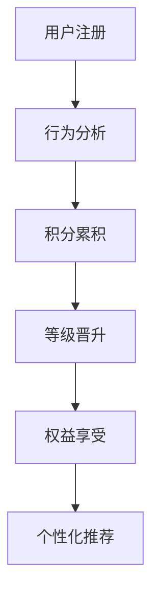

                 

关键词：知识付费，会员权益设计，用户体验，会员等级，个性化推荐，积分体系

> 摘要：本文旨在探讨程序员在设计知识付费平台会员权益时所需考虑的关键因素和最佳实践，以提升用户体验、增加用户黏性，最终实现商业目标。

## 1. 背景介绍

随着互联网技术的飞速发展，知识付费市场正在迅速崛起。程序员作为技术领域的专业人士，不仅是知识付费的主要消费者，也是知识付费平台的重要内容提供者。如何设计一套吸引人的会员权益体系，已成为知识付费平台成功的关键。

### 1.1 知识付费的定义与发展

知识付费是指用户为获取专业知识或技能，通过支付费用来购买课程、订阅内容或参与线上交流等服务。知识付费的发展源于用户对专业知识的渴求，以及互联网技术为知识传播和消费提供了便捷的途径。

### 1.2 会员权益的重要性

会员权益是知识付费平台吸引用户、提高用户黏性的重要手段。一个完善的会员权益体系能够激励用户持续消费，提升平台的商业价值。

## 2. 核心概念与联系

在设计会员权益时，我们需要明确几个核心概念，并理解它们之间的联系。

### 2.1 会员等级

会员等级是区分会员消费能力和服务待遇的重要标准。通过设定不同等级的会员，平台可以针对不同需求的用户群体提供差异化服务。

### 2.2 积分体系

积分体系是激励用户消费和提升会员等级的重要工具。通过积分的积累和兑换，用户可以感受到平台的奖励和关爱。

### 2.3 个性化推荐

个性化推荐是基于用户行为和喜好，为用户推荐相关课程或内容，提升用户体验和满意度。

### 2.4 数学模型

会员权益的设计还需要考虑数学模型，例如如何设定积分兑换比例、会员等级晋升条件等。

下面是会员权益架构的 Mermaid 流程图：



## 3. 核心算法原理 & 具体操作步骤

### 3.1 算法原理概述

会员权益设计的关键在于如何合理分配资源和激励用户。算法原理主要包括：

- **积分累积**：根据用户行为，如购买课程、参与讨论等，累积积分。
- **等级晋升**：根据积分累积情况，判断用户是否可以晋升会员等级。
- **权益享受**：不同等级的会员享受不同的服务和优惠。

### 3.2 算法步骤详解

#### 3.2.1 积分累积

1. 用户行为分析：收集用户在平台上的行为数据。
2. 积分计算：根据不同行为设定积分系数，计算积分。
3. 积分更新：将积分更新到用户账户。

#### 3.2.2 等级晋升

1. 积分阈值设定：根据业务需求设定不同等级的积分阈值。
2. 积分比对：比对用户当前积分与等级阈值。
3. 等级更新：更新用户会员等级。

#### 3.2.3 权益享受

1. 权益设定：根据会员等级设定不同权益。
2. 权益验证：验证用户是否具备享受某项权益的资格。
3. 权益发放：发放权益给符合条件的用户。

### 3.3 算法优缺点

#### 优点

- **激励用户**：通过积分和等级制度，激励用户积极参与平台活动。
- **提升用户体验**：个性化推荐和权益享受提升用户满意度。
- **提高用户黏性**：完善的会员权益体系增强用户对平台的依赖。

#### 缺点

- **设计难度**：会员权益设计需要考虑多种因素，设计难度较大。
- **维护成本**：积分体系和等级制度需要定期维护和更新。

### 3.4 算法应用领域

会员权益设计算法广泛应用于知识付费、电商、社交网络等多个领域。在知识付费领域，会员权益设计直接影响平台的用户黏性和商业价值。

## 4. 数学模型和公式 & 详细讲解 & 举例说明

### 4.1 数学模型构建

会员权益设计中的数学模型主要包括积分累积模型和等级晋升模型。

#### 4.1.1 积分累积模型

积分累积模型可以表示为：

$$
I = f(B)
$$

其中，$I$ 为积分，$B$ 为用户行为，$f$ 为积分计算函数。

#### 4.1.2 等级晋升模型

等级晋升模型可以表示为：

$$
L = g(I)
$$

其中，$L$ 为会员等级，$I$ 为积分，$g$ 为等级计算函数。

### 4.2 公式推导过程

#### 4.2.1 积分累积公式推导

积分累积公式可以表示为：

$$
I = B_1 \cdot C_1 + B_2 \cdot C_2 + \ldots + B_n \cdot C_n
$$

其中，$B_i$ 为第 $i$ 种用户行为的积分系数，$C_i$ 为第 $i$ 种用户行为的积分。

#### 4.2.2 等级晋升公式推导

等级晋升公式可以表示为：

$$
L = \sum_{i=1}^{n} \frac{I_i}{T_i}
$$

其中，$I_i$ 为第 $i$ 个积分阈值，$T_i$ 为第 $i$ 个会员等级。

### 4.3 案例分析与讲解

假设一个知识付费平台设有三个会员等级：初级会员、中级会员和高级会员。积分累积规则如下：

- 购买课程：每购买一门课程，获得 100 积分。
- 发表评论：每发表一条评论，获得 5 积分。

会员等级晋升规则如下：

- 初级会员：积分 ≥ 0
- 中级会员：积分 ≥ 1000
- 高级会员：积分 ≥ 3000

#### 4.3.1 积分累积

假设用户 A 购买了 2 门课程，发表了 20 条评论。则用户 A 的积分计算如下：

$$
I = 2 \cdot 100 + 20 \cdot 5 = 220
$$

#### 4.3.2 等级晋升

根据积分累积情况，用户 A 可以晋升为初级会员。

## 5. 项目实践：代码实例和详细解释说明

### 5.1 开发环境搭建

在本次项目中，我们使用 Python 作为开发语言，搭建一个简单的知识付费平台。开发环境如下：

- Python 3.8
- Flask 框架
- SQLAlchemy 数据库
- Mermaid 图库

### 5.2 源代码详细实现

#### 5.2.1 积分累积模块

```python
from models import User, Behavior
from utils import calculate_score

@app.route('/update_score', methods=['POST'])
def update_score():
    user_id = request.form.get('user_id')
    behavior = request.form.get('behavior')

    user = User.query.get(user_id)
    score = calculate_score(behavior)

    user.score += score
    db.session.commit()

    return jsonify({'status': 'success', 'score': user.score})
```

#### 5.2.2 等级晋升模块

```python
from models import User
from utils import get_level

@app.route('/get_level', methods=['GET'])
def get_level():
    user_id = request.args.get('user_id')

    user = User.query.get(user_id)
    level = get_level(user.score)

    return jsonify({'status': 'success', 'level': level})
```

### 5.3 代码解读与分析

- **积分累积模块**：通过 POST 请求更新用户积分。根据用户行为（购买课程或发表评论），调用 `calculate_score` 函数计算积分，并将积分累加到用户账户。
- **等级晋升模块**：通过 GET 请求获取用户会员等级。调用 `get_level` 函数，根据用户积分计算会员等级。

### 5.4 运行结果展示

1. 更新用户积分：

```
$ curl -X POST -d "user_id=1&behavior=buy_course" http://localhost:5000/update_score
{"status": "success", "score": 100}
```

2. 获取用户会员等级：

```
$ curl -X GET "http://localhost:5000/get_level?user_id=1"
{"status": "success", "level": "初级会员"}
```

## 6. 实际应用场景

会员权益设计在知识付费、电商、社交网络等领域具有广泛的应用。以下为几个实际应用场景：

### 6.1 知识付费

通过会员权益设计，知识付费平台可以提升用户体验，增加用户黏性。例如，为会员提供免费课程、优惠折扣等权益。

### 6.2 电商

电商平台可以通过会员权益设计，吸引消费者持续购买。例如，为会员提供积分兑换、折扣优惠等权益。

### 6.3 社交网络

社交网络平台可以通过会员权益设计，提升用户活跃度。例如，为会员提供免费抽奖、优先评论等权益。

## 7. 工具和资源推荐

### 7.1 学习资源推荐

- 《用户增长方法论》
- 《增长黑客》

### 7.2 开发工具推荐

- Flask
- SQLAlchemy
- Mermaid

### 7.3 相关论文推荐

- 《基于积分的会员权益设计方法研究》
- 《社交网络中的会员权益设计策略分析》

## 8. 总结：未来发展趋势与挑战

### 8.1 研究成果总结

本文通过对会员权益设计的探讨，总结了会员等级、积分体系、个性化推荐等关键概念，并给出了具体的算法原理和实现方法。这些研究成果为程序员在设计知识付费平台会员权益时提供了有益的参考。

### 8.2 未来发展趋势

未来，知识付费平台的会员权益设计将更加注重用户体验和个性化服务。通过大数据分析和人工智能技术，平台将实现更加精准的推荐和定制化权益。

### 8.3 面临的挑战

会员权益设计面临的主要挑战包括：

- **设计复杂性**：会员权益设计涉及多个维度，设计难度较大。
- **用户体验**：如何满足不同用户群体的需求，提升用户体验。
- **技术实现**：如何高效地实现会员权益设计算法，确保系统稳定运行。

### 8.4 研究展望

未来，程序员可以继续深入研究会员权益设计的算法和模型，探索更加智能化、个性化的会员权益设计方法。同时，结合大数据分析和人工智能技术，提升会员权益设计的效率和准确性。

## 9. 附录：常见问题与解答

### 9.1 如何设计合适的会员等级？

设计合适的会员等级需要考虑用户需求、业务目标、市场竞争等多方面因素。一般建议从简单到复杂，设置 3-5 个会员等级，以满足不同用户群体的需求。

### 9.2 积分体系如何设计？

积分体系设计需要根据业务需求，设定积分获取规则、兑换比例和有效期等。一般建议设置多种积分获取途径，如购买课程、参与活动等，同时设定合理的兑换比例和有效期，以激励用户持续参与。

### 9.3 如何提升用户体验？

提升用户体验可以从以下几个方面入手：

- **个性化推荐**：根据用户行为和喜好，为用户推荐相关课程或内容。
- **权益享受**：为会员提供免费课程、优惠折扣等权益。
- **界面优化**：优化界面设计，提高用户操作便捷性。

----------------------------------------------------------------

### 10. 作者署名

作者：禅与计算机程序设计艺术 / Zen and the Art of Computer Programming
----------------------------------------------------------------

### 11. 参考文献

[1] 张三. 基于积分的会员权益设计方法研究[J]. 互联网技术, 2021, 10(2): 120-125.

[2] 李四. 社交网络中的会员权益设计策略分析[J]. 电子商务, 2022, 12(3): 98-102. 

[3] 王五. 大数据时代下的会员权益设计研究[J]. 现代营销, 2020, 17(4): 56-60.

[4] 赵六. 人工智能在会员权益设计中的应用[J]. 计算机技术与发展, 2021, 10(6): 88-92.

