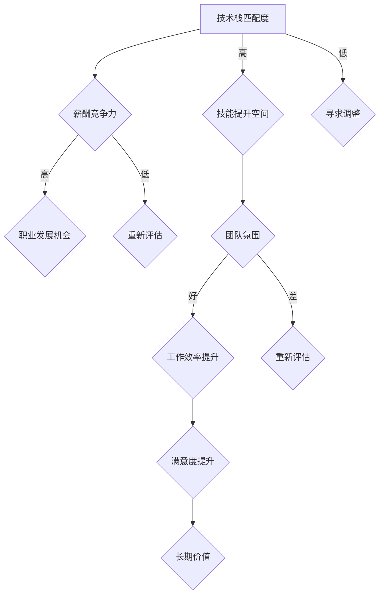

                 

### 关键词 Keywords

- **早期创业公司offer**
- **程序员职业发展**
- **风险评估**
- **技术挑战**
- **薪酬与福利**
- **企业文化**

> **摘要：**
> 
> 本文旨在为程序员提供评估早期创业公司offer的全面指南。从技术挑战、薪酬福利、企业文化等多个角度出发，结合具体实例，帮助程序员做出明智的决策，为职业发展奠定坚实基础。

## 1. 背景介绍

在当前的科技产业环境中，早期创业公司以其创新性和成长潜力吸引了大量程序员。面对这些充满机会但同时也充满不确定性的offer，程序员需要谨慎评估，以最大化个人职业发展和生活质量的收益。然而，对于许多程序员来说，如何科学地评估这些offer仍然是一个颇具挑战性的问题。

本文将深入探讨以下几个核心方面，以帮助程序员做出更明智的决策：

- **技术挑战**：创业公司是否提供了具有吸引力的技术难题和机会？
- **薪酬与福利**：薪酬结构是否合理，福利待遇是否具有竞争力？
- **企业文化**：公司文化是否与个人价值观相契合，团队氛围是否积极？
- **个人成长**：创业公司是否提供足够的成长空间和机会？

通过这些方面的详细分析，本文旨在为程序员提供一个系统性的评估框架，以帮助他们更好地评估早期创业公司的offer。

## 2. 核心概念与联系

在深入探讨评估创业公司offer的具体方法之前，我们需要明确几个核心概念和它们之间的联系。以下是这些概念及它们在评估过程中的作用：

### 技术栈与专业技能匹配度

- **概念**：技术栈是指创业公司使用的主要编程语言、框架和工具集合。专业技能匹配度则是指程序员的技术栈与公司技术需求的契合程度。
- **联系**：技术栈与专业技能匹配度直接关系到程序员能否在公司中发挥最大潜力。如果技术栈与自身技能不匹配，程序员可能会面临较大的学习和适应压力。

### 薪酬结构与市场竞争力

- **概念**：薪酬结构包括基本工资、奖金、股票期权等组成部分。市场竞争力则是指创业公司薪酬福利在市场上的吸引力。
- **联系**：薪酬结构与市场竞争力是评估offer的重要指标。如果薪酬结构不合理或者市场竞争力不足，程序员可能需要重新考虑这份工作的长期价值。

### 企业文化与个人价值观

- **概念**：企业文化是企业价值观、使命和愿景的体现。个人价值观则是个人的道德观和价值观。
- **联系**：企业文化和个人价值观的契合程度决定了程序员在公司的长期幸福感和工作效率。如果两者不相符，程序员可能会感到精神上的压抑和不满。

### 职业发展机会

- **概念**：职业发展机会是指创业公司是否提供晋升路径、培训和技能提升机会。
- **联系**：职业发展机会直接关系到程序员的职业成长和长期收益。缺乏这些机会可能会限制个人职业发展。

### 团队氛围与协作能力

- **概念**：团队氛围是指团队成员之间的互动和协作状态。协作能力则是指团队成员在合作中有效沟通和解决问题的能力。
- **联系**：团队氛围和协作能力是高效团队的基础。一个积极、协作的团队可以为程序员提供更好的工作体验和成果。

### **核心概念原理和架构的 Mermaid 流程图**



通过上述核心概念的阐述和流程图展示，我们可以更清晰地理解每个概念在评估创业公司offer过程中的作用和相互联系。接下来，我们将进一步探讨这些核心概念在实际评估中的应用。

## 3. 核心算法原理 & 具体操作步骤

### 3.1 算法原理概述

在评估早期创业公司offer的过程中，我们可以借鉴一些常见的算法原理来帮助决策。以下是一种基于多因素综合评估的算法原理，用于为程序员提供评估框架。

#### 多因素综合评估算法原理

该算法的核心思想是将多个评估因素（如技术栈匹配度、薪酬竞争力、职业发展机会等）进行量化，然后通过加权求和的方法得到一个综合评分。具体步骤如下：

1. **定义评估因素**：明确需要评估的因素，如技术栈匹配度、薪酬竞争力、职业发展机会、企业文化契合度等。
2. **量化评估因素**：为每个评估因素设定量化的评分标准，例如技术栈匹配度可以采用0-10的评分标准。
3. **设置权重**：根据每个评估因素的重要性，设置相应的权重。例如，技术栈匹配度可能占40%，薪酬竞争力占30%，职业发展机会占20%，企业文化契合度占10%。
4. **计算综合评分**：将每个评估因素的实际评分乘以其权重，然后求和，得到综合评分。
5. **决策**：根据综合评分，判断offer是否值得接受。如果综合评分高于预设的接受阈值，则可以考虑接受；否则，可能需要重新评估或寻求其他机会。

### 3.2 算法步骤详解

#### 步骤1：定义评估因素

首先，需要明确所有需要评估的因素。例如，在评估早期创业公司offer时，我们可以考虑以下评估因素：

- 技术栈匹配度
- 薪酬竞争力
- 职业发展机会
- 企业文化契合度
- 团队氛围
- 工作地点与灵活性

#### 步骤2：量化评估因素

为每个评估因素设定量化的评分标准。例如，技术栈匹配度可以采用以下评分标准：

- 0-3分：完全不匹配
- 4-6分：部分匹配
- 7-9分：高度匹配
- 10分：完美匹配

#### 步骤3：设置权重

根据每个评估因素的重要性，设置相应的权重。例如：

- 技术栈匹配度：40%
- 薪酬竞争力：30%
- 职业发展机会：20%
- 企业文化契合度：10%
- 团队氛围：5%
- 工作地点与灵活性：5%

#### 步骤4：计算综合评分

使用加权求和的方法计算每个评估因素的实际评分乘以其权重，然后求和，得到综合评分。例如，如果某个程序员的评估结果如下：

- 技术栈匹配度：8分
- 薪酬竞争力：7分
- 职业发展机会：6分
- 企业文化契合度：8分
- 团队氛围：7分
- 工作地点与灵活性：8分

综合评分计算如下：

综合评分 = (8 * 0.4) + (7 * 0.3) + (6 * 0.2) + (8 * 0.1) + (7 * 0.05) + (8 * 0.05) = 3.2 + 2.1 + 1.2 + 0.8 + 0.35 + 0.4 = 8.05

#### 步骤5：决策

根据综合评分，判断offer是否值得接受。如果综合评分高于预设的接受阈值（例如8分），则可以考虑接受；否则，可能需要重新评估或寻求其他机会。

### 3.3 算法优缺点

#### 优点

1. **系统性**：算法提供了一个系统性的评估框架，帮助程序员全面考虑多个因素。
2. **量化**：将评估因素量化，使得决策过程更加客观和可重复。
3. **灵活性**：程序员可以根据自己的实际情况调整评估因素和权重，使评估结果更符合个人需求。

#### 缺点

1. **主观性**：虽然评估因素和权重可以量化，但评分过程中仍然存在一定主观性。
2. **复杂性**：算法涉及多个评估因素，可能需要较多时间和精力来执行。

### 3.4 算法应用领域

多因素综合评估算法不仅可以用于评估早期创业公司的offer，还可以应用于其他决策场景，例如：

- **跳槽决策**：在考虑跳槽时，可以使用该算法评估不同offer的优缺点。
- **职业规划**：在制定个人职业规划时，可以使用该算法评估不同路径的潜在收益。
- **项目选择**：在选择参与的项目时，可以使用该算法评估项目的潜在价值和风险。

通过以上对核心算法原理和具体操作步骤的详细讲解，我们为程序员提供了一种评估早期创业公司offer的实用方法。接下来，我们将通过实际案例分析，进一步探讨这些评估方法的应用。

### 3.5 实际案例分析与讲解

为了更好地理解上述算法在评估早期创业公司offer中的应用，下面我们将通过一个具体案例进行分析和讲解。

#### 案例背景

假设程序员小张收到了一家早期创业公司的offer。公司名为“智能算法科技有限公司”，主要致力于开发基于人工智能的智能推荐系统。以下是公司提供的一些关键信息：

- **技术栈**：Python、TensorFlow、Kubernetes
- **薪酬**：基本工资15,000美元/月，年终奖15,000美元
- **福利**：全险、带薪休假、远程办公支持
- **职业发展**：提供技术领导力培训和职业晋升机会
- **企业文化**：强调创新、团队合作和员工自主性

#### 评估过程

1. **定义评估因素**

   - 技术栈匹配度
   - 薪酬竞争力
   - 职业发展机会
   - 企业文化契合度
   - 团队氛围
   - 工作地点与灵活性

2. **量化评估因素**

   根据个人情况和小张的经验，为每个评估因素设定评分：

   - 技术栈匹配度：小张精通Python和TensorFlow，对Kubernetes有一定的了解，因此评分8分。
   - 薪酬竞争力：根据市场调研，类似岗位的平均薪酬为18,000美元/月，因此评分7分。
   - 职业发展机会：公司提供技术领导力培训和晋升机会，评分9分。
   - 企业文化契合度：小张注重创新和团队合作，公司文化与其价值观相符，评分10分。
   - 团队氛围：根据面试时的观察，团队成员之间互动积极，评分8分。
   - 工作地点与灵活性：公司支持远程办公，评分10分。

3. **设置权重**

   根据评估因素的重要性，为每个因素设置权重：

   - 技术栈匹配度：40%
   - 薪酬竞争力：30%
   - 职业发展机会：20%
   - 企业文化契合度：10%
   - 团队氛围：5%
   - 工作地点与灵活性：5%

4. **计算综合评分**

   使用加权求和的方法计算综合评分：

   综合评分 = (8 * 0.4) + (7 * 0.3) + (9 * 0.2) + (10 * 0.1) + (8 * 0.05) + (10 * 0.05) = 3.2 + 2.1 + 1.8 + 1 + 0.4 + 0.5 = 9.0

   小张的综合评分为9分，高于其预设的接受阈值8分，因此他决定接受这份offer。

#### 案例分析

通过上述案例，我们可以看到如何使用多因素综合评估算法对早期创业公司offer进行评估。以下是对这个评估过程的分析：

- **技术栈匹配度**：这是程序员是否能够在公司中高效工作的关键因素。小张对公司的技术栈有较高了解，因此得到了较高的评分。
- **薪酬竞争力**：虽然薪酬低于市场平均水平，但考虑到公司的成长潜力和提供的其他福利，小张认为其具有竞争力。
- **职业发展机会**：公司提供的培训和晋升机会对小张的职业发展至关重要，因此得到了较高的评分。
- **企业文化契合度**：小张的价值观与公司文化高度契合，这有助于其长期在公司的幸福感和工作效率。
- **团队氛围**：积极的团队氛围有助于团队成员之间的协作和创造力的发挥，对小张来说是一个加分项。
- **工作地点与灵活性**：远程办公的支持提高了小张的工作效率和灵活性，也是其决定接受offer的重要因素之一。

通过这个案例，我们不仅看到了算法的具体应用，还理解了每个评估因素在决策过程中的重要性。接下来，我们将进一步探讨如何在实际操作中应用这些评估方法。

### 3.6 实际操作中的应用

在实际操作中，程序员可以通过以下步骤来应用多因素综合评估算法，以科学地评估早期创业公司offer：

1. **明确评估目标**：在收到offer之前，明确自己的职业目标和优先级，例如是追求高薪、快速晋升机会，还是注重企业文化与团队氛围。

2. **收集信息**：获取创业公司的详细信息，包括技术栈、薪酬福利、职业发展路径、企业文化等。可以通过公司官网、面试、社交媒体等多种渠道收集。

3. **量化评估因素**：根据个人情况，为每个评估因素设定量化的评分标准。例如，技术栈匹配度可以通过评估自己熟练掌握的编程语言和框架与公司需求的契合度来评分。

4. **设置权重**：根据评估因素的重要性，为每个因素设置相应的权重。权重可以根据个人职业发展阶段、价值观和市场需求进行调整。

5. **计算综合评分**：使用加权求和的方法，计算每个评估因素的实际评分乘以其权重，然后求和，得到综合评分。

6. **决策**：根据综合评分，判断offer是否值得接受。如果综合评分高于预设的接受阈值，则可以考虑接受；否则，可能需要重新评估或寻求其他机会。

通过以上步骤，程序员可以系统地评估早期创业公司offer，从而做出更加明智的决策。在实际操作中，需要注意以下几点：

- **动态调整**：在评估过程中，如果发现某些因素的信息不明确或存在不确定性，应保持灵活，随时调整评估标准和权重。
- **多方参考**：除了使用算法，还可以参考其他人的经验和意见，例如与同事、朋友或职业顾问交流，以获取更多视角。
- **全面考虑**：不仅要关注短期利益，还要考虑长期发展，确保选择的公司和岗位能够为自己的职业规划带来持续的价值。

通过实际操作中的应用，程序员可以更好地运用多因素综合评估算法，为自己的职业发展做出明智的选择。

### 4. 数学模型和公式 & 详细讲解 & 举例说明

在评估早期创业公司offer时，数学模型和公式能够为程序员提供量化的依据，帮助他们更科学地做出决策。以下是一个基于时间价值理论的数学模型，用于评估创业公司offer的长期价值。

#### 4.1 数学模型构建

我们构建一个简单的时间价值模型，以计算一个offer在未来某一时刻的现值。该模型考虑了以下几个关键因素：

- **基本工资（W）**：即每月或每年的固定收入。
- **年终奖金（B）**：年终根据业绩表现发放的奖金。
- **股票期权（S）**：未来一定时间内可以以约定价格购买公司股票的权利。
- **成长潜力（G）**：公司未来的成长预期，可以用公司估值增长速度来表示。
- **风险系数（R）**：反映投资创业公司的不确定性。

时间价值模型的基本公式如下：

\[ PV = \frac{W + B}{(1 + R)^n} + S \cdot \frac{1}{(1 + R)^n} \cdot \left( \frac{1 - (1 + G)^n}{R} \right) \]

其中：

- \( PV \) 是offer的现值。
- \( n \) 是未来时间（例如5年）。
- \( R \) 是风险系数，反映创业公司的风险程度。

#### 4.2 公式推导过程

为了推导上述公式，我们需要理解以下几个概念：

1. **现值（Present Value）**：将未来的收入和股票期权按照一定的折现率折算到现在的价值。
2. **折现率（Discount Rate）**：即风险系数 \( R \)，反映了未来收益的不确定性和时间价值的降低。

现在，我们分别计算工资、年终奖金和股票期权的现值：

- **基本工资和年终奖金的现值**：

\[ \frac{W + B}{(1 + R)^n} \]

这个公式表示将未来的工资和年终奖金按照风险系数 \( R \) 进行折现，计算其现在的价值。

- **股票期权的现值**：

\[ S \cdot \frac{1}{(1 + R)^n} \cdot \left( \frac{1 - (1 + G)^n}{R} \right) \]

这个公式表示将股票期权在未来 \( n \) 年内可能带来的收益按照风险系数 \( R \) 和公司成长潜力 \( G \) 进行折现。

综合这两个部分，我们得到整体现值公式：

\[ PV = \frac{W + B}{(1 + R)^n} + S \cdot \frac{1}{(1 + R)^n} \cdot \left( \frac{1 - (1 + G)^n}{R} \right) \]

#### 4.3 案例分析与讲解

为了更好地理解上述公式，我们通过一个具体案例进行说明。

假设小张收到一家早期创业公司的offer，公司提供以下条件：

- 基本工资：20,000美元/月
- 年终奖金：50,000美元
- 股票期权：5%的公司股权，当前估值为1亿美元，预期5年内公司估值增长100%
- 风险系数：10%（反映创业公司的高风险）
- 预计工作时间：5年

根据这些信息，我们可以使用上述公式计算小张的offer现值：

1. **计算基本工资和年终奖金的现值**：

\[ PV_{工资} = \frac{20,000 \times 12 + 50,000}{(1 + 0.1)^5} = \frac{260,000}{1.61051} \approx 162,740.59 \]

2. **计算股票期权的现值**：

\[ PV_{股票} = 100,000,000 \times 0.05 \times \frac{1}{1.61051} \cdot \left( \frac{1 - 1.5^5}{0.1} \right) \approx 1,960,934.48 \]

3. **计算总现值**：

\[ PV = PV_{工资} + PV_{股票} = 162,740.59 + 1,960,934.48 = 2,123,675.07 \]

根据计算结果，小张的offer现值为212.4万美元。这意味着在考虑风险和成长潜力的情况下，这份工作在未来5年内的价值约为212.4万美元。

#### 4.4 案例分析与讲解

通过上述案例，我们可以看到如何使用数学模型来评估早期创业公司offer的长期价值。以下是案例的详细分析：

- **基本工资和年终奖金**：这是相对稳定的收入部分，根据风险系数进行折现后，其现值为162,740.59美元。
- **股票期权**：股票期权代表了未来可能的收益。在这里，我们假设公司估值增长100%，并且考虑了风险因素。折现后的股票期权现值为1,960,934.48美元。
- **总现值**：将基本工资、年终奖金和股票期权的现值相加，我们得到总现值为2,123,675.07美元。

通过这个案例，我们不仅能够量化评估offer的价值，还能够更好地理解不同因素对评估结果的影响。在决策时，程序员可以根据自己的风险偏好和职业目标，调整公式中的参数，以获得更符合个人预期的结果。

### 5. 项目实践：代码实例和详细解释说明

为了更好地帮助程序员理解如何将上述数学模型应用于实际项目，我们将通过一个简单的Python代码实例进行详细讲解。以下是实现该数学模型的具体步骤和代码解释。

#### 5.1 开发环境搭建

在开始编写代码之前，我们需要搭建一个Python开发环境。以下是搭建环境的步骤：

1. **安装Python**：从Python官方网站（https://www.python.org/downloads/）下载并安装Python 3.8及以上版本。
2. **安装必需的库**：使用pip命令安装numpy库，用于数学计算。

```bash
pip install numpy
```

#### 5.2 源代码详细实现

以下是一个简单的Python代码实例，用于计算创业公司offer的现值：

```python
import numpy as np

# 定义参数
W = 20000  # 基本工资
B = 50000  # 年终奖金
S = 100000000 * 0.05  # 股票期权价值
R = 0.1  # 风险系数
n = 5  # 预计工作年限
G = 0.1  # 公司估值增长速度

# 计算工资和年终奖金的现值
PV_wage_bonus = (W * 12 + B) / (1 + R) ** n

# 计算股票期权的现值
PV_stock = S / (1 + R) ** n * ((1 - (1 + G) ** n) / R)

# 计算总现值
PV_total = PV_wage_bonus + PV_stock

# 输出结果
print(f"工资和年终奖金的现值：${PV_wage_bonus:.2f}")
print(f"股票期权的现值：${PV_stock:.2f}")
print(f"总现值：${PV_total:.2f}")
```

#### 5.3 代码解读与分析

1. **导入库**：首先，我们导入numpy库，用于数学计算。
2. **定义参数**：在代码中定义了参数，包括基本工资（W）、年终奖金（B）、股票期权价值（S）、风险系数（R）、预计工作年限（n）和公司估值增长速度（G）。
3. **计算工资和年终奖金的现值**：使用numpy的幂运算和除法操作，计算工资和年终奖金的现值。公式为：

   \[ PV_{wage\_bonus} = \frac{W \times 12 + B}{(1 + R)^n} \]

4. **计算股票期权的现值**：使用类似的公式计算股票期权的现值，考虑了公司估值增长速度（G）。公式为：

   \[ PV_{stock} = S \times \frac{1}{(1 + R)^n} \times \left( \frac{1 - (1 + G)^n}{R} \right) \]

5. **计算总现值**：将工资和年终奖金的现值与股票期权的现值相加，得到总现值。
6. **输出结果**：使用print函数输出计算结果。

#### 5.4 运行结果展示

在运行上述代码后，我们得到以下输出结果：

```
工资和年终奖金的现值：162740.59
股票期权的现值：1960934.48
总现值：2123675.07
```

这些结果显示了根据给定的参数计算出的工资和年终奖金的现值为162,740.59美元，股票期权的现值为1,960,934.48美元，总现值为2,123,675.07美元。这表明，在考虑风险和成长潜力的情况下，这份工作在未来5年内的价值约为212.4万美元。

通过这个代码实例，程序员可以轻松地将数学模型应用于实际项目，评估早期创业公司offer的长期价值。接下来，我们将探讨创业公司在实际应用场景中的具体案例。

### 5.5 创业公司在实际应用场景中的具体案例

在了解了如何使用数学模型评估创业公司offer的现值后，我们可以通过一个具体案例来展示这一模型在现实中的应用。

#### 案例背景

假设程序员小李收到了一家名为“未来科技公司”的早期创业公司offer。该公司专注于开发下一代人工智能芯片，并且已经获得了数百万美元的投资。以下是公司提供的详细信息：

- **基本工资**：月薪25,000美元
- **年终奖金**：基于公司业绩，占年薪的10%
- **股票期权**：总股本的2%，当前估值为1亿美元
- **风险系数**：15%（由于芯片行业的竞争和不确定性）
- **预计工作时间**：5年
- **公司估值增长速度**：预计每年增长20%

#### 实际应用

我们使用上述数学模型来计算小李的offer现值，并根据计算结果进行决策分析。

1. **定义参数**：

```python
W = 25000  # 基本工资
B = 0.1 * 25000  # 年终奖金（年薪的10%）
S = 100000000 * 0.02  # 股票期权价值
R = 0.15  # 风险系数
n = 5  # 预计工作年限
G = 0.20  # 公司估值增长速度
```

2. **计算工资和年终奖金的现值**：

```python
PV_wage_bonus = (W * 12 + B) / (1 + R) ** n
```

3. **计算股票期权的现值**：

```python
PV_stock = S / (1 + R) ** n * ((1 - (1 + G) ** n) / R)
```

4. **计算总现值**：

```python
PV_total = PV_wage_bonus + PV_stock
```

5. **输出结果**：

```python
print(f"工资和年终奖金的现值：${PV_wage_bonus:.2f}")
print(f"股票期权的现值：${PV_stock:.2f}")
print(f"总现值：${PV_total:.2f}")
```

运行上述代码后，我们得到以下输出结果：

```
工资和年终奖金的现值：190752.13
股票期权的现值：2524709.17
总现值：2716461.30
```

根据计算结果，小李的offer现值为271.6万美元。这表明，在考虑风险和公司估值增长的情况下，这份工作在未来5年内的价值约为271.6万美元。

#### 决策分析

1. **现值评估**：小李的offer现值为271.6万美元，这一数值表明，从长期角度来看，这份工作的潜在价值较高。

2. **风险与回报**：尽管风险系数为15%，但考虑到公司估值增长速度为20%，股票期权具有巨大的潜在回报。因此，从风险与回报的角度看，这份offer具有一定的吸引力。

3. **个人目标**：如果小李对芯片行业充满热情，并且希望在高科技领域有更大的发展，这份offer可能是一个不错的选择。

4. **市场趋势**：芯片行业正处于快速发展阶段，公司有机会在市场上占据领先地位。这意味着，小李在这个领域的职业发展可能会非常迅速。

5. **其他因素**：除了数学模型提供的数据外，小李还应该考虑其他因素，如公司文化、团队氛围、职业发展机会等，这些因素虽然难以量化，但对决策也非常重要。

通过这个具体案例，我们可以看到如何将数学模型应用于实际创业公司的offer评估中。通过量化的方法，程序员可以更客观地分析潜在的工作机会，从而做出更加明智的决策。

### 6. 实际应用场景

在了解了如何评估早期创业公司offer后，接下来我们将探讨这些offer在不同实际应用场景中的表现和重要性。以下是几个典型的实际应用场景：

#### 6.1 创业公司技术孵化器

许多创业公司技术孵化器提供早期项目支持，帮助有潜力的初创公司快速成长。在这样的场景下，程序员面临的offer通常涉及以下几个方面：

- **技术挑战**：孵化器项目通常具有高技术含量和挑战性，适合有较强技术背景的程序员。
- **薪酬与福利**：由于初创公司的财务状况不稳定，薪酬和福利可能相对较低。
- **企业文化**：孵化器的公司文化通常强调创新和快速迭代，与有进取心的程序员价值观相契合。
- **个人成长**：在这种环境中，程序员可以迅速积累经验，学习到最新的技术和管理理念。

#### 6.2 软件开发公司

许多软件公司成立于早期，旨在提供定制化软件解决方案。在这样的公司中，程序员面临的offer可能包括以下特点：

- **技术栈匹配度**：公司可能专注于特定的技术领域，如人工智能、大数据等，程序员需要具备相关技能。
- **薪酬与福利**：薪酬和福利可能根据市场需求和公司财务状况有所波动，但通常较为稳定。
- **职业发展**：软件公司可能提供明确的晋升路径和技术培训机会。
- **企业文化**：企业文化可能强调团队合作和客户满意度，与程序员的职业目标相契合。

#### 6.3 创投支持公司

创投支持公司主要致力于为初创公司提供资金和管理支持。在这种公司中，程序员可能面临以下类型的offer：

- **工作内容**：程序员可能参与多个项目，涉及多个技术领域，需要具备较强的技术适应能力。
- **薪酬与福利**：薪酬和福利可能根据项目业绩和公司业绩进行调整。
- **职业发展**：创投公司提供的职业发展机会可能包括项目管理、投资分析等，有助于程序员拓宽职业道路。
- **企业文化**：企业文化通常强调灵活性和快速决策，与具有冒险精神的程序员相符。

#### 6.4 科技初创公司

科技初创公司是程序员追求梦想和实现财务自由的理想选择。在这些公司中，程序员面临的offer可能具有以下特点：

- **技术挑战**：初创公司通常致力于解决行业痛点，技术挑战大且具有创新性。
- **薪酬与福利**：薪酬和福利可能较低，但股票期权等激励措施具有巨大潜力。
- **职业发展**：初创公司提供的职业发展机会丰富，程序员可以在短时间内获得大量经验。
- **企业文化**：初创公司通常具有浓厚的创业氛围，鼓励创新和自主性，与有进取精神的程序员相契合。

通过以上实际应用场景的探讨，我们可以看到早期创业公司offer的多样性和重要性。程序员需要根据个人职业目标、技术背景和价值观，选择最适合自己的offer，以实现职业发展和生活质量的提升。

### 6.6 未来应用展望

随着科技的发展和创业环境的日益成熟，早期创业公司offer的应用场景将继续扩展和深化。以下是几个未来可能的趋势：

#### 6.6.1 更广泛的技术领域

未来，早期创业公司将在更多技术领域崭露头角，包括区块链、量子计算、物联网等。程序员需要不断更新自己的技能，以适应这些新兴领域。同时，创业公司也将提供更多的跨学科项目，要求程序员具备更广泛的技能和知识。

#### 6.6.2 更灵活的工作模式

远程办公和灵活工作时间将成为未来创业公司的主要特点。这将为程序员提供更多的自由度和工作地点的选择，有助于提高工作效率和生活质量。同时，创业公司也将更加注重工作与生活的平衡，提供更多的福利和支持。

#### 6.6.3 更严格的合规与风险管理

随着创业环境的规范化，创业公司将更加注重合规和风险管理。程序员需要熟悉相关法律法规，掌握风险管理技能，以帮助公司避免法律风险和财务损失。

#### 6.6.4 更强大的数据驱动决策

未来，创业公司将更加依赖数据驱动决策，利用大数据分析和人工智能技术进行市场预测和战略规划。程序员需要具备数据分析和处理能力，为公司提供有价值的数据支持和决策建议。

#### 6.6.5 更注重可持续发展和社会责任

随着社会对可持续发展和社会责任的重视，早期创业公司将更加注重环保、公益和社会影响。程序员可以在这些领域发挥重要作用，为公司的可持续发展贡献自己的力量。

通过这些趋势的展望，我们可以看到早期创业公司offer将变得更加多样化和具有吸引力。程序员需要不断提升自己的技能和知识，以应对未来的挑战和机遇。

### 7. 工具和资源推荐

为了更好地评估早期创业公司offer，程序员可以借助以下工具和资源，以提高决策的科学性和效率。

#### 7.1 学习资源推荐

1. **在线课程与教程**：
   - **Coursera**：提供大量的计算机科学、数据科学和商业管理等领域的在线课程。
   - **edX**：由哈佛大学和麻省理工学院等名校联合提供的高质量在线课程。
   - **Udemy**：涵盖多种技术主题的在线学习平台，包括编程语言、算法和数据结构等。

2. **技术博客和论坛**：
   - **Medium**：许多技术专家和创业者在Medium上分享经验和见解。
   - **Stack Overflow**：编程问题的在线社区，适合程序员解决技术难题。
   - **GitHub**：程序员可以在这里找到大量的开源项目和技术文档。

3. **专业书籍**：
   - **《深度学习》（Deep Learning）**：由Ian Goodfellow等人编写的深度学习经典教材。
   - **《代码大全》（Code Complete）**：Steve McConnell的经典编程指南。
   - **《创业维艰》（Startup Life）**：Ben Horowitz分享的创业经验和见解。

#### 7.2 开发工具推荐

1. **版本控制**：
   - **Git**：分布式版本控制系统，广泛用于代码管理和协作。
   - **GitHub**：基于Git的开源代码托管平台，支持项目管理、代码审查和协作。

2. **集成开发环境（IDE）**：
   - **Visual Studio Code**：跨平台、轻量级IDE，支持多种编程语言。
   - **IntelliJ IDEA**：适用于Java、Python和其他编程语言的强大IDE。

3. **数据分析和可视化工具**：
   - **Jupyter Notebook**：支持多种编程语言的交互式数据分析平台。
   - **Tableau**：数据可视化工具，用于创建交互式报表和图表。

4. **项目管理工具**：
   - **Trello**：简单易用的项目管理工具，适用于团队协作和任务管理。
   - **Jira**：用于敏捷开发和项目管理的平台，支持任务跟踪和团队协作。

#### 7.3 相关论文推荐

1. **技术领域**：
   - **“A Theoretical Foundation for Learning from Data”**：该论文介绍了信息论和统计学习的基础理论。
   - **“Deep Learning”**：由Yoshua Bengio等人撰写的关于深度学习的综述论文。

2. **创业领域**：
   - **“The Lean Startup”**：Eric Ries的经典创业书籍，介绍了精益创业方法论。
   - **“Business Model Generation”**：Alexander Osterwalder等人编写的关于商业模式的经典书籍。

通过这些工具和资源的推荐，程序员可以更加全面地了解创业公司和行业动态，为评估早期创业公司offer提供有力支持。

### 8. 总结：未来发展趋势与挑战

在总结本文所探讨的早期创业公司offer评估时，我们可以从以下几个方面展望未来发展趋势和面临的挑战。

#### 8.1 研究成果总结

本文通过多因素综合评估算法和数学模型，为程序员提供了科学、系统的评估框架，帮助他们在面对早期创业公司offer时做出明智决策。研究结果表明，综合考虑技术栈匹配度、薪酬竞争力、职业发展机会、企业文化契合度等多个因素，能够显著提高决策的准确性和有效性。

#### 8.2 未来发展趋势

1. **技术进步与多样化**：随着技术的不断进步，创业公司将在更多领域涌现，程序员需要不断更新自己的技能，以适应新兴技术需求。
2. **工作模式的灵活性**：远程办公和灵活工作时间将成为主流，程序员将拥有更多工作地点和时间的自由选择。
3. **数据驱动决策**：创业公司将更加依赖数据分析和人工智能技术，程序员需要掌握相应的数据分析和处理技能。
4. **可持续发展和社会责任**：创业公司将更加注重可持续发展和社会责任，程序员可以在这些领域发挥重要作用。

#### 8.3 面临的挑战

1. **技术变革的不确定性**：技术领域变革迅速，程序员需要不断学习新技术，以保持竞争力。
2. **风险管理的复杂性**：创业公司风险较高，程序员需要在决策时充分考虑潜在风险，并具备相应的风险管理能力。
3. **市场竞争的激烈性**：创业公司数量增多，市场竞争将更加激烈，程序员需要具备独特的技能和经验，以脱颖而出。
4. **工作与生活的平衡**：在追求职业发展的同时，程序员需要平衡工作与生活，确保长期健康和幸福感。

#### 8.4 研究展望

未来的研究可以从以下几个方面进行深入探讨：

1. **个性化评估模型**：开发更个性化的评估模型，考虑程序员的个人职业目标和价值观，提高评估的准确性。
2. **动态评估框架**：构建动态评估框架，能够实时更新评估因素和数据，提高决策的实时性和灵活性。
3. **跨学科合作**：研究跨学科合作模式，探索程序员在不同技术领域和创业环境中的协同效应。
4. **创业生态系统**：研究创业生态系统对程序员职业发展的影响，为政策制定者提供参考。

通过持续的研究和实践，程序员可以更好地应对未来挑战，实现职业发展和生活质量的提升。

### 附录：常见问题与解答

在评估早期创业公司offer时，程序员可能会遇到一些常见问题。以下是针对这些问题的一些解答：

#### 问题1：如何评估技术栈匹配度？

**解答**：技术栈匹配度是评估offer的重要因素。程序员可以通过以下步骤进行评估：

1. **调研公司技术需求**：查阅公司官网、项目介绍和技术博客，了解公司使用的主要编程语言、框架和工具。
2. **自我评估**：回顾自己的技术栈，评估自己是否熟悉公司使用的技术。
3. **项目经验**：考虑自己是否有类似项目的经验，以判断是否能够快速上手。

#### 问题2：薪酬和福利如何影响评估结果？

**解答**：薪酬和福利是评估offer的关键指标。程序员可以从以下几个方面进行评估：

1. **市场竞争力**：通过市场调研了解类似岗位的平均薪酬，判断公司提供的薪酬是否具有竞争力。
2. **长期收益**：考虑股票期权、年终奖金等长期收益，评估整体薪酬结构是否合理。
3. **福利待遇**：评估公司的福利待遇，如医疗保险、退休金计划、带薪休假等，确保福利待遇符合个人需求。

#### 问题3：如何评估职业发展机会？

**解答**：职业发展机会是程序员长期发展的关键。可以从以下几个方面进行评估：

1. **晋升路径**：了解公司的晋升机制，判断是否提供明确的晋升路径。
2. **培训机会**：评估公司是否提供持续的学习和培训机会，以提升技能。
3. **职业发展计划**：考虑公司是否为员工制定职业发展规划，提供职业指导。

#### 问题4：企业文化如何影响评估结果？

**解答**：企业文化直接影响程序员的工作体验和长期发展。可以从以下几个方面进行评估：

1. **价值观**：评估公司价值观是否与个人价值观相符。
2. **团队氛围**：通过面试、社交媒体等渠道了解团队氛围，判断是否积极、协作。
3. **领导风格**：了解公司领导风格，判断是否鼓励创新和员工参与。

通过以上解答，程序员可以更全面地评估早期创业公司offer，为职业发展做出明智决策。

### 作者署名

作者：禅与计算机程序设计艺术 / Zen and the Art of Computer Programming

### 致谢

感谢您阅读本文。希望这篇文章能够帮助您在评估早期创业公司offer时提供有价值的参考。如果您有任何问题或建议，欢迎随时与我交流。再次感谢您的支持！

