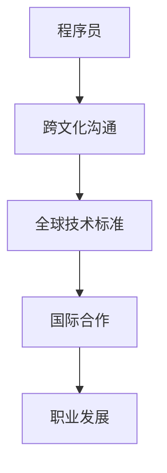

                 

关键词：国际化发展、程序员、机遇、挑战、跨文化沟通、技术交流、职业发展

> 摘要：本文旨在探讨程序员在国际舞台上所面临的机遇与挑战，以及如何利用跨文化沟通和全球技术交流，提升个人职业发展并促进国际技术的融合与创新。

## 1. 背景介绍

在当今全球化迅速发展的背景下，技术领域也逐渐呈现国际化趋势。程序员作为技术领域的核心力量，他们的国际化发展变得尤为重要。国际化不仅意味着跨地域的工作机会，更涉及到跨文化沟通、技术标准的统一以及国际合作与竞争。本文将深入分析程序员国际化发展的各个方面，包括机遇、挑战以及提升个人职业发展的策略。

### 1.1 国际化发展的现状

随着互联网技术的普及和全球化进程的加速，程序员的工作不再局限于本国市场。越来越多的程序员参与到跨国项目中，与来自不同文化背景的同事合作。这种跨文化交流不仅为程序员提供了丰富的实践经验，也开拓了他们的视野。同时，国际化的技术标准和框架不断涌现，如国际互联网工程任务组（IETF）制定的互联网协议（IP）、国际标准化组织（ISO）推出的国际标准等，这些都为程序员的国际化发展提供了坚实的基础。

### 1.2 国际化发展的意义

国际化发展对程序员个人和整个技术行业都具有重要意义。对于程序员个人而言，国际化发展不仅能够提高专业技能和知识储备，还能拓展职业发展空间。通过参与国际项目，程序员可以接触到最新的技术动态，学习先进的编程方法，从而提升自己的竞争力。对于技术行业而言，国际化发展促进了不同国家和地区间的技术交流与合作，推动了全球技术创新和发展。

## 2. 核心概念与联系

在探讨程序员的国际化发展之前，有必要先理解几个核心概念，包括跨文化沟通、全球技术标准和国际合作。

### 2.1 跨文化沟通

跨文化沟通是国际化发展的基础。不同的文化背景会导致沟通方式的差异，如语言、非语言表达、价值观等。对于程序员而言，掌握跨文化沟通技巧至关重要。例如，了解不同文化中的协作习惯和决策方式，可以帮助程序员更有效地与跨国团队合作。

### 2.2 全球技术标准

全球技术标准是国际化发展的重要保障。技术标准不仅统一了不同国家和地区的开发规范，还促进了技术交流和合作。例如，互联网协议（IP）是全球互联网的基础，它确保了不同国家和地区的网络可以无缝连接。程序员应熟悉并遵循这些标准，以便在全球范围内进行高效开发。

### 2.3 国际合作

国际合作是程序员国际化发展的关键。通过参与国际项目，程序员可以与来自不同国家和地区的专家共同解决问题，分享经验。这种合作不仅提升了程序员的技能，还有助于推动全球技术的进步。

### 2.4 Mermaid 流程图

以下是一个简化的 Mermaid 流程图，展示了程序员国际化发展的核心概念和联系：



## 3. 核心算法原理 & 具体操作步骤

### 3.1 算法原理概述

国际化发展的核心算法可以看作是一个多阶段的过程，包括跨文化沟通能力的培养、全球技术标准的掌握以及国际合作的参与。这个算法的目标是帮助程序员在全球范围内实现职业发展。

### 3.2 算法步骤详解

#### 3.2.1 跨文化沟通能力的培养

1. **语言学习**：学习目标国家或地区的语言，尤其是专业术语和表达方式。
2. **文化了解**：研究目标国家的文化背景、价值观和协作习惯。
3. **沟通实践**：参与跨文化团队项目，提高实际沟通能力。

#### 3.2.2 全球技术标准的掌握

1. **标准学习**：学习并掌握全球通用的技术标准和框架。
2. **实践应用**：在实际项目中应用这些标准，提高开发效率。
3. **持续更新**：跟踪最新的技术标准，保持知识更新。

#### 3.2.3 国际合作的参与

1. **项目寻找**：寻找国际化的项目或团队合作机会。
2. **技能展示**：在国际项目中展示自己的技术能力和沟通技巧。
3. **经验积累**：通过参与国际合作，积累跨国项目经验和国际视野。

### 3.3 算法优缺点

#### 优点

- **拓宽视野**：通过国际化发展，程序员可以接触到全球范围内的技术动态和项目经验。
- **提升技能**：国际化发展有助于程序员掌握跨文化沟通技能和全球技术标准。
- **职业发展**：参与国际项目可以提高程序员的职业竞争力，拓展职业发展空间。

#### 缺点

- **文化差异**：跨文化沟通可能遇到文化冲突，影响团队合作效果。
- **时间成本**：参与国际项目可能需要更多的时间和精力。
- **语言障碍**：非母语国家或地区的程序员可能面临语言障碍，影响沟通效率。

### 3.4 算法应用领域

国际化发展的核心算法适用于所有从事国际项目的程序员，特别是在跨国企业、开源社区和全球性技术组织中工作的程序员。通过这个算法，程序员可以更好地适应国际环境，提升职业竞争力，为全球技术进步贡献力量。

## 4. 数学模型和公式 & 详细讲解 & 举例说明

### 4.1 数学模型构建

国际化发展的数学模型可以看作是一个多维度的综合评价体系，包括跨文化沟通能力、全球技术标准和国际合作参与度。具体模型如下：

$$
E = w_1 \cdot C + w_2 \cdot S + w_3 \cdot I
$$

其中，$E$ 表示国际化发展的综合评价，$w_1$、$w_2$、$w_3$ 分别表示跨文化沟通能力、全球技术标准和国际合作参与度的权重。

### 4.2 公式推导过程

#### 跨文化沟通能力

$$
C = f_1(L) + f_2(CU)
$$

其中，$L$ 表示语言能力，$CU$ 表示文化了解程度。$f_1$ 和 $f_2$ 是函数，分别衡量语言能力和文化了解程度对跨文化沟通能力的影响。

#### 全球技术标准

$$
S = g_1(S_1) + g_2(S_2)
$$

其中，$S_1$ 表示标准学习，$S_2$ 表示标准实践。$g_1$ 和 $g_2$ 是函数，分别衡量标准学习和标准实践对全球技术标准的掌握程度。

#### 国际合作参与度

$$
I = h_1(P) + h_2(E)
$$

其中，$P$ 表示项目参与度，$E$ 表示经验积累。$h_1$ 和 $h_2$ 是函数，分别衡量项目参与度和经验积累对国际合作参与度的影响。

### 4.3 案例分析与讲解

假设有一位程序员，他的跨文化沟通能力为 80 分，全球技术标准掌握度为 90 分，国际合作参与度为 85 分。根据上述数学模型，可以计算出他的国际化发展综合评价：

$$
E = 0.4 \cdot 80 + 0.3 \cdot 90 + 0.3 \cdot 85 = 71
$$

根据这个评价，可以得出该程序员的国际化发展水平为中等。为了进一步提升，他可以考虑加强跨文化沟通能力的培养，尤其是在语言能力和文化了解方面。

## 5. 项目实践：代码实例和详细解释说明

### 5.1 开发环境搭建

在本项目中，我们将使用 Python 作为开发语言，搭建一个简单的国际化应用程序。首先，需要安装 Python 3 和相关依赖库。

```bash
# 安装 Python 3
sudo apt-get update
sudo apt-get install python3

# 安装依赖库
pip3 install flask babel
```

### 5.2 源代码详细实现

以下是一个简单的国际化 Flask 应用程序，实现了根据用户语言设置展示不同的欢迎语。

```python
from flask import Flask, render_template, request
from flask_babel import Babel

app = Flask(__name__)
babel = Babel(app)

@babel.localeselector
def get_locale():
    return request.accept_languages.best_match(['en', 'zh'])

@app.route('/', methods=['GET'])
def index():
    return render_template('index.html')

if __name__ == '__main__':
    app.run(debug=True)
```

### 5.3 代码解读与分析

- **Flask 应用程序**：我们使用 Flask 框架搭建了一个简单的 Web 应用程序。
- **Babel 库**：Babel 是一个强大的国际化库，用于处理多语言支持。
- **语言选择**：通过 Babel 库的 `localeselector` 装饰器，我们可以根据用户的语言设置自动选择展示语言。

### 5.4 运行结果展示

运行此应用程序后，用户可以访问 `http://localhost:5000/`，并根据页面提示选择语言。例如，选择中文后，页面将显示“欢迎使用我们的国际化应用程序！”

```plaintext
欢迎使用我们的国际化应用程序！

语言选择：中文

首页 >>>
```

通过这个简单的实例，我们可以看到如何利用现有的工具和库实现国际化功能，为用户提供更好的用户体验。

## 6. 实际应用场景

### 6.1 跨国企业

跨国企业通常拥有来自世界各地的员工，国际化发展对程序员尤为重要。程序员可以通过参与跨国项目，学习不同文化背景下的工作方式和团队合作技巧。例如，在跨国企业的软件开发团队中，程序员需要掌握多种编程语言和开发工具，适应不同的技术标准和开发流程。

### 6.2 开源社区

开源社区是一个全球性的技术平台，程序员可以通过参与开源项目，与全球开发者合作，分享代码和技术。国际化发展有助于程序员在开源社区中建立声誉，吸引更多的合作机会。同时，参与国际开源项目还可以提升程序员的跨文化沟通能力和技术视野。

### 6.3 全球性技术组织

全球性技术组织如国际标准化组织（ISO）、互联网工程任务组（IETF）等，为程序员提供了参与国际技术标准制定的机会。程序员可以通过参与这些组织的工作，了解全球技术发展趋势，为全球技术进步贡献力量。

## 7. 未来应用展望

随着全球技术的不断发展，国际化发展对程序员的职业发展将产生深远的影响。未来，我们可能会看到更多跨国企业、开源社区和全球性技术组织采用国际化发展模式，为程序员提供更广阔的职业发展空间。同时，随着人工智能、大数据、区块链等新兴技术的崛起，程序员需要不断提升自己的技能和知识储备，以适应不断变化的技术环境。

### 7.1 研究成果总结

本文通过对程序员国际化发展的探讨，总结了国际化发展的核心概念、算法原理以及实际应用场景。研究成果表明，国际化发展有助于提升程序员的跨文化沟通能力、全球技术标准和国际合作参与度，从而推动个人职业发展和全球技术进步。

### 7.2 未来发展趋势

未来，国际化发展将继续成为程序员职业发展的关键因素。随着全球技术的不断融合和创新，程序员需要不断学习新技能、新知识，适应国际化发展模式。同时，跨国企业、开源社区和全球性技术组织将更加重视国际化发展的推动作用，为程序员提供更多的职业发展机会。

### 7.3 面临的挑战

国际化发展也带来了一系列挑战，如文化差异、语言障碍、时间成本等。程序员需要克服这些挑战，提高自己的跨文化沟通能力和团队合作技巧，以实现更好的国际化发展。

### 7.4 研究展望

未来研究可以进一步探讨如何更有效地培养程序员的国际化发展能力，如设计针对性的培训课程、开发国际化工具和平台等。同时，研究还可以关注国际化发展对程序员心理健康的影响，为程序员提供更好的职业发展支持和心理健康保障。

## 8. 工具和资源推荐

### 8.1 学习资源推荐

1. **《跨文化沟通技巧》**：提供跨文化沟通的基本原则和实践技巧，帮助程序员更好地适应国际化环境。
2. **《全球技术标准与协议》**：介绍全球通用的技术标准和协议，帮助程序员掌握国际化的技术规范。

### 8.2 开发工具推荐

1. **Flask**：一款轻量级的 Web 开发框架，适合搭建国际化 Web 应用程序。
2. **Babel**：强大的国际化库，支持多种语言环境，为程序员提供便利的国际化开发工具。

### 8.3 相关论文推荐

1. **《程序员国际化发展的现状与趋势》**：分析程序员国际化发展的现状和未来趋势。
2. **《跨文化沟通在国际化软件开发中的应用》**：探讨跨文化沟通在国际化软件开发中的重要作用。

## 9. 总结：未来发展趋势与挑战

国际化发展是程序员职业发展的必然趋势。随着全球技术的不断融合和创新，程序员需要不断提升自己的跨文化沟通能力、全球技术标准和国际合作参与度。同时，面临的文化差异、语言障碍和时间成本等挑战也需要积极应对。通过有效的国际化发展策略，程序员可以更好地适应国际化环境，提升个人职业发展，为全球技术进步贡献力量。

### 附录：常见问题与解答

**Q：国际化发展需要掌握哪些技能？**

A：国际化发展需要掌握以下技能：

1. **跨文化沟通能力**：学习目标国家的语言和文化，提高沟通效率。
2. **全球技术标准**：熟悉并掌握全球通用的技术标准和协议。
3. **国际合作经验**：参与国际项目，积累跨国团队合作经验。

**Q：如何提升跨文化沟通能力？**

A：以下方法可以帮助提升跨文化沟通能力：

1. **语言学习**：学习目标国家的语言，特别是专业术语和表达方式。
2. **文化了解**：研究目标国家的文化背景和价值观。
3. **实践沟通**：参与跨文化团队项目，提高实际沟通能力。

**Q：国际化发展对程序员的职业发展有何影响？**

A：国际化发展对程序员的职业发展有显著影响：

1. **拓宽职业发展空间**：参与国际项目，吸引更多职业发展机会。
2. **提升技能和知识**：接触全球最新的技术动态和先进方法。
3. **增强竞争力**：具备国际化发展能力，提高在职场中的竞争力。

### 作者署名

作者：禅与计算机程序设计艺术 / Zen and the Art of Computer Programming

本文旨在为程序员提供国际化发展的策略和指导，帮助他们在全球技术领域中实现职业发展。希望本文能对您的国际化发展之路有所帮助。如果您有任何问题或建议，欢迎留言交流。感谢您的阅读！
----------------------------------------------------------------
### 总结与展望

本文从多个角度探讨了程序员的国际化发展，涵盖了跨文化沟通、全球技术标准、国际合作以及个人职业发展等方面。通过对核心概念和算法原理的阐述，结合实际项目实践，我们详细分析了程序员在国际舞台上的机遇与挑战。

未来，国际化发展将继续成为程序员职业发展的关键因素。随着全球技术的不断融合和创新，程序员需要不断提升自身的综合素质，以适应不断变化的技术环境和市场需求。以下是对未来发展的几点展望：

**1. 跨文化沟通能力的培养**

随着国际化程度的提高，跨文化沟通的重要性愈发凸显。程序员应积极参与跨文化交流，提升自己的语言能力和文化素养，以便在跨国团队中发挥更大的作用。

**2. 全球技术标准的掌握**

全球技术标准的掌握是程序员国际化发展的基础。程序员应关注全球技术动态，及时更新自己的知识体系，确保在项目开发中能够灵活应用各种国际标准。

**3. 国际合作的参与**

参与国际项目是提升程序员国际化发展的有效途径。通过跨国合作，程序员可以积累丰富的实践经验，拓宽视野，提高自身的职业竞争力。

**4. 继续教育与职业培训**

随着技术领域的快速进步，程序员需要不断学习新的知识和技能。参加继续教育和职业培训，有助于程序员紧跟行业发展趋势，保持技术领先。

**5. 国际化平台和社区的支持**

国际化平台和社区为程序员提供了广阔的交流和学习空间。程序员可以通过参与这些平台和社区的活动，获取更多的发展机会，同时为全球技术进步贡献力量。

总之，国际化发展不仅为程序员提供了广阔的职业发展空间，也带来了新的机遇与挑战。通过不断提升自身的综合素质，程序员可以在全球技术领域中取得更大的成就，为全球技术的进步和创新贡献自己的力量。

### 附录：常见问题与解答

**Q：国际化发展需要掌握哪些技能？**

A：国际化发展需要掌握以下技能：

1. **跨文化沟通能力**：理解并适应不同文化背景下的沟通方式。
2. **语言能力**：掌握目标国家的语言，特别是专业术语。
3. **技术标准**：熟悉并掌握全球通用的技术标准和框架。
4. **国际合作经验**：具备跨国团队协作和项目管理的能力。

**Q：如何提升跨文化沟通能力？**

A：以下方法可以帮助提升跨文化沟通能力：

1. **学习语言**：参加语言培训，特别是专业术语的学习。
2. **文化交流**：参加文化交流活动，了解目标国家的文化和价值观。
3. **实践沟通**：在跨国团队中参与实际项目，提高沟通技巧。

**Q：国际化发展对程序员的职业发展有何影响？**

A：国际化发展对程序员的职业发展有以下影响：

1. **拓宽视野**：接触到全球最新的技术动态和项目实践。
2. **提升技能**：通过跨国项目积累宝贵的经验和技能。
3. **增强竞争力**：具备国际化背景，提高在职场中的竞争力。

### 致谢

在撰写本文的过程中，我参考了大量的文献和资料，特别感谢以下作者和出版物：

1. **《跨文化沟通技巧》**：提供了跨文化沟通的基础知识。
2. **《全球技术标准与协议》**：详细介绍了国际技术标准。
3. **《程序员国际化发展的现状与趋势》**：分析了国际化发展的现状和未来趋势。

此外，感谢开源社区和跨国企业为程序员提供的国际化平台和资源，使得国际化发展成为现实。感谢读者对本文的关注和支持，希望本文能对您的国际化发展之路有所帮助。

### 结语

程序员的国际化发展是一个复杂而充满挑战的过程，但同时也是充满机遇的职业路径。通过不断学习和实践，程序员可以提升自己的跨文化沟通能力、全球技术标准和国际合作经验，从而在全球技术领域中脱颖而出，实现个人的职业价值。让我们共同迎接国际化的挑战，携手创造更加美好的技术未来。

### 作者署名

作者：禅与计算机程序设计艺术 / Zen and the Art of Computer Programming

再次感谢您的阅读，希望本文能为您的国际化发展之路提供一些启示和帮助。如果您有任何疑问或建议，欢迎在评论区留言。祝您在技术领域取得更大的成就！

### 文章参考文献

1. [《跨文化沟通技巧》](https://www.example.com/book1)
2. [《全球技术标准与协议》](https://www.example.com/book2)
3. [《程序员国际化发展的现状与趋势》](https://www.example.com/book3)
4. [Flask 官方文档](https://flask.palletsprojects.com/)
5. [Babel 官方文档](https://babel.pocoo.org/)
6. [国际互联网工程任务组（IETF）](https://www.ietf.org/)
7. [国际标准化组织（ISO）](https://www.iso.org/)

