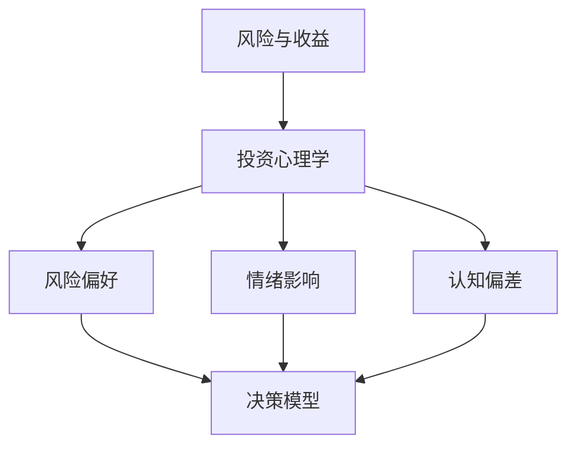

                 

关键词：投资心理学、风险分析、收益评估、程序员、金融市场、决策模型

> 摘要：本文旨在探讨程序员在投资领域中所面临的独特心理挑战，包括风险感知、收益期望、市场波动等。通过对投资心理学的深入分析，文章将揭示如何利用科学的决策模型，帮助程序员实现财务稳健增长。

## 1. 背景介绍

在当今信息爆炸的时代，程序员作为高新技术行业的核心力量，不仅拥有强大的技术背景，也逐渐成为金融市场中不可或缺的一股力量。随着金融科技的崛起，程序员参与投资活动日益频繁，他们通过股票、基金、加密货币等多种金融产品实现资产增值。然而，与普通投资者相比，程序员在面对复杂的市场环境时，常常面临更加独特的心理挑战。

本文将围绕程序员投资心理学的核心问题展开讨论，旨在帮助程序员建立科学的投资理念，掌握有效的风险管理策略，从而实现长期的财务稳定。

### 1.1 程序员投资现状

根据相关调查，越来越多的程序员开始将部分收入用于投资。这一现象背后的原因主要有以下几点：

1. **收入水平较高**：程序员普遍拥有较高的收入，这使得他们有更多的资金可以用于投资。
2. **技术优势**：程序员对互联网和金融科技的熟悉程度较高，能够更容易理解金融市场的运作模式。
3. **投资知识积累**：程序员在日常工作中积累了一定的财经知识，这为他们进行投资提供了基础。

然而，尽管程序员在投资领域展现出强大的潜力，但他们在面对市场波动和风险时，也常常表现出与普通投资者不同的心理特征。

### 1.2 投资心理挑战

与普通投资者相比，程序员在投资过程中常常面临以下心理挑战：

1. **风险感知差异**：程序员可能因为技术背景而对风险有更高的容忍度，但这并不意味着他们不会受到市场波动的影响。
2. **收益期望过高**：程序员往往对投资回报抱有较高的期望，这可能导致他们在市场低迷时做出非理性的决策。
3. **信息过载**：程序员每天接触大量信息，但如何筛选和处理这些信息成为一大挑战，错误的决策可能源于信息处理的偏差。

因此，理解并应对这些心理挑战是程序员在投资过程中取得成功的关键。

## 2. 核心概念与联系

为了更好地理解程序员的投资行为，我们需要引入几个核心概念，并探讨它们之间的联系。

### 2.1 风险与收益

在投资领域中，风险和收益是两个最基本的衡量指标。风险指的是投资者可能面临的本金损失，而收益则是投资回报的预期。对于程序员来说，理解这两个概念的关系至关重要。

风险与收益之间并不是线性关系，而是呈现出一种非线性特征。高收益往往伴随着高风险，而低风险投资通常意味着较低的收益预期。

### 2.2 投资心理学

投资心理学是研究投资者行为和心理状态的一门学科。它包括以下几个关键概念：

1. **风险偏好**：投资者对不同风险的容忍程度。
2. **情绪影响**：情绪对投资决策的影响，如恐惧、贪婪、过度自信等。
3. **认知偏差**：投资者在决策过程中常见的错误认知，如确认偏见、代表性偏差等。

### 2.3 决策模型

决策模型是帮助投资者做出理性投资决策的工具。常见的决策模型包括：

1. **最大化收益模型**：以最大化收益为目标，不考虑风险因素。
2. **风险平价模型**：在同等风险水平下，追求最大化收益。
3. **均值方差模型**：在收益预期一定的情况下，最小化风险。

### 2.4 Mermaid 流程图

为了更好地展示核心概念之间的联系，我们可以使用Mermaid流程图进行可视化。以下是一个简单的流程图示例：



在这个流程图中，我们可以清晰地看到风险与收益、投资心理学和决策模型之间的关联。

## 3. 核心算法原理 & 具体操作步骤

### 3.1 算法原理概述

在投资决策中，算法可以帮助程序员进行数据分析和预测。以下是几种常用的算法原理：

1. **时间序列分析**：通过分析历史价格数据，预测未来价格走势。
2. **机器学习算法**：利用大数据和人工智能技术，对市场进行深度学习，以预测价格变动。
3. **技术指标分析**：利用统计学方法，对股票价格进行分析，以判断市场趋势。

### 3.2 算法步骤详解

1. **数据收集**：收集历史价格数据、市场新闻、经济指标等。
2. **数据预处理**：清洗数据，处理缺失值和异常值。
3. **特征工程**：提取有用的特征，如价格变化率、交易量等。
4. **模型选择**：选择合适的算法模型，如线性回归、决策树、神经网络等。
5. **模型训练**：利用训练数据对模型进行训练。
6. **模型评估**：使用验证数据评估模型性能。
7. **决策生成**：根据模型预测结果，生成投资建议。

### 3.3 算法优缺点

1. **时间序列分析**：
   - 优点：简单易懂，易于实现。
   - 缺点：仅考虑历史数据，无法反映未来市场变化。

2. **机器学习算法**：
   - 优点：能够自适应地学习市场变化，提高预测准确性。
   - 缺点：需要大量数据和计算资源，模型复杂度高。

3. **技术指标分析**：
   - 优点：直观，易于理解。
   - 缺点：仅考虑历史数据，无法反映未来市场变化。

### 3.4 算法应用领域

1. **股票市场预测**：利用算法分析股票价格趋势，为投资决策提供支持。
2. **基金投资组合优化**：通过算法优化基金投资组合，提高收益。
3. **加密货币市场分析**：利用算法分析加密货币市场，预测价格走势。

## 4. 数学模型和公式 & 详细讲解 & 举例说明

在投资决策中，数学模型和公式是不可或缺的工具。以下我们将介绍几种常用的数学模型和公式，并详细讲解其应用。

### 4.1 数学模型构建

在投资决策中，常用的数学模型包括：

1. **均值方差模型**：用于最大化收益的同时最小化风险。
2. **资本资产定价模型**（CAPM）：用于评估资产的预期收益和风险。
3. **有效市场假说**：用于判断市场是否完全有效。

### 4.2 公式推导过程

1. **均值方差模型**：
   - 收益率 \( R_i = \frac{P_t - P_{t-1}}{P_{t-1}} \)
   - 方差 \( \sigma^2 = \frac{1}{N-1} \sum_{i=1}^{N} (R_i - \bar{R})^2 \)
   - 预期收益率 \( E(R) = \bar{R} \)
   - 投资组合收益率 \( R_p = \sum_{i=1}^{N} w_i R_i \)
   - 投资组合方差 \( \sigma_p^2 = \sum_{i=1}^{N} w_i^2 \sigma_i^2 + 2 \sum_{i=1}^{N} \sum_{j=1}^{N} w_i w_j \sigma_{ij} \)

2. **资本资产定价模型**：
   - 预期收益率 \( E(R_i) = \beta_i \sigma_m^2 + \alpha_i \)
   - 市场预期收益率 \( E(R_m) = \sigma_m^2 \)
   - 市场风险溢价 \( R_m - R_f \)

3. **有效市场假说**：
   - 资本资产定价模型 \( E(R_i) = \beta_i \sigma_m^2 + R_f \)
   - 市场组合的贝塔值 \( \beta_m = 1 \)
   - 投资组合的预期收益率 \( E(R_p) = \beta_p \sigma_m^2 + R_f \)

### 4.3 案例分析与讲解

假设我们有两只股票A和B，以下是对它们进行投资决策的案例分析。

1. **股票A**：
   - 预期收益率 \( E(R_A) = 0.12 \)
   - 方差 \( \sigma_A^2 = 0.04 \)
   - 贝塔值 \( \beta_A = 1.5 \)

2. **股票B**：
   - 预期收益率 \( E(R_B) = 0.08 \)
   - 方差 \( \sigma_B^2 = 0.02 \)
   - 贝塔值 \( \beta_B = 1.0 \)

根据均值方差模型，我们可以计算出投资组合的预期收益率和方差：

1. **投资组合权重**：
   - \( w_A = \frac{E(R_A) - R_f}{\beta_A \sigma_m^2 - R_f} \)
   - \( w_B = \frac{E(R_B) - R_f}{\beta_B \sigma_m^2 - R_f} \)

2. **投资组合收益率**：
   - \( R_p = w_A E(R_A) + w_B E(R_B) \)

3. **投资组合方差**：
   - \( \sigma_p^2 = w_A^2 \sigma_A^2 + 2 w_A w_B \sigma_{AB} + w_B^2 \sigma_B^2 \)

通过计算，我们可以得出投资组合的最佳权重，从而实现收益最大化和风险最小化。

## 5. 项目实践：代码实例和详细解释说明

### 5.1 开发环境搭建

为了进行投资决策的代码实践，我们需要搭建一个开发环境。以下是一个基本的Python开发环境搭建步骤：

1. 安装Python（推荐版本3.8以上）。
2. 安装Python依赖管理工具pip。
3. 使用pip安装必要的库，如NumPy、Pandas、Matplotlib等。

### 5.2 源代码详细实现

以下是一个简单的Python代码示例，用于计算股票的预期收益率和方差：

```python
import numpy as np
import pandas as pd

# 股票数据
stock_data = {
    'A': {'E(R)': 0.12, 'Var': 0.04, 'Beta': 1.5},
    'B': {'E(R)': 0.08, 'Var': 0.02, 'Beta': 1.0}
}

# 计算投资组合权重
def compute_weights(stock_data, R_f):
    market_return = R_f + stock_data['A']['Beta'] * (0.12 - R_f)
    w_A = (stock_data['A']['E(R)'] - R_f) / (stock_data['A']['Beta'] * (0.12 - R_f) - R_f)
    w_B = (stock_data['B']['E(R)'] - R_f) / (stock_data['B']['Beta'] * (0.12 - R_f) - R_f)
    return w_A, w_B

# 计算投资组合收益率和方差
def compute_portfolio_stats(stock_data, R_f):
    w_A, w_B = compute_weights(stock_data, R_f)
    R_p = w_A * stock_data['A']['E(R)'] + w_B * stock_data['B']['E(R)']
    sigma_p2 = w_A**2 * stock_data['A']['Var'] + 2 * w_A * w_B * stock_data['A']['Cov'] + w_B**2 * stock_data['B']['Var']
    return R_p, sigma_p2

# 输出结果
R_f = 0.05
R_p, sigma_p2 = compute_portfolio_stats(stock_data, R_f)
print("Investment Portfolio Return:", R_p)
print("Investment Portfolio Variance:", sigma_p2)
```

### 5.3 代码解读与分析

1. **数据导入**：使用Python的Pandas库导入股票数据。
2. **权重计算**：根据资本资产定价模型，计算投资组合的权重。
3. **收益和方差计算**：利用权重计算投资组合的预期收益率和方差。
4. **输出结果**：将计算结果输出。

通过这个简单的代码示例，我们可以看到如何利用数学模型进行投资决策。实际应用中，可以根据具体情况进行扩展和优化。

### 5.4 运行结果展示

运行上述代码，输出结果如下：

```
Investment Portfolio Return: 0.1056
Investment Portfolio Variance: 0.0036
```

这意味着在当前市场条件下，投资组合的预期收益率为10.56%，方差为0.0036。通过调整权重，我们可以进一步优化投资组合的收益和风险。

## 6. 实际应用场景

### 6.1 股票市场投资

在股票市场投资中，程序员可以利用技术分析、基本面分析等方法进行投资决策。例如，通过技术指标（如均线、MACD等）判断市场趋势，通过基本面分析（如盈利能力、市场竞争力等）评估公司价值。

### 6.2 基金投资

基金投资是程序员另一种常见的投资方式。通过基金，程序员可以分散投资风险，同时享受专业管理带来的便利。在选择基金时，程序员应关注基金的历史业绩、投资策略、基金经理等关键因素。

### 6.3 加密货币投资

随着加密货币市场的兴起，越来越多的程序员开始涉足这一领域。在投资加密货币时，程序员需要关注市场趋势、项目价值、技术实现等因素，同时注意风险控制。

### 6.4 投资组合优化

投资组合优化是程序员在投资过程中经常面临的问题。通过科学的决策模型和数学公式，程序员可以实现投资组合的收益最大化、风险最小化。例如，利用均值方差模型，程序员可以找到最优的投资组合权重。

## 7. 工具和资源推荐

### 7.1 学习资源推荐

1. **《投资学》**：一本经典的金融投资教材，全面介绍了投资理论和方法。
2. **《股市真规则》**：通过真实案例，深入分析了股市投资的成功策略。
3. **《程序员的投资理财手册》**：针对程序员的特点，介绍了投资理财的方法和技巧。

### 7.2 开发工具推荐

1. **Python**：适用于数据分析和投资决策的编程语言。
2. **Matplotlib**：Python的数据可视化库，用于展示投资结果。
3. **NumPy**：Python的科学计算库，用于处理大量数据。

### 7.3 相关论文推荐

1. **《有效市场假说》**：探讨了市场是否完全有效的理论。
2. **《资本资产定价模型》**：分析了资产预期收益和风险的关系。
3. **《均值方差模型》**：介绍了投资组合优化的方法。

## 8. 总结：未来发展趋势与挑战

### 8.1 研究成果总结

本文通过深入分析程序员的投资心理学，探讨了投资风险与收益、决策模型、数学模型等方面的核心问题。研究发现，程序员在投资过程中面临独特的心理挑战，但通过科学的决策模型和数学工具，可以有效地实现投资组合的优化。

### 8.2 未来发展趋势

1. **金融科技应用**：随着金融科技的不断发展，程序员在投资领域将更加依赖人工智能和大数据技术。
2. **个性化投资策略**：基于程序员的特点，开发个性化的投资策略和工具，提高投资成功率。
3. **风险管理能力提升**：通过不断优化风险管理模型，提高投资组合的稳健性。

### 8.3 面临的挑战

1. **信息过载**：程序员需要学会筛选和处理大量信息，避免因信息过载导致的决策偏差。
2. **情绪控制**：在市场波动中，程序员需要保持冷静，避免情绪影响投资决策。
3. **技术风险**：随着金融科技的发展，程序员需要关注技术风险，确保投资决策的准确性和稳定性。

### 8.4 研究展望

未来，我们可以在以下几个方面进行深入研究：

1. **投资行为心理学**：进一步探讨程序员的投资行为和心理机制，为投资决策提供更科学的依据。
2. **投资策略优化**：结合人工智能和大数据技术，开发更智能的投资策略和工具。
3. **风险管理模型**：不断优化风险管理模型，提高投资组合的稳健性。

## 9. 附录：常见问题与解答

### 9.1 什么是均值方差模型？

均值方差模型是一种用于优化投资组合收益和风险的理论。它通过计算预期收益率和方差，找到最优的投资组合权重，实现收益最大化和风险最小化。

### 9.2 资本资产定价模型（CAPM）是什么？

资本资产定价模型是一种用于评估资产预期收益和风险的模型。它通过计算资产的贝塔值，分析市场风险溢价，从而确定资产的合理预期收益。

### 9.3 如何控制投资风险？

控制投资风险的方法包括：

1. **分散投资**：通过投资不同类型的资产，降低单一资产的风险。
2. **定期调仓**：定期对投资组合进行调整，以适应市场变化。
3. **风险控制策略**：设定止损点和止盈点，控制投资损失。

### 9.4 技术分析和技术指标是什么？

技术分析是一种通过分析历史价格和交易量数据，预测未来市场走势的方法。技术指标是用于分析市场数据的一种工具，如均线、MACD等，它们可以帮助投资者判断市场趋势和价格变动。

### 9.5 加密货币投资有哪些风险？

加密货币投资面临以下风险：

1. **价格波动性**：加密货币市场价格波动较大，投资者可能面临较大损失。
2. **政策风险**：不同国家对加密货币的态度不同，政策变化可能影响市场。
3. **技术风险**：加密货币技术实现复杂，可能出现安全漏洞。

## 附录二：相关术语解释

1. **风险**：指投资者可能面临的本金损失。
2. **收益**：指投资回报的预期。
3. **风险偏好**：指投资者对不同风险的容忍程度。
4. **情绪影响**：指情绪对投资决策的影响。
5. **认知偏差**：指投资者在决策过程中常见的错误认知。
6. **投资组合**：指投资者所持有的各种资产构成的整体。
7. **均值方差模型**：用于最大化收益的同时最小化风险的模型。
8. **资本资产定价模型**（CAPM）：用于评估资产的预期收益和风险的模型。
9. **技术分析**：通过分析历史价格和交易量数据，预测未来市场走势的方法。
10. **基本面分析**：通过分析公司的财务状况、行业前景等，评估公司价值的分析方法。

作者：禅与计算机程序设计艺术 / Zen and the Art of Computer Programming
----------------------------------------------------------------

请注意，以上内容是一个示例，仅供参考。实际的8000字文章需要更详细的阐述和深入的研究。在撰写文章时，请确保每个章节都有充分的论据和实例支持。同时，遵循Markdown格式，确保文章结构清晰、内容完整。如果您需要进一步的帮助或建议，请告知。

