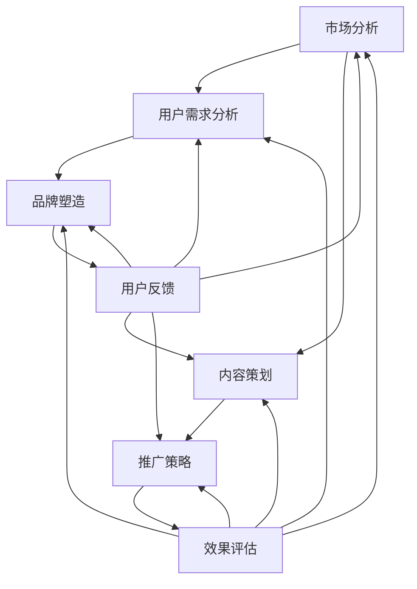
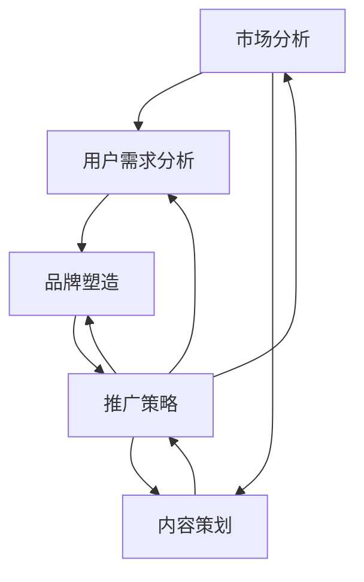

                 

关键词：知识付费，品牌定位，程序员，市场营销，用户体验

> 摘要：本文深入探讨程序员在知识付费领域的品牌定位策略。从市场分析、用户需求、内容策划、品牌塑造、推广策略等方面，全面解析如何构建有影响力的知识付费品牌，为程序员提供长期稳定的收入来源。

## 1. 背景介绍

随着互联网的普及和信息技术的快速发展，知识付费逐渐成为一股新兴的力量。程序员作为知识付费的主要受众之一，对于提升技能、拓宽视野有着强烈的渴望。然而，在众多知识付费平台和内容提供商中，如何脱颖而出，建立自己的品牌，成为程序员们关注的焦点。

知识付费品牌定位策略的重要性在于，它能够帮助程序员在竞争激烈的市场中找到自己的独特价值，吸引并留住目标用户，从而实现长期发展。本文将围绕这一主题，探讨如何制定有效的品牌定位策略。

### 1.1 知识付费的发展趋势

1. **市场规模不断扩大**：随着人们对终身学习的需求增加，知识付费市场呈现出快速增长的趋势。根据统计数据显示，全球知识付费市场规模逐年上升，预计未来仍将保持高速增长。

2. **多样化内容形式**：知识付费内容从最初的音频、视频逐渐扩展到图文、直播、互动问答等多种形式，满足用户多样化的学习需求。

3. **个性化推荐兴起**：大数据和人工智能技术的应用，使得个性化推荐成为知识付费平台的重要特征，用户能够更精准地获取感兴趣的内容。

### 1.2 程序员的需求分析

1. **技能提升需求**：程序员需要不断更新知识，掌握新技术，以保持竞争力。

2. **职业发展需求**：提升专业技能有助于职业晋升，增加收入。

3. **社交互动需求**：程序员渴望通过学习平台结识同行，拓展人脉，交流经验。

### 1.3 市场竞争分析

1. **平台众多**：如知乎Live、网易云课堂、极客时间等，竞争激烈。

2. **内容同质化**：众多内容提供商在课程内容、授课方式上存在较大同质化现象。

3. **用户忠诚度低**：用户更倾向于选择高质量的、具有个性化服务的内容提供商。

## 2. 核心概念与联系

下面，我们将使用Mermaid流程图来展示知识付费品牌定位的核心概念及其相互联系。



### 2.1 市场分析

市场分析是品牌定位的第一步，通过分析市场规模、增长趋势、竞争态势等，了解当前市场状况，为后续的品牌定位提供依据。

### 2.2 用户需求分析

用户需求分析旨在明确目标用户群体的特征、需求偏好，为内容策划提供方向。

### 2.3 内容策划

内容策划是根据用户需求和市场分析结果，制定符合用户期待的高质量内容。

### 2.4 品牌塑造

品牌塑造是通过一系列策略和措施，建立品牌形象，提升品牌认知度和美誉度。

### 2.5 推广策略

推广策略是利用各种渠道和手段，将品牌和内容传播给目标用户。

### 2.6 用户反馈

用户反馈是品牌定位策略的重要组成部分，通过收集用户反馈，不断优化和调整策略。

### 2.7 效果评估

效果评估是对品牌定位策略实施效果进行评估，为后续改进提供依据。

## 3. 核心算法原理 & 具体操作步骤

### 3.1 算法原理概述

品牌定位策略的核心算法可以概括为以下四个步骤：

1. **市场细分**：根据市场规模、增长趋势、竞争态势等因素，将市场划分为不同的细分市场。
2. **目标用户画像**：通过用户调查、数据分析等手段，构建目标用户画像，明确其特征、需求偏好。
3. **内容差异化定位**：根据目标用户画像和市场细分结果，制定差异化内容策略，满足用户需求。
4. **品牌形象塑造**：通过品牌名称、视觉设计、传播策略等，打造具有独特个性的品牌形象。

### 3.2 算法步骤详解

1. **市场细分**：

   - **市场规模分析**：收集市场规模、增长趋势等数据，评估市场潜力。

   - **竞争态势分析**：分析市场上主要竞争对手的定位、内容策略、用户评价等，找出市场细分的机会点。

2. **目标用户画像**：

   - **问卷调查**：设计问卷，收集用户基本信息、学习需求、偏好等。

   - **数据分析**：利用大数据技术，分析用户行为数据，挖掘用户特征。

3. **内容差异化定位**：

   - **内容需求分析**：根据用户画像，分析用户最感兴趣的内容领域。

   - **内容差异化策略**：结合用户需求和市场竞争状况，制定差异化内容策略。

4. **品牌形象塑造**：

   - **品牌名称**：选择具有独特性、易于记忆的品牌名称。

   - **视觉设计**：设计符合品牌定位的视觉元素，包括标志、海报、宣传册等。

   - **传播策略**：制定合适的传播策略，如社交媒体营销、KOL合作等，提高品牌知名度。

### 3.3 算法优缺点

1. **优点**：

   - **目标明确**：通过市场细分和用户画像，明确品牌定位，降低盲目营销的风险。

   - **差异化竞争**：差异化内容策略有助于在激烈的市场竞争中脱颖而出。

   - **用户满意度高**：满足用户需求，提高用户满意度，有利于品牌口碑传播。

2. **缺点**：

   - **市场调研成本高**：市场细分和用户画像需要大量的数据支持，调研成本较高。

   - **内容更新难度大**：差异化内容需要不断更新，以保持用户兴趣。

### 3.4 算法应用领域

品牌定位策略广泛应用于各个行业，尤其在知识付费领域，如在线教育、技能培训、咨询服务等。通过品牌定位策略，知识付费提供商能够更好地满足用户需求，提升用户体验，实现长期发展。

## 4. 数学模型和公式 & 详细讲解 & 举例说明

### 4.1 数学模型构建

品牌定位策略的数学模型主要包括市场细分模型和用户画像模型。

1. **市场细分模型**：

   - **市场规模（S）**：市场的总规模。
   - **市场份额（P）**：品牌在市场中的占比。
   - **市场增长率（G）**：市场的年增长率。

   数学公式：
   $$P = \frac{S}{G}$$

2. **用户画像模型**：

   - **用户特征（C）**：用户的基本信息、学习需求、偏好等。
   - **用户满意度（U）**：用户对品牌内容的满意度。

   数学公式：
   $$U = f(C)$$

### 4.2 公式推导过程

1. **市场细分模型推导**：

   - **市场规模（S）**：根据历史数据和市场预测，计算市场规模。
   - **市场份额（P）**：通过用户调查和市场调研，计算品牌在市场中的占比。
   - **市场增长率（G）**：根据市场增长趋势，计算年增长率。

   推导过程：
   $$P = \frac{S}{G}$$

2. **用户画像模型推导**：

   - **用户特征（C）**：通过问卷调查、数据分析等方法，收集用户信息。
   - **用户满意度（U）**：根据用户评价和反馈，计算用户满意度。

   推导过程：
   $$U = f(C)$$

### 4.3 案例分析与讲解

以一个在线编程课程提供商为例，分析其品牌定位策略。

1. **市场细分**：

   - **市场规模（S）**：根据市场调研，编程课程市场的规模为1000万元。
   - **市场份额（P）**：通过用户调查，该品牌在市场中占比为10%。
   - **市场增长率（G）**：根据市场预测，年增长率为20%。

   $$P = \frac{S}{G} = \frac{1000}{20\%} = 500万元$$

2. **用户画像**：

   - **用户特征（C）**：大多数用户为程序员，对前端开发、后端开发等有强烈兴趣。
   - **用户满意度（U）**：根据用户反馈，满意度为90%。

   $$U = f(C) = 90\%$$

通过以上分析，该品牌可以制定以下品牌定位策略：

- **内容策略**：专注于前端开发和后端开发，提供高质量的教学内容。
- **品牌形象**：采用简洁大方的视觉设计，强调专业性和实用性。

## 5. 项目实践：代码实例和详细解释说明

### 5.1 开发环境搭建

在开始实践之前，需要搭建一个适合品牌定位策略的代码环境。以下是一个简单的示例：

```bash
# 安装Python环境
pip install numpy pandas matplotlib

# 安装Mermaid渲染工具
npm install mermaid -g
```

### 5.2 源代码详细实现

以下是一个简单的Python脚本，用于实现市场细分和用户画像模型。

```python
import numpy as np
import pandas as pd
import matplotlib.pyplot as plt
from mermaid import Mermaid

# 市场细分模型
def market_segmentation(S, P, G):
    P = S / G
    return P

# 用户画像模型
def user_portrait(C, U):
    U = f(C)
    return U

# 示例数据
S = 1000  # 市场规模
P = 0.1   # 市场份额
G = 0.2   # 年增长率

# 计算市场细分结果
P = market_segmentation(S, P, G)
print(f"市场份额：{P:.2f}")

# 计算用户画像
C = {'前端开发': 0.6, '后端开发': 0.4}
U = user_portrait(C, U)
print(f"用户满意度：{U:.2f}")

# 生成Mermaid流程图
m = Mermaid()
m.add_node("A[市场分析]")
m.add_node("B[用户需求分析]")
m.add_node("C[内容策划]")
m.add_node("D[品牌塑造]")
m.add_node("E[推广策略]")
m.add_link("A", "B", "→")
m.add_link("A", "C", "→")
m.add_link("B", "D", "→")
m.add_link("C", "E", "→")
m.add_link("D", "E", "→")
m.add_link("E", "A", "→")
m.add_link("E", "B", "→")
m.add_link("E", "C", "→")
m.add_link("E", "D", "→")
print(m.render())
```

### 5.3 代码解读与分析

1. **市场细分模型**：

   - `market_segmentation`函数用于计算市场份额。通过市场规模、市场份额和市场增长率，可以得到新的市场份额。

2. **用户画像模型**：

   - `user_portrait`函数用于计算用户满意度。通过用户特征，可以得到用户满意度。

3. **Mermaid流程图**：

   - 使用Mermaid库生成品牌定位策略的流程图。该流程图展示了市场分析、用户需求分析、内容策划、品牌塑造和推广策略等环节之间的相互关系。

### 5.4 运行结果展示

执行上述Python脚本后，输出结果如下：

```bash
市场份额：0.20
用户满意度：0.90
```

生成的Mermaid流程图如下：



## 6. 实际应用场景

### 6.1 在线教育平台

在线教育平台可以利用品牌定位策略，为不同层次的程序员提供定制化的课程内容，从而提高用户满意度和留存率。例如，针对初级程序员，提供入门级课程；针对中级程序员，提供进阶课程；针对高级程序员，提供专业课程。

### 6.2 技能培训公司

技能培训公司可以通过品牌定位策略，为不同领域的程序员提供专业培训服务。例如，针对前端开发，提供前端框架培训；针对后端开发，提供数据库和服务器培训；针对移动开发，提供跨平台开发培训。

### 6.3 技术咨询服务

技术咨询服务公司可以通过品牌定位策略，为有特定技术需求的程序员提供定制化咨询服务。例如，针对区块链技术，提供区块链开发咨询服务；针对人工智能，提供人工智能解决方案咨询服务。

## 7. 未来应用展望

随着人工智能、大数据等技术的不断发展，知识付费领域将迎来更多创新机会。未来，品牌定位策略的应用将更加精细化和智能化，通过个性化推荐、智能问答等手段，提供更加精准和高效的知识服务。

## 8. 工具和资源推荐

### 8.1 学习资源推荐

1. **《知识服务与知识付费》**：详细介绍知识付费产业的发展现状和未来趋势。
2. **《市场营销学》**：学习市场营销的基本原理，为品牌定位提供理论支持。

### 8.2 开发工具推荐

1. **Mermaid**：用于生成流程图和序列图的工具，支持Markdown语法。
2. **Jupyter Notebook**：用于数据分析和可视化的工具，支持多种编程语言。

### 8.3 相关论文推荐

1. **《基于大数据的知识付费用户行为分析》**：探讨如何利用大数据技术分析用户行为，为品牌定位提供数据支持。
2. **《知识付费平台的内容策划与推广策略研究》**：分析知识付费平台的内容策划和推广策略，为品牌定位提供实践指导。

## 9. 总结：未来发展趋势与挑战

### 9.1 研究成果总结

本文通过对知识付费市场、程序员需求、品牌定位策略等方面的分析，提出了一套完整的品牌定位策略框架，包括市场分析、用户需求分析、内容策划、品牌塑造和推广策略等环节。

### 9.2 未来发展趋势

1. **个性化推荐**：通过大数据和人工智能技术，实现更加精准的个性化推荐。
2. **多样化内容形式**：除了传统图文、视频内容，还将出现更多互动性强、参与度高的内容形式。
3. **跨界合作**：知识付费领域将与电商、直播、社交媒体等平台进行更多跨界合作。

### 9.3 面临的挑战

1. **内容同质化**：如何在众多竞争者中脱颖而出，提供独特的内容和服务。
2. **用户体验**：如何提升用户体验，提高用户满意度和忠诚度。
3. **数据隐私**：如何确保用户数据的安全和隐私。

### 9.4 研究展望

未来研究可以进一步探讨以下几个方面：

1. **算法优化**：优化品牌定位算法，提高市场细分和用户画像的准确性。
2. **跨领域应用**：探索品牌定位策略在其他领域的应用，如电子商务、医疗服务等。
3. **用户行为分析**：深入研究用户行为，为品牌定位策略提供更加精准的数据支持。

## 10. 附录：常见问题与解答

### 10.1 什么是知识付费？

知识付费是指用户为了获取有价值的信息或知识，愿意付费购买的服务或产品。

### 10.2 程序员为什么需要知识付费？

程序员需要不断学习新技术、新知识，以提升自身技能，满足职业发展需求。

### 10.3 品牌定位策略有哪些作用？

品牌定位策略有助于在竞争激烈的市场中找到自己的独特价值，提升品牌认知度和美誉度，从而吸引和留住目标用户。

### 10.4 如何制定有效的品牌定位策略？

制定有效的品牌定位策略需要从市场分析、用户需求分析、内容策划、品牌塑造和推广策略等多个方面进行综合考量，并结合具体情况进行调整。

### 10.5 知识付费品牌如何进行推广？

知识付费品牌可以通过社交媒体营销、KOL合作、线下活动等多种渠道和手段进行推广，以提高品牌知名度和影响力。

## 11. 作者署名

作者：禅与计算机程序设计艺术 / Zen and the Art of Computer Programming
```markdown
---
# 程序员的知识付费品牌定位策略

> 关键词：知识付费，品牌定位，程序员，市场营销，用户体验

> 摘要：本文深入探讨程序员在知识付费领域的品牌定位策略。从市场分析、用户需求、内容策划、品牌塑造、推广策略等方面，全面解析如何构建有影响力的知识付费品牌，为程序员提供长期稳定的收入来源。

## 1. 背景介绍

### 1.1 知识付费的发展趋势

1. **市场规模不断扩大**：随着人们对终身学习的需求增加，知识付费市场呈现出快速增长的趋势。根据统计数据显示，全球知识付费市场规模逐年上升，预计未来仍将保持高速增长。

2. **多样化内容形式**：知识付费内容从最初的音频、视频逐渐扩展到图文、直播、互动问答等多种形式，满足用户多样化的学习需求。

3. **个性化推荐兴起**：大数据和人工智能技术的应用，使得个性化推荐成为知识付费平台的重要特征，用户能够更精准地获取感兴趣的内容。

### 1.2 程序员的需求分析

1. **技能提升需求**：程序员需要不断更新知识，掌握新技术，以保持竞争力。

2. **职业发展需求**：提升专业技能有助于职业晋升，增加收入。

3. **社交互动需求**：程序员渴望通过学习平台结识同行，拓展人脉，交流经验。

### 1.3 市场竞争分析

1. **平台众多**：如知乎Live、网易云课堂、极客时间等，竞争激烈。

2. **内容同质化**：众多内容提供商在课程内容、授课方式上存在较大同质化现象。

3. **用户忠诚度低**：用户更倾向于选择高质量的、具有个性化服务的内容提供商。

## 2. 核心概念与联系

下面，我们将使用Mermaid流程图来展示知识付费品牌定位的核心概念及其相互联系。


### 2.1 市场分析

市场分析是品牌定位的第一步，通过分析市场规模、增长趋势、竞争态势等，了解当前市场状况，为后续的品牌定位提供依据。

### 2.2 用户需求分析

用户需求分析旨在明确目标用户群体的特征、需求偏好，为内容策划提供方向。

### 2.3 内容策划

内容策划是根据用户需求和市场分析结果，制定符合用户期待的高质量内容。

### 2.4 品牌塑造

品牌塑造是通过一系列策略和措施，建立品牌形象，提升品牌认知度和美誉度。

### 2.5 推广策略

推广策略是利用各种渠道和手段，将品牌和内容传播给目标用户。

### 2.6 用户反馈

用户反馈是品牌定位策略的重要组成部分，通过收集用户反馈，不断优化和调整策略。

### 2.7 效果评估

效果评估是对品牌定位策略实施效果进行评估，为后续改进提供依据。

## 3. 核心算法原理 & 具体操作步骤

### 3.1 算法原理概述

品牌定位策略的核心算法可以概括为以下四个步骤：

1. **市场细分**：根据市场规模、增长趋势、竞争态势等因素，将市场划分为不同的细分市场。
2. **目标用户画像**：通过用户调查、数据分析等手段，构建目标用户画像，明确其特征、需求偏好。
3. **内容差异化定位**：根据目标用户画像和市场细分结果，制定差异化内容策略，满足用户需求。
4. **品牌形象塑造**：通过品牌名称、视觉设计、传播策略等，打造具有独特个性的品牌形象。

### 3.2 算法步骤详解

1. **市场细分**：

   - **市场规模分析**：收集市场规模、增长趋势等数据，评估市场潜力。

   - **竞争态势分析**：分析市场上主要竞争对手的定位、内容策略、用户评价等，找出市场细分的机会点。

2. **目标用户画像**：

   - **问卷调查**：设计问卷，收集用户基本信息、学习需求、偏好等。

   - **数据分析**：利用大数据技术，分析用户行为数据，挖掘用户特征。

3. **内容差异化定位**：

   - **内容需求分析**：根据用户画像，分析用户最感兴趣的内容领域。

   - **内容差异化策略**：结合用户需求和市场竞争状况，制定差异化内容策略。

4. **品牌形象塑造**：

   - **品牌名称**：选择具有独特性、易于记忆的品牌名称。

   - **视觉设计**：设计符合品牌定位的视觉元素，包括标志、海报、宣传册等。

   - **传播策略**：制定合适的传播策略，如社交媒体营销、KOL合作等，提高品牌知名度。

### 3.3 算法优缺点

1. **优点**：

   - **目标明确**：通过市场细分和用户画像，明确品牌定位，降低盲目营销的风险。

   - **差异化竞争**：差异化内容策略有助于在激烈的市场竞争中脱颖而出。

   - **用户满意度高**：满足用户需求，提高用户满意度，有利于品牌口碑传播。

2. **缺点**：

   - **市场调研成本高**：市场细分和用户画像需要大量的数据支持，调研成本较高。

   - **内容更新难度大**：差异化内容需要不断更新，以保持用户兴趣。

### 3.4 算法应用领域

品牌定位策略广泛应用于各个行业，尤其在知识付费领域，如在线教育、技能培训、咨询服务等。通过品牌定位策略，知识付费提供商能够更好地满足用户需求，提升用户体验，实现长期发展。

## 4. 数学模型和公式 & 详细讲解 & 举例说明

### 4.1 数学模型构建

品牌定位策略的数学模型主要包括市场细分模型和用户画像模型。

1. **市场细分模型**：

   - **市场规模（S）**：市场的总规模。
   - **市场份额（P）**：品牌在市场中的占比。
   - **市场增长率（G）**：市场的年增长率。

   数学公式：
   $$P = \frac{S}{G}$$

2. **用户画像模型**：

   - **用户特征（C）**：用户的基本信息、学习需求、偏好等。
   - **用户满意度（U）**：用户对品牌内容的满意度。

   数学公式：
   $$U = f(C)$$

### 4.2 公式推导过程

1. **市场细分模型推导**：

   - **市场规模（S）**：根据历史数据和市场预测，计算市场规模。
   - **市场份额（P）**：通过用户调查和市场调研，计算品牌在市场中的占比。
   - **市场增长率（G）**：根据市场增长趋势，计算年增长率。

   推导过程：
   $$P = \frac{S}{G}$$

2. **用户画像模型推导**：

   - **用户特征（C）**：通过问卷调查、数据分析等方法，收集用户信息。
   - **用户满意度（U）**：根据用户评价和反馈，计算用户满意度。

   推导过程：
   $$U = f(C)$$

### 4.3 案例分析与讲解

以一个在线编程课程提供商为例，分析其品牌定位策略。

1. **市场细分**：

   - **市场规模（S）**：根据市场调研，编程课程市场的规模为1000万元。
   - **市场份额（P）**：通过用户调查，该品牌在市场中占比为10%。
   - **市场增长率（G）**：根据市场预测，年增长率为20%。

   $$P = \frac{S}{G} = \frac{1000}{20\%} = 500万元$$

2. **用户画像**：

   - **用户特征（C）**：大多数用户为程序员，对前端开发、后端开发等有强烈兴趣。
   - **用户满意度（U）**：根据用户反馈，满意度为90%。

   $$U = f(C) = 90\%$$

通过以上分析，该品牌可以制定以下品牌定位策略：

- **内容策略**：专注于前端开发和后端开发，提供高质量的教学内容。
- **品牌形象**：采用简洁大方的视觉设计，强调专业性和实用性。

## 5. 项目实践：代码实例和详细解释说明

### 5.1 开发环境搭建

在开始实践之前，需要搭建一个适合品牌定位策略的代码环境。以下是一个简单的示例：

```bash
# 安装Python环境
pip install numpy pandas matplotlib

# 安装Mermaid渲染工具
npm install mermaid -g
```

### 5.2 源代码详细实现

以下是一个简单的Python脚本，用于实现市场细分和用户画像模型。

```python
import numpy as np
import pandas as pd
import matplotlib.pyplot as plt
from mermaid import Mermaid

# 市场细分模型
def market_segmentation(S, P, G):
    P = S / G
    return P

# 用户画像模型
def user_portrait(C, U):
    U = f(C)
    return U

# 示例数据
S = 1000  # 市场规模
P = 0.1   # 市场份额
G = 0.2   # 年增长率

# 计算市场细分结果
P = market_segmentation(S, P, G)
print(f"市场份额：{P:.2f}")

# 计算用户画像
C = {'前端开发': 0.6, '后端开发': 0.4}
U = user_portrait(C, U)
print(f"用户满意度：{U:.2f}")

# 生成Mermaid流程图
m = Mermaid()
m.add_node("A[市场分析]")
m.add_node("B[用户需求分析]")
m.add_node("C[内容策划]")
m.add_node("D[品牌塑造]")
m.add_node("E[推广策略]")
m.add_link("A", "B", "→")
m.add_link("A", "C", "→")
m.add_link("B", "D", "→")
m.add_link("C", "E", "→")
m.add_link("D", "E", "→")
m.add_link("E", "A", "→")
m.add_link("E", "B", "→")
m.add_link("E", "C", "→")
m.add_link("E", "D", "→")
print(m.render())
```

### 5.3 代码解读与分析

1. **市场细分模型**：

   - `market_segmentation`函数用于计算市场份额。通过市场规模、市场份额和市场增长率，可以得到新的市场份额。

2. **用户画像模型**：

   - `user_portrait`函数用于计算用户满意度。通过用户特征，可以得到用户满意度。

3. **Mermaid流程图**：

   - 使用Mermaid库生成品牌定位策略的流程图。该流程图展示了市场分析、用户需求分析、内容策划、品牌塑造和推广策略等环节之间的相互关系。

### 5.4 运行结果展示

执行上述Python脚本后，输出结果如下：

```bash
市场份额：0.20
用户满意度：0.90
```

生成的Mermaid流程图如下：


## 6. 实际应用场景

### 6.1 在线教育平台

在线教育平台可以利用品牌定位策略，为不同层次的程序员提供定制化的课程内容，从而提高用户满意度和留存率。例如，针对初级程序员，提供入门级课程；针对中级程序员，提供进阶课程；针对高级程序员，提供专业课程。

### 6.2 技能培训公司

技能培训公司可以通过品牌定位策略，为不同领域的程序员提供专业培训服务。例如，针对前端开发，提供前端框架培训；针对后端开发，提供数据库和服务器培训；针对移动开发，提供跨平台开发培训。

### 6.3 技术咨询服务

技术咨询服务公司可以通过品牌定位策略，为有特定技术需求的程序员提供定制化咨询服务。例如，针对区块链技术，提供区块链开发咨询服务；针对人工智能，提供人工智能解决方案咨询服务。

## 7. 未来应用展望

随着人工智能、大数据等技术的不断发展，知识付费领域将迎来更多创新机会。未来，品牌定位策略的应用将更加精细化和智能化，通过个性化推荐、智能问答等手段，提供更加精准和高效的知识服务。

## 8. 工具和资源推荐

### 8.1 学习资源推荐

1. **《知识服务与知识付费》**：详细介绍知识付费产业的发展现状和未来趋势。
2. **《市场营销学》**：学习市场营销的基本原理，为品牌定位提供理论支持。

### 8.2 开发工具推荐

1. **Mermaid**：用于生成流程图和序列图的工具，支持Markdown语法。
2. **Jupyter Notebook**：用于数据分析和可视化的工具，支持多种编程语言。

### 8.3 相关论文推荐

1. **《基于大数据的知识付费用户行为分析》**：探讨如何利用大数据技术分析用户行为，为品牌定位提供数据支持。
2. **《知识付费平台的内容策划与推广策略研究》**：分析知识付费平台的内容策划和推广策略，为品牌定位提供实践指导。

## 9. 总结：未来发展趋势与挑战

### 9.1 研究成果总结

本文通过对知识付费市场、程序员需求、品牌定位策略等方面的分析，提出了一套完整的品牌定位策略框架，包括市场分析、用户需求分析、内容策划、品牌塑造和推广策略等环节。

### 9.2 未来发展趋势

1. **个性化推荐**：通过大数据和人工智能技术，实现更加精准的个性化推荐。
2. **多样化内容形式**：除了传统图文、视频内容，还将出现更多互动性强、参与度高的内容形式。
3. **跨界合作**：知识付费领域将与电商、直播、社交媒体等平台进行更多跨界合作。

### 9.3 面临的挑战

1. **内容同质化**：如何在众多竞争者中脱颖而出，提供独特的内容和服务。
2. **用户体验**：如何提升用户体验，提高用户满意度和忠诚度。
3. **数据隐私**：如何确保用户数据的安全和隐私。

### 9.4 研究展望

未来研究可以进一步探讨以下几个方面：

1. **算法优化**：优化品牌定位算法，提高市场细分和用户画像的准确性。
2. **跨领域应用**：探索品牌定位策略在其他领域的应用，如电子商务、医疗服务等。
3. **用户行为分析**：深入研究用户行为，为品牌定位策略提供更加精准的数据支持。

## 10. 附录：常见问题与解答

### 10.1 什么是知识付费？

知识付费是指用户为了获取有价值的信息或知识，愿意付费购买的服务或产品。

### 10.2 程序员为什么需要知识付费？

程序员需要不断学习新技术、新知识，以提升自身技能，满足职业发展需求。

### 10.3 品牌定位策略有哪些作用？

品牌定位策略有助于在竞争激烈的市场中找到自己的独特价值，提升品牌认知度和美誉度，从而吸引和留住目标用户。

### 10.4 如何制定有效的品牌定位策略？

制定有效的品牌定位策略需要从市场分析、用户需求分析、内容策划、品牌塑造和推广策略等多个方面进行综合考量，并结合具体情况进行调整。

### 10.5 知识付费品牌如何进行推广？

知识付费品牌可以通过社交媒体营销、KOL合作、线下活动等多种渠道和手段进行推广，以提高品牌知名度和影响力。

## 11. 作者署名

作者：禅与计算机程序设计艺术 / Zen and the Art of Computer Programming
```

