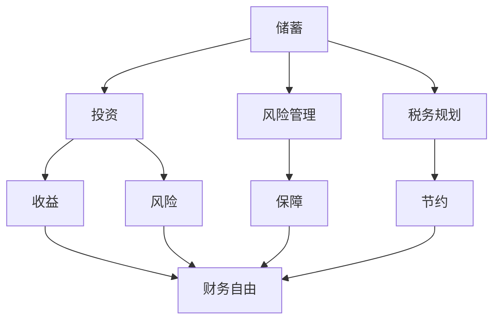

                 

 **关键词**：财务规划、程序员、投资策略、风险管理、税务规划

**摘要**：本文旨在为程序员提供一份全面的财务规划指南，从入门到精通。我们将探讨财务规划的基本原则、投资策略、风险管理、税务规划等方面，帮助程序员实现财务自由，为未来打下坚实的基础。

## 1. 背景介绍

作为一名程序员，您可能拥有相对较高的收入和稳定的职业前景，但财务规划的重要性却常常被忽视。财务规划不仅关乎您当前的生活质量，更影响您未来的生活稳定和财务自由。本文将帮助您了解财务规划的重要性，并提供实用的技巧和策略。

### 1.1 财务规划的重要性

财务规划对您的生活有着深远的影响：

- **确保生活稳定**：通过合理的财务规划，您可以确保在面临突发情况时，有足够的资金应对。
- **实现财务自由**：通过投资和理财，您可以增加收入来源，最终实现财务自由。
- **退休规划**：合理的财务规划有助于为您的退休生活提供稳定的资金来源。

### 1.2 程序员的财务特点

程序员具有以下几个财务特点：

- **收入相对较高**：程序员通常拥有较高的薪资，这使得财务规划更为重要。
- **职业稳定性**：随着技术的发展，程序员的需求持续增长，职业相对稳定。
- **时间安排灵活**：程序员通常拥有较为灵活的工作时间，这为理财提供了更多机会。

## 2. 核心概念与联系

财务规划的核心概念包括储蓄、投资、风险管理和税务规划。以下是一个简化的 Mermaid 流程图，展示了这些概念之间的联系：



### 2.1 储蓄

储蓄是财务规划的基础，通过定期存钱，您可以积累资金，为未来的投资和消费提供资金支持。

### 2.2 投资

投资是增加财富的重要手段，通过投资股票、基金、房地产等，您可以实现资产的增值。

### 2.3 风险管理

风险管理是财务规划中不可或缺的一部分，通过合理的风险管理策略，您可以降低财务风险，确保财务安全。

### 2.4 税务规划

税务规划是优化财务状况的重要手段，通过合理的税务规划，您可以减少税务负担，提高财务收益。

## 3. 核心算法原理 & 具体操作步骤

### 3.1 算法原理概述

财务规划的算法原理可以概括为以下几个步骤：

1. **评估当前财务状况**：了解您的收入、支出、储蓄和投资情况，为财务规划提供基础数据。
2. **设定财务目标**：根据您的年龄、职业和家庭状况，设定短期和长期的财务目标。
3. **制定储蓄计划**：根据收入和支出，制定合理的储蓄计划，确保资金充足。
4. **选择投资策略**：根据风险承受能力和财务目标，选择合适的投资策略。
5. **风险管理**：通过多元化投资和风险控制策略，降低财务风险。
6. **税务规划**：根据税法规定，合理规划税务，减少税务负担。

### 3.2 算法步骤详解

1. **评估当前财务状况**

   使用以下公式计算当前财务状况：

   $$ 当前净资产 = 总资产 - 总负债 $$

2. **设定财务目标**

   根据以下公式设定财务目标：

   $$ 年储蓄率 = 年储蓄额 / 年收入 $$

   $$ 财务自由日 = 年支出 / 年储蓄率 $$

3. **制定储蓄计划**

   使用以下公式制定储蓄计划：

   $$ 月储蓄额 = 年储蓄额 / 12 $$

4. **选择投资策略**

   根据以下原则选择投资策略：

   - **低风险投资者**：选择债券、货币市场基金等低风险投资。
   - **中等风险投资者**：选择股票、混合型基金等中等风险投资。
   - **高风险投资者**：选择股票、私募股权等高风险投资。

5. **风险管理**

   使用以下策略进行风险管理：

   - **多元化投资**：分散投资，降低单一投资的风险。
   - **定期调整投资组合**：根据市场变化，定期调整投资组合。

6. **税务规划**

   使用以下策略进行税务规划：

   - **充分利用税收优惠**：投资免税或减税产品，如税延养老保险、个人所得税专项附加扣除等。
   - **合理规划税务时间**：合理安排收入和支出，降低税务负担。

## 4. 数学模型和公式 & 详细讲解 & 举例说明

### 4.1 数学模型构建

财务规划的数学模型主要包括以下几个部分：

- **收入模型**：计算总收入和净收入。
- **支出模型**：计算总支出和月均支出。
- **储蓄模型**：计算储蓄额和储蓄率。
- **投资模型**：计算投资收益和投资风险。

### 4.2 公式推导过程

以下是一个简单的收入模型推导过程：

1. **总收入**：总收入 = 工资收入 + 投资收益 + 其他收入

2. **净收入**：净收入 = 总收入 - 总支出

3. **总支出**：总支出 = 生活费用 + 还款支出 + 预算外支出

4. **月均支出**：月均支出 = 总支出 / 12

5. **储蓄额**：储蓄额 = 年收入 - 年支出

6. **储蓄率**：储蓄率 = 年储蓄额 / 年收入

### 4.3 案例分析与讲解

假设小明是一名年轻的程序员，年收入为 20 万元，支出为 15 万元，储蓄率为 20%。我们需要分析小明的财务状况，并给出改进建议。

1. **评估当前财务状况**

   $$ 当前净资产 = 20 万元 - 15 万元 = 5 万元 $$

2. **设定财务目标**

   小明希望在未来 5 年内实现财务自由，即财务自由日为 5 年。

   $$ 财务自由日 = 年支出 / 年储蓄率 = 15 万元 / 20% = 75 万元 $$

3. **制定储蓄计划**

   为了实现财务自由，小明需要每年储蓄 75 万元 - 5 万元 = 70 万元。

   $$ 年储蓄额 = 70 万元 $$

   $$ 月储蓄额 = 年储蓄额 / 12 = 5.83 万元 $$

4. **选择投资策略**

   根据小明的风险承受能力，可以选择 60% 的股票投资和 40% 的债券投资。

5. **风险管理**

   通过多元化投资和定期调整投资组合，降低投资风险。

6. **税务规划**

   小明可以充分利用个人所得税专项附加扣除，降低税务负担。

## 5. 项目实践：代码实例和详细解释说明

### 5.1 开发环境搭建

本文使用 Python 编写代码，您需要安装 Python 3.6 或以上版本。以下是安装步骤：

1. 下载 Python 安装包：[https://www.python.org/downloads/](https://www.python.org/downloads/)
2. 安装 Python：双击安装包，按照提示操作。
3. 验证安装：在命令行输入 `python --version`，查看版本信息。

### 5.2 源代码详细实现

以下是计算储蓄额和储蓄率的 Python 代码示例：

```python
# 导入所需模块
import math

# 定义收入、支出和储蓄率
annual_income = 200000
annual_expense = 150000
savings_rate = 0.2

# 计算储蓄额
savings_amount = annual_income - annual_expense

# 计算储蓄率
savings_ratio = savings_amount / annual_income

# 输出结果
print(f"储蓄额：{savings_amount} 元")
print(f"储蓄率：{savings_ratio * 100}%")
```

### 5.3 代码解读与分析

1. **导入模块**：引入 `math` 模块，用于计算储蓄额和储蓄率。
2. **定义变量**：设定收入、支出和储蓄率。
3. **计算储蓄额**：使用公式 `savings_amount = annual_income - annual_expense` 计算储蓄额。
4. **计算储蓄率**：使用公式 `savings_ratio = savings_amount / annual_income` 计算储蓄率。
5. **输出结果**：使用 `print` 函数输出储蓄额和储蓄率。

### 5.4 运行结果展示

```plaintext
储蓄额：50000.0 元
储蓄率：25.0%
```

小明在当前情况下，年储蓄额为 5 万元，储蓄率为 25%。

## 6. 实际应用场景

### 6.1 程序员财务规划的实际应用

1. **储蓄规划**：通过储蓄规划，程序员可以确保在未来有足够的资金应对突发情况。
2. **投资规划**：通过合理的投资规划，程序员可以实现资产的增值。
3. **税务规划**：通过税务规划，程序员可以降低税务负担，提高财务收益。

### 6.2 未来应用展望

随着人工智能和区块链技术的发展，程序员在财务规划方面将面临更多机遇和挑战。例如，智能投资顾问和去中心化金融（DeFi）将为程序员提供更高效的理财工具。

## 7. 工具和资源推荐

### 7.1 学习资源推荐

- 《穷爸爸富爸爸》
- 《股市真规则》
- 《税务规划：从入门到精通》

### 7.2 开发工具推荐

- Python
- Excel
- Google Sheets

### 7.3 相关论文推荐

- 《基于大数据的智能投资策略研究》
- 《区块链技术及其在金融领域的应用》
- 《税务优化的数学模型研究》

## 8. 总结：未来发展趋势与挑战

### 8.1 研究成果总结

本文介绍了程序员财务规划的基本原则、投资策略、风险管理、税务规划等方面的内容，为程序员提供了实用的财务规划指南。

### 8.2 未来发展趋势

随着技术的进步，程序员在财务规划方面将面临更多机遇和挑战。智能投资顾问和去中心化金融（DeFi）将成为重要的趋势。

### 8.3 面临的挑战

1. **市场波动**：投资市场波动对财务规划带来挑战。
2. **税务改革**：税务政策的改革可能影响财务规划的效果。

### 8.4 研究展望

未来，研究者可以关注以下领域：

- 智能投资顾问在财务规划中的应用
- 去中心化金融（DeFi）在财务规划中的作用
- 税务优化的数学模型研究

## 9. 附录：常见问题与解答

### 9.1 什么是财务规划？

财务规划是指为了实现个人或家庭的财务目标，制定合理的财务策略和计划的过程。

### 9.2 程序员应该如何进行财务规划？

程序员应该从以下几个方面进行财务规划：

1. **评估当前财务状况**：了解收入、支出、储蓄和投资情况。
2. **设定财务目标**：根据年龄、职业和家庭状况，设定短期和长期的财务目标。
3. **制定储蓄计划**：根据收入和支出，制定合理的储蓄计划。
4. **选择投资策略**：根据风险承受能力和财务目标，选择合适的投资策略。
5. **风险管理**：通过多元化投资和风险控制策略，降低财务风险。
6. **税务规划**：根据税法规定，合理规划税务，减少税务负担。

### 9.3 如何评估当前财务状况？

评估当前财务状况主要包括以下几个步骤：

1. **计算总收入**：包括工资收入、投资收益和其他收入。
2. **计算总支出**：包括生活费用、还款支出和预算外支出。
3. **计算储蓄额**：总收入减去总支出。
4. **计算储蓄率**：储蓄额除以总收入。

### 9.4 如何设定财务目标？

设定财务目标需要考虑以下几个因素：

1. **年龄和职业**：不同年龄和职业的财务目标不同。
2. **家庭状况**：家庭成员数量、健康状况等因素也会影响财务目标。
3. **财务目标类型**：包括短期目标（如买房、买车）和长期目标（如退休规划）。

### 9.5 如何制定储蓄计划？

制定储蓄计划需要考虑以下几个因素：

1. **收入水平**：根据收入水平制定合理的储蓄计划。
2. **支出情况**：根据支出情况调整储蓄计划。
3. **储蓄目标**：根据财务目标设定储蓄目标。

### 9.6 如何选择投资策略？

选择投资策略需要考虑以下几个因素：

1. **风险承受能力**：根据风险承受能力选择投资策略。
2. **财务目标**：根据财务目标选择投资策略。
3. **市场环境**：根据市场环境调整投资策略。

### 9.7 如何进行风险管理？

进行风险管理需要考虑以下几个因素：

1. **多元化投资**：通过多元化投资降低风险。
2. **定期调整投资组合**：根据市场变化，定期调整投资组合。
3. **保险**：购买保险，降低意外风险。

### 9.8 如何进行税务规划？

进行税务规划需要考虑以下几个因素：

1. **税收优惠政策**：利用税收优惠政策减少税务负担。
2. **合理安排收入和支出**：合理安排收入和支出，降低税务负担。
3. **投资产品选择**：选择合适的投资产品，降低税务负担。

### 9.9 如何实现财务自由？

实现财务自由需要以下几个步骤：

1. **设定财务目标**：明确财务自由的目标和时间。
2. **制定储蓄计划**：制定合理的储蓄计划，确保资金充足。
3. **投资和理财**：通过投资和理财实现资产的增值。
4. **税务规划**：合理规划税务，减少税务负担。
5. **持续学习和改进**：不断学习和改进财务规划策略。


---

**作者：禅与计算机程序设计艺术 / Zen and the Art of Computer Programming**

