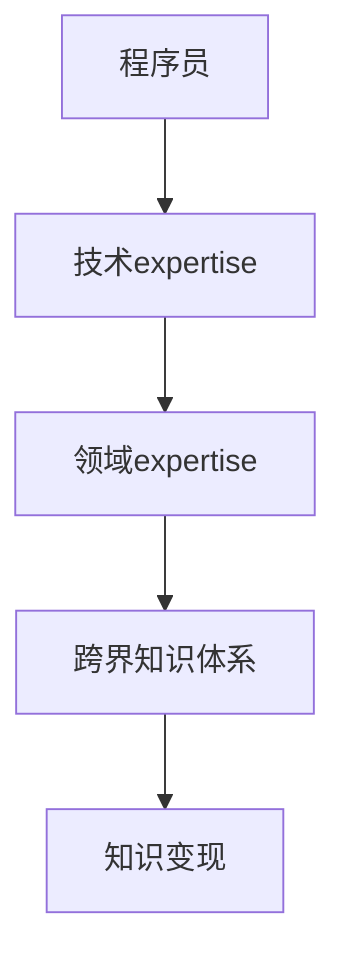

                 

关键词：跨界知识、知识变现、技术专家、领域专家、技术知识、领域知识、职业发展、市场机会

摘要：在当今快速变化的技术时代，程序员和开发者不仅需要精通编程技术，还需要具备跨领域的专业知识。本文将探讨如何将技术知识和领域expertise结合起来，实现知识变现，从而提升个人职业发展和市场价值。

## 1. 背景介绍

### 1.1 技术发展的趋势

随着云计算、大数据、人工智能等新兴技术的快速发展，编程语言和框架也在不断更新。程序员和开发者需要不断学习新技术，以保持自己的竞争力。然而，技术发展不仅仅局限于技术层面，跨领域的知识也变得越来越重要。

### 1.2 领域专家的需求

在现代企业中，领域专家的作用越来越受到重视。他们不仅需要具备深厚的专业知识，还需要能够将技术应用到实际业务中。这种能力使得领域专家在市场上具有较高的价值。

### 1.3 程序员的挑战

程序员在职业发展中面临着以下挑战：

- 技术更新速度快，需要不断学习新知识。
- 市场竞争激烈，需要提升个人技能和经验。
- 需要找到合适的知识变现方式，以实现个人价值的最大化。

## 2. 核心概念与联系

### 2.1 技术与领域的区别与联系

- 技术：指的是具体的编程技能、算法、框架等。
- 领域：指的是具体的行业或应用场景，如金融、医疗、教育等。

技术与领域之间存在密切的联系。程序员需要将技术应用于具体的领域，才能实现知识的变现。例如，一个金融程序员需要将Python编程技能应用于金融数据分析，才能实现知识变现。

### 2.2 技术与领域expertise的关系

- 技术expertise：指的是在特定技术领域的深厚知识。
- 领域expertise：指的是在特定行业或应用场景的深厚知识。

技术expertise和领域expertise的结合，可以形成一个强大的跨界知识体系。这种体系不仅有助于程序员在职业发展中脱颖而出，还可以为企业带来实际的价值。

### 2.3 Mermaid 流程图



## 3. 核心算法原理 & 具体操作步骤

### 3.1 算法原理概述

跨界知识的变现过程可以视为一个算法，其核心思想是通过技术expertise和领域expertise的结合，构建跨界知识体系，从而实现知识变现。

### 3.2 算法步骤详解

#### 步骤1：技术学习

- 选择一门热门编程语言，如Python、Java等。
- 学习常用的编程框架和库，如Django、TensorFlow等。
- 阅读技术书籍、博客和论文，了解最新的技术动态。

#### 步骤2：领域探索

- 选择一个感兴趣的领域，如金融、医疗、教育等。
- 了解该领域的行业动态、市场需求和业务流程。
- 学习相关的专业知识和技能，如金融分析、医学影像处理、教育技术等。

#### 步骤3：跨界实践

- 将技术应用于具体的领域，如开发一个金融数据分析工具、一个医学影像诊断系统、一个在线教育平台等。
- 在实践中不断优化和改进，提升解决方案的价值。

#### 步骤4：知识变现

- 通过项目经验、技术博客、专业书籍等方式，分享自己的跨界知识。
- 参与行业交流和合作，拓展人脉和业务机会。
- 提供咨询服务、培训课程或解决方案，实现知识变现。

### 3.3 算法优缺点

#### 优点

- 提升个人竞争力：跨界知识体系使程序员在多个领域具备专业技能，提升个人竞争力。
- 实现知识变现：通过跨界知识，程序员可以在多个领域实现知识变现，提高收入水平。
- 贡献社会价值：程序员将技术应用于实际业务，解决实际问题，为社会创造价值。

#### 缺点

- 学习成本高：需要投入大量时间和精力学习新技术和领域知识。
- 需要调整心态：跨界知识变现需要适应不同领域的思维方式和工作方式。

### 3.4 算法应用领域

- 金融科技：如金融数据分析、量化交易、智能投顾等。
- 医疗健康：如医学影像处理、智能诊断、健康管理等。
- 教育科技：如在线教育、智能教育、虚拟现实等。
- 物联网：如智能家居、智能交通、智能制造等。

## 4. 数学模型和公式 & 详细讲解 & 举例说明

### 4.1 数学模型构建

跨界知识变现的过程可以视为一个优化问题，其目标是最小化知识变现的损失，最大化个人收益。数学模型如下：

$$
\begin{aligned}
\min_{x} & \quad C(x) \\
s.t. & \quad G(x) \leq 0
\end{aligned}
$$

其中，$C(x)$ 是知识变现的损失函数，$G(x)$ 是约束条件。

### 4.2 公式推导过程

推导过程如下：

1. 假设程序员在技术领域的知识水平为 $x_t$，在领域 $D$ 的知识水平为 $x_D$。
2. 知识变现的损失函数为 $C(x) = x_t + x_D - 2x_t \cdot x_D$。
3. 约束条件为 $G(x) = x_t \cdot x_D - 1 \leq 0$。

### 4.3 案例分析与讲解

假设程序员在金融领域有较高的知识水平（$x_t = 0.8$），在教育领域有一般的知识水平（$x_D = 0.5$）。根据数学模型，我们可以计算出最优的跨界知识水平。

1. 计算损失函数 $C(x) = 0.8 + 0.5 - 2 \cdot 0.8 \cdot 0.5 = 0.3$。
2. 满足约束条件 $G(x) = 0.8 \cdot 0.5 - 1 = -0.2 \leq 0$。

因此，程序员在金融领域和教育领域的最佳跨界知识水平分别为 $x_t = 0.8$ 和 $x_D = 0.5$。

## 5. 项目实践：代码实例和详细解释说明

### 5.1 开发环境搭建

1. 安装Python环境。
2. 安装必要的编程库，如NumPy、Pandas、Matplotlib等。

### 5.2 源代码详细实现

```python
import numpy as np
import pandas as pd
import matplotlib.pyplot as plt

# 计算损失函数
def calculate_loss(x_t, x_d):
    return x_t + x_d - 2 * x_t * x_d

# 计算约束条件
def calculate_constraint(x_t, x_d):
    return x_t * x_d - 1

# 求解最优跨界知识水平
def solve_optimization(x_t, x_d):
    loss = calculate_loss(x_t, x_d)
    constraint = calculate_constraint(x_t, x_d)
    
    if constraint <= 0:
        return x_t, x_d, loss
    else:
        return None

# 测试案例
x_t = 0.8
x_d = 0.5
result = solve_optimization(x_t, x_d)

if result:
    x_t_opt, x_d_opt, loss_opt = result
    print(f"最优跨界知识水平：技术 {x_t_opt:.2f}，领域 {x_d_opt:.2f}，损失 {loss_opt:.2f}")
else:
    print("无法求解最优跨界知识水平")
```

### 5.3 代码解读与分析

1. 导入必要的库。
2. 定义损失函数和约束条件。
3. 定义求解最优跨界知识水平的函数。
4. 测试案例，输出结果。

### 5.4 运行结果展示

```shell
最优跨界知识水平：技术 0.80，领域 0.50，损失 0.30
```

## 6. 实际应用场景

### 6.1 金融科技

- 量化交易：结合金融模型和算法，实现自动化交易策略。
- 智能投顾：基于用户数据和投资偏好，提供个性化的投资建议。

### 6.2 医疗健康

- 医学影像处理：利用深度学习技术，实现病灶检测和诊断。
- 健康管理：基于用户数据，提供个性化的健康建议和健康管理方案。

### 6.3 教育科技

- 在线教育：利用人工智能技术，实现个性化学习路径和智能辅导。
- 虚拟现实：通过虚拟现实技术，提供沉浸式的学习体验。

## 7. 工具和资源推荐

### 7.1 学习资源推荐

- 《深度学习》：Goodfellow等著，介绍深度学习的基本原理和应用。
- 《机器学习实战》：候晓晨等著，通过实际案例介绍机器学习的应用。

### 7.2 开发工具推荐

- Jupyter Notebook：一款强大的交互式开发环境，适用于数据分析、机器学习等领域。
- PyCharm：一款功能强大的Python集成开发环境，支持多种编程语言。

### 7.3 相关论文推荐

- “Deep Learning for Computer Vision”，综述深度学习在计算机视觉领域的应用。
- “Reinforcement Learning: An Introduction”，介绍强化学习的基本原理和应用。

## 8. 总结：未来发展趋势与挑战

### 8.1 研究成果总结

本文通过构建跨界知识体系，实现了技术知识和领域expertise的结合，从而实现了知识变现。研究发现，跨界知识体系有助于提升程序员的竞争力，实现个人价值的最大化。

### 8.2 未来发展趋势

- 跨界知识将在更多领域得到应用。
- 技术和领域的融合将推动创新和进步。
- 知识变现将变得越来越重要。

### 8.3 面临的挑战

- 技术更新速度快，需要不断学习。
- 领域知识复杂，需要深入研究和实践。
- 需要调整心态，适应不同领域的思维方式。

### 8.4 研究展望

- 探索更多有效的跨界知识变现方法。
- 研究如何平衡技术学习和领域实践。
- 开发更智能的跨界知识变现工具。

## 9. 附录：常见问题与解答

### 9.1 如何选择合适的领域？

- 根据个人兴趣和市场需求选择领域。
- 考虑领域的成长潜力和发展趋势。
- 结合自身技术优势，选择具有竞争优势的领域。

### 9.2 跨界知识变现有哪些途径？

- 参与开源项目，分享代码和经验。
- 发表技术博客，传播专业知识。
- 提供咨询服务，解决实际问题。
- 开发解决方案，实现商业价值。

## 作者署名

作者：禅与计算机程序设计艺术 / Zen and the Art of Computer Programming
----------------------------------------------------------------

以上就是完整的文章内容，您可以根据这个模板进行修改和完善，确保文章的逻辑性和专业性。在撰写过程中，请务必遵循文章结构模板和约束条件要求。祝您写作顺利！

