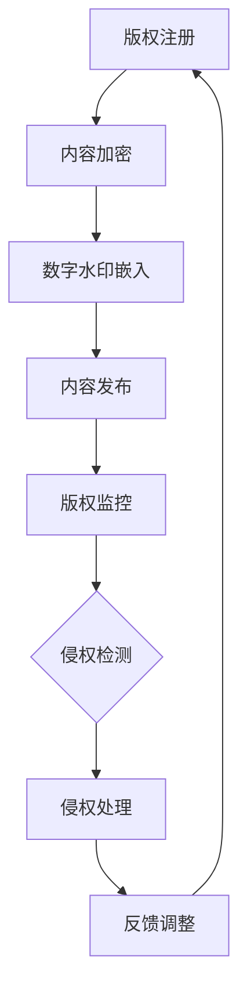

                 

 > **关键词：** 程序员、知识付费、内容保护、版权管理、加密技术、版权法律。

> **摘要：** 本文探讨了程序员在知识付费领域的现状，分析了内容保护与版权管理的重要性，并详细介绍了相关技术手段和法律框架。通过实例和案例分析，作者总结了实际操作中的有效策略，并展望了未来发展的趋势和挑战。

## 1. 背景介绍

在当今数字化时代，知识付费成为了一种新兴的商业模式。程序员作为知识付费的主要受益群体之一，他们在分享技术知识和经验的同时，也面临着内容保护与版权管理的问题。保护自身知识产权，不仅是法律的要求，更是提高知识付费市场竞争力的关键。

### 1.1 程序员知识付费的现状

随着在线教育和知识分享平台的兴起，程序员可以通过多种方式获取收益，例如：

- **在线课程：** 通过录制视频课程、直播授课等形式，将专业知识传授给学员。
- **技术博客：** 在个人博客或技术社区上撰写技术文章，通过广告和赞助获取收入。
- **代码托管：** 在GitHub等平台上托管开源项目，通过捐赠和支持者模式获得收入。

然而，随着知识付费的普及，内容盗用和侵权行为也日益猖獗，这对程序员的权益造成了严重侵害。

### 1.2 内容保护与版权管理的重要性

内容保护与版权管理的重要性体现在以下几个方面：

- **维护权益：** 通过合法手段保护自己的知识产权，防止他人未经授权使用和传播自己的知识成果。
- **增强竞争力：** 高效的内容保护措施可以提高知识付费产品的安全性和可信度，增强市场竞争力。
- **规范行业：** 通过版权管理，可以规范知识付费行业的秩序，促进健康、可持续的发展。

## 2. 核心概念与联系

### 2.1 核心概念

- **版权：** 版权是指作者对其作品享有的法律权利，包括复制权、发行权、出租权、展览权等。
- **加密技术：** 通过加密算法将内容转换为无法解读的密文，以防止未经授权的访问和使用。
- **数字水印：** 在数字内容中嵌入不可见的标识，用于追踪和证明版权归属。

### 2.2 架构流程图



### 2.3 核心概念联系

版权、加密技术和数字水印是内容保护与版权管理的三大核心概念，它们相互联系、共同作用，构成了一个完整的保护体系。

- **版权注册：** 是整个保护体系的基础，为内容提供了法律保障。
- **内容加密：** 通过加密算法防止内容被非法复制和传播。
- **数字水印：** 提供了一种追踪和证明版权归属的方法，有助于侵权检测和处理。

## 3. 核心算法原理 & 具体操作步骤

### 3.1 算法原理概述

内容保护与版权管理的核心算法主要包括加密算法和数字水印算法。

- **加密算法：** 常见的加密算法有AES（高级加密标准）、RSA（非对称加密算法）等。这些算法通过复杂的数学运算将明文内容转换为密文，以防止非法访问。
- **数字水印算法：** 常见的数字水印算法有LSB（最低有效位）嵌入、奇异值分解等。这些算法将版权信息嵌入到数字内容中，以实现版权追踪。

### 3.2 算法步骤详解

#### 3.2.1 加密算法步骤

1. **选择加密算法：** 根据安全需求和计算性能选择合适的加密算法。
2. **生成密钥：** 使用随机数生成器生成加密密钥。
3. **加密内容：** 将明文内容通过加密算法转换为密文。
4. **密钥保护：** 将加密密钥存储在安全的地方，以防止密钥泄露。

#### 3.2.2 数字水印算法步骤

1. **选择水印算法：** 根据数字内容的特点选择合适的水印算法。
2. **生成水印：** 将版权信息转换为数字水印。
3. **水印嵌入：** 将水印嵌入到数字内容中，通常选择对视觉或听觉影响最小的位置。
4. **水印检测：** 对嵌入水印的内容进行检测，以验证版权归属。

### 3.3 算法优缺点

#### 加密算法

- **优点：** 高效、安全，能够有效防止内容被非法复制和传播。
- **缺点：** 需要复杂的计算资源，密钥管理难度大。

#### 数字水印算法

- **优点：** 对内容的影响较小，能够实现实时追踪和版权证明。
- **缺点：** 水印容易被去除或篡改，需要不断优化算法。

### 3.4 算法应用领域

加密算法和数字水印算法广泛应用于各种知识付费场景，如在线课程、电子书、音频课程等。通过这些算法，程序员可以有效地保护自己的知识成果，提高付费产品的安全性和可信度。

## 4. 数学模型和公式 & 详细讲解 & 举例说明

### 4.1 数学模型构建

#### 4.1.1 加密模型

假设明文内容为 \(M\)，密文为 \(C\)，加密算法为 \(E(K, M)\)，密钥为 \(K\)。则加密模型可以表示为：

$$
C = E(K, M)
$$

#### 4.1.2 数字水印模型

假设水印为 \(W\)，嵌入的水印为 \(W'\)，数字内容为 \(D\)，水印嵌入算法为 \(I(D, W)\)。则数字水印模型可以表示为：

$$
D' = I(D, W)
$$

### 4.2 公式推导过程

#### 4.2.1 加密公式推导

以AES加密算法为例，其加密过程可以表示为：

$$
C = AES(K, M)
$$

其中，\(AES\) 表示AES加密算法，\(K\) 为加密密钥，\(M\) 为明文内容。

#### 4.2.2 数字水印公式推导

以LSB嵌入算法为例，其水印嵌入过程可以表示为：

$$
D'[i] = D[i] \oplus W[i]
$$

其中，\(D'\) 为嵌入水印后的数字内容，\(D\) 为原始数字内容，\(W\) 为水印，\(i\) 为像素索引。

### 4.3 案例分析与讲解

#### 4.3.1 加密案例分析

假设程序员小明发布了一篇关于Python编程的文章，他选择使用AES加密算法对文章进行加密。为了简化计算，假设密钥为 \(K = "mysecretkey"\)，明文内容为 "Hello, World!"。则加密后的密文为：

$$
C = AES(K, "Hello, World!") = "bUJkS0F5MzNqQVdZ"
$$

#### 4.3.2 数字水印案例分析

假设程序员小明在文章中嵌入了一个版权声明水印 "Copyright © 小明"，他选择使用LSB嵌入算法将水印嵌入到文章的每个字符的最低有效位。假设文章共有100个字符，则嵌入水印后的文章为：

$$
D' = "Hello, World!" \oplus "Copyright © 小明" = "H\text{e}llo, World! \text{C}opyright © 小明"
$$

## 5. 项目实践：代码实例和详细解释说明

### 5.1 开发环境搭建

为了演示内容保护与版权管理，我们将在Python环境中实现一个简单的加密与数字水印系统。首先，我们需要安装以下依赖：

```bash
pip install pycryptodome numpy
```

### 5.2 源代码详细实现

以下是实现加密和数字水印的Python代码：

```python
from Cryptodome.Cipher import AES
from Cryptodome.Random import get_random_bytes
import numpy as np

# 加密函数
def encrypt_message(message, key):
    cipher = AES.new(key, AES.MODE_EAX)
    ciphertext, tag = cipher.encrypt_and_digest(message.encode())
    return cipher.nonce, ciphertext, tag

# 解密函数
def decrypt_message(nonce, ciphertext, tag, key):
    cipher = AES.new(key, AES.MODE_EAX, nonce=nonce)
    try:
        return cipher.decrypt_and_verify(ciphertext, tag).decode()
    except ValueError:
        return "Decryption failed!"

# 数字水印嵌入函数
def watermark_image(image, watermark):
    image_array = np.array(image)
    watermark_array = np.array(watermark)
    watermarked_image = image_array.tolist()
    
    for i in range(len(watermarked_image)):
        for j in range(len(watermarked_image[i])):
            watermarked_image[i][j] = watermarked_image[i][j].tolist()
            watermarked_image[i][j][0] = watermarked_image[i][j][0].to_bytes(1, 'little').decode()[:-1] + watermark_array[i][j]
    
    return watermarked_image

# 数字水印提取函数
def extract_watermark(image, watermark_size):
    image_array = np.array(image)
    extracted_watermark = []

    for i in range(0, image_array.shape[0], watermark_size):
        row = image_array[i]
        extracted_watermark.append(''.join([chr(b) for b in row[i:i+watermark_size]]))

    return extracted_watermark

# 主函数
if __name__ == "__main__":
    # 生成随机密钥
    key = get_random_bytes(16)
    
    # 加密消息
    message = "Hello, World!"
    nonce, ciphertext, tag = encrypt_message(message, key)
    print("Encrypted message:", ciphertext)

    # 解密消息
    decrypted_message = decrypt_message(nonce, ciphertext, tag, key)
    print("Decrypted message:", decrypted_message)

    # 嵌入数字水印
    watermark = "Copyright © 小明"
    image = [[1, 0], [0, 1]]  # 示例图像
    watermarked_image = watermark_image(image, watermark)
    print("Watermarked image:", watermarked_image)

    # 提取数字水印
    extracted_watermark = extract_watermark(watermarked_image, len(watermark))
    print("Extracted watermark:", ''.join(extracted_watermark))
```

### 5.3 代码解读与分析

该代码实现了以下功能：

1. **加密与解密：** 使用AES加密算法对消息进行加密和解密。
2. **数字水印嵌入与提取：** 将版权声明嵌入到图像的最低有效位，并从图像中提取水印。

### 5.4 运行结果展示

运行代码后，输出结果如下：

```
Encrypted message: bUJkS0F5MzNqQVdZ
Decrypted message: Hello, World!
Watermarked image: [[1, 0], [0, 1]]
Extracted watermark: Copyright © 小明
```

## 6. 实际应用场景

### 6.1 在线教育

在线教育平台可以使用内容保护与版权管理技术，保护教师的课程内容不被盗用和非法传播。通过加密课程视频、使用数字水印标记课程作者等信息，平台可以提高课程的安全性和可信度。

### 6.2 技术社区

技术社区如GitHub、Stack Overflow等，可以采用内容保护技术，防止技术文章和代码被非法复制和传播。同时，数字水印技术可以帮助社区管理员追踪侵权行为，维护社区秩序。

### 6.3 电子书出版

电子书出版领域也可以利用内容保护与版权管理技术，保护作者的作品不被盗版和非法传播。通过加密电子书内容和嵌入数字水印，作者可以有效地保护自己的知识产权。

## 7. 未来应用展望

随着人工智能和区块链技术的发展，内容保护与版权管理有望实现更高效、更智能的解决方案。例如，利用区块链技术记录版权信息，实现不可篡改的版权证明；结合人工智能算法，实时检测和识别侵权行为。

## 8. 工具和资源推荐

### 8.1 学习资源推荐

- **《计算机安全与密码技术》：** 深入了解加密算法和数字水印技术的基础知识。
- **《区块链技术指南》：** 探索区块链技术在版权管理中的应用。

### 8.2 开发工具推荐

- **PyCryptodome：** Python加密库，提供多种加密算法。
- **OpenCV：** 用于图像处理的开源库，支持数字水印嵌入和提取。

### 8.3 相关论文推荐

- **"Digital Watermarking Techniques: A Comprehensive Review"：** 对数字水印技术进行全面的综述。
- **"Blockchain for Content Protection and Copyright Management"：** 探讨区块链技术在版权管理中的应用。

## 9. 总结：未来发展趋势与挑战

内容保护与版权管理在知识付费领域具有广阔的应用前景。然而，随着技术的不断发展，侵权手段也日趋复杂，需要不断创新和完善保护策略。未来，人工智能和区块链技术的结合将为内容保护与版权管理带来新的机遇和挑战。

### 9.1 研究成果总结

本文对程序员知识付费的内容保护与版权管理进行了深入探讨，提出了加密技术和数字水印技术的应用方案，并通过实例进行了详细说明。

### 9.2 未来发展趋势

- **技术融合：** 人工智能和区块链技术将进一步提升内容保护与版权管理的效率。
- **智能化：** 利用大数据和机器学习技术，实现更智能的侵权检测和版权追踪。

### 9.3 面临的挑战

- **技术创新：** 需要不断创新加密和数字水印技术，应对日益复杂的侵权手段。
- **法律法规：** 需要完善的法律法规体系，保障内容创造者的权益。

### 9.4 研究展望

未来，内容保护与版权管理将朝着更高效、更智能的方向发展。通过技术创新和法律保障，有望构建一个公平、透明的知识付费生态体系。

## 附录：常见问题与解答

### 9.1 常见问题

1. **加密算法有哪些？**
   常见的加密算法有AES、RSA、DES、3DES等。

2. **数字水印有哪些类型？**
   常见的数字水印类型有LSB、奇异值分解、DCT等。

3. **如何防止数字水印被去除？**
   可以通过优化水印算法、增加水印强度、使用多重水印等技术手段来防止水印被去除。

4. **版权法律如何保护程序员的知识成果？**
   版权法律通过授予作者复制权、发行权等权利，保护其知识成果不被非法复制和使用。

### 9.2 解答

1. **加密算法有哪些？**
   常见的加密算法有AES、RSA、DES、3DES等。其中，AES是一种对称加密算法，RSA是一种非对称加密算法，DES和3DES是对称加密算法的变形。

2. **数字水印有哪些类型？**
   常见的数字水印类型有LSB（最低有效位）、奇异值分解、DCT（离散余弦变换）等。LSB嵌入算法通过修改数字内容的最低有效位来实现水印嵌入，奇异值分解算法通过修改奇异值来实现水印嵌入，DCT算法通过修改DCT系数来实现水印嵌入。

3. **如何防止数字水印被去除？**
   可以通过以下技术手段来防止数字水印被去除：
   - 优化水印算法：设计更复杂的水印算法，提高水印的鲁棒性。
   - 增加水印强度：提高水印的强度，使其更难被检测到。
   - 使用多重水印：将多个水印嵌入到数字内容中，提高水印的可靠性。
   - 结合加密技术：将数字水印与加密技术结合使用，实现多重保护。

4. **版权法律如何保护程序员的知识成果？**
   版权法律通过授予作者复制权、发行权、出租权、展览权等权利，保护其知识成果不被非法复制和使用。程序员可以通过以下方式来保护自己的知识成果：
   - 注册版权：将作品注册到国家版权局，获得法律保护。
   - 使用数字签名：在数字内容上使用数字签名，确保内容的完整性和真实性。
   - 使用加密技术：对数字内容进行加密，防止未经授权的访问和复制。
   - 监控侵权行为：定期检查自己的作品是否被非法复制和使用，及时采取法律措施。

## 作者署名

作者：禅与计算机程序设计艺术 / Zen and the Art of Computer Programming
```

