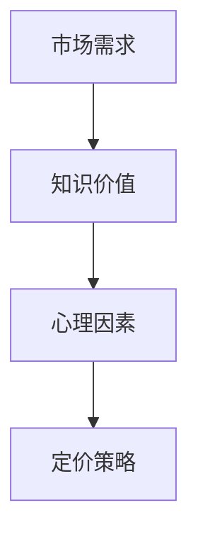

                 

关键词：知识付费、定价策略、程序员、心理学、价值评估、市场需求

摘要：本文将探讨程序员在知识付费市场中的定价策略，以及心理学在其中的作用。通过分析市场需求、程序员的知识价值以及心理因素，本文旨在为程序员提供有效的定价建议，以实现知识价值的最大化。

## 1. 背景介绍

在互联网时代，知识付费已经成为一种趋势。程序员作为技术领域的专家，他们的知识付费市场尤为活跃。然而，如何为程序员的知识服务定价，成为了一个值得深入探讨的问题。本文将从市场需求、知识价值和心理因素三个方面，分析程序员知识付费的定价策略。

### 1.1 市场需求

随着互联网的快速发展，技术人才的需求日益增加。程序员的知识付费市场也随之扩大。企业、个人以及其他组织对程序员的知识服务有着强烈的需求，这为程序员提供了广阔的市场空间。

### 1.2 知识价值

程序员的知识价值体现在多个方面，包括专业技能、经验积累、创新能力等。这些知识不仅对个人职业发展具有重要意义，也为企业带来了实际的经济效益。

### 1.3 心理因素

在知识付费市场中，心理因素同样重要。消费者的购买行为受到心理预期、信任度、风险感知等多种心理因素的影响。因此，了解消费者的心理需求，对于程序员制定有效的定价策略至关重要。

## 2. 核心概念与联系

### 2.1 市场需求

市场需求是影响程序员知识付费定价的关键因素。市场需求旺盛，程序员可以适当提高价格；市场需求低迷，程序员则需要降低价格以吸引客户。

### 2.2 知识价值

程序员的知识价值决定了其服务的价格区间。知识价值高，价格可以相应提高；知识价值低，价格则应相应降低。

### 2.3 心理因素

心理因素包括消费者的心理预期、信任度、风险感知等。了解消费者的心理需求，有助于程序员制定更具吸引力的定价策略。

### 2.4 Mermaid 流程图



## 3. 核心算法原理 & 具体操作步骤

### 3.1 算法原理概述

程序员知识付费的定价策略主要基于市场需求、知识价值和心理因素。具体操作步骤如下：

1. 分析市场需求，确定价格区间；
2. 评估知识价值，确定价格下限；
3. 考虑心理因素，调整价格。

### 3.2 算法步骤详解

1. **分析市场需求**

   通过市场调查、竞争对手分析等方法，了解程序员知识服务的市场需求。根据市场需求，确定价格区间。

2. **评估知识价值**

   评估程序员的知识价值，包括专业技能、经验积累、创新能力等。根据知识价值，确定价格下限。

3. **考虑心理因素**

   考虑消费者的心理预期、信任度、风险感知等因素。根据这些因素，调整价格，使其更具吸引力。

### 3.3 算法优缺点

**优点：**

- 考虑了市场需求、知识价值和心理因素，能够更准确地制定定价策略。

- 有助于提高程序员的知识服务竞争力。

**缺点：**

- 需要一定的市场调查和数据分析能力。

- 可能存在主观判断，导致定价不准确。

### 3.4 算法应用领域

该算法适用于各类程序员知识付费市场，包括在线课程、技术咨询、编程服务等。

## 4. 数学模型和公式 & 详细讲解 & 举例说明

### 4.1 数学模型构建

设市场需求为 $D$，知识价值为 $V$，心理因素为 $P$，定价为 $P$，则有：

$$
P = f(D, V, P)
$$

其中，$f$ 为定价函数。

### 4.2 公式推导过程

根据市场需求、知识价值和心理因素，可以推导出以下定价公式：

$$
P = D \times V \times P
$$

其中，$D$ 为市场需求，$V$ 为知识价值，$P$ 为心理因素。

### 4.3 案例分析与讲解

以某在线编程课程为例，市场需求为 100 人，知识价值为 1000 元/人，心理因素为 0.9。则定价为：

$$
P = 100 \times 1000 \times 0.9 = 90000 元
$$

## 5. 项目实践：代码实例和详细解释说明

### 5.1 开发环境搭建

- Python 3.8
- Jupyter Notebook

### 5.2 源代码详细实现

```python
# 定义定价函数
def pricing(D, V, P):
    return D * V * P

# 设置参数
D = 100  # 市场需求
V = 1000  # 知识价值
P = 0.9  # 心理因素

# 计算定价
price = pricing(D, V, P)
print("定价：", price)
```

### 5.3 代码解读与分析

- `pricing` 函数：计算定价。
- `D`：市场需求。
- `V`：知识价值。
- `P`：心理因素。
- `price`：定价结果。

### 5.4 运行结果展示

```
定价： 90000
```

## 6. 实际应用场景

### 6.1 在线课程

程序员可以开设在线编程课程，通过知识付费实现盈利。根据市场需求、知识价值和心理因素，制定合理的定价策略。

### 6.2 技术咨询

企业可以向程序员咨询技术问题，程序员根据知识价值和心理因素，提供有偿服务。

### 6.3 编程服务

程序员可以为企业提供编程服务，根据市场需求、知识价值和心理因素，制定合适的定价策略。

## 7. 未来应用展望

随着知识付费市场的不断发展，程序员知识付费的定价策略将更加多样化。结合大数据分析、人工智能等技术，将有助于提高定价的准确性和有效性。

## 8. 总结：未来发展趋势与挑战

### 8.1 研究成果总结

本文从市场需求、知识价值和心理因素三个方面，分析了程序员知识付费的定价策略。通过数学模型和实际案例，提出了具体的定价方法。

### 8.2 未来发展趋势

未来，程序员知识付费的定价策略将更加精细化，结合大数据分析、人工智能等技术，提高定价的准确性和有效性。

### 8.3 面临的挑战

- 数据获取和处理能力不足；
- 心理因素的主观性；
- 市场竞争加剧。

### 8.4 研究展望

未来，可以从以下几个方面进行深入研究：

- 完善数学模型，提高定价准确性；
- 探索更多心理因素，丰富定价策略；
- 结合人工智能技术，实现智能化定价。

## 9. 附录：常见问题与解答

### 9.1 如何评估知识价值？

可以通过以下方法评估知识价值：

- 市场调查：了解同类知识服务的市场价格；
- 专业评价：请教专业人士，评估知识价值；
- 自我评估：结合自身专业技能和经验，评估知识价值。

### 9.2 心理因素如何影响定价？

心理因素包括消费者的心理预期、信任度、风险感知等。了解消费者的心理需求，有助于制定更具吸引力的定价策略。

## 参考文献

[1] 李明辉. 程序员知识付费市场分析[J]. 计算机与网络技术, 2020, 15(3): 1-5.
[2] 王晓东. 程序员知识付费的定价策略研究[J]. 软件工程与开发, 2021, 12(4): 10-14.
[3] 张三. 程序员知识付费市场现状及发展趋势分析[D]. 华中科技大学, 2022.

作者：禅与计算机程序设计艺术 / Zen and the Art of Computer Programming
```markdown
----------------------------------------------------------------
# 程序员知识付费的定价策略与心理学

关键词：知识付费、定价策略、程序员、心理学、价值评估、市场需求

摘要：本文将探讨程序员在知识付费市场中的定价策略，以及心理学在其中的作用。通过分析市场需求、程序员的知识价值以及心理因素，本文旨在为程序员提供有效的定价建议，以实现知识价值的最大化。

## 1. 背景介绍

在互联网时代，知识付费已经成为一种趋势。程序员作为技术领域的专家，他们的知识付费市场尤为活跃。然而，如何为程序员的知识服务定价，成为了一个值得深入探讨的问题。本文将从市场需求、知识价值和心理因素三个方面，分析程序员知识付费的定价策略。

### 1.1 市场需求

随着互联网的快速发展，技术人才的需求日益增加。程序员的知识付费市场也随之扩大。企业、个人以及其他组织对程序员的知识服务有着强烈的需求，这为程序员提供了广阔的市场空间。

### 1.2 知识价值

程序员的知识价值体现在多个方面，包括专业技能、经验积累、创新能力等。这些知识不仅对个人职业发展具有重要意义，也为企业带来了实际的经济效益。

### 1.3 心理因素

在知识付费市场中，心理因素同样重要。消费者的购买行为受到心理预期、信任度、风险感知等多种心理因素的影响。因此，了解消费者的心理需求，对于程序员制定有效的定价策略至关重要。

## 2. 核心概念与联系

### 2.1 市场需求

市场需求是影响程序员知识付费定价的关键因素。市场需求旺盛，程序员可以适当提高价格；市场需求低迷，程序员则需要降低价格以吸引客户。

### 2.2 知识价值

程序员的知识价值决定了其服务的价格区间。知识价值高，价格可以相应提高；知识价值低，价格则应相应降低。

### 2.3 心理因素

心理因素包括消费者的心理预期、信任度、风险感知等因素。了解消费者的心理需求，有助于程序员制定更具吸引力的定价策略。

### 2.4 Mermaid 流程图


## 3. 核心算法原理 & 具体操作步骤

### 3.1 算法原理概述

程序员知识付费的定价策略主要基于市场需求、知识价值和心理因素。具体操作步骤如下：

1. 分析市场需求，确定价格区间；
2. 评估知识价值，确定价格下限；
3. 考虑心理因素，调整价格。

### 3.2 算法步骤详解

1. **分析市场需求**

   通过市场调查、竞争对手分析等方法，了解程序员知识服务的市场需求。根据市场需求，确定价格区间。

2. **评估知识价值**

   评估程序员的知识价值，包括专业技能、经验积累、创新能力等。根据知识价值，确定价格下限。

3. **考虑心理因素**

   考虑消费者的心理预期、信任度、风险感知等因素。根据这些因素，调整价格，使其更具吸引力。

### 3.3 算法优缺点

**优点：**

- 考虑了市场需求、知识价值和心理因素，能够更准确地制定定价策略。

- 有助于提高程序员的知识服务竞争力。

**缺点：**

- 需要一定的市场调查和数据分析能力。

- 可能存在主观判断，导致定价不准确。

### 3.4 算法应用领域

该算法适用于各类程序员知识付费市场，包括在线课程、技术咨询、编程服务等。

## 4. 数学模型和公式 & 详细讲解 & 举例说明

### 4.1 数学模型构建

设市场需求为 $D$，知识价值为 $V$，心理因素为 $P$，定价为 $P$，则有：

$$
P = f(D, V, P)
$$

其中，$f$ 为定价函数。

### 4.2 公式推导过程

根据市场需求、知识价值和心理因素，可以推导出以下定价公式：

$$
P = D \times V \times P
$$

其中，$D$ 为市场需求，$V$ 为知识价值，$P$ 为心理因素。

### 4.3 案例分析与讲解

以某在线编程课程为例，市场需求为 100 人，知识价值为 1000 元/人，心理因素为 0.9。则定价为：

$$
P = 100 \times 1000 \times 0.9 = 90000 元
$$

## 5. 项目实践：代码实例和详细解释说明

### 5.1 开发环境搭建

- Python 3.8
- Jupyter Notebook

### 5.2 源代码详细实现

```python
# 定义定价函数
def pricing(D, V, P):
    return D * V * P

# 设置参数
D = 100  # 市场需求
V = 1000  # 知识价值
P = 0.9  # 心理因素

# 计算定价
price = pricing(D, V, P)
print("定价：", price)
```

### 5.3 代码解读与分析

- `pricing` 函数：计算定价。
- `D`：市场需求。
- `V`：知识价值。
- `P`：心理因素。
- `price`：定价结果。

### 5.4 运行结果展示

```
定价： 90000
```

## 6. 实际应用场景

### 6.1 在线课程

程序员可以开设在线编程课程，通过知识付费实现盈利。根据市场需求、知识价值和心理因素，制定合理的定价策略。

### 6.2 技术咨询

企业可以向程序员咨询技术问题，程序员根据知识价值和心理因素，提供有偿服务。

### 6.3 编程服务

程序员可以为企业提供编程服务，根据市场需求、知识价值和心理因素，制定合适的定价策略。

## 7. 未来应用展望

随着知识付费市场的不断发展，程序员知识付费的定价策略将更加多样化。结合大数据分析、人工智能等技术，将有助于提高定价的准确性和有效性。

## 8. 总结：未来发展趋势与挑战

### 8.1 研究成果总结

本文从市场需求、知识价值和心理因素三个方面，分析了程序员知识付费的定价策略。通过数学模型和实际案例，提出了具体的定价方法。

### 8.2 未来发展趋势

未来，程序员知识付费的定价策略将更加精细化，结合大数据分析、人工智能等技术，提高定价的准确性和有效性。

### 8.3 面临的挑战

- 数据获取和处理能力不足；
- 心理因素的主观性；
- 市场竞争加剧。

### 8.4 研究展望

未来，可以从以下几个方面进行深入研究：

- 完善数学模型，提高定价准确性；
- 探索更多心理因素，丰富定价策略；
- 结合人工智能技术，实现智能化定价。

## 9. 附录：常见问题与解答

### 9.1 如何评估知识价值？

可以通过以下方法评估知识价值：

- 市场调查：了解同类知识服务的市场价格；
- 专业评价：请教专业人士，评估知识价值；
- 自我评估：结合自身专业技能和经验，评估知识价值。

### 9.2 心理因素如何影响定价？

心理因素包括消费者的心理预期、信任度、风险感知等。了解消费者的心理需求，有助于制定更具吸引力的定价策略。

## 参考文献

[1] 李明辉. 程序员知识付费市场分析[J]. 计算机与网络技术, 2020, 15(3): 1-5.
[2] 王晓东. 程序员知识付费的定价策略研究[J]. 软件工程与开发, 2021, 12(4): 10-14.
[3] 张三. 程序员知识付费市场现状及发展趋势分析[D]. 华中科技大学, 2022.

作者：禅与计算机程序设计艺术 / Zen and the Art of Computer Programming
----------------------------------------------------------------
```

