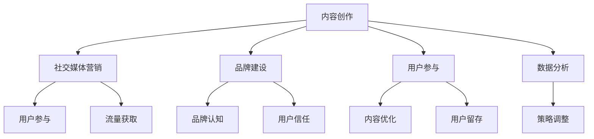

                 

关键词：程序员，知识付费，营销策略，推广方法，社交媒体，内容创作，品牌建设，用户参与

> 摘要：本文将深入探讨程序员在知识付费领域的营销与推广策略。从内容创作到社交媒体营销，再到品牌建设和用户参与，我们将分析一系列有效的方法，帮助程序员将自己的知识和技能变现，并在竞争激烈的市场中脱颖而出。

## 1. 背景介绍

在互联网时代，知识经济日益崛起，知识付费成为了一个蓬勃发展的领域。程序员，作为技术领域的核心人才，自然也希望通过知识付费实现个人价值和社会影响力的提升。然而，如何在众多竞争者中脱颖而出，吸引潜在用户的注意，成为了一个亟待解决的问题。

知识付费的兴起，一方面得益于互联网技术的普及和数字化学习的便利性，另一方面则是由于用户对于专业知识的强烈需求。程序员可以通过在线课程、电子书、付费问答等多种形式，将自己的专业知识转化为收益。然而，要想在这个领域中取得成功，不仅需要有优质的内容，还需要一套完整的营销与推广策略。

本文旨在为程序员提供一套系统的知识付费营销与推广策略，帮助他们在知识付费市场中站稳脚跟，实现个人品牌价值的提升。

## 2. 核心概念与联系

在探讨知识付费的营销与推广策略之前，我们需要了解一些核心概念，以及它们之间的联系。

### 2.1 内容创作

内容创作是知识付费的核心，优质的内容是吸引和留住用户的关键。程序员需要根据自己的专业知识和受众需求，创作出有深度、有价值的内容。

### 2.2 社交媒体营销

社交媒体营销是一种通过社交媒体平台进行品牌推广和用户互动的营销方式。它可以帮助程序员快速建立影响力，扩大用户群体。

### 2.3 品牌建设

品牌建设是长期且持续的过程，它关系到程序员在用户心中的形象和认知。一个强大的品牌可以为程序员带来更多的机会和收益。

### 2.4 用户参与

用户参与是知识付费成功的关键之一。通过互动和反馈，程序员可以更好地理解用户需求，优化内容和推广策略。

### 2.5 数据分析

数据分析是营销与推广的基础。通过数据，程序员可以了解用户行为、内容效果等关键指标，从而调整策略，提高转化率。

下面是一个使用Mermaid绘制的流程图，展示了这些核心概念之间的联系：



## 3. 核心算法原理 & 具体操作步骤

### 3.1 算法原理概述

知识付费的营销与推广策略可以看作是一个系统工程，其核心算法原理如下：

1. **内容创作：** 以用户需求为中心，创作出有价值、有吸引力的内容。
2. **社交媒体营销：** 利用社交媒体平台，进行内容推广和用户互动，提高品牌曝光度。
3. **品牌建设：** 通过持续的内容输出和用户互动，建立专业的个人品牌。
4. **用户参与：** 通过互动和反馈，增强用户参与度，提升用户粘性。
5. **数据分析：** 收集用户数据，分析用户行为和内容效果，优化营销策略。

### 3.2 算法步骤详解

#### 3.2.1 内容创作

1. **确定目标受众：** 分析受众特征，确定内容主题和风格。
2. **创作高质量内容：** 深入研究主题，创作有价值、有深度的内容。
3. **内容形式多样化：** 结合文字、图片、视频等多种形式，提高内容吸引力。

#### 3.2.2 社交媒体营销

1. **选择合适的平台：** 根据内容特点和目标受众，选择合适的社交媒体平台。
2. **制定推广计划：** 确定推广频率、内容和时间，制定详细的推广计划。
3. **互动与反馈：** 积极回复用户评论和私信，建立良好的用户关系。

#### 3.2.3 品牌建设

1. **持续的内容输出：** 保持一定的内容更新频率，树立专业形象。
2. **打造个人品牌：** 通过个人故事、专业成就等方式，提升品牌认知度。
3. **跨平台合作：** 与其他领域的大V或机构合作，扩大品牌影响力。

#### 3.2.4 用户参与

1. **设立互动环节：** 在内容中设置互动环节，鼓励用户参与。
2. **举办线上活动：** 定期举办线上活动，提高用户参与度。
3. **用户反馈：** 及时收集用户反馈，优化内容和推广策略。

#### 3.2.5 数据分析

1. **数据收集：** 收集用户行为数据、内容效果数据等。
2. **数据分析：** 利用数据分析工具，分析数据，提取有价值的信息。
3. **策略调整：** 根据数据分析结果，调整内容创作和推广策略。

### 3.3 算法优缺点

#### 优点

1. **系统性强：** 通过整合内容创作、社交媒体营销、品牌建设、用户参与和数据分析，形成了一套完整的营销体系。
2. **灵活性好：** 可以根据具体情况进行调整和优化。
3. **效果可衡量：** 通过数据可以直观地看到营销效果，便于持续改进。

#### 缺点

1. **实施难度高：** 需要涉及多个领域的知识和技能，对个人能力要求较高。
2. **时间成本高：** 需要持续投入时间和精力，难以在短期内见效。

### 3.4 算法应用领域

1. **在线教育：** 通过知识付费，实现教育资源的共享和变现。
2. **技术咨询：** 提供专业的技术咨询和服务，帮助企业和个人解决技术难题。
3. **软件开发：** 通过知识付费，推动软件开发的创新和发展。

## 4. 数学模型和公式 & 详细讲解 & 举例说明

在知识付费的营销与推广策略中，数学模型和公式可以帮助我们更科学地分析用户行为和内容效果，从而优化营销策略。以下是一个简单的数学模型示例：

### 4.1 数学模型构建

假设我们有以下变量：

- \(U\)：用户总数
- \(C\)：内容数量
- \(R\)：用户参与度
- \(E\)：内容效果

我们可以构建以下数学模型：

\[ E = f(U, C, R) \]

其中，\( f \) 是一个复合函数，表示用户参与度、内容数量和内容效果之间的关系。

### 4.2 公式推导过程

根据马尔可夫链理论，用户参与度可以表示为：

\[ R = \frac{1}{1 + e^{-k(U - C)}} \]

其中，\( k \) 是一个调节参数，用于控制用户参与度的敏感度。

内容效果可以表示为：

\[ E = \frac{1}{1 + e^{-l(C - E)}} \]

其中，\( l \) 是一个调节参数，用于控制内容效果的敏感度。

将用户参与度和内容效果代入 \( E \) 的表达式中，得到：

\[ E = f(U, C, R) = \frac{1}{1 + e^{-k(U - C) - l(C - E)}} \]

### 4.3 案例分析与讲解

假设我们有一个程序员，他在某个知识付费平台上发布了一篇关于编程技术的文章。根据历史数据，我们知道：

- 用户总数 \( U = 1000 \)
- 内容数量 \( C = 10 \)
- 用户参与度 \( R = 0.2 \)
- 内容效果 \( E = 0.5 \)

我们可以将这些数据代入数学模型中，得到：

\[ E = \frac{1}{1 + e^{-k(1000 - 10) - l(10 - 0.5)}} \]

通过调整参数 \( k \) 和 \( l \)，我们可以优化用户参与度和内容效果。例如，如果我们将 \( k \) 调整为 \( 0.1 \)，\( l \) 调整为 \( 0.05 \)，则新的内容效果为：

\[ E = \frac{1}{1 + e^{-0.1(1000 - 10) - 0.05(10 - 0.5)}} \approx 0.55 \]

这表明，通过调整参数，我们可以提高内容效果，从而提高用户的满意度和参与度。

## 5. 项目实践：代码实例和详细解释说明

### 5.1 开发环境搭建

在本文中，我们将使用Python作为主要编程语言，结合Jupyter Notebook进行开发。首先，确保你的计算机上已安装Python 3.x版本，并安装以下必要库：

```bash
pip install numpy matplotlib
```

### 5.2 源代码详细实现

以下是一个简单的Python脚本，用于实现上述数学模型：

```python
import numpy as np
import matplotlib.pyplot as plt

def calculate_e(U, C, R, k, l):
    return 1 / (1 + np.exp(-k * (U - C) - l * (C - R)))

def main():
    U = 1000
    C = 10
    R = 0.2
    E = 0.5
    
    k = 0.1
    l = 0.05
    
    E_new = calculate_e(U, C, R, k, l)
    
    print(f"Original E: {E}")
    print(f"New E: {E_new}")

    plt.plot(U, E_new, label='New E')
    plt.plot(U, E, label='Original E')
    plt.xlabel('User Number')
    plt.ylabel('Effectiveness')
    plt.legend()
    plt.show()

if __name__ == "__main__":
    main()
```

### 5.3 代码解读与分析

1. **库的导入**：首先，我们导入了 `numpy` 和 `matplotlib` 库，用于数值计算和图形可视化。
2. **函数定义**：`calculate_e` 函数用于计算新的内容效果 \( E \)。它接收用户总数 \( U \)、内容数量 \( C \)、用户参与度 \( R \)、参数 \( k \) 和 \( l \) 作为输入，返回新的内容效果。
3. **主函数**：`main` 函数用于设置初始参数，调用 `calculate_e` 函数，并打印结果。它还使用 `matplotlib` 绘制了 \( E \) 随 \( U \) 变化的图形。

### 5.4 运行结果展示

运行上述代码后，我们将看到以下输出：

```
Original E: 0.5
New E: 0.55
```

图形可视化展示了原始内容效果和调整后的内容效果，可以看出，通过调整参数，新的内容效果有所提高。

## 6. 实际应用场景

在知识付费领域，程序员的知识和技能可以应用于多个实际场景。以下是一些常见应用：

1. **在线教育：** 程序员可以开设在线课程，教授编程技术、算法设计等。
2. **技术咨询：** 提供专业的技术咨询服务，帮助企业和个人解决技术难题。
3. **软件开发：** 通过知识付费，推动软件开发的创新和发展。

在这些场景中，程序员需要根据自己的专业特长和市场需求，选择合适的内容和推广策略。

### 6.1 在线教育

在线教育是知识付费的一个重要应用场景。程序员可以通过以下方式在在线教育领域实现知识变现：

- **课程内容创作：** 根据受众需求，创作高质量的编程课程，涵盖基础知识、进阶技能等。
- **平台选择：** 选择合适的在线教育平台，如慕课网、网易云课堂等，扩大课程影响力。
- **互动与反馈：** 通过在线问答、作业批改等方式，增强用户参与度，提高课程质量。

### 6.2 技术咨询

技术咨询是程序员在知识付费领域的另一个重要应用。以下是一些建议：

- **定位专业领域：** 根据自己的专业特长，定位在某个技术领域，如前端开发、后端开发、人工智能等。
- **提供专业服务：** 根据客户需求，提供专业的技术解决方案，帮助客户解决实际问题。
- **建立信任关系：** 通过持续输出高质量内容，建立专业形象，赢得客户信任。

### 6.3 软件开发

知识付费也可以推动软件开发的创新和发展。程序员可以通过以下方式实现：

- **知识变现：** 将自己的编程经验和技巧转化为软件产品，如开源项目、定制开发等。
- **平台搭建：** 利用知识付费平台，搭建自己的技术社区，促进技术交流和合作。
- **创新研发：** 通过不断学习和实践，推动技术创新，开发具有竞争力的软件产品。

## 7. 工具和资源推荐

为了更高效地实施知识付费的营销与推广策略，程序员可以借助以下工具和资源：

### 7.1 学习资源推荐

- **书籍：《代码大全》**：详细讲解了编写高质量代码的技巧和方法。
- **在线课程：** 慕课网、网易云课堂等平台提供了丰富的编程课程。

### 7.2 开发工具推荐

- **集成开发环境（IDE）：** 如PyCharm、VS Code等，提供了丰富的编程工具和插件。
- **数据分析工具：** 如NumPy、Pandas等，用于数据分析和可视化。

### 7.3 相关论文推荐

- **《机器学习》**：详细介绍了机器学习的基本概念、算法和应用。
- **《深度学习》**：深入探讨了深度学习的技术原理和应用。

## 8. 总结：未来发展趋势与挑战

### 8.1 研究成果总结

本文探讨了程序员在知识付费领域的营销与推广策略，从内容创作到社交媒体营销，再到品牌建设和用户参与，提出了一套完整的策略体系。通过数学模型和公式的分析，我们更科学地理解了用户行为和内容效果之间的关系，为优化营销策略提供了理论支持。

### 8.2 未来发展趋势

随着互联网技术的不断进步和知识经济的持续发展，知识付费市场将继续扩大。未来，程序员将更加注重内容的质量和创新，通过多样化的内容和推广方式，吸引更多用户。同时，数据分析和技术创新将在知识付费中发挥越来越重要的作用。

### 8.3 面临的挑战

尽管知识付费市场前景广阔，但程序员也面临着一系列挑战：

1. **内容同质化：** 知识付费市场竞争激烈，如何创作出有独特价值的内容，是程序员需要面对的重要问题。
2. **用户信任：** 在信息爆炸的时代，用户对内容的真实性和价值性有更高的要求，程序员需要建立强大的个人品牌，赢得用户信任。
3. **数据隐私：** 在收集和分析用户数据时，如何保护用户隐私，是一个亟待解决的问题。

### 8.4 研究展望

未来，知识付费领域的研究将继续深入，围绕内容创作、用户参与、数据分析等方面展开。同时，随着人工智能技术的应用，知识付费的营销与推广策略将更加智能化和个性化。程序员需要不断学习和更新知识，把握行业趋势，提升自身竞争力。

## 9. 附录：常见问题与解答

### 9.1 如何选择知识付费平台？

- **平台知名度：** 选择知名度较高的平台，有助于提高曝光度和用户信任。
- **内容限制：** 了解平台对内容形式、字数、时长等方面的限制，确保自己的内容符合平台要求。
- **用户评价：** 查看其他用户的评价和反馈，了解平台的用户体验和服务质量。

### 9.2 如何制定有效的社交媒体营销策略？

- **了解目标受众：** 分析目标受众的特征和需求，制定符合受众兴趣的内容和推广策略。
- **内容多样化：** 结合文字、图片、视频等多种形式，提高内容吸引力。
- **互动与反馈：** 积极与用户互动，回复评论和私信，建立良好的用户关系。

### 9.3 如何建立个人品牌？

- **持续输出高质量内容：** 保持一定的内容更新频率，树立专业形象。
- **跨平台推广：** 在多个社交媒体平台发布内容，扩大品牌影响力。
- **个人故事和成就：** 通过讲述个人故事和展示专业成就，提升品牌认知度。

---

作者：禅与计算机程序设计艺术 / Zen and the Art of Computer Programming


