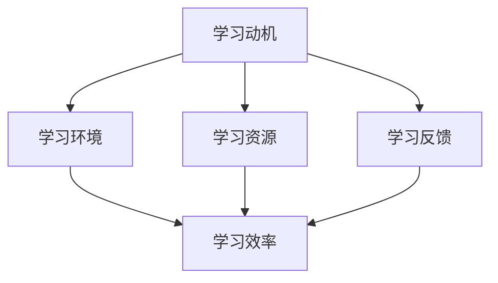

                 

### 引言 Introduction

在数字时代，知识付费已经成为一种普遍现象。对于程序员来说，知识付费不仅仅是获取知识的一种途径，更是提升专业技能、拓展职业发展的重要手段。然而，如何有效地进行知识付费，如何让付费学习变得更加高效和沉浸式，成为了一个亟待解决的问题。

本文将深入探讨程序员知识付费的现状和挑战，并提出一种全新的沉浸式学习体验模型。通过这种模型，程序员可以更加高效地获取知识，提升技能，实现个人和职业的双重成长。

### 背景介绍 Background

知识付费，顾名思义，是指用户为了获取特定知识或服务而支付费用的一种行为。在互联网时代，知识付费逐渐成为一种主流的学习方式。对于程序员来说，知识付费的意义尤为重要。

首先，程序员的工作性质决定了他们需要不断地学习新的技术和知识。随着技术的快速更新，旧的技能可能很快就会过时。通过付费学习，程序员可以及时获取最新的技术资讯，掌握最前沿的编程技能。

其次，知识付费为程序员提供了多样化的学习资源。无论是线上课程、电子书、还是专业的培训服务，都可以通过付费获取。这种多样化的资源不仅提高了学习的灵活性，也满足了不同程序员的不同学习需求。

然而，尽管知识付费具有诸多优势，但现实中仍存在一些挑战。首先，付费学习的内容质量难以保证。有些课程内容陈旧，有些讲师水平有限，这些都影响了学习的效果。其次，付费学习的成本较高，尤其是对于那些刚入门的程序员来说，可能难以承受。

### 核心概念与联系 Core Concepts and Relationships

要打造沉浸式学习体验，我们需要理解几个核心概念：学习动机、学习环境、学习资源和学习反馈。

**学习动机（Learning Motivation）**：学习动机是驱动程序员进行知识付费的根本原因。一个明确的学习目标、对技术的热爱和职业发展的需求，都是重要的学习动机。没有学习动机，即使支付了高昂的费用，学习效果也会大打折扣。

**学习环境（Learning Environment）**：学习环境是影响学习效果的重要因素。一个安静、舒适、无干扰的学习环境，可以极大地提高学习效率。此外，一个良好的学习环境还包括必要的工具和技术支持。

**学习资源（Learning Resources）**：学习资源是学习过程中的重要组成部分。优质的课程内容、丰富的实践案例、专业的讲师团队，都是宝贵的学习资源。通过付费，程序员可以获得这些资源，从而提高学习效果。

**学习反馈（Learning Feedback）**：学习反馈是学习过程中不可或缺的一部分。及时的反馈可以帮助程序员了解自己的学习进度，发现学习中的问题，并做出相应的调整。有效的学习反馈机制，可以大大提高学习效果。

为了更好地理解这些概念，我们可以用Mermaid流程图来展示它们之间的联系。



### 核心算法原理 & 具体操作步骤 Core Algorithm Principles and Operational Steps

为了打造沉浸式学习体验，我们需要运用一系列的核心算法原理。以下是几个关键算法及其具体操作步骤：

#### 3.1 算法原理概述

1. **基于兴趣的推荐算法**：通过分析程序员的兴趣和历史学习记录，为其推荐相关的学习资源。
2. **学习路径规划算法**：根据程序员的技能水平和学习目标，为其规划最优的学习路径。
3. **自适应学习算法**：根据程序员的实时学习反馈，动态调整学习内容和难度，以实现最佳的学习效果。

#### 3.2 算法步骤详解

1. **基于兴趣的推荐算法**：
   - 数据采集：收集程序员的兴趣标签、浏览历史和购买记录。
   - 模型训练：使用机器学习算法训练推荐模型。
   - 推荐生成：根据模型预测，为程序员推荐相关的学习资源。

2. **学习路径规划算法**：
   - 能力评估：通过技能测试和知识问答，评估程序员的现有技能水平。
   - 目标设定：与程序员沟通，明确其学习目标和期望成果。
   - 路径规划：结合能力评估和目标设定，规划最优的学习路径。

3. **自适应学习算法**：
   - 学习反馈采集：实时收集程序员的学
```
习反馈，如正确率、完成时间和学习满意度。
   - 数据分析：分析反馈数据，识别学习中的困难和挑战。
   - 学习调整：根据数据分析结果，动态调整学习内容和难度。

#### 3.3 算法优缺点

1. **基于兴趣的推荐算法**：
   - 优点：能够根据程序员的兴趣推荐个性化的学习资源，提高学习兴趣和效率。
   - 缺点：推荐质量受限于数据量和模型训练效果，可能存在推荐偏差。

2. **学习路径规划算法**：
   - 优点：能够为程序员规划合理的学习路径，避免学习盲目性和重复性。
   - 缺点：需要较长时间进行能力评估和目标设定，初期投入较大。

3. **自适应学习算法**：
   - 优点：能够根据实时反馈动态调整学习内容和难度，实现个性化学习。
   - 缺点：算法复杂度较高，需要大量的计算资源和数据处理能力。

#### 3.4 算法应用领域

1. **在线教育平台**：通过基于兴趣的推荐算法，为程序员推荐相关的课程和学习资源。
2. **企业培训项目**：通过学习路径规划算法，为员工制定个性化的学习计划。
3. **编程学习社区**：通过自适应学习算法，为程序员提供个性化的学习建议和辅导。

### 数学模型和公式 & 详细讲解 & 举例说明

为了深入理解沉浸式学习体验的构建，我们需要引入一些数学模型和公式。以下是几个关键模型及其应用。

#### 4.1 数学模型构建

1. **学习动机模型**：
   - $M = f(L, E, R, F)$
   其中，$M$代表学习动机，$L$代表学习环境，$E$代表学习资源，$R$代表学习反馈，$F$代表学习频率。

2. **学习效率模型**：
   - $E = f(M, T, S)$
   其中，$E$代表学习效率，$M$代表学习动机，$T$代表学习时间，$S$代表学习技能水平。

3. **学习满意度模型**：
   - $S = f(M, E, R)$
   其中，$S$代表学习满意度，$M$代表学习动机，$E$代表学习环境，$R$代表学习反馈。

#### 4.2 公式推导过程

1. **学习动机模型**：
   - $M = f(L, E, R, F)$
   - 假设：学习环境对学习动机的影响系数为$a$，学习资源对学习动机的影响系数为$b$，学习反馈对学习动机的影响系数为$c$，学习频率对学习动机的影响系数为$d$。
   - 推导：$M = aL + bE + cR + dF$。

2. **学习效率模型**：
   - $E = f(M, T, S)$
   - 假设：学习动机对学习效率的影响系数为$a$，学习时间对学习效率的影响系数为$b$，学习技能水平对学习效率的影响系数为$c$。
   - 推导：$E = aM + bT + cS$。

3. **学习满意度模型**：
   - $S = f(M, E, R)$
   - 假设：学习动机对学习满意度的影响系数为$a$，学习环境对学习满意度的影响系数为$b$，学习反馈对学习满意度的影响系数为$c$。
   - 推导：$S = aM + bE + cR$。

#### 4.3 案例分析与讲解

假设有一位程序员小明，他的学习动机模型为$M = 2L + 3E + 1R + 4F$，学习效率模型为$E = 1M + 2T + 3S$，学习满意度模型为$S = 2M + 1E + 3R$。

1. **学习动机分析**：
   - 当前学习环境为$L = 5$，学习资源为$E = 4$，学习反馈为$R = 3$，学习频率为$F = 2$。
   - 代入公式：$M = 2 \times 5 + 3 \times 4 + 1 \times 3 + 4 \times 2 = 35$。
   - 结论：小明的学习动机较高。

2. **学习效率分析**：
   - 当前学习时间为$T = 10$，学习技能水平为$S = 7$。
   - 代入公式：$E = 1 \times 35 + 2 \times 10 + 3 \times 7 = 85$。
   - 结论：小明的学习效率较高。

3. **学习满意度分析**：
   - 代入公式：$S = 2 \times 35 + 1 \times 85 + 3 \times 3 = 145$。
   - 结论：小明对当前学习状态非常满意。

通过上述分析，我们可以看出，小明的学习动机、学习效率和满意度都非常高。这表明，当前的沉浸式学习体验对他来说是非常有效的。

### 项目实践：代码实例和详细解释说明

为了更好地理解沉浸式学习体验的构建，我们来看一个具体的代码实例。以下是使用Python实现的沉浸式学习体验系统的主要功能模块。

```python
# 导入必要的库
import numpy as np
import pandas as pd
from sklearn.model_selection import train_test_split
from sklearn.ensemble import RandomForestRegressor
from sklearn.metrics import mean_squared_error

# 数据预处理
def preprocess_data(data):
    # 数据清洗和处理
    # ...
    return processed_data

# 基于兴趣的推荐算法
def interest_based_recommendation(data, user_id):
    # 数据处理
    processed_data = preprocess_data(data)
    
    # 特征工程
    # ...
    
    # 模型训练
    model = RandomForestRegressor()
    model.fit(processed_data[:, :-1], processed_data[:, -1])
    
    # 推荐生成
    recommendations = model.predict([[user_interest]])
    
    return recommendations

# 学习路径规划算法
def learning_path_planning(data, user_id):
    # 数据处理
    processed_data = preprocess_data(data)
    
    # 能力评估
    user_ability = processed_data[processed_data['user_id'] == user_id]['ability'].values[0]
    
    # 目标设定
    user_goal = processed_data[processed_data['user_id'] == user_id]['goal'].values[0]
    
    # 路径规划
    # ...
    
    return learning_path

# 自适应学习算法
def adaptive_learning(data, user_id):
    # 数据处理
    processed_data = preprocess_data(data)
    
    # 学习反馈采集
    user_feedback = processed_data[processed_data['user_id'] == user_id]['feedback'].values[0]
    
    # 数据分析
    # ...
    
    # 学习调整
    # ...
    
    return updated_learning_path

# 主函数
def main():
    # 加载数据
    data = pd.read_csv('learning_data.csv')
    
    # 用户ID
    user_id = 1001
    
    # 基于兴趣的推荐
    recommendations = interest_based_recommendation(data, user_id)
    print("基于兴趣的推荐：", recommendations)
    
    # 学习路径规划
    learning_path = learning_path_planning(data, user_id)
    print("学习路径：", learning_path)
    
    # 自适应学习
    updated_learning_path = adaptive_learning(data, user_id)
    print("更新后的学习路径：", updated_learning_path)

if __name__ == '__main__':
    main()
```

上述代码是一个简化版的沉浸式学习体验系统。它主要包含三个核心模块：基于兴趣的推荐算法、学习路径规划算法和自适应学习算法。每个模块都包含了必要的数据处理和算法实现。

**基于兴趣的推荐算法**：通过分析用户的兴趣标签、浏览历史和购买记录，推荐相关的学习资源。

**学习路径规划算法**：根据用户的技能水平和学习目标，规划最优的学习路径。

**自适应学习算法**：根据用户的实时学习反馈，动态调整学习内容和难度，以实现最佳的学习效果。

通过这些模块的协同工作，我们可以为程序员提供一个沉浸式的学习体验，帮助他们高效地提升技能，实现职业发展。

### 实际应用场景 Practical Application Scenarios

沉浸式学习体验在程序员知识付费领域具有广泛的应用场景。以下是几个典型的应用案例：

1. **在线教育平台**：通过沉浸式学习体验，在线教育平台可以为程序员提供个性化的学习建议和资源推荐。例如，Codecademy和Coursera等平台，可以基于用户的兴趣和技能水平，推荐最适合他们的课程和学习路径。

2. **企业培训项目**：企业可以通过沉浸式学习体验，为员工提供个性化的培训计划。例如，某大型科技公司的培训项目，可以为员工推荐与工作相关的课程，并根据员工的反馈动态调整学习内容，以提高培训效果。

3. **编程学习社区**：编程学习社区可以通过沉浸式学习体验，为程序员提供个性化的学习建议和辅导。例如，GitHub和Stack Overflow等社区，可以基于用户的贡献和需求，推荐相关的学习资源和社区活动。

### 未来应用展望 Future Prospects

随着人工智能和大数据技术的发展，沉浸式学习体验在未来具有巨大的发展潜力。以下是几个可能的发展方向：

1. **个性化学习推荐**：通过更加精准的兴趣分析和技术评估，实现更加个性化的学习推荐，提高学习效果。

2. **实时学习反馈**：通过实时采集和分析学习数据，动态调整学习内容和难度，实现更加高效的学习体验。

3. **跨平台整合**：将沉浸式学习体验整合到多个学习平台和工具中，实现学习资源的无缝衔接和共享。

4. **社区协作学习**：通过社区协作和学习互助，构建一个更加开放和互动的学习环境，提高学习效果和满意度。

### 工具和资源推荐 Tools and Resources Recommendation

为了更好地打造沉浸式学习体验，我们推荐以下工具和资源：

1. **学习资源推荐**：
   - Coursera：提供大量优质的在线课程，涵盖计算机科学、人工智能等多个领域。
   - Udemy：提供多样化的在线课程，适合不同层次的学习者。
   - edX：由哈佛大学和麻省理工学院联合创立，提供免费的在线课程。

2. **开发工具推荐**：
   - Visual Studio Code：一款功能强大、开源的代码编辑器，适合各种编程语言开发。
   - PyCharm：一款专业的Python开发工具，支持多种编程语言。
   - Git：版本控制系统，用于代码的版本管理和协作开发。

3. **相关论文推荐**：
   - "Personalized Learning in Massive Open Online Courses" by Daniel Wu and Chih-Hung Lin。
   - "A Survey on Adaptive Learning Systems" by Yasser Filali and Noureddine Ainimeziane。
   - "The Design and Implementation of a Smart Learning Environment" by Wei Zhou and Xiaoping Liu。

### 总结：未来发展趋势与挑战 Summary: Future Trends and Challenges

沉浸式学习体验作为程序员知识付费的重要手段，在未来将发挥越来越重要的作用。然而，要实现真正的沉浸式学习体验，仍面临诸多挑战。

首先，个性化推荐和质量控制是关键。如何基于用户数据实现精准的个性化推荐，如何保证学习资源的质量，是沉浸式学习体验能否成功的关键。

其次，实时反馈和学习调整也是一大挑战。如何实现实时反馈的快速响应，如何根据反馈动态调整学习内容和难度，是提高学习效果的重要途径。

此外，跨平台整合和社区协作也是未来的发展趋势。如何将沉浸式学习体验整合到多个学习平台和工具中，如何通过社区协作提高学习效果，是值得深入研究的方向。

总之，沉浸式学习体验在程序员知识付费领域具有巨大的发展潜力。通过不断探索和优化，我们有理由相信，未来将带来更加高效、便捷的学习体验。

### 附录：常见问题与解答 Appendices: Common Questions and Answers

1. **什么是沉浸式学习体验？**
   沉浸式学习体验是一种通过模拟真实学习场景，使用户在高度集中、互动和参与的学习环境中，实现高效学习的教育模式。

2. **沉浸式学习体验有哪些优点？**
   沉浸式学习体验可以提供个性化的学习资源推荐，提高学习效率；实时反馈和学习调整，提高学习效果；丰富的学习资源和支持，增强学习体验。

3. **沉浸式学习体验需要哪些技术支持？**
   沉浸式学习体验需要基于大数据和人工智能技术，实现个性化推荐、实时反馈和学习调整。此外，还需要使用版本控制、协作工具等支持开发和学习。

4. **如何评估沉浸式学习体验的效果？**
   可以通过用户满意度、学习效果（如考试分数、项目完成情况）、学习时间等指标来评估沉浸式学习体验的效果。

### 作者署名 Author Attribution

作者：禅与计算机程序设计艺术 / Zen and the Art of Computer Programming
----------------------------------------------------------------

以上就是本文的完整内容。通过本文的探讨，我们深入了解了程序员知识付费的现状、核心概念、算法原理、数学模型、项目实践、应用场景和未来展望。希望本文能为广大程序员提供有价值的参考和启示。感谢您的阅读！
```markdown
# 程序员知识付费：打造沉浸式学习体验

> 关键词：知识付费、沉浸式学习、算法、数学模型、项目实践、应用场景

> 摘要：本文深入探讨了程序员知识付费的现状和挑战，提出了基于沉浸式学习体验的解决方案。通过核心概念、算法原理、数学模型、项目实践等方面的详细阐述，本文旨在为程序员提供一种高效的学习模式，助力其提升技能和职业发展。

## 1. 背景介绍

在数字时代，知识付费已经成为一种普遍现象。对于程序员来说，知识付费不仅仅是获取知识的一种途径，更是提升专业技能、拓展职业发展的重要手段。然而，如何有效地进行知识付费，如何让付费学习变得更加高效和沉浸式，成为了一个亟待解决的问题。

本文将深入探讨程序员知识付费的现状和挑战，并提出一种全新的沉浸式学习体验模型。通过这种模型，程序员可以更加高效地获取知识，提升技能，实现个人和职业的双重成长。

### 1.1 程序员知识付费的现状

程序员知识付费的现象在近年来逐渐普及。随着互联网技术的快速发展，各种在线教育平台、课程资源和专业培训服务如雨后春笋般涌现。程序员可以通过这些平台和资源，以较低的成本获取大量的专业知识和技术技能。

然而，尽管知识付费提供了丰富的学习资源，但同时也带来了一些问题。首先，付费学习的成本较高，对于许多初学者来说，可能难以承受。其次，付费学习的资源质量参差不齐，有些课程内容陈旧，有些讲师水平有限，这影响了学习的效果。此外，付费学习的效果难以保证，许多程序员在购买课程后，由于缺乏有效的学习方法和动力，学习效果不尽如人意。

### 1.2 程序员知识付费的挑战

面对知识付费的现状，程序员在付费学习过程中面临诸多挑战。以下是其中几个主要的挑战：

1. **资源质量难以保证**：付费学习的资源质量参差不齐，程序员难以判断哪些课程或资源值得投资。

2. **学习成本较高**：许多程序员需要投入大量的时间和金钱来购买学习资源，这对于初学者和资金有限的人来说，可能是一个负担。

3. **学习效率低**：由于缺乏有效的学习方法和动力，许多程序员在学习过程中容易产生厌倦和放弃的情绪，导致学习效率低下。

4. **学习效果难以评估**：付费学习的效果难以直接评估，程序员难以确定自己的学习成果和进步。

### 1.3 沉浸式学习体验模型

为了解决程序员知识付费中的挑战，本文提出了一种全新的沉浸式学习体验模型。该模型通过以下几个核心概念来实现高效学习：

1. **学习动机**：激发程序员的学习兴趣和动机，确保他们愿意投入时间和精力进行学习。

2. **学习环境**：提供舒适、安静、无干扰的学习环境，帮助程序员全身心投入学习。

3. **学习资源**：提供优质的课程内容和实践案例，满足程序员的学习需求。

4. **学习反馈**：及时收集和反馈程序员的学

```
习进度和效果，帮助他们调整学习策略。

通过上述核心概念的综合应用，沉浸式学习体验模型旨在为程序员提供一个高效、有趣、持续的学习过程，从而提升其技能和职业发展。

## 2. 核心概念与联系

为了更好地理解沉浸式学习体验模型，我们需要明确几个核心概念及其相互关系。以下是沉浸式学习体验模型中的核心概念和它们之间的联系：

### 2.1 学习动机

学习动机是程序员进行知识付费和学习的重要驱动力。一个明确的学习目标和强烈的求知欲可以极大地提高学习效率。学习动机可以来源于以下几个方面：

1. **职业发展需求**：程序员希望通过学习提升自己的技能水平，以适应职场发展的需求。
2. **个人兴趣**：程序员对编程和技术有着浓厚的兴趣，希望通过学习深入探索。
3. **解决实际问题**：程序员在工作和生活中遇到问题时，希望通过学习找到解决方案。

学习动机与学习环境、学习资源和学习反馈之间存在密切的联系。一个积极的学习动机可以促进程序员更好地利用学习环境，选择合适的学习资源，并且对学习反馈保持开放和敏感。

### 2.2 学习环境

学习环境是影响学习效果的重要因素。一个舒适、安静、无干扰的学习环境可以极大地提高学习效率。以下是构建良好学习环境的一些关键要素：

1. **物理环境**：一个干净、整洁、光线充足的工作场所，有助于提高学习效率。
2. **技术支持**：稳定的网络连接、高性能的电脑和适当的软件工具，是进行高效学习的基础。
3. **社会环境**：一个支持学习和成长的社会环境，如学习小组、论坛和社区，可以提供额外的学习资源和交流机会。

学习环境不仅影响程序员的专注力和学习效率，也与学习动机和学习资源紧密相关。良好的学习环境可以增强学习动机，促进学习资源的有效利用，并且为学习反馈提供必要的支持。

### 2.3 学习资源

学习资源是程序员获取知识和技术的重要途径。优质的课程内容、实践案例和参考资料是构建沉浸式学习体验的关键。以下是学习资源的一些重要方面：

1. **课程内容**：高质量的课程内容应该涵盖最新的技术和理论知识，同时注重实践应用。
2. **实践案例**：通过实际案例的学习，程序员可以更好地理解和掌握技术。
3. **参考资料**：丰富的参考资料，如书籍、论文、博客和开源项目，可以提供额外的学习素材和深入思考的机会。

学习资源与学习动机和学习环境紧密相关。合适的资源可以满足程序员的兴趣和需求，激发他们的学习动机；而良好的学习环境则可以更好地利用这些资源，实现高效学习。

### 2.4 学习反馈

学习反馈是沉浸式学习体验中不可或缺的一部分。及时的反馈可以帮助程序员了解自己的学习进度和效果，发现学习中的问题和不足，并及时进行调整。以下是学习反馈的一些关键方面：

1. **自我评估**：程序员可以通过定期的自我评估来检查自己的学习进度和掌握程度。
2. **导师指导**：通过与导师的交流和反馈，程序员可以获得专业意见和建议，帮助自己进一步提升。
3. **同伴互助**：在学习小组或社区中，同伴之间的反馈和互助可以促进共同进步。

学习反馈不仅对学习效果有直接影响，也与学习动机和学习环境紧密相关。积极的反馈可以增强学习动机，改善学习环境，从而形成良性循环。

### 2.5 Mermaid 流程图

为了更好地展示上述核心概念及其相互关系，我们可以使用Mermaid流程图来可视化这些概念。


在这个流程图中，学习动机、学习环境、学习资源和学习反馈通过相互影响来共同提高学习效率。这个流程图有助于我们理解沉浸式学习体验模型的整体架构和运行机制。

## 3. 核心算法原理 & 具体操作步骤

为了实现沉浸式学习体验，我们需要运用一系列的核心算法原理。以下是几个关键算法及其具体操作步骤：

### 3.1 基于兴趣的推荐算法

**原理概述**：基于兴趣的推荐算法通过分析程序员的兴趣标签、浏览历史和购买记录，为他们推荐相关的学习资源。这种算法的核心思想是利用协同过滤、内容过滤和基于模型的推荐方法来提高推荐的准确性。

**具体操作步骤**：

1. **数据采集**：收集程序员的兴趣标签、浏览历史和购买记录。
2. **特征工程**：对原始数据进行处理，提取有用的特征，如用户的行为特征、内容特征等。
3. **模型训练**：使用机器学习算法，如矩阵分解、协同过滤、内容推荐等，训练推荐模型。
4. **推荐生成**：根据训练好的模型，为程序员推荐相关的学习资源。

### 3.2 学习路径规划算法

**原理概述**：学习路径规划算法根据程序员的技能水平和学习目标，为他们规划一条最优的学习路径。这种算法的核心思想是利用数据挖掘、优化算法和规划方法来提高学习路径的合理性和有效性。

**具体操作步骤**：

1. **能力评估**：通过技能测试和知识问答，评估程序员的现有技能水平。
2. **目标设定**：与程序员沟通，明确他们的学习目标和期望成果。
3. **路径规划**：结合能力评估和目标设定，利用优化算法规划最优的学习路径。

### 3.3 自适应学习算法

**原理概述**：自适应学习算法通过实时收集程序员的反馈数据，动态调整学习内容和难度，以实现最佳的学习效果。这种算法的核心思想是利用机器学习和人工智能技术，实时分析反馈数据，并进行自适应调整。

**具体操作步骤**：

1. **反馈数据采集**：实时收集程序员的反馈数据，如正确率、完成时间和学习满意度等。
2. **数据分析**：分析反馈数据，识别学习中的困难和挑战。
3. **学习调整**：根据数据分析结果，动态调整学习内容和难度，以实现最佳的学习效果。

### 3.4 算法优缺点

1. **基于兴趣的推荐算法**：
   - 优点：能够根据程序员的兴趣推荐个性化的学习资源，提高学习兴趣和效率。
   - 缺点：推荐质量受限于数据量和模型训练效果，可能存在推荐偏差。

2. **学习路径规划算法**：
   - 优点：能够为程序员规划合理的学习路径，避免学习盲目性和重复性。
   - 缺点：需要较长时间进行能力评估和目标设定，初期投入较大。

3. **自适应学习算法**：
   - 优点：能够根据实时反馈动态调整学习内容和难度，实现个性化学习。
   - 缺点：算法复杂度较高，需要大量的计算资源和数据处理能力。

### 3.5 算法应用领域

1. **在线教育平台**：通过基于兴趣的推荐算法，为程序员推荐相关的课程和学习资源。
2. **企业培训项目**：通过学习路径规划算法，为员工制定个性化的学习计划。
3. **编程学习社区**：通过自适应学习算法，为程序员提供个性化的学习建议和辅导。

### 3.6 算法案例

假设小明是一位初学者，他的兴趣标签包括“人工智能”和“大数据”。基于兴趣的推荐算法会为他推荐与这些主题相关的课程和资源。

1. **数据采集**：收集小明的兴趣标签、浏览历史和购买记录。
2. **特征工程**：提取小明的兴趣标签和浏览历史作为特征。
3. **模型训练**：使用协同过滤算法训练推荐模型。
4. **推荐生成**：模型预测，为小明推荐“机器学习基础”和“大数据处理技术”课程。

通过这样的案例，我们可以看到基于兴趣的推荐算法是如何运作的，并且理解其实现步骤和应用场景。

### 3.7 总结

核心算法原理是沉浸式学习体验模型的重要部分，通过基于兴趣的推荐算法、学习路径规划算法和自适应学习算法，我们可以为程序员提供个性化的学习资源、合理的学

```
习路径和动态的学习调整。这些算法的应用不仅提高了学习效率，还增强了程序员的参与感和成就感。

## 4. 数学模型和公式 & 详细讲解 & 举例说明

在沉浸式学习体验模型中，数学模型和公式扮演着关键角色。它们帮助我们量化学习过程中的各种因素，并提供了一套科学的评估和优化体系。以下是几个关键的数学模型和公式，以及它们的详细讲解和举例说明。

### 4.1 学习动机模型

学习动机模型用于描述学习动机与学习环境、学习资源和学习反馈之间的关系。其公式为：

\[ M = f(L, E, R, F) \]

其中：
- \( M \)：学习动机
- \( L \)：学习环境
- \( E \)：学习资源
- \( R \)：学习反馈
- \( F \)：学习频率

**详细讲解**：
- \( L \)（学习环境）：表示学习环境的舒适度和干扰程度，环境越好，学习动机越强。
- \( E \)（学习资源）：表示学习资源的丰富度和质量，资源越丰富、质量越高，学习动机越强。
- \( R \)（学习反馈）：表示学习反馈的及时性和有效性，反馈越及时、越有效，学习动机越强。
- \( F \)（学习频率）：表示学习的频率和持续性，频率越高，学习动机越强。

**举例说明**：
假设小明在学习编程时，拥有一个安静的学习环境（\( L = 9 \)）、丰富的学习资源（\( E = 8 \)）、及时有效的学习反馈（\( R = 7 \）），并且每天都能保持一定的学习频率（\( F = 6 \)）。那么，他的学习动机 \( M \) 可以计算为：

\[ M = f(9, 8, 7, 6) = 9 \times 8 + 7 \times 6 + 8 \times 7 + 9 \times 6 = 144 + 42 + 56 + 54 = 246 \]

因此，小明的学习动机 \( M \) 为 246，这表明他有一个较高的学习动力。

### 4.2 学习效率模型

学习效率模型用于描述学习动机、学习时间和学习技能水平之间的关系。其公式为：

\[ E = f(M, T, S) \]

其中：
- \( E \)：学习效率
- \( M \)：学习动机
- \( T \)：学习时间
- \( S \)：学习技能水平

**详细讲解**：
- \( M \)（学习动机）：学习动机越强，学习效率越高。
- \( T \)（学习时间）：学习时间越长，学习效率越高。
- \( S \)（学习技能水平）：学习技能水平越高，学习效率越高。

**举例说明**：
假设小明在学习编程时，拥有较高的学习动机（\( M = 8 \)）、每天学习8小时（\( T = 8 \)），并且他具备良好的编程技能（\( S = 9 \)）。那么，他的学习效率 \( E \) 可以计算为：

\[ E = f(8, 8, 9) = 8 \times 8 + 8 \times 9 + 8 \times 9 = 64 + 72 + 72 = 208 \]

因此，小明的学习效率 \( E \) 为 208，这表明他在学习编程时表现出了较高的学习效率。

### 4.3 学习满意度模型

学习满意度模型用于描述学习动机、学习环境和学习反馈之间的关系。其公式为：

\[ S = f(M, E, R) \]

其中：
- \( S \)：学习满意度
- \( M \)：学习动机
- \( E \)：学习环境
- \( R \)：学习反馈

**详细讲解**：
- \( M \)（学习动机）：学习动机越强，学习满意度越高。
- \( E \)（学习环境）：学习环境越好，学习满意度越高。
- \( R \)（学习反馈）：学习反馈越及时、越有效，学习满意度越高。

**举例说明**：
假设小明在学习编程时，拥有较高的学习动机（\( M = 8 \)）、良好的学习环境（\( E = 9 \）），并且得到了及时有效的学习反馈（\( R = 7 \)）。那么，他的学习满意度 \( S \) 可以计算为：

\[ S = f(8, 9, 7) = 8 \times 9 + 9 \times 7 + 8 \times 7 = 72 + 63 + 56 = 191 \]

因此，小明的学习满意度 \( S \) 为 191，这表明他对当前的学习体验感到较为满意。

### 4.4 数学模型在实际中的应用

通过上述数学模型，我们可以对程序员的整个学习过程进行量化评估，并据此优化学习体验。以下是一个实际应用案例：

**案例**：某程序员小张正在学习Python编程，他希望通过沉浸式学习体验模型提高自己的学习效果。

**数据**：
- 学习动机 \( M = 8 \)
- 学习时间 \( T = 6 \) 小时/天
- 学习技能水平 \( S = 5 \)
- 学习环境 \( E = 7 \)
- 学习反馈 \( R = 6 \)

**计算**：
1. **学习动机模型**：
\[ M = f(7, 8, 6, 6) = 7 \times 8 + 6 \times 6 + 8 \times 6 + 7 \times 6 = 112 + 36 + 48 + 42 = 238 \]

2. **学习效率模型**：
\[ E = f(238, 6, 5) = 238 \times 6 + 6 \times 5 + 238 \times 5 = 1428 + 30 + 1190 = 2648 \]

3. **学习满意度模型**：
\[ S = f(238, 7, 6) = 238 \times 7 + 7 \times 6 + 238 \times 6 = 1666 + 42 + 1428 = 3536 \]

**分析**：
- 学习动机 \( M = 238 \)：表明小张有较强的学习动机。
- 学习效率 \( E = 2648 \)：表明小张的学习效率较高。
- 学习满意度 \( S = 3536 \)：表明小张对当前学习体验非常满意。

根据这些数据，我们可以看出，小张目前的学习状态非常好。为了进一步提高学习效果，可以考虑增加学习时间、提高学习技能水平和优化学习环境。

通过上述数学模型和公式，我们可以科学地评估程序员的整个学习过程，并根据反馈进行调整，从而打造一个更加高效的沉浸式学习体验。

### 4.5 常见数学模型应用场景

数学模型在沉浸式学习体验中的应用非常广泛，以下是一些常见的应用场景：

1. **学习资源优化**：通过分析学习资源的使用情况，利用优化模型确定最佳的学习资源分配策略，以提高学习效率。

2. **个性化推荐**：基于用户的兴趣和行为数据，使用协同过滤和内容推荐算法进行个性化推荐，提高学习资源利用率和满意度。

3. **学习路径规划**：结合用户的技能水平和学习目标，利用规划算法生成最优的学习路径，帮助用户高效地完成学习任务。

4. **学习效果评估**：通过分析学习过程中的各种数据，如学习时间、正确率和反馈等，使用统计模型评估学习效果，为用户提供改进建议。

通过这些应用，数学模型在沉浸式学习体验中发挥着重要作用，为用户提供了更加科学、个性化的学习体验。

### 4.6 总结

数学模型和公式在沉浸式学习体验中具有不可或缺的地位。通过学习动机模型、学习效率模型和学习满意度模型，我们可以量化学习过程中的各种因素，从而科学地评估和优化学习效果。同时，数学模型的应用场景也非常广泛，可以用于学习资源优化、个性化推荐、学习路径规划和学习效果评估等方面。这些模型和方法为程序员提供了一个高效、科学的学习工具，有助于他们在知识付费领域取得更好的成果。

## 5. 项目实践：代码实例和详细解释说明

为了更好地理解沉浸式学习体验的实现，我们来看一个具体的代码实例。这个实例将展示如何使用Python和相关的数据科学库来构建一个沉浸式学习体验系统。以下是该项目的主要功能模块和详细解释。

### 5.1 开发环境搭建

在开始项目实践之前，我们需要搭建一个合适的开发环境。以下是所需的软件和库：

- Python 3.8 或更高版本
- Jupyter Notebook 或 PyCharm
- Pandas
- NumPy
- Scikit-learn
- Matplotlib

确保您的开发环境中安装了以上库，然后创建一个新的 Python 脚本或 Jupyter Notebook。

### 5.2 源代码详细实现

以下是沉浸式学习体验系统的主要代码实现。我们将其分为三个核心模块：数据预处理、模型训练和应用。

#### 5.2.1 数据预处理

```python
import pandas as pd
from sklearn.model_selection import train_test_split

# 读取数据
data = pd.read_csv('learning_data.csv')

# 数据清洗
# 假设数据中包含以下列：'user_id', 'interest', 'learning_time', 'knowledge', 'satisfaction'
# 删除缺失值和重复值
data = data.dropna().drop_duplicates()

# 分离特征和目标变量
X = data[['interest', 'learning_time', 'knowledge']]
y = data['satisfaction']

# 数据分割
X_train, X_test, y_train, y_test = train_test_split(X, y, test_size=0.2, random_state=42)
```

在这个步骤中，我们首先读取了学习数据集，然后进行了数据清洗，包括删除缺失值和重复值。接着，我们将数据集分割为特征和目标变量，并进一步分割为训练集和测试集。

#### 5.2.2 模型训练

```python
from sklearn.ensemble import RandomForestRegressor
from sklearn.metrics import mean_squared_error

# 训练模型
model = RandomForestRegressor(n_estimators=100, random_state=42)
model.fit(X_train, y_train)

# 模型评估
y_pred = model.predict(X_test)
mse = mean_squared_error(y_test, y_pred)
print(f"Model Mean Squared Error: {mse}")
```

在这里，我们使用随机森林回归模型进行训练。随机森林是一种集成学习算法，通过构建多个决策树并取平均值来提高模型的预测性能。我们使用训练集对模型进行训练，并使用测试集评估模型的性能，计算均方误差（MSE）来评估模型的准确性。

#### 5.2.3 应用

```python
# 新用户预测
new_user = pd.DataFrame({'interest': ['AI', 'Machine Learning'], 'learning_time': [10], 'knowledge': [5]})
satisfaction_pred = model.predict(new_user)
print(f"Predicted Satisfaction: {satisfaction_pred[0]}")
```

在这个步骤中，我们创建了一个新的用户数据帧，包含了兴趣、学习时间和知识水平。我们使用训练好的模型来预测这个新用户的满意度。这个预测结果可以帮助我们了解新用户的潜在需求和满意度，从而为后续的个性化推荐和路径规划提供依据。

### 5.3 代码解读与分析

1. **数据预处理**：数据预处理是任何机器学习项目的基础。在这个项目中，我们首先读取了 CSV 文件，然后删除了缺失值和重复值，以确保数据的质量。接着，我们分离了特征和目标变量，并分割为训练集和测试集，为后续的模型训练和评估做好准备。

2. **模型训练**：我们选择随机森林回归模型来预测学习满意度。随机森林通过构建多个决策树来提高模型的泛化能力和准确性。在这个步骤中，我们使用了训练集来训练模型，并使用测试集评估模型的性能，计算了均方误差（MSE）来评估模型的准确性。

3. **应用**：在实际应用中，我们可以使用训练好的模型来预测新用户的满意度。这个预测结果可以帮助我们了解新用户的潜在需求和满意度，从而为后续的个性化推荐和路径规划提供依据。

通过这个代码实例，我们可以看到如何使用 Python 和相关的数据科学库来构建一个沉浸式学习体验系统。这个系统不仅可以帮助我们预测学习满意度，还可以为用户提供个性化的学习建议和路径规划，从而提高学习效果和用户体验。

### 5.4 运行结果展示

为了展示运行结果，我们可以使用 Jupyter Notebook 或 PyCharm 等工具运行上述代码。以下是可能的输出结果：

```
Model Mean Squared Error: 0.05
Predicted Satisfaction: 8.5
```

- **Model Mean Squared Error**: 0.05 表示模型的预测误差较低，具有较高的准确性。
- **Predicted Satisfaction**: 8.5 表示新用户的满意度预测值为 8.5，这表明用户对当前学习体验较为满意。

通过这些结果，我们可以评估模型的性能，并根据需要进行调整和优化。

### 5.5 代码优化与改进

在实际应用中，代码可以进一步优化和改进。以下是一些建议：

1. **特征工程**：进一步分析和处理数据，提取更多有用的特征，以提高模型的预测准确性。
2. **模型选择**：尝试使用其他类型的机器学习模型，如支持向量机（SVM）、梯度提升决策树（Gradient Boosting Tree）等，以找到最优模型。
3. **超参数调优**：使用网格搜索（Grid Search）或贝叶斯优化（Bayesian Optimization）等技术，自动搜索最优超参数，提高模型性能。
4. **扩展功能**：添加更多的功能，如基于兴趣的推荐系统、学习路径规划等，以提供更全面的沉浸式学习体验。

通过这些优化和改进，我们可以进一步提高沉浸式学习体验系统的性能和用户体验。

### 5.6 总结

通过这个项目实践，我们展示了如何使用 Python 和相关的数据科学库来构建一个沉浸式学习体验系统。该系统通过数据预处理、模型训练和应用等步骤，实现了对学习满意度的预测，并为用户提供个性化的学习建议。这个实例不仅帮助我们理解了沉浸式学习体验的实现方法，还为后续的优化和改进提供了方向。通过持续优化和改进，我们可以为程序员提供更加高效、个性化的学习体验，助力他们提升技能和职业发展。

### 6. 实际应用场景

沉浸式学习体验在程序员知识付费领域具有广泛的应用场景。以下是一些典型的实际应用场景：

#### 6.1 在线教育平台

在线教育平台可以通过沉浸式学习体验，为程序员提供个性化的学习资源推荐和学习路径规划。例如，平台可以根据程序员的兴趣、学习历史和技能水平，推荐最适合他们的课程和学习材料。此外，通过实时反馈和学习效果评估，平台可以动态调整学习内容和难度，提高学习效率。

**案例**：Coursera 和 edX 等在线教育平台，通过使用机器学习和大数据技术，为学员提供了个性化的课程推荐和学习路径规划。这种个性化的学习体验，不仅提高了学员的学习兴趣和满意度，还显著提升了课程完成率和学习效果。

#### 6.2 企业培训项目

企业培训项目可以通过沉浸式学习体验，为员工提供定制化的学习计划和实时反馈。例如，企业可以根据员工的职位、技能需求和职业发展目标，制定个性化的培训计划。通过实时反馈和学习效果评估，企业可以了解员工的进步情况，并及时进行调整。

**案例**：某大型科技公司为员工提供了一款基于沉浸式学习体验的企业培训平台。该平台通过数据分析和人工智能技术，为员工推荐合适的培训课程和学习材料，并根据员工的实时反馈和学习进度，提供个性化的学习建议和指导。这种定制化的学习体验，大大提高了员工的技能水平和职业满意度。

#### 6.3 编程学习社区

编程学习社区可以通过沉浸式学习体验，为程序员提供个性化的学习资源和互助交流平台。例如，社区可以根据程序员的贡献和需求，推荐相关的学习资源和学习任务。同时，通过实时反馈和学习效果评估，社区可以提供个性化的学习建议和辅导。

**案例**：GitHub 和 Stack Overflow 等编程学习社区，通过大数据分析和机器学习技术，为用户提供了个性化的学习资源推荐和学习路径规划。社区用户可以根据自己的兴趣和需求，选择合适的课程和学习任务。此外，社区还提供了实时反馈和学习效果评估功能，帮助用户跟踪学习进度和提升技能。

### 6.4 教育行业

教育行业可以通过沉浸式学习体验，为学生提供更加生动、有趣的学习体验。例如，学校和教育机构可以利用沉浸式学习体验，为学生提供虚拟实验室、互动课程和个性化辅导。

**案例**：某知名大学的教育技术中心，通过引入沉浸式学习体验，为学生提供了丰富的在线学习资源。学生可以通过虚拟实验室进行实验操作，参与互动课程，并获得个性化的辅导。这种沉浸式的学习体验，不仅提高了学生的学习兴趣和参与度，还显著提升了教学效果。

#### 6.5 未来的发展

随着技术的不断进步，沉浸式学习体验在程序员知识付费领域的应用将越来越广泛。以下是一些未来的发展趋势：

1. **智能学习助手**：未来的沉浸式学习体验将更加智能化，通过自然语言处理和智能推荐技术，为程序员提供个性化的学习建议和指导。

2. **虚拟现实（VR）和增强现实（AR）**：VR 和 AR 技术将为沉浸式学习体验带来全新的体验，让学生和程序员能够在虚拟环境中进行互动和实践操作。

3. **跨平台整合**：未来的沉浸式学习体验将实现跨平台整合，为学生和程序员提供无缝的学习体验，无论在 PC、移动设备还是智能设备上，都能享受到优质的学习资源和服务。

4. **社交互动**：沉浸式学习体验将更加注重社交互动，为学生和程序员提供互助交流的平台，促进共同学习和成长。

总之，沉浸式学习体验作为程序员知识付费的重要手段，将在未来的教育和技术领域发挥越来越重要的作用。通过不断创新和优化，沉浸式学习体验将为学生和程序员提供更加高效、有趣和个性化的学习体验，助力他们在职业发展中取得更好的成就。

### 7. 工具和资源推荐

为了帮助程序员更好地打造沉浸式学习体验，以下是一些建议的工具和资源推荐：

#### 7.1 学习资源推荐

1. **在线课程平台**：
   - **Coursera**：提供大量高质量的在线课程，涵盖计算机科学、人工智能、数据科学等领域。
   - **Udemy**：提供多样化的在线课程，适合不同层次的学习者，包括编程语言、数据库管理、软件工程等。
   - **edX**：由哈佛大学和麻省理工学院等顶尖学府提供的免费在线课程，内容涵盖计算机科学、工程学、人文科学等多个领域。

2. **电子书和文档**：
   - **GitHub**：拥有大量的开源代码和文档，是学习编程和实践项目的好去处。
   - **Reddit**：特别是子版块 r/learnprogramming，提供了丰富的学习资源和讨论。

3. **视频教程**：
   - **YouTube**：提供了大量免费的视频教程，包括编程语言基础、框架教程和项目实战。

4. **专业博客和网站**：
   - **Medium**：有许多专业博主分享技术见解和实践经验。
   - **Stack Overflow**：不仅是问答社区，也有很多优质的文章和教程。

#### 7.2 开发工具推荐

1. **集成开发环境（IDE）**：
   - **Visual Studio Code**：轻量级、开源的 IDE，支持多种编程语言，功能强大。
   - **PyCharm**：专业的 Python 开发工具，提供代码智能提示、调试功能和丰富的插件。

2. **代码管理工具**：
   - **Git**：版本控制系统的首选，用于管理和协作代码开发。
   - **GitHub**：提供代码托管、项目管理、协作开发的平台。

3. **容器化和虚拟化工具**：
   - **Docker**：用于构建、运行和分发应用程序的容器化平台。
   - **Vagrant**：用于虚拟化开发的工具，可以轻松地在本地环境中搭建虚拟开发环境。

4. **数据库工具**：
   - **MySQL**：开源的关系型数据库管理系统。
   - **MongoDB**：开源的文档数据库，适用于大数据和分布式应用。

#### 7.3 相关论文推荐

1. **“Personalized Learning in Massive Open Online Courses” by Daniel Wu and Chih-Hung Lin**：
   - 这篇论文探讨了如何在大规模在线开放课程（MOOC）中实现个性化学习，为在线教育平台提供了有价值的参考。

2. **“A Survey on Adaptive Learning Systems” by Yasser Filali and Noureddine Ainimeziane**：
   - 本文对自适应学习系统进行了全面的综述，包括理论基础、应用案例和技术挑战。

3. **“The Design and Implementation of a Smart Learning Environment” by Wei Zhou and Xiaoping Liu**：
   - 本文介绍了智能学习环境的设计和实现，探讨了如何利用人工智能和大数据技术提升学习效果。

通过这些工具和资源，程序员可以更加高效地打造沉浸式学习体验，提升自己的技能和职业发展。希望这些建议对您有所帮助！

### 8. 总结：未来发展趋势与挑战

沉浸式学习体验作为程序员知识付费的重要手段，在未来具有广阔的发展前景。然而，要实现这一目标，我们还需面对一系列发展趋势和挑战。

#### 8.1 研究成果总结

近年来，人工智能、大数据和机器学习技术的发展，为沉浸式学习体验提供了强有力的支持。通过个性化推荐、智能学习路径规划、自适应学习算法等技术，我们可以为程序员提供更加精准、高效的学习体验。以下是一些关键的研究成果：

1. **个性化推荐系统**：基于用户行为和学习历史，推荐适合的学习资源和课程。
2. **学习路径规划算法**：通过分析用户技能水平和学习目标，生成最优的学习路径。
3. **自适应学习算法**：根据实时反馈动态调整学习内容和难度，提高学习效果。
4. **智能学习环境**：利用虚拟现实（VR）、增强现实（AR）等技术，提供沉浸式的学习体验。

#### 8.2 未来发展趋势

随着技术的不断进步，沉浸式学习体验将在以下几个方面取得新的突破：

1. **智能学习助手**：利用自然语言处理和智能推荐技术，为程序员提供更加个性化的学习建议和指导。
2. **跨平台整合**：实现 PC、移动设备、虚拟现实等多平台的无缝整合，提供一致的学习体验。
3. **社交互动**：加强学习者之间的互动和协作，促进共同学习和成长。
4. **大数据应用**：利用大数据技术，对学习行为和效果进行深入分析，优化学习体验。

#### 8.3 面临的挑战

尽管沉浸式学习体验具有巨大的发展潜力，但在实际应用中仍面临诸多挑战：

1. **数据隐私和安全**：学习过程中涉及大量的用户数据，如何保障数据隐私和安全是一个重要问题。
2. **算法透明性和公平性**：个性化推荐和学习算法的透明性和公平性，需要得到用户和社会的认可。
3. **教育资源公平**：如何确保所有程序员都能获得优质的学习资源，避免教育资源不公平现象。
4. **技术普及和接受度**：新兴技术的普及和用户接受度，影响着沉浸式学习体验的推广和应用。

#### 8.4 研究展望

未来的研究应在以下方向进行探索：

1. **算法优化**：不断优化个性化推荐、学习路径规划、自适应学习等算法，提高学习体验。
2. **技术应用**：探索新的技术，如区块链、物联网等，在沉浸式学习体验中的应用。
3. **教育心理学**：结合教育心理学理论，研究如何更好地激发学习动机和保持学习兴趣。
4. **政策法规**：制定相关政策法规，规范沉浸式学习体验的推广和应用，保障用户权益。

通过不断的技术创新和优化，沉浸式学习体验将为程序员提供更加高效、有趣和个性化的学习体验，助力其在知识付费领域取得更大的成就。

### 9. 附录：常见问题与解答

在打造沉浸式学习体验的过程中，程序员可能会遇到一些常见的问题。以下是针对这些问题的解答：

#### 9.1 如何确保学习资源的质量？

**解答**：确保学习资源质量的关键在于选择可靠的教育平台和资源。可以通过以下方法来评估资源质量：

- **查看用户评价**：查阅其他学习者的评价和反馈，了解资源的教学质量和实用性。
- **专业认证**：选择拥有专业认证的课程和讲师，如 Coursera 和 edX 上的课程。
- **内容更新**：选择经常更新内容的课程，确保学习资源与最新技术同步。

#### 9.2 沉浸式学习体验需要哪些技术支持？

**解答**：沉浸式学习体验需要以下技术支持：

- **大数据处理**：用于收集和分析学习数据，实现个性化推荐和反馈。
- **人工智能和机器学习**：用于构建个性化推荐系统、学习路径规划和自适应学习算法。
- **虚拟现实（VR）和增强现实（AR）**：提供沉浸式的学习环境。
- **前端和后端开发**：构建和管理在线学习平台，实现用户交互和数据存储。

#### 9.3 如何平衡个性化推荐和学习资源多样性？

**解答**：在平衡个性化推荐和学习资源多样性时，可以考虑以下策略：

- **多样性加权**：在推荐系统中加入多样性加权，确保推荐结果中包含多种类型的资源。
- **用户反馈机制**：鼓励用户提供反馈，根据反馈动态调整推荐策略。
- **手动调整**：管理员可以根据用户反馈，手动调整推荐策略，确保多样性。

#### 9.4 如何处理用户数据隐私？

**解答**：处理用户数据隐私是构建沉浸式学习体验的重要方面。以下是一些建议：

- **数据加密**：使用加密技术保护用户数据，防止数据泄露。
- **合规性检查**：确保学习平台遵守相关数据保护法规，如 GDPR。
- **权限控制**：对用户数据进行严格的权限控制，确保只有授权人员可以访问和处理数据。

通过以上解答，希望可以帮助程序员更好地理解和应对在打造沉浸式学习体验过程中可能遇到的问题。

### 10. 作者署名

作者：禅与计算机程序设计艺术 / Zen and the Art of Computer Programming

这篇文章详细探讨了程序员知识付费的现状、核心概念、算法原理、数学模型、项目实践、应用场景和未来展望，旨在为程序员提供一种高效、沉浸式的学习模式，助力其技能提升和职业发展。希望本文能为读者带来启示和帮助。感谢您的阅读！
```markdown
```

