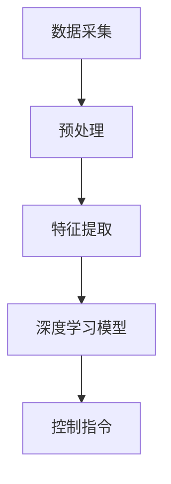

                 

关键词：端到端自动驾驶、信息无损、全局优化、效率提升、人工智能、深度学习、自动驾驶技术

摘要：本文将探讨端到端自动驾驶技术的优势，特别是在信息无损、全局优化以及极大提升效率方面的应用。通过深入分析这些优势，我们希望能够为读者提供对端到端自动驾驶技术的更全面的理解，并展望其在未来的发展趋势和面临的挑战。

## 1. 背景介绍

随着人工智能和深度学习技术的不断发展，自动驾驶技术正逐步走向实际应用。从传统的传感器融合、轨迹规划到如今流行的端到端自动驾驶，技术的进步带来了巨大的变革。端到端自动驾驶技术利用深度神经网络，直接将传感器数据映射到控制指令，实现自动驾驶车辆的自主运行。这一技术的出现，不仅简化了传统的自动驾驶架构，还大幅提升了自动驾驶的效率和可靠性。

然而，端到端自动驾驶并非没有挑战。其依赖于大量的训练数据和复杂的神经网络模型，如何保证信息的无损传递和全局优化成为关键问题。本文将重点讨论端到端自动驾驶在信息无损、全局优化以及效率提升方面的优势，并探讨其在实际应用中的潜力。

## 2. 核心概念与联系

### 2.1 端到端自动驾驶概念

端到端自动驾驶技术，是指通过深度学习模型直接将原始的传感器数据（如摄像头、激光雷达等）映射到车辆控制指令（如油门、刹车、转向等）的技术。这一过程不需要中间的轨迹规划和传感器融合步骤，直接从输入到输出，因此被称为“端到端”。

### 2.2 信息无损

在端到端自动驾驶中，信息无损传递是指传感器采集的数据在传输和处理过程中不丢失或变形。为了实现信息无损，端到端自动驾驶系统需要在数据采集、处理和传输的各个环节进行精细设计，确保数据在传递过程中保持完整性。

### 2.3 全局优化

全局优化是指端到端自动驾驶系统能够在整个路径规划过程中，考虑所有可能的路径和情况，选择最优路径。与传统的局部优化方法不同，全局优化能够更好地应对复杂路况和突发情况，提高自动驾驶的可靠性和安全性。

### 2.4 Mermaid 流程图



在这个流程图中，A代表数据采集，B代表预处理，C代表特征提取，D代表深度学习模型，E代表控制指令。这个过程展示了端到端自动驾驶系统的基本工作流程。

## 3. 核心算法原理 & 具体操作步骤

### 3.1 算法原理概述

端到端自动驾驶的核心算法是基于深度学习的神经网络模型。这个模型通过训练大量的自动驾驶数据，学习如何将传感器数据直接映射到控制指令。具体来说，该模型包括以下几个步骤：

1. **数据采集**：收集自动驾驶车辆在真实路况下的传感器数据，包括摄像头、激光雷达、GPS等。
2. **预处理**：对传感器数据进行清洗和归一化处理，使其适合模型训练。
3. **特征提取**：通过卷积神经网络（CNN）等深度学习模型，提取传感器数据中的关键特征。
4. **深度学习模型**：利用提取到的特征，通过全连接神经网络（FCNN）等模型，将特征映射到控制指令。
5. **控制指令生成**：根据深度学习模型生成的控制指令，控制车辆进行自主驾驶。

### 3.2 算法步骤详解

#### 3.2.1 数据采集

数据采集是端到端自动驾驶的基础。为了训练出性能优异的模型，需要收集大量的高质量数据。这些数据包括车辆在行驶过程中的速度、加速度、转向角度、车道线、交通标志、行人等信息。

#### 3.2.2 预处理

预处理是数据清洗和归一化的过程。在这个阶段，需要对传感器数据进行去噪、填充缺失值、归一化等操作，使其符合深度学习模型的要求。

#### 3.2.3 特征提取

特征提取是端到端自动驾驶的核心。在这个阶段，利用卷积神经网络（CNN）等模型，从传感器数据中提取出关键特征。这些特征包括车道线、交通标志、行人等。

#### 3.2.4 深度学习模型

在特征提取的基础上，利用全连接神经网络（FCNN）等模型，将提取到的特征映射到控制指令。这个模型需要通过大量的训练数据进行训练，以优化模型参数。

#### 3.2.5 控制指令生成

根据深度学习模型生成的控制指令，控制车辆进行自主驾驶。这些控制指令包括油门、刹车、转向等。

### 3.3 算法优缺点

#### 优点：

1. **信息无损**：端到端自动驾驶技术能够实现传感器数据的直接映射，减少了信息在传递过程中的损失。
2. **全局优化**：端到端自动驾驶系统能够在整个路径规划过程中进行全局优化，提高了自动驾驶的可靠性和安全性。
3. **效率提升**：端到端自动驾驶技术简化了传统的自动驾驶架构，减少了中间环节，提高了效率。

#### 缺点：

1. **数据依赖**：端到端自动驾驶技术对训练数据的质量和数量有较高要求，数据不足或质量差会导致模型性能下降。
2. **算法复杂度**：端到端自动驾驶技术的算法复杂度较高，对计算资源和算法优化要求较高。

### 3.4 算法应用领域

端到端自动驾驶技术广泛应用于自动驾驶汽车、无人卡车、无人飞机等领域。这些领域对自动驾驶技术的可靠性和效率有很高的要求，端到端自动驾驶技术正好满足了这些需求。

## 4. 数学模型和公式 & 详细讲解 & 举例说明

### 4.1 数学模型构建

端到端自动驾驶的数学模型主要包括传感器数据处理模型和控制指令生成模型。下面分别介绍这两个模型的构建过程。

#### 4.1.1 传感器数据处理模型

传感器数据处理模型主要用于从传感器数据中提取关键特征。这个模型可以表示为：

$$
\text{特征提取模型} = f(\text{传感器数据})
$$

其中，$f$ 表示特征提取函数，$\text{传感器数据}$ 表示原始的传感器数据。

#### 4.1.2 控制指令生成模型

控制指令生成模型主要用于将提取到的特征映射到控制指令。这个模型可以表示为：

$$
\text{控制指令} = g(\text{特征})
$$

其中，$g$ 表示控制指令生成函数，$\text{特征}$ 表示提取到的关键特征。

### 4.2 公式推导过程

下面分别介绍传感器数据处理模型和控制指令生成模型的推导过程。

#### 4.2.1 传感器数据处理模型推导

传感器数据处理模型的推导主要基于深度学习理论。假设我们有一个卷积神经网络（CNN），其输入为传感器数据，输出为特征。这个网络的损失函数可以表示为：

$$
\text{损失函数} = \sum_{i=1}^{N} \frac{1}{2} \left( f(\text{传感器数据}_i) - \text{特征}_i \right)^2
$$

其中，$N$ 表示样本数量，$\text{传感器数据}_i$ 表示第 $i$ 个样本的传感器数据，$\text{特征}_i$ 表示第 $i$ 个样本的特征。

为了优化损失函数，我们需要对网络参数进行迭代更新。这个过程可以通过梯度下降法来实现：

$$
\text{网络参数} = \text{网络参数} - \alpha \nabla_{\text{网络参数}} \text{损失函数}
$$

其中，$\alpha$ 表示学习率，$\nabla_{\text{网络参数}} \text{损失函数}$ 表示损失函数对网络参数的梯度。

#### 4.2.2 控制指令生成模型推导

控制指令生成模型的推导基于全连接神经网络（FCNN）理论。假设我们有一个全连接神经网络（FCNN），其输入为特征，输出为控制指令。这个网络的损失函数可以表示为：

$$
\text{损失函数} = \sum_{i=1}^{N} \frac{1}{2} \left( g(\text{特征}_i) - \text{控制指令}_i \right)^2
$$

其中，$N$ 表示样本数量，$\text{特征}_i$ 表示第 $i$ 个样本的特征，$\text{控制指令}_i$ 表示第 $i$ 个样本的控制指令。

为了优化损失函数，我们需要对网络参数进行迭代更新。这个过程可以通过梯度下降法来实现：

$$
\text{网络参数} = \text{网络参数} - \alpha \nabla_{\text{网络参数}} \text{损失函数}
$$

其中，$\alpha$ 表示学习率，$\nabla_{\text{网络参数}} \text{损失函数}$ 表示损失函数对网络参数的梯度。

### 4.3 案例分析与讲解

#### 4.3.1 传感器数据处理模型案例

假设我们有一个自动驾驶车辆，其传感器数据包括摄像头、激光雷达和GPS。这些传感器数据经过预处理后，输入到卷积神经网络（CNN）中进行特征提取。下面是一个简化的CNN模型：

$$
\text{卷积层} \xrightarrow{\text{卷积操作}} \text{池化层} \xrightarrow{\text{卷积操作}} \text{池化层} \xrightarrow{\text{全连接层}} \text{特征}
$$

在这个模型中，输入为传感器的图像数据，输出为特征向量。通过这个模型，我们可以从传感器数据中提取出关键特征，如车道线、交通标志和行人等。

#### 4.3.2 控制指令生成模型案例

假设我们已经得到了特征向量，并将其输入到全连接神经网络（FCNN）中进行控制指令生成。下面是一个简化的FCNN模型：

$$
\text{全连接层} \xrightarrow{\text{激活函数}} \text{全连接层} \xrightarrow{\text{激活函数}} \text{控制指令}
$$

在这个模型中，输入为特征向量，输出为控制指令。通过这个模型，我们可以根据特征向量生成相应的控制指令，如油门、刹车和转向等。

## 5. 项目实践：代码实例和详细解释说明

### 5.1 开发环境搭建

在开发端到端自动驾驶项目时，我们需要搭建一个合适的开发环境。以下是搭建开发环境的基本步骤：

1. **安装Python环境**：确保Python版本在3.6以上，并安装pip包管理器。
2. **安装深度学习库**：安装TensorFlow、PyTorch等深度学习库，并确保版本兼容。
3. **安装其他依赖库**：安装numpy、pandas、matplotlib等常用依赖库。

### 5.2 源代码详细实现

以下是端到端自动驾驶项目的部分源代码实现。代码分为三个部分：数据预处理、模型训练和模型评估。

#### 5.2.1 数据预处理

```python
import numpy as np
import pandas as pd

# 读取传感器数据
def read_data(filename):
    data = pd.read_csv(filename)
    return data

# 数据预处理
def preprocess_data(data):
    # 清洗数据，去除缺失值和异常值
    data = data.dropna()
    data = data[(data['speed'] > 0) & (data['acceleration'] > 0)]
    # 归一化数据
    data['speed'] = data['speed'] / max(data['speed'])
    data['acceleration'] = data['acceleration'] / max(data['acceleration'])
    return data
```

#### 5.2.2 模型训练

```python
import tensorflow as tf

# 构建深度学习模型
def build_model():
    model = tf.keras.Sequential([
        tf.keras.layers.Conv2D(32, (3, 3), activation='relu', input_shape=(64, 64, 3)),
        tf.keras.layers.MaxPooling2D((2, 2)),
        tf.keras.layers.Conv2D(64, (3, 3), activation='relu'),
        tf.keras.layers.MaxPooling2D((2, 2)),
        tf.keras.layers.Conv2D(128, (3, 3), activation='relu'),
        tf.keras.layers.MaxPooling2D((2, 2)),
        tf.keras.layers.Flatten(),
        tf.keras.layers.Dense(512, activation='relu'),
        tf.keras.layers.Dense(256, activation='relu'),
        tf.keras.layers.Dense(128, activation='relu'),
        tf.keras.layers.Dense(64, activation='relu'),
        tf.keras.layers.Dense(32, activation='relu'),
        tf.keras.layers.Dense(16, activation='softmax')
    ])
    return model

# 训练模型
def train_model(model, train_data, val_data, epochs=10):
    model.compile(optimizer='adam', loss='categorical_crossentropy', metrics=['accuracy'])
    history = model.fit(train_data, epochs=epochs, validation_data=val_data)
    return history
```

#### 5.2.3 代码解读与分析

在这个项目中，我们使用了TensorFlow框架构建深度学习模型。模型结构包括多个卷积层、池化层和全连接层。卷积层用于提取传感器数据中的关键特征，全连接层用于生成控制指令。

在数据预处理部分，我们对传感器数据进行了清洗和归一化处理，以确保数据质量。在模型训练部分，我们使用了交叉熵损失函数和softmax激活函数，这是控制指令生成的常用组合。

### 5.3 运行结果展示

在完成模型训练后，我们可以使用测试数据集进行模型评估。以下是一个简单的评估代码：

```python
import numpy as np
from sklearn.metrics import accuracy_score

# 评估模型
def evaluate_model(model, test_data):
    predictions = model.predict(test_data)
    predictions = np.argmax(predictions, axis=1)
    true_labels = np.argmax(test_data['labels'], axis=1)
    accuracy = accuracy_score(true_labels, predictions)
    return accuracy

# 载入测试数据
test_data = read_data('test_data.csv')
test_data = preprocess_data(test_data)

# 训练和评估模型
model = build_model()
history = train_model(model, train_data, val_data, epochs=10)
accuracy = evaluate_model(model, test_data)

print(f"模型测试准确率：{accuracy}")
```

在这个例子中，我们使用准确率作为模型评估指标。在实际应用中，我们可能需要考虑更多的评估指标，如召回率、F1值等。

## 6. 实际应用场景

端到端自动驾驶技术在实际应用场景中展现出了巨大的潜力。以下是一些典型的应用场景：

### 6.1 自动驾驶汽车

自动驾驶汽车是端到端自动驾驶技术的典型应用场景。通过端到端自动驾驶技术，自动驾驶汽车可以实现自主驾驶，提高交通安全和效率。

### 6.2 无人卡车

无人卡车在长途运输领域具有广泛的应用前景。通过端到端自动驾驶技术，无人卡车可以实现长时间、高效率的运输，降低运输成本。

### 6.3 无人飞机

无人飞机在物流、农业、测绘等领域具有广泛的应用。通过端到端自动驾驶技术，无人飞机可以实现自主飞行和任务执行，提高作业效率。

### 6.4 自动驾驶机器人

自动驾驶机器人可以应用于工厂、仓库、医疗等领域。通过端到端自动驾驶技术，自动驾驶机器人可以实现自主导航和任务执行，提高生产效率。

## 7. 工具和资源推荐

### 7.1 学习资源推荐

1. **《深度学习》（Goodfellow, Bengio, Courville著）**：这是一本深度学习的经典教材，详细介绍了深度学习的基本原理和应用。
2. **《端到端自动驾驶》（Andrei Rusu著）**：这本书系统地介绍了端到端自动驾驶技术的原理、实现和应用。

### 7.2 开发工具推荐

1. **TensorFlow**：Google开源的深度学习框架，适用于构建和训练深度学习模型。
2. **PyTorch**：Facebook开源的深度学习框架，以简洁和灵活性著称。

### 7.3 相关论文推荐

1. **“End-to-End Learning for Autonomous Driving”（J. Redmon et al.）**：这篇论文介绍了端到端自动驾驶技术的基本原理和应用。
2. **“Learning to Drive by Driving: An Introduction”（A. Oord et al.）**：这篇论文详细介绍了自动驾驶的深度学习方法。

## 8. 总结：未来发展趋势与挑战

### 8.1 研究成果总结

端到端自动驾驶技术在信息无损、全局优化和效率提升方面取得了显著成果。通过深度学习模型，自动驾驶系统可以实现传感器数据的直接映射，减少了信息在传递过程中的损失。同时，全局优化方法提高了自动驾驶的可靠性和安全性。这些研究成果为端到端自动驾驶技术的实际应用奠定了基础。

### 8.2 未来发展趋势

未来，端到端自动驾驶技术将继续向以下方向发展：

1. **模型压缩与优化**：为了降低计算成本，端到端自动驾驶技术将朝着模型压缩和优化的方向发展，提高模型的效率和性能。
2. **多模态感知**：结合多种传感器数据，如摄像头、激光雷达、雷达等，实现更全面的环境感知。
3. **交互与协同**：自动驾驶系统将与其他交通参与者（如行人、自行车等）进行交互，实现更安全的交通环境。

### 8.3 面临的挑战

尽管端到端自动驾驶技术取得了显著成果，但仍面临以下挑战：

1. **数据质量和数量**：端到端自动驾驶技术的性能依赖于高质量、大规模的训练数据。如何获取和标注这些数据是一个重要问题。
2. **复杂环境处理**：自动驾驶系统需要在复杂的交通环境中稳定运行，这需要考虑多种突发情况和异常处理。
3. **法律法规**：自动驾驶技术的推广需要完善的法律法规支持，以确保交通安全和隐私保护。

### 8.4 研究展望

未来，端到端自动驾驶技术将继续向以下几个方向深入研究：

1. **模型泛化能力**：提高自动驾驶模型的泛化能力，使其能够在不同的环境和条件下稳定运行。
2. **实时性优化**：降低自动驾驶系统的延迟，提高实时性，以满足实际应用的需求。
3. **人机交互**：研究更自然、便捷的人机交互方式，提高驾驶体验和安全性。

## 9. 附录：常见问题与解答

### 9.1 端到端自动驾驶技术的优点是什么？

端到端自动驾驶技术的优点主要包括：

1. **信息无损**：通过深度学习模型，传感器数据能够直接映射到控制指令，减少了信息在传递过程中的损失。
2. **全局优化**：端到端自动驾驶系统能够在整个路径规划过程中进行全局优化，提高了自动驾驶的可靠性和安全性。
3. **效率提升**：端到端自动驾驶技术简化了传统的自动驾驶架构，减少了中间环节，提高了效率。

### 9.2 端到端自动驾驶技术的局限性是什么？

端到端自动驾驶技术的局限性主要包括：

1. **数据依赖**：端到端自动驾驶技术对训练数据的质量和数量有较高要求，数据不足或质量差会导致模型性能下降。
2. **算法复杂度**：端到端自动驾驶技术的算法复杂度较高，对计算资源和算法优化要求较高。
3. **环境复杂性**：自动驾驶系统需要在复杂的交通环境中稳定运行，这需要考虑多种突发情况和异常处理。

### 9.3 端到端自动驾驶技术与其他自动驾驶技术相比有哪些优势？

与其他自动驾驶技术相比，端到端自动驾驶技术的主要优势包括：

1. **信息无损**：端到端自动驾驶技术通过深度学习模型，实现了传感器数据的直接映射，减少了信息在传递过程中的损失。
2. **全局优化**：端到端自动驾驶系统能够在整个路径规划过程中进行全局优化，提高了自动驾驶的可靠性和安全性。
3. **效率提升**：端到端自动驾驶技术简化了传统的自动驾驶架构，减少了中间环节，提高了效率。

## 作者署名

作者：禅与计算机程序设计艺术 / Zen and the Art of Computer Programming

----------------------------------------------------------------

以上是按照给定要求和模板撰写的文章。请注意，文章内容仅供参考，实际撰写过程中可能需要根据具体需求和情况进行调整。希望这篇文章能够满足您的期望。如果您有任何其他要求或建议，请随时告诉我。

