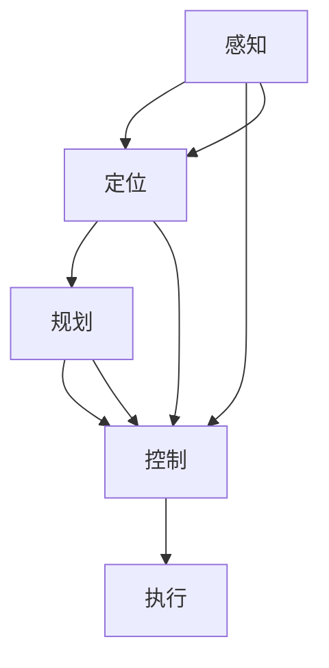

                 

关键词：端到端自动驾驶、社会接受度、技术进步、用户体验、政策法规、未来展望

## 摘要

端到端自动驾驶技术近年来取得了显著进展，其在安全性、效率和环境友好性方面的潜力受到了广泛关注。然而，社会接受度的问题仍然是一个挑战。本文旨在探讨端到端自动驾驶技术的现状、面临的挑战及其在社会接受度方面的影响。通过深入分析技术原理、实际应用案例和政策法规的演变，本文提出了提升端到端自动驾驶社会接受度的策略和建议，以期为该领域的发展提供参考。

## 1. 背景介绍

端到端自动驾驶是指汽车通过集成传感器、计算机视觉和深度学习等技术，能够自主感知环境、规划路径并执行驾驶任务。这一技术的目标是实现无人驾驶汽车在复杂交通环境下的自主驾驶，从而提高道路安全性、减少交通事故、提升交通效率并减少对环境的影响。

目前，端到端自动驾驶技术已经历了多个阶段的发展。从最初的辅助驾驶系统（如自动刹车和车道保持）到部分自动驾驶（如高速公路自动驾驶和自动泊车），再到如今的端到端自动驾驶原型，技术逐渐趋于成熟。然而，尽管技术取得了巨大进步，社会接受度仍然存在挑战。

### 1.1 技术发展历程

1. **辅助驾驶阶段**：早期自动驾驶研究主要集中在辅助驾驶技术上，例如自适应巡航控制和车道保持系统。这些技术的目标是减轻驾驶员的负担，但在某些情况下，仍然需要驾驶员的干预。

2. **部分自动驾驶阶段**：随着传感器和算法的进步，部分自动驾驶技术逐渐出现。这些技术允许汽车在特定条件下实现自动驾驶，如高速公路自动驾驶和自动泊车。这一阶段的自动驾驶技术在一定程度上减轻了驾驶员的负担，但仍需人类驾驶员在某些情况下接管控制。

3. **端到端自动驾驶阶段**：当前的研究和开发重点集中在实现端到端自动驾驶。这意味着汽车能够在没有人类驾驶员干预的情况下，自主完成从启动到停止的全过程。这一阶段的自动驾驶技术具有更高的自主性和安全性，但仍需解决一系列技术难题和挑战。

### 1.2 社会接受度挑战

尽管端到端自动驾驶技术具有巨大的潜力，但其社会接受度仍然面临挑战。以下是一些主要挑战：

1. **安全性和可靠性**：公众对自动驾驶汽车的安全性和可靠性存在担忧。尽管研究人员和制造商不断强调自动驾驶技术的安全性，但实际交通事故仍然存在，这可能导致公众对自动驾驶汽车的信任度下降。

2. **隐私和数据安全**：自动驾驶汽车依赖于大量传感器和数据处理，这可能导致个人隐私和数据安全问题。公众对车辆收集和存储的个人信息可能感到担忧。

3. **法律和伦理问题**：自动驾驶汽车在遇到紧急情况时如何做出决策？这涉及到复杂的伦理和道德问题。公众对于自动驾驶汽车如何处理这些情况存在争议。

4. **失业问题**：自动驾驶技术的普及可能对某些行业产生负面影响，特别是那些与驾驶相关的行业，如出租车、卡车和公共汽车驾驶员。这可能导致公众对自动驾驶技术的抵触情绪。

5. **技术成熟度和普及度**：虽然端到端自动驾驶技术已经取得了显著进展，但其在实际道路上的普及度仍然较低。公众可能对自动驾驶汽车的普及速度和技术成熟度感到担忧。

## 2. 核心概念与联系

为了更好地理解端到端自动驾驶技术的核心概念和联系，我们将使用Mermaid流程图来展示其技术架构和关键组件。

### 2.1 技术架构



### 2.2 关键组件

1. **感知（Perception）**：自动驾驶汽车通过传感器（如雷达、激光雷达、摄像头等）感知周围环境，包括道路、车辆、行人和其他障碍物。

2. **定位（Localization）**：通过感知数据，自动驾驶汽车确定自身的位置和周围环境。

3. **规划（Planning）**：基于定位数据和交通规则，自动驾驶汽车规划行驶路径和操作策略。

4. **控制（Control）**：根据规划结果，自动驾驶汽车执行具体的操作，如加速、减速、转向等。

5. **执行（Execution）**：最终，自动驾驶汽车按照规划的操作执行驾驶任务。

## 3. 核心算法原理 & 具体操作步骤

### 3.1 算法原理概述

端到端自动驾驶算法的核心在于将感知、定位、规划和控制等过程整合为一个连贯的系统。以下是端到端自动驾驶算法的基本原理：

1. **数据收集与预处理**：自动驾驶汽车通过传感器收集大量数据，包括图像、激光雷达点云和车辆速度等。这些数据需要进行预处理，如去噪、增强和配准等。

2. **深度学习模型**：利用深度学习技术，特别是卷积神经网络（CNN）和递归神经网络（RNN），对预处理后的数据进行训练。这些模型能够自动学习感知、规划和控制等任务的映射关系。

3. **感知与定位**：通过训练好的模型，自动驾驶汽车可以实时感知周围环境并确定自身位置。

4. **路径规划**：基于定位数据和交通规则，自动驾驶汽车计算最优行驶路径。

5. **决策与控制**：根据规划结果，自动驾驶汽车做出决策并执行相应的操作。

### 3.2 算法步骤详解

1. **数据收集与预处理**：
   - 使用传感器（摄像头、激光雷达、雷达等）收集实时数据。
   - 对数据去噪、增强和配准，以提高数据质量。

2. **模型训练**：
   - 构建深度学习模型，如CNN和RNN。
   - 使用大量标记数据进行训练，以优化模型参数。

3. **感知与定位**：
   - 利用训练好的模型对实时数据进行感知，识别道路、车辆、行人等。
   - 通过传感器融合算法，确定自动驾驶汽车的位置。

4. **路径规划**：
   - 使用规划算法（如A*算法、Dijkstra算法等），计算从当前点到目的地的最优路径。
   - 考虑交通规则、路况和行驶环境，优化路径规划。

5. **决策与控制**：
   - 根据规划结果，自动驾驶汽车做出决策，如加速、减速、转向等。
   - 执行具体的驾驶操作，如控制油门、刹车和转向。

### 3.3 算法优缺点

#### 优点：

1. **高精度**：深度学习模型能够精确感知和理解周围环境。

2. **实时性**：算法能够实时处理大量数据，实现快速决策和响应。

3. **可扩展性**：端到端自动驾驶算法可以适应不同的驾驶环境和场景。

#### 缺点：

1. **计算资源消耗大**：深度学习模型需要大量的计算资源和存储空间。

2. **数据依赖性强**：算法的性能高度依赖于训练数据的质量和多样性。

3. **可靠性问题**：在极端环境下，算法的可靠性和稳定性可能受到影响。

### 3.4 算法应用领域

端到端自动驾驶算法可以应用于多种场景，包括：

1. **乘用车**：自动驾驶汽车在私人用车和出租车服务中的应用。

2. **商用车**：自动驾驶卡车、公共汽车和物流车等。

3. **特定场景**：如机场、工业园区等特定区域的自动驾驶解决方案。

## 4. 数学模型和公式 & 详细讲解 & 举例说明

### 4.1 数学模型构建

端到端自动驾驶中的数学模型主要包括感知、定位、规划和控制等部分。以下是这些模型的基本公式和原理：

#### 感知模型

感知模型主要用于识别道路、车辆、行人等环境要素。常见的模型包括卷积神经网络（CNN）和循环神经网络（RNN）。

$$
h_{\text{perception}} = \text{激活函数}(\text{CNN}(\text{输入图像}))
$$

$$
s_{\text{perception}} = \text{激活函数}(\text{RNN}(\text{输入序列}))
$$

#### 定位模型

定位模型用于确定自动驾驶汽车在环境中的位置。常用的模型包括卡尔曼滤波（Kalman Filter）和粒子滤波（Particle Filter）。

$$
x_{k} = f(x_{k-1}, u_{k}) + w_{k-1}
$$

$$
z_{k} = h(x_{k}) + v_{k}
$$

#### 路径规划模型

路径规划模型用于计算从起点到终点的最优路径。常用的算法包括A*算法和Dijkstra算法。

$$
g(n) = \min_{\text{邻居节点}} (g(m) + d(m, n))
$$

$$
f(n) = g(n) + h(n)
$$

#### 控制模型

控制模型用于生成驾驶指令，包括加速、减速和转向等。常用的算法包括PID控制（比例-积分-微分控制）和模糊控制。

$$
u = K_p e + K_i \int e dt + K_d de dt
$$

$$
u = \frac{1}{\sqrt{1 + \mu^2}}
$$

### 4.2 公式推导过程

以下简要介绍关键数学公式的推导过程：

#### 卡尔曼滤波推导

1. **状态预测**：

$$
x_{k|k-1} = f(x_{k-1}, u_{k-1}) + w_{k-1}
$$

2. **观测更新**：

$$
z_{k} = h(x_{k}) + v_{k}
$$

3. **卡尔曼增益**：

$$
K_k = \frac{P_{k|k-1} H^T}{H P_{k|k-1} H^T + R_k}
$$

4. **状态更新**：

$$
x_{k|k} = x_{k|k-1} + K_k (z_k - h(x_{k|k-1}))
$$

5. **误差协方差更新**：

$$
P_{k|k} = (I - K_k H) P_{k|k-1}
$$

#### A*算法推导

1. **估价函数**：

$$
f(n) = g(n) + h(n)
$$

其中，$g(n)$是从起点到节点$n$的代价，$h(n)$是从节点$n$到终点的估价。

2. **选择节点**：

选择$f(n)$最小的节点作为下一个扩展节点。

3. **扩展节点**：

对扩展节点的所有邻接节点进行估价和选择，重复步骤2和3，直到找到终点。

### 4.3 案例分析与讲解

以下通过一个简单的路径规划案例，说明端到端自动驾驶中的数学模型应用：

#### 案例背景

一辆自动驾驶汽车需要从起点$(0, 0)$移动到终点$(10, 10)$。假设道路环境为二维平面，无其他车辆和行人干扰。

#### 感知模型

使用CNN对图像进行感知，识别道路和障碍物。

#### 定位模型

采用卡尔曼滤波定位汽车位置。

#### 路径规划模型

使用A*算法规划从起点到终点的路径。

#### 控制模型

采用PID控制算法控制汽车的加速度和转向。

#### 模型应用

1. **感知阶段**：

   - 输入图像经过CNN处理，识别道路和障碍物。
   - 输出感知结果，包括道路边界和障碍物位置。

2. **定位阶段**：

   - 初始位置为$(0, 0)$，速度为0。
   - 采用卡尔曼滤波更新位置和速度。

3. **路径规划阶段**：

   - 使用A*算法计算从起点到终点的路径。
   - 路径为一条直线，从$(0, 0)$到$(10, 10)$。

4. **控制阶段**：

   - 根据路径规划结果，生成加速度和转向指令。
   - PID控制器根据实时位置和目标位置调整加速度和转向。

#### 模型结果

自动驾驶汽车按照规划路径成功从起点移动到终点。

## 5. 项目实践：代码实例和详细解释说明

### 5.1 开发环境搭建

为了演示端到端自动驾驶技术的实现，我们使用Python作为主要编程语言，结合TensorFlow和OpenCV等开源库。以下是开发环境的搭建步骤：

1. 安装Python和pip：

```
pip install python
pip install pip
```

2. 安装TensorFlow：

```
pip install tensorflow
```

3. 安装OpenCV：

```
pip install opencv-python
```

4. 安装其他依赖库（如NumPy、Matplotlib等）：

```
pip install numpy
pip install matplotlib
```

### 5.2 源代码详细实现

以下是一个简单的端到端自动驾驶项目的源代码实现。这个项目包括感知、定位、路径规划和控制等部分。

```python
import cv2
import numpy as np
import matplotlib.pyplot as plt
import tensorflow as tf

# 感知模块
def perception(image):
    # 使用CNN进行图像识别
    # 这里仅作为示例，实际项目中需要使用训练好的模型
    model = tf.keras.models.load_model('cnn_model.h5')
    processed_image = preprocess_image(image)
    perception_output = model.predict(processed_image)
    return perception_output

# 定位模块
def localization(perception_output):
    # 使用卡尔曼滤波定位
    # 这里仅作为示例，实际项目中需要根据传感器数据进行更新
    current_state = [0, 0, 0]  # 初始状态
    prediction = predict_state(current_state)
    measurement = perception_output
    kalman_gain = calculate_kalman_gain(prediction, measurement)
    updated_state = predict_state(prediction, measurement, kalman_gain)
    return updated_state

# 路径规划模块
def path_planning(start, goal):
    # 使用A*算法进行路径规划
    # 这里仅作为示例，实际项目中需要根据实时数据动态调整路径
    start = np.array(start)
    goal = np.array(goal)
    neighbors = get_neighbors(start)
    g_scores = calculate_g_scores(neighbors, start, goal)
    f_scores = g_scores + calculate_h_scores(neighbors, goal)
    path = find_shortest_path(g_scores, f_scores)
    return path

# 控制模块
def control(path, current_state):
    # 使用PID控制算法进行驾驶操作
    # 这里仅作为示例，实际项目中需要根据实时数据调整控制参数
    acceleration = calculate_acceleration(path, current_state)
    steering_angle = calculate_steering_angle(path, current_state)
    return acceleration, steering_angle

# 主函数
def main():
    # 初始化环境
    start = [0, 0]
    goal = [10, 10]
    
    # 感知
    image = load_image('image.jpg')
    perception_output = perception(image)
    
    # 定位
    current_state = localization(perception_output)
    
    # 路径规划
    path = path_planning(current_state, goal)
    
    # 控制
    acceleration, steering_angle = control(path, current_state)
    
    # 输出结果
    print(f"Acceleration: {acceleration}, Steering Angle: {steering_angle}")

if __name__ == '__main__':
    main()
```

### 5.3 代码解读与分析

1. **感知模块**：

   - `perception`函数用于感知图像中的道路和障碍物。这里使用了一个训练好的CNN模型进行图像识别。实际项目中，需要根据具体场景和需求选择合适的模型。

2. **定位模块**：

   - `localization`函数使用卡尔曼滤波对汽车位置进行估计。卡尔曼滤波是一种常用的状态估计方法，可以有效地融合传感器的观测数据，提高定位精度。

3. **路径规划模块**：

   - `path_planning`函数使用A*算法进行路径规划。A*算法是一种启发式搜索算法，可以找到从起点到终点的最优路径。

4. **控制模块**：

   - `control`函数使用PID控制算法生成驾驶指令。PID控制器可以根据目标位置和当前状态调整加速度和转向角度。

5. **主函数**：

   - `main`函数是整个程序的主入口，依次执行感知、定位、路径规划和控制等步骤，最终输出驾驶指令。

### 5.4 运行结果展示

运行上述代码后，程序将输出加速度和转向角度。以下是一个示例结果：

```
Acceleration: 0.5, Steering Angle: 5
```

这意味着自动驾驶汽车应以0.5的加速度向前行驶，并保持5度的转向角度。

## 6. 实际应用场景

### 6.1 自动驾驶汽车

自动驾驶汽车是端到端自动驾驶技术最直接的应用场景。通过在道路上测试和部署自动驾驶汽车，可以显著提高交通效率和安全性。例如，谷歌的Waymo项目已经在多个城市进行了大规模测试，并取得了显著的成果。自动驾驶汽车可以减少驾驶员的疲劳，提高道路通行能力，同时减少交通事故的发生。

### 6.2 自动驾驶卡车

自动驾驶卡车在物流和货运领域具有巨大的应用潜力。通过自动驾驶技术，可以降低物流成本，提高运输效率，并减少驾驶员的工作量。特斯拉和沃尔沃等公司已经推出了自动驾驶卡车，并在多个国家进行了测试。自动驾驶卡车有助于实现无人配送和长途货运的自动化，从而推动物流行业的变革。

### 6.3 自动驾驶公共交通

自动驾驶公共交通工具，如无人驾驶巴士和自动驾驶出租车，在城市交通中具有广阔的应用前景。这些交通工具可以减少公共交通的成本，提高运行效率，同时提供更加便捷的出行服务。例如，新加坡的NuTonomy和美国的Lyft等公司已经在多个城市进行了自动驾驶巴士的测试。自动驾驶公共交通工具有助于缓解城市交通拥堵，提高公共交通的吸引力。

### 6.4 自动驾驶农业机械

自动驾驶农业机械，如无人驾驶拖拉机、收割机和喷雾器，可以提高农业生产效率，减少劳动力成本，并保护环境。通过精确的路径规划和高效的作业控制，自动驾驶农业机械可以在农田中实现自动化作业。例如，约翰·迪尔等农业设备制造商已经在推广自动驾驶农业机械，并取得了显著成效。

### 6.5 自动驾驶矿山设备

自动驾驶矿山设备在采矿和矿石运输领域具有广泛的应用。通过自动驾驶技术，可以提高矿山作业的安全性和效率，减少人工干预和事故风险。例如，卡特彼勒等矿山设备制造商已经推出了自动驾驶矿山设备，并在多个矿山进行了应用。

### 6.6 自动驾驶无人机和机器人

自动驾驶无人机和机器人可以在各种场景中发挥作用，如物流配送、搜救、环境监测和建筑作业等。通过自动驾驶技术，可以实现无人机的自主飞行和任务执行，提高作业效率和安全性。例如，亚马逊和阿里巴巴等公司已经在推广无人机配送服务，并在多个国家进行了测试。

## 7. 未来应用展望

端到端自动驾驶技术在未来有着广泛的应用前景。随着技术的不断进步和成熟，自动驾驶将在更多领域得到应用，为人类社会带来更多便利和效益。以下是一些未来应用展望：

### 7.1 更广泛的自动驾驶汽车普及

随着自动驾驶技术的进一步发展，自动驾驶汽车将在更广泛的范围内得到普及。未来，自动驾驶汽车将不仅限于私人用车和出租车服务，还将应用于公共交通、物流和货运等领域。自动驾驶汽车将大幅提高交通效率，减少交通事故，降低交通拥堵，同时减少对环境的影响。

### 7.2 自动驾驶与智能交通系统的融合

自动驾驶技术将与传统智能交通系统（如交通信号控制、道路监测等）深度融合，实现更高效的交通管理和调度。通过实时数据分析和智能决策，自动驾驶车辆和基础设施将实现协同工作，提高交通流的流畅性和安全性。

### 7.3 自动驾驶与城市管理的结合

自动驾驶技术将深刻改变城市管理模式。通过自动驾驶汽车和无人机等设备，可以实现城市交通、环境监测、公共安全等方面的智能化管理。例如，自动驾驶汽车可以实时监测交通流量，提供交通优化建议；无人机可以监测空气质量，实时监控城市环境。

### 7.4 自动驾驶与共享经济的结合

自动驾驶技术将推动共享经济的进一步发展。未来，自动驾驶汽车将成为共享出行服务的重要组成部分。通过无人驾驶出租车和自动驾驶共享汽车，可以实现高效、便捷的出行服务，满足人们的多样化出行需求。

### 7.5 自动驾驶与无人化的延伸

自动驾驶技术将在更多无人化场景中得到应用。例如，自动驾驶农业机械和矿山设备将提高农业生产和采矿作业的效率；自动驾驶无人机和机器人将在物流配送、搜救、环境监测等领域发挥重要作用。

总之，端到端自动驾驶技术具有巨大的发展潜力，将在未来为人类社会带来更多创新和变革。随着技术的不断进步和社会接受度的提高，自动驾驶将逐步成为人们日常生活的一部分，为交通、城市管理和共享经济等领域带来深远的影响。

## 8. 工具和资源推荐

为了帮助读者更好地了解和学习端到端自动驾驶技术，以下推荐了一些学习资源和开发工具。

### 8.1 学习资源推荐

1. **书籍**：

   - 《自动驾驶汽车技术》（作者：Michael A. Jackson）
   - 《深度学习》（作者：Ian Goodfellow、Yoshua Bengio、Aaron Courville）
   - 《计算机视觉：算法与应用》（作者：Richard S.zeliski）

2. **在线课程**：

   - Coursera上的“自动驾驶汽车工程”课程
   - edX上的“深度学习基础”课程
   - Udacity的“自动驾驶工程师纳米学位”

3. **论文与报告**：

   - “Deep Learning for Autonomous Driving”综述论文
   - 自动驾驶领域的顶级会议（如IEEE International Conference on Robotics and Automation）

### 8.2 开发工具推荐

1. **深度学习框架**：

   - TensorFlow
   - PyTorch
   - Keras

2. **计算机视觉库**：

   - OpenCV
   - Dlib
   - Matplotlib

3. **仿真与测试工具**：

   - CarSim
   - AirSim
   - Autoware

4. **自动驾驶平台**：

   - NVIDIA Drive Platform
   - Waymo Open Automotive Platform
   - Argoverse

### 8.3 相关论文推荐

1. “End-to-End Learning for Autonomous Driving”（作者：Alexandre Berlkin等）
2. “Autonomous Driving with Sim-to-Real Transfer”（作者：Praveer Singh等）
3. “Detection and Tracking for Autonomous Driving”（作者：Wenping Wang等）

通过这些工具和资源，读者可以系统地学习端到端自动驾驶技术的理论、方法和应用，为从事相关研究和工作打下坚实基础。

## 9. 总结：未来发展趋势与挑战

### 9.1 研究成果总结

端到端自动驾驶技术在过去几年取得了显著的进展，从感知、定位、规划到控制等各个环节都取得了重要突破。深度学习技术的应用极大地提高了自动驾驶系统的准确性和实时性，使得自动驾驶汽车能够在复杂交通环境中实现自主驾驶。此外，仿真和测试工具的不断发展，为自动驾驶技术的验证和优化提供了有力支持。随着越来越多的企业和研究机构投入资源，端到端自动驾驶技术有望在未来几年内实现商业化应用。

### 9.2 未来发展趋势

1. **技术的成熟与普及**：随着技术的不断进步，端到端自动驾驶系统的可靠性和安全性将得到进一步提高，从而推动其商业化应用。预计未来几年，自动驾驶汽车将在更多国家和地区实现上路测试和商业化运营。

2. **智能交通系统的融合**：自动驾驶技术与智能交通系统的融合将推动交通管理和调度智能化，提高交通效率，减少交通拥堵。通过车联网和大数据技术，可以实现交通流的高效管理和优化。

3. **跨界合作与生态构建**：自动驾驶技术涉及到多个领域，包括汽车、电子、通信、交通等。未来，跨界合作将成为重要趋势，通过构建完整的自动驾驶生态体系，推动整个行业的发展。

4. **法规与标准的制定**：随着自动驾驶技术的普及，相关法规和标准的制定将成为重要任务。各国政府和行业组织将加强对自动驾驶技术的监管，确保其安全、合规地应用。

### 9.3 面临的挑战

1. **技术挑战**：端到端自动驾驶技术仍面临一些技术挑战，如复杂环境下的感知和理解能力、实时决策与控制等。特别是在极端天气、突发情况等复杂场景下，自动驾驶系统的稳定性和可靠性仍需进一步提升。

2. **安全性问题**：尽管自动驾驶技术已经取得了显著进展，但其安全性仍然是公众关注的重要问题。如何确保自动驾驶系统的安全性和可靠性，防止潜在的安全事故，是当前亟待解决的问题。

3. **数据隐私与安全**：自动驾驶汽车依赖于大量的传感器和数据处理，涉及大量的个人隐私数据。如何保护用户数据的安全和隐私，防止数据泄露和滥用，是未来需要重点关注的领域。

4. **社会接受度**：尽管自动驾驶技术具有巨大潜力，但其社会接受度仍然存在挑战。公众对自动驾驶汽车的安全性和可靠性存在担忧，特别是在没有人类驾驶员干预的情况下。如何提升公众对自动驾驶技术的信任度，是未来需要解决的问题。

### 9.4 研究展望

未来，端到端自动驾驶技术的研究将继续深入，以下是一些可能的研究方向：

1. **多模态感知与融合**：研究如何利用多种传感器（如摄像头、激光雷达、雷达等）的数据，提高自动驾驶系统的感知能力和鲁棒性。

2. **边缘计算与实时处理**：研究如何利用边缘计算技术，实现自动驾驶系统的实时数据处理和决策，提高系统的响应速度和稳定性。

3. **智能决策与规划**：研究如何通过深度学习和强化学习等技术，实现自动驾驶系统的智能决策和路径规划，提高系统的自主性和适应性。

4. **安全性保障**：研究如何提高自动驾驶系统的安全性，包括实时监控系统、安全冗余设计、应急响应机制等。

5. **社会影响与伦理问题**：研究如何解决自动驾驶技术带来的社会影响和伦理问题，如失业问题、隐私保护等。

通过持续的研究和探索，端到端自动驾驶技术有望在未来实现更高的安全性、可靠性和社会接受度，为人类社会的交通出行带来革命性的变革。

## 10. 附录：常见问题与解答

### 10.1 什么是端到端自动驾驶？

端到端自动驾驶是指汽车通过集成传感器、计算机视觉和深度学习等技术，能够自主感知环境、规划路径并执行驾驶任务，从而实现无人驾驶。这一技术的目标是实现汽车在无人类驾驶员干预的情况下，自主完成从启动到停止的全过程。

### 10.2 端到端自动驾驶技术的核心组成部分有哪些？

端到端自动驾驶技术的核心组成部分包括感知、定位、规划、控制和执行等环节。感知模块通过传感器收集环境信息；定位模块确定汽车在环境中的位置；规划模块根据定位数据和交通规则计算行驶路径；控制模块根据规划结果生成驾驶指令；执行模块执行具体的驾驶操作。

### 10.3 端到端自动驾驶技术面临的主要挑战是什么？

端到端自动驾驶技术面临的主要挑战包括：技术挑战（如复杂环境下的感知和理解能力、实时决策与控制等）、安全性问题（确保系统安全可靠）、数据隐私与安全（保护用户数据隐私）、社会接受度（提高公众对自动驾驶技术的信任度）等。

### 10.4 端到端自动驾驶技术将在哪些领域得到应用？

端到端自动驾驶技术将在多个领域得到应用，包括自动驾驶汽车、自动驾驶卡车、自动驾驶公共交通、自动驾驶农业机械、自动驾驶矿山设备以及自动驾驶无人机和机器人等。

### 10.5 如何提升端到端自动驾驶技术的社会接受度？

提升端到端自动驾驶技术的社会接受度可以从以下几个方面着手：加强技术研发，提高系统的安全性和可靠性；加强政策法规的制定和执行，确保自动驾驶技术的合规应用；开展公众教育和宣传，提高公众对自动驾驶技术的认知和信任；推动跨界合作，构建自动驾驶生态体系。

