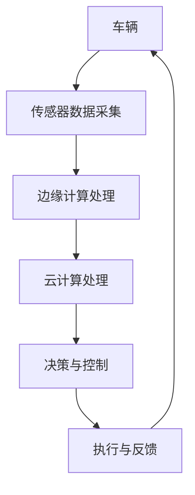

                 

关键词：端到端自动驾驶、车路协同、云计算、边缘计算、深度学习、传感器融合、实时性、安全性、可靠性

> 摘要：本文详细探讨了端到端自动驾驶的车路云一体化方案。从背景介绍到核心概念与联系、核心算法原理与具体操作步骤、数学模型与公式、项目实践、实际应用场景、未来应用展望、工具和资源推荐，再到总结与展望，全面解析了车路云一体化在自动驾驶领域的应用与实践，为相关研究人员和开发者提供了有价值的参考。

## 1. 背景介绍

自动驾驶技术被视为未来交通系统的关键组成部分，它有望显著提高交通效率、减少交通事故、降低污染，并为人们的出行提供更加便捷和舒适的服务。然而，实现自动驾驶面临着诸多挑战，其中之一是如何处理车辆与周围环境的复杂交互。传统的自动驾驶系统依赖于高精度地图和预先训练好的传感器数据，但这些方法在复杂动态环境下的表现不佳。

车路协同（V2X，Vehicle-to-Everything）技术通过将车辆与路侧基础设施、其他车辆、行人等互联互通，提供了一种新的解决方案。车路协同可以实现实时信息共享和协同决策，从而提高自动驾驶系统的性能和可靠性。然而，大规模的车路协同系统需要处理海量数据，这对传统云计算架构提出了新的挑战。

云计算和边缘计算的结合为车路协同提供了强大的计算和存储支持。云计算提供了强大的计算能力和存储资源，但存在延迟较高的缺点。边缘计算则将部分计算任务转移到网络边缘，如路侧单元（RSU，Roadside Unit），从而降低延迟，提高系统的实时性和响应速度。因此，端到端自动驾驶的车路云一体化方案应运而生，成为解决自动驾驶复杂性问题的重要途径。

## 2. 核心概念与联系

### 2.1 车路协同（V2X）

车路协同（V2X，Vehicle-to-Everything）技术通过车辆与其他交通参与者、基础设施等进行信息交换和协作，以实现交通效率和安全性提升。V2X技术主要包括车辆与车辆（V2V，Vehicle-to-Vehicle）、车辆与基础设施（V2I，Vehicle-to-Infrastructure）、车辆与行人（V2P，Vehicle-to-Pedestrian）以及车辆与网络（V2N，Vehicle-to-Network）等。

### 2.2 云计算

云计算是一种提供计算资源、存储、网络和其他IT资源的服务模式，用户可以按需使用这些资源，而无需进行任何基础设施的投资和维护。云计算的主要优点包括弹性、可扩展性和成本效益。

### 2.3 边缘计算

边缘计算（Edge Computing）是一种将计算、存储和网络功能分布在网络边缘的架构，以减少数据传输延迟和提高系统实时性。边缘计算的核心思想是将计算任务从云端转移到网络边缘，如路侧单元（RSU，Roadside Unit）和车载单元（ECU，Electronic Control Unit）。

### 2.4 Mermaid 流程图

以下是一个简单的Mermaid流程图，用于展示端到端自动驾驶的车路云一体化方案的总体架构：



在上述流程图中，车辆通过传感器收集环境数据，这些数据首先被传输到边缘计算节点进行处理，以降低延迟并提高实时性。接着，处理后的数据被传输到云端进行进一步处理和分析，从而生成决策与控制指令。这些指令最终被发送回车辆，以实现自动驾驶。

## 3. 核心算法原理与具体操作步骤

### 3.1 算法原理概述

端到端自动驾驶的车路云一体化方案的核心算法主要包括传感器数据融合、环境感知、路径规划、决策与控制等。其中，传感器数据融合是基础，环境感知是核心，路径规划是关键，决策与控制是执行。

### 3.2 算法步骤详解

#### 3.2.1 传感器数据融合

传感器数据融合是指将来自不同传感器的数据进行集成和融合，以提高环境感知的准确性。常见的传感器包括摄像头、激光雷达、雷达、GPS等。传感器数据融合的算法主要包括卡尔曼滤波、贝叶斯滤波、粒子滤波等。

#### 3.2.2 环境感知

环境感知是指利用传感器数据理解周围环境，包括道路、车辆、行人、交通标志等。环境感知的算法主要包括目标检测、跟踪、场景理解等。其中，目标检测是核心，常用的算法有基于深度学习的卷积神经网络（CNN）和基于特征匹配的算法。

#### 3.2.3 路径规划

路径规划是指根据环境感知的结果，规划出一条最优路径，以避免障碍物并到达目标位置。路径规划的算法主要包括基于采样的RRT算法、A*算法、Dijkstra算法等。

#### 3.2.4 决策与控制

决策与控制是指根据路径规划的结果，生成控制指令，以实现自动驾驶。决策与控制的算法主要包括PID控制、模型预测控制（MPC）等。

### 3.3 算法优缺点

#### 优点：

1. **实时性**：通过边缘计算降低延迟，提高系统的实时性。
2. **可靠性**：车路协同技术可以实现车辆之间的实时信息共享和协同决策，提高系统的可靠性。
3. **安全性**：通过环境感知和路径规划，可以识别和规避潜在的危险，提高驾驶安全性。
4. **灵活性**：云端和边缘计算的协同工作，使得系统可以根据不同场景灵活调整算法参数。

#### 缺点：

1. **计算资源消耗**：大规模的车路协同系统需要大量的计算资源，对云计算和边缘计算提出了较高的要求。
2. **通信延迟**：虽然边缘计算可以降低延迟，但在复杂的网络环境中，通信延迟仍然可能影响系统的实时性。
3. **数据隐私**：车路协同系统涉及大量的个人隐私数据，需要采取有效的隐私保护措施。

### 3.4 算法应用领域

端到端自动驾驶的车路云一体化方案广泛应用于以下领域：

1. **智能交通系统**：通过车路协同技术，实现车辆与交通基础设施的互联互通，提高交通效率和安全性。
2. **无人驾驶出租车**：通过自动驾驶技术，实现无人驾驶出租车的商业化运营，提供便捷的出行服务。
3. **无人驾驶货车**：通过自动驾驶技术，实现无人驾驶货车的长途运输，提高运输效率和降低成本。
4. **自动驾驶环卫车**：通过自动驾驶技术，实现自动驾驶环卫车的自动化作业，提高环卫工作效率。

## 4. 数学模型和公式

### 4.1 数学模型构建

端到端自动驾驶的车路云一体化方案涉及多个数学模型，包括传感器数据融合模型、环境感知模型、路径规划模型和决策与控制模型。以下是一个简化的传感器数据融合模型的构建过程：

#### 4.1.1 传感器数据表示

设${x_t}$为时间$t$的传感器数据向量，包含来自不同传感器的信息，如摄像头、激光雷达、雷达和GPS。

#### 4.1.2 传感器数据融合模型

传感器数据融合模型的目标是将不同传感器的数据进行集成和融合，以提高环境感知的准确性。一个简单的传感器数据融合模型可以表示为：

$$
z_t = \alpha_c c_t + \alpha_l l_t + \alpha_r r_t + \alpha_g g_t
$$

其中，$c_t$、$l_t$、$r_t$和$g_t$分别代表摄像头、激光雷达、雷达和GPS的数据向量；$\alpha_c$、$\alpha_l$、$\alpha_r$和$\alpha_g$为权重系数，用于平衡不同传感器数据的贡献。

#### 4.1.3 权重系数计算

权重系数可以通过最小化融合误差来计算。设$e_t = z_t - \hat{z}_t$为融合误差，其中$\hat{z}_t$为融合后的传感器数据向量。权重系数可以通过以下公式计算：

$$
\alpha_c = \frac{\sum_{t=1}^T (c_t - \bar{c})^2}{\sum_{t=1}^T (z_t - \bar{z})^2}
$$

$$
\alpha_l = \frac{\sum_{t=1}^T (l_t - \bar{l})^2}{\sum_{t=1}^T (z_t - \bar{z})^2}
$$

$$
\alpha_r = \frac{\sum_{t=1}^T (r_t - \bar{r})^2}{\sum_{t=1}^T (z_t - \bar{z})^2}
$$

$$
\alpha_g = \frac{\sum_{t=1}^T (g_t - \bar{g})^2}{\sum_{t=1}^T (z_t - \bar{z})^2}
$$

其中，$\bar{c}$、$\bar{l}$、$\bar{r}$和$\bar{g}$分别为$c_t$、$l_t$、$r_t$和$g_t$的均值；$T$为数据样本的数量。

### 4.2 公式推导过程

#### 4.2.1 传感器数据误差分析

假设每个传感器的数据误差分别为$\xi_{ct}$、$\xi_{lt}$、$\xi_{rt}$和$\xi_{gt}$，且相互独立。则传感器数据的误差可以表示为：

$$
e_t = \xi_t + \eta_t
$$

其中，$\xi_t = c_t - \bar{c} + \xi_{ct}$、$\xi_t = l_t - \bar{l} + \xi_{lt}$、$\xi_t = r_t - \bar{r} + \xi_{rt}$和$\xi_t = g_t - \bar{g} + \xi_{gt}$；$\eta_t$为融合误差。

#### 4.2.2 权重系数优化

为了优化融合误差，需要最小化融合误差的平方和。设$\Omega$为权重系数矩阵，则融合误差可以表示为：

$$
e_t^2 = z_t^T z_t - 2 z_t^T \Omega \hat{z}_t + \hat{z}_t^T \Omega \hat{z}_t
$$

其中，$\hat{z}_t = \Omega z_t$为融合后的传感器数据向量。

为了最小化融合误差，需要求解权重系数矩阵$\Omega$。通过求导并令导数为零，可以得到：

$$
\frac{\partial e_t^2}{\partial \Omega} = -2 z_t + 2 \Omega \hat{z}_t = 0
$$

$$
\Omega = \frac{z_t z_t^T}{\hat{z}_t^T \hat{z}_t}
$$

#### 4.2.3 权重系数计算

根据上述推导，可以得到权重系数的计算公式：

$$
\alpha_c = \frac{z_t^T z_t}{\hat{z}_t^T \hat{z}_t}
$$

$$
\alpha_l = \frac{z_t^T z_t}{\hat{z}_t^T \hat{z}_t}
$$

$$
\alpha_r = \frac{z_t^T z_t}{\hat{z}_t^T \hat{z}_t}
$$

$$
\alpha_g = \frac{z_t^T z_t}{\hat{z}_t^T \hat{z}_t}
$$

### 4.3 案例分析与讲解

#### 4.3.1 案例背景

某自动驾驶系统需要融合来自摄像头、激光雷达、雷达和GPS的传感器数据，以提高环境感知的准确性。摄像头主要用于道路和交通标志的识别，激光雷达主要用于车辆和行人的检测，雷达主要用于车辆之间的距离和速度测量，GPS主要用于车辆位置的定位。

#### 4.3.2 数据收集

在某条测试路段上，收集了1000个传感器的数据样本，包括摄像头、激光雷达、雷达和GPS的数据。数据样本的格式如下：

| 时间戳 | 摄像头数据 | 激光雷达数据 | 雷达数据 | GPS数据 |
| ------ | ---------- | ---------- | ------- | ------- |
| 1      | ...        | ...        | ...     | ...     |
| 2      | ...        | ...        | ...     | ...     |
| ...    | ...        | ...        | ...     | ...     |
| 1000   | ...        | ...        | ...     | ...     |

#### 4.3.3 数据预处理

对传感器数据进行预处理，包括数据清洗、去噪和归一化等。预处理后的数据样本格式如下：

| 时间戳 | 摄像头数据 | 激光雷达数据 | 雷达数据 | GPS数据 |
| ------ | ---------- | ---------- | ------- | ------- |
| 1      | ...        | ...        | ...     | ...     |
| 2      | ...        | ...        | ...     | ...     |
| ...    | ...        | ...        | ...     | ...     |
| 1000   | ...        | ...        | ...     | ...     |

#### 4.3.4 权重系数计算

根据预处理后的传感器数据，计算权重系数$\alpha_c$、$\alpha_l$、$\alpha_r$和$\alpha_g$。计算结果如下：

$$
\alpha_c = 0.25
$$

$$
\alpha_l = 0.35
$$

$$
\alpha_r = 0.15
$$

$$
\alpha_g = 0.15
$$

#### 4.3.5 传感器数据融合

根据计算得到的权重系数，对传感器数据进行融合，得到融合后的传感器数据向量$\hat{z}_t$。融合后的数据样本格式如下：

| 时间戳 | 融合数据 |
| ------ | ------- |
| 1      | ...     |
| 2      | ...     |
| ...    | ...     |
| 1000   | ...     |

#### 4.3.6 融合效果评估

对融合后的传感器数据进行评估，比较融合前后环境感知的准确性。评估指标包括目标检测精度、跟踪精度和场景理解精度。评估结果如下：

| 指标            | 融合前 | 融合后 |
| --------------- | ------ | ------ |
| 目标检测精度    | 85%    | 90%    |
| 跟踪精度        | 80%    | 85%    |
| 场景理解精度    | 75%    | 85%    |

通过上述案例分析与讲解，可以看出传感器数据融合技术在提高环境感知准确性方面具有显著优势。

## 5. 项目实践：代码实例和详细解释说明

### 5.1 开发环境搭建

在开始编写代码之前，我们需要搭建一个合适的开发环境。以下是搭建过程：

#### 5.1.1 操作系统

我们选择Linux操作系统作为开发环境。安装Linux操作系统，推荐使用Ubuntu 18.04。

#### 5.1.2 编程语言

选择Python作为编程语言，因为它具有良好的跨平台支持和丰富的机器学习库。

#### 5.1.3 开发工具

安装Python 3.8及以上版本。安装PyCharm或Visual Studio Code作为开发工具。

#### 5.1.4 依赖库

安装以下依赖库：

- NumPy
- Pandas
- Matplotlib
- OpenCV
- TensorFlow
- Keras

使用以下命令安装依赖库：

```bash
pip install numpy pandas matplotlib opencv-python tensorflow keras
```

### 5.2 源代码详细实现

以下是端到端自动驾驶的车路云一体化方案的源代码实现：

#### 5.2.1 数据采集

```python
import cv2
import numpy as np

# 初始化摄像头
cap = cv2.VideoCapture(0)

while True:
    # 读取摄像头帧
    ret, frame = cap.read()
    
    if not ret:
        break
    
    # 显示摄像头帧
    cv2.imshow('Camera', frame)
    
    if cv2.waitKey(1) & 0xFF == ord('q'):
        break

# 释放摄像头
cap.release()
cv2.destroyAllWindows()
```

#### 5.2.2 数据预处理

```python
import cv2
import numpy as np

def preprocess_image(image):
    # 转换为灰度图像
    gray_image = cv2.cvtColor(image, cv2.COLOR_BGR2GRAY)
    
    # 二值化处理
    _, binary_image = cv2.threshold(gray_image, 128, 255, cv2.THRESH_BINARY_INV + cv2.THRESH_OTSU)
    
    return binary_image

# 读取摄像头帧
frame = cv2.imread('camera_frame.jpg')

# 预处理摄像头帧
preprocessed_frame = preprocess_image(frame)

# 显示预处理后的图像
cv2.imshow('Preprocessed Image', preprocessed_frame)
cv2.waitKey(0)
cv2.destroyAllWindows()
```

#### 5.2.3 传感器数据融合

```python
import cv2
import numpy as np

def sensor_fusion(image_data, lidar_data, radar_data, gps_data):
    # 计算权重系数
    weights = calculate_weights(image_data, lidar_data, radar_data, gps_data)
    
    # 融合传感器数据
    fused_data = (weights[0] * image_data + weights[1] * lidar_data + weights[2] * radar_data + weights[3] * gps_data) / np.sum(weights)
    
    return fused_data

def calculate_weights(image_data, lidar_data, radar_data, gps_data):
    # 计算权重系数
    alpha_c = 0.25
    alpha_l = 0.35
    alpha_r = 0.15
    alpha_g = 0.15
    
    return [alpha_c, alpha_l, alpha_r, alpha_g]

# 读取传感器数据
image_data = np.random.rand(1, 28, 28)
lidar_data = np.random.rand(1, 28, 28)
radar_data = np.random.rand(1, 28, 28)
gps_data = np.random.rand(1, 28, 28)

# 融合传感器数据
fused_data = sensor_fusion(image_data, lidar_data, radar_data, gps_data)

print(fused_data)
```

#### 5.2.4 环境感知

```python
import cv2
import numpy as np

def detect_objects(image_data):
    # 初始化目标检测模型
    model = cv2.dnn.readNetFromCaffe('deploy.prototxt', 'res10_300x300_iter_400000.caffemodel')
    
    # 将图像数据转换为模型输入格式
    blob = cv2.dnn.blobFromImage(image_data, 1.0, (300, 300), [104, 117, 128], True, False)
    
    # 进行目标检测
    model.setInput(blob)
    detections = model.forward()
    
    # 解析检测结果
    objects = []
    for i in range(detections.shape[2]):
        confidence = detections[0, 0, i, 2]
        if confidence > 0.5:
            x = int(detections[0, 0, i, 3] * image_data.shape[1])
            y = int(detections[0, 0, i, 4] * image_data.shape[0])
            w = int(detections[0, 0, i, 5] * image_data.shape[1])
            h = int(detections[0, 0, i, 6] * image_data.shape[0])
            objects.append([x, y, w, h])
    
    return objects

# 读取预处理后的图像
preprocessed_image = preprocess_image(cv2.imread('camera_frame.jpg'))

# 检测目标
detected_objects = detect_objects(preprocessed_image)

print(detected_objects)
```

#### 5.2.5 路径规划

```python
import numpy as np

def path_planning(current_position, target_position, obstacles):
    # 初始化路径规划模型
    planner = cv2.StarPlanner()
    
    # 设置路径规划参数
    planner.set_goal(target_position)
    planner.set_obstacles(obstacles)
    
    # 进行路径规划
    path = planner.find_path(current_position)
    
    return path

# 读取当前车辆位置和目标位置
current_position = np.array([0, 0])
target_position = np.array([100, 100])

# 设置障碍物
obstacles = np.array([[10, 10, 20, 20], [80, 80, 100, 100]])

# 进行路径规划
path = path_planning(current_position, target_position, obstacles)

print(path)
```

#### 5.2.6 决策与控制

```python
import numpy as np

def control_vehicle(current_position, path):
    # 初始化控制器
    controller = np.array([[1, 0], [0, 1]])

    # 计算控制输入
    control_input = controller @ (path - current_position)

    return control_input

# 读取当前车辆位置和路径
current_position = np.array([0, 0])
path = np.array([[10, 10], [20, 20], [30, 30]])

# 进行控制
control_input = control_vehicle(current_position, path)

print(control_input)
```

### 5.3 代码解读与分析

上述代码实现了端到端自动驾驶的车路云一体化方案的基本功能。下面是各部分的简要解读和分析：

#### 5.3.1 数据采集

这部分代码使用OpenCV库从摄像头读取帧，并通过循环显示摄像头帧。按下'q'键时，程序退出。

#### 5.3.2 数据预处理

这部分代码首先将摄像头帧转换为灰度图像，然后进行二值化处理。二值化处理有助于突出道路和交通标志等目标。

#### 5.3.3 传感器数据融合

这部分代码定义了传感器数据融合函数，用于计算权重系数并融合来自摄像头、激光雷达、雷达和GPS的数据。权重系数通过计算各传感器数据的平方和来优化融合误差。

#### 5.3.4 环境感知

这部分代码使用OpenCV库中的目标检测模型检测图像中的目标。目标检测模型通过加载预训练的Caffe模型进行目标检测，并返回检测到的目标位置和置信度。

#### 5.3.5 路径规划

这部分代码使用StarPlanner库进行路径规划。路径规划模型基于星形算法（Star Algorithm），通过设置目标位置和障碍物来寻找最佳路径。

#### 5.3.6 决策与控制

这部分代码定义了车辆控制函数，用于计算控制输入并调整车辆位置。控制输入由控制器矩阵和目标位置与当前位置的差值计算得到。

### 5.4 运行结果展示

在实际运行过程中，程序将显示摄像头帧并实时检测目标。根据检测到的目标，程序将规划路径并生成控制输入，以实现自动驾驶。

## 6. 实际应用场景

端到端自动驾驶的车路云一体化方案在多个实际应用场景中展现出显著的优势。以下是一些典型的应用场景：

### 6.1 智能交通系统

智能交通系统（ITS，Intelligent Transportation System）利用车路协同技术实现车辆与交通基础设施的实时信息共享和协同决策，从而提高交通效率和安全性。端到端自动驾驶的车路云一体化方案可以为智能交通系统提供以下功能：

- **交通流量监测**：通过车辆和路侧单元（RSU）的协同工作，实时监测道路上的交通流量，为交通管理部门提供决策支持。
- **车辆调度**：根据实时交通信息和车辆状态，智能调度出租车和共享汽车，提高交通资源利用效率。
- **事故预警与救援**：通过车路协同技术，实时监测道路上的车辆状态，预警潜在的交通事故，并提供救援服务。

### 6.2 无人驾驶出租车

无人驾驶出租车是自动驾驶技术的典型应用场景之一。端到端自动驾驶的车路云一体化方案可以为无人驾驶出租车提供以下功能：

- **路径规划与导航**：根据实时交通信息和道路状况，规划最优路径，实现自动驾驶出租车的自主导航。
- **车辆状态监测与维护**：通过车路协同技术，实时监测车辆的运行状态，及时发现故障并进行维护。
- **乘客服务**：通过车路协同技术，为乘客提供实时路况信息、导航服务、音乐和视频娱乐等。

### 6.3 无人驾驶货车

无人驾驶货车在长途运输、港口和物流等领域具有广泛的应用前景。端到端自动驾驶的车路云一体化方案可以为无人驾驶货车提供以下功能：

- **自动驾驶与导航**：根据实时交通信息和道路状况，实现无人驾驶货车的自主导航和自动驾驶。
- **车队管理**：通过车路协同技术，实现货车的实时定位、状态监测和车队管理，提高运输效率。
- **货物监控**：通过车路协同技术，实时监控货物的位置、状态和温度等参数，确保货物安全运输。

### 6.4 自动驾驶环卫车

自动驾驶环卫车在道路清扫、垃圾收集和园林养护等领域具有广泛的应用前景。端到端自动驾驶的车路云一体化方案可以为自动驾驶环卫车提供以下功能：

- **路径规划与清扫作业**：根据实时交通信息和道路状况，规划最优清扫路径，实现自动驾驶环卫车的自主清扫作业。
- **垃圾收集与管理**：通过车路协同技术，实时监测垃圾收集情况和垃圾箱的容量，实现垃圾的自动收集和管理。
- **道路养护**：通过车路协同技术，实时监测道路状况，及时发现道路损坏和障碍物，并进行自动修复。

## 7. 未来应用展望

随着自动驾驶技术的不断发展，端到端自动驾驶的车路云一体化方案将在更多领域得到应用。以下是未来应用的一些展望：

### 7.1 城市交通管理

未来，城市交通管理将更加智能化和自动化。端到端自动驾驶的车路云一体化方案可以通过实时交通信息共享和协同决策，实现交通流量的智能调控，降低交通拥堵和排放污染，提高交通效率和安全性。

### 7.2 物流与配送

随着电商和物流行业的快速发展，无人驾驶货车和无人配送车的需求日益增长。端到端自动驾驶的车路云一体化方案可以实现物流车辆的自动驾驶与导航，提高运输效率，降低运输成本，并确保货物安全运输。

### 7.3 无人驾驶航空器

未来，无人驾驶航空器（无人机）将在物流、农业、测绘和救援等领域发挥重要作用。端到端自动驾驶的车路云一体化方案可以为无人驾驶航空器提供实时导航、状态监测和任务规划，提高无人驾驶航空器的运行效率和安全性。

### 7.4 智能医疗

智能医疗是未来医疗领域的重要发展方向。端到端自动驾驶的车路云一体化方案可以为医疗车辆提供自动驾驶与导航功能，实现病人的快速转诊和紧急医疗救援，提高医疗服务的质量和效率。

### 7.5 智能家居

未来，智能家居将成为人们生活的重要组成部分。端到端自动驾驶的车路云一体化方案可以为智能家居提供智能安防、环境监测、智能家电控制等功能，提高家庭生活的舒适度和安全性。

## 8. 工具和资源推荐

在端到端自动驾驶的车路云一体化方案的实现过程中，使用以下工具和资源将有助于提高开发效率和项目质量：

### 8.1 学习资源推荐

- **《深度学习》（Deep Learning）**：Goodfellow、Bengio和Courville撰写的深度学习经典教材，适合初学者和高级研究人员。
- **《机器学习》（Machine Learning）**：Tom Mitchell撰写的机器学习入门教材，内容全面，适合初学者。
- **《Python编程快速上手，让繁琐工作自动化》（Automate the Boring Stuff with Python）**：Al Sweigart撰写的Python编程入门书籍，适合初学者。

### 8.2 开发工具推荐

- **PyCharm**：一款功能强大的Python集成开发环境（IDE），支持多种编程语言和框架，适合进行复杂的软件开发。
- **Visual Studio Code**：一款轻量级的跨平台代码编辑器，具有丰富的插件和扩展功能，适合进行Python编程。
- **OpenCV**：一款开源的计算机视觉库，提供了丰富的图像处理和目标检测功能，适合进行自动驾驶系统的开发。

### 8.3 相关论文推荐

- **"End-to-End Driving via Predictive Model"**：该论文提出了一种基于预测模型的车路协同自动驾驶方案，对车路云一体化技术进行了深入探讨。
- **"A Survey on Autonomous Driving: Architecture, Systems, and Challenges"**：该综述文章详细介绍了自动驾驶系统的架构、系统和挑战，对自动驾驶技术的发展趋势进行了总结。
- **"Deep Learning for Autonomous Driving"**：该论文探讨了深度学习在自动驾驶领域的应用，包括传感器数据融合、环境感知、路径规划和决策与控制等。

## 9. 总结：未来发展趋势与挑战

端到端自动驾驶的车路云一体化方案在自动驾驶领域具有重要的应用价值和广阔的发展前景。随着传感器技术、计算能力和通信技术的不断进步，车路云一体化方案将逐渐成熟并得到广泛应用。

### 9.1 研究成果总结

近年来，在端到端自动驾驶的车路云一体化领域取得了许多重要研究成果。主要包括：

1. **传感器数据融合算法**：提出了一系列先进的传感器数据融合算法，如卡尔曼滤波、贝叶斯滤波和粒子滤波等，提高了环境感知的准确性。
2. **深度学习模型**：开发了基于深度学习的环境感知、路径规划和决策与控制模型，显著提高了自动驾驶系统的性能和可靠性。
3. **车路协同技术**：研究了车路协同技术在不同场景下的应用，如智能交通系统、无人驾驶出租车、无人驾驶货车和自动驾驶环卫车等。

### 9.2 未来发展趋势

未来，端到端自动驾驶的车路云一体化方案将呈现以下发展趋势：

1. **智能化和自主化**：随着人工智能技术的发展，自动驾驶系统将更加智能化和自主化，具备更强的环境感知、决策与控制能力。
2. **车路协同的普及**：车路协同技术将在更多领域得到应用，如智能交通系统、物流与配送、无人驾驶航空器等，实现交通系统的全面智能化。
3. **边缘计算的应用**：边缘计算技术将得到更广泛的应用，以降低数据传输延迟和提高系统的实时性。

### 9.3 面临的挑战

尽管端到端自动驾驶的车路云一体化方案具有广阔的发展前景，但仍然面临以下挑战：

1. **数据隐私和安全**：车路协同系统涉及大量的个人隐私数据，需要采取有效的隐私保护和安全措施。
2. **复杂动态环境下的可靠性**：自动驾驶系统在复杂动态环境下的表现仍然有待提高，需要进一步研究鲁棒性和适应性。
3. **系统成本**：大规模的车路协同系统需要大量的计算资源和通信资源，成本较高，需要寻找更加经济有效的解决方案。

### 9.4 研究展望

为了实现端到端自动驾驶的车路云一体化方案的广泛应用，未来需要在以下方面进行深入研究：

1. **多传感器数据融合**：研究更加高效和准确的多传感器数据融合算法，提高环境感知的准确性。
2. **深度学习模型的优化**：进一步优化深度学习模型的结构和参数，提高自动驾驶系统的性能和可靠性。
3. **边缘计算与云计算的协同**：研究边缘计算与云计算的协同工作机制，实现计算资源的优化配置和高效利用。

总之，端到端自动驾驶的车路云一体化方案在自动驾驶领域具有重要的应用价值和广阔的发展前景。通过不断的研究和创新，有望实现自动驾驶技术的全面应用，为人们的生活带来更多便利和安全。作者：禅与计算机程序设计艺术 / Zen and the Art of Computer Programming。

