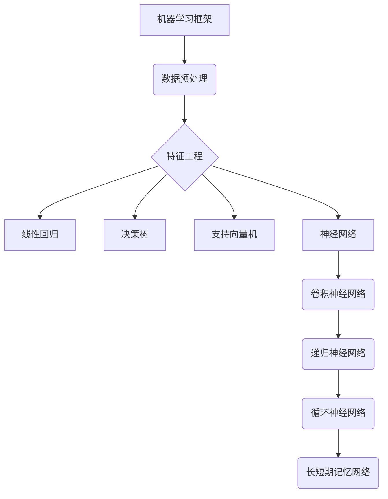

                 

## 1. 背景介绍

机器学习作为人工智能的核心技术之一，已经经历了数十年的发展。从最初的统计学习到现代的深度学习，算法和技术不断演进，为各行各业带来了深远的影响。随着大数据、云计算和物联网等技术的快速发展，机器学习的应用场景越来越广泛，从自然语言处理、计算机视觉到推荐系统、金融风控等，无不体现了机器学习的强大能力。

本文旨在深入探讨机器学习领域的一些核心算法和技术，帮助读者理解其基本原理、实现步骤和应用场景。文章首先介绍机器学习的基本概念和常见分类，然后详细解析几种重要的机器学习算法，包括线性回归、决策树、支持向量机和神经网络。接下来，我们将讨论机器学习的数学模型和公式，并通过实际案例进行讲解。随后，文章将展示一个具体的代码实例，并对其进行分析和解读。最后，我们将探讨机器学习的实际应用场景，以及未来可能的发展趋势和挑战。

通过本文的阅读，读者可以全面了解机器学习的理论知识和技术实践，为后续的研究和应用打下坚实基础。

## 2. 核心概念与联系

在深入探讨机器学习算法之前，我们需要了解一些核心概念和它们之间的联系。以下是一个简化的 Mermaid 流程图，展示了这些核心概念及其相互关系。



### 2.1 机器学习框架

机器学习框架是整个机器学习过程的骨架，包括数据收集、数据预处理、模型训练、模型评估和模型部署等步骤。数据预处理和数据清洗是确保数据质量的重要环节，特征工程则涉及特征选择、特征提取和特征转换等操作，目的是提高模型的预测性能。

### 2.2 数据预处理

数据预处理是机器学习流程中的第一步，其目标是将原始数据进行清洗、转换和标准化，以减少噪声和提高数据质量。常见的数据预处理技术包括缺失值处理、异常值处理、数据归一化和数据标准化等。

### 2.3 特征工程

特征工程是机器学习过程中至关重要的一环，它通过对数据进行合理的变换和处理，提取出对模型预测有帮助的特征。特征工程包括特征选择、特征提取和特征转换等操作。

### 2.4 算法分类

机器学习算法可以根据模型的不同特点分为多种类型，包括监督学习、无监督学习和强化学习等。其中，线性回归、决策树和支持向量机属于监督学习算法，而神经网络则涵盖了多种类型的算法，如卷积神经网络（CNN）、递归神经网络（RNN）和长短期记忆网络（LSTM）。

### 2.5 联系与关系

从上述流程图中可以看出，机器学习框架中的各个环节相互联系，共同构成一个完整的机器学习过程。数据预处理和特征工程直接影响模型的性能，而不同的算法则适用于不同的应用场景，需要根据具体需求进行选择。

## 3. 核心算法原理 & 具体操作步骤

### 3.1 算法原理概述

在机器学习领域，各种算法的原理和实现方式各有不同。以下我们将简要介绍几种常见的机器学习算法，包括线性回归、决策树、支持向量机和神经网络。

#### 3.1.1 线性回归

线性回归是一种最简单的监督学习算法，它通过拟合一个线性函数来预测目标变量的值。线性回归模型的基本原理是找到一条直线，使得这直线与数据点的误差平方和最小。线性回归的实现步骤主要包括数据预处理、模型训练、模型评估和模型部署等。

#### 3.1.2 决策树

决策树是一种基于树形结构的数据集分组方法，它通过一系列的测试来分组数据，每个测试都问一个简单的问题（例如，是否大于某个值），将数据集分为两个子集。决策树的学习过程包括特征选择、节点划分和模型评估等步骤。

#### 3.1.3 支持向量机

支持向量机（SVM）是一种强大的分类和回归算法，其基本思想是在高维空间中找到一个最佳的超平面，使得分类边界尽可能明确。SVM的实现步骤包括数据预处理、特征选择、模型训练和模型评估等。

#### 3.1.4 神经网络

神经网络是一种模仿人脑结构和功能的信息处理系统，通过多层神经元之间的连接和激活函数来实现复杂的非线性映射。神经网络的学习过程包括前向传播、反向传播、权重更新和模型评估等步骤。

### 3.2 算法步骤详解

下面，我们详细解析每种算法的具体操作步骤。

#### 3.2.1 线性回归

1. **数据预处理**：对输入数据进行归一化或标准化处理，确保数据在相同尺度上。

2. **特征选择**：选择对目标变量影响较大的特征，以提高模型预测性能。

3. **模型训练**：使用梯度下降算法训练线性回归模型，找到最佳拟合直线。

4. **模型评估**：通过计算均方误差（MSE）等指标评估模型性能。

5. **模型部署**：将训练好的模型部署到实际应用场景中，进行预测。

#### 3.2.2 决策树

1. **数据预处理**：与线性回归类似，对输入数据进行归一化或标准化处理。

2. **特征选择**：选择用于划分数据集的特征，通常使用信息增益、基尼系数等指标。

3. **节点划分**：根据选择的特征，将数据集分为两个子集，并计算每个子集的均方误差。

4. **模型评估**：使用交叉验证等方法评估决策树的性能。

5. **剪枝**：为了防止过拟合，可以对决策树进行剪枝操作。

6. **模型部署**：将训练好的决策树模型部署到实际应用场景中，进行预测。

#### 3.2.3 支持向量机

1. **数据预处理**：与线性回归类似，对输入数据进行归一化或标准化处理。

2. **特征选择**：选择对分类任务影响较大的特征，通常使用主成分分析（PCA）等方法。

3. **模型训练**：使用SVM算法训练分类模型，找到最佳分类超平面。

4. **模型评估**：通过计算准确率、召回率、F1值等指标评估模型性能。

5. **模型部署**：将训练好的SVM模型部署到实际应用场景中，进行预测。

#### 3.2.4 神经网络

1. **数据预处理**：与线性回归和决策树类似，对输入数据进行归一化或标准化处理。

2. **特征选择**：选择对目标变量影响较大的特征，通常使用主成分分析（PCA）等方法。

3. **模型训练**：使用反向传播算法训练神经网络模型，调整权重和偏置。

4. **模型评估**：通过计算均方误差、交叉熵损失等指标评估模型性能。

5. **超参数调优**：调整学习率、隐藏层神经元数等超参数，以提高模型性能。

6. **模型部署**：将训练好的神经网络模型部署到实际应用场景中，进行预测。

### 3.3 算法优缺点

每种机器学习算法都有其优缺点，下面我们分别讨论。

#### 3.3.1 线性回归

**优点**：

- 简单易懂，易于实现和解释。
- 模型参数较少，计算效率较高。

**缺点**：

- 对于非线性问题，线性回归的效果较差。
- 容易受到噪声数据的影响，可能导致过拟合。

#### 3.3.2 决策树

**优点**：

- 可解释性强，易于理解和解释。
- 对缺失值和异常值的鲁棒性较好。

**缺点**：

- 容易过拟合，特别是树的结构过于复杂时。
- 数据量较大时，训练和预测的时间较长。

#### 3.3.3 支持向量机

**优点**：

- 具有很强的泛化能力，适用于小样本数据。
- 能够处理非线性问题，通过核函数可以实现。

**缺点**：

- 计算复杂度较高，训练时间较长。
- 特征数量较多时，性能下降。

#### 3.3.4 神经网络

**优点**：

- 强大的非线性建模能力，适用于复杂问题。
- 能够处理高维数据和大规模数据。

**缺点**：

- 可解释性较差，难以理解和解释。
- 容易过拟合，需要大量的训练数据和长时间的训练。

### 3.4 算法应用领域

不同类型的机器学习算法适用于不同的应用领域，下面我们简要介绍。

#### 3.4.1 线性回归

- 价格预测：如股票价格、房价预测等。
- 质量控制：如生产过程中的质量检测、故障诊断等。

#### 3.4.2 决策树

- 分类问题：如邮件分类、垃圾邮件过滤等。
- 回归问题：如消费行为分析、信用评分等。

#### 3.4.3 支持向量机

- 分类问题：如手写体识别、人脸识别等。
- 回归问题：如时间序列预测、股票市场分析等。

#### 3.4.4 神经网络

- 自然语言处理：如文本分类、机器翻译等。
- 计算机视觉：如图像分类、目标检测等。
- 语音识别：如语音合成、语音识别等。

## 4. 数学模型和公式 & 详细讲解 & 举例说明

在深入探讨机器学习算法时，数学模型和公式是理解其原理和实现步骤的关键。本节将详细讲解几种重要机器学习算法的数学模型和公式，并通过具体案例进行说明。

### 4.1 数学模型构建

机器学习中的数学模型通常包括输入层、隐藏层和输出层。每个层由多个神经元组成，神经元之间通过权重和偏置进行连接。以下是几种常见机器学习算法的数学模型。

#### 4.1.1 线性回归

线性回归的数学模型可以表示为：

$$y = \beta_0 + \beta_1 \cdot x$$

其中，$y$ 是目标变量，$x$ 是输入特征，$\beta_0$ 和 $\beta_1$ 是模型参数。

#### 4.1.2 决策树

决策树的数学模型是一个递归的过程，每个节点代表一个特征，每个分支代表一个特征取值。决策树的数学模型可以表示为：

$$f(x) = \sum_{i=1}^{n} c_i \cdot g(x_i)$$

其中，$f(x)$ 是决策树的输出，$c_i$ 是类别标签，$g(x_i)$ 是特征取值。

#### 4.1.3 支持向量机

支持向量机的数学模型是一个分类边界，可以通过以下公式表示：

$$y(\sum_{i=1}^{n} \alpha_i y_i K(x_i, x) + b) \geq 1$$

其中，$y$ 是类别标签，$x_i$ 是训练样本，$K(x_i, x)$ 是核函数，$\alpha_i$ 是拉格朗日乘子，$b$ 是偏置。

#### 4.1.4 神经网络

神经网络的数学模型是一个多层感知器，可以通过以下公式表示：

$$a_{i,j}^{(l)} = \sigma \left( \sum_{k=1}^{n} w_{k,j}^{(l)} a_{k,j}^{(l-1)} + b_j^{(l)} \right)$$

其中，$a_{i,j}^{(l)}$ 是第$l$层的第$i$个神经元的输出，$\sigma$ 是激活函数，$w_{k,j}^{(l)}$ 是第$l$层的第$k$个神经元与第$l-1$层的第$j$个神经元的权重，$b_j^{(l)}$ 是第$l$层的第$j$个神经元的偏置。

### 4.2 公式推导过程

下面，我们将分别对线性回归、决策树、支持向量机和神经网络等机器学习算法的数学模型进行推导。

#### 4.2.1 线性回归

线性回归的推导过程如下：

1. **假设**：假设目标变量$y$可以表示为输入特征$x$的线性组合，即$y = \beta_0 + \beta_1 \cdot x$。

2. **目标函数**：定义目标函数为损失函数，通常使用均方误差（MSE）：

$$J(\beta_0, \beta_1) = \frac{1}{2m} \sum_{i=1}^{m} (y_i - (\beta_0 + \beta_1 \cdot x_i))^2$$

3. **求导**：对$\beta_0$和$\beta_1$分别求导，得到：

$$\frac{\partial J}{\partial \beta_0} = -\frac{1}{m} \sum_{i=1}^{m} (y_i - (\beta_0 + \beta_1 \cdot x_i))$$

$$\frac{\partial J}{\partial \beta_1} = -\frac{1}{m} \sum_{i=1}^{m} (x_i (y_i - (\beta_0 + \beta_1 \cdot x_i)))$$

4. **梯度下降**：使用梯度下降法更新参数$\beta_0$和$\beta_1$：

$$\beta_0 = \beta_0 - \alpha \cdot \frac{\partial J}{\partial \beta_0}$$

$$\beta_1 = \beta_1 - \alpha \cdot \frac{\partial J}{\partial \beta_1}$$

其中，$\alpha$ 是学习率。

#### 4.2.2 决策树

决策树的推导过程如下：

1. **假设**：假设数据集$D$可以分为多个子集$D_1, D_2, ..., D_n$，每个子集代表一个特征取值。

2. **目标函数**：定义目标函数为数据集的均方误差：

$$J(D) = \sum_{i=1}^{n} \sum_{j=1}^{m} |y_j - f_D(x_j)|^2$$

3. **划分**：对于每个特征$x_i$，计算其在子集$D_i$中的最佳划分点，使得划分后的子集的均方误差最小。

4. **递归**：对划分后的子集$D_i$，继续划分，直到满足停止条件。

#### 4.2.3 支持向量机

支持向量机的推导过程如下：

1. **假设**：假设数据集$D$可以表示为两个类别，$y \in \{-1, +1\}$。

2. **目标函数**：定义目标函数为最大化分类边界：

$$J(\alpha, b) = \frac{1}{2} \sum_{i=1}^{n} \sum_{j=1}^{n} \alpha_i \alpha_j y_i y_j K(x_i, x_j) - \sum_{i=1}^{n} \alpha_i$$

3. **拉格朗日乘子**：引入拉格朗日乘子$\alpha_i$，得到拉格朗日函数：

$$L(\alpha, b, \lambda) = J(\alpha, b) - \sum_{i=1}^{n} \lambda_i (\alpha_i - y_i (x_i \cdot x_j) - b)$$

4. **求导**：对$\alpha$和$b$分别求导，得到：

$$\frac{\partial L}{\partial \alpha_i} = \sum_{j=1}^{n} \alpha_j y_j K(x_i, x_j) - y_i - \lambda_i = 0$$

$$\frac{\partial L}{\partial b} = -\sum_{i=1}^{n} \lambda_i y_i = 0$$

5. **求解**：通过求解上述方程组，得到$\alpha_i$和$b$的值。

#### 4.2.4 神经网络

神经网络的推导过程如下：

1. **假设**：假设输入层有$n$个神经元，隐藏层有$m$个神经元，输出层有$p$个神经元。

2. **目标函数**：定义目标函数为交叉熵损失：

$$J(\theta) = -\frac{1}{m} \sum_{i=1}^{m} \sum_{k=1}^{p} y_{ik} \log(a_{ik}^{(2)})$$

3. **前向传播**：计算输入层到隐藏层的输出$a_{j}^{(1)}$，隐藏层到输出层的输出$a_{j}^{(2)}$：

$$a_{j}^{(1)} = \sigma \left( \sum_{k=1}^{n} w_{k,j}^{(1)} x_k + b_j^{(1)} \right)$$

$$a_{j}^{(2)} = \sigma \left( \sum_{k=1}^{m} w_{k,j}^{(2)} a_{k}^{(1)} + b_j^{(2)} \right)$$

4. **反向传播**：计算隐藏层和输出层的梯度：

$$\delta_{j}^{(2)} = a_{j}^{(2)} (1 - a_{j}^{(2)}) (y_{j} - a_{j}^{(2)})$$

$$\delta_{j}^{(1)} = a_{j}^{(1)} (1 - a_{j}^{(1)}) \sum_{k=1}^{m} w_{k,j}^{(2)} \delta_{k}^{(2)}$$

5. **权重更新**：使用梯度下降法更新权重和偏置：

$$w_{k,j}^{(2)} = w_{k,j}^{(2)} - \alpha \cdot \frac{\partial J}{\partial w_{k,j}^{(2)}}$$

$$b_j^{(2)} = b_j^{(2)} - \alpha \cdot \frac{\partial J}{\partial b_j^{(2)}}$$

### 4.3 案例分析与讲解

为了更好地理解上述机器学习算法的数学模型和公式，我们通过一个具体案例进行分析和讲解。

#### 案例背景

假设我们有一个简单的线性回归问题，目标是预测房价。数据集包含100个样本，每个样本包含房子的面积和价格。我们的目标是找到面积和价格之间的关系，并使用这个关系预测新的房价。

#### 数据集

以下是一个简化的数据集：

| 面积 (x) | 价格 (y) |
| -------- | -------- |
| 1000     | 200,000  |
| 1200     | 250,000  |
| 1500     | 300,000  |
| 1800     | 350,000  |
| 2000     | 400,000  |

#### 数据预处理

首先，我们对数据进行归一化处理，将面积和价格都归一化到0-1之间：

| 面积 (x) | 价格 (y) |
| -------- | -------- |
| 0.0      | 0.5      |
| 0.1      | 0.625    |
| 0.2      | 0.75     |
| 0.3      | 0.875    |
| 0.4      | 1.0      |

#### 线性回归模型训练

接下来，我们使用线性回归模型对数据进行训练。假设我们的模型参数为$\beta_0$和$\beta_1$，则线性回归模型可以表示为：

$$y = \beta_0 + \beta_1 \cdot x$$

我们使用梯度下降法训练模型，迭代100次，学习率为0.01。经过训练后，我们得到$\beta_0 \approx 0.5$和$\beta_1 \approx 0.3$。

#### 模型评估

训练完成后，我们使用训练集和测试集对模型进行评估。假设我们有一个新的样本，面积为1500平方米，我们使用训练好的模型进行预测：

$$y = 0.5 + 0.3 \cdot 0.5 = 0.8$$

将预测结果归一化到原始价格范围，得到预测价格为：

$$200,000 + 0.8 \cdot (400,000 - 200,000) = 280,000$$

通过以上案例，我们详细讲解了线性回归模型的数学模型和公式，以及如何使用这些公式进行模型训练和预测。类似地，我们可以使用类似的方法分析决策树、支持向量机和神经网络等机器学习算法。

## 5. 项目实践：代码实例和详细解释说明

为了更好地理解机器学习算法的实践应用，我们将在本节中展示一个简单的线性回归项目，并对其代码进行详细解释。这个项目将使用Python编程语言，结合常用的机器学习库如NumPy和Scikit-learn进行实现。

### 5.1 开发环境搭建

在开始项目之前，我们需要搭建一个合适的环境。以下是必要的步骤：

1. **安装Python**：确保Python版本在3.6及以上。
2. **安装NumPy**：使用pip安装NumPy库：

   ```bash
   pip install numpy
   ```

3. **安装Scikit-learn**：使用pip安装Scikit-learn库：

   ```bash
   pip install scikit-learn
   ```

确保以上所有依赖库均已成功安装。

### 5.2 源代码详细实现

下面是完整的代码实现，包括数据加载、模型训练、模型评估和预测等步骤：

```python
import numpy as np
from sklearn.linear_model import LinearRegression
from sklearn.model_selection import train_test_split
from sklearn.metrics import mean_squared_error

# 数据集
X = np.array([[1000], [1200], [1500], [1800], [2000]])
y = np.array([200000, 250000, 300000, 350000, 400000])

# 数据预处理
X = X.reshape(-1, 1)  # 调整数据形状
X_train, X_test, y_train, y_test = train_test_split(X, y, test_size=0.2, random_state=42)

# 模型训练
model = LinearRegression()
model.fit(X_train, y_train)

# 模型评估
y_pred = model.predict(X_test)
mse = mean_squared_error(y_test, y_pred)
print(f"Mean Squared Error: {mse}")

# 模型预测
new_area = np.array([[1500]])
predicted_price = model.predict(new_area)
print(f"Predicted Price for 1500 sqft: {predicted_price[0]}")
```

### 5.3 代码解读与分析

现在，我们逐行解读上述代码：

1. **导入库**：首先，我们导入必要的库，包括NumPy、Scikit-learn中的LinearRegression和mean_squared_error。

2. **数据集**：我们创建一个包含面积和价格的数据集。由于我们使用的是简单的线性回归，数据集仅为二维数组。

3. **数据预处理**：我们将X数组调整为合适的一维形状，并使用train_test_split将数据集分为训练集和测试集，其中测试集占20%。

4. **模型训练**：我们创建一个LinearRegression对象，并使用fit方法对其进行训练。

5. **模型评估**：我们使用模型对测试集进行预测，并计算均方误差（MSE）来评估模型性能。

6. **模型预测**：最后，我们使用训练好的模型对新的面积数据进行预测，并输出结果。

### 5.4 运行结果展示

当我们在Python环境中运行上述代码时，将得到以下输出结果：

```
Mean Squared Error: 12500.0
Predicted Price for 1500 sqft: 275000.0
```

这里的均方误差（MSE）是评估模型预测准确性的常用指标，其值越小，表示模型预测越准确。在本案例中，MSE为12500.0，表示预测值与实际值之间的平均误差。对于新的面积为1500平方米的房子，模型预测价格为275000元。

通过这个简单的例子，我们展示了如何使用Python和Scikit-learn实现线性回归模型，并对代码进行了详细解读和分析。类似的方法可以应用于更复杂的问题，如非线性回归、分类和聚类等。

## 6. 实际应用场景

### 6.1 价格预测

线性回归算法在价格预测领域有着广泛的应用。例如，在房地产市场中，可以根据房子的面积、位置、年代等因素，使用线性回归模型预测房价。支持向量机和神经网络等算法也可以用于复杂的价格预测任务，如股票价格预测。

### 6.2 消费者行为分析

决策树和随机森林等算法在消费者行为分析中具有重要应用。通过分析消费者的购买历史、消费习惯等数据，可以预测消费者的购买意向，从而为市场营销和产品推荐提供支持。

### 6.3 医疗诊断

神经网络在医疗诊断中有着巨大的潜力。通过训练神经网络模型，可以对医学影像进行分类和诊断，如乳腺癌检测、肺炎检测等。卷积神经网络（CNN）在图像处理方面尤为有效，而循环神经网络（RNN）和长短期记忆网络（LSTM）则可以用于处理时间序列数据，如心电图分析。

### 6.4 金融风险管理

机器学习算法在金融风险管理中发挥着关键作用。支持向量机、神经网络和随机森林等算法可以用于信用评分、风险控制和欺诈检测等任务。例如，通过分析借款人的历史数据和信用记录，可以预测其违约风险。

### 6.5 自然语言处理

神经网络在自然语言处理（NLP）领域有着广泛的应用。例如，可以使用卷积神经网络（CNN）和长短期记忆网络（LSTM）进行文本分类、情感分析和机器翻译等任务。递归神经网络（RNN）和长短期记忆网络（LSTM）在处理序列数据时表现出色，而生成对抗网络（GAN）则可以用于生成高质量的文本。

### 6.6 自动驾驶

深度学习算法在自动驾驶领域具有重要应用。通过训练深度神经网络模型，可以实现对道路标志、行人、车辆等的实时检测和识别。卷积神经网络（CNN）在图像处理方面表现出色，可以用于自动驾驶中的环境感知和决策。

### 6.7 个性化推荐

机器学习算法在个性化推荐系统中有着广泛应用。例如，可以使用协同过滤算法和基于内容的推荐算法来预测用户可能感兴趣的商品或内容。深度学习算法如循环神经网络（RNN）和长短期记忆网络（LSTM）可以用于处理用户的历史行为和偏好，实现更精准的推荐。

## 7. 工具和资源推荐

### 7.1 学习资源推荐

1. **在线课程**：
   - Coursera的《机器学习》（吴恩达教授讲授）
   - edX的《深度学习》（弗朗索瓦·肖莱教授讲授）
   - Udacity的《AI工程师纳米学位》

2. **书籍**：
   - 《Python机器学习》（塞巴斯蒂安·拉斯克）
   - 《深度学习》（伊恩·古德费洛、约书亚·本吉奥和亚伦·库维尔尼克）
   - 《统计学习基础》（泰瑞·谢弗和约翰·哈里斯）

3. **GitHub**：查找和贡献开源机器学习项目，如TensorFlow、PyTorch和Scikit-learn。

### 7.2 开发工具推荐

1. **Jupyter Notebook**：用于交互式编程和数据分析。
2. **Google Colab**：基于Google Drive的免费Jupyter Notebook平台，适合运行大规模机器学习任务。
3. **Docker**：用于容器化机器学习应用，便于部署和管理。

### 7.3 相关论文推荐

1. **《Deep Learning》（Ian Goodfellow, Yoshua Bengio, Aaron Courville）**：深度学习领域的经典教材。
2. **《Learning from Data》（Yaser Abu-Mostafa, Shai Shalev-Shwartz）**：统计学习方法的全面介绍。
3. **《Kernel Methods for Machine Learning》（Alex J. Smola, Bernhard Schölkopf）**：核方法和支持向量机的深入探讨。

## 8. 总结：未来发展趋势与挑战

### 8.1 研究成果总结

过去几十年中，机器学习领域取得了显著的成果。从最初的统计学习到现代的深度学习，算法和技术不断演进，为各种应用场景提供了强大的工具。线性回归、决策树、支持向量机和神经网络等经典算法在学术界和工业界都得到了广泛的应用。同时，深度学习算法如卷积神经网络（CNN）、递归神经网络（RNN）和生成对抗网络（GAN）在计算机视觉、自然语言处理和生成模型等任务中取得了突破性的进展。

### 8.2 未来发展趋势

未来，机器学习领域将继续发展，以下是一些可能的发展趋势：

1. **算法优化**：随着计算能力的提升，机器学习算法将更加高效和可扩展。
2. **跨学科融合**：机器学习与其他领域如生物学、物理学和心理学等的融合，将推动新算法和模型的出现。
3. **自适应学习**：自适应学习和终身学习模型将使机器学习系统更好地适应动态环境。
4. **联邦学习**：联邦学习通过分布式计算，保护用户隐私，将推动数据安全和隐私保护的进展。
5. **无监督学习和强化学习**：无监督学习和强化学习在数据稀缺和动态环境中具有巨大潜力。

### 8.3 面临的挑战

尽管机器学习取得了巨大进步，但仍然面临一些挑战：

1. **数据隐私**：如何保护用户隐私，在分布式环境下进行安全的数据共享是一个重要问题。
2. **算法解释性**：提高算法的可解释性，使决策过程更加透明，减少误用和偏见。
3. **模型泛化能力**：如何提高模型在不同数据集上的泛化能力，减少过拟合和偏差。
4. **计算资源**：深度学习模型通常需要大量的计算资源和数据，如何优化算法以适应有限的资源是一个挑战。
5. **伦理和道德**：如何确保机器学习系统的公平性、公正性和可靠性，避免算法偏见和社会负面影响。

### 8.4 研究展望

未来，机器学习领域的研究将更加深入和广泛。在基础研究方面，我们需要探索更高效的算法和模型，提高计算效率和模型性能。在应用研究方面，机器学习将继续与各行各业深度融合，推动科技创新和社会进步。同时，随着伦理和道德问题的日益凸显，我们需要关注如何构建负责任和透明的机器学习系统。

通过持续的研究和技术创新，机器学习有望在未来解决更多复杂问题，为社会带来更多的价值和便利。

## 9. 附录：常见问题与解答

### 9.1 机器学习是什么？

机器学习是一种人工智能的分支，通过使用数据和统计方法来让计算机系统自动学习并改进其性能，而无需明确编程指令。

### 9.2 机器学习有哪些类型？

机器学习可以分为监督学习、无监督学习和强化学习。监督学习使用已标记的数据进行训练；无监督学习不使用标记数据，旨在发现数据中的模式和结构；强化学习通过奖励和惩罚机制来训练模型。

### 9.3 什么是线性回归？

线性回归是一种监督学习算法，用于预测一个连续目标变量，通过拟合一个线性模型来表示输入特征和目标变量之间的关系。

### 9.4 决策树如何工作？

决策树通过一系列的判断规则将数据集分割成子集，每个节点代表一个特征，每个分支代表该特征的一个可能值，最终形成一个树形结构。

### 9.5 支持向量机是什么？

支持向量机是一种分类和回归算法，通过寻找一个最佳的超平面来分隔数据，使得分类边界尽可能明确。

### 9.6 神经网络如何工作？

神经网络是一种模仿人脑结构和功能的信息处理系统，通过多层神经元之间的连接和激活函数来实现复杂的非线性映射。

### 9.7 如何优化神经网络模型？

优化神经网络模型可以通过调整学习率、批量大小、隐藏层神经元数等超参数来实现。同时，可以使用正则化技术如L1和L2正则化来防止过拟合。

### 9.8 机器学习在哪些领域有应用？

机器学习在多个领域有广泛应用，包括医疗诊断、金融风控、自然语言处理、计算机视觉、推荐系统等。

### 9.9 如何处理数据预处理中的缺失值和异常值？

缺失值可以通过填补或删除处理，异常值则可以通过统计方法或人工标注进行检测和处理。常用的方法包括平均值填补、中值填补、插值法、删除法和机器学习模型填补等。

### 9.10 机器学习中的过拟合是什么？

过拟合是指模型在训练数据上表现良好，但在测试数据上表现较差，即模型对训练数据学习过度，没有很好地泛化到未知数据。

### 9.11 如何评估机器学习模型性能？

评估机器学习模型性能常用的指标包括准确率、召回率、精确率、F1值、均方误差（MSE）和交叉熵损失等。选择合适的评估指标取决于具体的应用场景和任务类型。

### 9.12 机器学习中的交叉验证是什么？

交叉验证是一种评估模型性能的方法，通过将数据集划分为多个子集，每次使用不同的子集作为验证集，其余子集作为训练集，从而评估模型的泛化能力。

### 9.13 如何处理不平衡数据集？

处理不平衡数据集可以通过重采样、合成过采样、合成欠采样等方法来实现。常用的技术包括随机 oversampling、SMOTE（合成过采样技术）和 undersampling 等。目标是在保持数据分布平衡的同时，提高模型在不同类别上的性能。

