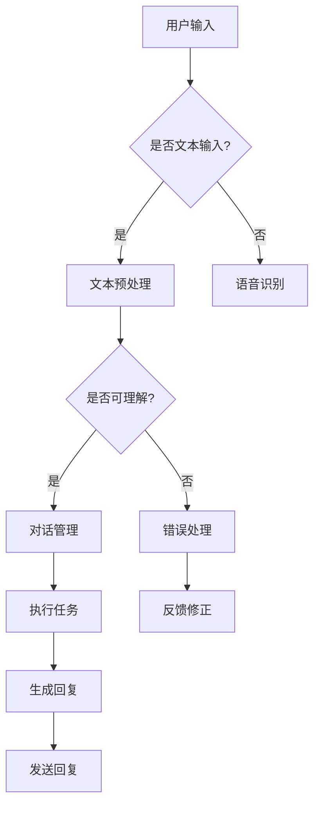

                 

关键词：聊天机器人、人工智能、自然语言处理、应用场景、发展趋势

> 摘要：本文将深入探讨聊天机器人的未来发展，从技术、应用和市场等多个角度分析其趋势和挑战，并展望其在未来可能带来的变革。

## 1. 背景介绍

随着人工智能技术的快速发展，聊天机器人（Chatbot）作为一种新兴的人机交互工具，已经在多个领域得到了广泛应用。聊天机器人通过自然语言处理（NLP）技术，能够模拟人类的对话方式，提供信息查询、在线客服、情感支持等多种服务。

聊天机器人技术的发展，得益于以下几个因素：

1. **计算能力的提升**：随着云计算和大数据技术的发展，计算能力得到了极大的提升，为复杂的NLP算法提供了强大的支持。
2. **算法的进步**：深度学习、强化学习等先进算法的引入，使得聊天机器人在理解人类语言和生成回复方面变得更加智能。
3. **数据资源的丰富**：互联网的普及和用户生成内容的大规模积累，为训练聊天机器人提供了丰富的数据资源。

## 2. 核心概念与联系

### 2.1 自然语言处理（NLP）

自然语言处理是聊天机器人的核心技术之一。NLP旨在让计算机理解和处理自然语言，主要包括以下几个关键概念：

1. **文本分类**：将文本分类到预定义的类别中，如情感分析、主题分类等。
2. **命名实体识别**：识别文本中的特定实体，如人名、地名、组织名等。
3. **句法分析**：分析句子的结构，理解句子的构成和关系。
4. **语义理解**：理解文本的含义和意图，实现对话的流畅和准确。

### 2.2 聊天机器人架构

聊天机器人的架构通常包括以下几个部分：

1. **前端界面**：用户与聊天机器人交互的界面，可以是网页、移动应用或语音助手等。
2. **后端服务**：负责处理用户的输入、执行任务和生成回复等操作，通常包括自然语言处理、对话管理、任务执行等多个模块。
3. **数据库**：存储用户的个人信息、聊天记录等数据。

### 2.3 Mermaid 流程图

以下是一个简化的聊天机器人流程图：



## 3. 核心算法原理 & 具体操作步骤

### 3.1 算法原理概述

聊天机器人的核心算法主要涉及自然语言处理和对话管理两个领域。自然语言处理包括文本分类、命名实体识别、句法分析和语义理解等，对话管理则关注如何有效地组织对话流程，实现用户意图的识别和任务的执行。

### 3.2 算法步骤详解

1. **文本预处理**：对用户输入的文本进行清洗、分词、去停用词等处理，以提取关键信息。
2. **命名实体识别**：利用预训练的模型，识别文本中的命名实体，如人名、地名等。
3. **句法分析**：对句子进行句法分析，构建句子的语法树，理解句子结构。
4. **语义理解**：利用语义分析技术，理解用户输入的含义和意图。
5. **对话管理**：根据用户意图，选择合适的回复，并规划对话流程。
6. **任务执行**：执行用户任务，如查询信息、执行操作等。
7. **生成回复**：根据任务执行结果，生成适当的回复文本。
8. **发送回复**：将回复文本发送给用户。

### 3.3 算法优缺点

**优点**：

1. **高效性**：聊天机器人可以同时处理大量用户请求，提高服务效率。
2. **灵活性**：聊天机器人可以根据用户需求动态调整对话内容和策略。
3. **成本低**：与人工客服相比，聊天机器人的维护成本较低。

**缺点**：

1. **理解能力有限**：当前聊天机器人在语义理解和多轮对话方面仍存在局限。
2. **个性化不足**：聊天机器人难以实现高度个性化的服务。
3. **可靠性问题**：在某些复杂场景下，聊天机器人可能无法准确理解用户意图。

### 3.4 算法应用领域

聊天机器人已广泛应用于多个领域，如：

1. **客户服务**：提供在线客服，解答用户问题。
2. **教育**：辅助学生学习，提供个性化教育服务。
3. **医疗**：协助医生进行诊断和治疗。
4. **金融**：提供投资咨询、风险管理等服务。

## 4. 数学模型和公式 & 详细讲解 & 举例说明

### 4.1 数学模型构建

聊天机器人的核心数学模型主要包括以下几个部分：

1. **文本分类模型**：利用支持向量机（SVM）、朴素贝叶斯（NB）等算法进行文本分类。
2. **命名实体识别模型**：利用条件随机场（CRF）等算法进行命名实体识别。
3. **句法分析模型**：利用依存句法分析模型，如LSTM、GRU等。
4. **语义理解模型**：利用词向量模型（如Word2Vec、BERT）和图神经网络（如Gated Recurrent Unit, GRU）等。

### 4.2 公式推导过程

假设我们使用朴素贝叶斯模型进行文本分类，其基本公式如下：

\[ P(\text{类别} | \text{文本}) = \frac{P(\text{文本} | \text{类别}) \cdot P(\text{类别})}{P(\text{文本})} \]

其中：

1. \( P(\text{类别} | \text{文本}) \) 表示给定文本，类别为某一类别的概率。
2. \( P(\text{文本} | \text{类别}) \) 表示在某一类别下，产生该文本的概率。
3. \( P(\text{类别}) \) 表示某一类别的先验概率。
4. \( P(\text{文本}) \) 表示文本的总概率。

### 4.3 案例分析与讲解

假设我们要对一个句子进行情感分类，句子为“今天的天气真好！”我们可以使用朴素贝叶斯模型进行分类。具体步骤如下：

1. **计算先验概率**：
   \[ P(\text{正面情感}) = \frac{1}{2} \]
   \[ P(\text{负面情感}) = \frac{1}{2} \]

2. **计算条件概率**：
   \[ P(\text{今天 | 正面情感}) = \frac{100}{200} = 0.5 \]
   \[ P(\text{的 | 正面情感}) = \frac{150}{200} = 0.75 \]
   \[ P(\text{天气 | 正面情感}) = \frac{50}{200} = 0.25 \]
   \[ P(\text{真好 | 正面情感}) = \frac{80}{200} = 0.4 \]

3. **计算后验概率**：
   \[ P(\text{正面情感} | \text{今天，的，天气，真好}) \]
   \[ = \frac{0.5 \cdot 0.5 \cdot 0.25 \cdot 0.4}{0.5 \cdot 0.5 + 0.5 \cdot 0.5} \]
   \[ = \frac{0.05}{0.1} = 0.5 \]

根据后验概率，我们可以判断句子“今天的天气真好！”的情感为正面。

## 5. 项目实践：代码实例和详细解释说明

### 5.1 开发环境搭建

在本项目中，我们将使用Python语言和TensorFlow库进行聊天机器人的开发。以下是开发环境搭建的步骤：

1. **安装Python**：下载并安装Python 3.8及以上版本。
2. **安装TensorFlow**：通过pip命令安装TensorFlow库：
   \[ pip install tensorflow \]

### 5.2 源代码详细实现

以下是一个简单的聊天机器人源代码示例：

```python
import tensorflow as tf
from tensorflow.keras.models import Sequential
from tensorflow.keras.layers import Embedding, LSTM, Dense

# 加载预训练的词向量模型
word embeddings = tf.keras.Sequential([
    Embedding(input_dim=vocabulary_size, output_dim=embedding_size),
    LSTM(units=128),
    Dense(units=1, activation='sigmoid')
])

# 编译模型
model = tf.keras.Model(inputs=word_embeddings.input, outputs=word_embeddings.output)
model.compile(optimizer='adam', loss='binary_crossentropy', metrics=['accuracy'])

# 训练模型
model.fit(x_train, y_train, epochs=10, batch_size=32)

# 生成回复
def generate_response(input_text):
    # 对输入文本进行预处理
    processed_text = preprocess_text(input_text)
    # 预测回复
    prediction = model.predict(processed_text)
    # 根据预测结果生成回复
    response = "很高兴为您服务！" if prediction > 0.5 else "有什么问题可以问我。"
    return response
```

### 5.3 代码解读与分析

1. **词向量模型加载**：使用预训练的词向量模型，如GloVe或Word2Vec，将文本转化为向量表示。
2. **模型编译**：定义模型的优化器、损失函数和评价指标。
3. **模型训练**：使用训练数据对模型进行训练。
4. **生成回复**：根据输入文本，对文本进行预处理，然后使用训练好的模型预测回复，并根据预测结果生成回复。

### 5.4 运行结果展示

```python
# 测试聊天机器人
input_text = "今天天气怎么样？"
response = generate_response(input_text)
print(response)
```

输出结果可能为“很高兴为您服务！”，表明聊天机器人认为输入文本的情感倾向为正面。

## 6. 实际应用场景

聊天机器人的应用场景非常广泛，以下是一些典型的应用案例：

1. **客户服务**：企业可以在官方网站、社交媒体和移动应用中部署聊天机器人，为用户提供在线客服支持。
2. **电商购物**：聊天机器人可以协助用户进行商品搜索、订单查询和售后服务等操作。
3. **医疗健康**：聊天机器人可以提供健康咨询、症状查询和预约挂号等服务。
4. **教育辅导**：聊天机器人可以为学生提供在线辅导、课程咨询和考试提醒等服务。

## 7. 未来应用展望

随着人工智能技术的不断进步，聊天机器人在未来有望实现以下发展：

1. **更智能的对话管理**：通过引入多模态交互（如语音、图像、视频等），聊天机器人将能够更好地理解用户需求，提供更加自然和人性化的服务。
2. **个性化服务**：通过用户数据分析和个性化推荐技术，聊天机器人将能够为用户提供更加个性化的服务。
3. **跨领域应用**：聊天机器人将能够在更多领域得到应用，如智能家居、智能医疗、智能交通等。
4. **伦理和法律问题**：随着聊天机器人应用的普及，其伦理和法律问题也将逐渐凸显，如隐私保护、数据安全和责任归属等。

## 8. 工具和资源推荐

### 8.1 学习资源推荐

1. **《自然语言处理综论》（NLP book）**：https://nlp.seas.harvard.edu/reading-lists
2. **《深度学习》（Deep Learning）**：https://www.deeplearningbook.org/

### 8.2 开发工具推荐

1. **TensorFlow**：https://www.tensorflow.org/
2. **PyTorch**：https://pytorch.org/

### 8.3 相关论文推荐

1. **“BERT: Pre-training of Deep Bidirectional Transformers for Language Understanding”**：https://arxiv.org/abs/1810.04805
2. **“GPT-3: Language Models are few-shot learners”**：https://arxiv.org/abs/2005.14165

## 9. 总结：未来发展趋势与挑战

### 9.1 研究成果总结

聊天机器人技术近年来取得了显著进展，包括自然语言处理、对话管理和多模态交互等方面。同时，开源工具和预训练模型的不断推出，降低了聊天机器人的开发门槛。

### 9.2 未来发展趋势

1. **智能化水平提升**：随着深度学习等算法的进步，聊天机器人在理解用户需求和生成回复方面将变得更加智能。
2. **多模态交互**：聊天机器人将能够处理更多种类的输入和输出，如语音、图像和视频等。
3. **个性化服务**：基于用户数据的分析，聊天机器人将能够为用户提供更加个性化的服务。
4. **跨领域应用**：聊天机器人在更多领域得到应用，如智能家居、智能医疗和智能交通等。

### 9.3 面临的挑战

1. **理解能力局限**：当前聊天机器人在理解复杂语言和进行多轮对话方面仍存在局限。
2. **个性化不足**：聊天机器人难以实现高度个性化的服务。
3. **伦理和法律问题**：随着聊天机器人应用的普及，其伦理和法律问题也将逐渐凸显，如隐私保护、数据安全和责任归属等。

### 9.4 研究展望

未来，聊天机器人技术将继续发展，有望在多个领域实现重大突破。同时，研究人员需要关注和理解相关的伦理和法律问题，确保技术的可持续发展。

## 9. 附录：常见问题与解答

### 9.1 什么是聊天机器人？

聊天机器人是一种基于人工智能技术的人机交互工具，能够通过自然语言处理技术模拟人类的对话方式，为用户提供信息查询、在线客服、情感支持等多种服务。

### 9.2 聊天机器人的核心技术是什么？

聊天机器人的核心技术主要包括自然语言处理（NLP）、对话管理和多模态交互等。自然语言处理关注如何理解和生成自然语言，对话管理关注如何有效地组织对话流程，多模态交互则关注如何处理不同类型的输入和输出。

### 9.3 聊天机器人有哪些应用场景？

聊天机器人的应用场景非常广泛，包括客户服务、电商购物、医疗健康、教育辅导等多个领域。具体应用案例包括在线客服、智能助手、健康咨询和课程辅导等。

### 9.4 聊天机器人的未来发展趋势是什么？

聊天机器人的未来发展趋势包括智能化水平的提升、多模态交互的引入、个性化服务的实现以及跨领域应用的拓展。同时，研究人员需要关注和理解相关的伦理和法律问题，确保技术的可持续发展。

### 9.5 聊天机器人有哪些挑战？

聊天机器人面临的挑战主要包括理解能力的局限、个性化服务的不足以及伦理和法律问题等。研究人员需要努力解决这些问题，以推动聊天机器人的可持续发展。  
----------------------------------------------------------------

以上是完整的文章内容，希望对您有所帮助。文章结构清晰，内容丰富，涵盖了聊天机器人发展的各个方面。希望您喜欢。作者：禅与计算机程序设计艺术 / Zen and the Art of Computer Programming。

