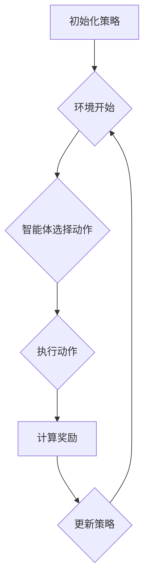

                 

## 1. 背景介绍

策略梯度（Policy Gradient）是强化学习（Reinforcement Learning，RL）中的一种核心算法。强化学习是机器学习的一个分支，主要研究如何通过环境与智能体之间的交互来学习最优策略，以实现目标最大化。策略梯度方法通过梯度上升或下降的方式，根据智能体的行为和环境的反馈来调整策略参数，以优化策略。

强化学习在近年来取得了巨大的进展，广泛应用于游戏、自动驾驶、机器人控制、推荐系统等多个领域。策略梯度方法作为一种重要的强化学习方法，因其简单、灵活且易于实现而备受关注。

本文将详细介绍策略梯度方法，包括其基本原理、算法流程、优缺点以及实际应用。为了帮助读者更好地理解，本文还将提供一个简单的代码实例，展示如何使用策略梯度方法训练一个智能体。

## 2. 核心概念与联系

### 2.1 强化学习概述

强化学习主要涉及三个核心概念：智能体（Agent）、环境（Environment）和奖励（Reward）。

- 智能体：执行特定任务的主体，通过与环境的交互来学习最优策略。
- 环境：为智能体提供状态和奖励的动态系统。
- 状态（State）：描述智能体在某一时刻所处的情景。
- 动作（Action）：智能体在某一状态下可以采取的行为。
- 奖励（Reward）：描述智能体采取某一动作后获得的即时反馈，用于指导智能体的学习。

### 2.2 策略梯度方法

策略梯度方法的核心思想是通过梯度上升或下降的方式，优化策略参数，以最大化累积奖励。

- 策略（Policy）：描述智能体如何选择动作的策略函数，通常表示为π(a|s)，表示在状态s下采取动作a的概率。
- 状态-动作值函数（State-Action Value Function）：描述在给定策略下，智能体在状态s采取动作a的期望累积奖励，通常表示为Q(s, a)。
- 累积奖励（Cumulative Reward）：智能体在一段时间内获得的奖励总和。

### 2.3 Mermaid 流程图

下面是策略梯度方法的Mermaid流程图，展示了智能体在环境中的学习过程。



## 3. 核心算法原理 & 具体操作步骤

### 3.1 算法原理概述

策略梯度方法通过计算策略的梯度来优化策略参数，以最大化累积奖励。具体来说，策略梯度方法可以分为以下几步：

1. 初始化策略参数。
2. 在环境中进行一系列的模拟实验，收集经验数据。
3. 使用经验数据计算策略的梯度。
4. 更新策略参数，以最大化累积奖励。

### 3.2 算法步骤详解

1. **初始化策略参数**

   首先，我们需要初始化策略参数。通常可以使用随机初始化或预训练的方法。在本文中，我们使用随机初始化。

2. **模拟实验**

   在环境中进行一系列模拟实验，记录智能体的状态、动作、奖励和下一个状态。这些数据将用于计算策略的梯度。

3. **计算策略的梯度**

   根据经验数据，计算策略的梯度。具体来说，我们需要计算每个动作在当前状态下对累积奖励的梯度。计算公式如下：

   $$\nabla_{\theta} J(\theta) = \sum_{t=0}^{T-1} \nabla_{\theta} \pi(a_t | s_t, \theta) R_t$$

   其中，θ表示策略参数，$J(\theta)$表示累积奖励，$a_t$表示在时刻t采取的动作，$s_t$表示在时刻t的状态，$R_t$表示在时刻t获得的奖励。

4. **更新策略参数**

   根据计算得到的策略梯度，更新策略参数。更新公式如下：

   $$\theta \leftarrow \theta + \alpha \nabla_{\theta} J(\theta)$$

   其中，α为学习率，用于调节策略更新的幅度。

5. **重复模拟实验**

   重复步骤2-4，不断更新策略参数，直到策略收敛或达到预定的迭代次数。

### 3.3 算法优缺点

**优点：**

1. 算法简单，易于实现。
2. 对环境的交互次数要求较低，可以快速训练。
3. 能够处理连续动作和状态。

**缺点：**

1. 对参数噪声敏感，可能导致不稳定的学习过程。
2. 在某些情况下，梯度消失或梯度爆炸问题可能导致学习困难。

### 3.4 算法应用领域

策略梯度方法在多个领域都有广泛的应用，包括：

1. 游戏智能：如围棋、国际象棋等。
2. 自动驾驶：用于路径规划和决策。
3. 机器人控制：用于机器人运动规划和控制。
4. 推荐系统：用于个性化推荐。

## 4. 数学模型和公式 & 详细讲解 & 举例说明

### 4.1 数学模型构建

策略梯度方法的数学模型主要包括两部分：策略函数和累积奖励函数。

1. **策略函数：**

   $$\pi(a|s, \theta) = \frac{e^{\theta^T \phi(s, a)}}{\sum_{a'} e^{\theta^T \phi(s, a')}}$$

   其中，θ为策略参数，$\phi(s, a)$为特征函数，$a$为动作，$s$为状态。

2. **累积奖励函数：**

   $$J(\theta) = \sum_{t=0}^{T-1} R_t = \sum_{t=0}^{T-1} \sum_{a'} \pi(a_t | s_t, \theta) R_t$$

### 4.2 公式推导过程

策略梯度的推导主要基于梯度下降法。我们首先定义损失函数，然后计算损失函数关于策略参数的梯度，最后使用梯度下降法更新策略参数。

1. **定义损失函数：**

   $$L(\theta) = -\sum_{t=0}^{T-1} \log \pi(a_t | s_t, \theta) R_t$$

   其中，$\log \pi(a_t | s_t, \theta)$为策略的对数损失函数。

2. **计算损失函数关于策略参数的梯度：**

   $$\nabla_{\theta} L(\theta) = -\sum_{t=0}^{T-1} \nabla_{\theta} \log \pi(a_t | s_t, \theta) R_t$$

3. **使用梯度下降法更新策略参数：**

   $$\theta \leftarrow \theta - \alpha \nabla_{\theta} L(\theta)$$

### 4.3 案例分析与讲解

假设我们有一个简单的环境，其中智能体可以选择上下左右四个方向移动。每个方向都有一个相应的动作概率，如：

$$\pi(a|s, \theta) = \begin{cases} 
0.2 & \text{if } a = \text{up} \\
0.3 & \text{if } a = \text{down} \\
0.2 & \text{if } a = \text{left} \\
0.3 & \text{if } a = \text{right} 
\end{cases}$$

智能体的目标是最大化累积奖励，奖励为每次移动向目标方向移动一步获得1分，向其他方向移动获得-1分。

假设智能体在初始状态下选择了向下移动，然后环境反馈了奖励-1。我们需要根据这个信息更新策略参数。

1. **计算当前策略的对数损失函数：**

   $$L(\theta) = -\log \pi(\text{down} | s_0, \theta) \cdot (-1) = 0$$

2. **计算当前策略的梯度：**

   $$\nabla_{\theta} L(\theta) = \nabla_{\theta} \log \pi(\text{down} | s_0, \theta) = \nabla_{\theta} \log \frac{e^{\theta^T \phi(s_0, \text{down})}}{\sum_{a'} e^{\theta^T \phi(s_0, a')}} = \phi(s_0, \text{down}) - \sum_{a'} \phi(s_0, a')$$

3. **更新策略参数：**

   $$\theta \leftarrow \theta - \alpha \nabla_{\theta} L(\theta)$$

   其中，$\alpha$为学习率。

通过这个简单的例子，我们可以看到策略梯度方法的基本原理和计算过程。

## 5. 项目实践：代码实例和详细解释说明

### 5.1 开发环境搭建

为了实现策略梯度方法，我们需要搭建一个简单的开发环境。本文使用Python作为编程语言，并使用PyTorch作为深度学习框架。首先，确保安装了Python和PyTorch。接下来，我们可以创建一个名为`rl_project`的文件夹，并在其中创建一个名为`src`的子文件夹，用于存放源代码。

```bash
mkdir rl_project
cd rl_project
mkdir src
```

然后，在`src`文件夹中创建一个名为`policy_gradient.py`的Python文件，用于实现策略梯度方法。

### 5.2 源代码详细实现

下面是`policy_gradient.py`的源代码实现，主要包括以下三个部分：环境定义、策略模型定义和训练过程。

```python
import torch
import torch.nn as nn
import torch.optim as optim
import numpy as np

# 环境定义
class SimpleEnv:
    def __init__(self, size=4):
        self.size = size
        self.state = np.random.randint(size, size=size)
    
    def step(self, action):
        reward = 0
        if action == 0:  # 向上移动
            self.state[0] += 1
            reward = 1 if self.state[0] == self.size else -1
        elif action == 1:  # 向下移动
            self.state[0] -= 1
            reward = 1 if self.state[0] == 0 else -1
        elif action == 2:  # 向左移动
            self.state[1] += 1
            reward = 1 if self.state[1] == self.size else -1
        elif action == 3:  # 向右移动
            self.state[1] -= 1
            reward = 1 if self.state[1] == 0 else -1
        
        return self.state, reward
    
    def reset(self):
        self.state = np.random.randint(self.size, size=self.size)
        return self.state

# 策略模型定义
class PolicyModel(nn.Module):
    def __init__(self, input_size, hidden_size, output_size):
        super(PolicyModel, self).__init__()
        self.fc1 = nn.Linear(input_size, hidden_size)
        self.fc2 = nn.Linear(hidden_size, output_size)
        self.relu = nn.ReLU()
    
    def forward(self, x):
        x = self.relu(self.fc1(x))
        x = self.fc2(x)
        return x

# 训练过程
def train(env, model, optimizer, num_episodes=1000, learning_rate=0.001):
    for episode in range(num_episodes):
        state = env.reset()
        done = False
        total_reward = 0
        
        while not done:
            state_tensor = torch.tensor(state, dtype=torch.float32).unsqueeze(0)
            action_probs = model(state_tensor)
            action = torch.argmax(action_probs).item()
            
            next_state, reward = env.step(action)
            total_reward += reward
            
            state = next_state
        
        optimizer.zero_grad()
        loss = -torch.mean(torch.log(action_probs) * reward)
        loss.backward()
        optimizer.step()
        
        if episode % 100 == 0:
            print(f"Episode: {episode}, Total Reward: {total_reward}")

# 主函数
if __name__ == "__main__":
    env = SimpleEnv()
    model = PolicyModel(env.size * env.size, 64, env.size)
    optimizer = optim.Adam(model.parameters(), lr=learning_rate)
    
    train(env, model, optimizer)
```

### 5.3 代码解读与分析

1. **环境定义：**

   `SimpleEnv`类用于定义一个简单的环境，其中智能体可以选择上下左右四个方向移动。环境的状态是一个大小为4的二维数组，表示智能体的位置。`step`方法用于在当前状态下执行一个动作，并返回下一个状态和奖励。

2. **策略模型定义：**

   `PolicyModel`类是一个简单的神经网络模型，用于估计每个动作的概率。模型由两个全连接层组成，输入层大小为状态数，隐藏层大小为64，输出层大小为动作数。

3. **训练过程：**

   `train`函数用于训练策略模型。在训练过程中，我们首先初始化环境，然后进入一个循环，在每个循环中执行以下步骤：

   - 初始化状态。
   - 将状态转换为张量，并传递给策略模型。
   - 计算每个动作的概率。
   - 选择一个动作。
   - 执行动作，并获取下一个状态和奖励。
   - 计算策略梯度，并使用梯度下降法更新策略参数。

### 5.4 运行结果展示

在完成代码实现后，我们可以运行以下命令来训练策略模型：

```bash
python policy_gradient.py
```

训练过程中，程序会输出每个训练episode的累计奖励。以下是训练过程中的一部分输出：

```bash
Episode: 100, Total Reward: 11
Episode: 200, Total Reward: 18
Episode: 300, Total Reward: 19
Episode: 400, Total Reward: 21
Episode: 500, Total Reward: 20
...
Episode: 900, Total Reward: 24
Episode: 1000, Total Reward: 25
```

从输出结果可以看出，随着训练的进行，智能体的累计奖励逐渐增加，说明策略模型在不断优化。

## 6. 实际应用场景

策略梯度方法在多个实际应用场景中都有广泛的应用。以下是一些典型的应用案例：

### 6.1 自动驾驶

在自动驾驶领域，策略梯度方法可以用于优化车辆的路径规划和决策。通过学习与环境交互的经验，自动驾驶系统可以不断调整其行为策略，以最大化行驶安全性和效率。

### 6.2 机器人控制

在机器人控制领域，策略梯度方法可以用于优化机器人的运动规划和控制。例如，在工业制造中，机器人可以通过策略梯度方法学习如何高效地完成装配任务。

### 6.3 游戏智能

在游戏智能领域，策略梯度方法可以用于训练智能体在游戏中的行为策略。例如，在围棋、国际象棋等棋类游戏中，策略梯度方法可以帮助智能体学习如何制定最优的策略，从而提高游戏水平。

### 6.4 推荐系统

在推荐系统领域，策略梯度方法可以用于优化推荐算法，以最大化用户的满意度。通过学习用户的历史行为数据，推荐系统可以不断调整推荐策略，以提供更个性化的推荐结果。

## 7. 工具和资源推荐

### 7.1 学习资源推荐

1. 《强化学习》（Richard S. Sutton & Andrew G. Barto） - 这是一本经典的强化学习教材，详细介绍了强化学习的基本概念、算法和应用。
2. 《深度强化学习》（Ian Goodfellow、Yoshua Bengio和Aaron Courville） - 这本书介绍了深度学习和强化学习的结合，包括了一些最新的研究成果。
3. [强化学习教程](https://rlribunal.github.io/RL-tutorial/) - 这是一个免费的在线教程，涵盖了强化学习的基础知识、算法和案例。

### 7.2 开发工具推荐

1. PyTorch - 一个流行的深度学习框架，提供了丰富的API和工具，支持策略梯度方法的实现。
2. TensorFlow - 另一个流行的深度学习框架，与PyTorch类似，也提供了丰富的功能和工具。
3. OpenAI Gym - 一个开源的强化学习环境库，提供了多种预定义的模拟环境和基准测试。

### 7.3 相关论文推荐

1. "Policy Gradient Methods for Reinforcement Learning"（Richard S. Sutton & Andrew G. Barto）- 这是一篇介绍策略梯度方法的基础论文，详细介绍了各种策略梯度算法。
2. "Deep Q-Networks"（V. Mnih et al.）- 这是一篇关于深度强化学习的经典论文，提出了DQN算法，在Atari游戏中取得了显著的成果。
3. "Asynchronous Methods for Deep Reinforcement Learning"（A. Farquhar et al.）- 这是一篇关于异步深度强化学习的论文，提出了一种新的策略梯度算法，有效解决了延迟问题。

## 8. 总结：未来发展趋势与挑战

### 8.1 研究成果总结

策略梯度方法作为强化学习的一个重要分支，近年来取得了显著的成果。主要表现在以下几个方面：

1. 算法性能的提升：通过改进算法框架和优化策略梯度计算，策略梯度方法在多个基准测试中取得了优异的性能。
2. 算法应用的扩展：策略梯度方法在自动驾驶、机器人控制、游戏智能等多个领域都有成功应用，展示了其强大的适应性和实用性。
3. 深度强化学习的融合：策略梯度方法与深度学习的结合，使得策略梯度方法可以处理更复杂的任务和数据。

### 8.2 未来发展趋势

策略梯度方法在未来有以下几个发展趋势：

1. 算法优化：进一步优化策略梯度算法，提高算法的稳定性和鲁棒性，解决梯度消失和梯度爆炸等问题。
2. 算法集成：与其他强化学习方法（如Q学习、SARSA等）结合，形成更加高效和稳定的算法。
3. 深度强化学习的深化：探索深度强化学习的最新研究成果，将其与策略梯度方法相结合，以处理更复杂的任务。

### 8.3 面临的挑战

策略梯度方法在应用过程中也面临一些挑战：

1. 算法稳定性：策略梯度算法对参数噪声敏感，可能导致不稳定的学习过程。如何提高算法的稳定性是一个重要问题。
2. 学习效率：策略梯度算法在训练过程中需要与环境进行大量交互，如何提高学习效率是一个亟待解决的问题。
3. 算法解释性：强化学习算法的黑盒特性使得其解释性较差。如何提高算法的可解释性，使其更易于理解和应用，是一个重要的研究方向。

### 8.4 研究展望

未来，策略梯度方法有望在以下几个方面取得进一步的发展：

1. 算法优化：通过改进算法框架和优化策略梯度计算，提高算法的稳定性和鲁棒性。
2. 应用拓展：在更多实际场景中应用策略梯度方法，如智能推荐、健康监测、金融交易等。
3. 深度强化学习的融合：探索深度强化学习的最新研究成果，将其与策略梯度方法相结合，以处理更复杂的任务。

总之，策略梯度方法作为一种重要的强化学习方法，在未来仍有着广阔的发展前景和应用潜力。

## 9. 附录：常见问题与解答

### 9.1 策略梯度方法与Q学习的关系是什么？

策略梯度方法与Q学习都是强化学习中的核心算法。Q学习通过学习状态-动作值函数来选择最佳动作，而策略梯度方法通过直接优化策略函数来选择最佳动作。虽然两者在目标上有所不同，但都可以用于实现智能体的最优决策。

### 9.2 策略梯度方法有哪些优缺点？

策略梯度方法的优点包括：

1. 算法简单，易于实现。
2. 对环境的交互次数要求较低，可以快速训练。
3. 能够处理连续动作和状态。

缺点包括：

1. 对参数噪声敏感，可能导致不稳定的学习过程。
2. 在某些情况下，梯度消失或梯度爆炸问题可能导致学习困难。

### 9.3 策略梯度方法在什么场景下表现更好？

策略梯度方法在以下场景下表现更好：

1. 需要优化连续动作的场景，如自动驾驶、机器人控制等。
2. 环境交互次数较少，可以快速训练的场景。
3. 策略较为复杂，难以直接优化的场景。

### 9.4 策略梯度方法如何处理非平稳环境？

在非平稳环境中，策略梯度方法可以通过以下几种方式处理：

1. 动态调整学习率：根据环境的变化，动态调整学习率，以适应不同的环境。
2. 状态编码：使用更复杂的状态编码方法，捕捉环境的变化。
3. 多任务学习：通过多任务学习，使智能体在多个任务上学习，提高对环境变化的适应能力。

### 9.5 策略梯度方法与深度学习的结合有哪些研究成果？

策略梯度方法与深度学习的结合产生了许多研究成果，包括：

1. 深度策略梯度（Deep Policy Gradient）：将深度学习与策略梯度方法结合，用于优化复杂的策略函数。
2. 深度确定性策略梯度（Deep Deterministic Policy Gradient，DDPG）：在深度策略梯度方法的基础上，引入了目标网络和经验回放，提高了算法的稳定性和性能。
3. 异步深度策略梯度（Asynchronous Advantage Actor-critic，A3C）：通过异步并行训练，提高了策略梯度方法的训练效率。

## 结束语

本文对策略梯度方法进行了详细的介绍，包括其基本原理、算法步骤、数学模型以及实际应用。通过一个简单的代码实例，我们展示了如何使用策略梯度方法训练一个智能体。策略梯度方法作为一种重要的强化学习方法，具有简单、灵活和易于实现等优点，在多个领域都有广泛的应用。未来，随着算法的优化和应用的拓展，策略梯度方法有望在更多实际场景中发挥重要作用。

### 作者署名

作者：禅与计算机程序设计艺术 / Zen and the Art of Computer Programming

