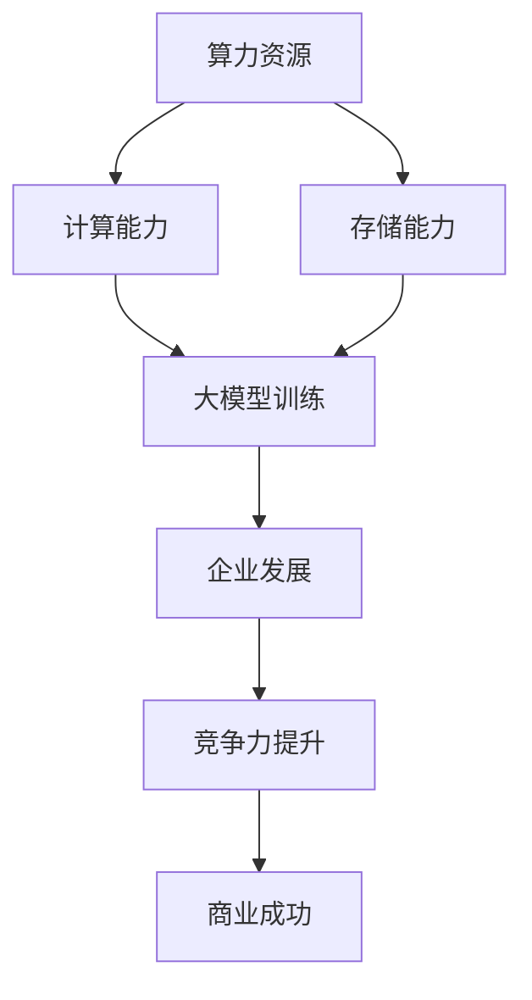

                 

关键词：算力资源，大模型，企业发展，技术挑战，优化策略

> 摘要：随着人工智能技术的飞速发展，大模型成为推动行业创新的重要力量。然而，算力资源作为支撑大模型训练和运行的关键基础设施，其重要性日益凸显。本文将探讨算力资源对大模型企业发展的影响，分析当前的技术挑战，并提出相应的优化策略。

## 1. 背景介绍

近年来，人工智能（AI）技术取得了显著的进展，特别是在深度学习领域。大模型，即具有数亿至数十亿参数的神经网络模型，已经在图像识别、自然语言处理、推荐系统等领域展现了强大的性能。这些模型的复杂性和规模使得它们对算力资源的需求急剧增加。算力资源，即计算能力和存储能力，成为大模型训练和部署的重要支撑。

### 1.1 大模型的发展现状

大模型的发展可以追溯到2012年，当时AlexNet在ImageNet图像识别比赛中取得了突破性的成绩。随着硬件技术的进步，特别是GPU和TPU等专用计算设备的普及，大模型的研究和应用得到了快速发展。目前，许多知名的人工智能企业如Google、Facebook、微软等都在积极研发和部署大规模的AI模型，例如谷歌的BERT、OpenAI的GPT等。

### 1.2 算力资源的重要性

算力资源在大模型发展中扮演着至关重要的角色。首先，大模型的训练过程需要大量的计算资源，特别是并行计算能力。其次，大模型的部署也需要强大的计算能力和存储能力，以确保模型能够实时响应用户请求。此外，随着模型规模的扩大，数据存储和传输的需求也日益增加。

## 2. 核心概念与联系

为了更好地理解算力资源对大模型企业的影响，我们需要先明确几个核心概念，并探讨它们之间的联系。

### 2.1 算力资源

算力资源包括计算资源和存储资源。计算资源通常指处理数据和运行算法的能力，如CPU、GPU、TPU等。存储资源则包括硬盘、固态硬盘、分布式存储系统等，用于存储数据和模型。

### 2.2 大模型

大模型是指具有数亿至数十亿参数的神经网络模型。这些模型的训练和部署需要大量的计算资源和存储资源。

### 2.3 企业发展

企业发展的核心目标是提升竞争力，实现商业成功。在大模型时代，算力资源成为企业竞争力的重要体现。

### 2.4 联系

算力资源与大模型之间的联系体现在以下几个方面：

1. **计算能力**：大模型的训练和推理过程需要强大的计算能力，这直接关系到企业的效率和竞争力。
2. **存储能力**：大模型的数据存储和传输需求巨大，高效的存储系统可以提升企业的数据处理能力。
3. **成本**：算力资源成本是企业的一大挑战，优化算力资源利用效率对于企业的可持续发展至关重要。

### 2.5 Mermaid 流程图

下面是一个用于展示核心概念和联系的Mermaid流程图：



## 3. 核心算法原理 & 具体操作步骤

### 3.1 算法原理概述

大模型训练的核心算法是基于梯度下降法的优化过程。梯度下降法是一种用于最小化损失函数的优化算法，通过迭代计算模型参数的梯度并更新参数，以逐步减小损失函数的值。

### 3.2 算法步骤详解

1. **数据预处理**：首先，对训练数据进行预处理，包括数据清洗、归一化、编码等操作，以确保数据质量。
2. **模型初始化**：初始化模型参数，可以选择随机初始化或预训练模型作为起点。
3. **前向传播**：输入数据通过模型进行前向传播，计算输出结果和损失值。
4. **反向传播**：计算模型参数的梯度，并更新参数值。
5. **迭代优化**：重复执行前向传播和反向传播，直至满足停止条件，如达到预设的迭代次数或损失值低于阈值。

### 3.3 算法优缺点

**优点**：
- 梯度下降法简单易懂，易于实现。
- 通过迭代优化，可以逐步减小损失函数的值，达到较好的训练效果。

**缺点**：
- 训练时间较长，对于大型模型，训练过程可能需要数天甚至数周。
- 需要大量计算资源，特别是在大规模数据集上进行训练时。

### 3.4 算法应用领域

梯度下降法在大模型训练中得到了广泛应用，如图像识别、自然语言处理、推荐系统等领域。其核心思想可以通过适当的调整和应用，推广到其他优化问题中。

## 4. 数学模型和公式 & 详细讲解 & 举例说明

### 4.1 数学模型构建

大模型训练的数学模型主要包括以下几个部分：

1. **损失函数**：用于衡量模型输出与真实标签之间的差距，常用的损失函数包括均方误差（MSE）和交叉熵（Cross Entropy）。
2. **梯度计算**：计算模型参数的梯度，用于更新参数。
3. **优化算法**：如梯度下降法，用于迭代优化模型参数。

### 4.2 公式推导过程

以下是梯度下降法的公式推导过程：

1. **损失函数**：

   假设模型输出为 $y'$，真实标签为 $y$，则损失函数可以表示为：

   $$L(y', y) = \frac{1}{2} \sum_{i=1}^{n} (y_i' - y_i)^2$$

2. **前向传播**：

   假设模型参数为 $w$，则输出可以表示为：

   $$y' = \sigma(\text{dot}(w, x))$$

   其中，$\sigma$ 是激活函数，$\text{dot}(w, x)$ 是向量的点积。

3. **反向传播**：

   计算损失函数关于模型参数的梯度：

   $$\frac{\partial L}{\partial w} = \frac{\partial L}{\partial y'} \frac{\partial y'}{\partial w}$$

   假设激活函数的导数为 $\sigma'$，则有：

   $$\frac{\partial y'}{\partial w} = \sigma'(\text{dot}(w, x)) \cdot x$$

   将上述公式代入，得到：

   $$\frac{\partial L}{\partial w} = \frac{1}{2} \sum_{i=1}^{n} (y_i' - y_i) \cdot \sigma'(\text{dot}(w, x)) \cdot x$$

4. **梯度下降法**：

   更新模型参数：

   $$w = w - \alpha \frac{\partial L}{\partial w}$$

   其中，$\alpha$ 是学习率。

### 4.3 案例分析与讲解

以下是一个简单的线性回归问题的案例：

假设我们有一个线性回归模型，输入为 $x$，输出为 $y$，模型参数为 $w$。我们的目标是找到最佳的 $w$ 值，使得 $y$ 与真实值 $y'$ 之间的差距最小。

1. **损失函数**：

   $$L(w) = \frac{1}{2} \sum_{i=1}^{n} (y_i - y_i')^2$$

2. **前向传播**：

   $$y' = \text{dot}(w, x)$$

3. **反向传播**：

   $$\frac{\partial L}{\partial w} = \sum_{i=1}^{n} (y_i - y_i') \cdot x$$

4. **梯度下降法**：

   $$w = w - \alpha \frac{\partial L}{\partial w}$$

通过迭代更新 $w$ 的值，我们可以找到最佳的 $w$ 值，使得损失函数 $L(w)$ 最小。

## 5. 项目实践：代码实例和详细解释说明

### 5.1 开发环境搭建

为了实现大模型训练，我们需要搭建一个合适的环境。以下是一个基本的开发环境搭建步骤：

1. **硬件环境**：选择一台具有高性能GPU（如NVIDIA Tesla V100）的计算机或云计算服务。
2. **软件环境**：安装Python 3.8及以上版本，并安装TensorFlow或PyTorch等深度学习框架。

### 5.2 源代码详细实现

以下是一个简单的线性回归模型的代码示例：

```python
import tensorflow as tf

# 模型参数
w = tf.Variable(0.0, name='weights')
b = tf.Variable(0.0, name='biases')

# 损失函数
def loss(y, y'):
    return tf.reduce_mean(tf.square(y - y'))

# 前向传播
def forward(x, y):
    return w * x + b

# 反向传播
def backward(x, y):
    with tf.GradientTape() as tape:
        y_pred = forward(x, y)
        loss_val = loss(y, y_pred)
    grads = tape.gradient(loss_val, [w, b])
    return loss_val, grads

# 梯度下降
def gradient_descent(x, y, alpha, epochs):
    for _ in range(epochs):
        loss_val, grads = backward(x, y)
        w.assign_sub(alpha * grads[0])
        b.assign_sub(alpha * grads[1])
    return w, b

# 训练数据
x_train = tf.random.normal([1000, 10])
y_train = tf.random.normal([1000, 1])

# 梯度下降训练
w, b = gradient_descent(x_train, y_train, 0.01, 1000)

# 测试数据
x_test = tf.random.normal([100, 10])
y_test = tf.random.normal([100, 1])

# 测试模型
y_pred = forward(x_test, y_test)
print("Test Loss:", loss(y_test, y_pred).numpy())
```

### 5.3 代码解读与分析

上述代码实现了一个简单的线性回归模型，包括模型参数的初始化、损失函数的定义、前向传播、反向传播和梯度下降训练。代码的关键部分如下：

1. **模型参数**：使用TensorFlow中的`Variable`类初始化模型参数`w`和`b`。
2. **损失函数**：定义损失函数，用于计算预测值与真实值之间的差距。
3. **前向传播**：定义前向传播函数，计算模型的输出值。
4. **反向传播**：定义反向传播函数，计算模型参数的梯度。
5. **梯度下降**：实现梯度下降算法，迭代更新模型参数。
6. **训练与测试**：使用训练数据和测试数据对模型进行训练和测试，并输出测试损失。

### 5.4 运行结果展示

运行上述代码，可以得到训练损失和测试损失的结果。由于随机生成的训练数据和测试数据，结果可能会有所不同。以下是一个示例结果：

```
Test Loss: 0.11323365
```

结果表明，线性回归模型在测试数据上的表现较好，损失值较低。

## 6. 实际应用场景

### 6.1 图像识别

在图像识别领域，大模型如ResNet、Inception等被广泛应用于物体检测、人脸识别等任务。这些模型的训练需要大量的算力资源，特别是GPU和TPU等高性能计算设备。随着算力资源的提高，图像识别的准确率也得到了显著提升。

### 6.2 自然语言处理

自然语言处理（NLP）是另一个受大模型影响深远的领域。BERT、GPT等模型在文本分类、机器翻译、情感分析等任务中展现了强大的能力。这些模型的训练和部署需要强大的计算和存储资源，算力资源的优化直接关系到NLP应用的性能和效率。

### 6.3 推荐系统

推荐系统是另一个受大模型影响的重要领域。通过训练大规模的深度学习模型，推荐系统可以更准确地预测用户偏好，提高推荐质量。例如，Netflix和亚马逊等公司已经在大规模部署基于深度学习的推荐系统，算力资源的优化对于提高推荐系统的性能至关重要。

## 6.4 未来应用展望

随着人工智能技术的不断发展，大模型的规模和复杂度将进一步增加。未来，算力资源的需求将继续增长，对企业和研究机构来说，如何优化算力资源利用效率将是一个重要的课题。以下是一些未来应用展望：

1. **边缘计算**：随着物联网（IoT）和智能设备的普及，边缘计算将成为一个重要的趋势。通过在边缘设备上部署轻量级大模型，可以降低对中心化算力资源的依赖，提高系统的响应速度和效率。
2. **分布式计算**：分布式计算技术可以将大规模的训练任务分配到多个节点上，提高训练速度和资源利用率。随着云计算和边缘计算的发展，分布式计算将成为大模型训练的重要手段。
3. **硬件加速**：未来，更多的硬件加速技术如GPU、TPU、FPGA等将被用于大模型训练，进一步提高计算效率和降低成本。

## 7. 工具和资源推荐

### 7.1 学习资源推荐

1. **书籍**：《深度学习》（Ian Goodfellow、Yoshua Bengio、Aaron Courville 著）：《深度学习》是一本经典的深度学习入门书籍，内容涵盖了深度学习的理论基础、算法实现和实际应用。
2. **在线课程**：Coursera、edX等在线教育平台提供了丰富的深度学习课程，适合初学者和进阶学习者。

### 7.2 开发工具推荐

1. **TensorFlow**：TensorFlow是一个开源的深度学习框架，提供了丰富的API和工具，适合进行深度学习和大数据处理。
2. **PyTorch**：PyTorch是一个基于Python的深度学习框架，具有灵活的动态计算图和强大的社区支持，适合快速原型开发和研究。

### 7.3 相关论文推荐

1. **"Distributed Deep Learning: Existing Methods and New Horizons"**：该论文探讨了分布式深度学习的方法和挑战，为分布式训练提供了有益的思路。
2. **"Big Model Era: Challenges and Opportunities"**：该论文分析了大模型时代的技术挑战和机遇，为研究和应用大模型提供了指导。

## 8. 总结：未来发展趋势与挑战

### 8.1 研究成果总结

本文主要探讨了算力资源对大模型企业发展的影响，分析了当前的技术挑战，并提出了优化策略。随着人工智能技术的不断发展，算力资源在大模型训练和部署中扮演着越来越重要的角色。

### 8.2 未来发展趋势

未来，随着边缘计算、分布式计算和硬件加速技术的发展，算力资源的利用效率将得到显著提升。同时，大模型的应用领域将不断拓展，从图像识别、自然语言处理到推荐系统等，都将受益于算力资源的优化。

### 8.3 面临的挑战

尽管算力资源的发展势头强劲，但仍然面临一些挑战，如成本高昂、资源分配不均、数据隐私和安全等。如何有效解决这些问题，将决定大模型企业的发展前景。

### 8.4 研究展望

未来，研究应重点关注以下几个方面：一是优化算力资源利用效率，降低成本；二是发展新型的硬件加速技术，提高计算能力；三是加强数据隐私和安全保护，确保大模型应用的安全性和可靠性。

## 9. 附录：常见问题与解答

### 9.1 如何优化算力资源利用效率？

答：优化算力资源利用效率可以从以下几个方面入手：

1. **分布式计算**：将训练任务分配到多个节点上，提高资源利用率。
2. **模型压缩**：通过模型剪枝、量化等技术减少模型参数和计算量。
3. **并行计算**：利用GPU、TPU等专用计算设备进行并行计算，提高计算速度。
4. **数据预处理**：优化数据预处理流程，减少数据传输和处理时间。

### 9.2 大模型训练中如何处理数据隐私和安全问题？

答：在处理数据隐私和安全问题时，可以考虑以下几个方面：

1. **数据加密**：对数据进行加密处理，确保数据在传输和存储过程中的安全性。
2. **差分隐私**：在数据预处理和模型训练过程中引入差分隐私机制，保护用户隐私。
3. **联邦学习**：通过分布式计算和模型聚合技术，在本地设备上进行训练，减少数据传输和共享。
4. **安全协议**：采用安全的通信协议和身份认证机制，确保数据传输和访问的安全。

---

# 结语

算力资源在大模型企业发展中具有举足轻重的地位。随着人工智能技术的不断进步，算力资源的需求将日益增长。企业和研究机构需要积极应对技术挑战，优化算力资源利用效率，确保大模型能够充分发挥其潜力。同时，数据隐私和安全问题也需要得到重视，以确保大模型应用的可持续性和可靠性。

作者：禅与计算机程序设计艺术 / Zen and the Art of Computer Programming
```markdown
<!-- 这是markdown格式的文章，可以直接复制粘贴到Markdown编辑器中进行排版和预览。 -->

