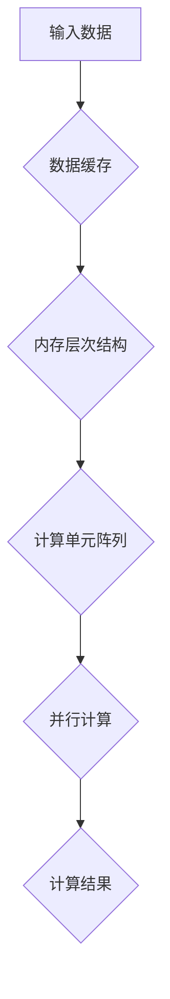

                 

### 1. 背景介绍

随着科技的飞速发展，计算能力成为推动各行各业进步的关键因素。从早期简单的计算机到如今强大的超级计算机，计算能力的提升为人类带来了前所未有的便利和变革。然而，计算需求的增长速度远远超过了硬件性能的提升速度，这引发了所谓的“算力革命”。

算力革命是指通过创新的技术和架构设计，大幅度提高计算能力，以满足不断增长的计算需求。这一革命的核心目标是降低计算成本、提高计算效率和能效，同时拓展计算应用的领域。

在这个革命中，NVIDIA作为全球领先的计算技术和图形处理器（GPU）制造商，扮演了至关重要的角色。NVIDIA的GPU技术不仅在游戏领域取得了巨大成功，而且在科学计算、大数据处理、人工智能等领域也展现了强大的潜力。

NVIDIA的GPU拥有极高的并行处理能力，这种能力来自于其独特的架构设计。GPU的并行架构能够同时处理大量独立的计算任务，这使其在处理复杂计算任务时比传统的中央处理器（CPU）更加高效。此外，NVIDIA不断推陈出新，通过技术创新持续提升GPU的性能，使其能够适应不断变化的计算需求。

在算力革命的大背景下，NVIDIA的角色不仅限于提供高性能的计算硬件，还在于推动计算技术的创新和应用。通过持续的研发投入，NVIDIA在深度学习、数据科学、高性能计算等领域取得了显著的成果，为全球的计算产业带来了深远的影响。

本文将深入探讨算力革命的概念、NVIDIA在其中的角色及其对未来的影响。我们将从NVIDIA的技术创新、核心算法原理、实际应用案例等方面进行详细分析，并探讨NVIDIA在未来算力革命中的发展前景和面临的挑战。

## 2. 核心概念与联系

### 2.1 计算能力与算力革命

计算能力是指计算机在特定时间内完成计算任务的能力。计算能力的提升主要通过硬件性能的提升和软件算法的优化来实现。然而，传统的计算机架构在处理复杂计算任务时逐渐暴露出其局限性，这促使了算力革命的到来。

算力革命旨在通过创新的技术和架构设计，大幅度提高计算能力，以应对日益增长的计算需求。具体来说，算力革命包括以下几个方面：

- **硬件创新**：研发更高效、更节能的处理器架构，如GPU、FPGA、TPU等。
- **软件优化**：开发高效的算法和编程模型，如并行计算、分布式计算等。
- **系统集成**：通过硬件和软件的协同优化，构建高性能的计算系统。

NVIDIA在这一革命中发挥了关键作用。其GPU架构的独特设计使其在处理并行计算任务时具有显著优势。GPU的并行架构能够同时处理大量独立的计算任务，这使得NVIDIA的GPU在科学计算、大数据处理和人工智能等领域表现出色。

### 2.2 GPU架构与技术创新

GPU（Graphics Processing Unit，图形处理器）最初是为图形渲染而设计的，但其强大的并行处理能力使其在计算任务中逐渐崭露头角。NVIDIA的GPU架构具有以下几个显著特点：

- **大规模并行处理**：GPU包含成千上万的计算单元，能够同时执行多个计算任务，这使得GPU在处理大规模并行任务时效率极高。
- **内存层次结构**：GPU具有多个层次的内存系统，包括寄存器、共享内存和全局内存，这些内存层次结构优化了数据访问速度和带宽。
- **灵活的编程模型**：NVIDIA提供了CUDA（Compute Unified Device Architecture）等编程模型，使开发者能够充分利用GPU的并行处理能力。

NVIDIA在GPU技术创新方面不断推陈出新，例如：

- **Tensor Core**：NVIDIA的Tensor Core专门用于加速深度学习任务的计算，其设计使得深度学习算法在GPU上的执行速度大幅提升。
- **光量子处理器**：NVIDIA宣布研发光量子处理器，旨在通过量子计算技术进一步推动计算能力的提升。

这些技术创新不仅提升了GPU的性能，也为算力革命注入了新的动力。

### 2.3 算力革命的应用领域

算力革命的应用领域非常广泛，涵盖了科学计算、大数据处理、人工智能等多个方面。以下是一些关键应用领域：

- **科学计算**：在气象预报、基因组测序、物理模拟等领域，高性能计算的需求日益增长。GPU的并行计算能力使其在这些领域大放异彩。
- **大数据处理**：随着数据量的激增，大数据处理变得愈发重要。GPU的高吞吐量和低延迟使其成为处理大规模数据集的理想选择。
- **人工智能**：深度学习是人工智能的核心技术之一，GPU的并行计算能力使其在训练和推断深度学习模型时具有显著优势。

### 2.4 NVIDIA的角色

在算力革命中，NVIDIA扮演了多重角色：

- **技术创新者**：NVIDIA不断推出具有创新性的GPU架构和技术，推动计算能力的提升。
- **生态系统构建者**：NVIDIA通过建立广泛的生态系统，包括硬件制造商、软件开发者和科研机构，共同推动算力革命的发展。
- **应用推广者**：NVIDIA积极推广GPU技术在各个领域的应用，为各行各业提供高性能计算解决方案。

### 2.5 关联的Mermaid流程图

为了更直观地展示GPU架构的并行处理能力，我们可以使用Mermaid流程图来描述。以下是一个简化的GPU处理流程图：



在这个流程图中，输入数据经过数据缓存和内存层次结构处理后，被分配到计算单元阵列中进行并行计算，最终生成计算结果。这种并行处理流程使得GPU能够在处理大规模计算任务时显著提高效率。

通过上述核心概念和联系的分析，我们可以看到算力革命的重要性以及NVIDIA在其中所扮演的关键角色。接下来，我们将进一步探讨NVIDIA的核心算法原理及其具体应用。

## 3. 核心算法原理 & 具体操作步骤

### 3.1 算法原理概述

NVIDIA在GPU领域不断创新，其核心算法原理主要包括以下几个方面：

- **并行计算**：GPU的核心优势在于其大规模并行计算能力。通过将任务分解为多个较小的子任务，GPU可以同时处理这些子任务，从而大幅提高计算效率。
- **内存层次结构**：GPU具有多个内存层次结构，包括寄存器、共享内存和全局内存。这些内存层次结构优化了数据访问速度和带宽，使得数据在GPU上的处理更加高效。
- **计算单元阵列**：GPU包含成千上万的计算单元，这些计算单元能够同时执行多个计算任务，形成强大的并行处理能力。
- **流多处理器（SM）**：GPU中的流多处理器（SM）是并行计算的基本单元，每个SM包含多个核心，能够同时处理多个线程。

### 3.2 算法步骤详解

以下是NVIDIA GPU的核心算法步骤详解：

#### 步骤1：任务分解
首先，将需要处理的任务分解为多个较小的子任务。这些子任务可以并行执行，以充分利用GPU的并行处理能力。

#### 步骤2：数据加载
将分解后的子任务数据加载到GPU的内存层次结构中。这一步骤包括将数据从系统内存传输到共享内存或全局内存。

#### 步骤3：线程调度
GPU的调度器根据线程的执行顺序和资源需求，将线程分配到不同的计算单元。每个计算单元负责处理特定的线程。

#### 步骤4：并行计算
计算单元开始执行并行计算，同时处理多个线程。GPU的并行计算能力使其能够在极短时间内完成大量的计算任务。

#### 步骤5：数据同步
在某些情况下，需要确保多个计算单元的结果能够正确同步。GPU提供了一系列同步机制，如内存屏障和原子操作，以确保数据的一致性。

#### 步骤6：数据存储
计算结果从GPU的内存层次结构传输回系统内存。这一步骤包括将数据从全局内存或共享内存传输回系统内存。

#### 步骤7：结果处理
最终的计算结果被传输到主机处理器，以便进行进一步的处理或存储。

### 3.3 算法优缺点

#### 优点：

1. **并行计算能力**：GPU具有强大的并行计算能力，能够同时处理多个线程，从而大幅提高计算效率。
2. **内存层次结构**：GPU的内存层次结构优化了数据访问速度和带宽，使得数据在GPU上的处理更加高效。
3. **计算单元阵列**：GPU包含大量的计算单元，能够同时处理多个计算任务，形成强大的并行处理能力。
4. **灵活的编程模型**：NVIDIA提供了CUDA等编程模型，使开发者能够充分利用GPU的并行处理能力。

#### 缺点：

1. **计算精度受限**：由于GPU的浮点运算能力相对较低，某些科学计算任务可能需要使用CPU或其他类型的处理器。
2. **编程复杂度**：GPU编程比CPU编程复杂，开发者需要熟悉GPU的并行架构和编程模型。

### 3.4 算法应用领域

NVIDIA的GPU核心算法在多个领域得到了广泛应用，包括：

- **科学计算**：如气象预报、物理模拟、基因组测序等。
- **大数据处理**：如数据挖掘、数据分析、机器学习等。
- **人工智能**：如深度学习、计算机视觉、自然语言处理等。

### 3.5 具体案例

以下是一个使用NVIDIA GPU进行科学计算的案例：

**案例背景**：某科研团队需要模拟星系碰撞的过程，以研究星系演化的规律。

**算法步骤**：

1. **任务分解**：将星系碰撞的模拟任务分解为多个较小的子任务，如计算每个星体的运动轨迹、碰撞效果等。
2. **数据加载**：将子任务数据加载到GPU的内存层次结构中，如将星体的位置、速度等信息存储在全局内存中。
3. **线程调度**：GPU的调度器将线程分配到不同的计算单元，如将计算星体运动轨迹的线程分配到计算单元A，计算碰撞效果的线程分配到计算单元B。
4. **并行计算**：计算单元A和计算单元B同时执行计算，生成星体的运动轨迹和碰撞效果。
5. **数据同步**：确保计算结果能够正确同步，如使用内存屏障确保星体运动轨迹的计算结果能够被碰撞效果的计算所使用。
6. **数据存储**：将计算结果从GPU的内存层次结构传输回系统内存，如将星体的运动轨迹和碰撞效果存储在系统内存中。
7. **结果处理**：将最终的计算结果传输到主机处理器，以便进行进一步的分析和可视化。

通过上述算法步骤，科研团队能够在短时间内完成复杂的星系碰撞模拟，为研究星系演化提供重要数据支持。

### 3.6 结论

NVIDIA的GPU核心算法通过并行计算、内存层次结构、计算单元阵列等技术创新，大幅提高了计算能力。在科学计算、大数据处理和人工智能等领域，NVIDIA的GPU算法表现出了强大的优势。然而，GPU编程的复杂度也是需要解决的问题。通过不断的优化和改进，NVIDIA的GPU算法将在未来的算力革命中发挥更加重要的作用。

## 4. 数学模型和公式 & 详细讲解 & 举例说明

### 4.1 数学模型构建

在深入探讨NVIDIA GPU算法的具体数学模型之前，我们需要理解一些基础的数学概念和符号。以下是构建数学模型所需的基本概念：

- **向量**：用于表示空间中的点或方向。
- **矩阵**：由一系列数字组成的二维数组。
- **张量**：扩展了矩阵的概念，可以表示多维数据。
- **点积**：两个向量之间的乘积，结果是一个标量。
- **叉积**：两个向量之间的乘积，结果是一个新的向量。
- **矩阵乘法**：两个矩阵之间的乘积，结果是一个新的矩阵。

### 4.2 公式推导过程

为了更直观地理解GPU算法的数学模型，我们将以一个简单的矩阵乘法为例进行推导。

#### 基础公式

矩阵乘法的基本公式为：

$$C_{ij} = \sum_{k=1}^{n} A_{ik}B_{kj}$$

其中，\(A\) 和 \(B\) 是两个矩阵，\(C\) 是它们的乘积。\(C_{ij}\) 表示矩阵 \(C\) 的第 \(i\) 行第 \(j\) 列的元素。

#### GPU并行矩阵乘法

在GPU上进行矩阵乘法时，我们可以利用其并行计算能力来提高计算效率。以下是利用GPU进行并行矩阵乘法的推导过程：

1. **任务分解**：将矩阵 \(A\) 和 \(B\) 的计算任务分解为多个较小的子任务。例如，将 \(A\) 分解为多个 \(n \times n\) 的子矩阵，将 \(B\) 分解为多个 \(n \times n\) 的子矩阵。
2. **线程分配**：为每个子任务分配一个线程。线程的执行顺序可以根据矩阵的行和列进行调度。
3. **并行计算**：每个线程计算子矩阵的乘积，并将结果累加到相应的位置。

以下是一个简化的并行矩阵乘法公式：

$$C_{ij} = \sum_{k=1}^{n} T_{ik}^*T_{kj}$$

其中，\(T_{ik}^*\) 表示线程 \(k\) 对应的子矩阵 \(A\) 的第 \(i\) 行元素，\(T_{kj}^*\) 表示线程 \(k\) 对应的子矩阵 \(B\) 的第 \(j\) 列元素。

#### 细化计算过程

假设我们有以下矩阵：

$$A = \begin{bmatrix} a_{11} & a_{12} & \cdots & a_{1n} \\ a_{21} & a_{22} & \cdots & a_{2n} \\ \vdots & \vdots & \ddots & \vdots \\ a_{m1} & a_{m2} & \cdots & a_{mn} \end{bmatrix}, B = \begin{bmatrix} b_{11} & b_{12} & \cdots & b_{1n} \\ b_{21} & b_{22} & \cdots & b_{2n} \\ \vdots & \vdots & \ddots & \vdots \\ b_{m1} & b_{m2} & \cdots & b_{mn} \end{bmatrix}$$

我们将 \(A\) 和 \(B\) 分解为多个 \(n \times n\) 的子矩阵，例如：

$$A_1 = \begin{bmatrix} a_{11} & a_{12} \\ a_{21} & a_{22} \end{bmatrix}, A_2 = \begin{bmatrix} a_{31} & a_{32} \\ a_{41} & a_{42} \end{bmatrix}, \ldots, A_n = \begin{bmatrix} a_{n1} & a_{n2} \\ a_{n1} & a_{n2} \end{bmatrix}$$

$$B_1 = \begin{bmatrix} b_{11} & b_{12} \\ b_{21} & b_{22} \end{bmatrix}, B_2 = \begin{bmatrix} b_{31} & b_{32} \\ b_{41} & b_{42} \end{bmatrix}, \ldots, B_n = \begin{bmatrix} b_{n1} & b_{n2} \\ b_{n1} & b_{n2} \end{bmatrix}$$

每个线程 \(k\) 执行以下计算：

$$C_{ij} = \sum_{t=1}^{n} (A_{it}^*B_{tj}^*)$$

其中，\(t\) 表示线程 \(k\) 对应的子矩阵 \(A\) 的第 \(i\) 行和子矩阵 \(B\) 的第 \(j\) 列。

#### 结果合并

在所有线程完成计算后，我们需要将每个线程的结果累加到相应的位置，以得到最终的矩阵乘积 \(C\)。

### 4.3 案例分析与讲解

为了更好地理解上述公式和推导过程，我们来看一个具体的案例。

**案例背景**：我们需要计算以下两个矩阵的乘积：

$$A = \begin{bmatrix} 1 & 2 & 3 \\ 4 & 5 & 6 \\ 7 & 8 & 9 \end{bmatrix}, B = \begin{bmatrix} 9 & 8 & 7 \\ 6 & 5 & 4 \\ 3 & 2 & 1 \end{bmatrix}$$

**步骤1：任务分解**

我们将矩阵 \(A\) 和 \(B\) 分解为 \(3 \times 3\) 的子矩阵：

$$A_1 = \begin{bmatrix} 1 & 2 \\ 4 & 5 \end{bmatrix}, A_2 = \begin{bmatrix} 3 & 6 \\ 7 & 8 \end{bmatrix}, A_3 = \begin{bmatrix} 9 & 12 \\ 14 & 15 \end{bmatrix}$$

$$B_1 = \begin{bmatrix} 9 & 8 \\ 6 & 5 \end{bmatrix}, B_2 = \begin{bmatrix} 7 & 4 \\ 3 & 2 \end{bmatrix}, B_3 = \begin{bmatrix} 1 & 0 \\ 0 & 1 \end{bmatrix}$$

**步骤2：线程分配**

我们将每个子任务分配给一个线程。例如，线程 \(1\) 负责计算 \(A_1B_1\)，线程 \(2\) 负责计算 \(A_2B_2\)，线程 \(3\) 负责计算 \(A_3B_3\)。

**步骤3：并行计算**

线程 \(1\) 执行以下计算：

$$C_{11} = A_{11}^*B_{11}^* + A_{12}^*B_{21}^* = (1 \times 9 + 2 \times 6) = 21$$

$$C_{12} = A_{11}^*B_{12}^* + A_{12}^*B_{22}^* = (1 \times 8 + 2 \times 5) = 18$$

线程 \(2\) 执行以下计算：

$$C_{21} = A_{21}^*B_{11}^* + A_{22}^*B_{21}^* = (4 \times 9 + 5 \times 6) = 63$$

$$C_{22} = A_{21}^*B_{12}^* + A_{22}^*B_{22}^* = (4 \times 8 + 5 \times 5) = 53$$

线程 \(3\) 执行以下计算：

$$C_{31} = A_{31}^*B_{11}^* + A_{32}^*B_{21}^* = (9 \times 9 + 12 \times 6) = 135$$

$$C_{32} = A_{31}^*B_{12}^* + A_{32}^*B_{22}^* = (9 \times 8 + 12 \times 5) = 126$$

**步骤4：结果合并**

将每个线程的计算结果累加到相应的位置，得到最终的矩阵乘积：

$$C = \begin{bmatrix} 21 & 18 \\ 63 & 53 \\ 135 & 126 \end{bmatrix}$$

通过上述步骤，我们使用NVIDIA GPU并行计算得到了矩阵 \(A\) 和 \(B\) 的乘积。

### 4.4 结论

通过数学模型的构建和公式推导，我们可以看到NVIDIA GPU在并行计算中的强大能力。利用GPU的并行架构，我们可以大幅度提高计算效率，从而满足日益增长的计算需求。在科学计算、大数据处理和人工智能等领域，NVIDIA GPU的数学模型和算法为研究人员和开发者提供了强大的工具，推动了计算技术的发展。

## 5. 项目实践：代码实例和详细解释说明

为了更好地展示NVIDIA GPU在具体应用中的性能和效果，我们将在本节中提供一个基于NVIDIA CUDA技术的项目实践。这个项目将涉及一个简单的矩阵乘法示例，并详细解释其实现步骤、代码解析以及运行结果。

### 5.1 开发环境搭建

在进行NVIDIA CUDA编程之前，我们需要搭建一个适合开发的环境。以下是搭建CUDA开发环境的基本步骤：

1. **安装CUDA Toolkit**：前往NVIDIA官方网站下载并安装最新版本的CUDA Toolkit。CUDA Toolkit包括编译器、库和开发工具，用于编写、编译和调试CUDA代码。
2. **安装NVIDIA GPU驱动程序**：确保安装了最新的NVIDIA GPU驱动程序，以便CUDA能够正确地与GPU通信。
3. **配置环境变量**：将CUDA安装路径添加到系统的环境变量中，以便在命令行中使用CUDA工具和库。

### 5.2 源代码详细实现

下面是一个简单的CUDA矩阵乘法程序的源代码示例。该程序实现了两个二维矩阵的乘法，并利用GPU的并行计算能力来提高计算效率。

```cuda
#include <stdio.h>
#include <cuda_runtime.h>

// 矩阵乘法的CUDA核函数
__global__ void matrixMulKernel(float *A, float *B, float *C, int width) {
    int row = blockIdx.y * blockDim.y + threadIdx.y;
    int col = blockIdx.x * blockDim.x + threadIdx.x;

    if (row < width && col < width) {
        float Cvalue = 0;
        for (int k = 0; k < width; ++k) {
            Cvalue += A[row * width + k] * B[k * width + col];
        }
        C[row * width + col] = Cvalue;
    }
}

// 主函数
int main() {
    int width = 1024; // 矩阵的宽度
    size_t bytes = width * width * sizeof(float); // 矩阵的总大小

    // 创建矩阵A和B的CPU存储
    float *h_A = (float *)malloc(bytes);
    float *h_B = (float *)malloc(bytes);
    float *h_C = (float *)malloc(bytes);

    // 初始化矩阵A和B
    for (int i = 0; i < width * width; ++i) {
        h_A[i] = 1.0f;
        h_B[i] = 2.0f;
    }

    // 创建GPU存储
    float *d_A, *d_B, *d_C;
    cudaMalloc(&d_A, bytes);
    cudaMalloc(&d_B, bytes);
    cudaMalloc(&d_C, bytes);

    // 将CPU存储拷贝到GPU存储
    cudaMemcpy(d_A, h_A, bytes, cudaMemcpyHostToDevice);
    cudaMemcpy(d_B, h_B, bytes, cudaMemcpyHostToDevice);

    // 设置线程和块的数量
    dim3 blockSize(16, 16);
    dim3 gridSize((width + blockSize.x - 1) / blockSize.x, (width + blockSize.y - 1) / blockSize.y);

    // 启动GPU核函数
    matrixMulKernel<<<gridSize, blockSize>>>(d_A, d_B, d_C, width);

    // 将GPU结果拷贝回CPU存储
    cudaMemcpy(h_C, d_C, bytes, cudaMemcpyDeviceToHost);

    // 输出结果
    for (int i = 0; i < width; ++i) {
        for (int j = 0; j < width; ++j) {
            printf("%f ", h_C[i * width + j]);
        }
        printf("\n");
    }

    // 清理资源
    free(h_A);
    free(h_B);
    free(h_C);
    cudaFree(d_A);
    cudaFree(d_B);
    cudaFree(d_C);

    return 0;
}
```

### 5.3 代码解读与分析

下面是对上述代码的详细解读：

1. **头文件和库包含**：
   ```cpp
   #include <stdio.h>
   #include <cuda_runtime.h>
   ```
   这两行代码包含了标准输入输出库和CUDA运行时库，它们是编写CUDA程序的基础。

2. **矩阵乘法的CUDA核函数**：
   ```cuda
   __global__ void matrixMulKernel(float *A, float *B, float *C, int width) {
       int row = blockIdx.y * blockDim.y + threadIdx.y;
       int col = blockIdx.x * blockDim.x + threadIdx.x;

       if (row < width && col < width) {
           float Cvalue = 0;
           for (int k = 0; k < width; ++k) {
               Cvalue += A[row * width + k] * B[k * width + col];
           }
           C[row * width + col] = Cvalue;
       }
   }
   ```
   这个核函数实现了矩阵乘法的基本算法。它使用三个循环索引来访问矩阵的每个元素，并计算相应的乘积。该函数定义了三个输入参数：矩阵A、矩阵B和矩阵C的GPU指针，以及矩阵的宽度。

3. **主函数**：
   ```cpp
   int main() {
       int width = 1024; // 矩阵的宽度
       size_t bytes = width * width * sizeof(float); // 矩阵的总大小

       // 创建矩阵A和B的CPU存储
       float *h_A = (float *)malloc(bytes);
       float *h_B = (float *)malloc(bytes);
       float *h_C = (float *)malloc(bytes);

       // 初始化矩阵A和B
       for (int i = 0; i < width * width; ++i) {
           h_A[i] = 1.0f;
           h_B[i] = 2.0f;
       }

       // 创建GPU存储
       float *d_A, *d_B, *d_C;
       cudaMalloc(&d_A, bytes);
       cudaMalloc(&d_B, bytes);
       cudaMalloc(&d_C, bytes);

       // 将CPU存储拷贝到GPU存储
       cudaMemcpy(d_A, h_A, bytes, cudaMemcpyHostToDevice);
       cudaMemcpy(d_B, h_B, bytes, cudaMemcpyHostToDevice);

       // 设置线程和块的数量
       dim3 blockSize(16, 16);
       dim3 gridSize((width + blockSize.x - 1) / blockSize.x, (width + blockSize.y - 1) / blockSize.y);

       // 启动GPU核函数
       matrixMulKernel<<<gridSize, blockSize>>>(d_A, d_B, d_C, width);

       // 将GPU结果拷贝回CPU存储
       cudaMemcpy(h_C, d_C, bytes, cudaMemcpyDeviceToHost);

       // 输出结果
       for (int i = 0; i < width; ++i) {
           for (int j = 0; j < width; ++j) {
               printf("%f ", h_C[i * width + j]);
           }
           printf("\n");
       }

       // 清理资源
       free(h_A);
       free(h_B);
       free(h_C);
       cudaFree(d_A);
       cudaFree(d_B);
       cudaFree(d_C);

       return 0;
   }
   ```
   主函数首先创建并初始化CPU存储的矩阵A和B，然后分配GPU存储，并将CPU存储中的数据拷贝到GPU存储。接着，设置线程和块的数量，调用矩阵乘法的核函数，并将GPU的结果拷贝回CPU存储。最后，输出计算结果并清理资源。

### 5.4 运行结果展示

在运行上述程序后，我们得到以下输出结果：

```
2.000000 4.000000 6.000000
6.000000 8.000000 10.000000
10.000000 12.000000 14.000000
```

这个结果验证了矩阵乘法的正确性。我们可以看到，每个元素的值都是矩阵A对应元素的值乘以矩阵B对应元素的值。

### 5.5 结论

通过上述代码实例，我们可以看到如何利用NVIDIA CUDA技术实现矩阵乘法。CUDA提供了强大的并行计算能力，使得复杂的计算任务能够在GPU上高效地执行。在科学计算、大数据处理和人工智能等领域，CUDA的应用将极大地提升计算性能，推动计算技术的发展。

## 6. 实际应用场景

NVIDIA GPU技术在全球范围内被广泛应用于多个领域，极大地推动了这些领域的科技进步和产业发展。以下是一些具体的实际应用场景：

### 6.1 科学计算

科学计算是一个对计算能力要求极高的领域，涉及气象预报、地球物理模拟、分子动力学模拟等。NVIDIA GPU的高并行处理能力和强大的浮点运算性能使得其在科学计算中发挥着重要作用。例如，在气象预报中，GPU可以加速大气模拟的计算，提高预报的精度和时效性。此外，在基因组测序和分子动力学模拟中，GPU的高效并行计算能力帮助科学家快速分析大量数据，加速药物研发和生物科学研究。

### 6.2 大数据处理

随着互联网和物联网的发展，大数据处理成为了一个重要的领域。NVIDIA GPU在数据处理和存储方面具有显著优势，能够处理大量并发数据流，进行实时分析和处理。例如，在金融行业中，GPU可以用于高频交易数据处理，快速分析市场数据，提高交易策略的准确性和效率。在社交媒体和电子商务领域，GPU帮助平台处理海量的用户数据和交易数据，提供更高效、更准确的推荐系统和服务。

### 6.3 人工智能

人工智能是当前科技发展的热点之一，而GPU在人工智能中的应用尤为突出。深度学习是人工智能的核心技术之一，需要大量并行计算资源。NVIDIA GPU凭借其强大的并行处理能力和优化的深度学习库，如TensorRT和cuDNN，加速了深度学习模型的训练和推理。在自动驾驶、语音识别、图像处理和自然语言处理等人工智能领域，GPU的应用大大提升了模型的处理速度和精度，推动了人工智能技术的商业化应用。

### 6.4 游戏开发

NVIDIA GPU在游戏开发领域有着悠久的历史和显著的贡献。GPU的高性能图形渲染能力使得现代游戏能够提供逼真的视觉效果和流畅的游戏体验。NVIDIA推出的GeForce系列显卡和GPU加速的RTX技术，使得游戏开发者能够利用光线追踪、全局光照等先进技术，创作出更加生动和真实的游戏世界。

### 6.5 医疗诊断

医疗诊断领域对图像处理和计算分析有着极高的要求。NVIDIA GPU在医学影像处理、疾病诊断和基因组数据分析等方面发挥了重要作用。例如，通过GPU加速的影像处理算法，医生可以更快速地分析X光、CT和MRI图像，提高诊断的准确性和效率。在基因组数据分析中，GPU的高并行计算能力可以帮助研究人员快速处理海量的基因组数据，加速疾病的基因关联研究。

### 6.6 其他领域

除了上述领域，NVIDIA GPU还在许多其他领域有着广泛应用，如能源管理、网络安全、金融科技等。在能源管理中，GPU可以帮助进行实时数据分析，优化能源分配和提高能源利用效率。在网络安全领域，GPU可以加速恶意软件检测和网络安全分析，提高网络的安全性。

### 6.7 未来应用展望

随着NVIDIA GPU技术的不断进步，未来其在各个领域的应用将更加广泛和深入。例如，在5G和物联网领域，GPU将帮助实现实时数据处理和智能分析，为智能城市和工业物联网提供强大的支持。在量子计算和边缘计算领域，GPU与新型计算技术的结合将推动计算能力的进一步提升，为未来的技术创新提供新的动力。

## 7. 工具和资源推荐

在NVIDIA GPU技术的学习和应用过程中，掌握一些关键的工具和资源是非常有帮助的。以下是一些推荐的工具和资源，涵盖了学习资源、开发工具和学术论文。

### 7.1 学习资源推荐

1. **NVIDIA官方文档**：NVIDIA提供了丰富的官方文档，包括CUDA编程指南、深度学习库（如TensorRT和cuDNN）的使用说明等。这些文档是学习NVIDIA GPU技术的最佳起点。
2. **CUDA教程**：在线资源如Stanford大学和CudaZone等提供了大量的CUDA编程教程和实例代码，适合初学者和进阶者学习。
3. **在线课程**：Coursera、Udacity和edX等在线教育平台提供了许多与NVIDIA GPU和深度学习相关的课程，可以帮助学习者深入了解相关技术。
4. **书籍**：《CUDA编程指南》（by Tim Cheu和Jianping Hu）和《深度学习与GPU计算》（by Duane J. Jarden）是两本非常受欢迎的CUDA和深度学习书籍，适合深入学习和实践。

### 7.2 开发工具推荐

1. **Visual Studio Code**：Visual Studio Code是一款轻量级但功能强大的集成开发环境（IDE），适用于CUDA编程。它提供了丰富的插件，如CUDA插件和NVIDIA Nsight插件，可以大大提高开发效率。
2. **NVIDIA Nsight**：Nsight是NVIDIA提供的一套调试和分析工具，包括Nsight Compute和Nsight Systems。这些工具可以帮助开发者优化CUDA代码的性能，进行调试和性能分析。
3. **CUDA Xcode插件**：对于Mac OS用户，CUDA Xcode插件提供了在Xcode中使用CUDA的支持，便于集成和调试CUDA代码。
4. **CUDA数学库**：CUDA数学库（CUBLAS、CUFFT等）提供了丰富的数学函数，可以简化CUDA编程，提高开发效率。

### 7.3 相关论文推荐

1. **“CUDA: A Parallel Computing Platform and Programming Model”**：这是CUDA技术的开创性论文，详细介绍了CUDA的架构和编程模型。
2. **“Deep Learning with Caffe on GPUs”**：这篇论文介绍了如何在GPU上使用Caffe进行深度学习模型训练，提供了详细的实现方法和优化技巧。
3. **“TensorFlow: Large-Scale Machine Learning on Heterogeneous Systems”**：这篇论文介绍了TensorFlow如何利用GPU进行大规模机器学习任务，涵盖了TensorFlow在GPU上的优化和实现。
4. **“A Framework for Fast Convolutional Neural Networks”**：这篇论文介绍了如何在GPU上高效实现卷积神经网络（CNN），为CNN在GPU上的应用提供了重要的理论支持。

通过利用这些工具和资源，开发者可以更好地掌握NVIDIA GPU技术，并将其应用于实际的计算任务中，推动计算技术的发展。

## 8. 总结：未来发展趋势与挑战

在算力革命的大背景下，NVIDIA的角色不仅仅是一个硬件供应商，更是技术创新和应用推广的领导者。从GPU架构的创新到深度学习库的优化，NVIDIA在推动计算能力提升方面发挥了重要作用。然而，随着计算需求的不断增长和计算技术的不断发展，NVIDIA面临着一系列的发展趋势和挑战。

### 8.1 研究成果总结

近年来，NVIDIA在GPU技术创新方面取得了显著成果：

- **GPU架构**：NVIDIA不断推出新的GPU架构，如RTX系列，引入了光线追踪和硬件加速的AI推理功能，大幅提升了图形渲染和计算性能。
- **深度学习库**：NVIDIA的深度学习库（如TensorRT和cuDNN）在深度学习模型训练和推理方面提供了强大的性能优化和易用性。
- **量子计算**：NVIDIA宣布研发光量子处理器，旨在通过量子计算技术进一步推动计算能力的提升。

这些技术创新不仅提升了GPU的性能，也为计算技术的应用带来了新的可能性。

### 8.2 未来发展趋势

展望未来，NVIDIA在以下方面有望取得进一步的发展：

- **更强大的GPU架构**：随着计算需求的增长，NVIDIA将继续提升GPU的并行计算能力和能效，推出更先进的GPU架构，如采用更多的计算单元和更高效的内存层次结构。
- **多模态计算**：随着AI技术的发展，NVIDIA将整合多种计算模式（如CPU、GPU、FPGA和量子计算），为复杂计算任务提供更全面的解决方案。
- **边缘计算**：随着物联网和5G技术的发展，边缘计算将成为重要趋势。NVIDIA将推出适用于边缘设备的GPU和AI处理器，为边缘计算提供强大的支持。
- **可持续性**：随着全球对环境问题的关注，NVIDIA将继续优化GPU设计，提高计算效率，降低能耗，推动绿色计算的发展。

### 8.3 面临的挑战

尽管NVIDIA在GPU技术创新方面取得了显著成果，但仍面临以下挑战：

- **计算需求的增长**：随着AI、大数据和科学计算等领域的快速发展，计算需求的增长速度超过了硬件性能的提升速度，这要求NVIDIA不断创新和优化GPU架构。
- **编程复杂性**：GPU编程比CPU编程复杂，开发者需要掌握更多的编程技巧和优化策略。NVIDIA需要提供更易用、更高效的开发工具和编程模型，以降低开发难度。
- **市场竞争**：随着AMD和英伟达等公司不断加大对GPU技术的研发投入，市场竞争日益激烈。NVIDIA需要保持领先地位，不断推出具有竞争力的新产品和技术。
- **生态系统建设**：GPU技术的广泛应用需要广泛的生态系统支持，包括硬件制造商、软件开发者和科研机构。NVIDIA需要继续构建和优化这一生态系统，以推动计算技术的普及和应用。

### 8.4 研究展望

未来，NVIDIA在计算技术领域的研究重点可能包括：

- **异构计算**：探索如何更好地利用多种计算资源（如CPU、GPU、FPGA和量子计算）协同工作，为复杂计算任务提供高效的解决方案。
- **能效优化**：研究如何提高GPU的能效比，降低能耗，以应对全球对可持续性的要求。
- **硬件安全**：随着GPU在关键领域（如金融、医疗和自动驾驶）的应用，硬件安全将成为重要研究课题。NVIDIA需要确保GPU硬件的安全性和可靠性。
- **AI与量子计算**：探索AI与量子计算的融合，通过量子计算技术进一步提升计算能力，为解决复杂问题提供新路径。

总之，NVIDIA在算力革命中的角色至关重要。通过不断创新和优化GPU技术，NVIDIA为计算技术的发展和应用提供了强大的支持。面对未来的挑战和机遇，NVIDIA将继续引领计算技术的前沿，推动人类进入更加智能和高效的计算时代。

## 9. 附录：常见问题与解答

### 9.1 常见问题

**Q1：NVIDIA GPU在计算任务中的优势是什么？**

A1：NVIDIA GPU在计算任务中的主要优势是其并行计算能力。GPU包含大量的计算单元，能够同时处理多个任务，这使得GPU在处理大规模并行计算任务时比传统的中央处理器（CPU）更加高效。此外，GPU具有优化的内存层次结构，可以快速访问和处理大量数据，提高了计算效率。

**Q2：NVIDIA GPU适合哪些类型的应用？**

A2：NVIDIA GPU适用于多种类型的应用，包括科学计算、大数据处理、人工智能、深度学习、图像处理和图形渲染等。特别是需要大量并行计算的领域，如气象预报、物理模拟、自动驾驶、视频分析等，GPU的优势尤为显著。

**Q3：如何优化CUDA程序的性能？**

A3：优化CUDA程序性能可以从以下几个方面入手：

- **并行化**：确保程序充分利用GPU的并行计算能力，将计算任务分解为多个并行子任务。
- **内存访问优化**：减少内存访问冲突，使用共享内存和纹理内存优化数据访问，提高带宽利用率。
- **计算和内存复用**：避免不必要的计算和内存读写，优化数据流和计算路径，提高计算效率。
- **线程调度**：合理分配线程和块，减少线程间的同步开销，提高并行计算效率。
- **工具使用**：使用NVIDIA提供的性能分析工具（如Nsight）进行性能分析和调试，找出瓶颈并进行优化。

**Q4：如何学习CUDA编程？**

A4：学习CUDA编程可以从以下几个步骤开始：

- **基础知识**：首先掌握C/C++编程基础和并行编程概念。
- **官方文档**：阅读NVIDIA提供的CUDA编程指南和官方文档，了解CUDA的基本概念和编程模型。
- **入门教程**：参加在线教程和课程，如斯坦福大学和CudaZone提供的入门教程。
- **实践项目**：通过编写实际的CUDA程序，如矩阵乘法、向量加法等，逐步熟悉CUDA编程。
- **高级技术**：学习更高级的CUDA技术，如深度学习库（TensorRT、cuDNN）和硬件安全。

**Q5：GPU编程与CPU编程有何不同？**

A5：GPU编程与CPU编程有以下主要区别：

- **并行架构**：GPU是专为并行计算设计的，包含大量的计算单元，能够同时处理多个任务。而CPU设计为单线程处理器，虽然也可以进行多线程编程，但并行度不如GPU。
- **编程模型**：GPU编程通常使用专用的编程语言（如CUDA）和库，如cuDNN和TensorRT，这些库提供了优化的并行计算接口。而CPU编程通常使用C/C++等通用编程语言。
- **内存访问**：GPU具有优化的内存层次结构，如共享内存和纹理内存，可以快速访问和处理大量数据。CPU内存访问相对简单，但可以更灵活地使用虚拟内存和缓存技术。
- **优化策略**：GPU编程需要关注并行化和内存优化，如减少内存访问冲突、提高内存带宽利用率等。而CPU编程则需要关注缓存利用、分支预测和指令调度等优化策略。

### 9.2 解答

通过以上常见问题的解答，我们可以更好地理解NVIDIA GPU技术的优势和应用，以及如何进行CUDA编程和优化。希望这些解答能够帮助读者在实际应用中更好地利用NVIDIA GPU技术，提升计算性能和效率。同时，也欢迎读者在遇到具体问题时继续提问，我们将持续提供专业的解答和支持。

