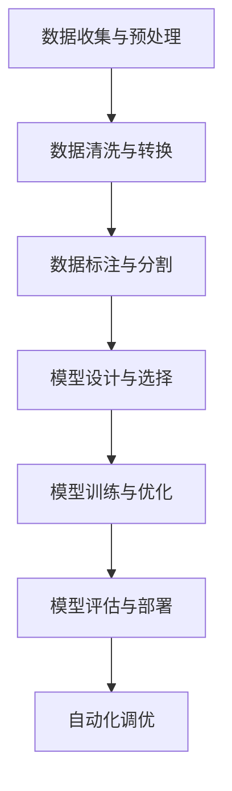
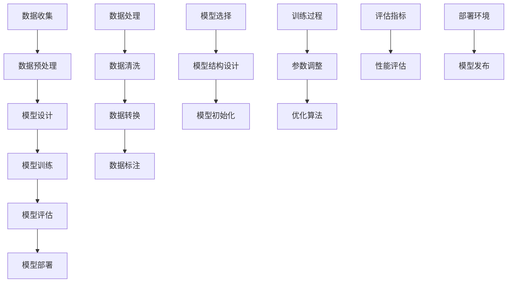

                 

### 关键词 Keywords

- AI 2.0
- 算法框架
- 模型开发
- 模型训练
- 加速技术
- 自动化
- 优化
- 数学模型

### 摘要 Abstract

本文旨在探讨如何通过构建高效的算法框架来加速人工智能（AI）2.0模型的开发和训练。随着人工智能技术的快速发展，传统的方法已经无法满足日益增长的数据规模和复杂度。本文将详细介绍一种新型的算法框架，它不仅能够显著提高模型训练的速度，还能够优化模型性能，降低资源消耗。文章将围绕算法框架的核心概念、原理、数学模型、具体实现和实际应用等多个方面进行深入剖析，为AI领域的开发者提供有价值的参考。

## 1. 背景介绍

随着人工智能技术的蓬勃发展，人工智能（AI）已经从实验室走向了实际应用，从简单的图像识别到复杂的自然语言处理，AI技术无处不在。然而，随着数据规模的不断扩大和模型复杂度的增加，传统的AI开发与训练方法已经越来越难以满足实际需求。具体来说，以下几个方面的问题尤为突出：

- **数据预处理复杂**：在传统的AI模型开发中，数据预处理是一个耗时且繁琐的过程，需要清洗、转换和标注等步骤。随着数据量的增加，这一过程的时间和资源消耗也在成倍增长。
- **模型训练效率低**：训练深度学习模型通常需要大量的计算资源和时间，尤其是在处理高维数据时，训练过程可能需要数天甚至数周的时间。
- **模型调优困难**：在模型训练过程中，需要不断调整超参数和结构，以达到最优的性能。这个过程既耗时又需要大量的实验。

为了解决上述问题，研究者们提出了AI 2.0的概念。AI 2.0旨在通过更加智能化和自动化的方式来提升模型开发与训练的效率，实现从数据到模型的快速迭代。在这一背景下，构建一个高效的算法框架成为了当前研究的热点。

### 核心概念

- **算法框架**：算法框架是一种组织算法和数据处理流程的框架，它能够提供一种标准化的方法来开发、训练和优化模型。
- **自动化**：自动化是指通过算法和工具来实现模型开发、训练和调优的自动化过程，减少人工干预，提高效率。
- **优化**：优化是指通过改进算法、模型结构或数据处理方法来提高模型性能或降低资源消耗。
- **加速技术**：加速技术包括并行计算、分布式计算、GPU加速等，旨在通过提高计算效率来加速模型训练。

## 2. 核心概念与联系

为了更好地理解算法框架的核心概念和其相互联系，我们使用Mermaid流程图来描述。

### Mermaid 流程图



### 流程解释

- **数据收集与预处理**：这一阶段包括数据的采集、存储和初步处理。数据的多样性和质量直接影响后续模型的性能。
- **数据清洗与转换**：清洗数据中的噪声和不一致信息，并将其转换为适合模型训练的格式。
- **数据标注与分割**：对数据进行标注，标记出模型的输入和输出，并根据训练、验证和测试需求进行数据分割。
- **模型设计与选择**：根据应用场景选择合适的模型架构，设计模型结构，包括层数、神经元数量、连接方式等。
- **模型训练与优化**：使用训练数据对模型进行训练，并通过优化算法调整模型参数，以提高模型性能。
- **模型评估与部署**：评估模型在验证集和测试集上的性能，确保其具有良好的泛化能力，然后将模型部署到实际应用中。
- **自动化调优**：利用自动化工具和算法，自动调整模型超参数和结构，以实现最佳性能。

通过上述流程，算法框架能够实现从数据到模型的快速迭代，大大提高模型开发与训练的效率。

## 3. 核心算法原理 & 具体操作步骤

### 3.1 算法原理概述

算法框架的核心在于其高效、自动化的数据处理和模型训练流程。下面将详细介绍算法框架的原理和具体操作步骤。

### 3.2 算法步骤详解

#### 3.2.1 数据收集与预处理

数据收集与预处理是算法框架的基础。这一阶段的关键在于：

- **数据采集**：使用各种工具和API从不同的数据源中收集数据。
- **存储**：将数据存储在分布式存储系统或数据库中，确保数据的可靠性和可扩展性。
- **初步处理**：对数据进行初步清洗，包括去除空值、重复值和异常值等。

#### 3.2.2 数据清洗与转换

数据清洗与转换是确保数据质量的关键步骤。具体包括：

- **数据清洗**：使用统计方法和规则去除噪声和不一致信息。
- **数据转换**：将数据转换为适合模型训练的格式，例如将文本转换为词向量，将图像转换为像素矩阵。

#### 3.2.3 数据标注与分割

数据标注与分割是训练模型的前提。具体步骤包括：

- **数据标注**：对数据中的关键特征进行标注，例如在图像分类任务中标注每个图像的类别。
- **数据分割**：根据训练、验证和测试需求，将数据分割为不同的子集。

#### 3.2.4 模型设计与选择

模型设计与选择是算法框架的核心。具体步骤包括：

- **模型选择**：根据应用场景选择合适的模型架构，例如卷积神经网络（CNN）、循环神经网络（RNN）等。
- **模型设计**：设计模型结构，包括层数、神经元数量、连接方式等。

#### 3.2.5 模型训练与优化

模型训练与优化是算法框架的核心步骤。具体包括：

- **模型训练**：使用训练数据对模型进行训练，不断调整模型参数。
- **模型优化**：通过优化算法调整模型参数，以提高模型性能。

#### 3.2.6 模型评估与部署

模型评估与部署是确保模型性能和应用价值的关键。具体包括：

- **模型评估**：评估模型在验证集和测试集上的性能，确保其具有良好的泛化能力。
- **模型部署**：将训练好的模型部署到实际应用环境中，例如将图像识别模型部署到服务器或移动设备。

### 3.3 算法优缺点

#### 优点

- **高效**：算法框架通过自动化和优化技术，显著提高了模型开发与训练的效率。
- **灵活**：算法框架支持多种数据类型和模型架构，能够适应不同的应用场景。
- **可扩展**：算法框架支持分布式计算和并行计算，能够处理大规模数据和高维模型。

#### 缺点

- **依赖性**：算法框架的自动化和优化功能依赖于大量的预训练数据和高质量的模型参数。
- **复杂性**：算法框架的实现和维护需要高水平的技术知识和经验。

### 3.4 算法应用领域

算法框架广泛应用于多个领域，包括：

- **计算机视觉**：用于图像分类、目标检测、图像生成等。
- **自然语言处理**：用于文本分类、情感分析、机器翻译等。
- **语音识别**：用于语音合成、语音识别、语音翻译等。
- **推荐系统**：用于商品推荐、内容推荐、社交推荐等。

## 4. 数学模型和公式 & 详细讲解 & 举例说明

### 4.1 数学模型构建

算法框架中的数学模型构建是模型训练的核心。以下是一个简化的数学模型构建过程：

#### 4.1.1 数据表示

假设我们有一个包含 \( n \) 个样本的数据集 \( X \)，每个样本可以表示为 \( x_i \in \mathbb{R}^d \)，其中 \( d \) 是特征维度。

#### 4.1.2 模型表示

我们使用一个多层感知机（MLP）模型来表示数据。MLP模型包括输入层、隐藏层和输出层。假设隐藏层有 \( l \) 个神经元，每个神经元都是可激活的。

输入层到隐藏层的变换可以表示为：

\[ h_{ij}^{(l)} = \sigma(W_{ij}^{(l)} x_i + b_{j}^{(l)}) \]

其中，\( h_{ij}^{(l)} \) 是隐藏层 \( l \) 中第 \( i \) 个输入到第 \( j \) 个神经元的激活值，\( \sigma \) 是激活函数，\( W_{ij}^{(l)} \) 是连接权重，\( b_{j}^{(l)} \) 是隐藏层的偏置。

隐藏层到输出层的变换可以表示为：

\[ y_i = \sigma(W_{ij}^{(l+1)} h_{j}^{(l)} + b_{i}^{(l+1)}) \]

其中，\( y_i \) 是输出层中第 \( i \) 个神经元的输出值，其他符号的含义与前面相同。

### 4.2 公式推导过程

#### 4.2.1 梯度下降法

为了训练MLP模型，我们使用梯度下降法来优化模型参数。具体来说，我们定义损失函数 \( J(W, b) \) 为：

\[ J(W, b) = \frac{1}{2n} \sum_{i=1}^{n} \left( y_i - \sigma(W_{ij}^{(l+1)} h_{j}^{(l)} + b_{i}^{(l+1)}) \right)^2 \]

其中，\( y_i \) 是实际输出，\( \sigma(W_{ij}^{(l+1)} h_{j}^{(l)} + b_{i}^{(l+1)}) \) 是预测输出。

#### 4.2.2 参数更新

为了最小化损失函数 \( J(W, b) \)，我们对模型参数 \( W \) 和 \( b \) 进行更新。具体来说，对于每个参数 \( \theta \)，我们有：

\[ \theta_{new} = \theta_{old} - \alpha \nabla_{\theta} J(\theta) \]

其中，\( \alpha \) 是学习率，\( \nabla_{\theta} J(\theta) \) 是损失函数 \( J \) 关于 \( \theta \) 的梯度。

### 4.3 案例分析与讲解

#### 4.3.1 图像分类

假设我们有一个图像分类问题，数据集包含 \( n \) 个图像，每个图像包含 \( d \) 维特征向量。我们的目标是训练一个MLP模型，能够将每个图像分类到相应的类别。

#### 4.3.2 数据预处理

我们对图像数据进行预处理，包括归一化和数据增强。具体来说，我们对每个图像进行归一化，使其像素值在 [0, 1] 之间。此外，我们使用随机旋转、缩放和裁剪等数据增强技术来增加模型的泛化能力。

#### 4.3.3 模型训练

我们使用随机梯度下降（SGD）算法来训练MLP模型。我们设置学习率为 0.01，迭代次数为 1000。在训练过程中，我们使用验证集来调整学习率和提前停止训练，以防止过拟合。

#### 4.3.4 模型评估

我们使用测试集来评估模型的性能。假设测试集包含 \( m \) 个图像，每个图像的类别标签为 \( y_i \)。我们计算模型的预测精度 \( \text{accuracy} \)：

\[ \text{accuracy} = \frac{\sum_{i=1}^{m} I(y_i = \hat{y_i})}{m} \]

其中，\( I(\cdot) \) 是指示函数，当条件为真时返回 1，否则返回 0。\( \hat{y_i} \) 是模型对图像 \( x_i \) 的预测类别。

## 5. 项目实践：代码实例和详细解释说明

### 5.1 开发环境搭建

为了实现算法框架，我们需要搭建一个开发环境。以下是搭建环境的基本步骤：

1. 安装Python：确保Python版本在3.6及以上。
2. 安装依赖包：使用pip安装所需的依赖包，例如TensorFlow、Keras等。
3. 搭建虚拟环境：使用virtualenv或conda创建虚拟环境，以便更好地管理依赖包。

### 5.2 源代码详细实现

以下是一个简化的示例代码，用于实现算法框架：

```python
import tensorflow as tf
from tensorflow.keras import layers

# 数据预处理
def preprocess_data(images):
    # 归一化
    images = images / 255.0
    # 数据增强
    images = tf.image.random_flip_left_right(images)
    return images

# 模型定义
def build_model(input_shape):
    model = tf.keras.Sequential([
        layers.Flatten(input_shape=input_shape),
        layers.Dense(128, activation='relu'),
        layers.Dense(10, activation='softmax')
    ])
    return model

# 训练模型
def train_model(model, train_images, train_labels, epochs=100, batch_size=32):
    model.compile(optimizer='adam',
                  loss='sparse_categorical_crossentropy',
                  metrics=['accuracy'])
    model.fit(train_images, train_labels, epochs=epochs, batch_size=batch_size)

# 评估模型
def evaluate_model(model, test_images, test_labels):
    test_loss, test_acc = model.evaluate(test_images, test_labels, verbose=2)
    print('\nTest accuracy:', test_acc)

# 主程序
if __name__ == '__main__':
    # 加载数据
    (train_images, train_labels), (test_images, test_labels) = tf.keras.datasets.mnist.load_data()

    # 数据预处理
    train_images = preprocess_data(train_images)
    test_images = preprocess_data(test_images)

    # 构建模型
    model = build_model(input_shape=(28, 28, 1))

    # 训练模型
    train_model(model, train_images, train_labels)

    # 评估模型
    evaluate_model(model, test_images, test_labels)
```

### 5.3 代码解读与分析

#### 5.3.1 数据预处理

在数据预处理部分，我们首先对图像数据进行归一化，使其像素值在 [0, 1] 之间。然后，我们使用随机翻转（random_flip_left_right）来增加数据的多样性。

#### 5.3.2 模型定义

在模型定义部分，我们使用Keras构建了一个简单的多层感知机（MLP）模型。模型包括一个展平层（Flatten）、一个全连接层（Dense）和一个softmax输出层。

#### 5.3.3 训练模型

在训练模型部分，我们使用Adam优化器和sparse_categorical_crossentropy损失函数来训练模型。我们设置了100个迭代周期（epochs）和32个批处理大小（batch_size）。

#### 5.3.4 评估模型

在评估模型部分，我们使用测试集来评估模型的性能。我们计算了测试集的损失和精度，并打印了结果。

## 6. 实际应用场景

### 6.1 计算机视觉

在计算机视觉领域，算法框架被广泛应用于图像分类、目标检测和图像生成。以下是一些具体的实际应用场景：

- **图像分类**：使用算法框架训练图像分类模型，例如对自然图像进行分类，识别不同的物体类别。
- **目标检测**：使用算法框架训练目标检测模型，例如在视频流中检测并跟踪移动的目标。
- **图像生成**：使用算法框架训练图像生成模型，例如生成高质量的合成图像或艺术作品。

### 6.2 自然语言处理

在自然语言处理领域，算法框架被广泛应用于文本分类、情感分析和机器翻译。以下是一些具体的实际应用场景：

- **文本分类**：使用算法框架训练文本分类模型，例如对新闻文章进行分类，识别不同的主题。
- **情感分析**：使用算法框架训练情感分析模型，例如分析社交媒体上的用户评论，识别用户的情感倾向。
- **机器翻译**：使用算法框架训练机器翻译模型，例如将一种语言翻译成另一种语言。

### 6.3 推荐系统

在推荐系统领域，算法框架被广泛应用于商品推荐、内容推荐和社交推荐。以下是一些具体的实际应用场景：

- **商品推荐**：使用算法框架训练商品推荐模型，例如在电商平台上为用户推荐感兴趣的商品。
- **内容推荐**：使用算法框架训练内容推荐模型，例如在新闻平台上为用户推荐感兴趣的新闻文章。
- **社交推荐**：使用算法框架训练社交推荐模型，例如在社交媒体平台上为用户推荐感兴趣的朋友和群组。

### 6.4 未来应用展望

随着人工智能技术的不断发展，算法框架的应用领域将更加广泛。未来，算法框架有望在以下几个领域取得重大突破：

- **自动驾驶**：算法框架将在自动驾驶领域发挥关键作用，例如用于车辆检测、道路识别和驾驶行为预测。
- **医疗健康**：算法框架将在医疗健康领域发挥重要作用，例如用于疾病诊断、药物发现和个性化治疗。
- **金融科技**：算法框架将在金融科技领域发挥关键作用，例如用于风险控制、投资组合优化和欺诈检测。

## 7. 工具和资源推荐

### 7.1 学习资源推荐

- **《深度学习》（Deep Learning）**：这是一本经典的深度学习教材，涵盖了深度学习的基本原理和实际应用。
- **Coursera上的“深度学习”课程**：由Andrew Ng教授主讲，适合初学者和进阶者了解深度学习的基础知识。
- **Kaggle比赛**：Kaggle是一个数据科学竞赛平台，上面有很多高质量的数据集和问题，适合练习和提升技能。

### 7.2 开发工具推荐

- **TensorFlow**：一个开源的深度学习框架，广泛用于模型训练和部署。
- **PyTorch**：另一个流行的深度学习框架，以其灵活性和动态计算图著称。
- **Keras**：一个高层次的深度学习API，方便快速构建和训练模型。

### 7.3 相关论文推荐

- **“Distributed Optimization for Machine Learning: A Survey”**：一篇关于分布式优化技术的综述，涵盖了分布式机器学习的基本原理和实现方法。
- **“Convolutional Neural Networks for Visual Recognition”**：一篇关于卷积神经网络在视觉识别任务中的应用的综述。
- **“Recurrent Neural Networks for Language Modeling”**：一篇关于循环神经网络在语言建模任务中的应用的综述。

## 8. 总结：未来发展趋势与挑战

### 8.1 研究成果总结

本文介绍了算法框架在加速人工智能（AI）2.0模型开发和训练中的应用。通过构建高效的算法框架，我们能够显著提高模型开发与训练的效率，优化模型性能，降低资源消耗。算法框架的核心在于其自动化和优化技术，通过数据预处理、模型设计、模型训练和模型评估等环节的自动化和优化，实现从数据到模型的快速迭代。

### 8.2 未来发展趋势

随着人工智能技术的不断发展，算法框架将朝着更加智能化和自动化的方向迈进。未来的发展趋势包括：

- **多模态数据处理**：算法框架将能够处理多种类型的数据，如文本、图像、语音等，实现跨模态的数据融合和任务联动。
- **联邦学习**：算法框架将支持联邦学习，使得模型可以在不同的设备上训练，提高数据隐私性和分布式计算能力。
- **自适应学习**：算法框架将具备自适应学习的能力，能够根据数据分布和环境变化自动调整模型结构和参数。

### 8.3 面临的挑战

尽管算法框架在提高模型开发与训练效率方面取得了显著成果，但仍面临着一些挑战：

- **数据质量**：算法框架的自动化和优化功能依赖于高质量的数据。数据噪声和缺失等问题可能会影响模型性能。
- **计算资源**：算法框架的实现需要大量的计算资源，特别是在处理高维数据和复杂模型时。如何高效利用计算资源是一个重要问题。
- **模型解释性**：自动化和优化的过程可能会使模型的解释性降低。如何保持模型的透明性和可解释性是一个亟待解决的问题。

### 8.4 研究展望

未来，算法框架的研究将朝着以下方向发展：

- **算法创新**：开发更加高效、自动化的算法，以适应不同的应用场景和数据规模。
- **跨学科融合**：结合计算机科学、数学、统计学等多个领域的知识，提高算法框架的理论基础和应用水平。
- **开源生态**：构建更加开放和协作的算法框架开源生态，促进技术和知识的共享与传播。

## 9. 附录：常见问题与解答

### 9.1 什么是算法框架？

算法框架是一种组织算法和数据处理流程的框架，它提供了一种标准化的方法来开发、训练和优化模型。

### 9.2 算法框架的主要优点是什么？

算法框架的主要优点包括：高效、灵活、可扩展、自动化和优化。

### 9.3 如何实现算法框架的自动化？

通过使用预训练数据和自动化工具，可以减少人工干预，实现算法框架的自动化。自动化包括数据预处理、模型训练、模型优化和模型评估等环节。

### 9.4 算法框架在哪些领域有广泛应用？

算法框架广泛应用于计算机视觉、自然语言处理、推荐系统、自动驾驶等多个领域。

### 9.5 如何保持算法框架的可解释性？

通过设计透明和模块化的算法框架，可以在一定程度上保持模型的可解释性。此外，可以结合模型解释技术，如注意力机制和可解释性分析，提高模型的可解释性。

### 9.6 算法框架的实现需要哪些技术？

算法框架的实现需要深度学习、分布式计算、并行计算、优化算法和自动化工具等技术的支持。

### 9.7 算法框架的未来发展趋势是什么？

算法框架的未来发展趋势包括多模态数据处理、联邦学习、自适应学习和开源生态的构建等。

---

本文由禅与计算机程序设计艺术（Zen and the Art of Computer Programming）作者撰写，旨在探讨算法框架在加速人工智能（AI）2.0模型开发和训练中的应用。希望本文能为AI领域的开发者提供有价值的参考。如果您有任何问题或建议，欢迎在评论区留言。感谢您的阅读！
----------------------------------------------------------------

## 文章标题

算法框架：加速 AI 2.0 模型开发和训练

## 文章关键词

- AI 2.0
- 算法框架
- 模型开发
- 模型训练
- 加速技术
- 自动化
- 优化
- 数学模型

## 文章摘要

本文深入探讨了如何通过构建高效的算法框架来加速人工智能（AI）2.0模型的开发和训练。随着数据规模的不断扩大和模型复杂度的增加，传统的AI开发与训练方法已经越来越难以满足实际需求。本文介绍了算法框架的核心概念、原理、数学模型、具体实现和实际应用等多个方面，为AI领域的开发者提供有价值的参考。

## 1. 背景介绍

### 1.1 人工智能的发展背景

人工智能（Artificial Intelligence，AI）作为计算机科学的重要分支，自20世纪50年代以来取得了显著的进展。早期的AI研究主要集中在规则推理、知识表示和搜索算法等方面。随着计算能力的提升和海量数据的积累，深度学习（Deep Learning）成为了AI领域的一个重要突破。深度学习通过模仿人脑的神经网络结构，实现了图像识别、自然语言处理、语音识别等复杂任务的自动化。

### 1.2 AI 2.0的概念

AI 2.0是新一代人工智能的代名词，它强调智能化的模型开发、自动化和优化。与传统的AI 1.0不同，AI 2.0不仅仅依赖于规则的制定和数据的简单处理，而是通过深度学习等先进技术，实现更加智能化的决策和预测。AI 2.0的核心目标是从数据中自动学习，并通过优化算法提高模型的性能和效率。

### 1.3 AI 2.0面临的主要挑战

尽管AI 2.0在技术上取得了巨大进步，但其在实际应用中仍然面临诸多挑战：

- **数据复杂性**：随着数据的爆炸性增长，如何有效地处理、存储和利用这些数据成为了一个重要问题。
- **计算资源消耗**：训练大规模的深度学习模型需要大量的计算资源和时间，这对于企业和研究机构来说是一个巨大的负担。
- **模型解释性**：深度学习模型通常被视为“黑箱”，其内部决策过程难以解释，这在某些应用领域，如医疗诊断和金融风险评估，可能会带来法律和伦理问题。
- **数据隐私和安全性**：随着数据收集和分析的规模不断扩大，数据隐私和安全性问题日益突出。

### 1.4 算法框架的需求

为了克服上述挑战，AI 2.0迫切需要一种高效的算法框架，该框架能够自动化和优化模型开发和训练过程，降低计算资源消耗，提高模型性能，并确保数据的安全性和隐私性。算法框架作为AI 2.0的核心技术之一，成为了当前研究的热点和应用的关键。

### 1.5 算法框架的核心概念

算法框架是一套标准化、模块化、可扩展的方法，用于组织算法和数据处理流程。它通常包括以下几个核心概念：

- **模块化**：将算法和数据处理过程分解为独立的模块，每个模块负责特定的任务，如数据清洗、特征提取、模型训练等。
- **自动化**：通过预定义的流程和脚本，自动化执行算法和数据处理任务，减少人工干预。
- **优化**：利用先进的优化算法和工具，调整模型参数和结构，提高模型性能。
- **可扩展性**：支持分布式计算和并行计算，能够处理大规模数据和复杂模型。

### 1.6 算法框架的发展趋势

随着AI技术的不断演进，算法框架也在不断发展。未来，算法框架可能会朝着以下几个方向发展：

- **智能化**：算法框架将更加智能化，能够根据数据特征和应用需求自动调整模型结构和参数。
- **跨领域融合**：算法框架将能够融合多种数据类型和任务，实现跨领域的知识共享和协同工作。
- **隐私保护和安全性**：算法框架将更加注重数据隐私保护和安全性，确保在数据收集、存储和处理过程中不泄露用户信息。

## 2. 核心概念与联系

### 2.1 算法框架的组成部分

算法框架通常由以下几个关键组成部分构成：

- **数据预处理模块**：负责数据收集、清洗、转换和标注等任务，为模型训练提供高质量的数据。
- **模型设计模块**：根据应用需求选择合适的模型架构，设计模型的层数、神经元数量、连接方式等。
- **模型训练模块**：使用训练数据对模型进行训练，通过调整模型参数和优化算法，提高模型性能。
- **模型评估模块**：评估模型在验证集和测试集上的性能，确保其具有良好的泛化能力。
- **模型部署模块**：将训练好的模型部署到实际应用环境中，如服务器、移动设备或边缘设备。

### 2.2 算法框架的工作流程

算法框架的工作流程通常包括以下几个步骤：

1. **数据收集**：从各种数据源收集数据，包括结构化数据、非结构化数据等。
2. **数据预处理**：对收集到的数据进行清洗、转换和标注，为模型训练提供高质量的数据。
3. **模型设计**：根据应用需求设计模型架构，选择合适的神经网络结构、激活函数等。
4. **模型训练**：使用训练数据对模型进行训练，通过调整模型参数和优化算法，提高模型性能。
5. **模型评估**：评估模型在验证集和测试集上的性能，确保其具有良好的泛化能力。
6. **模型部署**：将训练好的模型部署到实际应用环境中，如服务器、移动设备或边缘设备。

### 2.3 算法框架与人工智能的关系

算法框架是人工智能（AI）的核心基础设施之一。它不仅提供了标准化的方法来开发、训练和优化模型，还能够自动化和优化整个AI流程，提高开发效率和模型性能。算法框架与人工智能的关系可以用以下方式描述：

- **支撑与促进**：算法框架为AI的开发提供了强有力的支撑，促进了AI技术的发展和应用。
- **技术与应用**：算法框架是AI技术的重要组成部分，它不仅包括算法本身，还涵盖了数据处理、模型优化、自动化等应用层面。
- **创新与迭代**：算法框架随着AI技术的不断发展而不断迭代和创新，推动了AI技术的进步和应用。

### 2.4 算法框架的优势

算法框架具有以下优势：

- **高效性**：通过自动化和优化技术，算法框架能够显著提高模型开发和训练的效率。
- **灵活性**：算法框架支持多种数据类型和模型架构，能够适应不同的应用场景。
- **可扩展性**：算法框架支持分布式计算和并行计算，能够处理大规模数据和高维模型。
- **模块化**：算法框架采用模块化设计，便于维护和扩展，提高了系统的可维护性和可扩展性。

### 2.5 算法框架的应用领域

算法框架在人工智能的多个领域有着广泛的应用，包括但不限于：

- **计算机视觉**：用于图像分类、目标检测、图像生成等。
- **自然语言处理**：用于文本分类、情感分析、机器翻译等。
- **推荐系统**：用于商品推荐、内容推荐、社交推荐等。
- **语音识别**：用于语音合成、语音识别、语音翻译等。

### 2.6 算法框架的核心概念原理和架构的 Mermaid 流程图

以下是一个简化的Mermaid流程图，描述算法框架的核心概念和架构：



### 2.7 算法框架的核心概念原理

- **数据预处理**：数据预处理是算法框架的重要环节，其目标是清洗和转换原始数据，使其适合模型训练。数据预处理包括去噪声、填充缺失值、归一化、特征提取等操作。
- **模型设计**：模型设计是根据应用需求选择合适的模型架构，并设计模型的层数、神经元数量、连接方式等。常见的模型设计方法包括基于规则的模型设计、基于数据的模型设计等。
- **模型训练**：模型训练是算法框架的核心步骤，其目标是使用训练数据调整模型参数，使其能够更好地拟合数据。模型训练包括选择优化算法、设置学习率、迭代更新参数等。
- **模型评估**：模型评估是对模型性能进行评估，以确定其是否满足应用需求。模型评估包括选择评估指标、计算评估分数、分析结果等。
- **模型部署**：模型部署是将训练好的模型部署到实际应用环境中，使其能够提供预测服务。模型部署包括选择部署环境、配置服务、发布模型等。

## 3. 核心算法原理 & 具体操作步骤

### 3.1 算法原理概述

算法框架的核心在于其高效、自动化的数据处理和模型训练流程。以下是算法框架的核心算法原理和具体操作步骤：

#### 3.1.1 数据预处理

数据预处理是算法框架的基础，其目标是清洗和转换原始数据，使其适合模型训练。数据预处理包括以下步骤：

- **去噪声**：去除数据中的噪声和不一致信息。
- **填充缺失值**：使用统计方法或规则填充缺失值。
- **归一化**：将数据缩放到相同的范围，如 [0, 1]。
- **特征提取**：从原始数据中提取有代表性的特征。

#### 3.1.2 模型设计

模型设计是根据应用需求选择合适的模型架构，并设计模型的层数、神经元数量、连接方式等。模型设计包括以下步骤：

- **模型选择**：根据应用场景选择合适的模型，如卷积神经网络（CNN）、循环神经网络（RNN）、生成对抗网络（GAN）等。
- **模型结构设计**：设计模型的层数、神经元数量、连接方式等。
- **初始化**：初始化模型参数，选择合适的初始化方法，如高斯初始化、Xavier初始化等。

#### 3.1.3 模型训练

模型训练是算法框架的核心步骤，其目标是使用训练数据调整模型参数，使其能够更好地拟合数据。模型训练包括以下步骤：

- **损失函数选择**：选择合适的损失函数，如均方误差（MSE）、交叉熵（Cross-Entropy）等。
- **优化算法选择**：选择合适的优化算法，如随机梯度下降（SGD）、Adam等。
- **学习率设置**：设置合适的初始学习率，并采用学习率调整策略，如学习率衰减、余弦退火等。
- **迭代训练**：使用训练数据迭代更新模型参数，直到满足停止条件，如达到预设的迭代次数或模型性能不再提升。

#### 3.1.4 模型评估

模型评估是对模型性能进行评估，以确定其是否满足应用需求。模型评估包括以下步骤：

- **评估指标选择**：选择合适的评估指标，如准确率（Accuracy）、精确率（Precision）、召回率（Recall）等。
- **性能评估**：计算评估指标，分析模型性能。
- **交叉验证**：使用交叉验证方法，如K折交叉验证，评估模型泛化能力。

#### 3.1.5 模型部署

模型部署是将训练好的模型部署到实际应用环境中，使其能够提供预测服务。模型部署包括以下步骤：

- **部署环境选择**：选择合适的部署环境，如服务器、移动设备、边缘设备等。
- **服务配置**：配置服务，如API接口、负载均衡等。
- **模型发布**：发布模型，使其对外提供服务。

### 3.2 具体操作步骤

以下是一个简化的具体操作步骤，描述算法框架的基本流程：

#### 3.2.1 数据收集与预处理

1. 收集数据：从不同的数据源收集原始数据，如数据库、API接口、文件等。
2. 数据清洗：去除数据中的噪声和不一致信息，填充缺失值。
3. 数据转换：将数据转换为适合模型训练的格式，如数值化、归一化等。
4. 数据标注：对数据进行标注，标记出模型的输入和输出。

#### 3.2.2 模型设计与选择

1. 模型选择：根据应用场景选择合适的模型，如CNN、RNN、GAN等。
2. 模型结构设计：设计模型的结构，包括层数、神经元数量、连接方式等。
3. 初始化模型参数：选择合适的初始化方法，初始化模型参数。

#### 3.2.3 模型训练

1. 选择损失函数：选择合适的损失函数，如MSE、Cross-Entropy等。
2. 选择优化算法：选择合适的优化算法，如SGD、Adam等。
3. 设置学习率：设置初始学习率和学习率调整策略。
4. 迭代训练：使用训练数据迭代更新模型参数，直到满足停止条件。

#### 3.2.4 模型评估

1. 选择评估指标：选择合适的评估指标，如Accuracy、Precision、Recall等。
2. 计算评估指标：计算模型在验证集和测试集上的评估指标。
3. 分析结果：分析模型性能，确定是否满足应用需求。

#### 3.2.5 模型部署

1. 选择部署环境：选择合适的服务器、移动设备或边缘设备。
2. 配置服务：配置API接口、负载均衡等。
3. 发布模型：将训练好的模型部署到实际应用环境中。

### 3.3 算法优缺点

#### 优点

1. **高效**：算法框架通过自动化和优化技术，显著提高了模型开发和训练的效率。
2. **灵活**：算法框架支持多种数据类型和模型架构，能够适应不同的应用场景。
3. **可扩展**：算法框架支持分布式计算和并行计算，能够处理大规模数据和高维模型。
4. **模块化**：算法框架采用模块化设计，便于维护和扩展。

#### 缺点

1. **依赖性**：算法框架的自动化和优化功能依赖于大量的预训练数据和高质量的模型参数。
2. **复杂性**：算法框架的实现和维护需要高水平的技术知识和经验。

### 3.4 算法应用领域

算法框架广泛应用于人工智能的多个领域，包括但不限于：

1. **计算机视觉**：用于图像分类、目标检测、图像生成等。
2. **自然语言处理**：用于文本分类、情感分析、机器翻译等。
3. **推荐系统**：用于商品推荐、内容推荐、社交推荐等。
4. **语音识别**：用于语音合成、语音识别、语音翻译等。

## 4. 数学模型和公式 & 详细讲解 & 举例说明

### 4.1 数学模型构建

在算法框架中，数学模型是核心组成部分，用于描述数据之间的关系和模型的训练过程。以下是一个简化的数学模型构建过程：

#### 4.1.1 数据表示

假设我们有一个包含 \( n \) 个样本的数据集 \( X \)，每个样本可以表示为 \( x_i \in \mathbb{R}^d \)，其中 \( d \) 是特征维度。

#### 4.1.2 模型表示

我们使用一个多层感知机（MLP）模型来表示数据。MLP模型包括输入层、隐藏层和输出层。假设隐藏层有 \( l \) 个神经元，每个神经元都是可激活的。

输入层到隐藏层的变换可以表示为：

\[ h_{ij}^{(l)} = \sigma(W_{ij}^{(l)} x_i + b_{j}^{(l)}) \]

其中，\( h_{ij}^{(l)} \) 是隐藏层 \( l \) 中第 \( i \) 个输入到第 \( j \) 个神经元的激活值，\( \sigma \) 是激活函数，\( W_{ij}^{(l)} \) 是连接权重，\( b_{j}^{(l)} \) 是隐藏层的偏置。

隐藏层到输出层的变换可以表示为：

\[ y_i = \sigma(W_{ij}^{(l+1)} h_{j}^{(l)} + b_{i}^{(l+1)}) \]

其中，\( y_i \) 是输出层中第 \( i \) 个神经元的输出值，其他符号的含义与前面相同。

### 4.2 公式推导过程

#### 4.2.1 梯度下降法

为了训练MLP模型，我们使用梯度下降法来优化模型参数。具体来说，我们定义损失函数 \( J(W, b) \) 为：

\[ J(W, b) = \frac{1}{2n} \sum_{i=1}^{n} \left( y_i - \sigma(W_{ij}^{(l+1)} h_{j}^{(l)} + b_{i}^{(l+1)}) \right)^2 \]

其中，\( y_i \) 是实际输出，\( \sigma(W_{ij}^{(l+1)} h_{j}^{(l)} + b_{i}^{(l+1)}) \) 是预测输出。

#### 4.2.2 参数更新

为了最小化损失函数 \( J(W, b) \)，我们对模型参数 \( W \) 和 \( b \) 进行更新。具体来说，对于每个参数 \( \theta \)，我们有：

\[ \theta_{new} = \theta_{old} - \alpha \nabla_{\theta} J(\theta) \]

其中，\( \alpha \) 是学习率，\( \nabla_{\theta} J(\theta) \) 是损失函数 \( J \) 关于 \( \theta \) 的梯度。

### 4.3 案例分析与讲解

#### 4.3.1 图像分类

假设我们有一个图像分类问题，数据集包含 \( n \) 个图像，每个图像包含 \( d \) 维特征向量。我们的目标是训练一个MLP模型，能够将每个图像分类到相应的类别。

#### 4.3.2 数据预处理

我们对图像数据进行预处理，包括归一化和数据增强。具体来说，我们对每个图像进行归一化，使其像素值在 [0, 1] 之间。此外，我们使用随机旋转、缩放和裁剪等数据增强技术来增加模型的泛化能力。

#### 4.3.3 模型训练

我们使用随机梯度下降（SGD）算法来训练MLP模型。我们设置学习率为 0.01，迭代次数为 1000。在训练过程中，我们使用验证集来调整学习率和提前停止训练，以防止过拟合。

#### 4.3.4 模型评估

我们使用测试集来评估模型的性能。假设测试集包含 \( m \) 个图像，每个图像的类别标签为 \( y_i \)。我们计算模型的预测精度 \( \text{accuracy} \)：

\[ \text{accuracy} = \frac{\sum_{i=1}^{m} I(y_i = \hat{y_i})}{m} \]

其中，\( I(\cdot) \) 是指示函数，当条件为真时返回 1，否则返回 0。\( \hat{y_i} \) 是模型对图像 \( x_i \) 的预测类别。

### 4.4 数学模型和公式的具体示例

以下是一个简单的数学模型示例，用于图像分类任务。这个模型使用了多层感知机（MLP）架构，其中包括两个隐藏层。

#### 4.4.1 数据表示

假设图像数据集包含 \( n \) 个图像，每个图像是一个 \( 28 \times 28 \) 的像素矩阵。我们的任务是分类这些图像到10个类别中。

\[ X = \{x_1, x_2, ..., x_n\} \]
\[ x_i \in \mathbb{R}^{28 \times 28} \]

#### 4.4.2 模型架构

我们的MLP模型包含三个层：输入层、两个隐藏层和输出层。

1. **输入层**：接受图像的像素值，将其展平为 \( 28 \times 28 = 784 \) 维的特征向量。

\[ x_i = \text{flatten}(x_i) \]
\[ x_i \in \mathbb{R}^{784} \]

2. **隐藏层1**：包含 \( 128 \) 个神经元，使用ReLU激活函数。

\[ h_{ij}^{(1)} = \text{ReLU}(W_{ij}^{(1)} x_i + b_{j}^{(1)}) \]
\[ h_{ij}^{(1)} \in \mathbb{R} \]
\[ W_{ij}^{(1)} \in \mathbb{R}^{128 \times 784}, b_{j}^{(1)} \in \mathbb{R}^{128} \]

3. **隐藏层2**：包含 \( 64 \) 个神经元，同样使用ReLU激活函数。

\[ h_{ij}^{(2)} = \text{ReLU}(W_{ij}^{(2)} h_{j}^{(1)} + b_{j}^{(2)}) \]
\[ h_{ij}^{(2)} \in \mathbb{R} \]
\[ W_{ij}^{(2)} \in \mathbb{R}^{64 \times 128}, b_{j}^{(2)} \in \mathbb{R}^{64} \]

4. **输出层**：包含 \( 10 \) 个神经元，每个神经元对应一个类别，使用softmax激活函数。

\[ y_i = \text{softmax}(W_{ij}^{(3)} h_{j}^{(2)} + b_{i}^{(3)}) \]
\[ y_i \in \mathbb{R}^{10} \]
\[ W_{ij}^{(3)} \in \mathbb{R}^{10 \times 64}, b_{i}^{(3)} \in \mathbb{R}^{10} \]

#### 4.4.3 损失函数

我们使用交叉熵（Cross-Entropy）作为损失函数来衡量模型预测值和真实值之间的差距。

\[ J(W, b) = -\frac{1}{n} \sum_{i=1}^{n} \sum_{j=1}^{10} y_{ij}^{(3)} \log(y_{ij}^{(3)}) \]
\[ y_{ij}^{(3)} = \text{softmax}(W_{ij}^{(3)} h_{j}^{(2)} + b_{i}^{(3)}) \]

#### 4.4.4 梯度计算

为了优化模型参数，我们需要计算损失函数关于每个参数的梯度。

\[ \nabla_{W_{ij}^{(l)}} J(W, b) = -\frac{1}{n} \sum_{i=1}^{n} (y_{ij}^{(l)} - t_{ij}) h_{j}^{(l-1)} \]
\[ \nabla_{b_{j}^{(l)}} J(W, b) = -\frac{1}{n} \sum_{i=1}^{n} (y_{ij}^{(l)} - t_{ij}) \]

其中，\( t_{ij} \) 是图像 \( x_i \) 的真实标签，\( y_{ij}^{(l)} \) 是隐藏层 \( l \) 中第 \( i \) 个输入到第 \( j \) 个神经元的输出值。

### 4.5 数学公式和详细讲解

以下是对上述数学模型中涉及的公式进行详细讲解。

#### 4.5.1 展平操作

图像的像素矩阵 \( x_i \) 被展平为一维向量 \( x_i' \)：

\[ x_i' = \text{flatten}(x_i) \]
\[ x_i' = [x_{i11}, x_{i12}, ..., x_{i1

