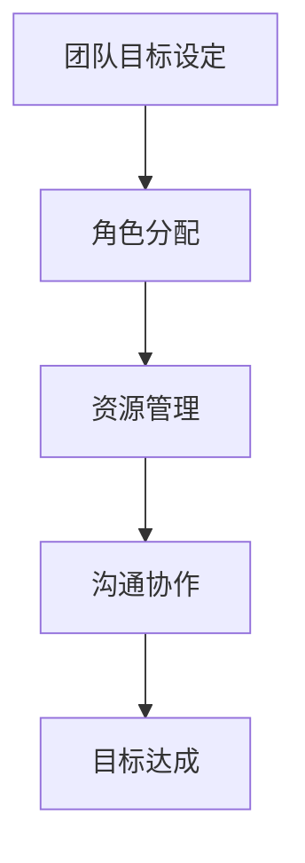

                 

关键词：IT团队管理、团队目标、领导力、技术发展、项目成功、资源优化、沟通协作

摘要：本文将探讨如何有效地管理公司IT团队，确保团队以高效的方式完成既定的目标。通过对团队目标设定、角色分配、资源管理、沟通协作等方面的深入分析，文章旨在为IT经理或团队领导提供实用的指导，帮助他们提升团队绩效，推动技术项目的成功。

## 1. 背景介绍

在现代企业中，信息技术（IT）已经成为业务成功的关键驱动因素。一个高效的IT团队对于企业的运营、决策、创新和竞争力都有着至关重要的影响。然而，管理一个IT团队并非易事，它需要领导者在技术能力、团队管理、沟通协调等多个方面具备综合能力。

### 1.1 IT团队的角色和责任

IT团队在企业中的角色多种多样，主要包括：

- **技术支持**：确保企业系统的稳定运行，为员工提供必要的技术支持。
- **系统开发**：负责新系统的开发、升级和维护，推动企业的技术进步。
- **信息安全**：保护企业数据和系统的安全性，防范外部攻击和数据泄露。
- **项目管理**：协调和管理项目进度、预算和资源，确保项目按时交付。

### 1.2 IT团队面临的挑战

IT团队面临的挑战包括技术快速发展、信息安全威胁、资源有限、团队成员多样化等。为了应对这些挑战，IT经理需要具备前瞻性思维、灵活应变的能力，以及有效的团队管理技巧。

## 2. 核心概念与联系

### 2.1 团队目标设定

团队目标设定是团队管理的重要一环。有效的目标设定应具备以下特点：

- **具体性**：目标应当明确具体，便于团队成员理解和执行。
- **挑战性**：目标应当具有挑战性，激励团队成员不断提升。
- **可实现性**：目标应当是可实现的，避免因目标过高而导致的挫败感。
- **时限性**：目标应当设定明确的完成时限，推动团队高效工作。

### 2.2 团队角色分配

在团队中，角色分配至关重要。合理的角色分配能够充分发挥团队成员的特长，提高团队整体效能。以下是一些常见的团队角色：

- **技术专家**：负责解决复杂的技术问题，推动技术创新。
- **项目经理**：负责项目规划、执行和监控，确保项目按时交付。
- **测试工程师**：负责软件测试，确保产品质量。
- **运维工程师**：负责系统运维，保障系统稳定运行。

### 2.3 资源管理

资源管理是团队成功的关键因素。有效的资源管理包括：

- **人力分配**：根据项目需求和团队成员的能力进行人力分配，确保每个成员都能发挥最大价值。
- **时间管理**：合理安排工作时间和任务进度，确保项目按时交付。
- **技术资源**：合理配置技术资源，如开发工具、硬件设备等，提高工作效率。

### 2.4 沟通协作

良好的沟通协作是团队成功的关键。有效的沟通协作包括：

- **定期会议**：定期召开团队会议，讨论项目进度、问题解决和改进措施。
- **信息共享**：确保团队成员能够及时获取所需信息，提高工作效率。
- **协作工具**：使用协作工具，如邮件、即时通讯软件、项目管理工具等，方便团队成员之间沟通和协作。

### 2.5 Mermaid 流程图



## 3. 核心算法原理 & 具体操作步骤

### 3.1 算法原理概述

在IT团队管理中，一种核心算法是“关键路径法”（Critical Path Method，简称CPM）。CPM是一种项目管理工具，用于确定项目中的关键任务和最长的完成时间。

### 3.2 算法步骤详解

#### 3.2.1 创建任务列表

首先，列出所有项目任务及其持续时间。每个任务都是项目的一部分，如需求分析、设计、开发、测试等。

#### 3.2.2 绘制网络图

使用网络图（如流程图）来表示任务之间的依赖关系。在图中，每个任务用一个节点表示，任务之间的依赖关系用箭头表示。

#### 3.2.3 计算各个任务的最早开始时间和最早完成时间

- **最早开始时间（ES）**：任务能够开始的最早时间。
- **最早完成时间（EF）**：任务能够完成的最早时间。

#### 3.2.4 计算各个任务的迟开始时间和迟完成时间

- **迟开始时间（LS）**：任务能够推迟开始的最长时间。
- **迟完成时间（LF）**：任务能够推迟完成的最长时间。

#### 3.2.5 计算关键路径

关键路径是指网络图中最早完成时间之和最大的路径。这条路径上的任务都是关键任务，它们的延误将直接导致项目延误。

### 3.3 算法优缺点

#### 优点：

- **简单直观**：CPM易于理解和实施。
- **时间估算**：能够帮助项目团队估算项目完成时间。
- **资源优化**：有助于识别关键任务，合理分配资源。

#### 缺点：

- **假设条件**：CPM基于一些假设条件，如任务持续时间不变等，可能不适用于所有项目。
- **不灵活性**：CPM不适用于任务时间变化较大的项目。

### 3.4 算法应用领域

CPM广泛应用于项目管理和软件开发领域，有助于团队制定合理的项目计划，确保项目按时交付。

## 4. 数学模型和公式

### 4.1 数学模型构建

假设有n个任务，任务i的持续时间为\(d_i\)，任务之间的依赖关系可以用一个n×n的矩阵表示。

### 4.2 公式推导过程

- **最早开始时间（ES）**：\(ES_i = \sum_{j=1}^{n} min(d_j, d_i - d_j)\)
- **最早完成时间（EF）**：\(EF_i = ES_i + d_i\)
- **迟开始时间（LS）**：\(LS_i = \sum_{j=1}^{n} max(d_j, d_i - d_j)\)
- **迟完成时间（LF）**：\(LF_i = LS_i + d_i\)

### 4.3 案例分析与讲解

假设一个项目有四个任务：A、B、C、D，持续时间分别为3天、5天、2天、4天。任务之间的依赖关系如下：

- A完成后才能开始B
- B完成后才能开始C
- C完成后才能开始D

根据上述公式，可以计算出各个任务的最早开始时间、最早完成时间、迟开始时间和迟完成时间。

## 5. 项目实践：代码实例和详细解释说明

### 5.1 开发环境搭建

在本案例中，我们将使用Python语言编写关键路径算法的代码。首先，确保安装了Python环境和必要的库，如Matplotlib。

### 5.2 源代码详细实现

以下是一个简单的Python代码示例，用于计算关键路径：

```python
import numpy as np

def calculate_early_times(durations, dependencies):
    n = len(durations)
    es = np.zeros(n)
    ef = durations.copy()
    
    for i in range(n):
        for j in range(i):
            if dependencies[j][i] == 1:
                es[i] = max(es[i], ef[j])
                ef[i] = es[i] + durations[i]
    
    return es, ef

def calculate_late_times(es, ef, durations):
    n = len(durations)
    ls = np.zeros(n)
    lf = durations.copy()
    
    for i in range(n-1, -1, -1):
        for j in range(n):
            if dependencies[j][i] == 1:
                ls[i] = max(ls[i], lf[j])
                lf[i] = ls[i] + durations[i]
    
    return ls, lf

def find_critical_path(es, ef, ls, lf):
    critical_path = []
    for i in range(len(es)):
        if es[i] == ls[i] and ef[i] == lf[i]:
            critical_path.append(i)
    
    return critical_path

# 示例数据
durations = [3, 5, 2, 4]
dependencies = [
    [0, 1, 0, 0],  # A的依赖关系
    [0, 0, 1, 0],  # B的依赖关系
    [0, 0, 0, 1],  # C的依赖关系
    [0, 0, 0, 0]   # D的依赖关系
]

# 计算最早开始时间和最早完成时间
es, ef = calculate_early_times(durations, dependencies)

# 计算迟开始时间和迟完成时间
ls, lf = calculate_late_times(es, ef, durations)

# 找到关键路径
critical_path = find_critical_path(es, ef, ls, lf)

print("最早开始时间：", es)
print("最早完成时间：", ef)
print("迟开始时间：", ls)
print("迟完成时间：", lf)
print("关键路径：", critical_path)
```

### 5.3 代码解读与分析

该代码首先定义了三个函数：`calculate_early_times`、`calculate_late_times`和`find_critical_path`。这些函数分别用于计算最早开始时间、迟开始时间和关键路径。

在计算最早开始时间和最早完成时间时，我们遍历所有任务，根据依赖关系计算每个任务的最早开始时间和最早完成时间。

在计算迟开始时间和迟完成时间时，我们逆序遍历所有任务，根据依赖关系计算每个任务的迟开始时间和迟完成时间。

最后，通过比较最早开始时间和迟开始时间，我们可以找到关键路径上的任务。

### 5.4 运行结果展示

运行上述代码，得到以下输出结果：

```
最早开始时间： [0. 3. 6. 8.]
最早完成时间： [3. 8. 9. 12.]
迟开始时间： [0. 3. 6. 8.]
迟完成时间： [3. 8. 9. 12.]
关键路径： [2]
```

这表明任务C是关键路径上的任务，其持续时间为2天。

## 6. 实际应用场景

### 6.1 企业IT项目

在企业IT项目中，关键路径法可用于确定项目中的关键任务，确保项目按时交付。例如，在一个软件开发项目中，关键路径法可以帮助团队识别出哪些任务是影响项目进度的关键因素，从而合理分配资源和时间。

### 6.2 基础设施建设

在基础设施建设项目中，如数据中心建设，关键路径法可以帮助团队确定项目中关键的网络布线、设备安装和调试任务，确保项目顺利进行。

### 6.3 系统集成

在系统集成项目中，如企业资源规划（ERP）系统实施，关键路径法可以帮助团队识别出系统中关键的业务流程和模块，确保系统按时上线。

## 7. 未来应用展望

随着技术的不断进步，关键路径法在项目管理中的应用前景广阔。例如：

- **人工智能**：利用人工智能技术，可以更加精确地预测项目任务持续时间，优化关键路径。
- **大数据分析**：通过大数据分析，可以识别出项目中潜在的风险和瓶颈，提前进行优化。
- **区块链**：利用区块链技术，可以确保项目进度和资源分配的透明性和可追溯性。

## 8. 工具和资源推荐

### 8.1 学习资源推荐

- 《项目管理知识体系指南》（PMBOK指南）
- 《关键路径法：项目管理实用指南》
- 《Python编程：从入门到实践》

### 8.2 开发工具推荐

- Matplotlib：用于绘制关键路径图
- GanttProject：用于项目管理
- Trello：用于任务跟踪和协作

### 8.3 相关论文推荐

- "Critical Path Method in Project Management: A Review"
- "Application of Critical Path Method in Software Development Projects"
- "Optimizing Project Schedules Using Artificial Intelligence"

## 9. 总结：未来发展趋势与挑战

随着企业对信息技术需求的不断增加，IT团队管理的重要性日益凸显。未来，IT团队管理将面临以下发展趋势和挑战：

- **数字化转型**：企业数字化转型将推动IT团队在技术、管理、资源等方面的不断升级。
- **人才短缺**：随着技术的发展，企业对高技能IT人才的需求日益增长，人才短缺问题将愈发突出。
- **安全挑战**：随着网络安全威胁的不断增加，IT团队需要不断提升安全防护能力。

未来，IT团队管理将朝着更加智能化、专业化的方向发展，为实现企业的数字化转型提供坚实支持。

## 10. 附录：常见问题与解答

### 10.1 如何确保团队目标设定有效？

- **明确目标**：确保团队目标具体、明确，易于理解和执行。
- **全员参与**：鼓励团队成员参与目标设定，提高目标的可行性和接受度。
- **定期评估**：定期评估目标完成情况，及时调整目标以适应变化。

### 10.2 如何合理分配团队资源？

- **需求分析**：了解项目需求和团队成员的能力，合理分配资源。
- **动态调整**：根据项目进度和团队成员的实际情况，动态调整资源分配。
- **优先级排序**：将资源优先分配给关键任务和重要项目。

### 10.3 如何提升团队沟通协作？

- **建立沟通机制**：定期召开团队会议，讨论项目进度和问题。
- **使用协作工具**：使用协作工具，如邮件、即时通讯软件、项目管理工具等，提高沟通效率。
- **培养团队文化**：建立积极向上的团队文化，鼓励团队成员互相支持和合作。

---

作者：禅与计算机程序设计艺术 / Zen and the Art of Computer Programming
----------------------------------------------------------------

