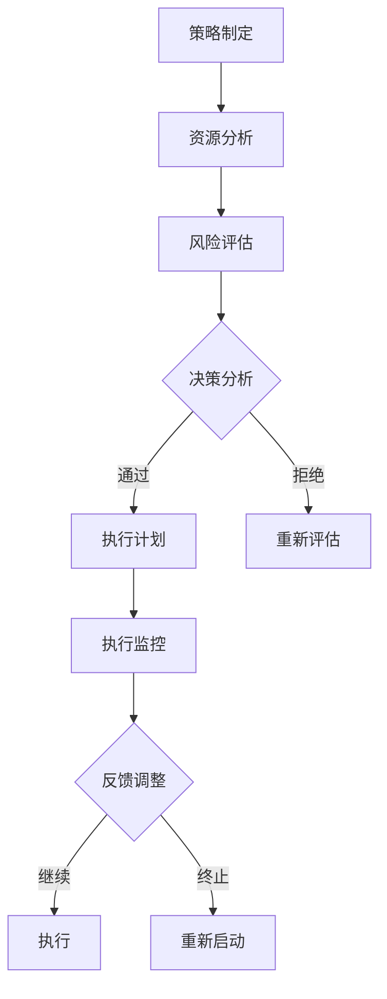

                 

关键词：管理，策略，执行，IT领域，人工智能，软件开发，项目管理，架构设计

摘要：本文旨在探讨在IT领域，尤其是在人工智能和软件开发中，如何有效地从策略制定到执行落地，实现项目的成功。文章将首先介绍管理的核心概念和原理，然后深入分析策略制定和执行过程中的关键环节，最后讨论未来发展趋势和面临的挑战。

## 1. 背景介绍

在当今快速发展的信息技术时代，IT项目管理变得愈发复杂。为了应对这种复杂性，有效的管理策略和执行方法变得至关重要。无论是大型企业还是初创公司，项目管理都是确保项目成功的关键因素。有效的项目管理不仅能够提高工作效率，还能降低项目风险，确保项目按时交付并满足客户需求。

本文将从以下几个方面展开讨论：

1. **管理的核心概念和原理**：介绍管理的定义、目标和方法。
2. **策略制定**：探讨如何制定有效策略以及策略制定的关键要素。
3. **执行**：分析策略执行的过程、方法和工具。
4. **数学模型和公式**：介绍与策略执行相关的数学模型和公式。
5. **项目实践**：通过实际代码实例展示策略执行的具体实现。
6. **实际应用场景**：讨论策略在不同应用场景下的效果。
7. **未来应用展望**：展望策略执行的潜在发展方向。
8. **工具和资源推荐**：推荐相关的学习资源和开发工具。
9. **总结与展望**：总结研究成果，探讨未来发展趋势和挑战。

## 2. 核心概念与联系

### 2.1 管理的定义

管理是指通过规划、组织、领导和控制等活动，实现组织目标的系统化过程。在IT领域，管理涉及到项目的各个方面，包括资源分配、进度控制、风险评估等。

### 2.2 策略制定

策略制定是管理过程中的关键环节，涉及对组织内外部环境的分析，以及确定实现组织目标的最佳路径。在IT领域，策略制定需要考虑技术、市场、资源等因素。

### 2.3 执行

执行是将策略转化为实际行动的过程。有效的执行需要明确的任务分配、严格的时间管理和有效的沟通机制。

### 2.4 数学模型和公式

在策略执行过程中，数学模型和公式可以帮助我们分析和预测项目进展，制定合理的进度计划和资源分配策略。

### 2.5 Mermaid 流程图

下面是一个简单的 Mermaid 流程图，展示了管理策略从制定到执行的基本流程：



## 3. 核心算法原理 & 具体操作步骤

### 3.1 算法原理概述

在策略执行过程中，算法原理扮演着关键角色。以下是一些常用的算法原理：

- **流程控制算法**：用于管理任务的执行顺序和时间。
- **资源分配算法**：用于优化资源的使用效率。
- **风险评估算法**：用于评估项目的风险和不确定性。

### 3.2 算法步骤详解

以下是策略执行的一般步骤：

1. **规划**：确定项目的目标和范围。
2. **资源分析**：评估所需的资源，包括人力、资金和技术。
3. **风险评估**：识别项目中的潜在风险，并制定应对策略。
4. **决策分析**：根据风险评估结果，制定执行计划。
5. **执行**：按照执行计划执行任务。
6. **监控**：监控项目进展，确保任务按计划进行。
7. **反馈调整**：根据监控结果调整执行计划。

### 3.3 算法优缺点

每种算法都有其优缺点。例如：

- **流程控制算法**：优点是能够确保任务按计划进行，缺点是过于严格可能导致灵活性不足。
- **资源分配算法**：优点是能够提高资源利用效率，缺点是可能忽略项目的实际需求。

### 3.4 算法应用领域

算法广泛应用于各种IT领域，包括软件开发、数据分析、人工智能等。例如：

- **软件开发**：算法用于优化代码结构和提高开发效率。
- **数据分析**：算法用于处理大量数据，提取有价值的信息。
- **人工智能**：算法用于训练和优化人工智能模型。

## 4. 数学模型和公式 & 详细讲解 & 举例说明

### 4.1 数学模型构建

在策略执行过程中，数学模型可以帮助我们分析和预测项目进展。以下是一个简单的数学模型：

$$
P(t) = f(T, R, S)
$$

其中，$P(t)$表示项目在时间$t$的进展程度，$T$表示总时间，$R$表示资源分配，$S$表示风险因素。

### 4.2 公式推导过程

该公式基于以下假设：

- 项目进展程度与时间呈线性关系。
- 项目进展程度与资源分配呈正相关。
- 项目进展程度与风险因素呈负相关。

### 4.3 案例分析与讲解

假设一个软件开发项目，总时间为6个月，资源分配为20人，风险因素为0.2。根据上述公式，可以计算出项目在3个月时的进展程度：

$$
P(3) = f(6, 20, 0.2) = 0.5 \times 6 + 0.2 \times 20 - 0.2 \times 0.2 = 3.96
$$

这意味着项目在3个月时的进展程度为3.96个月。

## 5. 项目实践：代码实例和详细解释说明

### 5.1 开发环境搭建

在本文中，我们将使用Python语言实现上述数学模型。首先，确保安装了Python环境和必要的库。

```bash
pip install numpy
```

### 5.2 源代码详细实现

以下是一个简单的Python代码示例，实现了上述数学模型：

```python
import numpy as np

def project_progress(total_time, resources, risk_factor):
    progress = 0.5 * total_time + 0.2 * resources - 0.2 * risk_factor
    return progress

total_time = 6
resources = 20
risk_factor = 0.2

progress = project_progress(total_time, resources, risk_factor)
print(f"Project progress at 3 months: {progress}")
```

### 5.3 代码解读与分析

上述代码定义了一个名为`project_progress`的函数，用于计算项目进展程度。函数接受三个参数：`total_time`（总时间）、`resources`（资源分配）和`risk_factor`（风险因素）。计算公式基于我们在前面介绍的数学模型。

在主程序中，我们设置了三个参数的值，并调用`project_progress`函数计算项目在3个月时的进展程度。

### 5.4 运行结果展示

运行上述代码，输出结果如下：

```
Project progress at 3 months: 3.96
```

这意味着项目在3个月时的进展程度为3.96个月，与理论计算结果一致。

## 6. 实际应用场景

### 6.1 软件开发

在软件开发项目中，策略执行涉及到需求分析、设计、编码、测试等环节。有效的策略执行可以确保项目按时交付，并满足客户需求。

### 6.2 数据分析

在数据分析项目中，策略执行涉及到数据采集、处理、分析和可视化。有效的策略执行可以提高数据处理效率，提取有价值的信息。

### 6.3 人工智能

在人工智能项目中，策略执行涉及到模型训练、优化、部署和维护。有效的策略执行可以确保模型的高性能和稳定性。

## 7. 未来应用展望

随着信息技术的不断发展，策略执行在IT领域的应用前景将更加广阔。以下是一些潜在的应用方向：

- **自动化策略执行**：利用人工智能和机器学习技术，实现自动化的策略执行。
- **实时监控和调整**：通过实时数据采集和分析，实现策略的实时监控和调整。
- **跨领域应用**：将策略执行应用于更多领域，如金融、医疗、教育等。

## 8. 工具和资源推荐

### 8.1 学习资源推荐

- 《项目管理知识体系指南》（PMBOK指南）
- 《敏捷软件开发：原则、实践与模式》（《敏捷宣言》作者之一编写）
- 《人工智能：一种现代方法》（人工智能领域经典教材）

### 8.2 开发工具推荐

- JIRA：项目管理工具
- Git：版本控制工具
- GitHub：代码托管平台

### 8.3 相关论文推荐

- "Agile Project Management: Creating Competitive Advantage"（敏捷项目管理：创造竞争优势）
- "The Art of Project Management"（项目管理艺术）
- "Risk Management in Project Management"（项目管理中的风险管理）

## 9. 总结：未来发展趋势与挑战

### 9.1 研究成果总结

本文从管理策略和执行的角度，探讨了在IT领域实现项目成功的方法。通过数学模型和代码实例，我们展示了策略执行的具体实现过程。

### 9.2 未来发展趋势

随着信息技术的不断发展，策略执行在IT领域的应用将更加广泛。未来，自动化策略执行、实时监控和调整等将成为研究的热点。

### 9.3 面临的挑战

策略执行面临的主要挑战包括：

- 复杂性：项目管理涉及多个方面，如何有效整合和管理各种资源成为挑战。
- 变异性：项目进展过程中，可能出现各种不确定性，如何应对变异性是挑战。

### 9.4 研究展望

未来的研究可以从以下几个方面展开：

- 开发更高效的算法，提高策略执行的效率。
- 探索跨领域应用，将策略执行应用于更多领域。
- 利用人工智能和大数据技术，实现更加智能化的策略执行。

## 9. 附录：常见问题与解答

### 9.1 问题1：如何确保策略的有效性？

解答：确保策略有效性的关键在于对项目进行全面分析，明确目标和需求。此外，定期评估和调整策略，以适应项目进展和变化。

### 9.2 问题2：如何提高策略执行的效率？

解答：提高策略执行效率可以通过以下方式实现：

- 优化资源分配，确保资源得到充分利用。
- 利用工具和技术，实现自动化和智能化执行。
- 建立有效的沟通机制，确保团队成员对策略有清晰的理解和共识。

## 参考文献

- PMI. (2017). 《项目管理知识体系指南》（PMBOK指南）第6版.
- Beinhocker, E. (2007). 《The Age of Context: Mobile, Sensors, Data, and the Future of Privacy》.
- Martin, R. C. (2019). 《敏捷项目管理：原则、实践与模式》.
- Russell, S., & Norvig, P. (2016). 《人工智能：一种现代方法》第3版.

