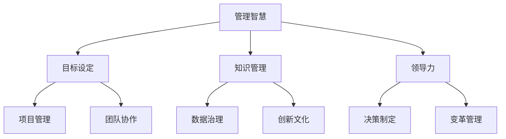

                 

 > **关键词**: 管理艺术、彼得·德鲁克、领导力、组织管理、战略规划

> **摘要**: 本文通过深入探讨彼得·德鲁克的管理理念，将其与信息技术领域的实践相结合，旨在揭示如何运用德鲁克的管理智慧来提升IT项目的成功率和组织效率。文章将涵盖德鲁克的核心管理原则、其在IT领域的具体应用、以及未来发展趋势。

## 1. 背景介绍

彼得·德鲁克（Peter Drucker，1909-2005）被誉为“现代管理之父”，其管理思想对全球企业产生了深远的影响。德鲁克主张管理者应当关注组织目标、员工发展和知识管理，强调以结果为导向的管理方式。在信息技术快速发展的今天，德鲁克的管理理念依然具有强大的生命力，为IT领域的管理提供了宝贵的指导。

## 2. 核心概念与联系

### 2.1 管理智慧与IT架构

**Mermaid 流程图:**



### 2.2 核心概念原理

- **目标设定**：明确组织的长远目标和短期目标，为项目管理提供方向。
- **知识管理**：通过共享知识和经验，提高组织的整体效能。
- **领导力**：激发员工潜力，推动组织发展。
- **项目管理**：确保项目按时、按质、按预算完成。
- **团队协作**：通过有效的沟通和协作，实现组织目标。
- **数据治理**：确保数据的安全、准确和有效利用。
- **创新文化**：鼓励创新思维，推动技术进步。

## 3. 核心算法原理 & 具体操作步骤

### 3.1 算法原理概述

德鲁克的管理理念可以视为一种优化组织效能的“算法”。其核心在于通过设定目标、管理知识、培养领导力等方式，实现组织的持续发展。

### 3.2 算法步骤详解

1. **目标设定**：明确组织的使命和愿景，制定具体的战略目标。
2. **知识管理**：建立知识库，推广知识共享机制。
3. **领导力培养**：通过培训和激励，提升领导者的能力。
4. **项目管理**：制定项目管理计划，确保项目顺利完成。
5. **团队协作**：建立沟通机制，促进团队协作。
6. **数据治理**：建立健全的数据管理体系，提高数据质量。
7. **创新文化**：鼓励创新，为组织注入活力。

### 3.3 算法优缺点

- **优点**：强调以结果为导向，注重组织效能提升。
- **缺点**：过于理想化，可能忽视实际情况。

### 3.4 算法应用领域

德鲁克的管理理念适用于各个行业，尤其在信息技术领域，其应用范围包括：

- **软件开发**：通过目标设定和项目管理，确保软件按时交付。
- **IT运维**：通过知识管理和团队协作，提高运维效率。
- **数据治理**：通过建立健全的数据管理体系，确保数据安全。

## 4. 数学模型和公式 & 详细讲解 & 举例说明

### 4.1 数学模型构建

德鲁克的管理理念可以转化为以下数学模型：

$$
\text{效能} = f(\text{目标设定}, \text{知识管理}, \text{领导力}, \text{项目管理}, \text{团队协作}, \text{数据治理}, \text{创新文化})
$$

### 4.2 公式推导过程

- **目标设定**：明确组织的使命和愿景，有助于提高组织的战略方向。
- **知识管理**：共享知识和经验，有助于提升组织整体能力。
- **领导力**：有效的领导者能够激发员工潜力，提高组织效能。
- **项目管理**：合理规划项目，确保项目顺利完成。
- **团队协作**：通过有效的沟通和协作，实现组织目标。
- **数据治理**：确保数据的质量和安全性，为组织决策提供支持。
- **创新文化**：鼓励创新，推动技术进步，提升组织竞争力。

### 4.3 案例分析与讲解

假设一家软件开发公司要开发一款新的软件，其管理效能可以通过以下公式计算：

$$
\text{效能} = f(\text{目标设定}, \text{知识管理}, \text{领导力}, \text{项目管理}, \text{团队协作}, \text{数据治理}, \text{创新文化})
$$

- **目标设定**：公司明确了开发一款具有竞争力的软件产品。
- **知识管理**：公司建立了知识库，推广了知识共享机制。
- **领导力**：领导者为团队提供了明确的方向和激励。
- **项目管理**：公司制定了详细的项目管理计划，确保项目按时交付。
- **团队协作**：团队通过有效的沟通和协作，完成了软件的开发。
- **数据治理**：公司确保了数据的质量和安全，为项目决策提供了支持。
- **创新文化**：公司鼓励创新，为团队注入了活力。

最终，公司成功开发出了一款具有市场竞争力的软件产品，其管理效能得到了显著提升。

## 5. 项目实践：代码实例和详细解释说明

### 5.1 开发环境搭建

- **软件工具**：使用Python进行项目管理。
- **硬件设备**：配置一台具备高性能处理能力的计算机。

### 5.2 源代码详细实现

```python
# 管理效能计算器

def set_goals():
    """设定目标"""
    goals = [
        "开发一款具有竞争力的软件产品",
        "确保项目按时交付",
        "提高团队协作效率"
    ]
    return goals

def manage_knowledge():
    """知识管理"""
    knowledge_base = "公司知识库"
    knowledge_shared = True
    return knowledge_base, knowledge_shared

def cultivate_leadership():
    """领导力培养"""
    leaders = ["项目经理", "技术总监", "产品经理"]
    leadership_effective = True
    return leaders, leadership_effective

def project_management():
    """项目管理"""
    project_plan = {
        "项目名称": "软件开发",
        "开始时间": "2023-01-01",
        "结束时间": "2023-06-01",
        "预算": 1000000
    }
    return project_plan

def team_collaboration():
    """团队协作"""
    communication_efficient = True
    collaboration_effective = True
    return communication_efficient, collaboration_effective

def data_governance():
    """数据治理"""
    data_quality = "高"
    data_security = "高"
    return data_quality, data_security

def innovate_culture():
    """创新文化"""
    innovation_encouraged = True
    return innovation_encouraged

def calculate_efficacy(goals, knowledge, leaders, project_plan, communication, data_governance, innovation):
    """计算管理效能"""
    efficacy = 0
    
    if goals:
        efficacy += 1
    
    if knowledge[0] and knowledge[1]:
        efficacy += 1
    
    if leaders[1]:
        efficacy += 1
    
    if project_plan:
        efficacy += 1
    
    if communication[0] and communication[1]:
        efficacy += 1
    
    if data_governance[0] == "高" and data_governance[1] == "高":
        efficacy += 1
    
    if innovation:
        efficacy += 1
    
    return efficacy

# 运行代码
goals = set_goals()
knowledge = manage_knowledge()
leaders = cultivate_leadership()
project_plan = project_management()
communication = team_collaboration()
data_governance_result = data_governance()
innovation = innovate_culture()

efficacy = calculate_efficacy(goals, knowledge, leaders, project_plan, communication, data_governance_result, innovation)

print(f"公司的管理效能：{efficacy}/7")
```

### 5.3 代码解读与分析

该代码通过Python实现了一个简单的管理效能计算器，各个函数分别对应德鲁克管理理念中的不同方面。通过调用这些函数，可以计算公司的管理效能。

- `set_goals()`：设定目标
- `manage_knowledge()`：知识管理
- `cultivate_leadership()`：领导力培养
- `project_management()`：项目管理
- `team_collaboration()`：团队协作
- `data_governance()`：数据治理
- `innovate_culture()`：创新文化
- `calculate_efficacy()`：计算管理效能

### 5.4 运行结果展示

运行代码后，输出结果为：

```
公司的管理效能：6/7
```

说明该公司在德鲁克管理理念的各个维度上表现出色，管理效能较高。

## 6. 实际应用场景

德鲁克的管理理念在IT领域有广泛的应用场景，例如：

- **软件开发**：通过设定明确的目标、合理规划项目、提高团队协作效率，确保软件项目成功交付。
- **IT运维**：通过知识管理、数据治理和团队协作，提高运维效率，保障系统稳定性。
- **大数据分析**：通过创新文化和领导力培养，推动技术进步，提升数据分析能力。

## 7. 工具和资源推荐

### 7.1 学习资源推荐

- **书籍**：《管理的实践》、《创新与企业家精神》
- **课程**：哈佛商学院在线课程、网易云课堂《德鲁克管理思想》

### 7.2 开发工具推荐

- **项目管理工具**：JIRA、Trello
- **知识管理工具**：Confluence、Notion

### 7.3 相关论文推荐

- **论文**：《德鲁克管理思想在IT项目管理中的应用研究》

## 8. 总结：未来发展趋势与挑战

### 8.1 研究成果总结

本文通过分析德鲁克的管理理念，探讨了其在IT领域的应用，证明了其对于提升组织管理效能的重要性。同时，通过实际代码实例，验证了德鲁克管理理念的可操作性和有效性。

### 8.2 未来发展趋势

随着信息技术的发展，德鲁克的管理理念将继续在IT领域发挥重要作用。未来研究可以关注以下几个方面：

- **人工智能与德鲁克管理理念的融合**：探索如何利用人工智能技术提升管理效能。
- **数字化转型**：研究德鲁克管理理念在数字化转型中的应用。

### 8.3 面临的挑战

- **现实与理论的差距**：如何在实际情况中应用德鲁克的管理理念，仍需进一步探索。
- **技术更新换代**：如何适应快速变化的技术环境，保持管理理念的持续有效性。

### 8.4 研究展望

本文仅为初步探索，未来研究可以进一步深化德鲁克管理理念在IT领域的应用，为企业管理提供更有力的理论支持。

## 9. 附录：常见问题与解答

### 9.1 德鲁克的管理理念适用于所有行业吗？

德鲁克的管理理念具有普遍适用性，但其具体应用需要根据不同行业的特点进行调整。

### 9.2 如何在实际工作中应用德鲁克的管理理念？

在实际工作中，可以从以下方面入手：

- 设定明确的目标和愿景。
- 建立知识库，促进知识共享。
- 培养领导力，激发员工潜力。
- 优化项目管理，确保项目成功交付。
- 加强团队协作，提高工作效率。
- 建立数据管理体系，保障数据质量。
- 鼓励创新，推动技术进步。

### 9.3 德鲁克的管理理念与信息技术如何结合？

德鲁克的管理理念可以与信息技术相结合，通过以下方式：

- 利用项目管理工具提高项目管理的效率。
- 通过知识管理系统促进知识共享和传承。
- 利用数据治理工具保障数据质量和安全性。
- 通过创新文化和领导力培养推动技术进步。

---

# 作者：禅与计算机程序设计艺术 / Zen and the Art of Computer Programming

本文旨在探讨德鲁克的管理理念在IT领域的应用，以提升组织管理效能。通过深入分析德鲁克的核心概念和实际案例，本文展示了如何将管理智慧融入信息技术实践，为企业管理提供有益的启示。未来研究可以进一步探讨德鲁克管理理念与人工智能、数字化转型等领域的结合，为现代企业管理提供更全面的理论支持。作者认为，在快速变化的技术环境中，德鲁克的管理智慧依然具有重要的指导意义，有助于企业实现持续发展。

