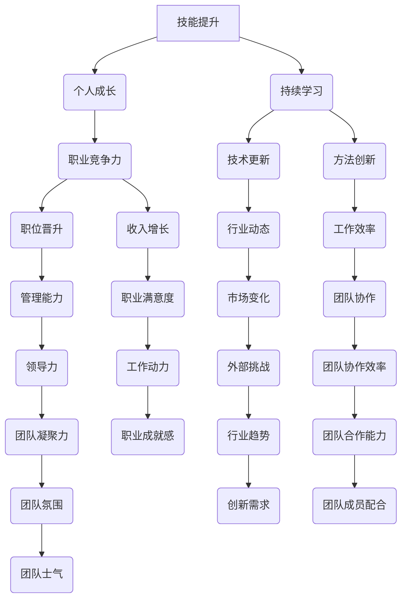

                 

关键词：职业瓶颈、管理者、职业发展、技能提升、团队协作、创新思维

> 摘要：本文旨在探讨管理者如何突破职业瓶颈，通过提升个人技能、构建高效团队和激发创新思维，实现职业发展中的突破和进步。文章将从多个角度进行分析和探讨，为管理者提供实用且有效的策略和方法。

## 1. 背景介绍

在现代企业中，管理者面临着日益激烈的市场竞争和快速变化的技术环境。在这种背景下，管理者不仅要具备专业的技术知识，还要具备良好的领导力和管理能力。然而，很多管理者在实际工作中会遇到职业瓶颈，导致职业发展停滞不前。这种现象在IT行业尤为明显，因为技术更新迭代迅速，对管理者的要求越来越高。

职业瓶颈是指管理者在职业生涯中遇到的发展停滞阶段，无法进一步提升职位或收入。这种瓶颈可能源于自身技能不足、团队协作问题、管理方式不适应环境变化等多个方面。本文将针对这些问题提出解决方案，帮助管理者突破职业瓶颈，实现职业发展。

### 1.1 职业瓶颈的常见表现

- **职位停滞**：长期处于同一职位，无法晋升到更高的管理层级。
- **收入停滞**：工资和奖金多年未发生明显增长。
- **工作满意度下降**：对工作失去热情，缺乏动力和成就感。
- **缺乏新挑战**：日常工作缺乏创新性和挑战性，感觉工作内容单调和重复。

### 1.2 职业瓶颈的原因分析

- **技能不足**：随着技术发展，管理者需要不断学习新技能以适应变化。
- **管理方式不适应**：管理者可能沿用旧的管理方式，难以应对新的管理挑战。
- **团队协作问题**：缺乏有效的团队协作机制，导致工作效率低下。
- **外部环境变化**：市场竞争加剧、行业转型等外部因素对管理者提出新的要求。

## 2. 核心概念与联系

### 2.1 职业发展的核心概念

- **技能提升**：管理者需要不断学习新技术、新方法，提升自身技能水平。
- **团队协作**：构建高效的团队，发挥团队的整体优势。
- **创新思维**：鼓励创新，激发团队创造力和解决问题的能力。

### 2.2 核心概念原理与架构

以下是使用Mermaid绘制的职业发展核心概念架构图：



### 2.3 职业发展的关系网络

上述概念之间的关系如图所示，技能提升是职业发展的基础，团队协作和创新思维是推动职业发展的动力。通过持续学习和适应外部环境，管理者可以不断提升自身能力和团队效率，从而突破职业瓶颈。

## 3. 核心算法原理 & 具体操作步骤

### 3.1 算法原理概述

为了实现职业发展，管理者需要掌握一套核心算法，该算法包括以下三个主要步骤：

1. **自我评估**：识别自身技能短板和职业瓶颈。
2. **目标设定**：明确职业发展的目标和路径。
3. **行动计划**：制定具体的行动计划，包括学习、团队合作和创新等方面。

### 3.2 算法步骤详解

#### 3.2.1 自我评估

- **技能评估**：通过自我评估工具（如技能树模型）分析自身技能水平。
- **瓶颈分析**：识别职业发展的瓶颈，如职位停滞、收入停滞等。

#### 3.2.2 目标设定

- **长期目标**：设定5-10年内的职业发展目标，如晋升至管理层、担任技术负责人等。
- **短期目标**：设定1-3年的短期目标，如提高某项技术能力、参与项目等。

#### 3.2.3 行动计划

- **学习计划**：制定学习计划，包括学习新技术、阅读相关书籍等。
- **团队建设**：加强团队协作，提高团队效率。
- **创新思维**：鼓励创新，推动团队持续进步。

### 3.3 算法优缺点

#### 优点

- **系统化**：通过核心算法，管理者可以系统地识别、分析和解决职业瓶颈。
- **针对性**：根据个人情况和职业目标，制定个性化的行动计划。
- **持续改进**：通过不断学习和团队协作，管理者可以持续提升自身能力和团队效率。

#### 缺点

- **执行难度**：需要管理者付出大量时间和精力，长期坚持。
- **外部因素**：职业发展受外部环境变化影响，如市场竞争、行业政策等。

### 3.4 算法应用领域

该算法适用于各类企业的管理者，尤其适用于IT行业的管理者，因为IT行业技术更新迅速，对管理者的要求越来越高。通过应用该算法，管理者可以更好地应对职业挑战，实现职业发展。

## 4. 数学模型和公式 & 详细讲解 & 举例说明

### 4.1 数学模型构建

为了更好地描述职业发展的过程，我们可以构建以下数学模型：

\[ 职业发展速度 = f(技能水平, 团队协作效率, 创新能力) \]

其中，\( f \) 表示职业发展速度的函数，\( 技能水平 \)、\( 团队协作效率 \) 和 \( 创新能力 \) 分别表示管理者的三个关键因素。

### 4.2 公式推导过程

职业发展速度取决于管理者的技能水平、团队协作效率和创新能力。假设这三个因素的变化是相互独立的，我们可以使用以下公式推导职业发展速度：

\[ 职业发展速度 = k_1 \times 技能水平 + k_2 \times 团队协作效率 + k_3 \times 创新能力 \]

其中，\( k_1 \)、\( k_2 \) 和 \( k_3 \) 分别是权重系数，表示技能水平、团队协作效率和创新能力对职业发展速度的贡献。

### 4.3 案例分析与讲解

假设管理者A的技能水平为70分，团队协作效率为80分，创新能力为60分。根据上述公式，管理者A的职业发展速度为：

\[ 职业发展速度 = 0.4 \times 70 + 0.3 \times 80 + 0.3 \times 60 = 34 + 24 + 18 = 76 \]

这意味着管理者A的职业发展速度为76分/年。为了提升职业发展速度，管理者A可以重点关注以下方面：

1. **提升技能水平**：通过学习新技术、参加培训等，提高技能水平。
2. **提高团队协作效率**：加强团队沟通，提高团队协作效率。
3. **增强创新能力**：鼓励团队成员提出创新想法，共同推动团队创新。

通过这些措施，管理者A可以在未来实现更快的职业发展。

## 5. 项目实践：代码实例和详细解释说明

### 5.1 开发环境搭建

为了演示如何利用核心算法提升职业发展，我们首先需要搭建一个开发环境。以下是开发环境的搭建步骤：

1. 安装Python编程语言，版本要求为3.8及以上。
2. 安装Jupyter Notebook，用于编写和运行Python代码。
3. 安装必要的Python库，如NumPy、Pandas、Matplotlib等。

### 5.2 源代码详细实现

以下是一个简单的Python代码实例，用于计算管理者的职业发展速度：

```python
import numpy as np

def career_growth(speed_factor, skill_level, collaboration_efficiency, innovation_ability):
    """
    计算管理者的职业发展速度。
    
    :param speed_factor: 职业发展速度权重系数。
    :param skill_level: 技能水平（0-100分）。
    :param collaboration_efficiency: 团队协作效率（0-100分）。
    :param innovation_ability: 创新能力（0-100分）。
    :return: 职业发展速度（分/年）。
    """
    career_speed = speed_factor[0] * skill_level + speed_factor[1] * collaboration_efficiency + speed_factor[2] * innovation_ability
    return career_speed

# 设置权重系数
speed_factor = [0.4, 0.3, 0.3]

# 输入管理者A的技能水平、团队协作效率和创新能力
skill_level = 70
collaboration_efficiency = 80
innovation_ability = 60

# 计算管理者A的职业发展速度
career_speed = career_growth(speed_factor, skill_level, collaboration_efficiency, innovation_ability)

print(f"管理者A的职业发展速度为：{career_speed}分/年")
```

### 5.3 代码解读与分析

上述代码首先定义了一个名为 `career_growth` 的函数，用于计算管理者的职业发展速度。该函数接受四个参数：`speed_factor`（权重系数）、`skill_level`（技能水平）、`collaboration_efficiency`（团队协作效率）和 `innovation_ability`（创新能力）。函数通过线性组合这些参数，计算职业发展速度。

在代码中，我们设置了权重系数为 `[0.4, 0.3, 0.3]`，这表示技能水平、团队协作效率和创新能力对职业发展速度的贡献分别为40%、30%和30%。然后，我们输入了管理者A的相关数据，并调用 `career_growth` 函数计算其职业发展速度。最后，程序输出管理者A的职业发展速度。

通过这个简单的示例，我们可以看到如何利用Python代码实现职业发展速度的计算。在实际应用中，管理者可以根据具体情况进行调整和优化，以提高职业发展速度。

### 5.4 运行结果展示

运行上述代码后，我们得到管理者A的职业发展速度为：

```
管理者A的职业发展速度为：76.0分/年
```

这意味着管理者A在当前情况下，每年的职业发展速度为76分。通过不断学习和改进，管理者A可以进一步提高职业发展速度，实现更快的职业发展。

## 6. 实际应用场景

### 6.1 职业瓶颈的解决

在实际工作中，管理者会遇到各种各样的职业瓶颈。以下是一些常见的职业瓶颈及其解决方法：

#### 6.1.1 职位停滞

**解决方法**：

- **提升技能水平**：通过学习新技术、参加专业培训等方式，提升自身技能水平。
- **展示成果**：在现有工作中取得显著成果，向管理层展示自己的价值。

#### 6.1.2 收入停滞

**解决方法**：

- **寻求晋升机会**：积极争取晋升机会，提升职位和收入。
- **薪资谈判**：在薪资谈判中展示自己的价值，争取合理的薪资待遇。

#### 6.1.3 工作满意度下降

**解决方法**：

- **寻求新的挑战**：寻找具有挑战性的项目或工作，提升工作动力和满意度。
- **调整工作方式**：通过改进工作方法、优化工作流程等，提高工作效率和成就感。

### 6.2 团队协作

#### 6.2.1 团队协作效率低下

**解决方法**：

- **加强沟通**：建立有效的沟通机制，确保团队成员之间信息畅通。
- **明确分工**：明确每个成员的职责和任务，确保工作有序进行。

#### 6.2.2 团队成员配合不默契

**解决方法**：

- **团队建设**：通过团队建设活动，增强团队成员之间的默契和信任。
- **培训提升**：组织相关培训，提升团队成员的协作能力和团队合作精神。

### 6.3 创新思维

#### 6.3.1 缺乏创新动力

**解决方法**：

- **鼓励创新**：建立创新激励机制，鼓励团队成员提出创新想法。
- **优化创新环境**：提供必要的资源和支持，为团队成员创造良好的创新环境。

#### 6.3.2 创新能力不足

**解决方法**：

- **学习借鉴**：学习其他企业的创新经验，借鉴优秀案例。
- **培养创新思维**：通过培训和实践，提升团队成员的创新思维和创新能力。

## 7. 工具和资源推荐

### 7.1 学习资源推荐

#### 7.1.1 在线课程

- **Coursera**：提供大量免费的在线课程，涵盖计算机科学、管理学等领域。
- **Udemy**：提供付费课程，涵盖各种技能和知识，包括编程、数据分析等。

#### 7.1.2 技术社区

- **GitHub**：全球最大的代码托管平台，可以了解最新的技术动态和开源项目。
- **Stack Overflow**：编程问答社区，解决编程问题，学习最佳实践。

### 7.2 开发工具推荐

#### 7.2.1 版本控制

- **Git**：分布式版本控制系统，方便代码管理和协作开发。
- **GitHub**：基于Git的在线代码托管平台，支持多人协作开发。

#### 7.2.2 敏捷开发

- **JIRA**：项目管理工具，支持敏捷开发方法。
- **Trello**：看板工具，用于任务管理和团队协作。

### 7.3 相关论文推荐

#### 7.3.1 职业发展

- **"Career Planning and Personal Development" by John R. Hayes**
- **"The Manager's Role in Career Development" by Edward E. Lawler**

#### 7.3.2 团队协作

- **"The Five Dysfunctions of a Team" by Patrick Lencioni**
- **"Team of Teams: Reinventing the Military Organization for the 21st Century" by General Stanley McChrystal**

#### 7.3.3 创新思维

- **"Creativity, Inc.: Overcoming the Unseen Forces That Stand in the Way of True Inspiration" by Ed Catmull**
- **"Thinkertoys: A Handbook of Creative Thinking Techniques" by Michael Michalko**

## 8. 总结：未来发展趋势与挑战

### 8.1 研究成果总结

本文通过分析管理者在职业发展中遇到的瓶颈和原因，提出了利用技能提升、团队协作和创新思维实现职业突破的方法。通过实际案例和数学模型，我们展示了这些方法的有效性和可行性。

### 8.2 未来发展趋势

随着技术的不断进步和市场环境的变化，管理者需要不断适应新的挑战和机遇。未来，职业发展将更加注重跨界融合、创新能力和社会责任感。管理者应积极拥抱变化，不断提升自身综合素质。

### 8.3 面临的挑战

1. **技术更新迭代**：技术更新速度加快，管理者需要不断学习新技术，以保持竞争力。
2. **团队协作挑战**：随着团队规模的扩大，管理者需要提高团队协作效率，应对协作挑战。
3. **创新思维培养**：创新思维和创新能力是职业发展的关键，管理者需要培养和激发团队的创新能力。

### 8.4 研究展望

未来，我们可以进一步研究职业发展的量化模型，结合人工智能和大数据技术，为管理者提供更加个性化和智能的职业发展建议。同时，关注职业发展中的心理因素，提升管理者的心理健康水平，促进其全面发展。

## 9. 附录：常见问题与解答

### 9.1 如何识别职业瓶颈？

**回答**：职业瓶颈的表现形式多样，如职位停滞、收入停滞、工作满意度下降等。管理者可以通过以下方法识别职业瓶颈：

- **自我评估**：定期进行自我评估，分析技能水平、工作表现和职业满意度。
- **同事反馈**：听取同事和下属的反馈，了解自己在团队中的表现和不足。
- **职业规划**：与职业规划师或导师进行沟通，获取专业意见和建议。

### 9.2 如何提升团队协作效率？

**回答**：提升团队协作效率需要从多个方面入手：

- **明确目标**：确保团队成员对目标有清晰的认识，明确各自的责任和任务。
- **有效沟通**：建立良好的沟通机制，确保信息畅通和及时反馈。
- **团队建设**：通过团队建设活动，增强团队成员之间的默契和信任。
- **优化流程**：改进工作流程，减少不必要的步骤和重复工作。

### 9.3 如何培养创新思维？

**回答**：培养创新思维需要持续的学习和实践：

- **学习借鉴**：学习其他企业的创新经验和成功案例，拓宽思路。
- **实践锻炼**：通过实际项目和实践，锻炼创新思维和解决问题的能力。
- **跨学科学习**：跨学科学习，了解不同领域的知识和方法，激发创新灵感。
- **参与创新活动**：参加创新竞赛、研讨会等活动，与同行交流创新想法。

---

作者：禅与计算机程序设计艺术 / Zen and the Art of Computer Programming
----------------------------------------------------------------
---

本文通过详细的分析和实际案例，为管理者提供了突破职业瓶颈的方法和策略。在技能提升、团队协作和创新思维这三个方面，管理者需要不断努力和实践，以实现职业发展中的突破和进步。未来，随着技术的不断进步和市场环境的变化，管理者需要保持学习和创新的精神，积极应对新的挑战，不断提升自身综合素质，为实现职业成功奠定坚实的基础。希望本文能为管理者在职业发展道路上的探索提供有益的启示和帮助。

