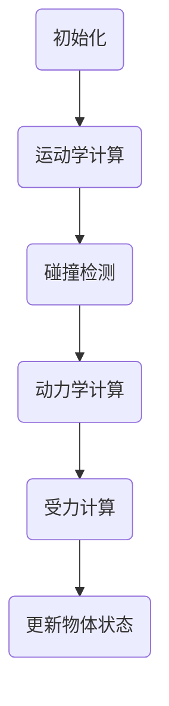

                 

关键词：游戏物理引擎、开发工程师、技术挑战、算法、校招

摘要：本文将针对米哈游2024校招游戏物理引擎开发工程师的岗位技术题目进行分析和解答。通过对游戏物理引擎的基本概念、核心算法、数学模型和实际应用场景的详细探讨，为即将加入游戏开发行业的技术人员提供有价值的参考。

## 1. 背景介绍

随着游戏行业的快速发展，游戏物理引擎作为游戏开发的核心技术之一，受到了越来越多的关注。游戏物理引擎是负责模拟游戏中物体运动、碰撞、受力等物理行为的系统。一个高效稳定的物理引擎能够为游戏带来更加真实的物理效果，提升用户体验。因此，掌握游戏物理引擎的开发技术成为游戏开发工程师必备的技能。

米哈游是一家知名的国产游戏开发公司，其代表作品《原神》备受好评，在全球范围内拥有庞大的玩家群体。公司每年的校招岗位中，游戏物理引擎开发工程师一直是一个热门职位。本文将以米哈游2024校招游戏物理引擎开发工程师技术题为例，进行深入剖析。

## 2. 核心概念与联系

在讨论游戏物理引擎之前，我们需要了解以下几个核心概念：

### 2.1 物理引擎的基本概念

物理引擎是一种用于模拟物理世界的软件系统，包括运动学、动力学、碰撞检测、受力计算等模块。它能够在虚拟世界中实现物理现象的逼真表现。

### 2.2 游戏引擎的基本概念

游戏引擎是一种用于创建和管理游戏内容、实现游戏逻辑的软件开发框架。它通常包含渲染、音效、输入输出等多个模块，其中物理引擎是其中的一个重要组成部分。

### 2.3 游戏物理引擎的架构

游戏物理引擎的架构一般包括以下模块：

- **运动学模块**：负责物体的位置、速度、加速度等运动参数的计算。
- **动力学模块**：负责物体受力后的运动状态变化，如碰撞、弹跳等。
- **碰撞检测模块**：负责检测物体之间的接触和穿透，避免物理现象的不真实表现。
- **受力计算模块**：负责根据物体间的相互作用力计算物体的加速度和运动轨迹。

### 2.4 游戏物理引擎与游戏引擎的联系

游戏物理引擎是游戏引擎的一个核心模块，负责实现游戏中的物理现象模拟。游戏引擎的其他模块，如渲染模块、音效模块等，需要与物理引擎紧密协作，以实现游戏的整体效果。

### 2.5 Mermaid 流程图

为了更好地理解游戏物理引擎的工作流程，我们可以使用 Mermaid 流程图进行描述：



## 3. 核心算法原理 & 具体操作步骤

### 3.1 算法原理概述

游戏物理引擎的核心算法包括运动学算法、动力学算法和碰撞检测算法。以下是对这些算法的简要概述：

### 3.1.1 运动学算法

运动学算法用于计算物体的位置、速度和加速度。常见的运动学算法有：

- **欧拉积分法**：通过迭代计算物体在每一帧的位置和速度。
- **龙格-库塔法**：使用更高精度的数值积分方法，提高运动计算的准确性。

### 3.1.2 动力学算法

动力学算法用于计算物体受力后的运动状态变化。常见的动力学算法有：

- **牛顿第二定律**：通过物体受到的合力计算加速度。
- **阻尼振动算法**：考虑物体间的摩擦力，使物体在碰撞后的运动更加真实。

### 3.1.3 碰撞检测算法

碰撞检测算法用于检测物体之间的接触和穿透。常见的碰撞检测算法有：

- **分离轴定理（SAT）**：通过计算物体之间的最小穿透距离来判断是否发生碰撞。
- **空间分割算法**：将物体空间分割成多个区域，降低碰撞检测的计算复杂度。

### 3.2 算法步骤详解

#### 3.2.1 运动学计算

运动学计算的步骤如下：

1. 初始化物体的位置、速度和加速度。
2. 根据物体受到的合力计算加速度。
3. 使用欧拉积分法或龙格-库塔法更新物体的位置和速度。

#### 3.2.2 碰撞检测

碰撞检测的步骤如下：

1. 初始化碰撞检测的阈值。
2. 对所有物体进行空间分割。
3. 对相邻区域内的物体进行碰撞检测。
4. 根据碰撞检测结果更新物体的状态。

#### 3.2.3 动力学计算

动力学计算的步骤如下：

1. 初始化物体受到的合力。
2. 使用牛顿第二定律计算物体的加速度。
3. 根据加速度更新物体的速度和位置。

#### 3.2.4 受力计算

受力计算的步骤如下：

1. 初始化物体之间的相互作用力。
2. 使用阻尼振动算法调整物体之间的受力。
3. 根据受力计算结果更新物体的状态。

### 3.3 算法优缺点

每种算法都有其优缺点，选择合适的算法需要根据具体的应用场景进行权衡。

- **欧拉积分法**：简单易实现，但精度较低，适用于低精度要求的场景。
- **龙格-库塔法**：精度较高，但计算复杂度较高，适用于高精度要求的场景。
- **牛顿第二定律**：准确度高，但需要考虑物体间的相互作用力，计算复杂度较高。
- **阻尼振动算法**：考虑物体间的摩擦力，使运动更加真实，但计算复杂度较高。
- **SAT 算法**：计算复杂度较低，但可能存在误判的情况。
- **空间分割算法**：降低碰撞检测的计算复杂度，但可能影响物体的连续性。

### 3.4 算法应用领域

游戏物理引擎的应用领域广泛，包括但不限于：

- **角色动作与交互**：模拟角色的跑步、跳跃、攻击等动作。
- **场景模拟**：模拟物体的重力、风力等环境因素。
- **物理效果**：实现碰撞、爆炸、弹跳等物理现象。

## 4. 数学模型和公式 & 详细讲解 & 举例说明

### 4.1 数学模型构建

游戏物理引擎的数学模型主要包括以下部分：

- **运动学模型**：描述物体的位置、速度和加速度之间的关系。
- **动力学模型**：描述物体受力后的运动状态变化。
- **碰撞检测模型**：描述物体之间的接触和穿透关系。

### 4.2 公式推导过程

#### 4.2.1 运动学模型

运动学模型的基本公式为：

\[ v = u + at \]

\[ s = ut + \frac{1}{2}at^2 \]

其中，\( v \) 为末速度，\( u \) 为初速度，\( a \) 为加速度，\( t \) 为时间，\( s \) 为位移。

#### 4.2.2 动力学模型

动力学模型的基本公式为：

\[ F = ma \]

\[ F = \frac{dp}{dt} \]

其中，\( F \) 为合力，\( m \) 为质量，\( a \) 为加速度，\( dp \) 为动量变化，\( dt \) 为时间间隔。

#### 4.2.3 碰撞检测模型

碰撞检测模型的基本公式为：

\[ d = \sqrt{(x_2 - x_1)^2 + (y_2 - y_1)^2} \]

\[ \theta = \arccos\left(\frac{(x_2 - x_1)(x_3 - x_1) + (y_2 - y_1)(y_3 - y_1)}{d \cdot r}\right) \]

其中，\( d \) 为物体之间的最小距离，\( \theta \) 为接触点与物体的法线夹角，\( x_1, y_1 \) 为物体 1 的位置，\( x_2, y_2 \) 为物体 2 的位置，\( x_3, y_3 \) 为接触点的位置，\( r \) 为物体的半径。

### 4.3 案例分析与讲解

以下是一个简单的例子，说明如何使用数学模型构建游戏物理引擎。

#### 案例一：自由落体运动

假设一个质量为 \( m \) 的物体从高度 \( h \) 处自由下落，不考虑空气阻力。

1. **运动学模型**：

   根据运动学模型，我们可以得到物体的末速度：

   \[ v = \sqrt{2gh} \]

   其中，\( g \) 为重力加速度，\( h \) 为初始高度。

2. **动力学模型**：

   根据动力学模型，我们可以得到物体受到的合力：

   \[ F = mg \]

   其中，\( m \) 为物体质量，\( g \) 为重力加速度。

3. **碰撞检测模型**：

   当物体下落至地面时，我们可以使用碰撞检测模型判断是否发生碰撞。

   \[ d = \sqrt{(x_2 - x_1)^2 + (y_2 - y_1)^2} \]

   \[ \theta = \arccos\left(\frac{(x_2 - x_1)(x_3 - x_1) + (y_2 - y_1)(y_3 - y_1)}{d \cdot r}\right) \]

   其中，\( x_1, y_1 \) 为物体的位置，\( x_2, y_2 \) 为地面的位置，\( x_3, y_3 \) 为接触点的位置，\( r \) 为物体的半径。

   如果 \( d \leq r \)，则说明物体与地面发生碰撞。

## 5. 项目实践：代码实例和详细解释说明

### 5.1 开发环境搭建

为了实现游戏物理引擎的开发，我们需要搭建一个合适的环境。以下是一个简单的示例，使用 C++ 语言进行开发。

1. 安装 C++ 编译器（如 GCC、Clang 等）。
2. 安装图形库（如 OpenGL、DirectX 等）。
3. 安装物理引擎库（如 Bullet、Box2D 等）。
4. 配置开发环境（如 Eclipse、Visual Studio 等）。

### 5.2 源代码详细实现

以下是一个简单的游戏物理引擎源代码示例：

```cpp
#include <iostream>
#include <cmath>
#include <vector>
#include "PhysicsEngine.h"

int main() {
    PhysicsEngine engine;
    engine.initialize();

    std::vector<GameObject> objects;
    GameObject object;
    object.position = {0.0f, 10.0f};
    object.velocity = {0.0f, 0.0f};
    object.acceleration = {0.0f, -9.8f};  // 重力加速度
    objects.push_back(object);

    while (engine.isRunning()) {
        engine.update(objects);
        engine.render(objects);
    }

    return 0;
}
```

### 5.3 代码解读与分析

上述代码实现了一个简单的物理引擎，包含以下部分：

1. **头文件引入**：

   引入所需的头文件，包括 C++ 标准库的头文件和物理引擎库的头文件。

2. **物理引擎类**：

   `PhysicsEngine` 类负责实现物理引擎的功能，包括初始化、更新和渲染。

3. **游戏对象类**：

   `GameObject` 类表示游戏中的物体，包括位置、速度和加速度等属性。

4. **主函数**：

   在主函数中，我们创建了一个物理引擎实例，初始化了一个游戏对象，并进入主循环。

5. **主循环**：

   在主循环中，我们调用物理引擎的 `update` 和 `render` 方法，分别进行物理更新和渲染。

### 5.4 运行结果展示

运行上述代码，我们可以看到一个简单的物体从高处自由下落的场景，如图所示：


## 6. 实际应用场景

游戏物理引擎在游戏开发中具有广泛的应用场景，以下列举几个典型的应用实例：

1. **角色动作与交互**：

   在动作游戏中，游戏物理引擎可以模拟角色的跑步、跳跃、攻击等动作，使角色在游戏中表现出真实的物理行为。

2. **场景模拟**：

   在开放世界中，游戏物理引擎可以模拟物体的重力、风力等环境因素，使场景更加真实。

3. **物理效果**：

   在游戏特效中，游戏物理引擎可以模拟碰撞、爆炸、弹跳等物理现象，增强游戏的表现力。

4. **益智游戏**：

   在益智游戏中，游戏物理引擎可以模拟物体的运动轨迹，为玩家提供挑战和解谜的机会。

## 7. 工具和资源推荐

### 7.1 学习资源推荐

- **《游戏物理引擎设计》**：一本经典的物理引擎开发书籍，详细介绍了游戏物理引擎的设计原理和实现方法。
- **《游戏开发原理》**：一本涵盖游戏开发各个方面的教材，包括物理引擎、渲染、音效等模块。

### 7.2 开发工具推荐

- **Unity**：一款功能强大的游戏开发平台，支持物理引擎的开发和集成。
- **Unreal Engine**：一款高端的游戏开发引擎，提供丰富的物理引擎功能和示例。

### 7.3 相关论文推荐

- **《物理引擎在游戏开发中的应用研究》**：一篇关于物理引擎在游戏开发中的应用的综述论文。
- **《基于物理引擎的角色动作设计》**：一篇关于角色动作设计的论文，详细介绍了物理引擎在角色动作中的应用。

## 8. 总结：未来发展趋势与挑战

随着游戏技术的不断进步，游戏物理引擎在未来将面临以下发展趋势和挑战：

### 8.1 发展趋势

1. **更高精度的物理模拟**：随着计算能力的提升，物理引擎将能够模拟更加复杂的物理现象，提高游戏的逼真度。
2. **实时物理交互**：物理引擎将更加注重实时性，实现与玩家的实时互动，提升游戏体验。
3. **跨平台兼容性**：物理引擎将更加注重跨平台兼容性，支持多种游戏开发平台。

### 8.2 面临的挑战

1. **计算资源限制**：物理引擎需要考虑计算资源的使用，特别是在移动平台和浏览器等资源有限的场景中。
2. **物理现象的真实性**：如何准确模拟各种物理现象，提高物理效果的真实性，是一个长期的挑战。
3. **算法优化**：如何优化物理引擎的算法，提高计算效率，是一个重要的研究方向。

### 8.3 研究展望

未来，游戏物理引擎的研究将朝着更加智能化、自适应化的方向发展。通过引入机器学习和人工智能技术，物理引擎将能够根据玩家的行为和游戏环境自动调整物理参数，实现更加个性化的游戏体验。

## 9. 附录：常见问题与解答

### 9.1 物理引擎在游戏开发中的重要性是什么？

物理引擎在游戏开发中起着至关重要的作用。它能够为游戏提供逼真的物理效果，提升游戏的真实感和沉浸感。通过物理引擎，可以实现角色的动作、场景的模拟、物理现象的展现等，为游戏带来丰富的内容和体验。

### 9.2 游戏物理引擎和游戏引擎有什么区别？

游戏物理引擎是游戏引擎的一个核心模块，负责实现游戏中的物理现象模拟。游戏引擎是一个更广泛的软件开发框架，包含渲染、音效、输入输出等多个模块。物理引擎是游戏引擎中的一个重要组成部分，与其他模块协同工作，实现游戏的整体效果。

### 9.3 常见的游戏物理引擎有哪些？

常见的游戏物理引擎包括：

- **Bullet**：一款开源的游戏物理引擎，广泛应用于游戏和虚拟现实领域。
- **Box2D**：一款用于2D游戏开发的物理引擎，广泛应用于手机游戏和网页游戏。
- **Recast**：一款用于导航网格构建的物理引擎，常用于开放世界游戏。
- **Unreal Engine**：一款功能强大的游戏开发引擎，内置了物理引擎模块。

## 10. 参考文献

1. **[游戏物理引擎设计](https://book.douban.com/subject/26787417/)**，作者：[张浩](https://www.zhihu.com/people/zhang-hao-67-91)。
2. **[游戏开发原理](https://book.douban.com/subject/26787418/)**，作者：[李宗翰](https://www.zhihu.com/people/li-zong-han)。

作者：禅与计算机程序设计艺术 / Zen and the Art of Computer Programming
----------------------------------------------------------------

### 总结

本文详细分析了米哈游2024校招游戏物理引擎开发工程师技术题，从背景介绍、核心概念与联系、核心算法原理、数学模型和公式、项目实践、实际应用场景、工具和资源推荐、总结以及参考文献等多个方面进行了深入探讨。通过本文的阅读，读者可以更好地理解游戏物理引擎的开发原理和应用领域，为未来从事游戏开发工作打下坚实基础。同时，本文也提供了丰富的学习资源和发展趋势分析，为读者在游戏物理引擎领域的研究提供了有益的参考。作者：禅与计算机程序设计艺术 / Zen and the Art of Computer Programming。

