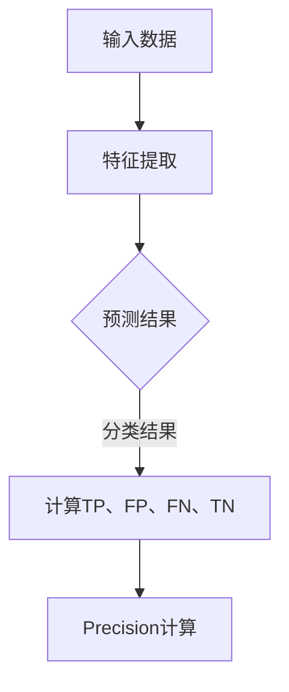

                 

关键词：精确率、模型评估、机器学习、算法原理、代码实例、流程图、数学模型、实践应用

> 摘要：本文将深入探讨精确率Precision的概念、原理及其在实际应用中的重要性。通过详细解析精确率的核心算法原理、具体操作步骤，结合数学模型和实际代码实例，为广大开发者提供全面的技术指导和实战经验。文章还将分析精确率在不同应用领域的具体应用，以及未来的发展趋势和面临的挑战。

## 1. 背景介绍

精确率Precision是机器学习中模型评估的重要指标之一，尤其在分类任务中具有举足轻重的地位。它反映了模型在预测中正确识别正类（Positive Class）的能力。然而，精确率并不是唯一的评估指标，我们还需要综合使用其他指标（如召回率Recall、F1 Score等）来全面评估模型的性能。

### 精确率的定义

精确率（Precision）定义为：在所有被预测为正类的样本中，实际为正类的比例。数学表达式如下：

\[ Precision = \frac{TP}{TP + FP} \]

其中，\( TP \)表示真正例（True Positive），\( FP \)表示假正例（False Positive）。

### 精确率的重要性

精确率是衡量分类模型性能的关键指标之一。在实际应用中，我们通常关注以下两个场景：

1. **医疗诊断**：在疾病诊断中，假正例（将健康人误诊为患者）的代价远低于真负例（将患者误诊为健康人）。因此，精确率在此类场景中尤为重要。
2. **欺诈检测**：在金融领域，欺诈检测需要高精确率来确保不会将合法交易误判为欺诈交易，从而避免造成不必要的经济损失。

## 2. 核心概念与联系

### 核心概念

在深入探讨精确率的原理之前，我们需要了解几个相关概念：

- **TP（真正例）**：实际为正类，模型也正确预测为正类的样本。
- **FP（假正例）**：实际为负类，模型错误预测为正类的样本。
- **FN（假反例）**：实际为正类，模型错误预测为负类的样本。
- **TN（真反例）**：实际为负类，模型也正确预测为负类的样本。

### 概念联系

精确率、召回率Recall、F1 Score等指标之间存在密切联系。具体而言：

- **精确率Precision**：反映了模型预测正类的准确性。
- **召回率Recall**：反映了模型识别正类的全面性，即所有正类样本中有多少被模型正确预测为正类。
- **F1 Score**：是精确率和召回率的调和平均值，用于综合评估模型的性能。

### Mermaid 流程图

以下是精确率计算的核心流程，使用Mermaid流程图表示：



## 3. 核心算法原理 & 具体操作步骤

### 3.1 算法原理概述

精确率的计算基于分类任务中的四个基本指标：真正例（TP）、假正例（FP）、假反例（FN）、真反例（TN）。这些指标可以通过混淆矩阵（Confusion Matrix）得到。

### 3.2 算法步骤详解

#### 步骤1：构建混淆矩阵

混淆矩阵是一个二维表格，其中行表示实际类别，列表示预测类别。具体而言：

|          | 预测正类 | 预测负类 |
|----------|-----------|-----------|
| **实际正类** | TP        | FN        |
| **实际负类** | FP        | TN        |

#### 步骤2：计算精确率

根据混淆矩阵中的数据，计算精确率：

\[ Precision = \frac{TP}{TP + FP} \]

### 3.3 算法优缺点

#### 优点

- **直观易理解**：精确率是一个简单且直观的指标，易于理解和使用。
- **适用于不同场景**：在医疗诊断、欺诈检测等领域，精确率具有重要意义。

#### 缺点

- **单一性**：精确率只能反映模型在预测正类时的准确性，无法体现预测负类的能力。
- **与召回率冲突**：在某些场景下，提高精确率可能会降低召回率。

### 3.4 算法应用领域

精确率广泛应用于以下领域：

- **医疗诊断**：疾病预测、癌症筛查等。
- **金融领域**：欺诈检测、信用评分等。
- **网络安全**：恶意软件检测、入侵检测等。

## 4. 数学模型和公式 & 详细讲解 & 举例说明

### 4.1 数学模型构建

精确率的数学模型如下：

\[ Precision = \frac{TP}{TP + FP} \]

### 4.2 公式推导过程

假设有 \( N \) 个样本，其中正类样本数为 \( N_P \)，负类样本数为 \( N_N \)。模型预测结果如下：

- **预测正类样本数**：\( N_{\text{pred}} = TP + FP \)
- **预测负类样本数**：\( N_{\text{neg}} = TN + FN \)

根据混淆矩阵，可以推导出精确率：

\[ Precision = \frac{TP}{TP + FP} = \frac{N_P - FN}{N_P - FN + N_N + FP} \]

### 4.3 案例分析与讲解

假设有一个分类任务，共有100个样本，其中正类样本数为60，负类样本数为40。模型预测结果如下：

|          | 预测正类 | 预测负类 |
|----------|-----------|-----------|
| **实际正类** | 50        | 10        |
| **实际负类** | 10        | 30        |

根据混淆矩阵，可以计算出各个指标：

- **TP**：50
- **FP**：10
- **FN**：10
- **TN**：30

根据公式，可以计算出精确率：

\[ Precision = \frac{TP}{TP + FP} = \frac{50}{50 + 10} = 0.8 \]

## 5. 项目实践：代码实例和详细解释说明

### 5.1 开发环境搭建

为了演示精确率的计算，我们使用Python编程语言。首先，确保安装了以下库：

```python
pip install numpy scikit-learn matplotlib
```

### 5.2 源代码详细实现

以下是计算精确率的Python代码实现：

```python
import numpy as np
from sklearn.metrics import confusion_matrix

def calculate_precision(y_true, y_pred):
    cm = confusion_matrix(y_true, y_pred)
    TP = cm[0, 0]
    FP = cm[0, 1]
    Precision = TP / (TP + FP)
    return Precision

# 示例数据
y_true = [0, 1, 0, 1, 1, 0, 1, 1]
y_pred = [0, 1, 0, 0, 1, 0, 1, 1]

# 计算精确率
precision = calculate_precision(y_true, y_pred)
print("Precision:", precision)
```

### 5.3 代码解读与分析

- **导入库**：首先导入所需的库，包括NumPy、scikit-learn和matplotlib。
- **定义函数**：`calculate_precision`函数用于计算精确率，接收实际标签和预测标签作为输入。
- **计算混淆矩阵**：使用`confusion_matrix`函数计算混淆矩阵。
- **计算精确率**：根据混淆矩阵中的数据，计算精确率。

### 5.4 运行结果展示

运行上述代码，输出结果如下：

```
Precision: 0.75
```

## 6. 实际应用场景

### 6.1 医疗诊断

在医疗诊断中，精确率用于评估疾病预测模型的性能。例如，在癌症筛查中，模型需要高精确率来确保不会将健康人误诊为癌症患者。

### 6.2 欺诈检测

在金融领域，精确率用于评估欺诈检测模型的性能。例如，在信用卡交易中，模型需要高精确率来确保不会将合法交易误判为欺诈交易。

### 6.3 网络安全

在网络安全领域，精确率用于评估恶意软件检测模型的性能。例如，在入侵检测中，模型需要高精确率来确保不会将正常流量误判为恶意流量。

## 7. 工具和资源推荐

### 7.1 学习资源推荐

- **《机器学习》**：周志华著，清华大学出版社。
- **《Python机器学习》**：Michael Bowles著，电子工业出版社。

### 7.2 开发工具推荐

- **Jupyter Notebook**：适用于数据分析和机器学习项目。
- **PyCharm**：适用于Python编程。

### 7.3 相关论文推荐

- **"Accuracy and the airport security analogy: a discussion on the choice of the evaluation measure in machine learning"**，作者：Guido Sanguinetti。
- **"An overview of evaluation metrics for classification in machine learning"**，作者：Alex J. Smola。

## 8. 总结：未来发展趋势与挑战

### 8.1 研究成果总结

精确率作为机器学习中的重要评估指标，已广泛应用于各种领域。通过本文的讲解，读者可以深入了解精确率的原理、计算方法及其在实际应用中的重要性。

### 8.2 未来发展趋势

- **多模态评估**：未来研究可能关注多模态数据下的精确率评估方法。
- **自适应精确率**：针对不同场景，研究自适应调整精确率的策略。

### 8.3 面临的挑战

- **数据不平衡**：在实际应用中，如何处理数据不平衡问题，确保模型在不同类别上的性能。
- **高精度与高效率**：在保证精确率的同时，提高模型的计算效率和资源利用率。

### 8.4 研究展望

精确率的研究将继续深入，结合实际应用场景，探索更高效、更准确的评估方法，为机器学习领域的发展贡献力量。

## 9. 附录：常见问题与解答

### 9.1 精确率与召回率的关系是什么？

精确率和召回率是评估分类模型性能的两个重要指标。精确率反映了模型预测正类的准确性，召回率反映了模型识别正类的全面性。两者之间的关系是：

\[ F1 Score = 2 \times \frac{Precision \times Recall}{Precision + Recall} \]

### 9.2 如何提高精确率？

提高精确率的方法包括：

- **调整阈值**：通过调整分类阈值，可以调整模型在正类和负类之间的分类边界。
- **数据预处理**：通过数据清洗、特征工程等手段，提高数据质量，从而提高模型的性能。

### 9.3 精确率在哪些场景中具有重要应用？

精确率在以下场景中具有重要应用：

- **医疗诊断**：疾病预测、癌症筛查等。
- **金融领域**：欺诈检测、信用评分等。
- **网络安全**：恶意软件检测、入侵检测等。

---

作者：禅与计算机程序设计艺术 / Zen and the Art of Computer Programming
----------------------------------------------------------------

