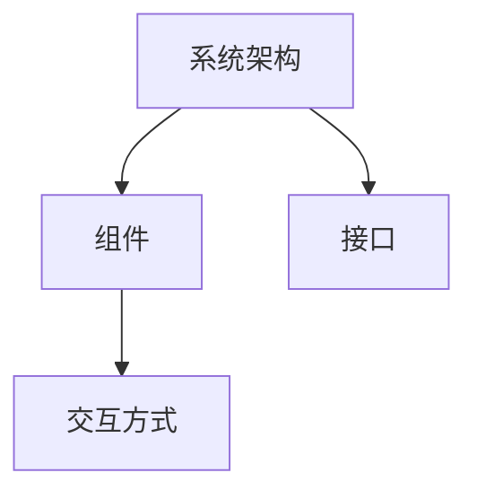
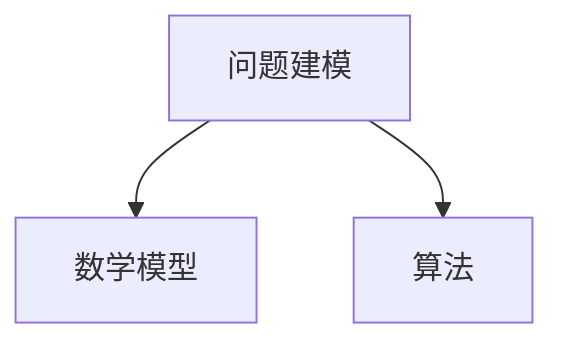
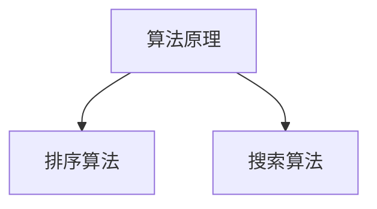

                 

关键词：系统思考，问题解决，算法原理，数学模型，项目实践，实际应用，未来展望

> 摘要：本文深入探讨了系统思考在问题解决中的重要性，通过剖析核心概念、算法原理、数学模型及项目实践，展现了系统思考和问题解决能力的协同作用。文章旨在为读者提供一种全面、深入的理解，以提升在复杂IT环境中的问题解决能力。

## 1. 背景介绍

在快速发展的信息技术领域，面对日新月异的挑战，系统思考和问题解决能力成为IT专业人士的必备技能。本文将探讨系统思考的本质及其在问题解决中的应用，旨在帮助读者更好地理解这一过程，并提升自身的问题解决能力。

### 1.1 系统思考的定义

系统思考是一种跨学科的思考方法，通过将复杂问题视为一个相互关联的整体，帮助我们从不同角度分析问题，理解其内在机制，从而找到有效的解决方案。这种方法强调动态视角，关注系统内部的反馈循环和因果关系。

### 1.2 问题解决的重要性

在IT领域，问题解决能力是衡量专业水平的重要标准。无论是软件工程师、系统架构师还是项目管理人员，都需要具备强大的问题解决能力，以便在面对复杂的技术难题时，能够迅速找到合理的解决方案。

## 2. 核心概念与联系

为了更好地理解系统思考在问题解决中的应用，我们需要明确一些核心概念，并展示它们之间的联系。

### 2.1 系统架构

系统架构是IT系统的基础，它定义了系统的组件、接口和交互方式。通过系统架构图，我们可以清晰地看到各组件之间的关系和作用。



### 2.2 问题建模

问题建模是将实际问题转化为数学模型或算法的过程。通过问题建模，我们可以将复杂的问题简化为易于处理的数学问题，从而找到解决方案。



### 2.3 算法原理

算法原理是问题解决的核心，它决定了问题解决的速度和效率。不同的算法适用于不同类型的问题，因此了解算法原理对于选择合适的解决方案至关重要。



## 3. 核心算法原理 & 具体操作步骤

### 3.1 算法原理概述

在本节中，我们将探讨两个常见的算法原理：排序算法和搜索算法。

### 3.2 算法步骤详解

#### 3.2.1 排序算法

排序算法是将一组数据按照特定顺序排列的方法。常见的排序算法包括冒泡排序、选择排序和快速排序等。

- 冒泡排序：通过不断比较相邻元素并交换位置，逐步将数据排序。
- 选择排序：每次选择一个最小的元素放到已排序序列的末尾。
- 快速排序：通过分治策略将数据划分为已排序的子序列。

#### 3.2.2 搜索算法

搜索算法是在数据集合中查找特定元素的方法。常见的搜索算法包括线性搜索和二分搜索。

- 线性搜索：逐个比较数据元素，直到找到目标元素或结束。
- 二分搜索：通过不断缩小搜索范围，逐步逼近目标元素。

### 3.3 算法优缺点

每种算法都有其优缺点，适用于不同类型的问题。

- 排序算法：
  - 冒泡排序：简单易懂，但效率较低。
  - 选择排序：实现简单，但效率较低。
  - 快速排序：平均时间复杂度较低，但最坏情况下效率较差。

- 搜索算法：
  - 线性搜索：简单易实现，但效率较低。
  - 二分搜索：效率较高，但需要数据已排序。

### 3.4 算法应用领域

排序算法和搜索算法在各个领域都有广泛应用。

- 排序算法：数据库管理、文本编辑、搜索引擎等。
- 搜索算法：搜索引擎、社交网络、数据挖掘等。

## 4. 数学模型和公式 & 详细讲解 & 举例说明

在本节中，我们将探讨数学模型和公式在问题解决中的应用，并通过具体例子进行讲解。

### 4.1 数学模型构建

数学模型是将实际问题转化为数学表达式的过程。例如，对于排序问题，我们可以使用以下数学模型：

- 排序问题：给定一组数据，将其按升序排列。
- 数学模型：$$ A[i] \leq A[j], \forall i < j $$

### 4.2 公式推导过程

以冒泡排序算法为例，我们可以推导出其时间复杂度：

- 假设数据长度为 $n$，排序需要进行 $n-1$ 趟。
- 在每趟排序中，需要比较和交换 $n-i$ 次。
- 因此，总比较次数为 $C = (n-1) + (n-2) + ... + 1 = \frac{(n-1)n}{2}$。
- 时间复杂度为 $O(n^2)$。

### 4.3 案例分析与讲解

假设我们要对一个包含10个整数的数组进行排序，数组初始状态为 `[5, 2, 8, 3, 1, 6, 9, 4, 7, 10]`。使用冒泡排序算法进行排序，排序过程如下：

1. 第一趟排序：`[2, 5, 3, 1, 6, 8, 4, 9, 7, 10]`
2. 第二趟排序：`[2, 3, 1, 5, 6, 4, 9, 7, 8, 10]`
3. ...
4. 第六趟排序：`[1, 2, 3, 4, 5, 6, 7, 8, 9, 10]`

通过这个例子，我们可以看到冒泡排序算法的基本操作步骤和效率。

## 5. 项目实践：代码实例和详细解释说明

在本节中，我们将通过一个具体的项目实践，展示系统思考和问题解决能力的应用。

### 5.1 开发环境搭建

假设我们要实现一个基于排序算法的简单Web应用程序。首先，我们需要搭建开发环境。

1. 安装Python 3.8及以上版本。
2. 安装Flask框架。
3. 创建一个名为`sort_app`的虚拟环境，并安装依赖。

### 5.2 源代码详细实现

以下是`sort_app.py`的源代码实现：

```python
from flask import Flask, request, render_template

app = Flask(__name__)

@app.route('/', methods=['GET', 'POST'])
def sort_input():
    if request.method == 'POST':
        data = request.form['data']
        data = [int(x) for x in data.split(',')]
        sorted_data = sorted(data)
        return render_template('sorted.html', sorted_data=sorted_data)
    return render_template('input.html')

if __name__ == '__main__':
    app.run(debug=True)
```

### 5.3 代码解读与分析

- `from flask import Flask, request, render_template`: 导入Flask框架所需模块。
- `app = Flask(__name__)`: 创建Flask应用程序。
- `@app.route('/', methods=['GET', 'POST'])`: 定义处理GET和POST请求的路由。
- `if request.method == 'POST'`: 判断请求方法是否为POST。
- `data = request.form['data']`: 获取表单数据。
- `data = [int(x) for x in data.split(',')]: 将字符串分割为整数列表。
- `sorted_data = sorted(data)`: 使用Python内置的`sorted`函数进行排序。
- `return render_template('sorted.html', sorted_data=sorted_data)`: 渲染排序结果页面。
- `return render_template('input.html')`: 渲染输入页面。

### 5.4 运行结果展示

运行程序后，访问`http://localhost:5000/`，我们可以看到一个简单的输入和输出界面。


## 6. 实际应用场景

系统思考和问题解决能力在IT领域有广泛的应用。以下是一些实际应用场景：

- 软件开发：通过系统思考，可以更好地设计软件架构，提高代码质量。
- 系统优化：通过问题解决能力，可以优化系统性能，提高用户体验。
- 数据分析：通过数学模型和算法，可以处理大量数据，发现有价值的信息。
- 项目管理：通过系统思考和问题解决能力，可以更好地管理项目进度和质量。

## 7. 工具和资源推荐

### 7.1 学习资源推荐

- 《算法导论》：一本经典的算法教材，涵盖多种算法原理和数学模型。
- 《深度学习》：介绍深度学习算法及其在各个领域的应用。
- 《大话数据结构》：以通俗易懂的方式讲解数据结构及其应用。

### 7.2 开发工具推荐

- Python：一种易于学习且功能强大的编程语言。
- Flask：一个轻量级的Web开发框架。
- Jupyter Notebook：一种交互式的开发环境，适合进行数据分析和实验。

### 7.3 相关论文推荐

- "A Taxonomy of Black-Box Optimization Algorithms"
- "Deep Learning: A Brief History, A Roadmap, and Experiments in Reinforcement Learning"
- "The Quest for Robust and Scalable Machine Learning"

## 8. 总结：未来发展趋势与挑战

随着信息技术的快速发展，系统思考和问题解决能力在未来将变得更加重要。以下是未来发展趋势与挑战：

- 自动化：随着自动化技术的发展，问题解决能力将更多地体现在系统设计和优化方面。
- 人工智能：人工智能将带来更多复杂的问题和挑战，需要更高的系统思考和问题解决能力。
- 大数据：大数据分析将需要更高效的算法和数学模型，以处理海量数据。
- 可持续发展：系统思考和问题解决能力在解决全球性挑战，如气候变化和可持续发展方面具有重要意义。

## 9. 附录：常见问题与解答

### 9.1 如何提高系统思考能力？

- 学习跨学科知识：了解不同领域的思维方式，提高综合分析问题的能力。
- 实践：通过实际项目经验，不断锻炼系统思考能力。
- 反思：定期反思自己的思维方式，寻找改进空间。

### 9.2 如何提高问题解决能力？

- 熟悉基本算法和数据结构：掌握常见算法和数据结构，为解决问题提供基础。
- 学习数学模型：掌握数学模型构建和推导方法，提高问题解决能力。
- 求助与合作：在遇到难题时，及时寻求帮助，与他人合作解决问题。

## 作者署名

作者：禅与计算机程序设计艺术 / Zen and the Art of Computer Programming
----------------------------------------------------------------

以上就是关于《系统思考与问题解决能力》的完整文章。希望这篇文章能够帮助您提升在IT领域的问题解决能力，为您的职业生涯带来更多的成功。如果您有任何疑问或建议，欢迎随时留言讨论。再次感谢您的阅读！<|im_sep|>

