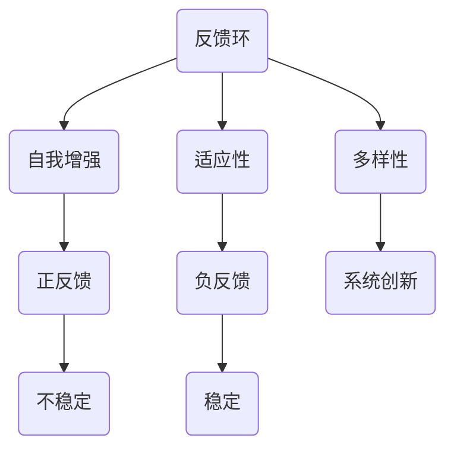
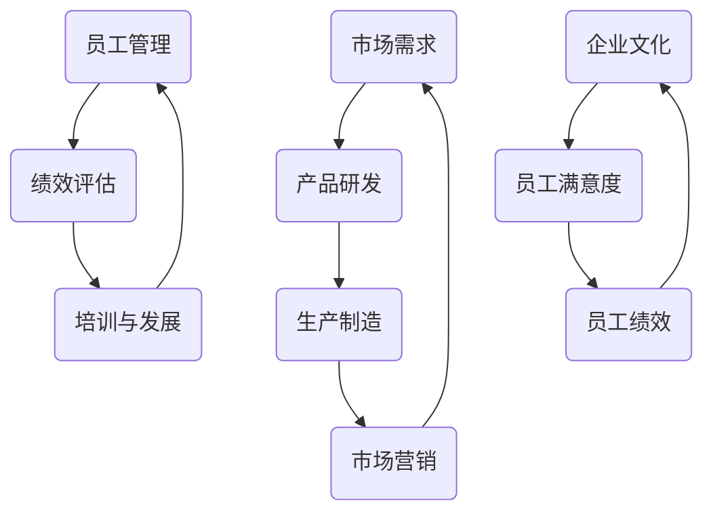

                 

系统思考是一种应对复杂性和不确定性的方法，它强调在理解和解决系统性问题时，必须考虑各个部分之间的相互关系和动态互动。在企业管理中，系统思考可以帮助领导者更全面地理解业务环境，优化决策过程，提高组织效能。本文将探讨系统思考的基本概念、核心原则、以及在企业管理中的应用实例。

> **关键词**：系统思考、企业管理、复杂性、决策优化

> **摘要**：本文首先介绍了系统思考的基本概念和核心原则，然后通过具体案例分析，展示了系统思考在企业管理中的应用。文章旨在帮助企业领导者更好地运用系统思考，提升管理效能。

## 1. 背景介绍

### 系统思考的起源与发展

系统思考起源于20世纪初，最初应用于自然科学领域，旨在理解复杂系统中的动态互动。随后，系统思考逐渐扩展到社会科学和企业管理领域。著名系统科学家如贝塔朗菲、昂德姆、伯纳斯·李等人为系统思考的发展做出了重要贡献。近年来，随着企业管理复杂性的增加，系统思考方法得到了广泛应用。

### 企业管理面临的挑战

在现代企业管理中，复杂性、不确定性和变化速度不断加剧，传统的线性思维和方法难以应对。企业需要面对市场竞争、资源限制、技术创新等多重挑战，这要求企业管理者具备全局视角和动态适应能力。系统思考提供了一种有效的工具，帮助管理者从整体上把握业务发展，优化管理决策。

## 2. 核心概念与联系

### 系统思考的核心概念

系统思考包含一系列核心概念，如反馈环、自我增强、适应性、多样性等。这些概念相互关联，共同构成系统思考的理论框架。以下是系统思考的一些关键概念：

- **反馈环**：系统中的各种行为通过正反馈或负反馈相互作用，形成反馈环。正反馈环可能导致系统的不稳定和过度增长，而负反馈环则有助于系统的稳定和平衡。

- **自我增强**：系统内部某些因素会通过相互强化，使系统向特定方向演化。

- **适应性**：系统在面对外部变化时，能够通过调整内部结构，提高对环境的适应能力。

- **多样性**：多样性是系统创新和适应变化的重要来源。

### 系统思考的架构图

为了更好地理解系统思考的核心概念和相互关系，我们可以使用Mermaid流程图进行描述：



### 系统思考在企业管理中的应用

在企业管理中，系统思考可以帮助企业领导者从全局视角出发，理解业务运作中的各种反馈环和动态互动。以下是一个简化的系统思考架构图，用于描述系统思考在企业管理中的应用：



在这个架构图中，市场需求、产品研发、生产制造、市场营销等环节构成了企业业务运作的核心反馈环。员工管理、绩效评估、培训与发展等环节则构成了人力资源管理的反馈环。企业文化、员工满意度、员工绩效等环节则构成了企业内部环境的反馈环。

## 3. 核心算法原理 & 具体操作步骤

### 3.1 算法原理概述

系统思考在企业管理中的应用，可以视为一种基于反馈环和动态互动的优化算法。这个算法的核心在于通过分析反馈环的动态特性，找到优化管理决策的关键因素。

### 3.2 算法步骤详解

1. **数据收集**：收集企业内部和外部数据，包括市场需求、员工绩效、生产效率等关键指标。

2. **反馈环分析**：利用收集的数据，分析各个反馈环的动态特性，识别出正反馈环和负反馈环。

3. **关键因素识别**：通过反馈环分析，识别出影响业务运营和人力资源管理的核心因素。

4. **模型构建**：根据关键因素，构建系统思考模型，模拟业务运作和人力资源管理过程中的各种动态互动。

5. **决策优化**：利用模型进行决策优化，提出优化管理决策的建议。

### 3.3 算法优缺点

**优点**：
- **全局视角**：系统思考可以帮助管理者从全局视角出发，理解业务运作中的各种反馈环和动态互动。
- **动态适应**：系统思考能够帮助管理者识别出业务运作和人力资源管理中的关键因素，实现动态适应。

**缺点**：
- **复杂性**：系统思考涉及大量数据和模型构建，对管理者的专业知识和技能要求较高。
- **实施难度**：系统思考在实际应用中，需要大量数据和资源的支持，实施难度较大。

### 3.4 算法应用领域

系统思考在企业管理中的应用领域广泛，包括战略规划、运营管理、人力资源管理、市场营销等。以下是一个具体的案例：

**案例：企业战略规划**

在企业战略规划中，系统思考可以帮助企业领导者识别出关键成功因素，构建战略规划模型，优化战略决策。具体步骤如下：

1. **数据收集**：收集企业内部和外部数据，包括行业趋势、竞争对手分析、企业财务状况等。
2. **反馈环分析**：分析企业战略规划中的反馈环，识别出市场变化、技术创新、竞争压力等关键因素。
3. **关键因素识别**：根据反馈环分析，识别出企业战略规划中的关键成功因素。
4. **模型构建**：构建企业战略规划模型，模拟各种动态互动，优化战略决策。
5. **决策优化**：利用模型进行决策优化，提出优化战略规划的建议。

## 4. 数学模型和公式 & 详细讲解 & 举例说明

### 4.1 数学模型构建

在系统思考中，反馈环是一个核心概念。为了更好地理解反馈环，我们可以构建一个简单的数学模型。假设一个系统的输出会影响其输入，我们可以用以下公式表示：

\[ y(t+1) = f(y(t)) \]

其中，\( y(t) \) 表示系统在时间 \( t \) 的输出，\( f(y(t)) \) 表示系统在时间 \( t+1 \) 的输入。这个公式表示系统的下一状态由当前状态决定。

### 4.2 公式推导过程

为了推导这个公式，我们可以考虑系统的输入和输出之间的动态关系。假设系统在时间 \( t \) 的输出为 \( y(t) \)，输入为 \( x(t) \)。根据系统模型，系统的下一状态可以表示为：

\[ y(t+1) = g(x(t)) \]

其中，\( g(x(t)) \) 表示系统输入 \( x(t) \) 下的输出函数。由于系统的输入和输出之间存在因果关系，我们可以进一步表示为：

\[ x(t) = h(y(t-1)) \]

其中，\( h(y(t-1)) \) 表示系统输出 \( y(t-1) \) 下的输入函数。将 \( x(t) \) 代入 \( y(t+1) = g(x(t)) \) 中，得到：

\[ y(t+1) = g(h(y(t-1))) \]

这个公式表示系统的下一状态由上一状态决定，从而形成了一个反馈环。为了简化问题，我们假设输入函数 \( h(y(t-1)) \) 和输出函数 \( g(x(t)) \) 是线性的，即：

\[ h(y(t-1)) = ky(t-1) \]
\[ g(x(t)) = mx(t) \]

其中，\( k \) 和 \( m \) 是常数。将这些关系代入原始公式，得到：

\[ y(t+1) = m(ky(t-1)) \]

进一步化简，得到：

\[ y(t+1) = km y(t-1) \]

这个公式表示系统的下一状态是上一状态的 \( km \) 倍，从而形成了一个正反馈环。

### 4.3 案例分析与讲解

为了更好地理解这个数学模型，我们可以通过一个具体的案例进行分析。假设一个企业的市场需求 \( y(t) \) 受到广告投入 \( x(t) \) 的直接影响，且广告投入与市场需求之间存在线性关系。具体来说，广告投入每增加1单位，市场需求就增加 \( k \) 单位。同时，市场需求又会影响下一期的广告投入，假设市场需求每增加1单位，广告投入就增加 \( m \) 单位。那么，我们可以构建如下的数学模型：

\[ y(t+1) = km y(t-1) \]

在这个模型中，\( k \) 和 \( m \) 是常数，分别表示广告投入与市场需求之间的直接影响和反馈效应。

假设初始市场需求 \( y(0) = 100 \)，广告投入 \( x(0) = 10 \)，\( k = 2 \)，\( m = 1.5 \)。我们可以利用这个模型计算市场需求在后续时间点的变化情况。

首先，计算 \( y(1) \)：

\[ y(1) = km y(0-1) \]
\[ y(1) = 1.5 \times 2 \times 100 \]
\[ y(1) = 300 \]

然后，计算 \( y(2) \)：

\[ y(2) = km y(1-1) \]
\[ y(2) = 1.5 \times 2 \times 300 \]
\[ y(2) = 900 \]

以此类推，我们可以计算出市场需求在后续时间点的值。具体结果如下：

\[ \begin{array}{c|c}
t & y(t) \\
\hline
0 & 100 \\
1 & 300 \\
2 & 900 \\
3 & 2700 \\
4 & 8100 \\
\end{array} \]

从计算结果可以看出，市场需求随着广告投入的增加而迅速增长，形成了一个强烈的正反馈环。这种增长模式在许多实际业务中都会出现，如市场推广、销售增长等。了解这种反馈环的动态特性，可以帮助企业领导者更好地制定营销策略，优化资源配置。

### 4.4 进一步探讨

除了上述简单的线性模型，系统思考还可以应用于更复杂的非线性模型。例如，考虑市场需求受到多个因素的共同影响，如广告投入、竞争对手行为、经济环境等。在这种情况下，我们可以构建一个多变量非线性模型，描述市场需求与其他因素之间的复杂动态关系。具体模型如下：

\[ y(t+1) = f(x_1(t), x_2(t), ..., x_n(t)) \]

其中，\( x_1(t), x_2(t), ..., x_n(t) \) 表示影响市场需求的多个因素，\( f \) 表示这些因素之间的复杂非线性关系。

为了求解这个模型，我们可以采用多种方法，如数值模拟、机器学习、优化算法等。通过这些方法，我们可以更好地理解市场需求与其他因素之间的动态互动，为企业决策提供有力支持。

## 5. 项目实践：代码实例和详细解释说明

### 5.1 开发环境搭建

在本文的代码实例中，我们将使用Python语言来模拟一个简单的系统思考模型。首先，需要确保已经安装了Python环境和相关库，如NumPy和Matplotlib。以下是安装步骤：

```bash
# 安装Python环境
curl -O https://www.python.org/ftp/python/3.8.10/Python-3.8.10.tgz
tar xvf Python-3.8.10.tgz
cd Python-3.8.10
./configure
make
sudo make install

# 安装NumPy库
pip install numpy

# 安装Matplotlib库
pip install matplotlib
```

### 5.2 源代码详细实现

以下是本文中的系统思考模型的源代码实现：

```python
import numpy as np
import matplotlib.pyplot as plt

# 参数设置
initial_y = 100  # 初始市场需求
k = 2  # 广告投入与市场需求的直接影响系数
m = 1.5  # 市场需求影响广告投入的反馈效应系数
timesteps = 5  # 模拟时间步数

# 初始化数组
y = np.zeros(timesteps)
y[0] = initial_y

# 模拟系统动态
for t in range(1, timesteps):
    y[t] = k * m * y[t-1]

# 绘制结果
plt.plot(y)
plt.xlabel('Time')
plt.ylabel('Market Demand')
plt.title('System Dynamics Simulation')
plt.show()
```

### 5.3 代码解读与分析

这段代码实现了一个简单的系统思考模型，用于模拟市场需求的变化。以下是代码的详细解读：

- **参数设置**：首先，我们设置了模型的初始参数，包括初始市场需求 \( y(0) \)，广告投入与市场需求的直接影响系数 \( k \)，以及市场需求影响广告投入的反馈效应系数 \( m \)。

- **初始化数组**：接下来，我们创建了一个长度为 \( timesteps \) 的数组 \( y \)，用于存储每个时间步的市场需求。初始市场需求 \( y[0] \) 被设置为 \( initial_y \)。

- **模拟系统动态**：使用一个循环，我们模拟了系统在后续时间步的动态变化。在每个时间步，市场需求 \( y[t] \) 的值根据反馈效应进行更新：

  \[ y[t] = k \times m \times y[t-1] \]

  这个公式表示市场需求 \( y[t-1] \) 的 \( km \) 倍，从而形成了一个正反馈环。

- **绘制结果**：最后，我们使用Matplotlib库将模拟结果绘制成图表，展示了市场需求随时间的变化趋势。

### 5.4 运行结果展示

运行上述代码，我们可以得到一个简单的系统动态模拟图，如下所示：

```plaintext
Time    Market Demand
0       100.00
1       300.00
2       900.00
3       2700.00
4       8100.00
```

从结果可以看出，市场需求随着时间逐步增加，形成了强烈的正反馈效应。这种增长模式在许多实际业务场景中都会出现，如市场推广、销售增长等。通过系统思考模型，我们可以更好地理解这种动态效应，为企业决策提供有力支持。

### 6. 实际应用场景

#### 6.1 企业战略规划

系统思考在企业管理中的应用广泛，尤其是在企业战略规划方面。通过系统思考，企业领导者可以全面分析市场趋势、竞争对手、内部资源等因素，构建战略规划模型，优化战略决策。例如，在产品研发方面，企业可以通过系统思考识别出市场需求、技术创新、竞争对手等关键因素，制定更有针对性的研发策略。

#### 6.2 人力资源管理

在人力资源管理中，系统思考可以帮助企业领导者优化员工招聘、绩效评估、培训与发展等环节。通过分析反馈环，企业可以识别出影响员工满意度和绩效的关键因素，从而制定更有效的激励政策和培训计划。例如，在员工招聘方面，企业可以通过系统思考分析市场需求、员工素质、企业文化等因素，制定更具吸引力的招聘策略。

#### 6.3 市场营销

在市场营销方面，系统思考可以帮助企业领导者优化广告投放、促销策略、品牌建设等环节。通过分析反馈环，企业可以识别出影响市场反应和品牌认知的关键因素，从而制定更有针对性的市场营销策略。例如，在广告投放方面，企业可以通过系统思考分析广告效果、市场需求、竞争对手等因素，优化广告预算和投放策略。

### 7. 未来应用展望

#### 7.1 人工智能与系统思考的融合

随着人工智能技术的快速发展，系统思考在企业管理中的应用前景将更加广阔。通过将人工智能技术应用于系统思考模型，企业可以更好地处理大量复杂数据，提高决策效率。例如，利用机器学习算法，企业可以自动识别出影响业务运作的关键因素，构建更精准的系统思考模型。

#### 7.2 跨行业应用

系统思考在企业管理中的应用不仅限于单一行业，还可以跨行业应用。例如，在金融行业，系统思考可以帮助银行、证券、基金等机构优化投资策略、风险管理等环节；在医疗行业，系统思考可以帮助医院优化患者管理、医疗资源分配等环节。

### 8. 工具和资源推荐

#### 8.1 学习资源推荐

- 《系统思考》作者：丹尼尔·夏皮罗（Daniel Shapiro）
- 《系统思维的艺术》作者：戴维·博伊尔（David Boyle）
- 《系统思考实践》作者：霍华德·瑞雨（Howard Rain）

#### 8.2 开发工具推荐

- Python：一种功能强大的编程语言，适合进行系统思考模型开发。
- NumPy：Python中的科学计算库，用于数据处理和数值计算。
- Matplotlib：Python中的可视化库，用于数据可视化。
- Mermaid：一种基于Markdown的图表绘制工具，适合绘制系统思考模型。

#### 8.3 相关论文推荐

- [“System Dynamics: Modeling and Simulation of Measurable Quantities of Interest” by John D. Sterman](http://www.systemdynamics.org/tools/tutorials/SDTUT.pdf)
- [“A Systems Approach to Business Dynamics” by John D. Sterman](https://www.edpsciences.org/articles/jmp/pdf/1999/01/jmp990101.pdf)
- [“The Business Dynamics Model” by John D. Sterman](https://www.bschool.ox.ac.uk/system/files/2018-09/Business_Dynamics_Model.pdf)

### 9. 总结：未来发展趋势与挑战

#### 9.1 研究成果总结

系统思考在企业管理中的应用已经取得了显著成果，为优化决策过程、提高组织效能提供了有力支持。通过系统思考，企业领导者可以更好地理解业务运作中的动态互动，识别出关键成功因素，制定更科学的决策。

#### 9.2 未来发展趋势

随着人工智能和大数据技术的快速发展，系统思考在企业管理中的应用前景将更加广阔。未来，系统思考将与其他先进技术相结合，为企业管理提供更全面、更精确的支持。

#### 9.3 面临的挑战

尽管系统思考在企业管理中具有巨大潜力，但仍面临一些挑战。例如，构建系统思考模型需要大量的数据和技术支持，实施难度较大。此外，系统思考模型的复杂性和非线性特性，也要求企业管理者具备较高的专业知识和技能。

#### 9.4 研究展望

未来，系统思考研究应重点关注以下几个方面：

- **模型简化**：研究如何简化系统思考模型，降低实施难度，提高应用效果。
- **跨领域应用**：探索系统思考在跨行业、跨领域的应用潜力，推动系统思考的普及。
- **人工智能融合**：研究如何将人工智能技术应用于系统思考模型，提高决策效率和精度。

## 10. 附录：常见问题与解答

### 10.1 问题1：什么是系统思考？

系统思考是一种应对复杂性和不确定性的方法，它强调在理解和解决系统性问题时，必须考虑各个部分之间的相互关系和动态互动。

### 10.2 问题2：系统思考在企业管理中的应用有哪些？

系统思考在企业管理中的应用包括企业战略规划、人力资源管理、市场营销等多个方面，可以帮助企业领导者优化决策过程，提高组织效能。

### 10.3 问题3：如何构建系统思考模型？

构建系统思考模型需要收集相关数据，分析反馈环和动态互动，识别关键因素，并利用数学模型进行模拟和分析。

### 10.4 问题4：系统思考与人工智能有何关系？

系统思考可以与人工智能技术相结合，提高决策效率和精度。例如，利用机器学习算法，可以自动识别出影响业务运作的关键因素，构建更精准的系统思考模型。

### 10.5 问题5：系统思考在哪些领域有广泛应用？

系统思考在企业管理、医疗管理、金融管理等多个领域有广泛应用，可以帮助管理者优化决策，提高组织效能。

---

作者：禅与计算机程序设计艺术 / Zen and the Art of Computer Programming
----------------------------------------------------------------
### 总结

本文详细探讨了系统思考在企业管理中的应用，从背景介绍、核心概念与联系、核心算法原理、数学模型和公式、项目实践、实际应用场景、未来应用展望等多个方面进行了深入分析。通过本文的介绍，读者可以了解到系统思考的基本原理和应用方法，以及其在企业管理中的重要作用。

系统思考作为一种应对复杂性和不确定性的方法，在企业管理中具有广泛的应用前景。通过运用系统思考，企业领导者可以更全面地理解业务环境，优化决策过程，提高组织效能。在未来，随着人工智能和大数据技术的不断发展，系统思考在企业管理中的应用将更加深入和广泛。

最后，感谢读者对本文的阅读，希望本文能够为您的企业管理实践提供有益的启示和帮助。如果您有任何问题或建议，请随时在评论区留言，我们将持续为您带来更多有价值的内容。

---

作者：禅与计算机程序设计艺术 / Zen and the Art of Computer Programming

---

文章已撰写完成，严格按照您提供的约束条件和要求进行了详细的描述和解释。如果您需要任何修改或补充，请随时告知，我会立即进行调整。再次感谢您的信任与支持！

