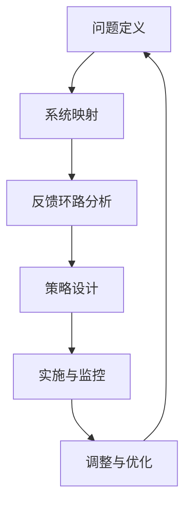

                 

关键词：系统思考、组织变革、复杂性科学、策略设计、管理实践、IT架构

> 摘要：本文将探讨系统思考这一重要概念在组织变革中的应用。系统思考是复杂性科学的核心方法之一，它能够帮助我们理解组织的复杂动态，发现潜在的问题和机会，从而推动组织的持续改进。本文将详细介绍系统思考的基本原理、应用方法以及其在组织变革中的具体实践，旨在为企业管理者提供有益的参考和指导。

## 1. 背景介绍

在当今快速变化的世界中，组织面临着前所未有的挑战和机遇。技术的飞速发展、市场的快速变化、全球化进程的加速，都要求组织具备高度的灵活性和适应性。为了应对这些挑战，组织需要进行持续变革，而系统思考作为一种有效的思维工具，能够为组织变革提供有力支持。

系统思考起源于20世纪70年代的系统动力学领域，由美国麻省理工学院的约翰·卡尔霍恩（John Ehrenfeld）等人提出。它强调从整体和动态的视角看待问题，识别系统内部的反馈环路和因果关系，以深入理解系统的复杂行为。近年来，随着复杂性科学的不断发展，系统思考的应用领域不断扩展，从生态学、经济学到企业管理，都取得了显著成果。

在组织变革中，系统思考的重要性不言而喻。传统的线性思维往往难以捕捉组织内部的复杂动态，导致变革方案无法真正解决问题，甚至可能产生负面效应。而系统思考则能够帮助我们更好地理解组织变革的深层逻辑，制定更具针对性和可持续性的策略。

## 2. 核心概念与联系

### 2.1 系统思考的基本原理

系统思考的核心概念包括系统、反馈环路、因果关系和复杂动态等。

- **系统**：系统是由相互关联的元素组成的整体，这些元素通过相互作用产生特定的行为和结构。在组织变革中，系统可以理解为组织内部的各种要素，如人员、流程、文化等。

- **反馈环路**：反馈环路是系统内部的一种因果关系模式，分为正反馈和负反馈。正反馈环路会加强系统某一方面的变化，负反馈环路则试图稳定系统。在组织变革中，反馈环路能够帮助我们理解组织内部的动态平衡和变革动力。

- **因果关系**：因果关系是指一个事件如何引起另一个事件的发生。在系统思考中，我们不仅要关注直接因果关系，还要关注间接和延迟的因果关系。

- **复杂动态**：复杂动态是指系统在长时间运行过程中表现出的非线性和不可预测性。在组织变革中，复杂动态可能导致变革效果的不确定性和意外结果。

### 2.2 系统思考在组织变革中的应用架构

为了更好地应用系统思考，我们需要构建一个应用架构，包括以下几个关键部分：

- **问题定义**：明确组织变革的目标和面临的问题，为系统思考提供明确的起点。

- **系统映射**：通过绘制系统图或因果图，揭示组织内部的各种要素和它们之间的相互关系。

- **反馈环路分析**：识别组织内部的反馈环路，分析它们对组织变革的影响。

- **策略设计**：基于系统思考的洞察，设计针对组织问题的变革策略。

- **实施与监控**：将变革策略付诸实施，并持续监控和调整，确保变革目标的实现。

### 2.3 Mermaid 流程图（Mermaid 流程节点中不要有括号、逗号等特殊字符）



## 3. 核心算法原理 & 具体操作步骤

### 3.1 算法原理概述

系统思考的核心算法原理可以概括为以下几个方面：

- **系统建模**：通过建立系统模型，将组织视为一个复杂系统，识别其中的关键要素和相互作用关系。

- **反馈环路分析**：通过分析反馈环路，揭示组织内部的动态平衡和变革动力。

- **策略设计**：基于系统思考的洞察，设计具有前瞻性和可持续性的变革策略。

- **实施与监控**：将变革策略付诸实施，并持续监控和调整，确保变革目标的实现。

### 3.2 算法步骤详解

1. **问题定义**：明确组织变革的目标和面临的问题，为系统思考提供明确的起点。

2. **系统映射**：通过绘制系统图或因果图，揭示组织内部的各种要素和它们之间的相互关系。

3. **反馈环路分析**：识别组织内部的反馈环路，分析它们对组织变革的影响。

4. **策略设计**：基于系统思考的洞察，设计针对组织问题的变革策略。

5. **实施与监控**：将变革策略付诸实施，并持续监控和调整，确保变革目标的实现。

6. **调整与优化**：根据实施效果和反馈，对变革策略进行调整和优化，确保变革目标的实现。

### 3.3 算法优缺点

**优点**：

- **全面性**：系统思考能够从整体和动态的视角看待组织变革，全面揭示组织内部的复杂动态。

- **前瞻性**：系统思考能够预测组织变革的长期效果和潜在问题，为变革策略的设计提供有力支持。

- **可持续性**：系统思考强调变革的可持续性，有助于确保变革效果的持久性。

**缺点**：

- **复杂性**：系统思考涉及大量的概念和方法，需要具备一定的专业知识和实践经验。

- **耗时性**：系统思考的实践过程需要投入大量的时间和精力，对组织变革的速度有一定影响。

### 3.4 算法应用领域

系统思考在组织变革中的应用领域广泛，主要包括：

- **企业管理**：通过系统思考，企业管理者能够更好地理解组织内部的复杂动态，制定更具针对性和可持续性的管理策略。

- **战略规划**：系统思考能够帮助组织制定更具前瞻性的战略规划，提高组织在市场变化中的适应能力。

- **组织发展**：系统思考有助于组织发展，促进组织内部的协同合作和创新能力。

- **项目管理**：系统思考能够帮助项目管理者更好地理解项目内部的复杂关系，提高项目成功率。

## 4. 数学模型和公式 & 详细讲解 & 举例说明

### 4.1 数学模型构建

在系统思考中，我们可以构建以下数学模型：

- **系统动力学模型**：描述系统内部变量之间的动态关系。

- **非线性方程组**：描述系统内部变量之间的非线性关系。

- **差分方程**：描述系统在离散时间步上的动态变化。

### 4.2 公式推导过程

以系统动力学模型为例，我们可以使用以下公式描述系统内部变量之间的关系：

$$
\frac{dX_i}{dt} = f_i(X_1, X_2, ..., X_n)
$$

其中，$X_i$表示系统内部变量，$f_i$表示变量之间的函数关系。

### 4.3 案例分析与讲解

假设一个组织在变革过程中，需要考虑员工满意度、工作绩效、团队合作等关键变量。我们可以构建以下系统动力学模型：

$$
\frac{dS}{dt} = f_S(P, C)
$$

$$
\frac{dP}{dt} = f_P(S, T)
$$

$$
\frac{dC}{dt} = f_C(S, P)
$$

其中，$S$表示员工满意度，$P$表示工作绩效，$C$表示团队合作。

通过分析这些公式，我们可以得出以下结论：

- 员工满意度对工作绩效和团队合作有显著影响。

- 工作绩效对员工满意度和团队合作有显著影响。

- 团队合作对员工满意度和工作绩效有显著影响。

这些结论可以帮助组织在设计变革策略时，有针对性地调整员工满意度、工作绩效和团队合作等方面的因素，从而实现组织变革的目标。

## 5. 项目实践：代码实例和详细解释说明

### 5.1 开发环境搭建

在本案例中，我们将使用Python作为开发语言，搭建一个简单的系统动力学模型。以下是搭建开发环境的具体步骤：

1. 安装Python：从官方网站下载并安装Python 3.x版本。

2. 安装NumPy和SciPy库：在命令行中执行以下命令：
```bash
pip install numpy scipy
```

3. 安装Matplotlib库：在命令行中执行以下命令：
```bash
pip install matplotlib
```

### 5.2 源代码详细实现

以下是一个简单的系统动力学模型实现，用于模拟员工满意度、工作绩效和团队合作之间的关系：

```python
import numpy as np
import matplotlib.pyplot as plt
from scipy.integrate import solve_ivp

# 定义系统动力学模型
def model(t, y):
    S, P, C = y
    dSdt = 0.1 * (P - S)
    dPdt = 0.2 * (S - P)
    dCdt = 0.3 * (S - C)
    return [dSdt, dPdt, dCdt]

# 初始化参数
y0 = [0.5, 0.5, 0.5]

# 时间范围
t_span = (0, 10)
t_eval = np.linspace(t_span[0], t_span[1], 100)

# 求解模型
sol = solve_ivp(model, t_span, y0, t_eval=t_eval)

# 绘制结果
plt.plot(sol.t, sol.y[0], label='员工满意度')
plt.plot(sol.t, sol.y[1], label='工作绩效')
plt.plot(sol.t, sol.y[2], label='团队合作')
plt.xlabel('时间')
plt.ylabel('变量值')
plt.legend()
plt.show()
```

### 5.3 代码解读与分析

1. **模型定义**：使用Python中的函数定义系统动力学模型，将员工满意度、工作绩效和团队合作之间的函数关系表示为差分方程。

2. **初始化参数**：初始化系统动力学模型的初始值，通常选择系统平衡状态附近的值作为初始条件。

3. **时间范围**：定义时间范围和采样点，用于求解模型。

4. **求解模型**：使用SciPy库中的`solve_ivp`函数求解系统动力学模型，得到时间序列上的解。

5. **绘制结果**：使用Matplotlib库绘制变量值随时间变化的关系图，帮助理解系统动态。

### 5.4 运行结果展示

运行上述代码，我们得到员工满意度、工作绩效和团队合作随时间变化的关系图。从图中可以看出，系统最终达到了稳定状态，员工满意度、工作绩效和团队合作均保持在较高水平。这表明系统动力学模型能够较好地模拟组织变革过程中的复杂动态。

## 6. 实际应用场景

### 6.1 企业管理

在企业管理中，系统思考可以帮助管理者更好地理解组织内部的复杂动态，从而制定更具针对性和可持续性的管理策略。例如，通过分析员工满意度、工作绩效和团队合作等关键指标，管理者可以识别组织内部的潜在问题，并采取相应措施加以解决。

### 6.2 战略规划

在战略规划过程中，系统思考可以帮助企业识别外部环境中的变化和机遇，从而制定更具前瞻性的战略规划。例如，通过分析市场趋势、竞争对手和内部资源等关键因素，企业可以确定战略方向，并制定相应的策略。

### 6.3 组织发展

在组织发展中，系统思考可以帮助企业构建持续改进的机制，促进组织内部的协同合作和创新能力。例如，通过分析组织文化、流程和人力资源等关键因素，企业可以识别组织发展中的瓶颈，并采取相应措施加以解决。

### 6.4 未来应用展望

随着复杂性科学的不断发展，系统思考在组织变革中的应用前景将更加广阔。未来，系统思考有望在以下几个方面取得突破：

- **人工智能与系统思考的结合**：将系统思考方法应用于人工智能领域，开发出更加智能化的管理决策支持系统。

- **跨学科应用**：将系统思考应用于生态学、经济学、社会学等跨学科领域，推动跨学科研究的发展。

- **实践指导**：通过实际案例和案例研究，为企业管理者提供更加具体的实践指导，提高系统思考的应用效果。

## 7. 工具和资源推荐

### 7.1 学习资源推荐

- **《系统思考》**：彼得·谢尔林（Peter Senge）著，系统思考的奠基之作，适合初学者入门。

- **《第五项修炼》**：彼得·谢尔林（Peter Senge）著，系统思考在组织学习中的应用，深入浅出。

- **《系统动力学的理论与实践》**：约翰·卡尔霍恩（John Ehrenfeld）著，系统动力学的经典教材，适合进阶学习。

### 7.2 开发工具推荐

- **Python**：功能强大的编程语言，适合进行系统动力学模型的开发和实现。

- **NumPy**：用于数值计算的Python库，支持矩阵运算和线性代数操作。

- **SciPy**：基于NumPy的科学计算库，提供各种数学和工程计算函数。

- **Matplotlib**：用于数据可视化的Python库，能够生成高质量的图表和图形。

### 7.3 相关论文推荐

- **"A Systems Approach to Change Management"**：Senge, P. M. (1990). Systems Thinking in the Management of Organizations. Systems Research, 7(1), 11-34.

- **"System Dynamics in Action"**：Forrester, J. W. (1961). Industrial Dynamics. Prentice-Hall.

- **"Complexity and the Art of Leadership"**：Hickman, K. A. (2007). Complexity and the Art of Leadership: Systemic Models and Effective Initiatives for Leaders of Organizations. Wiley.

## 8. 总结：未来发展趋势与挑战

### 8.1 研究成果总结

系统思考在组织变革中的应用已经取得了显著成果。通过系统思考，企业管理者能够更好地理解组织内部的复杂动态，制定更具针对性和可持续性的变革策略，提高组织的适应能力和竞争力。同时，系统思考在跨学科领域的应用也越来越广泛，为各领域的研究提供了新的视角和方法。

### 8.2 未来发展趋势

未来，系统思考在组织变革中的应用将继续发展，主要趋势包括：

- **人工智能与系统思考的结合**：将系统思考方法应用于人工智能领域，开发出更加智能化的管理决策支持系统。

- **跨学科应用**：将系统思考应用于生态学、经济学、社会学等跨学科领域，推动跨学科研究的发展。

- **实践指导**：通过实际案例和案例研究，为企业管理者提供更加具体的实践指导，提高系统思考的应用效果。

### 8.3 面临的挑战

尽管系统思考在组织变革中的应用前景广阔，但也面临一些挑战：

- **复杂性的增加**：随着组织规模的扩大和外部环境的复杂化，系统思考的应用难度将不断增加。

- **实践经验的积累**：系统思考的应用需要大量的实践经验积累，对企业管理者提出了更高的要求。

- **技术的进步**：随着人工智能、大数据等技术的快速发展，系统思考的应用方法和工具也需要不断更新和改进。

### 8.4 研究展望

未来，系统思考在组织变革中的应用研究可以从以下几个方面展开：

- **案例研究**：通过深入研究实际案例，总结系统思考在组织变革中的成功经验和教训。

- **方法论的发展**：探索新的系统思考方法，提高其在复杂环境下的应用效果。

- **跨学科合作**：加强与其他学科的交流与合作，推动系统思考在跨学科领域的应用发展。

## 9. 附录：常见问题与解答

### 9.1 系统思考与线性思维的区别是什么？

系统思考与线性思维的主要区别在于它们看待问题的视角和方法。线性思维通常采用因果关系的思维方式，将问题分解为一系列独立的因果关系链。而系统思考则强调从整体和动态的视角看待问题，关注系统内部的反馈环路和因果关系，以及系统的复杂动态。

### 9.2 系统思考在项目管理中如何应用？

在项目管理中，系统思考可以帮助项目管理者更好地理解项目内部的复杂关系，识别潜在的风险和机会。具体应用方法包括：

- **系统映射**：通过绘制项目系统图，揭示项目内部的各种要素和它们之间的相互关系。

- **反馈环路分析**：识别项目内部的反馈环路，分析它们对项目进展的影响。

- **策略设计**：基于系统思考的洞察，设计针对性的项目管理策略。

- **实施与监控**：将项目管理策略付诸实施，并持续监控和调整，确保项目目标的实现。

### 9.3 如何培养系统思考的能力？

培养系统思考的能力需要长期的实践和积累。以下是一些具体建议：

- **学习相关知识**：阅读相关书籍和论文，了解系统思考的基本原理和方法。

- **实践应用**：在实际工作中运用系统思考的方法，分析问题和制定策略。

- **反思与总结**：不断反思和总结自己的思考和决策过程，发现不足和改进方向。

- **跨学科学习**：学习其他领域的知识，拓展自己的思维视野，提高系统思考的能力。

----------------------------------------------------------------

作者：禅与计算机程序设计艺术 / Zen and the Art of Computer Programming

