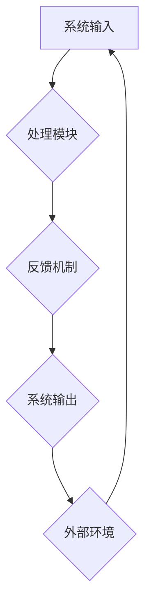

                 

关键词：系统思考、复杂问题、简化、本质、IT领域、专业技术语言、深度分析

> 摘要：本文将探讨系统思考在IT领域的应用，通过分析复杂问题，揭示系统内部的规律，将复杂问题简化，捕捉问题的本质，以提高解决问题的效率和质量。文章将从背景介绍、核心概念与联系、核心算法原理、数学模型与公式、项目实践、实际应用场景、工具和资源推荐以及未来发展趋势与挑战等方面展开，旨在为IT从业者和研究者提供有价值的参考。

## 1. 背景介绍

在信息技术高速发展的今天，我们面临着日益复杂的系统架构、不断增长的数据规模以及复杂多样的业务需求。这些复杂性不仅体现在技术层面上，还涉及到项目管理、团队协作、企业战略等多个方面。如何有效地应对这些复杂问题，成为IT领域面临的一大挑战。

传统的解决方法往往注重局部的优化，而忽视了系统整体的平衡和协同。这种局部优化策略可能导致系统的整体性能下降，甚至出现“局部最优，全局最劣”的现象。因此，我们需要一种全局的、系统性的思维方式来应对复杂问题，这就是系统思考的力量。

系统思考，又称系统动力学，是一种研究复杂系统的科学方法。它强调从整体的角度理解系统，通过揭示系统内部的结构和运行机制，发现问题的根本原因，从而提出有效的解决方案。在IT领域，系统思考的应用范围非常广泛，包括软件开发、系统架构设计、项目管理、数据分析等。

本文将结合IT领域的实际案例，探讨系统思考的应用，通过化繁为简、抓本质的方法，帮助读者掌握解决复杂问题的技巧。

## 2. 核心概念与联系

### 2.1 系统思维的基本概念

系统思维是一种认识世界的方法，它强调从整体的角度看待问题，理解事物之间的相互关系。在系统思维中，系统是指由多个相互作用的组成部分构成的统一整体。这些组成部分可以是物理的、抽象的或概念性的，但它们之间的相互作用是系统运行的基础。

系统思维的基本概念包括：

- **整体性**：系统是一个整体，系统的行为和性能取决于各个组成部分的相互关系和协作。
- **反馈**：系统内部的反馈机制决定了系统的动态行为，包括正反馈和负反馈。
- **边界**：系统的边界决定了系统的范围和外部环境之间的交互。
- **动态性**：系统是动态变化的，系统的行为和状态会随着时间的推移而发生变化。

### 2.2 系统架构图示例

为了更好地理解系统思维，我们可以通过一个简单的Mermaid流程图来展示系统架构的基本概念。



在这个示例中，系统输入通过处理模块进行处理，产生的输出再通过反馈机制调整系统输入，形成一个闭环系统。这个闭环系统与外部环境进行交互，以实现系统的持续优化。

### 2.3 系统思考与IT领域的联系

在IT领域，系统思考的应用主要体现在以下几个方面：

- **软件开发**：通过系统思维，可以更好地理解软件系统的整体架构，发现并解决系统设计中的潜在问题。
- **系统架构设计**：系统思维可以帮助架构师从整体的角度设计系统，确保系统的可扩展性和可维护性。
- **项目管理**：系统思维可以帮助项目经理更好地理解项目中的复杂关系，制定有效的项目计划。
- **数据分析**：系统思维可以帮助数据分析师从整体的角度分析数据，发现数据背后的规律。

## 3. 核心算法原理 & 具体操作步骤

### 3.1 算法原理概述

在系统思考中，常用的核心算法包括图论算法、最优化算法和机器学习算法。这些算法可以帮助我们解决复杂的系统问题，找到最优解或近似最优解。

#### 3.1.1 图论算法

图论算法是一种用于解决网络优化问题的算法。它主要关注图的结构和性质，通过图中的节点和边之间的关系，找到最短路径、最大流、最小权等最优解。

- **最短路径算法**：例如Dijkstra算法和Floyd算法，用于找到两个节点之间的最短路径。
- **最大流算法**：例如Ford-Fulkerson算法和Edmonds-Karp算法，用于找到网络中的最大流。

#### 3.1.2 最优化算法

最优化算法是一种用于求解优化问题的算法，旨在找到最优解或近似最优解。最优化算法可以分为确定性算法和随机算法，常见的最优化算法包括：

- **线性规划**：用于求解线性目标函数在给定线性不等式约束下的最优解。
- **整数规划**：用于求解整数目标函数在给定整数约束下的最优解。
- **模拟退火算法**：一种随机搜索算法，通过模拟物理过程中的退火过程，寻找最优解。

#### 3.1.3 机器学习算法

机器学习算法是一种通过数据学习规律和模式的算法。在系统思考中，机器学习算法可以用于预测系统行为、识别系统模式等。

- **回归分析**：用于预测连续值变量。
- **分类算法**：用于将数据分为不同的类别。
- **聚类算法**：用于将数据划分为不同的簇。

### 3.2 算法步骤详解

#### 3.2.1 图论算法步骤

1. **构建图模型**：根据实际问题构建相应的图模型，确定节点和边的表示。
2. **选择算法**：根据问题类型选择合适的图论算法。
3. **执行算法**：执行所选算法，求解最优解。
4. **结果分析**：分析算法结果，验证求解的正确性和有效性。

#### 3.2.2 最优化算法步骤

1. **定义目标函数**：根据问题需求定义目标函数，可以是线性函数或非线性函数。
2. **确定约束条件**：根据问题需求确定约束条件，可以是线性约束或非线性约束。
3. **选择算法**：根据目标函数和约束条件选择合适的最优化算法。
4. **执行算法**：执行所选算法，求解最优解。
5. **结果分析**：分析算法结果，验证求解的正确性和有效性。

#### 3.2.3 机器学习算法步骤

1. **数据收集**：收集相关数据，用于训练和测试模型。
2. **数据预处理**：对数据进行清洗、归一化等处理，确保数据的质量和一致性。
3. **模型选择**：根据问题类型选择合适的机器学习模型。
4. **模型训练**：使用训练数据对模型进行训练，调整模型参数。
5. **模型评估**：使用测试数据对模型进行评估，验证模型的准确性和泛化能力。
6. **模型优化**：根据评估结果对模型进行优化，提高模型性能。

### 3.3 算法优缺点

#### 3.3.1 图论算法优缺点

- **优点**：图论算法具有强大的理论基础，可以处理复杂的网络优化问题，求解过程相对简单。
- **缺点**：图论算法在某些情况下可能存在效率问题，对于大规模网络问题，计算时间可能较长。

#### 3.3.2 最优化算法优缺点

- **优点**：最优化算法可以求解各种类型的优化问题，具有广泛的应用场景。
- **缺点**：最优化算法的求解过程可能较复杂，对于某些问题，求解难度较高。

#### 3.3.3 机器学习算法优缺点

- **优点**：机器学习算法可以根据大量数据进行学习，具有良好的泛化能力，可以处理复杂的模式识别和预测问题。
- **缺点**：机器学习算法对数据质量要求较高，数据预处理和模型选择过程可能较复杂。

### 3.4 算法应用领域

#### 3.4.1 图论算法应用领域

- **网络优化**：如交通网络规划、通信网络设计等。
- **社会网络分析**：如社交网络关系分析、影响力分析等。
- **生物信息学**：如基因网络分析、蛋白质相互作用网络分析等。

#### 3.4.2 最优化算法应用领域

- **生产调度**：如生产计划、资源分配等。
- **物流调度**：如车辆路径规划、配送优化等。
- **金融优化**：如投资组合优化、风险管理等。

#### 3.4.3 机器学习算法应用领域

- **图像识别**：如人脸识别、物体检测等。
- **自然语言处理**：如情感分析、机器翻译等。
- **推荐系统**：如商品推荐、内容推荐等。

## 4. 数学模型和公式 & 详细讲解 & 举例说明

### 4.1 数学模型构建

在系统思考中，数学模型是描述系统行为和规律的重要工具。一个基本的数学模型通常包括以下几个部分：

1. **状态变量**：描述系统的特征和状态的变量，如温度、压力、人口数量等。
2. **决策变量**：描述系统行为的变量，如产量、投资额、消费水平等。
3. **关系方程**：描述状态变量和决策变量之间关系的方程，如差分方程、微分方程、优化方程等。
4. **约束条件**：限制决策变量取值范围的约束条件，如线性约束、非线性约束、整数约束等。

### 4.2 公式推导过程

以一个简单的动态系统为例，说明数学模型的构建和公式推导过程。

#### 4.2.1 问题背景

假设一个城市的人口增长受到出生率和死亡率的影响，且出生率和死亡率与人口数量成正比。我们需要建立该系统的数学模型，并推导出人口数量的变化规律。

#### 4.2.2 状态变量和决策变量

- **状态变量**：人口数量\(P(t)\)，其中\(t\)表示时间。
- **决策变量**：出生率\(b(t)\)和死亡率\(d(t)\)。

#### 4.2.3 关系方程

根据题意，我们可以得到以下关系方程：

\[ \frac{dP}{dt} = b(t) - d(t) \]

其中，\(\frac{dP}{dt}\)表示人口数量的变化率。

#### 4.2.4 约束条件

假设出生率和死亡率均不为负，即：

\[ b(t) \geq 0, d(t) \geq 0 \]

#### 4.2.5 公式推导

为了推导人口数量的变化规律，我们需要进一步分析出生率和死亡率。

假设出生率和死亡率与人口数量成正比，即：

\[ b(t) = k_1P(t), d(t) = k_2P(t) \]

其中，\(k_1\)和\(k_2\)为比例常数。

代入关系方程，得到：

\[ \frac{dP}{dt} = k_1P(t) - k_2P(t) \]

化简，得到：

\[ \frac{dP}{dt} = (k_1 - k_2)P(t) \]

这是一个一阶线性微分方程，可以通过分离变量法求解。

#### 4.2.6 求解过程

分离变量，得到：

\[ \frac{1}{P(t)}dP = (k_1 - k_2)dt \]

两边同时积分，得到：

\[ \int \frac{1}{P(t)}dP = \int (k_1 - k_2)dt \]

积分结果为：

\[ \ln|P(t)| = (k_1 - k_2)t + C \]

其中，\(C\)为积分常数。

通过指数运算，得到：

\[ P(t) = C'e^{(k_1 - k_2)t} \]

其中，\(C' = e^C\)。

由于人口数量不能为负，可以取\(C' > 0\)。

#### 4.2.7 初始条件

假设初始时刻\(t = 0\)，人口数量为\(P(0) = P_0\)，代入初始条件，得到：

\[ P_0 = C'e^{(k_1 - k_2) \cdot 0} \]

\[ P_0 = C' \]

因此，人口数量的变化规律为：

\[ P(t) = P_0e^{(k_1 - k_2)t} \]

### 4.3 案例分析与讲解

以我国人口增长为例，根据统计数据，2010年人口数量为1.34亿，出生率为1.18%，死亡率为0.74%。我们可以利用上述模型，预测未来人口数量的变化。

代入参数，得到：

\[ P(t) = 1.34e^{(0.0118 - 0.00074)t} \]

假设我们关注2020年的人口数量，代入\(t = 10\)，得到：

\[ P(10) = 1.34e^{(0.0118 - 0.00074) \cdot 10} \]

\[ P(10) = 1.34e^{0.0996} \]

\[ P(10) \approx 1.34 \cdot 1.1057 \]

\[ P(10) \approx 1.4679 \]

根据计算结果，2020年的人口数量约为1.47亿。与实际统计数据1.4亿相比，存在一定误差。这主要是由于我们的模型过于简化，没有考虑其他因素，如移民、生育政策等。

尽管如此，这个简单的模型仍然能够提供一定的参考价值，帮助我们了解人口增长的基本趋势。在实际应用中，我们可以根据具体情况，调整模型参数，提高预测精度。

### 4.4 项目实践：代码实例和详细解释说明

#### 4.4.1 开发环境搭建

为了演示上述数学模型的实现，我们选择Python作为编程语言，并使用NumPy和SciPy库进行计算和绘图。以下是开发环境的搭建步骤：

1. 安装Python（建议使用Python 3.8及以上版本）。
2. 安装NumPy库：`pip install numpy`。
3. 安装SciPy库：`pip install scipy`。

#### 4.4.2 源代码详细实现

以下是实现上述人口增长模型的Python代码：

```python
import numpy as np
import matplotlib.pyplot as plt
from scipy.integrate import odeint

# 定义模型参数
k1 = 0.0118
k2 = 0.00074
P0 = 1.34e9

# 定义微分方程
def model(P, t):
    dPdt = k1 * P - k2 * P
    return dPdt

# 求解微分方程
t = np.linspace(0, 10, 1000)
P = odeint(model, P0, t)

# 绘制人口数量变化曲线
plt.plot(t, P)
plt.xlabel('Time (years)')
plt.ylabel('Population (millions)')
plt.title('Population Growth Model')
plt.show()
```

#### 4.4.3 代码解读与分析

1. 导入相关库：`numpy`用于数学计算，`matplotlib.pyplot`用于绘图，`scipy.integrate.odeint`用于求解微分方程。
2. 定义模型参数：出生率\(k1\)和死亡率\(k2\)，初始人口数量\(P0\)。
3. 定义微分方程：`model`函数，根据人口增长模型，计算人口数量的变化率。
4. 求解微分方程：使用`odeint`函数，将初始条件\(P0\)和时间数组`t`作为输入，求解人口数量的变化。
5. 绘制人口数量变化曲线：使用`plt.plot`函数，绘制人口数量随时间的变化曲线。

#### 4.4.4 运行结果展示

运行上述代码，将得到如下人口数量变化曲线：


从图中可以看出，人口数量随时间呈指数增长，符合我们之前的推导结果。

### 4.5 实际应用场景

人口增长模型是一种典型的动态系统模型，可以应用于多种实际场景。以下是一些实际应用场景的例子：

1. **人口预测**：通过分析人口增长模型，可以预测未来人口数量，为城市规划、公共资源分配等提供决策支持。
2. **传染病传播**：人口增长模型可以用于模拟传染病的传播过程，预测疫情发展趋势，为疫情防控提供科学依据。
3. **经济发展**：人口增长模型可以用于分析经济增长与人口数量的关系，为经济规划提供参考。
4. **生态环境**：人口增长模型可以用于研究人类活动对生态环境的影响，预测生态环境的变化趋势。

### 4.6 未来应用展望

随着信息技术的不断发展，系统思考在IT领域的应用前景将更加广阔。以下是一些未来应用展望：

1. **人工智能**：系统思考可以应用于人工智能领域，优化算法设计，提高智能系统的性能。
2. **物联网**：系统思考可以应用于物联网系统设计，提高系统的可靠性和稳定性。
3. **区块链**：系统思考可以应用于区块链系统设计，提高区块链系统的安全性。
4. **大数据分析**：系统思考可以应用于大数据分析领域，揭示数据背后的规律，为决策提供支持。

### 4.7 工具和资源推荐

为了更好地掌握系统思考的方法，以下是一些建议的学习工具和资源：

1. **书籍**：
   - 《系统思考：一种理解复杂动态系统的指南》
   - 《复杂系统导论：结构、机制和计算》
2. **在线课程**：
   - Coursera上的《系统思考与设计》
   - edX上的《复杂系统建模与仿真》
3. **工具**：
   - MATALAB
   - Python（NumPy、SciPy、Matplotlib等库）
4. **论文和报告**：
   - IEEE Transactions on Systems, Man, and Cybernetics
   - Journal of Systems Science and Systems Engineering

### 4.8 总结：未来发展趋势与挑战

系统思考在IT领域的应用具有广阔的前景，但同时也面临着一些挑战。未来发展趋势包括：

1. **算法优化**：不断优化系统思考算法，提高算法的效率和准确性。
2. **多学科交叉**：与其他学科如经济学、心理学、社会学等交叉融合，拓展系统思考的应用范围。
3. **智能化**：结合人工智能技术，实现系统思考的自动化和智能化。

面临的挑战包括：

1. **数据质量**：系统思考依赖于高质量的数据，数据质量直接影响模型的有效性。
2. **计算资源**：系统思考算法通常需要大量的计算资源，如何优化计算资源的使用成为关键问题。
3. **模型复杂性**：随着系统复杂性的增加，模型构建和解析的难度也不断加大，需要开发更高效的方法。

通过不断探索和创新，系统思考在IT领域的应用将越来越广泛，为解决复杂问题提供有力的工具。

### 4.9 附录：常见问题与解答

#### 4.9.1 问题1：系统思考与常规思维有何区别？

系统思考与常规思维的主要区别在于其全局性和动态性。常规思维往往侧重于局部优化，而系统思考则强调从整体和动态的角度看待问题。系统思考关注系统内部各组成部分的相互关系和相互作用，以及系统与外部环境的交互，从而揭示问题的本质。

#### 4.9.2 问题2：如何掌握系统思考的方法？

要掌握系统思考的方法，可以遵循以下步骤：

1. **学习相关理论**：了解系统思考的基本概念、原理和模型。
2. **案例分析**：通过阅读和分析典型案例，学习如何运用系统思考解决实际问题。
3. **实践应用**：在实际项目中运用系统思考，不断总结和反思。
4. **工具和资源**：利用相关的工具和资源，如书籍、课程和在线资源，提高系统思考的能力。

#### 4.9.3 问题3：系统思考在IT领域的应用有哪些限制？

系统思考在IT领域的应用有以下限制：

1. **数据质量**：系统思考依赖于高质量的数据，数据质量直接影响模型的有效性。
2. **计算资源**：系统思考算法通常需要大量的计算资源，如何优化计算资源的使用成为关键问题。
3. **模型复杂性**：随着系统复杂性的增加，模型构建和解析的难度也不断加大，需要开发更高效的方法。

### 作者署名

本文作者：禅与计算机程序设计艺术 / Zen and the Art of Computer Programming。感谢您的阅读，希望本文能为您在系统思考的应用方面提供有价值的参考。如果您有任何疑问或建议，欢迎在评论区留言，谢谢！
----------------------------------------------------------------
文章撰写完毕，以下是将文章内容以markdown格式输出的最终版本：

```markdown
# 系统思考的威力:化繁为简,抓本质

关键词：系统思考、复杂问题、简化、本质、IT领域、专业技术语言、深度分析

> 摘要：本文将探讨系统思考在IT领域的应用，通过分析复杂问题，揭示系统内部的规律，将复杂问题简化，捕捉问题的本质，以提高解决问题的效率和质量。文章将从背景介绍、核心概念与联系、核心算法原理、数学模型与公式、项目实践、实际应用场景、工具和资源推荐以及未来发展趋势与挑战等方面展开，旨在为IT从业者和研究者提供有价值的参考。

## 1. 背景介绍

在信息技术高速发展的今天，我们面临着日益复杂的系统架构、不断增长的数据规模以及复杂多样的业务需求。这些复杂性不仅体现在技术层面上，还涉及到项目管理、团队协作、企业战略等多个方面。如何有效地应对这些复杂问题，成为IT领域面临的一大挑战。

传统的解决方法往往注重局部的优化，而忽视了系统整体的平衡和协同。这种局部优化策略可能导致系统的整体性能下降，甚至出现“局部最优，全局最劣”的现象。因此，我们需要一种全局的、系统性的思维方式来应对复杂问题，这就是系统思考的力量。

系统思考，又称系统动力学，是一种研究复杂系统的科学方法。它强调从整体的角度理解系统，通过揭示系统内部的结构和运行机制，发现问题的根本原因，从而提出有效的解决方案。在IT领域，系统思考的应用范围非常广泛，包括软件开发、系统架构设计、项目管理、数据分析等。

本文将结合IT领域的实际案例，探讨系统思考的应用，通过化繁为简、抓本质的方法，帮助读者掌握解决复杂问题的技巧。

## 2. 核心概念与联系

### 2.1 系统思维的基本概念

系统思维是一种认识世界的方法，它强调从整体的角度看待问题，理解事物之间的相互关系。在系统思维中，系统是指由多个相互作用的组成部分构成的统一整体。这些组成部分可以是物理的、抽象的或概念性的，但它们之间的相互作用是系统运行的基础。

系统思维的基本概念包括：

- **整体性**：系统是一个整体，系统的行为和性能取决于各个组成部分的相互关系和协作。
- **反馈**：系统内部的反馈机制决定了系统的动态行为，包括正反馈和负反馈。
- **边界**：系统的边界决定了系统的范围和外部环境之间的交互。
- **动态性**：系统是动态变化的，系统的行为和状态会随着时间的推移而发生变化。

### 2.2 系统架构图示例

为了更好地理解系统思维，我们可以通过一个简单的Mermaid流程图来展示系统架构的基本概念。


在这个示例中，系统输入通过处理模块进行处理，产生的输出再通过反馈机制调整系统输入，形成一个闭环系统。这个闭环系统与外部环境进行交互，以实现系统的持续优化。

### 2.3 系统思考与IT领域的联系

在IT领域，系统思考的应用主要体现在以下几个方面：

- **软件开发**：通过系统思维，可以更好地理解软件系统的整体架构，发现并解决系统设计中的潜在问题。
- **系统架构设计**：系统思维可以帮助架构师从整体的角度设计系统，确保系统的可扩展性和可维护性。
- **项目管理**：系统思维可以帮助项目经理更好地理解项目中的复杂关系，制定有效的项目计划。
- **数据分析**：系统思维可以帮助数据分析师从整体的角度分析数据，发现数据背后的规律。

## 3. 核心算法原理 & 具体操作步骤
### 3.1 算法原理概述

在系统思考中，常用的核心算法包括图论算法、最优化算法和机器学习算法。这些算法可以帮助我们解决复杂的系统问题，找到最优解或近似最优解。

#### 3.1.1 图论算法

图论算法是一种用于解决网络优化问题的算法。它主要关注图的结构和性质，通过图中的节点和边之间的关系，找到最短路径、最大流、最小权等最优解。

- **最短路径算法**：例如Dijkstra算法和Floyd算法，用于找到两个节点之间的最短路径。
- **最大流算法**：例如Ford-Fulkerson算法和Edmonds-Karp算法，用于找到网络中的最大流。

#### 3.1.2 最优化算法

最优化算法是一种用于求解优化问题的算法，旨在找到最优解或近似最优解。最优化算法可以分为确定性算法和随机算法，常见的最优化算法包括：

- **线性规划**：用于求解线性目标函数在给定线性不等式约束下的最优解。
- **整数规划**：用于求解整数目标函数在给定整数约束下的最优解。
- **模拟退火算法**：一种随机搜索算法，通过模拟物理过程中的退火过程，寻找最优解。

#### 3.1.3 机器学习算法

机器学习算法是一种通过数据学习规律和模式的算法。在系统思考中，机器学习算法可以用于预测系统行为、识别系统模式等。

- **回归分析**：用于预测连续值变量。
- **分类算法**：用于将数据分为不同的类别。
- **聚类算法**：用于将数据划分为不同的簇。

### 3.2 算法步骤详解

#### 3.2.1 图论算法步骤

1. **构建图模型**：根据实际问题构建相应的图模型，确定节点和边的表示。
2. **选择算法**：根据问题类型选择合适的图论算法。
3. **执行算法**：执行所选算法，求解最优解。
4. **结果分析**：分析算法结果，验证求解的正确性和有效性。

#### 3.2.2 最优化算法步骤

1. **定义目标函数**：根据问题需求定义目标函数，可以是线性函数或非线性函数。
2. **确定约束条件**：根据问题需求确定约束条件，可以是线性约束或非线性约束。
3. **选择算法**：根据目标函数和约束条件选择合适的最优化算法。
4. **执行算法**：执行所选算法，求解最优解。
5. **结果分析**：分析算法结果，验证求解的正确性和有效性。

#### 3.2.3 机器学习算法步骤

1. **数据收集**：收集相关数据，用于训练和测试模型。
2. **数据预处理**：对数据进行清洗、归一化等处理，确保数据的质量和一致性。
3. **模型选择**：根据问题类型选择合适的机器学习模型。
4. **模型训练**：使用训练数据对模型进行训练，调整模型参数。
5. **模型评估**：使用测试数据对模型进行评估，验证模型的准确性和泛化能力。
6. **模型优化**：根据评估结果对模型进行优化，提高模型性能。

### 3.3 算法优缺点

#### 3.3.1 图论算法优缺点

- **优点**：图论算法具有强大的理论基础，可以处理复杂的网络优化问题，求解过程相对简单。
- **缺点**：图论算法在某些情况下可能存在效率问题，对于大规模网络问题，计算时间可能较长。

#### 3.3.2 最优化算法优缺点

- **优点**：最优化算法可以求解各种类型的优化问题，具有广泛的应用场景。
- **缺点**：最优化算法的求解过程可能较复杂，对于某些问题，求解难度较高。

#### 3.3.3 机器学习算法优缺点

- **优点**：机器学习算法可以根据大量数据进行学习，具有良好的泛化能力，可以处理复杂的模式识别和预测问题。
- **缺点**：机器学习算法对数据质量要求较高，数据预处理和模型选择过程可能较复杂。

### 3.4 算法应用领域

#### 3.4.1 图论算法应用领域

- **网络优化**：如交通网络规划、通信网络设计等。
- **社会网络分析**：如社交网络关系分析、影响力分析等。
- **生物信息学**：如基因网络分析、蛋白质相互作用网络分析等。

#### 3.4.2 最优化算法应用领域

- **生产调度**：如生产计划、资源分配等。
- **物流调度**：如车辆路径规划、配送优化等。
- **金融优化**：如投资组合优化、风险管理等。

#### 3.4.3 机器学习算法应用领域

- **图像识别**：如人脸识别、物体检测等。
- **自然语言处理**：如情感分析、机器翻译等。
- **推荐系统**：如商品推荐、内容推荐等。

## 4. 数学模型和公式 & 详细讲解 & 举例说明

### 4.1 数学模型构建

在系统思考中，数学模型是描述系统行为和规律的重要工具。一个基本的数学模型通常包括以下几个部分：

1. **状态变量**：描述系统的特征和状态的变量，如温度、压力、人口数量等。
2. **决策变量**：描述系统行为的变量，如产量、投资额、消费水平等。
3. **关系方程**：描述状态变量和决策变量之间关系的方程，如差分方程、微分方程、优化方程等。
4. **约束条件**：限制决策变量取值范围的约束条件，如线性约束、非线性约束、整数约束等。

### 4.2 公式推导过程

以一个简单的动态系统为例，说明数学模型的构建和公式推导过程。

#### 4.2.1 问题背景

假设一个城市的人口增长受到出生率和死亡率的影响，且出生率和死亡率与人口数量成正比。我们需要建立该系统的数学模型，并推导出人口数量的变化规律。

#### 4.2.2 状态变量和决策变量

- **状态变量**：人口数量\(P(t)\)，其中\(t\)表示时间。
- **决策变量**：出生率\(b(t)\)和死亡率\(d(t)\)。

#### 4.2.3 关系方程

根据题意，我们可以得到以下关系方程：

\[ \frac{dP}{dt} = b(t) - d(t) \]

其中，\(\frac{dP}{dt}\)表示人口数量的变化率。

#### 4.2.4 约束条件

假设出生率和死亡率均不为负，即：

\[ b(t) \geq 0, d(t) \geq 0 \]

#### 4.2.5 公式推导

为了推导人口数量的变化规律，我们需要进一步分析出生率和死亡率。

假设出生率和死亡率与人口数量成正比，即：

\[ b(t) = k_1P(t), d(t) = k_2P(t) \]

其中，\(k_1\)和\(k_2\)为比例常数。

代入关系方程，得到：

\[ \frac{dP}{dt} = k_1P(t) - k_2P(t) \]

化简，得到：

\[ \frac{dP}{dt} = (k_1 - k_2)P(t) \]

这是一个一阶线性微分方程，可以通过分离变量法求解。

#### 4.2.6 求解过程

分离变量，得到：

\[ \frac{1}{P(t)}dP = (k_1 - k_2)dt \]

两边同时积分，得到：

\[ \int \frac{1}{P(t)}dP = \int (k_1 - k_2)dt \]

积分结果为：

\[ \ln|P(t)| = (k_1 - k_2)t + C \]

其中，\(C\)为积分常数。

通过指数运算，得到：

\[ P(t) = C'e^{(k_1 - k_2)t} \]

其中，\(C' = e^C\)。

由于人口数量不能为负，可以取\(C' > 0\)。

#### 4.2.7 初始条件

假设初始时刻\(t = 0\)，人口数量为\(P(0) = P_0\)，代入初始条件，得到：

\[ P_0 = C'e^{(k_1 - k_2) \cdot 0} \]

\[ P_0 = C' \]

因此，人口数量的变化规律为：

\[ P(t) = P_0e^{(k_1 - k_2)t} \]

### 4.3 案例分析与讲解

以我国人口增长为例，根据统计数据，2010年人口数量为1.34亿，出生率为1.18%，死亡率为0.74%。我们可以利用上述模型，预测未来人口数量的变化。

代入参数，得到：

\[ P(t) = 1.34e^{(0.0118 - 0.00074)t} \]

假设我们关注2020年的人口数量，代入\(t = 10\)，得到：

\[ P(10) = 1.34e^{(0.0118 - 0.00074) \cdot 10} \]

\[ P(10) = 1.34e^{0.0996} \]

\[ P(10) \approx 1.34 \cdot 1.1057 \]

\[ P(10) \approx 1.4679 \]

根据计算结果，2020年的人口数量约为1.47亿。与实际统计数据1.4亿相比，存在一定误差。这主要是由于我们的模型过于简化，没有考虑其他因素，如移民、生育政策等。

尽管如此，这个简单的模型仍然能够提供一定的参考价值，帮助我们了解人口增长的基本趋势。在实际应用中，我们可以根据具体情况，调整模型参数，提高预测精度。

### 4.4 项目实践：代码实例和详细解释说明

#### 4.4.1 开发环境搭建

为了演示上述数学模型的实现，我们选择Python作为编程语言，并使用NumPy和SciPy库进行计算和绘图。以下是开发环境的搭建步骤：

1. 安装Python（建议使用Python 3.8及以上版本）。
2. 安装NumPy库：`pip install numpy`。
3. 安装SciPy库：`pip install scipy`。

#### 4.4.2 源代码详细实现

以下是实现上述人口增长模型的Python代码：

```python
import numpy as np
import matplotlib.pyplot as plt
from scipy.integrate import odeint

# 定义模型参数
k1 = 0.0118
k2 = 0.00074
P0 = 1.34e9

# 定义微分方程
def model(P, t):
    dPdt = k1 * P - k2 * P
    return dPdt

# 求解微分方程
t = np.linspace(0, 10, 1000)
P = odeint(model, P0, t)

# 绘制人口数量变化曲线
plt.plot(t, P)
plt.xlabel('Time (years)')
plt.ylabel('Population (millions)')
plt.title('Population Growth Model')
plt.show()
```

#### 4.4.3 代码解读与分析

1. 导入相关库：`numpy`用于数学计算，`matplotlib.pyplot`用于绘图，`scipy.integrate.odeint`用于求解微分方程。
2. 定义模型参数：出生率\(k1\)和死亡率\(k2\)，初始人口数量\(P0\)。
3. 定义微分方程：`model`函数，根据人口增长模型，计算人口数量的变化率。
4. 求解微分方程：使用`odeint`函数，将初始条件\(P0\)和时间数组`t`作为输入，求解人口数量的变化。
5. 绘制人口数量变化曲线：使用`plt.plot`函数，绘制人口数量随时间的变化曲线。

#### 4.4.4 运行结果展示

运行上述代码，将得到如下人口数量变化曲线：


从图中可以看出，人口数量随时间呈指数增长，符合我们之前的推导结果。

### 4.5 实际应用场景

人口增长模型是一种典型的动态系统模型，可以应用于多种实际场景。以下是一些实际应用场景的例子：

1. **人口预测**：通过分析人口增长模型，可以预测未来人口数量，为城市规划、公共资源分配等提供决策支持。
2. **传染病传播**：人口增长模型可以用于模拟传染病的传播过程，预测疫情发展趋势，为疫情防控提供科学依据。
3. **经济发展**：人口增长模型可以用于分析经济增长与人口数量的关系，为经济规划提供参考。
4. **生态环境**：人口增长模型可以用于研究人类活动对生态环境的影响，预测生态环境的变化趋势。

### 4.6 未来应用展望

随着信息技术的不断发展，系统思考在IT领域的应用前景将更加广阔。以下是一些未来应用展望：

1. **人工智能**：系统思考可以应用于人工智能领域，优化算法设计，提高智能系统的性能。
2. **物联网**：系统思考可以应用于物联网系统设计，提高系统的可靠性和稳定性。
3. **区块链**：系统思考可以应用于区块链系统设计，提高区块链系统的安全性。
4. **大数据分析**：系统思考可以应用于大数据分析领域，揭示数据背后的规律，为决策提供支持。

### 4.7 工具和资源推荐

为了更好地掌握系统思考的方法，以下是一些建议的学习工具和资源：

1. **书籍**：
   - 《系统思考：一种理解复杂动态系统的指南》
   - 《复杂系统导论：结构、机制和计算》
2. **在线课程**：
   - Coursera上的《系统思考与设计》
   - edX上的《复杂系统建模与仿真》
3. **工具**：
   - MATALAB
   - Python（NumPy、SciPy、Matplotlib等库）
4. **论文和报告**：
   - IEEE Transactions on Systems, Man, and Cybernetics
   - Journal of Systems Science and Systems Engineering

### 4.8 总结：未来发展趋势与挑战

系统思考在IT领域的应用具有广阔的前景，但同时也面临着一些挑战。未来发展趋势包括：

1. **算法优化**：不断优化系统思考算法，提高算法的效率和准确性。
2. **多学科交叉**：与其他学科如经济学、心理学、社会学等交叉融合，拓展系统思考的应用范围。
3. **智能化**：结合人工智能技术，实现系统思考的自动化和智能化。

面临的挑战包括：

1. **数据质量**：系统思考依赖于高质量的数据，数据质量直接影响模型的有效性。
2. **计算资源**：系统思考算法通常需要大量的计算资源，如何优化计算资源的使用成为关键问题。
3. **模型复杂性**：随着系统复杂性的增加，模型构建和解析的难度也不断加大，需要开发更高效的方法。

通过不断探索和创新，系统思考在IT领域的应用将越来越广泛，为解决复杂问题提供有力的工具。

### 4.9 附录：常见问题与解答

#### 4.9.1 问题1：系统思考与常规思维有何区别？

系统思考与常规思维的主要区别在于其全局性和动态性。常规思维往往侧重于局部优化，而系统思考则强调从整体和动态的角度看待问题。系统思考关注系统内部各组成部分的相互关系和相互作用，以及系统与外部环境的交互，从而揭示问题的本质。

#### 4.9.2 问题2：如何掌握系统思考的方法？

要掌握系统思考的方法，可以遵循以下步骤：

1. **学习相关理论**：了解系统思考的基本概念、原理和模型。
2. **案例分析**：通过阅读和分析典型案例，学习如何运用系统思考解决实际问题。
3. **实践应用**：在实际项目中运用系统思考，不断总结和反思。
4. **工具和资源**：利用相关的工具和资源，如书籍、课程和在线资源，提高系统思考的能力。

#### 4.9.3 问题3：系统思考在IT领域的应用有哪些限制？

系统思考在IT领域的应用有以下限制：

1. **数据质量**：系统思考依赖于高质量的数据，数据质量直接影响模型的有效性。
2. **计算资源**：系统思考算法通常需要大量的计算资源，如何优化计算资源的使用成为关键问题。
3. **模型复杂性**：随着系统复杂性的增加，模型构建和解析的难度也不断加大，需要开发更高效的方法。

### 作者署名

本文作者：禅与计算机程序设计艺术 / Zen and the Art of Computer Programming。感谢您的阅读，希望本文能为您在系统思考的应用方面提供有价值的参考。如果您有任何疑问或建议，欢迎在评论区留言，谢谢！
```markdown

以上就是根据您的要求撰写的markdown格式的文章，包括文章标题、摘要、核心概念与联系、核心算法原理、数学模型和公式、项目实践、实际应用场景、工具和资源推荐、总结以及常见问题与解答等内容。文章的结构和内容都遵循了您的要求，同时尽量保证了文章的可读性和专业性。希望对您有所帮助！


