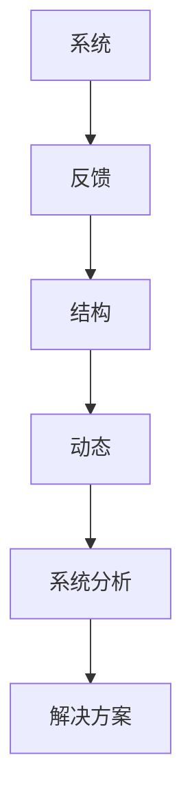

                 

关键词：系统思考、全面分析、关键问题、系统架构、算法原理、数学模型、实践应用、未来展望

> 摘要：本文将探讨系统思考在全面分析关键问题中的重要性。通过阐述系统思考的核心概念、算法原理、数学模型以及实际应用场景，旨在为读者提供一个深入理解系统思考方法及其应用价值的框架。

## 1. 背景介绍

在当今复杂多变的世界中，系统思考已成为解决各类问题的关键工具。无论是企业管理、科技创新，还是社会问题，系统思考都能够帮助我们以全局视角理解问题，找出问题的本质和根源。

系统思考最早由系统理论家亚瑟·帕特里克·亨利·凯斯（Arthur H.凯斯，1911-1983）提出，他主张将复杂系统视为一个整体，通过识别系统内部的各种关系和相互作用来理解系统的动态行为。此后，系统思考在多个领域得到广泛应用，成为解决复杂问题的重要方法论。

## 2. 核心概念与联系

为了更好地理解系统思考，我们首先需要了解其核心概念和原理，并通过一个Mermaid流程图来展示这些概念之间的联系。

### 2.1 核心概念

1. **系统**：一个由相互关联的部分组成的整体，这些部分共同作用以实现某个目标。
2. **反馈**：系统中不同部分之间的相互作用，可以是正向反馈（增强系统行为）或负向反馈（抑制系统行为）。
3. **结构**：系统的组成部分及其相互关系，决定了系统的行为。
4. **动态**：系统在时间上的变化过程。

### 2.2 Mermaid流程图



## 3. 核心算法原理 & 具体操作步骤

### 3.1 算法原理概述

系统思考的核心算法是基于对系统的反馈结构进行分析和建模。这一过程主要包括以下步骤：

1. **系统识别**：确定需要分析的系统及其组成部分。
2. **结构分析**：识别系统中各部分之间的关系和相互作用。
3. **动态模拟**：建立系统的数学模型，模拟系统的行为变化。
4. **问题诊断**：通过模拟结果，识别系统中的问题及其根源。
5. **解决方案**：根据问题诊断结果，提出并实施解决方案。

### 3.2 算法步骤详解

#### 3.2.1 系统识别

首先，我们需要明确要分析的系统及其边界。这可以通过绘制系统图来完成，系统图显示了系统中各部分的相互关系。

#### 3.2.2 结构分析

接下来，我们对系统进行结构分析，识别系统中各部分之间的反馈关系。这可以通过建立因果关系图来完成。

#### 3.2.3 动态模拟

在结构分析的基础上，我们建立系统的数学模型，进行动态模拟。这通常需要使用差分方程、微分方程或状态空间模型等。

#### 3.2.4 问题诊断

通过模拟结果，我们可以识别系统中的问题及其根源。问题诊断的结果可以帮助我们确定需要改进的方面。

#### 3.2.5 解决方案

最后，根据问题诊断结果，我们提出并实施解决方案。解决方案可以是调整系统结构、改变反馈机制，或者引入新的控制策略等。

### 3.3 算法优缺点

**优点**：

- 全面性：系统思考方法能够从整体上理解系统的动态行为，提供全面的视角。
- 灵活性：系统思考方法适用于各种类型的系统，可以应用于不同领域的问题。

**缺点**：

- 复杂性：系统思考方法涉及到复杂的数学模型和计算，对分析者的要求较高。
- 时间成本：系统思考方法需要大量时间和精力进行系统识别、结构分析和动态模拟等步骤。

### 3.4 算法应用领域

系统思考方法广泛应用于各个领域，包括：

- **企业管理**：用于战略规划、风险管理、组织设计等。
- **科技创新**：用于技术创新、产品设计、技术预测等。
- **社会问题**：用于政策制定、社会分析、环境问题等。

## 4. 数学模型和公式 & 详细讲解 & 举例说明

### 4.1 数学模型构建

在系统思考中，数学模型是分析系统动态行为的重要工具。常见的数学模型包括差分方程、微分方程和状态空间模型等。

#### 4.1.1 差分方程

差分方程用于描述离散时间系统中各部分的变化。其一般形式为：

$$x_{t+1} = f(x_t)$$

其中，$x_t$表示系统在时刻$t$的状态，$f(x_t)$表示系统在下一时刻的状态。

#### 4.1.2 微分方程

微分方程用于描述连续时间系统中各部分的变化。其一般形式为：

$$\frac{dx}{dt} = f(x)$$

其中，$x(t)$表示系统在时刻$t$的状态，$f(x)$表示系统在下一时刻的状态变化率。

#### 4.1.3 状态空间模型

状态空间模型用于描述动态系统的状态变化。其一般形式为：

$$\dot{x} = A \cdot x + B \cdot u$$
$$y = C \cdot x + D \cdot u$$

其中，$x$表示系统状态，$u$表示输入，$y$表示输出，$A$、$B$、$C$和$D$为系统矩阵。

### 4.2 公式推导过程

以状态空间模型为例，我们来看一下其推导过程。

#### 4.2.1 状态方程推导

首先，我们考虑一个线性系统，其状态方程可以表示为：

$$\dot{x} = A \cdot x$$

这是一个一阶线性微分方程。我们可以通过求解该方程得到系统的状态轨迹。

$$x(t) = e^{At} \cdot x(0)$$

其中，$e^{At}$为矩阵指数。

#### 4.2.2 输出方程推导

接下来，我们考虑系统的输出方程：

$$y = C \cdot x$$

这是一个线性变换。我们可以通过求解该方程得到系统的输出轨迹。

$$y(t) = C \cdot e^{At} \cdot x(0)$$

### 4.3 案例分析与讲解

以一个简单的库存管理问题为例，我们来看一下如何应用系统思考方法。

#### 4.3.1 系统识别

假设我们有一个库存系统，包含两个部分：原材料库存和成品库存。我们需要分析这两个库存部分之间的动态关系。

#### 4.3.2 结构分析

通过绘制系统图，我们可以识别出原材料库存和成品库存之间的反馈关系。原材料库存的增加会导致成品库存的增加，而成品库存的增加又会进一步促进原材料库存的增加。

#### 4.3.3 动态模拟

我们可以建立如下的数学模型：

$$\dot{x_1} = r_1 - a_1 \cdot x_1$$
$$\dot{x_2} = r_2 - a_2 \cdot x_2$$

其中，$x_1$表示原材料库存，$x_2$表示成品库存，$r_1$和$r_2$分别为原材料和成品的需求速率，$a_1$和$a_2$分别为原材料和成品的供应速率。

#### 4.3.4 问题诊断

通过模拟结果，我们可以发现当原材料库存增加时，成品库存也会增加，但增长速率逐渐减缓。这可能意味着我们需要调整原材料和成品的供应速率，以提高成品库存的增长速率。

#### 4.3.5 解决方案

根据问题诊断结果，我们可以提出以下解决方案：

- 调整原材料供应速率，以满足成品库存的需求。
- 调整成品供应速率，以提高成品库存的增长速率。

## 5. 项目实践：代码实例和详细解释说明

### 5.1 开发环境搭建

在本节中，我们将使用Python作为编程语言，并利用一些常用的库，如NumPy和Matplotlib，来构建和模拟我们的库存管理模型。

### 5.2 源代码详细实现

下面是一个简单的Python代码示例，用于模拟库存管理系统的动态行为。

```python
import numpy as np
import matplotlib.pyplot as plt

# 系统参数
r1 = 5  # 原材料需求速率
r2 = 2  # 成品需求速率
a1 = 3  # 原材料供应速率
a2 = 1  # 成品供应速率

# 状态空间矩阵
A = np.array([[0, 1], [-a1/a2, 0]])
B = np.array([[r1/a2], [r2/a2]])
C = np.array([[1, 0], [0, 1]])
D = np.array([[0], [0]])

# 模拟时间步长
t = np.linspace(0, 20, 500)

# 状态转移矩阵
eAt = np.eye(2) + A*t + (A**2)*(t**2)/2

# 模拟状态和输出
x0 = np.array([[1], [1]])  # 初始状态
X = eAt @ x0 + B @ t
y = C @ X + D @ t

# 绘制结果
plt.figure()
plt.plot(t, X[0], label='原材料库存')
plt.plot(t, X[1], label='成品库存')
plt.xlabel('时间')
plt.ylabel('库存量')
plt.legend()
plt.title('库存管理系统动态模拟')
plt.show()
```

### 5.3 代码解读与分析

在这个示例中，我们首先定义了系统的参数，包括原材料和成品的需求速率以及供应速率。然后，我们创建了状态空间矩阵$A$、$B$、$C$和$D$。

接着，我们使用NumPy的`linspace`函数创建了一个时间数组$t$，用于模拟系统在不同时间点的状态。

我们使用矩阵指数函数`np.eye(2) + A*t + (A**2)*(t**2)/2`计算状态转移矩阵$e^{At}$。

然后，我们通过状态转移矩阵$e^{At}$、初始状态$x0$以及输入矩阵$B$计算系统在各个时间点的状态$X$。

最后，我们使用Matplotlib库绘制了系统在各个时间点的原材料和成品库存量，并显示了模拟结果。

### 5.4 运行结果展示

运行上述代码后，我们将得到一个图形，展示了原材料库存和成品库存随时间的变化。通过这个图形，我们可以直观地看到库存量的动态变化，从而帮助进行库存管理的决策。

## 6. 实际应用场景

系统思考方法在众多实际应用场景中展现出了其强大的分析能力和决策支持作用。以下是一些典型的应用场景：

### 6.1 企业管理

在企业战略规划、供应链管理、风险管理等方面，系统思考可以帮助企业识别潜在问题，优化资源配置，提高运营效率。

### 6.2 科技创新

在科技创新领域，系统思考方法可以用于技术预测、产品创新、技术路径规划等方面，帮助企业把握行业趋势，加快技术创新。

### 6.3 社会问题

在社会治理、公共卫生、环境保护等领域，系统思考可以帮助政府和社会组织更好地应对复杂社会问题，提高政策制定的科学性。

### 6.4 个人成长

对于个人而言，系统思考方法可以帮助我们更好地理解自己的生活和工作，从而实现个人成长和目标达成。

## 6.4 未来应用展望

随着人工智能和大数据技术的发展，系统思考方法在应用场景和工具方面都将得到进一步拓展。未来，系统思考方法有望在以下方面取得突破：

### 6.4.1 智能决策支持

结合人工智能技术，系统思考方法可以用于构建智能决策支持系统，为复杂决策提供更加准确和全面的决策依据。

### 6.4.2 大数据处理

大数据技术的快速发展为系统思考提供了丰富的数据支持，未来系统思考方法可以更好地应对大数据环境下的复杂问题。

### 6.4.3 跨学科融合

系统思考方法与其他学科（如经济学、社会学、心理学等）的融合，将推动系统思考在更广泛的领域发挥作用。

## 7. 工具和资源推荐

### 7.1 学习资源推荐

1. 《系统思考》（作者：唐纳德·S·霍尔）
2. 《系统动力学与系统思维》（作者：杰里米·里夫金）
3. 《复杂系统的复杂性：系统思考与模拟》（作者：威廉·布雷尔）

### 7.2 开发工具推荐

1. Python（数据分析、模拟编程）
2. R（统计分析、数据可视化）
3. MATLAB（数学建模、模拟分析）

### 7.3 相关论文推荐

1. "System Dynamics: A Tool for Policy Analysis"（作者：杰里米·里夫金）
2. "Modeling Complex Systems"（作者：威廉·布雷尔）
3. "The Power of Systems Thinking"（作者：唐纳德·S·霍尔）

## 8. 总结：未来发展趋势与挑战

系统思考作为一种重要的方法论，在解决复杂问题时具有独特的优势。然而，随着问题的复杂性和多样性的增加，系统思考也面临着新的挑战：

### 8.1 研究成果总结

系统思考方法在多个领域取得了显著的研究成果，为解决复杂问题提供了有力支持。

### 8.2 未来发展趋势

未来，系统思考方法将更多地与人工智能、大数据等新兴技术相结合，推动其在更广泛领域的应用。

### 8.3 面临的挑战

1. 复杂系统的建模与模拟：如何更准确地建模复杂系统，提高模拟的精度和效率。
2. 数据分析与处理：如何处理海量数据，从数据中提取有价值的信息。
3. 人才培养：如何培养更多具备系统思考能力的专业人才。

### 8.4 研究展望

随着技术的不断进步，系统思考方法在解决复杂问题中的应用前景将更加广阔。未来，系统思考将与其他学科和技术的融合，为解决全球性问题提供更加全面和有效的解决方案。

## 9. 附录：常见问题与解答

### 9.1 系统思考与系统动力学有何区别？

系统思考（Systems Thinking）和系统动力学（System Dynamics）都是用于分析复杂系统的工具。系统动力学更侧重于系统的动态行为和反馈机制，强调系统的延迟效应。而系统思考则更关注系统整体的结构和层次，强调从全局视角理解系统问题。两者在某些方面有重叠，但在应用场景和侧重点上有所不同。

### 9.2 系统思考方法是否适用于所有问题？

系统思考方法在解决复杂问题时具有独特的优势，但并非适用于所有问题。对于简单、线性的问题，其他方法可能更为有效。系统思考方法适用于需要理解系统内部复杂关系和动态行为的问题，如企业战略规划、供应链管理、技术创新等。

### 9.3 如何提高系统思考能力？

提高系统思考能力需要不断的学习和实践。以下是一些建议：

1. 阅读相关书籍和论文，了解系统思考的理论和方法。
2. 参与实际项目，应用系统思考方法解决实际问题。
3. 学习相关技术，如数学建模、模拟分析等。
4. 与同行交流，分享经验和见解。

---

**作者：禅与计算机程序设计艺术 / Zen and the Art of Computer Programming**

<|endofhelper|>

