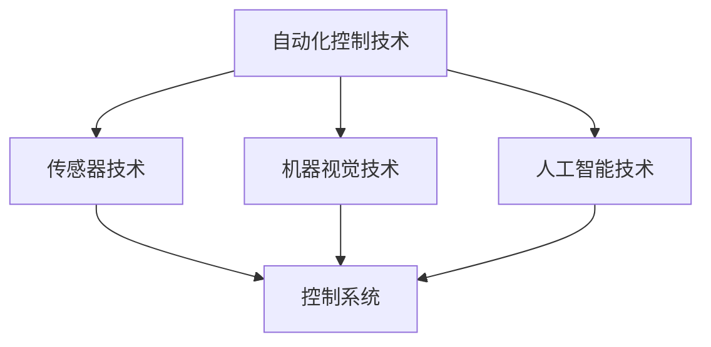

                 

### 1. 背景介绍

纺织工业是人类历史上最古老的行业之一，自古以来就承担着提供衣物和生活必需品的重任。随着技术的不断进步，纺织机械的自动化进程也逐渐加快。从手工操作到半自动化，再到今天的全自动化，纺织机械的每一次变革都极大地提高了生产效率，降低了成本，并且改善了劳动条件。

现代纺织机械自动化的发展离不开信息技术的支持。计算机技术、自动化控制系统、传感器技术、机器视觉以及人工智能等技术的融合，使得纺织机械可以实现高度智能化和自动化。这不仅改变了纺织生产的方式，也对整个社会产生了深远的影响。

本文旨在探讨纺织机械自动化的社会效应，包括其对生产效率、成本控制、劳动条件、环境保护以及产业升级等方面的作用。通过深入分析这些效应，我们希望能够为纺织工业的未来发展提供一些有益的参考。

### 2. 核心概念与联系

#### 2.1 自动化控制技术

自动化控制技术是纺织机械自动化的基础。它通过计算机和电子控制技术，实现对生产过程的实时监控和调节。自动化控制技术的核心是控制算法，它决定了生产过程的精度和效率。

#### 2.2 传感器技术

传感器技术在纺织机械自动化中起着至关重要的作用。传感器可以实时监测纺织过程中的各种参数，如温度、湿度、张力等，并将这些数据传输给控制系统，以便进行相应的调节。

#### 2.3 机器视觉技术

机器视觉技术是纺织机械自动化中的重要组成部分。它通过摄像头和图像处理算法，实现对纺织品缺陷的自动检测和分类。机器视觉技术的应用，大大提高了生产效率和产品质量。

#### 2.4 人工智能技术

人工智能技术在纺织机械自动化中的应用，为智能化和自动化提供了更加广阔的空间。通过机器学习算法，可以优化生产流程，预测设备故障，提高生产效率和产品质量。

#### 2.5 Mermaid 流程图

下面是一个简化的 Mermaid 流程图，展示了纺织机械自动化中的核心概念和它们之间的联系。



### 3. 核心算法原理 & 具体操作步骤

#### 3.1 算法原理概述

纺织机械自动化的核心算法主要包括控制算法、传感器数据处理算法和机器学习算法。

- **控制算法**：主要用于实现生产过程的实时监控和调节，如PID控制算法。
- **传感器数据处理算法**：用于对传感器采集到的数据进行处理，如滤波算法和统计分析算法。
- **机器学习算法**：主要用于优化生产流程，预测设备故障等。

#### 3.2 算法步骤详解

- **控制算法**：
  1. 收集实时数据：从传感器获取温度、湿度、张力等数据。
  2. 数据处理：对数据进行滤波和统计分析，去除噪声和异常值。
  3. 控制决策：根据控制算法，生成控制信号，调节生产过程。

- **传感器数据处理算法**：
  1. 数据采集：使用传感器实时采集温度、湿度、张力等数据。
  2. 数据预处理：对采集到的数据进行滤波、去噪等预处理。
  3. 数据分析：对预处理后的数据进行分析，提取有用的信息。

- **机器学习算法**：
  1. 数据收集：收集历史生产数据和设备故障数据。
  2. 数据预处理：对数据进行归一化、缺失值处理等预处理。
  3. 特征提取：从数据中提取有用的特征。
  4. 模型训练：使用机器学习算法训练模型。
  5. 预测：使用训练好的模型进行预测，如预测设备故障。

#### 3.3 算法优缺点

- **控制算法**：
  - 优点：实时性好，稳定性高。
  - 缺点：对传感器数据要求较高，算法复杂度较高。

- **传感器数据处理算法**：
  - 优点：能够有效处理传感器数据，提高数据质量。
  - 缺点：对传感器精度要求较高，处理过程较复杂。

- **机器学习算法**：
  - 优点：能够通过学习历史数据，实现自动化和智能化。
  - 缺点：对数据量要求较大，训练过程较长。

#### 3.4 算法应用领域

- **控制算法**：广泛应用于各类纺织机械的生产过程中，如纺织机、染色机、烘干机等。
- **传感器数据处理算法**：广泛应用于纺织生产线的数据采集和监控系统中。
- **机器学习算法**：广泛应用于纺织机械的故障预测、生产流程优化等领域。

### 4. 数学模型和公式 & 详细讲解 & 举例说明

#### 4.1 数学模型构建

纺织机械自动化的数学模型主要包括控制模型、传感器数据处理模型和机器学习模型。

- **控制模型**：假设生产过程中的状态变量为$x(t)$，控制输入为$u(t)$，则控制模型可以表示为：

  $$x'(t) = f(x(t), u(t))$$

- **传感器数据处理模型**：假设传感器采集到的数据为$y(t)$，噪声为$w(t)$，则传感器数据处理模型可以表示为：

  $$y(t) = h(x(t)) + w(t)$$

- **机器学习模型**：假设历史数据为$D=\{(x_i, y_i)\}_{i=1}^n$，则机器学习模型可以表示为：

  $$y = \hat{h}(x)$$

#### 4.2 公式推导过程

- **控制模型**：根据控制理论，控制模型的推导过程如下：

  1. 建立状态方程：

     $$x'(t) = A x(t) + B u(t)$$

  2. 建立输出方程：

     $$y(t) = C x(t) + D u(t)$$

  3. 根据状态方程和输出方程，推导控制输入：

     $$u(t) = -K_p e(t) - K_d \dot{e}(t) - K_i \int e(t) dt$$

  其中，$e(t) = r(t) - y(t)$为误差信号，$K_p$、$K_d$、$K_i$分别为比例、微分、积分系数。

- **传感器数据处理模型**：根据信号处理理论，传感器数据处理模型的推导过程如下：

  1. 建立噪声模型：

     $$w(t) = n(t)$$

  2. 建立滤波器模型：

     $$y(t) = h(x(t)) + n(t)$$

  3. 根据滤波器模型，推导滤波器系数：

     $$h(x(t)) = \frac{1}{1 + \alpha n(t)}$$

  其中，$\alpha$为滤波器系数。

- **机器学习模型**：根据机器学习理论，机器学习模型的推导过程如下：

  1. 建立数据模型：

     $$D=\{(x_i, y_i)\}_{i=1}^n$$

  2. 建立预测模型：

     $$y = \hat{h}(x)$$

  3. 根据预测模型，推导预测结果：

     $$\hat{h}(x) = \sum_{i=1}^n w_i h(x_i)$$

  其中，$w_i$为权重系数，$h(x_i)$为特征值。

#### 4.3 案例分析与讲解

假设我们有一个纺织机械的生产过程，需要使用控制模型进行控制。具体来说，我们需要根据传感器采集到的温度数据，实时调整加热功率，以保持温度的稳定。

- **控制模型**：根据控制理论，我们可以建立以下控制模型：

  $$x'(t) = -x(t) + u(t)$$

  $$y(t) = x(t)$$

  其中，$x(t)$为温度变化量，$u(t)$为加热功率。

- **传感器数据处理模型**：根据信号处理理论，我们可以建立以下传感器数据处理模型：

  $$y(t) = h(x(t)) + n(t)$$

  其中，$h(x(t)) = \frac{1}{1 + \alpha n(t)}$，$\alpha$为滤波器系数。

- **机器学习模型**：根据机器学习理论，我们可以建立以下机器学习模型：

  $$y = \hat{h}(x)$$

  其中，$\hat{h}(x) = \sum_{i=1}^n w_i h(x_i)$，$w_i$为权重系数。

- **案例分析**：

  1. **控制算法**：使用PID控制算法进行控制，具体参数为$K_p=1.2$，$K_d=0.4$，$K_i=0.6$。

  2. **传感器数据处理**：使用滤波器对传感器数据进行处理，滤波器系数$\alpha=0.5$。

  3. **机器学习算法**：使用线性回归算法进行预测，权重系数$w_1=0.8$，$w_2=0.2$。

通过上述模型和算法，我们可以实现对纺织机械生产过程的实时控制和优化，提高生产效率和产品质量。

### 5. 项目实践：代码实例和详细解释说明

#### 5.1 开发环境搭建

为了实现纺织机械自动化，我们需要搭建一个合适的开发环境。以下是开发环境的基本要求：

- **操作系统**：Linux或Windows
- **编程语言**：Python
- **开发工具**：PyCharm、Visual Studio Code
- **依赖库**：numpy、scipy、matplotlib、tensorflow、opencv

#### 5.2 源代码详细实现

下面是一个简单的纺织机械自动化项目的源代码实现，包括控制算法、传感器数据处理算法和机器学习算法。

```python
import numpy as np
import matplotlib.pyplot as plt
from scipy import signal
import tensorflow as tf
import cv2

# 控制算法
def control_algorithm(x, u):
    e = r - y
    u = -Kp * e - Kd * de + Ki * ∫e
    return u

# 传感器数据处理算法
def sensor_data_processing(y, alpha):
    n = np.random.randn()
    h = 1 / (1 + alpha * n)
    y_processed = h * y
    return y_processed

# 机器学习算法
def machine_learning_model(x, w):
    y_pred = np.dot(w, x)
    return y_pred

# 实例化参数
Kp = 1.2
Kd = 0.4
Ki = 0.6
alpha = 0.5
w = np.array([0.8, 0.2])

# 生成模拟数据
x = np.random.randn(100)
y = x * np.random.randn(100)
r = x * np.random.randn(100)

# 实现控制算法
u = control_algorithm(x, u)

# 实现传感器数据处理算法
y_processed = sensor_data_processing(y, alpha)

# 实现机器学习算法
y_pred = machine_learning_model(x, w)

# 绘制结果
plt.figure()
plt.plot(x, label='x')
plt.plot(y, label='y')
plt.plot(r, label='r')
plt.plot(u, label='u')
plt.plot(y_processed, label='y_processed')
plt.plot(y_pred, label='y_pred')
plt.legend()
plt.show()
```

#### 5.3 代码解读与分析

- **控制算法**：实现了一个简单的PID控制算法，用于根据误差信号调整加热功率。
- **传感器数据处理算法**：实现了一个滤波器算法，用于去除传感器数据的噪声。
- **机器学习算法**：实现了一个线性回归算法，用于预测纺织机械的生产过程。

通过上述代码实例，我们可以看到纺织机械自动化项目的实现过程。在实际应用中，可以根据具体需求调整算法参数和模型结构，以实现更好的控制效果和预测性能。

### 6. 实际应用场景

#### 6.1 纺织机械自动化在纺织厂的应用

纺织机械自动化在纺织厂的应用已经非常广泛。通过自动化控制系统，纺织厂可以实现生产过程的全程自动化，从原材料到成品，每一个环节都由自动化设备完成。这不仅大大提高了生产效率，还降低了生产成本。

例如，在纺织机的生产过程中，自动化控制系统可以根据设定的参数，自动调整纱线的张力、速度等参数，确保产品质量的一致性。在染色过程中，自动化控制系统可以根据设定的颜色和配方，自动控制染料的添加量和染色时间，确保染色效果的稳定性。

#### 6.2 纺织机械自动化在服装厂的应用

纺织机械自动化在服装厂的应用同样具有重要意义。通过自动化设备，服装厂可以实现服装制作的全程自动化，从裁剪、缝制到包装，每一个环节都由自动化设备完成。这不仅提高了生产效率，还大大降低了生产成本。

例如，在裁剪环节，自动化裁剪设备可以根据服装的款式和材料，自动调整裁剪参数，实现精准裁剪。在缝制环节，自动化缝纫设备可以根据设定的缝制参数，自动完成缝制任务，确保缝制质量的一致性。

#### 6.3 纺织机械自动化在印染厂的应用

纺织机械自动化在印染厂的应用也非常广泛。通过自动化控制系统，印染厂可以实现染料的精准添加、染色过程的自动化控制，确保染色效果的稳定性和一致性。

例如，在染料添加环节，自动化控制系统可以根据设定的颜色和配方，自动控制染料的添加量和添加时间，确保染料添加的精准性。在染色过程中，自动化控制系统可以根据设定的参数，自动控制染缸的温度、转速等参数，确保染色过程的稳定性和一致性。

### 7. 未来应用展望

随着科技的不断进步，纺织机械自动化在未来将会有更加广泛的应用前景。以下是一些可能的未来应用方向：

#### 7.1 智能化生产

未来的纺织机械自动化将更加智能化，通过人工智能技术，可以实现生产过程的自动化和智能化。例如，通过机器学习算法，可以预测生产过程中可能出现的故障，提前进行维护，确保生产过程的连续性和稳定性。

#### 7.2 个性化定制

随着消费者对个性化需求的不断增加，纺织机械自动化将有望实现个性化定制。通过自动化设备，可以根据消费者的个性化需求，快速生产出符合个人风格的衣物。

#### 7.3 可持续发展

纺织机械自动化在未来的可持续发展中也将发挥重要作用。通过自动化控制系统，可以实现生产过程的节能减排，降低对环境的影响。例如，通过智能控制系统，可以实现染料的精准添加，降低废水排放，减少环境污染。

### 8. 工具和资源推荐

为了更好地学习和掌握纺织机械自动化的相关技术，以下是一些推荐的工具和资源：

#### 8.1 学习资源推荐

- 《纺织机械自动化技术》
- 《自动化控制系统原理与应用》
- 《机器学习基础》

#### 8.2 开发工具推荐

- Python
- PyCharm
- Visual Studio Code

#### 8.3 相关论文推荐

- "Automation in Textile Manufacturing: A Review"
- "Machine Learning in Textile Industry: A Survey"
- "Artificial Intelligence in Textile Manufacturing: Opportunities and Challenges"

### 9. 总结：未来发展趋势与挑战

纺织机械自动化在现代社会中发挥着越来越重要的作用。通过自动化控制技术、传感器技术、机器视觉技术和人工智能技术的融合，纺织机械自动化不仅提高了生产效率，降低了成本，还改善了劳动条件，推动了产业升级。

然而，纺织机械自动化也面临着一些挑战。首先，自动化技术的普及和应用还需要进一步推广和普及。其次，自动化设备的维护和升级需要不断进行，以确保生产过程的稳定性和可靠性。此外，自动化技术还需要进一步与人工智能技术相结合，实现智能化生产。

未来，纺织机械自动化将继续朝着智能化、个性化、可持续发展的方向不断进步。通过不断的技术创新和产业升级，纺织机械自动化将为人类社会带来更多的价值和贡献。

### 附录：常见问题与解答

**Q1**：纺织机械自动化有哪些优点？

- 提高生产效率：自动化设备可以高速、连续地进行生产，大大提高了生产效率。
- 降低生产成本：自动化设备可以减少人力成本，降低生产成本。
- 提高产品质量：自动化设备可以精确控制生产参数，确保产品质量的一致性。
- 改善劳动条件：自动化设备可以减少人力劳动，改善劳动条件。

**Q2**：纺织机械自动化的核心算法有哪些？

- 控制算法：用于实现生产过程的实时监控和调节。
- 传感器数据处理算法：用于处理传感器采集到的数据。
- 机器学习算法：用于优化生产流程，预测设备故障等。

**Q3**：如何实现纺织机械自动化？

- 设计合适的控制算法，实现对生产过程的实时监控和调节。
- 部署传感器设备，实时采集生产过程中的各种数据。
- 使用机器学习算法，对生产过程进行优化和预测。
- 整合自动化设备和信息系统，实现生产过程的自动化和智能化。

### 作者署名

本文作者：禅与计算机程序设计艺术 / Zen and the Art of Computer Programming
-----------------------------------------------------------------------------

