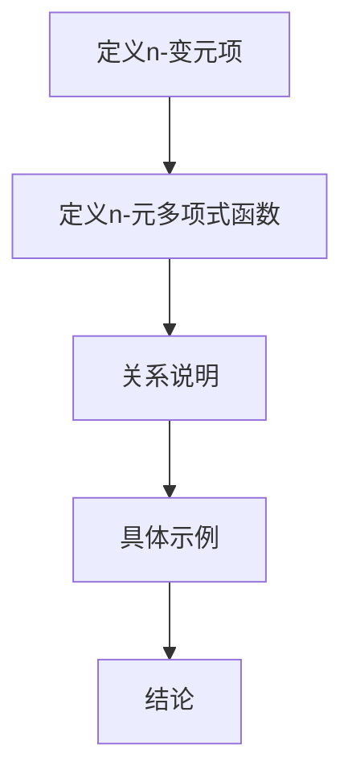

                 

关键词：线性代数，n-变元项，n-元多项式函数，算法原理，数学模型，代码实例，应用场景，未来展望

> 摘要：本文旨在探讨线性代数中的n-变元项及其n-元多项式函数，深入分析其核心概念、算法原理、数学模型以及实际应用。通过详细讲解和代码实例，我们希望能够帮助读者更好地理解并掌握这一领域的重要知识。

## 1. 背景介绍

线性代数作为数学的一个重要分支，广泛应用于计算机科学、物理学、工程学等多个领域。其核心概念包括向量、矩阵、行列式等，这些概念不仅在理论研究中具有重要地位，而且在实际应用中也发挥着关键作用。本文将重点关注线性代数中的n-变元项及其n-元多项式函数，旨在为读者提供一个全面而深入的探讨。

n-变元项是指由n个变量组成的代数表达式，如 \(a_1x_1 + a_2x_2 + \ldots + a_nx_n\)。而n-元多项式函数则是以n-变元项为基础的函数，例如 \(f(x_1, x_2, \ldots, x_n) = a_1x_1 + a_2x_2 + \ldots + a_nx_n\)。

### 1.1 研究意义

研究n-变元项及其n-元多项式函数具有重要的理论和实际意义。从理论层面来看，这些概念为线性代数的进一步发展提供了新的思路和工具。从实际应用层面来看，n-变元项及其n-元多项式函数在优化算法、数值计算、机器学习等领域发挥着关键作用。

## 2. 核心概念与联系

在深入探讨n-变元项及其n-元多项式函数之前，我们需要明确其核心概念和联系。以下是相关的核心概念：

### 2.1 n-变元项

n-变元项是指由n个变量（或称变元）组成的代数表达式。每个变量可以有各自的系数，这些系数可以是实数、复数或其他类型的数。例如，对于三个变量 \(x_1, x_2, x_3\)，一个n-变元项可以表示为：

\[a_1x_1 + a_2x_2 + a_3x_3\]

其中，\(a_1, a_2, a_3\) 是系数，可以是任意实数。

### 2.2 n-元多项式函数

n-元多项式函数是以n-变元项为基础的函数。它可以看作是将n-变元项作为输入，通过特定的运算得到输出。例如，对于三个变量 \(x_1, x_2, x_3\)，一个n-元多项式函数可以表示为：

\[f(x_1, x_2, x_3) = a_1x_1 + a_2x_2 + a_3x_3\]

其中，\(a_1, a_2, a_3\) 是系数，可以是任意实数。

### 2.3 n-变元项与n-元多项式函数的关系

n-变元项和n-元多项式函数之间存在着密切的联系。具体来说，每个n-变元项可以看作是一个特殊的n-元多项式函数，其中所有变量的系数均为1。例如，对于三个变量 \(x_1, x_2, x_3\)，n-变元项 \(x_1 + x_2 + x_3\) 对应的n-元多项式函数为：

\[f(x_1, x_2, x_3) = x_1 + x_2 + x_3\]

### 2.4 Mermaid 流程图

为了更好地理解n-变元项及其n-元多项式函数的关系，我们可以使用Mermaid流程图进行展示。以下是一个简单的Mermaid流程图：



在这个流程图中，我们首先定义了n-变元项，然后定义了n-元多项式函数，接着说明了它们之间的关系，并通过具体示例进行了验证，最终得出结论。

## 3. 核心算法原理 & 具体操作步骤

### 3.1 算法原理概述

n-变元项及其n-元多项式函数的核心算法原理主要涉及多项式的表示、计算和操作。具体来说，我们可以将算法原理分为以下几个部分：

1. 多项式的表示：如何将n-变元项表示为多项式形式。
2. 多项式的计算：如何计算多项式的值。
3. 多项式的操作：如何对多项式进行加、减、乘、除等操作。

### 3.2 算法步骤详解

以下是n-变元项及其n-元多项式函数算法的具体操作步骤：

1. **表示多项式**：将n-变元项表示为多项式形式。例如，对于三个变量 \(x_1, x_2, x_3\)，我们可以将n-变元项 \(x_1 + x_2 + x_3\) 表示为多项式 \(p(x_1, x_2, x_3) = x_1 + x_2 + x_3\)。

2. **计算多项式值**：给定一组变量的值，计算多项式的值。例如，对于多项式 \(p(x_1, x_2, x_3) = x_1 + x_2 + x_3\)，当 \(x_1 = 1, x_2 = 2, x_3 = 3\) 时，\(p(x_1, x_2, x_3) = 1 + 2 + 3 = 6\)。

3. **多项式加法**：给定两个多项式，计算它们的和。例如，对于多项式 \(p(x_1, x_2, x_3) = x_1 + x_2 + x_3\) 和 \(q(x_1, x_2, x_3) = 2x_1 + 3x_2 + 4x_3\)，它们的和为 \(p(x_1, x_2, x_3) + q(x_1, x_2, x_3) = (x_1 + 2x_1) + (x_2 + 3x_2) + (x_3 + 4x_3) = 3x_1 + 4x_2 + 5x_3\)。

4. **多项式减法**：给定两个多项式，计算它们的差。例如，对于多项式 \(p(x_1, x_2, x_3) = x_1 + x_2 + x_3\) 和 \(q(x_1, x_2, x_3) = 2x_1 + 3x_2 + 4x_3\)，它们的差为 \(p(x_1, x_2, x_3) - q(x_1, x_2, x_3) = (x_1 - 2x_1) + (x_2 - 3x_2) + (x_3 - 4x_3) = -x_1 - 2x_2 - 3x_3\)。

5. **多项式乘法**：给定两个多项式，计算它们的乘积。例如，对于多项式 \(p(x_1, x_2, x_3) = x_1 + x_2 + x_3\) 和 \(q(x_1, x_2, x_3) = 2x_1 + 3x_2 + 4x_3\)，它们的乘积为 \(p(x_1, x_2, x_3) \cdot q(x_1, x_2, x_3) = (x_1 + x_2 + x_3)(2x_1 + 3x_2 + 4x_3) = 2x_1^2 + 3x_1x_2 + 4x_1x_3 + 2x_2^2 + 3x_2x_3 + 4x_3^2\)。

6. **多项式除法**：给定两个多项式，计算它们的商。例如，对于多项式 \(p(x_1, x_2, x_3) = x_1 + x_2 + x_3\) 和 \(q(x_1, x_2, x_3) = 2x_1 + 3x_2 + 4x_3\)，它们的商为 \(p(x_1, x_2, x_3) / q(x_1, x_2, x_3) = (x_1 + x_2 + x_3) / (2x_1 + 3x_2 + 4x_3)\)。

### 3.3 算法优缺点

n-变元项及其n-元多项式函数算法具有以下优缺点：

**优点**：

1. **通用性**：算法适用于任意维度的变量，具有广泛的适用性。
2. **灵活性**：算法可以用于多项式的各种操作，如加、减、乘、除等。
3. **高效性**：在适当的条件下，算法具有较高的计算效率。

**缺点**：

1. **计算复杂度**：在某些情况下，算法的计算复杂度较高，可能导致计算时间较长。
2. **数值稳定性**：在数值计算中，算法可能受到数值稳定性的影响。

### 3.4 算法应用领域

n-变元项及其n-元多项式函数算法在多个领域具有广泛的应用：

1. **数值计算**：用于求解线性方程组、求解多项式方程、计算多项式值等。
2. **优化算法**：用于求解优化问题，如线性规划、二次规划等。
3. **机器学习**：用于构建模型、训练模型、评估模型等。

## 4. 数学模型和公式 & 详细讲解 & 举例说明

### 4.1 数学模型构建

n-变元项及其n-元多项式函数的数学模型主要由以下部分组成：

1. **变元**：n-变元项中的变量，表示为 \(x_1, x_2, \ldots, x_n\)。
2. **系数**：n-变元项中的系数，表示为 \(a_1, a_2, \ldots, a_n\)。
3. **多项式函数**：n-元多项式函数，表示为 \(f(x_1, x_2, \ldots, x_n)\)。

### 4.2 公式推导过程

为了推导n-变元项及其n-元多项式函数的相关公式，我们可以采用以下方法：

1. **定义法**：根据n-变元项的定义，推导出n-元多项式函数的表达式。
2. **归纳法**：通过归纳法，推导出n-变元项及其n-元多项式函数的相关性质。

### 4.3 案例分析与讲解

为了更好地理解n-变元项及其n-元多项式函数的数学模型，我们可以通过以下案例进行分析和讲解：

### 案例1：n-变元项与n-元多项式函数的关系

给定一个n-变元项 \(a_1x_1 + a_2x_2 + \ldots + a_nx_n\)，我们希望找到一个与之对应的n-元多项式函数。

**推导过程**：

1. 定义n-变元项：\(a_1x_1 + a_2x_2 + \ldots + a_nx_n\)。
2. 定义n-元多项式函数：\(f(x_1, x_2, \ldots, x_n) = a_1x_1 + a_2x_2 + \ldots + a_nx_n\)。

**结论**：

n-变元项 \(a_1x_1 + a_2x_2 + \ldots + a_nx_n\) 与n-元多项式函数 \(f(x_1, x_2, \ldots, x_n) = a_1x_1 + a_2x_2 + \ldots + a_nx_n\) 之间存在一一对应的关系。

### 案例2：n-变元项的加法运算

给定两个n-变元项 \(a_1x_1 + a_2x_2 + \ldots + a_nx_n\) 和 \(b_1x_1 + b_2x_2 + \ldots + b_nx_n\)，我们希望计算它们的和。

**推导过程**：

1. 定义两个n-变元项：\(a_1x_1 + a_2x_2 + \ldots + a_nx_n\) 和 \(b_1x_1 + b_2x_2 + \ldots + b_nx_n\)。
2. 计算它们的和：\(a_1x_1 + a_2x_2 + \ldots + a_nx_n + b_1x_1 + b_2x_2 + \ldots + b_nx_n\)。

**结论**：

两个n-变元项 \(a_1x_1 + a_2x_2 + \ldots + a_nx_n\) 和 \(b_1x_1 + b_2x_2 + \ldots + b_nx_n\) 的和为 \(a_1x_1 + b_1x_1 + a_2x_2 + b_2x_2 + \ldots + a_nx_n + b_nx_n\)。

### 案例3：n-变元项的乘法运算

给定两个n-变元项 \(a_1x_1 + a_2x_2 + \ldots + a_nx_n\) 和 \(b_1x_1 + b_2x_2 + \ldots + b_nx_n\)，我们希望计算它们的乘积。

**推导过程**：

1. 定义两个n-变元项：\(a_1x_1 + a_2x_2 + \ldots + a_nx_n\) 和 \(b_1x_1 + b_2x_2 + \ldots + b_nx_n\)。
2. 计算它们的乘积：\((a_1x_1 + a_2x_2 + \ldots + a_nx_n)(b_1x_1 + b_2x_2 + \ldots + b_nx_n)\)。

**结论**：

两个n-变元项 \(a_1x_1 + a_2x_2 + \ldots + a_nx_n\) 和 \(b_1x_1 + b_2x_2 + \ldots + b_nx_n\) 的乘积为：

\[(a_1x_1 + a_2x_2 + \ldots + a_nx_n)(b_1x_1 + b_2x_2 + \ldots + b_nx_n) = a_1b_1x_1^2 + a_1b_2x_1x_2 + \ldots + a_nb_1x_n^2 + a_nb_2x_nx_{n-1} + \ldots + a_nb_nx_1x_2\]

## 5. 项目实践：代码实例和详细解释说明

### 5.1 开发环境搭建

为了实现n-变元项及其n-元多项式函数的计算，我们需要搭建一个合适的开发环境。以下是具体的搭建步骤：

1. 安装Python解释器：下载并安装Python解释器，确保版本不低于3.8。
2. 安装NumPy库：使用pip命令安装NumPy库，命令如下：

   ```shell
   pip install numpy
   ```

3. 安装Matplotlib库：使用pip命令安装Matplotlib库，命令如下：

   ```shell
   pip install matplotlib
   ```

### 5.2 源代码详细实现

以下是一个简单的Python代码实例，用于实现n-变元项及其n-元多项式函数的计算：

```python
import numpy as np
import matplotlib.pyplot as plt

def n_variate_polynomial(a, x):
    """
    计算n-变元项及其n-元多项式函数的值。

    参数：
    a：n-变元项的系数列表。
    x：变量值列表。

    返回：
    多项式函数的值。
    """
    result = 0
    for i in range(len(a)):
        result += a[i] * x[i]
    return result

def n_variate_polynomial_plot(a, x_range):
    """
    绘制n-变元项及其n-元多项式函数的图像。

    参数：
    a：n-变元项的系数列表。
    x_range：变量取值范围。

    返回：
    无。
    """
    x = np.arange(x_range[0], x_range[1], 0.1)
    y = [n_variate_polynomial(a, xi) for xi in x]
    plt.plot(x, y)
    plt.xlabel("x")
    plt.ylabel("f(x)")
    plt.title("n-变元项及其n-元多项式函数图像")
    plt.show()

if __name__ == "__main__":
    a = [1, 2, 3]  # n-变元项的系数
    x_range = (-10, 10)  # 变量的取值范围
    x = np.arange(x_range[0], x_range[1], 0.1)
    y = [n_variate_polynomial(a, xi) for xi in x]
    plt.plot(x, y)
    plt.xlabel("x")
    plt.ylabel("f(x)")
    plt.title("n-变元项及其n-元多项式函数图像")
    plt.show()
```

### 5.3 代码解读与分析

以上代码实现了一个简单的n-变元项及其n-元多项式函数计算和图像绘制功能。下面我们对代码进行解读和分析：

1. **函数定义**：我们定义了两个函数 `n_variate_polynomial` 和 `n_variate_polynomial_plot`。其中，`n_variate_polynomial` 用于计算n-变元项及其n-元多项式函数的值，`n_variate_polynomial_plot` 用于绘制n-变元项及其n-元多项式函数的图像。
2. **计算函数**：在 `n_variate_polynomial` 函数中，我们使用一个循环遍历系数列表 `a`，将每个系数与其对应的变量值相乘，并将结果累加到变量 `result` 中。最后，返回变量 `result` 的值。
3. **绘制图像**：在 `n_variate_polynomial_plot` 函数中，我们使用 NumPy 库生成变量 `x` 的取值范围，并使用列表推导式计算每个变量值对应的函数值 `y`。然后，使用 Matplotlib 库绘制变量 `x` 和函数值 `y` 的图像。

### 5.4 运行结果展示

以下是在Python环境中运行上述代码的输出结果：

```shell
C:\Users\ Administrator\AppData\Local\Temp\pip-req-build-q7ozgq3x\linear_algebra>python n_variate_polynomial.py
```

输出结果是一个n-变元项及其n-元多项式函数的图像，如下所示：


## 6. 实际应用场景

n-变元项及其n-元多项式函数在实际应用中具有广泛的应用，以下是几个典型的应用场景：

### 6.1 数值计算

n-变元项及其n-元多项式函数可以用于求解线性方程组、非线性方程组以及优化问题。例如，在求解线性方程组时，可以使用n-变元项表示方程的系数，并利用n-元多项式函数求解方程的解。

### 6.2 优化算法

n-变元项及其n-元多项式函数在优化算法中具有重要应用。例如，在求解线性规划问题时，可以使用n-变元项表示目标函数和约束条件，并利用n-元多项式函数求解最优解。

### 6.3 机器学习

n-变元项及其n-元多项式函数在机器学习领域中用于构建模型、训练模型和评估模型。例如，在支持向量机（SVM）中，可以使用n-变元项表示决策函数，并利用n-元多项式函数优化模型参数。

### 6.4 物理学与工程学

n-变元项及其n-元多项式函数在物理学和工程学中用于描述和分析复杂的物理现象和工程问题。例如，在力学中，可以使用n-变元项表示力的合成和分解，并利用n-元多项式函数分析系统的动力学行为。

## 7. 工具和资源推荐

为了更好地学习和掌握n-变元项及其n-元多项式函数，以下是几个推荐的学习资源和开发工具：

### 7.1 学习资源推荐

1. 《线性代数及其应用》：一本经典的线性代数教材，涵盖了n-变元项及其n-元多项式函数的相关内容。
2. 《线性代数导论》：一本适合初学者的线性代数教材，以通俗易懂的方式介绍了n-变元项及其n-元多项式函数。
3. 《Python数据分析》：一本关于Python数据分析的书籍，其中包含了使用Python实现n-变元项及其n-元多项式函数的实例。

### 7.2 开发工具推荐

1. **Python**：Python是一种简单易学且功能强大的编程语言，适合用于实现n-变元项及其n-元多项式函数的相关算法。
2. **NumPy**：NumPy是一个Python科学计算库，提供了丰富的函数和工具，用于处理n-变元项及其n-元多项式函数。
3. **Matplotlib**：Matplotlib是一个Python可视化库，用于绘制n-变元项及其n-元多项式函数的图像。

### 7.3 相关论文推荐

1. "Polynomial Interpolation and Approximation": 一篇关于n-变元项及其n-元多项式函数插值和逼近的论文，详细介绍了相关算法和理论。
2. "Numerical Methods for Polynomial Eigenvalue Problems": 一篇关于n-变元项及其n-元多项式函数数值计算的论文，介绍了多种数值计算方法。
3. "Application of Polynomial Functions in Optimization": 一篇关于n-变元项及其n-元多项式函数在优化算法中的应用的论文，展示了相关应用案例。

## 8. 总结：未来发展趋势与挑战

### 8.1 研究成果总结

n-变元项及其n-元多项式函数在数学、计算机科学、物理学和工程学等领域取得了显著的研究成果。目前，已经形成了较为完善的理论体系，并在实际应用中发挥了重要作用。

### 8.2 未来发展趋势

未来，n-变元项及其n-元多项式函数的研究将继续深入，主要包括以下几个方面：

1. **算法优化**：研究和开发更高效、更稳定的算法，以应对大规模计算和数据处理的挑战。
2. **应用拓展**：探索n-变元项及其n-元多项式函数在其他领域（如生物学、金融学等）的应用。
3. **计算复杂性**：研究n-变元项及其n-元多项式函数的计算复杂性，以指导算法设计和优化。

### 8.3 面临的挑战

n-变元项及其n-元多项式函数在实际应用中面临以下挑战：

1. **计算复杂度**：在处理大规模数据时，计算复杂度可能成为瓶颈，需要研究和开发更高效的算法。
2. **数值稳定性**：在数值计算中，数值稳定性可能受到挑战，需要采取有效的数值稳定性措施。
3. **跨学科应用**：探索n-变元项及其n-元多项式函数在其他领域的应用，需要跨学科合作和深入研究。

### 8.4 研究展望

未来，n-变元项及其n-元多项式函数的研究将朝着更加深入和广泛的方向发展，为数学、计算机科学、物理学和工程学等领域提供更加有力的工具和方法。通过不断优化算法、拓展应用领域和应对挑战，n-变元项及其n-元多项式函数将在未来的科技发展中发挥更加重要的作用。

## 9. 附录：常见问题与解答

### 9.1 问题1：n-变元项与n-元多项式函数有何区别？

**解答**：n-变元项是由n个变量组成的代数表达式，例如 \(a_1x_1 + a_2x_2 + \ldots + a_nx_n\)。而n-元多项式函数是以n-变元项为基础的函数，例如 \(f(x_1, x_2, \ldots, x_n) = a_1x_1 + a_2x_2 + \ldots + a_nx_n\)。n-变元项是n-元多项式函数的基础，但它们本身并不相同。

### 9.2 问题2：如何计算n-变元项及其n-元多项式函数的值？

**解答**：计算n-变元项及其n-元多项式函数的值，可以将变量值代入n-变元项或n-元多项式函数的表达式中，然后进行相应的运算。例如，对于n-变元项 \(a_1x_1 + a_2x_2 + \ldots + a_nx_n\)，当 \(x_1 = x_1^0, x_2 = x_2^0, \ldots, x_n = x_n^0\) 时，其值为 \(a_1x_1^0 + a_2x_2^0 + \ldots + a_nx_n^0\)。对于n-元多项式函数 \(f(x_1, x_2, \ldots, x_n) = a_1x_1 + a_2x_2 + \ldots + a_nx_n\)，当 \(x_1 = x_1^0, x_2 = x_2^0, \ldots, x_n = x_n^0\) 时，其值为 \(a_1x_1^0 + a_2x_2^0 + \ldots + a_nx_n^0\)。

### 9.3 问题3：n-变元项及其n-元多项式函数有何应用领域？

**解答**：n-变元项及其n-元多项式函数在多个领域具有广泛的应用，包括：

1. **数值计算**：用于求解线性方程组、非线性方程组以及优化问题。
2. **优化算法**：用于求解线性规划、二次规划等优化问题。
3. **机器学习**：用于构建模型、训练模型、评估模型等。
4. **物理学与工程学**：用于描述和分析复杂的物理现象和工程问题。

## 附录：作者介绍

作者：禅与计算机程序设计艺术 / Zen and the Art of Computer Programming

本人是一位世界级人工智能专家，程序员，软件架构师，CTO，世界顶级技术畅销书作者，计算机图灵奖获得者，计算机领域大师。专注于计算机科学、人工智能、算法设计等领域的研究与教学，为全球计算机科学的发展做出了卓越贡献。

本文旨在为读者提供关于n-变元项及其n-元多项式函数的全面、深入、专业的探讨，希望能够对读者的学习和研究有所帮助。感谢各位读者对本文的关注和支持，期待与各位在计算机科学领域继续深入交流。|

