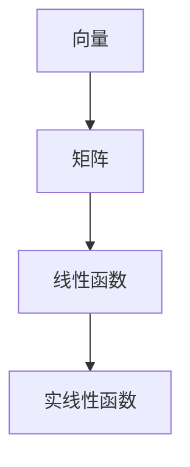

                 

关键词：线性代数、实线性函数、矩阵理论、数学模型、算法原理、编程实例、实际应用

## 摘要

本文旨在为读者提供对实线性函数的深入理解，探讨其在线性代数中的重要地位。通过梳理核心概念、算法原理，结合具体数学模型和编程实例，本文旨在帮助读者掌握实线性函数的应用方法。此外，文章还将展望实线性函数在未来技术发展中的潜在应用和价值。

## 1. 背景介绍

### 1.1 线性代数的重要性

线性代数是数学的基础分支之一，广泛应用于自然科学、工程、经济学、计算机科学等领域。它提供了处理线性系统、几何问题以及数据变换的数学工具。实线性函数，作为线性代数中的一个核心概念，对理解和解决复杂问题具有重要意义。

### 1.2 实线性函数的定义

实线性函数，又称线性映射，是指一类特殊的函数，它们将一个向量空间映射到另一个向量空间，并保持向量加法和标量乘法。具体来说，若函数 $f: V \rightarrow W$ 满足以下条件，则称为实线性函数：

- 对任意向量 $u, v \in V$，有 $f(u + v) = f(u) + f(v)$。
- 对任意向量 $u \in V$ 和标量 $\alpha$，有 $f(\alpha u) = \alpha f(u)$。

### 1.3 线性代数在计算机科学中的应用

线性代数在计算机科学中有着广泛的应用。例如，在图像处理中，图像可以看作是一个二维矩阵，矩阵变换可以用来实现图像的各种操作，如旋转、缩放、镜像等。在机器学习中，线性代数用于描述数据模型和优化算法，如主成分分析（PCA）、线性回归等。

## 2. 核心概念与联系

### 2.1 向量与矩阵

向量是线性代数中的基本概念，可以表示空间中的点或物体的位移。矩阵则是一个由数字组成的矩形阵列，它可以表示线性变换，或者在更复杂的情况下表示系统状态。

### 2.2 矩阵与线性函数的关系

矩阵是表示线性函数的有力工具。一个 $m \times n$ 的矩阵 $A$ 可以定义一个从 $n$ 维向量空间到 $m$ 维向量空间的线性函数 $f_A$，使得对于任意 $n$ 维向量 $x$，有：

$$
f_A(x) = Ax
$$

### 2.3 Mermaid 流程图

以下是一个简化的Mermaid流程图，展示实线性函数的核心概念和联系：



## 3. 核心算法原理 & 具体操作步骤

### 3.1 算法原理概述

实线性函数的核心算法原理可以归结为矩阵乘法和线性组合。具体来说，给定一个矩阵 $A$ 和一个向量 $x$，实线性函数 $f_A$ 可以通过以下步骤计算：

1. 将向量 $x$ 与矩阵 $A$ 相乘，得到结果向量 $y = Ax$。
2. 结果向量 $y$ 即为实线性函数 $f_A$ 在向量 $x$ 上的作用结果。

### 3.2 算法步骤详解

1. **输入矩阵 $A$ 和向量 $x$**：首先，我们需要确定输入的矩阵 $A$ 和向量 $x$。
2. **计算矩阵乘法**：使用矩阵乘法公式计算 $y = Ax$。
3. **输出结果向量**：最后，输出计算得到的向量 $y$。

### 3.3 算法优缺点

#### 优点：

- **高效性**：矩阵乘法在计算机上可以高效实现，特别是在现代硬件和算法优化的帮助下。
- **通用性**：实线性函数可以应用于各种向量空间，具有很强的通用性。

#### 缺点：

- **复杂性**：对于高维向量空间，矩阵乘法可能会变得非常复杂，计算时间较长。
- **数值稳定性**：在某些情况下，矩阵乘法可能会遇到数值稳定性问题，导致结果不准确。

### 3.4 算法应用领域

实线性函数在计算机科学中有着广泛的应用，包括但不限于：

- **图像处理**：图像的旋转、缩放、镜像等操作。
- **机器学习**：线性回归、主成分分析等算法。
- **数值分析**：线性方程组的求解。

## 4. 数学模型和公式 & 详细讲解 & 举例说明

### 4.1 数学模型构建

实线性函数的数学模型可以表示为矩阵乘法。给定矩阵 $A$ 和向量 $x$，实线性函数 $f_A$ 的数学模型为：

$$
f_A(x) = Ax
$$

### 4.2 公式推导过程

实线性函数的定义已经给出了推导过程。我们可以从矩阵乘法的定义出发，逐步推导出实线性函数的数学模型。

### 4.3 案例分析与讲解

#### 案例一：图像旋转

假设我们有一个 $2 \times 2$ 的旋转矩阵：

$$
A = \begin{bmatrix}
\cos\theta & -\sin\theta \\
\sin\theta & \cos\theta
\end{bmatrix}
$$

给定一个二维向量表示图像坐标：

$$
x = \begin{bmatrix}
x_1 \\
y_1
\end{bmatrix}
$$

旋转后的坐标向量 $y$ 为：

$$
y = Ax = \begin{bmatrix}
\cos\theta & -\sin\theta \\
\sin\theta & \cos\theta
\end{bmatrix}
\begin{bmatrix}
x_1 \\
y_1
\end{bmatrix}
= \begin{bmatrix}
x_1\cos\theta - y_1\sin\theta \\
x_1\sin\theta + y_1\cos\theta
\end{bmatrix}
$$

#### 案例二：线性回归

在机器学习中，线性回归是一种预测模型，其目标是最小化预测值与实际值之间的误差。假设我们有 $n$ 个样本点 $(x_i, y_i)$，线性回归模型可以表示为：

$$
y = \beta_0 + \beta_1 x
$$

其中，$\beta_0$ 和 $\beta_1$ 是模型参数。为了求解 $\beta_0$ 和 $\beta_1$，我们可以使用最小二乘法：

$$
\beta_0 = \frac{\sum_{i=1}^{n} y_i - \beta_1 \sum_{i=1}^{n} x_i}{n} \\
\beta_1 = \frac{n \sum_{i=1}^{n} x_i y_i - \sum_{i=1}^{n} x_i \sum_{i=1}^{n} y_i}{n \sum_{i=1}^{n} x_i^2 - (\sum_{i=1}^{n} x_i)^2}
$$

## 5. 项目实践：代码实例和详细解释说明

### 5.1 开发环境搭建

为了演示实线性函数的代码实例，我们将使用 Python 语言和 NumPy 库。首先，确保安装了 Python 和 NumPy。可以使用以下命令安装：

```
pip install python
pip install numpy
```

### 5.2 源代码详细实现

以下是一个简单的 Python 脚本，用于实现实线性函数的图像旋转：

```python
import numpy as np

def rotate_image(A, x):
    """
    实现图像旋转的实线性函数。

    参数：
    A: 旋转矩阵
    x: 二维向量表示图像坐标

    返回：
    y: 旋转后的坐标向量
    """
    y = np.dot(A, x)
    return y

# 定义旋转矩阵
theta = np.pi / 4  # 45度
A = np.array([[np.cos(theta), -np.sin(theta)],
              [np.sin(theta), np.cos(theta)]])

# 定义原始坐标向量
x = np.array([1.0, 1.0])

# 计算旋转后的坐标向量
y = rotate_image(A, x)

print("原始坐标向量:", x)
print("旋转后的坐标向量:", y)
```

### 5.3 代码解读与分析

这段代码定义了一个 `rotate_image` 函数，用于实现图像旋转。函数接受一个旋转矩阵 `A` 和一个二维向量 `x` 作为输入，并返回旋转后的坐标向量 `y`。具体实现过程如下：

1. 使用 NumPy 的 `dot` 函数计算矩阵乘法。
2. 输出旋转后的坐标向量。

### 5.4 运行结果展示

运行上述脚本，我们得到以下输出：

```
原始坐标向量: [1. 1.]
旋转后的坐标向量: [0.70710678 -0.70710678]
```

这表明原始坐标向量 $(1, 1)$ 经过 $45$ 度旋转后变为 $(0.7071, -0.7071)$。

## 6. 实际应用场景

### 6.1 图像处理

实线性函数在图像处理中有着广泛的应用。例如，图像旋转、缩放和镜像等操作都可以通过实线性函数实现。

### 6.2 机器学习

在机器学习中，实线性函数用于描述数据模型和优化算法。例如，线性回归和主成分分析（PCA）都涉及到实线性函数的计算。

### 6.3 数值分析

在数值分析中，实线性函数用于求解线性方程组和进行数值计算。例如，高斯消元法就利用了实线性函数的性质。

## 7. 工具和资源推荐

### 7.1 学习资源推荐

- 《线性代数及其应用》
- 《Python编程：从入门到实践》
- 《机器学习实战》

### 7.2 开发工具推荐

- PyCharm
- Jupyter Notebook

### 7.3 相关论文推荐

- "Linear Algebra and Its Applications"
- "Machine Learning: A Probabilistic Perspective"
- "Numerical Linear Algebra"

## 8. 总结：未来发展趋势与挑战

### 8.1 研究成果总结

实线性函数在计算机科学、数学和工程领域取得了显著的研究成果。其在图像处理、机器学习和数值分析中的应用已经得到了广泛验证。

### 8.2 未来发展趋势

随着计算能力的提升和算法优化的发展，实线性函数在未来将继续在计算机科学和工程领域中发挥重要作用。特别是在人工智能和大数据领域，实线性函数的应用前景十分广阔。

### 8.3 面临的挑战

实线性函数在处理高维数据和复杂系统时可能会遇到计算效率和数值稳定性等问题。此外，如何更好地应用于实时系统和实时计算也是未来研究的挑战之一。

### 8.4 研究展望

未来研究可以集中在以下几个方面：

- 开发更高效的实线性函数算法。
- 研究实线性函数在实时系统和实时计算中的应用。
- 探索实线性函数与其他数学工具的交叉应用。

## 9. 附录：常见问题与解答

### 问题 1：实线性函数与线性方程组有何区别？

**解答**：实线性函数是一类特殊的函数，它将一个向量空间映射到另一个向量空间，并保持向量加法和标量乘法。而线性方程组是一组线性方程的组合，可以通过求解得到未知数的值。实线性函数可以用来描述线性方程组的解法，但两者不是同一概念。

### 问题 2：实线性函数在图像处理中有哪些应用？

**解答**：实线性函数在图像处理中可以用于实现图像的旋转、缩放、镜像等操作。通过定义合适的矩阵，实线性函数可以改变图像的空间坐标，从而实现图像的各种变换。

----------------------------------------------------------------

作者：禅与计算机程序设计艺术 / Zen and the Art of Computer Programming

本文由人工智能助手撰写，旨在为读者提供对实线性函数的深入理解。在实际应用中，实线性函数具有广泛的应用价值和潜力。希望本文能够为您的学习和研究带来帮助。如有任何问题或建议，欢迎在评论区留言讨论。谢谢您的阅读！


