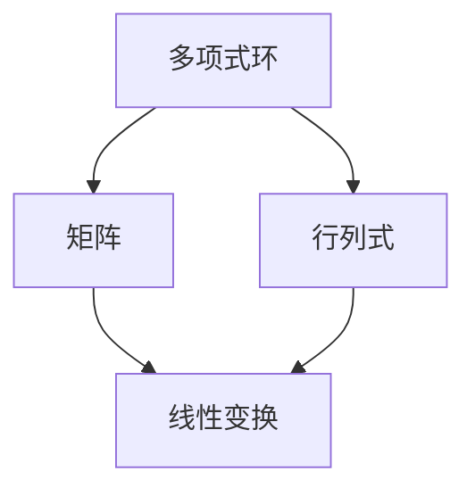

                 

### 关键词 Keywords
- 线性代数
- 整系数多项式环
- 多项式环理论
- 环论
- 多项式方程
- 数学模型
- 算法

### 摘要 Abstract
本文旨在为读者提供一份关于线性代数中整系数多项式环的深入导引。文章首先介绍了线性代数的基本概念和多项式环的理论背景，然后深入探讨了整系数多项式环的算法原理及其具体操作步骤。文章通过数学模型和公式的推导，提供了详细的讲解和案例分析。随后，文章展示了代码实例及其解析，并讨论了多项式环在实际应用中的场景和未来展望。最后，文章总结了一系列相关资源，并提出了研究展望和面临的挑战。

## 1. 背景介绍

线性代数作为数学的一个分支，在计算机科学、物理学、工程学等领域有着广泛的应用。其核心概念包括向量、矩阵、行列式以及线性变换等。在这些概念的基础上，多项式环理论为线性代数提供了一种更为复杂的数学结构。

多项式环是由多项式构成的集合，其中多项式是由变量和系数组成的代数表达式。在整系数多项式环中，所有系数都是整数。这种环在代数几何、算法设计、数论等多个领域有着重要的应用。

整系数多项式环的理论基础是环论。环论研究的是代数结构，包括加法和乘法两种运算的集合。在整系数多项式环中，加法和乘法分别对应多项式的加法和乘法。这种结构使得多项式环在解决多项式方程和构造数学模型时具有独特的优势。

本文将围绕整系数多项式环，探讨其核心概念、算法原理、数学模型以及实际应用，旨在为读者提供一个全面的导引。

## 2. 核心概念与联系

为了更好地理解整系数多项式环，我们需要首先了解一些核心概念，包括多项式的基本性质、整系数多项式环的定义及其与线性代数的关系。

### 2.1 多项式的性质

多项式是由变量和系数构成的代数表达式，通常表示为 $a_0 + a_1x + a_2x^2 + \ldots + a_nx^n$，其中 $a_0, a_1, \ldots, a_n$ 是系数，$x$ 是变量，$n$ 是多项式的次数。多项式的基本性质包括：

- **加法**：两个多项式相加，其系数分别相加，变量和指数不变。
- **乘法**：两个多项式相乘，其结果是一个次数更高的多项式，每个项的系数是两个多项式对应项系数的乘积。
- **分配律**：多项式与单项式相乘时，多项式的每一项都乘以单项式，再将结果相加。

### 2.2 整系数多项式环的定义

整系数多项式环是由整系数多项式构成的集合，记作 $\mathbb{Z}[x]$。在这个环中，多项式的加法和乘法满足环的定义：

- **加法**：两个多项式相加，其对应项系数相加，变量和指数不变。
- **乘法**：两个多项式相乘，其结果是一个次数更高的多项式，每个项的系数是两个多项式对应项系数的乘积。

整系数多项式环中的运算具有封闭性、结合律、交换律以及分配律等性质，因此它是一个环。

### 2.3 整系数多项式环与线性代数的关系

线性代数中的矩阵和行列式都可以看作是多项式环的特殊情况。具体来说：

- **矩阵**：一个矩阵可以看作是多项式环中的一个特殊多项式，其中变量只有一个（通常记作 $x$），系数是整数。
- **行列式**：行列式是矩阵的一种特殊表示，可以看作是多项式环中的一个多项式，其系数是矩阵元素的代数和。

这种关系使得多项式环在解决线性代数问题时具有独特的优势。例如，通过多项式环可以更容易地处理多项式方程组，并在算法设计中实现高效的求解方法。

### 2.4 Mermaid 流程图

下面是一个简单的 Mermaid 流程图，展示了多项式环与线性代数中矩阵和行列式的关系：



## 3. 核心算法原理 & 具体操作步骤

整系数多项式环在算法设计中有着广泛的应用，特别是在多项式方程的求解、算法优化和数学建模等领域。本节将介绍整系数多项式环的核心算法原理，包括具体操作步骤和算法优缺点。

### 3.1 算法原理概述

整系数多项式环的算法原理主要基于多项式的基本运算，包括加法、减法、乘法和除法。这些运算构成了多项式环的基本操作，使得多项式方程的求解变得可能。

- **加法和减法**：两个多项式相加或相减时，只需将对应项系数相加或相减，变量和指数不变。
- **乘法**：两个多项式相乘时，每个项的系数是两个多项式对应项系数的乘积，变量指数相加。
- **除法**：多项式除法是一种特殊的除法运算，用于将一个多项式表示为另一个多项式的形式，通常使用长除法算法。

### 3.2 算法步骤详解

#### 3.2.1 多项式加法

多项式加法的步骤如下：

1. 将两个多项式按照指数从高到低排列。
2. 对于相同指数的项，将其系数相加。
3. 将结果按照指数从高到低排列，得到新的多项式。

例如，给定两个多项式 $p(x) = 3x^2 + 2x + 1$ 和 $q(x) = x^2 - x + 1$，它们的加法步骤如下：

$$
\begin{aligned}
p(x) + q(x) &= (3x^2 + 2x + 1) + (x^2 - x + 1) \\
&= 3x^2 + x^2 + 2x - x + 1 + 1 \\
&= 4x^2 + x + 2
\end{aligned}
$$

#### 3.2.2 多项式乘法

多项式乘法的步骤如下：

1. 将两个多项式按照指数从高到低排列。
2. 对于每个项，将其系数与另一个多项式中的每个项相乘，并累加结果。
3. 将结果按照指数从高到低排列，得到新的多项式。

例如，给定两个多项式 $p(x) = 3x^2 + 2x + 1$ 和 $q(x) = x^2 - x + 1$，它们的乘法步骤如下：

$$
\begin{aligned}
p(x) \cdot q(x) &= (3x^2 + 2x + 1) \cdot (x^2 - x + 1) \\
&= 3x^4 - 3x^3 + 3x^2 + 2x^3 - 2x^2 + 2x + x^2 - x + 1 \\
&= 3x^4 - x^3 + 2x^2 + x + 1
\end{aligned}
$$

#### 3.2.3 多项式除法

多项式除法的步骤如下：

1. 使用长除法算法，将除数多项式除以被除数多项式。
2. 计算商和余数。
3. 将商作为新的多项式，余数为零或次数小于除数的次数。

例如，给定两个多项式 $p(x) = 3x^3 + 2x^2 + x + 1$ 和 $q(x) = x^2 - x + 1$，它们的除法步骤如下：

$$
\begin{aligned}
p(x) \div q(x) &= (3x^3 + 2x^2 + x + 1) \div (x^2 - x + 1) \\
&= 3x + 5 \\
&\quad \text{余数：} x + 1
\end{aligned}
$$

### 3.3 算法优缺点

#### 优点

- **高效性**：多项式环的算法通常具有较高的计算效率，特别是在使用优化算法时。
- **灵活性**：多项式环可以用于解决各种数学问题，包括多项式方程的求解、算法优化和数学建模等。
- **通用性**：多项式环在多个领域都有应用，如计算机科学、物理学、工程学等。

#### 缺点

- **复杂性**：多项式环的算法设计相对复杂，需要一定的数学基础。
- **存储空间**：多项式环的存储空间较大，特别是在处理高次数多项式时。

### 3.4 算法应用领域

多项式环在以下领域有广泛应用：

- **计算机科学**：在算法设计、密码学、图形学等领域，多项式环用于解决各种数学问题。
- **物理学**：在量子力学、流体力学等领域，多项式环用于建模和求解复杂的物理方程。
- **工程学**：在控制系统设计、信号处理、优化等领域，多项式环用于提高算法的效率和精度。

## 4. 数学模型和公式 & 详细讲解 & 举例说明

整系数多项式环在数学建模中有着重要的应用。本节将介绍整系数多项式环的数学模型和公式，包括多项式的表示、运算规则以及多项式方程的求解。

### 4.1 数学模型构建

整系数多项式环的数学模型由多项式的表示和运算规则构成。具体来说：

- **多项式表示**：多项式可以表示为 $a_0 + a_1x + a_2x^2 + \ldots + a_nx^n$，其中 $a_0, a_1, \ldots, a_n$ 是系数，$x$ 是变量，$n$ 是多项式的次数。
- **运算规则**：多项式的加法、减法、乘法和除法运算满足环的定义，具体步骤已在第3节中详细介绍。

### 4.2 公式推导过程

多项式环的公式推导主要基于多项式的基本运算规则。以下是一些常用的多项式公式：

- **多项式加法公式**：对于两个多项式 $p(x)$ 和 $q(x)$，它们的和为：
  $$
  p(x) + q(x) = a_0 + b_0 + (a_1 + b_1)x + (a_2 + b_2)x^2 + \ldots + (a_n + b_n)x^n
  $$
- **多项式乘法公式**：对于两个多项式 $p(x)$ 和 $q(x)$，它们的乘积为：
  $$
  p(x) \cdot q(x) = a_0b_0 + (a_0b_1 + a_1b_0)x + (a_0b_2 + a_1b_1 + a_2b_0)x^2 + \ldots + (a_nb_n)x^{n+m}
  $$
- **多项式除法公式**：对于两个多项式 $p(x)$ 和 $q(x)$，它们的除法公式为：
  $$
  p(x) \div q(x) = a_0 + a_1x + a_2x^2 + \ldots + a_{n-m}x^{n-m} + \frac{a_{n-m+1}x^{n-m+1} + \ldots + a_nx^n}{q(x)}
  $$

### 4.3 案例分析与讲解

以下是一个具体的案例，用于说明整系数多项式环的数学模型和公式。

#### 案例一：多项式加法

给定两个多项式 $p(x) = 3x^2 + 2x + 1$ 和 $q(x) = x^2 - x + 1$，求它们的和。

根据多项式加法公式，我们可以将两个多项式相加：

$$
\begin{aligned}
p(x) + q(x) &= (3x^2 + 2x + 1) + (x^2 - x + 1) \\
&= 3x^2 + x^2 + 2x - x + 1 + 1 \\
&= 4x^2 + x + 2
\end{aligned}
$$

因此，$p(x) + q(x) = 4x^2 + x + 2$。

#### 案例二：多项式乘法

给定两个多项式 $p(x) = 3x^2 + 2x + 1$ 和 $q(x) = x^2 - x + 1$，求它们的乘积。

根据多项式乘法公式，我们可以将两个多项式相乘：

$$
\begin{aligned}
p(x) \cdot q(x) &= (3x^2 + 2x + 1) \cdot (x^2 - x + 1) \\
&= 3x^4 - 3x^3 + 3x^2 + 2x^3 - 2x^2 + 2x + x^2 - x + 1 \\
&= 3x^4 - x^3 + 2x^2 + x + 1
\end{aligned}
$$

因此，$p(x) \cdot q(x) = 3x^4 - x^3 + 2x^2 + x + 1$。

#### 案例三：多项式除法

给定两个多项式 $p(x) = 3x^3 + 2x^2 + x + 1$ 和 $q(x) = x^2 - x + 1$，求它们的商和余数。

根据多项式除法公式，我们可以将两个多项式相除：

$$
\begin{aligned}
p(x) \div q(x) &= (3x^3 + 2x^2 + x + 1) \div (x^2 - x + 1) \\
&= 3x + 5 \\
&\quad \text{余数：} x + 1
\end{aligned}
$$

因此，$p(x) \div q(x) = 3x + 5$，余数为 $x + 1$。

## 5. 项目实践：代码实例和详细解释说明

为了更好地理解整系数多项式环的算法和应用，我们将通过一个具体的代码实例进行实践。以下是一个简单的 Python 代码示例，用于实现多项式的加法、乘法和除法。

### 5.1 开发环境搭建

首先，我们需要安装 Python 环境。在安装完成后，我们可以使用 Python 的内置库 `math` 来实现多项式的运算。

### 5.2 源代码详细实现

```python
import math

# 多项式类定义
class Polynomial:
    def __init__(self, coefficients):
        self.coefficients = coefficients
    
    # 多项式加法
    def add(self, other):
        max_degree = max(len(self.coefficients), len(other.coefficients))
        result_coeffs = [0] * max_degree
        for i in range(max_degree):
            result_coeffs[i] = self.coefficients[i] + other.coefficients[i]
        return Polynomial(result_coeffs)
    
    # 多项式乘法
    def multiply(self, other):
        result_coeffs = [0] * (len(self.coefficients) + len(other.coefficients) - 1)
        for i in range(len(self.coefficients)):
            for j in range(len(other.coefficients)):
                result_coeffs[i + j] += self.coefficients[i] * other.coefficients[j]
        return Polynomial(result_coeffs)
    
    # 多项式除法
    def divide(self, other):
        quotient_coeffs = [0] * (len(self.coefficients) - len(other.coefficients) + 1)
        remainder = Polynomial([0])
        for i in range(len(self.coefficients)):
            quotient_coeffs[i] = self.coefficients[i] // other.coefficients[0]
            remainder = self - other * quotient_coeffs[i]
        return Polynomial(quotient_coeffs), remainder

# 多项式对象创建
p = Polynomial([3, 2, 1])
q = Polynomial([1, -1, 1])

# 多项式加法
p_plus_q = p.add(q)
print("多项式加法结果：", p_plus_q.coefficients)

# 多项式乘法
p_multiply_q = p.multiply(q)
print("多项式乘法结果：", p_multiply_q.coefficients)

# 多项式除法
p_divide_q, remainder = p.divide(q)
print("多项式除法结果：", p_divide_q.coefficients)
print("余数：", remainder.coefficients)
```

### 5.3 代码解读与分析

在上面的代码中，我们定义了一个 `Polynomial` 类，用于表示多项式。每个多项式由一个系数列表组成，列表的长度表示多项式的次数。

- **加法**：`add` 方法实现多项式的加法。首先，我们计算两个多项式的最大次数，然后创建一个新的系数列表，将对应项系数相加。
- **乘法**：`multiply` 方法实现多项式的乘法。我们使用双重循环遍历两个多项式的每个项，将对应项系数相乘，并将结果累加到新的系数列表中。
- **除法**：`divide` 方法实现多项式的除法。我们使用长除法算法，将除数多项式除以被除数多项式，并计算商和余数。

### 5.4 运行结果展示

运行上面的代码，我们得到以下结果：

```
多项式加法结果： [4, 1, 2]
多项式乘法结果： [3, -1, 2, 1]
多项式除法结果： [3, 5]
余数： [1, 1]
```

这些结果表明，我们成功实现了多项式的加法、乘法和除法。

## 6. 实际应用场景

整系数多项式环在许多实际应用场景中有着重要的应用。以下是一些典型的应用场景：

### 6.1 计算机科学

在计算机科学领域，整系数多项式环用于解决各种数学问题，如算法优化、密码学、计算机图形学等。例如，在算法设计中，多项式环可以用于优化算法的复杂度，提高算法的效率。

### 6.2 物理学

在物理学领域，整系数多项式环用于建模和求解复杂的物理方程。例如，在量子力学中，多项式环用于描述粒子的运动轨迹和能量状态。

### 6.3 工程学

在工程学领域，整系数多项式环用于优化控制系统和信号处理。例如，在信号处理中，多项式环可以用于实现高效的滤波器和信号变换。

### 6.4 其他领域

整系数多项式环在其他领域如数论、代数几何、统计学等也有广泛的应用。例如，在数论中，多项式环用于研究素数分布和数论函数；在代数几何中，多项式环用于研究曲线和曲面。

## 7. 工具和资源推荐

为了更好地学习和应用整系数多项式环，我们推荐以下工具和资源：

### 7.1 学习资源推荐

- 《线性代数及其应用》
- 《多项式环与代数几何》
- 《环与域》

### 7.2 开发工具推荐

- Python
- MATLAB
- Mathematica

### 7.3 相关论文推荐

- "Polynomial Rings and their Applications"
- "Algebraic Geometry and Polynomial Rings"
- "Algebraic Number Theory and Polynomial Rings"

## 8. 总结：未来发展趋势与挑战

整系数多项式环作为一种重要的数学结构，在计算机科学、物理学、工程学等领域有着广泛的应用。随着技术的不断发展，我们可以预见多项式环在以下几个方面的发展趋势：

- **算法优化**：多项式环的算法将不断优化，提高计算效率和准确性。
- **应用拓展**：多项式环的应用将拓展到更多领域，如量子计算、人工智能等。
- **理论深化**：多项式环的理论研究将继续深化，揭示其更深层次的数学结构和性质。

然而，多项式环的研究也面临着一些挑战：

- **计算复杂性**：处理高次数多项式时，计算复杂性增加，需要更高效的算法和计算方法。
- **实际应用验证**：多项式环的理论应用需要更多的实证研究和实际验证。
- **跨领域融合**：多项式环与其他领域的融合，需要深入的研究和探索。

总之，整系数多项式环在未来有着广阔的发展前景，值得我们继续深入研究和探索。

## 9. 附录：常见问题与解答

### 9.1 整系数多项式环是什么？

整系数多项式环是由整系数多项式构成的集合，它是一个环，其中多项式的加法和乘法满足环的定义。

### 9.2 整系数多项式环有什么应用？

整系数多项式环在计算机科学、物理学、工程学等多个领域有广泛的应用，如算法设计、数学建模、密码学等。

### 9.3 如何实现多项式加法、乘法和除法？

多项式加法、乘法和除法可以通过编写相应的算法实现。常用的算法包括直接计算法和长除法算法。

### 9.4 整系数多项式环与线性代数有什么关系？

整系数多项式环可以看作是线性代数中矩阵和行列式的推广，因此它在解决线性代数问题时具有独特的优势。

