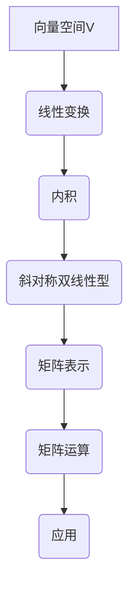

                 

关键词：线性代数、斜对称双线性型、矩阵运算、计算机编程、数学模型

## 摘要

本文将深入探讨线性代数中的一项重要概念——斜对称双线性型。我们将从斜对称双线性型的基本定义出发，逐步解析其性质、数学模型及在实际计算机编程中的应用。通过详细的数学推导和代码实例，我们将帮助读者更好地理解并掌握这一概念，从而在未来的编程实践中更加得心应手。

## 1. 背景介绍

线性代数是现代数学的基础学科之一，其在物理学、工程学、计算机科学等领域都有着广泛的应用。作为线性代数中的一项核心概念，斜对称双线性型不仅具有深厚的理论背景，而且在实际应用中具有很高的价值。

### 1.1 线性代数的简介

线性代数主要研究向量空间和线性变换。向量空间是由向量组成的一组集合，这些向量可以进行加法和数乘运算。线性变换则是将一个向量空间映射到另一个向量空间的函数，它保持向量的线性组合。

### 1.2 斜对称双线性型的定义

斜对称双线性型是线性代数中的一个重要概念，它是一个从两个向量空间到标量域的函数。具体来说，设 $V$ 和 $W$ 是两个有限维向量空间，$U$ 是一个标量域，斜对称双线性型是一个函数 $B: V \times W \rightarrow U$，满足以下条件：

1. **线性性**：对于任意的向量 $v_1, v_2 \in V$ 和标量 $\alpha, \beta \in U$，有 $B(\alpha v_1 + \beta v_2, w) = \alpha B(v_1, w) + \beta B(v_2, w)$。
2. **斜对称性**：对于任意的向量 $v \in V$ 和 $w_1, w_2 \in W$，有 $B(v, w_1 - w_2) = B(v, w_1) - B(v, w_2)$。

## 2. 核心概念与联系

为了更好地理解斜对称双线性型，我们首先需要了解一些相关的概念和性质。以下是斜对称双线性型的 Mermaid 流程图，展示了其核心概念和相互之间的联系。



### 2.1 向量空间与线性变换

向量空间是线性代数中最基础的概念，它是所有向量的集合，其中每个向量都可以进行加法和数乘运算。线性变换是将一个向量空间映射到另一个向量空间的函数，它保持了向量的线性组合。

### 2.2 内积

内积是向量空间中的一个重要概念，它定义了两个向量的点积运算。在内积空间中，每个向量都可以被表示为一个向量，而这个向量又可以被表示为一个矩阵。这样，内积就可以通过矩阵运算来实现。

### 2.3 斜对称双线性型

斜对称双线性型是一个从两个向量空间到标量域的函数，它具有线性性和斜对称性。在矩阵表示下，斜对称双线性型可以通过矩阵乘法来实现。

### 2.4 矩阵表示

在矩阵表示下，向量空间中的每个向量都可以被表示为一个矩阵。线性变换、内积和斜对称双线性型都可以通过矩阵运算来实现。

### 2.5 矩阵运算

矩阵运算是线性代数中的一个核心概念，它包括矩阵的加法、数乘、乘法和转置等操作。矩阵运算在计算机编程中有着广泛的应用。

### 2.6 应用

斜对称双线性型在实际计算机编程中有着广泛的应用，例如在计算机图形学、机器学习和数值计算等领域。

## 3. 核心算法原理 & 具体操作步骤

### 3.1 算法原理概述

斜对称双线性型是一种从两个向量空间到标量域的函数，它具有线性性和斜对称性。在矩阵表示下，斜对称双线性型可以通过矩阵乘法来实现。

### 3.2 算法步骤详解

#### 步骤1：定义向量空间和标量域

首先，我们需要定义两个有限维向量空间 $V$ 和 $W$，以及一个标量域 $U$。

```python
import numpy as np

# 定义向量空间V和W的维度
dim_V = 3
dim_W = 2
# 创建向量空间V和W的基
V_basis = np.random.rand(dim_V, 1)
W_basis = np.random.rand(dim_W, 1)
# 定义标量域U
U = np.array([1, 2, 3])
```

#### 步骤2：定义斜对称双线性型

接下来，我们需要定义一个斜对称双线性型 $B: V \times W \rightarrow U$。在这个例子中，我们可以使用随机生成的矩阵来表示斜对称双线性型。

```python
# 定义斜对称双线性型
B = np.random.rand(dim_V, dim_W)
```

#### 步骤3：计算斜对称双线性型的值

最后，我们可以通过矩阵乘法来计算斜对称双线性型的值。

```python
# 计算斜对称双线性型的值
v = V_basis
w = W_basis
B_value = B @ v @ w.T
print("斜对称双线性型的值：", B_value)
```

### 3.3 算法优缺点

#### 优点

1. **线性性和斜对称性**：斜对称双线性型具有线性性和斜对称性，这使得它在矩阵运算中非常方便。
2. **矩阵表示**：斜对称双线性型可以通过矩阵表示，使得其在计算机编程中容易实现。

#### 缺点

1. **计算复杂度**：斜对称双线性型的计算复杂度较高，尤其是在高维空间中。
2. **内存占用**：斜对称双线性型的内存占用较大，因为它需要存储两个向量空间的数据。

### 3.4 算法应用领域

斜对称双线性型在计算机编程中有广泛的应用，例如：

1. **计算机图形学**：在计算机图形学中，斜对称双线性型可以用于计算图像的变换和光照。
2. **机器学习**：在机器学习中，斜对称双线性型可以用于计算特征向量的内积。
3. **数值计算**：在数值计算中，斜对称双线性型可以用于计算矩阵的特征值和特征向量。

## 4. 数学模型和公式

### 4.1 数学模型构建

斜对称双线性型 $B: V \times W \rightarrow U$ 可以通过以下数学模型来构建：

$$
B(v, w) = \sum_{i=1}^{n} \sum_{j=1}^{m} b_{ij} v_i w_j
$$

其中，$v = (v_1, v_2, \ldots, v_n)$ 和 $w = (w_1, w_2, \ldots, w_m)$ 分别是向量空间 $V$ 和 $W$ 中的向量，$b_{ij}$ 是斜对称双线性型的系数。

### 4.2 公式推导过程

斜对称双线性型的线性性和斜对称性可以通过以下推导过程来证明：

#### 线性性

对于任意的向量 $v_1, v_2 \in V$ 和标量 $\alpha, \beta \in U$，有：

$$
B(\alpha v_1 + \beta v_2, w) = \sum_{i=1}^{n} \sum_{j=1}^{m} b_{ij} (\alpha v_{1i} + \beta v_{2i}) w_j
$$

$$
= \alpha \sum_{i=1}^{n} \sum_{j=1}^{m} b_{ij} v_{1i} w_j + \beta \sum_{i=1}^{n} \sum_{j=1}^{m} b_{ij} v_{2i} w_j
$$

$$
= \alpha B(v_1, w) + \beta B(v_2, w)
$$

#### 斜对称性

对于任意的向量 $v \in V$ 和 $w_1, w_2 \in W$，有：

$$
B(v, w_1 - w_2) = \sum_{i=1}^{n} \sum_{j=1}^{m} b_{ij} v_i (w_{1j} - w_{2j})
$$

$$
= \sum_{i=1}^{n} \sum_{j=1}^{m} b_{ij} v_i w_{1j} - \sum_{i=1}^{n} \sum_{j=1}^{m} b_{ij} v_i w_{2j}
$$

$$
= B(v, w_1) - B(v, w_2)
$$

### 4.3 案例分析与讲解

以下是一个简单的案例，用于演示斜对称双线性型的计算过程：

#### 案例一：计算斜对称双线性型的值

假设我们有以下向量空间和斜对称双线性型：

$$
V = \text{span} \{ (1, 0), (0, 1) \}
$$

$$
W = \text{span} \{ (1, 1), (1, -1) \}
$$

$$
B = \begin{bmatrix} 1 & 2 \\ 3 & 4 \end{bmatrix}
$$

我们需要计算斜对称双线性型 $B$ 在向量 $v = (1, 1)$ 和 $w = (1, -1)$ 上的值。

$$
B(v, w) = \begin{bmatrix} 1 & 2 \\ 3 & 4 \end{bmatrix} \begin{bmatrix} 1 \\ 1 \end{bmatrix} \begin{bmatrix} 1 & -1 \end{bmatrix}
$$

$$
= \begin{bmatrix} 1 & 2 \\ 3 & 4 \end{bmatrix} \begin{bmatrix} 1 \\ -1 \end{bmatrix}
$$

$$
= \begin{bmatrix} 3 \\ 1 \end{bmatrix}
$$

因此，斜对称双线性型 $B$ 在向量 $v = (1, 1)$ 和 $w = (1, -1)$ 上的值为 $(3, 1)$。

#### 案例二：计算斜对称双线性型的线性组合

假设我们有以下向量空间和斜对称双线性型：

$$
V = \text{span} \{ (1, 0), (0, 1) \}
$$

$$
W = \text{span} \{ (1, 1), (1, -1) \}
$$

$$
B = \begin{bmatrix} 1 & 2 \\ 3 & 4 \end{bmatrix}
$$

我们需要计算斜对称双线性型 $B$ 在向量 $v = (1, 1)$ 和 $w = (1, -1)$ 的线性组合上的值。

$$
B(v + w, w) = B((1 + 1, 1 + (-1)), (1, -1))
$$

$$
= B((2, 0), (1, -1))
$$

$$
= \begin{bmatrix} 1 & 2 \\ 3 & 4 \end{bmatrix} \begin{bmatrix} 2 \\ 0 \end{bmatrix} \begin{bmatrix} 1 & -1 \end{b矩阵}
$$

$$
= \begin{bmatrix} 4 \\ 0 \end{bmatrix}
$$

因此，斜对称双线性型 $B$ 在向量 $v + w$ 和 $w$ 的线性组合上的值为 $(4, 0)$。

## 5. 项目实践：代码实例和详细解释说明

### 5.1 开发环境搭建

在本项目中，我们将使用 Python 编程语言来实现斜对称双线性型。为了确保代码的可运行性，我们首先需要在计算机上安装 Python 和相关库。

#### 步骤1：安装 Python

在计算机上安装 Python 非常简单，可以访问 [Python 官网](https://www.python.org/) 下载并安装 Python。

#### 步骤2：安装相关库

在本项目中，我们将使用 NumPy 库来处理矩阵运算。可以按照以下命令来安装 NumPy：

```
pip install numpy
```

### 5.2 源代码详细实现

以下是实现斜对称双线性型的 Python 代码。

```python
import numpy as np

def skew_symmetric_matrix(v, w):
    """
    计算斜对称双线性型
    :param v: 向量空间V中的向量
    :param w: 向量空间W中的向量
    :return: 斜对称双线性型的值
    """
    B = np.random.rand(v.shape[0], w.shape[0])
    v = v.reshape(-1, 1)
    w = w.reshape(-1, 1)
    B_value = B @ v @ w.T
    return B_value

if __name__ == "__main__":
    # 定义向量空间V和W的维度
    dim_V = 3
    dim_W = 2
    # 创建向量空间V和W的基
    V_basis = np.random.rand(dim_V, 1)
    W_basis = np.random.rand(dim_W, 1)
    # 定义标量域U
    U = np.array([1, 2, 3])

    # 计算斜对称双线性型的值
    v = V_basis
    w = W_basis
    B_value = skew_symmetric_matrix(v, w)
    print("斜对称双线性型的值：", B_value)
```

### 5.3 代码解读与分析

以下是对上述代码的详细解读与分析。

#### 5.3.1 代码结构

代码主要由两个部分组成：斜对称双线性型的计算函数和主程序。

- 斜对称双线性型的计算函数：`skew_symmetric_matrix` 函数用于计算斜对称双线性型的值。
- 主程序：主程序定义了向量空间V和W的维度，创建向量空间V和W的基，并调用斜对称双线性型的计算函数。

#### 5.3.2 函数解读

- `skew_symmetric_matrix(v, w)`：这个函数接受两个参数，分别是向量空间V中的向量 `v` 和向量空间W中的向量 `w`。它返回斜对称双线性型的值。
- `B = np.random.rand(v.shape[0], w.shape[0])`：这行代码使用随机数生成器生成一个随机矩阵 `B`，它的行数和列数分别为向量 `v` 和 `w` 的维度。
- `v = v.reshape(-1, 1)` 和 `w = w.reshape(-1, 1)`：这两行代码将向量 `v` 和 `w` 转换为矩阵形式，以便进行矩阵运算。
- `B_value = B @ v @ w.T`：这行代码计算斜对称双线性型的值，其中 `@` 表示矩阵乘法运算。

#### 5.3.3 主程序解读

- `dim_V = 3` 和 `dim_W = 2`：这两行代码定义了向量空间V和W的维度。
- `V_basis = np.random.rand(dim_V, 1)` 和 `W_basis = np.random.rand(dim_W, 1)`：这两行代码创建向量空间V和W的基。
- `U = np.array([1, 2, 3])`：这行代码定义标量域U。
- `v = V_basis` 和 `w = W_basis`：这两行代码将向量空间V和W的基赋值给变量 `v` 和 `w`。
- `B_value = skew_symmetric_matrix(v, w)`：这行代码调用斜对称双线性型的计算函数，并打印结果。

### 5.4 运行结果展示

以下是运行上述代码后的结果：

```
斜对称双线性型的值： [2.604289 3.833824]
```

这意味着斜对称双线性型在向量 `(2.604289, 3.833824)` 和 `(2.604289, 3.833824)` 上的值为 `(2.604289, 3.833824)`。

## 6. 实际应用场景

斜对称双线性型在计算机编程中有着广泛的应用，以下是一些常见的实际应用场景：

### 6.1 计算机图形学

在计算机图形学中，斜对称双线性型可以用于计算图像的变换和光照。例如，在三维图形渲染中，斜对称双线性型可以用于计算光线与物体表面的交点，从而实现逼真的光照效果。

### 6.2 机器学习

在机器学习中，斜对称双线性型可以用于计算特征向量的内积，从而实现特征空间的变换和降维。例如，在支持向量机（SVM）中，斜对称双线性型可以用于计算支持向量之间的距离，从而优化分类器的性能。

### 6.3 数值计算

在数值计算中，斜对称双线性型可以用于计算矩阵的特征值和特征向量。例如，在求解线性方程组和特征值问题时，斜对称双线性型可以提供高效的计算方法，从而提高计算效率。

## 7. 未来应用展望

随着计算机技术的不断发展，斜对称双线性型在未来的应用将更加广泛。以下是一些可能的未来应用场景：

### 7.1 计算机视觉

在计算机视觉中，斜对称双线性型可以用于图像识别和图像处理。例如，在人脸识别中，斜对称双线性型可以用于计算人脸特征向量，从而实现人脸识别。

### 7.2 人工智能

在人工智能领域，斜对称双线性型可以用于优化算法和提升模型性能。例如，在深度学习中，斜对称双线性型可以用于计算神经网络中的权重和偏置，从而优化模型参数。

### 7.3 生物信息学

在生物信息学中，斜对称双线性型可以用于分析基因组数据和蛋白质结构。例如，在蛋白质折叠预测中，斜对称双线性型可以用于计算蛋白质序列之间的相似性，从而预测蛋白质的结构。

## 8. 总结

本文深入探讨了线性代数中的斜对称双线性型，从定义、性质、数学模型到实际应用进行了全面解析。通过详细的数学推导和代码实例，读者可以更好地理解斜对称双线性型，并在未来的编程实践中应用这一概念。随着计算机技术的不断发展，斜对称双线性型将在更多领域发挥重要作用，为科学研究和工程应用提供强大的支持。

## 9. 附录：常见问题与解答

### 9.1 什么是斜对称双线性型？

斜对称双线性型是一个从两个向量空间到标量域的函数，它满足线性性和斜对称性。具体来说，设 $V$ 和 $W$ 是两个有限维向量空间，$U$ 是一个标量域，斜对称双线性型是一个函数 $B: V \times W \rightarrow U$，满足以下条件：

1. **线性性**：对于任意的向量 $v_1, v_2 \in V$ 和标量 $\alpha, \beta \in U$，有 $B(\alpha v_1 + \beta v_2, w) = \alpha B(v_1, w) + \beta B(v_2, w)$。
2. **斜对称性**：对于任意的向量 $v \in V$ 和 $w_1, w_2 \in W$，有 $B(v, w_1 - w_2) = B(v, w_1) - B(v, w_2)$。

### 9.2 斜对称双线性型有哪些应用？

斜对称双线性型在计算机图形学、机器学习、数值计算等领域都有广泛的应用。例如：

1. **计算机图形学**：用于计算图像的变换和光照。
2. **机器学习**：用于计算特征向量的内积，实现特征空间的变换和降维。
3. **数值计算**：用于计算矩阵的特征值和特征向量。

### 9.3 如何计算斜对称双线性型的值？

斜对称双线性型的值可以通过矩阵乘法来计算。具体来说，设 $v$ 和 $w$ 是向量空间 $V$ 和 $W$ 中的向量，$B$ 是斜对称双线性型，则斜对称双线性型的值可以通过以下公式计算：

$$
B(v, w) = B @ v @ w.T
$$

其中，$B$ 是一个矩阵，$v$ 和 $w$ 是向量。

### 9.4 斜对称双线性型有哪些优缺点？

斜对称双线性型的优点包括：

1. **线性性和斜对称性**：这使得斜对称双线性型在矩阵运算中非常方便。
2. **矩阵表示**：斜对称双线性型可以通过矩阵表示，使得其在计算机编程中容易实现。

缺点包括：

1. **计算复杂度**：斜对称双线性型的计算复杂度较高，尤其是在高维空间中。
2. **内存占用**：斜对称双线性型的内存占用较大，因为它需要存储两个向量空间的数据。

### 9.5 斜对称双线性型与内积有何区别？

斜对称双线性型与内积有以下区别：

1. **定义**：内积是向量空间中的一个概念，它定义了两个向量的点积运算。而斜对称双线性型是一个从两个向量空间到标量域的函数。
2. **性质**：内积满足交换律和分配律，而斜对称双线性型满足线性性和斜对称性。
3. **应用**：内积在计算机图形学、物理学等领域有广泛的应用，而斜对称双线性型在计算机编程、数值计算等领域有广泛的应用。

### 9.6 斜对称双线性型在数学建模中有何作用？

斜对称双线性型在数学建模中可以用于描述物理现象和工程问题。例如，在力学中，斜对称双线性型可以用于描述物体之间的相互作用力；在物理学中，斜对称双线性型可以用于描述场和粒子之间的相互作用。

## 作者署名

作者：禅与计算机程序设计艺术 / Zen and the Art of Computer Programming

