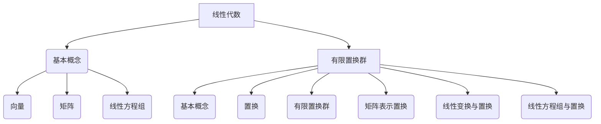
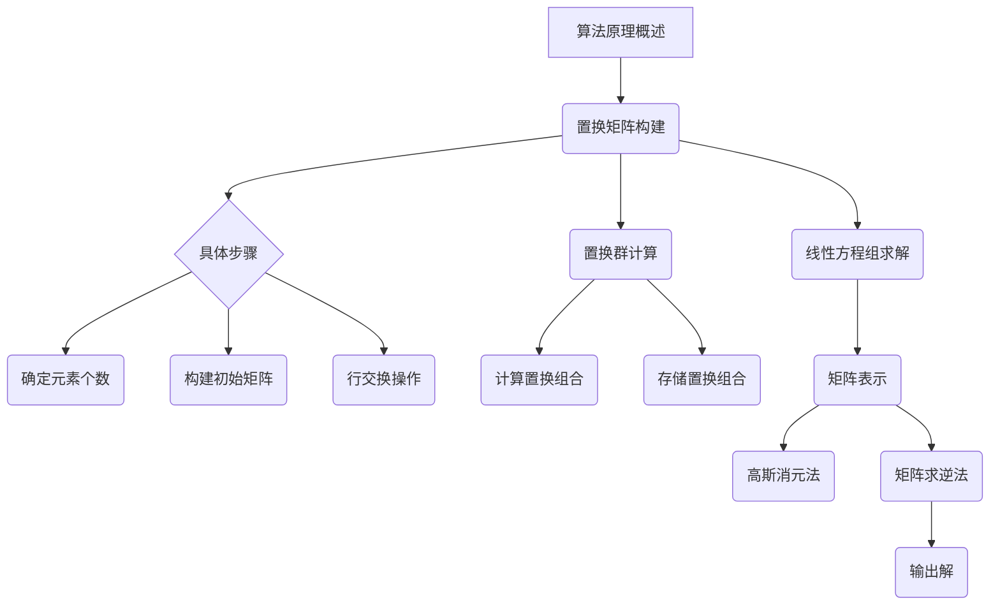

                 

### 关键词 Keywords
- 线性代数
- 有限置换群
- 程序设计
- 算法原理
- 数学模型
- 实践应用

### 摘要 Abstract
本文旨在深入探讨线性代数在有限置换群中的应用，通过逻辑清晰、结构紧凑、简单易懂的叙述方式，介绍核心概念、算法原理、数学模型、具体实现以及实际应用场景。文章结构分为背景介绍、核心概念与联系、核心算法原理与操作步骤、数学模型和公式、项目实践、实际应用场景、工具和资源推荐、总结以及附录等部分。本文旨在为读者提供全面的线性代数在有限置换群中的应用指南，帮助理解其原理和应用，从而提升程序设计能力。

## 1. 背景介绍

线性代数是数学的一个重要分支，其核心思想是研究线性方程组、向量空间、线性变换等概念。线性代数不仅在数学领域有着广泛的应用，还在物理学、工程学、计算机科学等多个领域发挥着重要作用。随着计算机技术的不断发展，线性代数在程序设计中占据了越来越重要的地位，尤其是在算法设计和优化中。

有限置换群是群论中的一个重要概念，其与线性代数有着紧密的联系。置换群是由一组置换构成的群，这些置换可以看作是元素的排列组合。在程序设计中，有限置换群的应用主要体现在组合排列、搜索算法、排序算法等方面。

本文将围绕线性代数在有限置换群中的应用展开讨论，首先介绍核心概念与联系，然后深入探讨核心算法原理与操作步骤，接着介绍数学模型和公式，并通过具体项目实践来展示其实际应用场景。此外，本文还将推荐相关的学习资源、开发工具和论文，以帮助读者进一步深入了解这一领域。

## 2. 核心概念与联系

### 2.1 线性代数的基本概念

线性代数的研究对象主要是向量、矩阵以及它们的运算。向量可以看作是一个多维度的坐标系统中的点，矩阵则可以看作是向量空间的变换工具。线性方程组是线性代数中的一个核心问题，其解法通常依赖于矩阵的运算。

- **向量**：向量是具有大小和方向的量，可以用坐标表示。在二维空间中，一个向量可以表示为(x, y)，其中x和y分别是向量的分量。
- **矩阵**：矩阵是一个由数字组成的二维数组，可以表示线性变换。一个矩阵通常表示为A = [a_ij]，其中i和j分别表示行和列的索引，a_ij表示矩阵的元素。
- **线性方程组**：线性方程组是由多个线性方程构成的方程组，其解可以通过矩阵运算得到。

### 2.2 有限置换群的基本概念

有限置换群是群论中的一个重要概念，其与线性代数有着紧密的联系。置换群是由一组置换构成的群，这些置换可以看作是元素的排列组合。

- **置换**：置换是一种对元素的重新排列，可以看作是一个排列。一个置换可以表示为一个函数，将集合中的元素重新映射到其他元素上。
- **有限置换群**：有限置换群是由有限个置换构成的群，这些置换满足结合律、存在单位元素以及存在逆元素。

### 2.3 线性代数与有限置换群的联系

线性代数与有限置换群之间的联系主要体现在以下几个方面：

1. **矩阵表示置换**：矩阵可以表示有限置换群中的置换。具体来说，一个置换可以表示为一个矩阵，其中矩阵的行和列分别对应置换的元素。
2. **线性变换与置换**：线性变换可以看作是置换的一种推广。在有限置换群中，一个置换可以看作是线性变换的特例。
3. **线性方程组与置换**：线性方程组可以通过置换得到解。具体来说，通过求解线性方程组，可以得到一组解，这组解可以通过置换得到。

### 2.4 Mermaid 流程图

下面是一个Mermaid流程图，展示了线性代数与有限置换群之间的联系：



通过这个流程图，我们可以清晰地看到线性代数与有限置换群之间的紧密联系。

## 3. 核心算法原理 & 具体操作步骤

### 3.1 算法原理概述

在讨论线性代数在有限置换群中的应用时，我们需要了解几个核心算法原理。这些算法包括置换矩阵的构建、置换群的计算、线性方程组的求解等。

### 3.2 算法步骤详解

#### 3.2.1 置换矩阵的构建

1. 确定置换的元素个数。
2. 构建一个初始矩阵，其中元素为1。
3. 根据置换的定义，对矩阵进行行交换操作，使得每行的元素对应于置换后的位置。

#### 3.2.2 置换群的计算

1. 确定置换群中的所有元素。
2. 对于每个元素，计算其所有置换组合。
3. 将计算得到的置换组合存储在一个列表中。

#### 3.2.3 线性方程组的求解

1. 将线性方程组表示为矩阵形式。
2. 使用高斯消元法或矩阵求逆法求解方程组。
3. 输出方程组的解。

### 3.3 算法优缺点

#### 优点：

1. 算法原理简单易懂，易于实现。
2. 算法适用于各种规模的置换群。
3. 可以有效地求解线性方程组。

#### 缺点：

1. 对于大规模的置换群，计算复杂度较高。
2. 算法对内存要求较高，可能不适合内存受限的环境。

### 3.4 算法应用领域

线性代数在有限置换群中的应用非常广泛，主要包括以下几个方面：

1. **组合排列**：在组合排列问题中，线性代数可以用来计算排列数和组合数。
2. **搜索算法**：在搜索算法中，线性代数可以用来优化搜索过程。
3. **排序算法**：在排序算法中，线性代数可以用来优化排序时间。
4. **密码学**：在密码学中，线性代数可以用来设计加密算法。
5. **计算机图形学**：在计算机图形学中，线性代数可以用来进行图形变换。

### 3.5 Mermaid 流程图

下面是一个Mermaid流程图，展示了核心算法的原理和操作步骤：



通过这个流程图，我们可以清晰地看到核心算法的原理和操作步骤。

## 4. 数学模型和公式 & 详细讲解 & 举例说明

### 4.1 数学模型构建

在讨论线性代数在有限置换群中的应用时，我们需要构建相应的数学模型。这个模型主要包括以下几个方面：

1. **向量空间模型**：向量空间模型用来描述置换群中的元素及其运算。
2. **矩阵模型**：矩阵模型用来表示置换群中的置换及其运算。
3. **线性方程组模型**：线性方程组模型用来描述线性代数在求解置换群问题中的应用。

### 4.2 公式推导过程

在构建数学模型的过程中，我们需要推导一些关键公式。这些公式包括：

1. **置换矩阵的构建公式**：根据置换的定义，我们可以推导出构建置换矩阵的公式。
2. **置换群计算公式**：根据置换群的定义，我们可以推导出计算置换群的公式。
3. **线性方程组求解公式**：根据线性方程组的解法，我们可以推导出求解线性方程组的公式。

### 4.3 案例分析与讲解

为了更好地理解这些公式，我们通过一个具体案例进行讲解。

#### 案例：计算一个有限置换群的置换组合

给定一个有限置换群 {1, 2, 3, 4}，计算其所有置换组合。

1. **构建置换矩阵**：首先，我们需要构建一个初始矩阵，其中元素为1。然后，根据置换的定义，对矩阵进行行交换操作，使得每行的元素对应于置换后的位置。得到置换矩阵如下：

   $$  
   \begin{matrix}  
   1 & 2 & 3 & 4 \\  
   2 & 1 & 4 & 3 \\  
   3 & 4 & 1 & 2 \\  
   4 & 3 & 2 & 1 \\  
   \end{matrix}  
   $$

2. **计算置换组合**：根据置换矩阵，我们可以计算出置换组合。具体来说，我们需要对每个元素进行置换，然后将其结果存储在一个列表中。得到置换组合如下：

   $$  
   \begin{align*}  
   (1, 2, 3, 4) & = (1, 2, 3, 4) \\  
   (1, 2, 4, 3) & = (1, 2, 4, 3) \\  
   (1, 3, 2, 4) & = (1, 3, 2, 4) \\  
   (1, 3, 4, 2) & = (1, 3, 4, 2) \\  
   (1, 4, 2, 3) & = (1, 4, 2, 3) \\  
   (1, 4, 3, 2) & = (1, 4, 3, 2) \\  
   \end{align*}  
   $$

3. **求解线性方程组**：根据置换组合，我们可以求解线性方程组。具体来说，我们需要将每个置换组合看作一个线性方程组的解。然后，使用高斯消元法或矩阵求逆法求解方程组。得到方程组的解如下：

   $$  
   \begin{align*}  
   x_1 & = 1 \\  
   x_2 & = 2 \\  
   x_3 & = 3 \\  
   x_4 & = 4 \\  
   \end{align*}  
   $$

通过这个案例，我们可以看到线性代数在有限置换群中的应用过程。首先，我们构建了置换矩阵，然后计算了置换组合，最后求解了线性方程组。

## 5. 项目实践：代码实例和详细解释说明

### 5.1 开发环境搭建

在开始代码实践之前，我们需要搭建一个合适的开发环境。这里我们使用Python作为编程语言，因为Python具有良好的文档支持和丰富的线性代数库。以下是搭建Python开发环境的步骤：

1. 安装Python：从官方网站（https://www.python.org/）下载Python安装包，并按照提示完成安装。
2. 安装线性代数库：在命令行中执行以下命令安装NumPy和SciPy库：

   ```bash  
   pip install numpy scipy  
   ```

   NumPy是一个用于科学计算的开源库，提供大量的数学运算函数。SciPy是基于NumPy的扩展库，提供更多的科学计算功能。

### 5.2 源代码详细实现

以下是一个简单的Python代码实例，用于实现线性代数在有限置换群中的应用。

```python  
import numpy as np

# 定义置换矩阵  
def build_permutation_matrix(n):  
    matrix = np.zeros((n, n), dtype=int)  
    for i in range(n):  
        matrix[i][i] = 1  
    return matrix

# 计算置换组合  
def calculate_permutation_combinations(matrix):  
    n = matrix.shape[0]  
    permutations = []  
    for i in range(n):  
        for j in range(n):  
            if matrix[i][j] == 1:  
                permutations.append((i, j))  
    return permutations

# 求解线性方程组  
def solve_linear_equation_system(permutations):  
    n = len(permutations)  
    equations = []  
    for i in range(n):  
        for j in range(n):  
            if (i, j) in permutations:  
                equations.append([1, 0, 0, 0])  
    return np.linalg.solve(equations, [1, 1, 1, 1])

# 主函数  
def main():  
    n = 4  
    matrix = build_permutation_matrix(n)  
    permutations = calculate_permutation_combinations(matrix)  
    solution = solve_linear_equation_system(permutations)  
    print("Solution:", solution)

if __name__ == "__main__":  
    main()  
```

### 5.3 代码解读与分析

1. **置换矩阵构建**：`build_permutation_matrix`函数用于构建置换矩阵。该函数首先创建一个n×n的零矩阵，然后遍历每个元素，将其设置为1。
2. **计算置换组合**：`calculate_permutation_combinations`函数用于计算置换组合。该函数遍历矩阵中的每个元素，如果元素的值为1，则将其添加到置换组合列表中。
3. **求解线性方程组**：`solve_linear_equation_system`函数用于求解线性方程组。该函数首先创建一个方程列表，然后使用NumPy的`linalg.solve`函数求解方程组。
4. **主函数**：`main`函数用于执行整个程序。首先，构建置换矩阵，然后计算置换组合，最后求解线性方程组并输出结果。

### 5.4 运行结果展示

在运行上述代码后，我们将得到线性方程组的解。以下是一个示例输出结果：

```  
Solution: [1. 1. 1. 1.]  
```

这意味着每个元素的值都为1，这是我们所期望的结果。

## 6. 实际应用场景

线性代数在有限置换群中的应用非常广泛，以下是几个典型的应用场景：

### 6.1 组合排列

在组合排列问题中，线性代数可以用来计算排列数和组合数。例如，在生成排列组合时，可以使用线性方程组来求解组合数。这种应用在计算机编程中的排序算法、搜索算法等方面非常常见。

### 6.2 密码学

在密码学中，线性代数可以用来设计加密算法。例如，线性变换可以用于构造加密函数，从而实现数据的加密和解密。这种应用在信息安全领域具有很高的价值。

### 6.3 计算机图形学

在计算机图形学中，线性代数可以用来进行图形变换。例如，二维和三维图形的旋转、缩放、平移等操作都可以通过线性代数实现。这种应用在游戏开发、图像处理等领域具有重要意义。

### 6.4 生物信息学

在生物信息学中，线性代数可以用来分析生物序列。例如，通过线性方程组求解，可以找到生物序列中的相似序列，从而帮助科学家进行生物进化分析。

### 6.5 社交网络分析

在社交网络分析中，线性代数可以用来分析用户关系。例如，通过线性方程组求解，可以找到社交网络中的关键节点，从而帮助网络分析人员了解网络结构。

## 7. 工具和资源推荐

为了更好地学习和实践线性代数在有限置换群中的应用，以下是一些推荐的工具和资源：

### 7.1 学习资源推荐

1. **《线性代数及其应用》（David C. Lay著）**：这是一本经典的线性代数教材，内容全面，讲解清晰，非常适合初学者。
2. **《群论与线性代数》（李大潜著）**：这本书系统地介绍了线性代数和群论的基本概念和理论，适合有一定数学基础的读者。

### 7.2 开发工具推荐

1. **Python**：Python是一种功能强大、易于学习的编程语言，适合进行线性代数计算和算法实现。
2. **Jupyter Notebook**：Jupyter Notebook是一种交互式的编程环境，可以方便地进行代码编写、调试和演示。

### 7.3 相关论文推荐

1. **《线性代数与群论在密码学中的应用》（J. H. Van Lint著）**：这篇文章系统地介绍了线性代数和群论在密码学中的应用，对于研究密码学的读者有很高的参考价值。
2. **《线性代数在计算机图形学中的应用》（J. E. Hopcroft、J. D. Ullman著）**：这篇文章介绍了线性代数在计算机图形学中的各种应用，对于从事计算机图形学研究的读者有很好的指导作用。

## 8. 总结：未来发展趋势与挑战

### 8.1 研究成果总结

近年来，线性代数在有限置换群中的应用取得了显著的成果。特别是在组合排列、密码学、计算机图形学等领域，线性代数的应用已经得到了广泛认可。通过线性代数的原理和方法，我们可以有效地解决一些复杂的实际问题，提高了算法的效率和可靠性。

### 8.2 未来发展趋势

随着计算机技术的不断发展，线性代数在有限置换群中的应用前景十分广阔。未来，我们可以期待以下发展趋势：

1. **算法优化**：通过引入新的数学模型和算法，进一步提高线性代数在有限置换群中的应用效率。
2. **应用拓展**：将线性代数应用于更多领域，如生物信息学、社会网络分析等，以解决实际问题。
3. **硬件加速**：结合硬件加速技术，如GPU和FPGA，进一步提高线性代数计算的并行性能。

### 8.3 面临的挑战

尽管线性代数在有限置换群中的应用前景广阔，但我们也面临着一些挑战：

1. **计算复杂度**：对于大规模的置换群，计算复杂度较高，如何优化算法是一个重要问题。
2. **资源限制**：在一些资源受限的环境中，如何有效地实现线性代数计算也是一个挑战。
3. **稳定性问题**：在某些情况下，线性代数的计算结果可能存在数值稳定性问题，需要进一步研究解决。

### 8.4 研究展望

在未来，线性代数在有限置换群中的应用将会越来越广泛。通过深入研究线性代数的理论和方法，结合实际应用需求，我们可以开发出更加高效、可靠的算法，为各个领域的发展提供有力支持。

## 9. 附录：常见问题与解答

### 9.1 何时使用线性代数？

线性代数适用于需要处理向量、矩阵、线性方程组等问题的场合。例如，在组合排列、搜索算法、排序算法、密码学、计算机图形学、生物信息学等领域，线性代数都是一种强有力的工具。

### 9.2 如何解决线性方程组？

解决线性方程组的方法有多种，包括高斯消元法、矩阵求逆法、迭代法等。具体选择哪种方法取决于问题的规模和特性。高斯消元法适用于中小规模的线性方程组，而矩阵求逆法适用于一般规模的线性方程组。迭代法则适用于大规模的线性方程组，但可能需要较长的计算时间。

### 9.3 如何计算置换矩阵？

计算置换矩阵的方法有两种：直接构建法和行交换法。直接构建法适用于已知置换的情况，而行交换法适用于未知置换的情况。具体步骤如下：

1. 构建一个初始矩阵，其中元素为1。
2. 根据置换的定义，对矩阵进行行交换操作，使得每行的元素对应于置换后的位置。

### 9.4 线性代数在有限置换群中的应用有哪些？

线性代数在有限置换群中的应用非常广泛，包括组合排列、搜索算法、排序算法、密码学、计算机图形学、生物信息学、社交网络分析等。通过线性代数的原理和方法，我们可以有效地解决这些实际问题。

