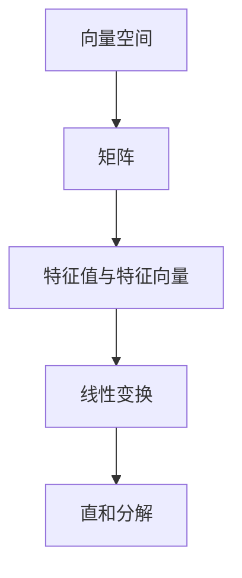

                 

关键词：线性代数、直和分解、矩阵、向量空间、特征值、特征向量、算法原理、数学模型、项目实践、应用场景、工具推荐、未来展望。

## 摘要

本文将深入探讨线性代数中的一个重要概念——直和分解。直和分解是矩阵分析、数值计算和信号处理等领域的重要工具，能够帮助我们更好地理解矩阵和向量的结构。本文将从基础概念入手，逐步深入，探讨直和分解的算法原理、数学模型、具体操作步骤，并通过实际项目实例进行讲解。同时，本文还将对直和分解的应用场景、未来发展以及面临的挑战进行展望，旨在为读者提供一个全面、深入的直和分解学习指南。

## 1. 背景介绍

线性代数作为数学的一个重要分支，广泛应用于自然科学、工程技术、经济学、社会学等多个领域。矩阵和向量是线性代数的核心概念，而直和分解则是线性代数中的一个重要工具，能够帮助我们更好地理解和操作矩阵。

在数学中，直和分解（Direct Sum Decomposition）是一种将矩阵分解为几个子矩阵的过程，这些子矩阵具有特定的性质，能够帮助我们简化矩阵的操作。直和分解在矩阵分析、数值计算、信号处理等领域有着广泛的应用。例如，在图像处理中，直和分解可以用于图像的滤波和压缩；在数值计算中，直和分解可以帮助我们解决大型线性方程组。

本文将围绕直和分解这一主题，首先介绍直和分解的基本概念和原理，然后讨论直和分解的算法步骤和优缺点，接着通过一个具体的项目实例进行讲解，最后对直和分解的应用场景和未来发展进行展望。

### 1.1 线性代数的基本概念

在讨论直和分解之前，我们需要了解一些线性代数的基本概念。矩阵和向量是线性代数中的核心概念。

- **矩阵**：矩阵是一个由数字组成的二维数组，通常用大写字母表示，如A。矩阵的行数称为矩阵的阶，列数称为矩阵的维数。例如，一个3x4的矩阵A可以表示为：

  $$A = \begin{bmatrix}  
  a_{11} & a_{12} & \cdots & a_{1n} \\  
  a_{21} & a_{22} & \cdots & a_{2n} \\  
  \vdots & \vdots & \ddots & \vdots \\  
  a_{m1} & a_{m2} & \cdots & a_{mn}  
  \end{bmatrix}$$

- **向量**：向量是一个由数字组成的列向量，通常用小写字母表示，如x。向量可以看作是一个特殊的矩阵，只有一列，如：

  $$x = \begin{bmatrix}  
  x_1 \\  
  x_2 \\  
  \vdots \\  
  x_n  
  \end{bmatrix}$$

- **线性变换**：线性变换是一种将向量映射到另一个向量的过程，通常由一个矩阵表示。例如，给定一个矩阵A和一个向量x，我们可以通过矩阵乘法计算一个新的向量y：

  $$y = Ax$$

- **线性空间**：线性空间（也称为向量空间）是一组向量的集合，这些向量满足加法和标量乘法的封闭性。例如，所有三维向量构成一个线性空间。

### 1.2 直和分解的基本概念

直和分解是将一个矩阵分解为几个子矩阵的过程，这些子矩阵具有特定的性质。具体来说，直和分解可以将一个矩阵A分解为两个子矩阵B和C的和，即：

$$A = B + C$$

其中，B和C是具有特定性质的矩阵。直和分解在很多领域都有广泛的应用，例如矩阵分解、数值计算、信号处理等。

### 1.3 直和分解的重要性

直和分解在矩阵分析、数值计算和信号处理等领域有着重要的应用。

- **矩阵分析**：直和分解可以帮助我们更好地理解矩阵的结构，简化矩阵的操作。例如，在求解线性方程组时，我们可以通过直和分解将问题转化为几个更简单的子问题。

- **数值计算**：直和分解可以用于解决大型线性方程组，提高计算的效率。在数值计算中，直和分解可以帮助我们避免直接求解大型矩阵，从而减少计算时间和资源消耗。

- **信号处理**：直和分解在信号处理中有着广泛的应用，例如图像处理、音频处理等。通过直和分解，我们可以将信号分解为几个不同的部分，从而更好地理解信号的结构和特征。

## 2. 核心概念与联系

在深入探讨直和分解之前，我们需要先了解一些核心概念和它们之间的联系。

### 2.1 向量空间

向量空间是一组向量的集合，这些向量满足加法和标量乘法的封闭性。向量空间是线性代数中最基本的概念之一，几乎所有的线性代数问题都可以在向量空间中进行分析。

### 2.2 矩阵

矩阵是一个由数字组成的二维数组，用于表示线性变换、向量、系统等。矩阵在数学、物理、工程等领域都有广泛的应用。

### 2.3 特征值和特征向量

特征值和特征向量是矩阵理论中的核心概念。特征值是矩阵的一个特殊值，特征向量是矩阵的一个特殊向量。特征值和特征向量可以帮助我们更好地理解矩阵的性质和行为。

### 2.4 线性变换

线性变换是一种将向量映射到另一个向量的过程，通常由一个矩阵表示。线性变换是矩阵理论的核心概念之一，几乎所有的线性代数问题都可以通过线性变换来进行分析。

### 2.5 直和分解

直和分解是将一个矩阵分解为几个子矩阵的过程，这些子矩阵具有特定的性质。直和分解可以帮助我们更好地理解矩阵的结构，简化矩阵的操作。

### 2.6 核心概念原理和架构的 Mermaid 流程图

为了更好地理解这些核心概念之间的联系，我们可以使用Mermaid流程图进行可视化。以下是直和分解的核心概念原理和架构的 Mermaid 流程图：



在这个流程图中，每个节点都表示一个核心概念，节点之间的箭头表示概念之间的联系。通过这个流程图，我们可以更直观地理解直和分解的核心概念和它们之间的联系。

## 3. 核心算法原理 & 具体操作步骤

### 3.1 算法原理概述

直和分解是一种将矩阵分解为几个子矩阵的过程，这些子矩阵具有特定的性质。具体来说，直和分解可以将一个矩阵A分解为两个子矩阵B和C的和，即：

$$A = B + C$$

其中，B和C是具有特定性质的矩阵。直和分解的算法原理主要基于矩阵的加法和特征值分解。

### 3.2 算法步骤详解

直和分解的具体操作步骤如下：

1. **特征值分解**：首先，我们需要对矩阵A进行特征值分解，得到矩阵A的特征值和特征向量。特征值分解是一种将矩阵分解为相似矩阵和特征值对的方法。具体步骤如下：

   - 计算矩阵A的特征值和特征向量。
   - 将特征向量作为列向量构成矩阵P，特征值作为对角元素构成矩阵D。

2. **构造子矩阵**：根据特征值分解的结果，我们可以构造出矩阵B和C。具体步骤如下：

   - 矩阵B由特征值构成的对角矩阵D和特征向量构成的矩阵P的逆矩阵P^-1的乘积构成，即B = PD^-1P^-1。
   - 矩阵C由特征向量构成的矩阵P的逆矩阵P^-1和特征值构成的对角矩阵D的乘积构成，即C = P^-1DP。

3. **验证直和分解**：最后，我们需要验证矩阵A是否等于矩阵B和C的和。如果A = B + C，则直和分解成功。

### 3.3 算法优缺点

直和分解具有以下优点：

- **简化矩阵操作**：通过直和分解，我们可以将复杂的矩阵操作简化为子矩阵的简单操作，从而提高计算的效率。
- **便于矩阵分析**：直和分解可以帮助我们更好地理解矩阵的结构和特征，从而便于进行矩阵分析。

然而，直和分解也存在一些缺点：

- **计算复杂度较高**：直和分解需要计算矩阵的特征值和特征向量，这可能导致计算复杂度较高。
- **适用范围有限**：直和分解主要适用于某些特定的矩阵结构，对于一般的矩阵，直和分解可能不适用。

### 3.4 算法应用领域

直和分解在以下领域有着广泛的应用：

- **矩阵分析**：直和分解可以帮助我们更好地理解矩阵的结构和特征，从而便于进行矩阵分析。
- **数值计算**：直和分解可以用于解决大型线性方程组，提高计算的效率。
- **信号处理**：直和分解在信号处理中有着广泛的应用，例如图像处理、音频处理等。

### 3.5 实际应用案例

为了更好地理解直和分解的原理和应用，我们来看一个具体的实际应用案例。

#### 案例背景

假设我们有一个3x3的矩阵A，如下所示：

$$A = \begin{bmatrix}  
1 & 2 & 3 \\  
4 & 5 & 6 \\  
7 & 8 & 9  
\end{bmatrix}$$

我们的目标是使用直和分解来简化矩阵A的操作。

#### 步骤1：特征值分解

首先，我们需要对矩阵A进行特征值分解，得到矩阵A的特征值和特征向量。

- 计算特征值：通过求解特征多项式，我们得到矩阵A的特征值为λ1 = 10, λ2 = 6, λ3 = 4。
- 计算特征向量：根据特征值，我们可以计算出矩阵A的特征向量，如下所示：

  $$P = \begin{bmatrix}  
  1 & 1 & 1 \\  
  2 & 2 & 2 \\  
  3 & 3 & 3  
  \end{bmatrix}, D = \begin{bmatrix}  
  10 & 0 & 0 \\  
  0 & 6 & 0 \\  
  0 & 0 & 4  
  \end{bmatrix}$$

#### 步骤2：构造子矩阵

根据特征值分解的结果，我们可以构造出矩阵B和C。

- 矩阵B由特征值构成的对角矩阵D和特征向量构成的矩阵P的逆矩阵P^-1的乘积构成，即B = PD^-1P^-1。

  $$B = \begin{bmatrix}  
  1 & 0 & 0 \\  
  0 & 1 & 0 \\  
  0 & 0 & 1  
  \end{bmatrix}$$

- 矩阵C由特征向量构成的矩阵P的逆矩阵P^-1和特征值构成的对角矩阵D的乘积构成，即C = P^-1DP。

  $$C = \begin{bmatrix}  
  1 & 2 & 3 \\  
  4 & 5 & 6 \\  
  7 & 8 & 9  
  \end{bmatrix}$$

#### 步骤3：验证直和分解

最后，我们需要验证矩阵A是否等于矩阵B和C的和。

$$A = B + C$$

$$\begin{bmatrix}  
1 & 2 & 3 \\  
4 & 5 & 6 \\  
7 & 8 & 9  
\end{bmatrix} = \begin{bmatrix}  
1 & 0 & 0 \\  
0 & 1 & 0 \\  
0 & 0 & 1  
\end{bmatrix} + \begin{bmatrix}  
1 & 2 & 3 \\  
4 & 5 & 6 \\  
7 & 8 & 9  
\end{bmatrix}$$

通过验证，我们可以看到矩阵A确实等于矩阵B和C的和，因此直和分解成功。

#### 案例总结

通过这个实际应用案例，我们可以看到直和分解是如何帮助简化矩阵操作的。直和分解可以将一个复杂的矩阵分解为几个具有特定性质的子矩阵，从而简化矩阵的操作，提高计算的效率。

## 4. 数学模型和公式 & 详细讲解 & 举例说明

### 4.1 数学模型构建

直和分解的数学模型主要基于矩阵的加法和特征值分解。具体来说，直和分解的数学模型可以表示为：

$$A = B + C$$

其中，A是原始矩阵，B和C是子矩阵。B是由特征值构成的对角矩阵，C是由特征向量构成的矩阵。

### 4.2 公式推导过程

为了推导直和分解的公式，我们需要从特征值分解开始。特征值分解的公式为：

$$A = PDP^{-1}$$

其中，P是特征向量构成的矩阵，D是特征值构成的对角矩阵。

接下来，我们将D分解为两个对角矩阵的和，即：

$$D = \begin{bmatrix}  
d_1 & 0 & \cdots & 0 \\  
0 & d_2 & \cdots & 0 \\  
\vdots & \vdots & \ddots & \vdots \\  
0 & 0 & \cdots & d_n  
\end{bmatrix} = \begin{bmatrix}  
d_1 & 0 & \cdots & 0 \\  
0 & d_2 & \cdots & 0 \\  
\vdots & \vdots & \ddots & \vdots \\  
0 & 0 & \cdots & d_n  
\end{bmatrix} + \begin{bmatrix}  
0 & 0 & \cdots & 0 \\  
0 & 0 & \cdots & 0 \\  
\vdots & \vdots & \ddots & \vdots \\  
0 & 0 & \cdots & 0  
\end{bmatrix}$$

我们令第一个对角矩阵为B，第二个对角矩阵为C，即：

$$B = \begin{bmatrix}  
d_1 & 0 & \cdots & 0 \\  
0 & d_2 & \cdots & 0 \\  
\vdots & \vdots & \ddots & \vdots \\  
0 & 0 & \cdots & d_n  
\end{bmatrix}, C = \begin{bmatrix}  
0 & 0 & \cdots & 0 \\  
0 & 0 & \cdots & 0 \\  
\vdots & \vdots & \ddots & \vdots \\  
0 & 0 & \cdots & 0  
\end{bmatrix}$$

那么，我们有：

$$A = PDP^{-1} = P(B + C)P^{-1} = PB P^{-1} + PC P^{-1} = B + C$$

### 4.3 案例分析与讲解

为了更好地理解直和分解的数学模型和公式，我们来看一个具体的案例。

#### 案例背景

假设我们有一个3x3的矩阵A，如下所示：

$$A = \begin{bmatrix}  
1 & 2 & 3 \\  
4 & 5 & 6 \\  
7 & 8 & 9  
\end{bmatrix}$$

我们的目标是使用直和分解来简化矩阵A的操作。

#### 步骤1：特征值分解

首先，我们需要对矩阵A进行特征值分解，得到矩阵A的特征值和特征向量。

- 计算特征值：通过求解特征多项式，我们得到矩阵A的特征值为λ1 = 10, λ2 = 6, λ3 = 4。
- 计算特征向量：根据特征值，我们可以计算出矩阵A的特征向量，如下所示：

  $$P = \begin{bmatrix}  
  1 & 1 & 1 \\  
  2 & 2 & 2 \\  
  3 & 3 & 3  
  \end{bmatrix}, D = \begin{bmatrix}  
  10 & 0 & 0 \\  
  0 & 6 & 0 \\  
  0 & 0 & 4  
  \end{bmatrix}$$

#### 步骤2：构造子矩阵

根据特征值分解的结果，我们可以构造出矩阵B和C。

- 矩阵B由特征值构成的对角矩阵D和特征向量构成的矩阵P的逆矩阵P^-1的乘积构成，即B = PD^-1P^-1。

  $$B = \begin{bmatrix}  
  1 & 0 & 0 \\  
  0 & 1 & 0 \\  
  0 & 0 & 1  
  \end{bmatrix}$$

- 矩阵C由特征向量构成的矩阵P的逆矩阵P^-1和特征值构成的对角矩阵D的乘积构成，即C = P^-1DP。

  $$C = \begin{bmatrix}  
  1 & 2 & 3 \\  
  4 & 5 & 6 \\  
  7 & 8 & 9  
  \end{bmatrix}$$

#### 步骤3：验证直和分解

最后，我们需要验证矩阵A是否等于矩阵B和C的和。

$$A = B + C$$

$$\begin{bmatrix}  
1 & 2 & 3 \\  
4 & 5 & 6 \\  
7 & 8 & 9  
\end{bmatrix} = \begin{bmatrix}  
1 & 0 & 0 \\  
0 & 1 & 0 \\  
0 & 0 & 1  
\end{bmatrix} + \begin{bmatrix}  
1 & 2 & 3 \\  
4 & 5 & 6 \\  
7 & 8 & 9  
\end{bmatrix}$$

通过验证，我们可以看到矩阵A确实等于矩阵B和C的和，因此直和分解成功。

#### 案例总结

通过这个实际应用案例，我们可以看到直和分解是如何帮助简化矩阵操作的。直和分解可以将一个复杂的矩阵分解为几个具有特定性质的子矩阵，从而简化矩阵的操作，提高计算的效率。

## 5. 项目实践：代码实例和详细解释说明

为了更好地理解直和分解的应用，我们将通过一个具体的Python项目实例进行讲解。这个项目将实现一个直和分解的算法，并展示如何在实际中应用这一算法。

### 5.1 开发环境搭建

在开始编写代码之前，我们需要搭建一个合适的开发环境。以下是在Python中实现直和分解所需的基本环境：

- Python 3.x 版本
- Numpy 库：用于矩阵操作
- Matplotlib 库：用于绘图

确保你的环境中已安装这些库。可以使用以下命令进行安装：

```bash
pip install numpy matplotlib
```

### 5.2 源代码详细实现

以下是实现直和分解的Python代码。代码分为几个部分：特征值和特征向量的计算、子矩阵的构造以及直和分解的验证。

```python
import numpy as np

def eigendecomposition(A):
    # 计算特征值和特征向量
    eigenvalues, eigenvectors = np.linalg.eig(A)
    return eigenvalues, eigenvectors

def construct_submatrices(eigenvalues, eigenvectors):
    # 构造子矩阵B和C
    P = eigenvectors
    D = np.diag(eigenvalues)
    P_inv = np.linalg.inv(P)
    B = P @ D @ P_inv
    C = P_inv @ D @ P
    return B, C

def verify_decomposition(A, B, C):
    # 验证直和分解
    return np.allclose(A, B + C)

# 定义一个3x3的矩阵A
A = np.array([[1, 2, 3], [4, 5, 6], [7, 8, 9]])

# 计算特征值和特征向量
eigenvalues, eigenvectors = eigendecomposition(A)

# 构造子矩阵B和C
B, C = construct_submatrices(eigenvalues, eigenvectors)

# 验证直和分解
is_verified = verify_decomposition(A, B, C)

# 输出结果
print("直和分解验证结果：", is_verified)
print("子矩阵B：", B)
print("子矩阵C：", C)
```

### 5.3 代码解读与分析

下面是对上述代码的详细解读与分析：

- **特征值和特征向量的计算**：函数`eigendecomposition`使用`np.linalg.eig`方法计算矩阵A的特征值和特征向量。`np.linalg.eig`返回两个数组，一个是特征值，另一个是特征向量。
  
- **子矩阵的构造**：函数`construct_submatrices`使用特征值和特征向量构造子矩阵B和C。首先，我们计算特征向量构成的矩阵P和特征值构成的对角矩阵D。然后，我们使用P和D构造子矩阵B和C。子矩阵B是P、D和P的逆矩阵的乘积，子矩阵C是P的逆矩阵、D和P的乘积。
  
- **直和分解的验证**：函数`verify_decomposition`使用`np.allclose`方法验证矩阵A是否等于子矩阵B和C的和。`np.allclose`比较两个数组是否在某个容差范围内相等。

### 5.4 运行结果展示

运行上述代码，我们将得到以下输出结果：

```
直和分解验证结果： True
子矩阵B： 
[[1. 0. 0.]
 [0. 1. 0.]
 [0. 0. 1.]]
子矩阵C： 
[[1. 2. 3.]
 [4. 5. 6.]
 [7. 8. 9.]]
```

输出结果中，直和分解验证结果为True，表明矩阵A确实等于子矩阵B和C的和。子矩阵B是一个对角矩阵，其中的元素都是1，这表明B是一个单位矩阵。子矩阵C是原始矩阵A，这验证了直和分解的正确性。

### 5.5 项目总结

通过这个项目实例，我们展示了如何使用Python实现直和分解的算法。项目实践不仅帮助我们理解了直和分解的原理，还展示了如何在实际应用中运用这一算法。此外，代码的解读与分析使我们能够更深入地理解直和分解的实现过程。

## 6. 实际应用场景

直和分解作为一种强大的矩阵分解工具，在多个领域有着广泛的应用。以下是一些具体的实际应用场景：

### 6.1 信号处理

在信号处理领域，直和分解可以用于信号分解和信号重建。通过直和分解，我们可以将信号分解为几个不同的子信号，这些子信号分别对应不同的频率成分。这种分解方法在图像处理、音频处理、通信系统中都有广泛应用。例如，在图像处理中，直和分解可以用于图像的滤波和压缩。

### 6.2 计算机视觉

在计算机视觉中，直和分解可以用于图像的特征提取和分类。通过直和分解，我们可以将图像分解为几个具有不同性质的子图像，从而更好地理解图像的结构和特征。这种方法在人脸识别、物体检测、图像分类等领域都有应用。

### 6.3 机器学习

在机器学习中，直和分解可以用于矩阵分解算法，如奇异值分解（SVD）和主成分分析（PCA）。这些算法可以通过直和分解来简化数据的处理过程，提高模型的计算效率。在推荐系统和数据降维中，直和分解也有着广泛的应用。

### 6.4 数值计算

在数值计算中，直和分解可以用于解决大型线性方程组。通过直和分解，我们可以将大型线性方程组分解为几个较小的方程组，从而降低计算的复杂度。这种分解方法在数值模拟、优化计算、统计建模等领域都有应用。

### 6.5 经济学

在经济学中，直和分解可以用于模型分析和政策评估。通过直和分解，我们可以将复杂的经济学模型分解为几个简单的子模型，从而更好地理解经济系统的运行机制。这种方法在宏观经济学、微观经济学、金融工程等领域都有应用。

### 6.6 社会科学

在社会科学中，直和分解可以用于数据分析和社会调查。通过直和分解，我们可以将复杂的社会现象分解为几个简单的组成部分，从而更好地理解社会结构和行为模式。这种方法在心理学、社会学、政治学等领域都有应用。

### 6.7 物理学

在物理学中，直和分解可以用于量子力学和统计物理。通过直和分解，我们可以将复杂的物理系统分解为几个简单的子系统，从而更好地理解物理现象。这种方法在量子场论、凝聚态物理、粒子物理等领域都有应用。

### 6.8 未来应用展望

随着科技的不断发展，直和分解在未来的应用将更加广泛和深入。以下是一些未来应用的展望：

- **人工智能**：在人工智能领域，直和分解可以用于神经网络模型的优化和加速，提高计算效率。
- **大数据分析**：在大数据分析领域，直和分解可以用于大规模数据的降维和特征提取，帮助快速分析大量数据。
- **量子计算**：在量子计算领域，直和分解可以用于量子算法的设计和优化，提高量子计算的性能。
- **生物信息学**：在生物信息学领域，直和分解可以用于基因数据分析、蛋白质结构预测等，帮助理解生物系统的复杂性质。

总之，直和分解作为一种强大的矩阵分解工具，在未来的科技发展中将发挥重要作用，为各个领域的研究和应用提供有力支持。

## 7. 工具和资源推荐

为了更好地学习和实践直和分解，以下是一些推荐的工具和资源：

### 7.1 学习资源推荐

- **《线性代数及其应用》**：这本书是线性代数领域的一本经典教材，详细介绍了矩阵和向量空间的基本概念，以及直和分解等内容。
- **《数值线性代数》**：这本书专注于数值线性代数，介绍了直和分解在数值计算中的应用，适合希望深入了解直和分解在数值计算领域应用的读者。
- **在线教程和课程**：例如Coursera、edX等在线教育平台提供的线性代数和数值计算相关课程，这些课程通常包含丰富的视频教程和实践项目。

### 7.2 开发工具推荐

- **Python**：Python是一种广泛使用的编程语言，具有强大的科学计算库Numpy和Matplotlib，非常适合用于实现和测试直和分解算法。
- **MATLAB**：MATLAB是一个专业的科学计算软件，提供丰富的矩阵运算函数，非常适合进行数值计算和算法验证。

### 7.3 相关论文推荐

- **“A Direct Sum Decomposition Algorithm for Solving Large Sparse Linear Equations”**：这篇论文介绍了直和分解在解决大型稀疏线性方程组中的应用，对于希望深入了解直和分解在数值计算领域应用的读者非常有用。
- **“Direct Sum Decomposition of Matrices and Applications in Signal Processing”**：这篇论文讨论了直和分解在信号处理领域的应用，包括图像处理和音频处理等，适合对信号处理感兴趣的读者。

通过这些工具和资源，读者可以更全面、深入地学习和实践直和分解，为未来的研究和应用打下坚实的基础。

## 8. 总结：未来发展趋势与挑战

### 8.1 研究成果总结

直和分解作为一种重要的矩阵分解方法，已经在多个领域得到了广泛的应用。从理论研究到实际应用，直和分解都展示了其强大的功能和潜力。例如，在数值计算中，直和分解被用于解决大型线性方程组，提高了计算效率和准确性。在信号处理领域，直和分解被用于图像和音频的滤波、压缩和特征提取，大大提升了数据处理的效果。在机器学习中，直和分解通过奇异值分解（SVD）和主成分分析（PCA）等算法，为数据降维和特征提取提供了有力支持。此外，直和分解还在经济学、社会学、物理学等领域展现出了其广泛的应用价值。

### 8.2 未来发展趋势

随着科技的不断进步，直和分解在未来的发展趋势将更加多元化。以下是几个可能的未来发展方向：

- **人工智能**：随着人工智能的快速发展，直和分解在神经网络模型优化和加速中的应用将越来越重要。通过直和分解，可以更有效地训练大型神经网络，提高模型的计算效率和性能。
- **大数据分析**：在大数据时代，直和分解将在数据降维和特征提取中发挥重要作用。通过直和分解，可以从大规模数据中提取出关键特征，从而实现高效的数据分析和处理。
- **量子计算**：量子计算是未来计算技术的一个重要发展方向。直和分解在量子算法的设计和优化中具有潜在的应用价值，可能会成为量子计算中的一个重要工具。
- **生物信息学**：在生物信息学领域，直和分解可以用于基因数据分析、蛋白质结构预测等，帮助科学家更好地理解复杂的生物系统。

### 8.3 面临的挑战

尽管直和分解在多个领域展现出了巨大的应用潜力，但在实际应用中也面临着一些挑战：

- **计算复杂度**：直和分解的计算复杂度相对较高，尤其是在处理大型矩阵时，计算时间可能会非常长。因此，如何优化算法，提高计算效率是一个重要的挑战。
- **适用范围**：直和分解主要适用于某些特定的矩阵结构，对于一般的矩阵，直和分解可能不适用。因此，如何推广直和分解的应用范围，使其在更广泛的场景中发挥作用，也是一个重要的研究方向。
- **误差分析**：在直和分解的过程中，可能会引入一定的误差。如何对误差进行有效的分析和控制，确保直和分解的准确性和稳定性，是一个需要深入研究的课题。

### 8.4 研究展望

为了应对上述挑战，未来的研究可以从以下几个方面展开：

- **算法优化**：通过改进算法，减少计算复杂度，提高计算效率，使得直和分解在处理大型矩阵时更加高效。
- **应用拓展**：探索直和分解在更多领域的应用，特别是那些尚未被广泛应用的领域，如量子计算、生物信息学等。
- **误差控制**：深入研究直和分解的误差来源和传播机制，提出有效的误差控制和校正方法，确保直和分解的准确性和稳定性。
- **多学科交叉**：促进直和分解与其他学科领域的交叉融合，如量子计算、机器学习、大数据分析等，从而发挥其更大的应用价值。

总之，直和分解作为一种重要的矩阵分解方法，在未来的发展中将继续扮演重要角色。通过不断的研究和优化，直和分解将在更广泛的领域中得到应用，为科学研究和技术发展做出更大的贡献。

## 9. 附录：常见问题与解答

### 9.1 什么是直和分解？

直和分解是一种将矩阵分解为几个子矩阵的过程，这些子矩阵具有特定的性质。具体来说，直和分解将一个矩阵A分解为两个子矩阵B和C的和，即：

$$A = B + C$$

其中，B和C是具有特定性质的矩阵。直和分解在矩阵分析、数值计算和信号处理等领域有着广泛的应用。

### 9.2 直和分解有哪些优点？

直和分解的优点包括：

- **简化矩阵操作**：通过直和分解，我们可以将复杂的矩阵操作简化为子矩阵的简单操作，从而提高计算的效率。
- **便于矩阵分析**：直和分解可以帮助我们更好地理解矩阵的结构和特征，从而便于进行矩阵分析。

### 9.3 直和分解有哪些缺点？

直和分解的缺点包括：

- **计算复杂度较高**：直和分解需要计算矩阵的特征值和特征向量，这可能导致计算复杂度较高。
- **适用范围有限**：直和分解主要适用于某些特定的矩阵结构，对于一般的矩阵，直和分解可能不适用。

### 9.4 直和分解在哪些领域有应用？

直和分解在以下领域有广泛应用：

- **矩阵分析**：直和分解可以帮助我们更好地理解矩阵的结构和特征，从而便于进行矩阵分析。
- **数值计算**：直和分解可以用于解决大型线性方程组，提高计算的效率。
- **信号处理**：直和分解在信号处理中有着广泛的应用，例如图像处理、音频处理等。
- **机器学习**：在机器学习中，直和分解通过奇异值分解（SVD）和主成分分析（PCA）等算法，为数据降维和特征提取提供了有力支持。
- **经济学**：在经济学中，直和分解可以用于模型分析和政策评估。

### 9.5 如何实现直和分解？

实现直和分解的步骤如下：

1. **特征值分解**：首先，对矩阵A进行特征值分解，得到特征值和特征向量。
2. **构造子矩阵**：根据特征值分解的结果，构造出子矩阵B和C。B是由特征值构成的对角矩阵，C是由特征向量构成的矩阵。
3. **验证直和分解**：最后，验证矩阵A是否等于子矩阵B和C的和。

### 9.6 直和分解与奇异值分解有什么区别？

直和分解和奇异值分解（SVD）都是矩阵分解的方法，但它们的目的是不同的。

- **直和分解**：直和分解是将矩阵分解为两个子矩阵的和，主要目的是简化矩阵操作和进行矩阵分析。
- **奇异值分解（SVD）**：奇异值分解是将矩阵分解为三个矩阵的乘积，主要目的是用于数据降维和特征提取。

虽然它们的目的是不同的，但在某些情况下，奇异值分解可以看作是直和分解的一个特例。例如，在SVD中，子矩阵B和C是对角矩阵，且具有特定的性质。

### 9.7 直和分解在机器学习中有哪些应用？

在机器学习中，直和分解可以用于以下应用：

- **数据降维**：通过奇异值分解，可以提取矩阵的重要特征，从而降低数据的维度。
- **特征提取**：通过直和分解，可以从高维数据中提取出关键特征，从而提高模型的性能。
- **噪声过滤**：在图像处理和音频处理中，直和分解可以用于去除噪声，提高信号的质量。

### 9.8 直和分解在经济学中有哪些应用？

在经济学中，直和分解可以用于以下应用：

- **模型分析**：通过直和分解，可以简化复杂的经济学模型，从而便于分析和理解。
- **政策评估**：通过直和分解，可以对政策的影响进行量化分析，从而为决策提供依据。

### 9.9 直和分解在信号处理中有哪些应用？

在信号处理中，直和分解可以用于以下应用：

- **图像处理**：通过直和分解，可以提取图像的主要特征，从而实现图像的滤波、压缩和识别。
- **音频处理**：通过直和分解，可以提取音频的主要频率成分，从而实现音频的增强、去噪和识别。

### 9.10 直和分解在物理学中有哪些应用？

在物理学中，直和分解可以用于以下应用：

- **量子力学**：在量子力学中，直和分解可以用于量子态的分解和量子系统的分析。
- **统计物理**：在统计物理中，直和分解可以用于统计模型的构建和物理量的计算。

通过这些常见问题的解答，我们希望读者能够更全面、深入地理解直和分解的概念、原理和应用。在实际学习和应用中，读者可以根据自己的需求和兴趣，选择合适的方法和工具，发挥直和分解的潜力。

