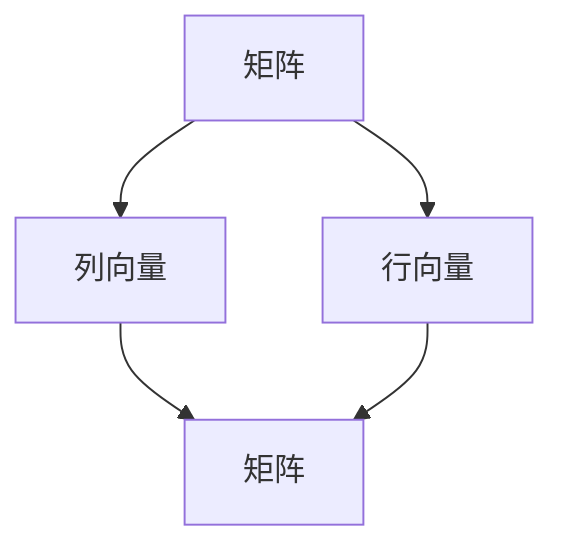
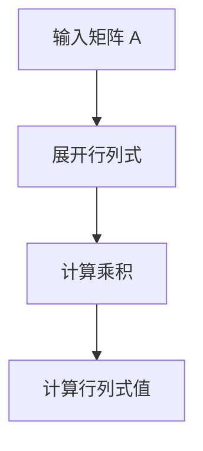

                 

关键词：线性代数、矩阵、向量、算法、数学模型、应用场景、未来展望

> 摘要：本文旨在为读者提供线性代数中矩阵与向量方面的深入理解，探讨其核心概念、算法原理及其在不同领域的应用。文章从背景介绍入手，通过详尽的数学模型和公式推导，讲解核心算法原理和具体操作步骤，并借助项目实践展示其应用效果。最后，文章展望了线性代数在未来的发展趋势与挑战，为读者提供了丰富的学习资源与工具推荐。

## 1. 背景介绍

线性代数是数学的一个分支，主要研究向量空间、线性映射和线性方程组等概念。矩阵与向量作为线性代数的核心元素，广泛应用于计算机科学、物理学、经济学和工程学等领域。矩阵是一种由数字组成的矩形阵列，用于表示线性方程组和线性变换。向量则是一种有大小和方向的量，可以用来表示物理量、几何量等。矩阵与向量之间的运算和关系，构成了线性代数的基础理论。

在计算机科学中，矩阵与向量广泛应用于数据存储、图形处理、机器学习和算法分析等领域。例如，矩阵可以用于存储和操作大数据集，向量可以用于表示图像、音频和视频等媒体数据。线性代数的算法原理和数学模型，为这些应用提供了理论基础和实践指导。

本文将围绕线性代数中的矩阵与向量展开讨论，首先介绍其核心概念和联系，然后讲解核心算法原理和具体操作步骤，最后探讨其在不同领域的实际应用。

## 2. 核心概念与联系

为了深入理解矩阵与向量的核心概念和联系，我们需要了解以下几个关键概念：

### 2.1 向量

向量是具有大小和方向的量。在二维空间中，向量可以用一对有序实数 $(x, y)$ 表示，其中 $x$ 和 $y$ 分别表示向量的水平分量和垂直分量。向量的加法、减法、数乘等运算遵循平行四边形法则和三角形法则。向量在几何学、物理学和计算机图形学等领域有广泛应用。

### 2.2 矩阵

矩阵是一种由数字组成的矩形阵列，通常用大写字母表示，如 $A$。矩阵可以看作是多个向量的集合，每个向量对应矩阵的一行或一列。矩阵的元素可以是实数、复数或其他数值类型。矩阵的行数称为矩阵的行数，列数称为矩阵的列数。矩阵的运算包括加法、减法、数乘、矩阵乘法等。

### 2.3 向量与矩阵的关系

向量与矩阵之间存在密切的联系。一个矩阵的每一行可以看作是一个列向量，反之亦然。例如，一个 $3 \times 3$ 的矩阵 $A$ 可以表示为三个列向量 $a_1, a_2, a_3$ 的组合，即 $A = [a_1 \ a_2 \ a_3]$。同样，一个列向量也可以扩展为一个 $1 \times n$ 的矩阵。向量与矩阵之间的运算，如向量和矩阵的乘法，是线性代数中重要的运算。

下面是一个使用 Mermaid 流程图表示的向量与矩阵之间的联系：



## 3. 核心算法原理 & 具体操作步骤

### 3.1 算法原理概述

在线性代数中，矩阵与向量的运算和变换是核心算法原理的基础。这些算法原理包括矩阵乘法、矩阵求逆、行列式计算等。这些算法在计算机科学、物理学、经济学和工程学等领域有广泛的应用。

#### 3.1.1 矩阵乘法

矩阵乘法是线性代数中最基本的运算之一。给定两个矩阵 $A$（$m \times n$）和 $B$（$n \times p$），其乘积 $C = AB$ 是一个 $m \times p$ 的矩阵。矩阵乘法的具体步骤如下：

1. 计算每个元素 $c_{ij}$，其中 $c_{ij} = \sum_{k=1}^{n} a_{ik}b_{kj}$。
2. 将所有 $c_{ij}$ 填入结果矩阵 $C$ 的对应位置。

#### 3.1.2 矩阵求逆

矩阵求逆是求解线性方程组的关键步骤。给定一个 $n \times n$ 的矩阵 $A$，其逆矩阵 $A^{-1}$ 满足 $AA^{-1} = A^{-1}A = I$，其中 $I$ 是单位矩阵。求逆矩阵的步骤如下：

1. 计算矩阵 $A$ 的行列式 $\det(A)$。
2. 如果 $\det(A) \neq 0$，则 $A$ 可逆，计算伴随矩阵 $A^*$。
3. 计算 $A^{-1} = \frac{1}{\det(A)}A^*$。

#### 3.1.3 行列式计算

行列式是矩阵的一个重要属性，用于判断矩阵的行列式是否为零。给定一个 $n \times n$ 的矩阵 $A$，其行列式 $\det(A)$ 可以通过以下步骤计算：

1. 展开行列式，即计算所有可能的 $n$ 个元素的乘积，并按照主对角线上的元素符号进行交替相乘。
2. 将所有乘积相加，得到行列式的值。

### 3.2 算法步骤详解

下面分别详细介绍上述算法的具体步骤。

#### 3.2.1 矩阵乘法

给定两个矩阵 $A$（$m \times n$）和 $B$（$n \times p$），具体步骤如下：

1. 创建一个 $m \times p$ 的结果矩阵 $C$。
2. 对 $C$ 中的每个元素 $c_{ij}$，计算 $c_{ij} = \sum_{k=1}^{n} a_{ik}b_{kj}$。
3. 将计算结果填入 $C$ 的对应位置。

以下是矩阵乘法的 Mermaid 流程图：

```mermaid
graph TD
    A[输入矩阵 A] --> B[输入矩阵 B]
    B --> C[创建结果矩阵 C]
    C --> D[计算 c_{ij} = \sum_{k=1}^{n} a_{ik}b_{kj}]
    D --> E[填充结果矩阵 C]
```

#### 3.2.2 矩阵求逆

给定一个 $n \times n$ 的矩阵 $A$，具体步骤如下：

1. 计算 $\det(A)$。
2. 如果 $\det(A) \neq 0$，计算伴随矩阵 $A^*$。
3. 计算 $A^{-1} = \frac{1}{\det(A)}A^*$。

以下是矩阵求逆的 Mermaid 流程图：

```mermaid
graph TD
    A[输入矩阵 A] --> B[计算行列式 det(A)]
    B --> C{det(A) = 0?}
    C -->|是| D[计算伴随矩阵 A*]
    C -->|否| E[结束]
    D --> F[计算逆矩阵 A^-1]
```

#### 3.2.3 行列式计算

给定一个 $n \times n$ 的矩阵 $A$，具体步骤如下：

1. 展开行列式。
2. 计算所有可能的 $n$ 个元素的乘积，并按照主对角线上的元素符号进行交替相乘。
3. 将所有乘积相加，得到行列式的值。

以下是行列式计算的 Mermaid 流程图：



### 3.3 算法优缺点

每种算法都有其优缺点，以下分别介绍上述算法的优缺点：

#### 3.3.1 矩阵乘法

**优点**：

- 矩阵乘法是线性代数中最基本的运算之一，广泛应用于数据存储、图形处理和机器学习等领域。
- 矩阵乘法的计算复杂度为 $O(mnp)$，对于大规模矩阵乘法，可以采用并行计算和分布式计算技术提高计算效率。

**缺点**：

- 矩阵乘法的时间复杂度较高，对于大规模矩阵乘法，计算时间较长。
- 矩阵乘法可能涉及大量的中间计算结果，导致内存占用增加。

#### 3.3.2 矩阵求逆

**优点**：

- 矩阵求逆可以用于求解线性方程组，是线性代数中的重要工具。
- 矩阵求逆可以应用于图像处理、数值分析和机器学习等领域。

**缺点**：

- 矩阵求逆的时间复杂度为 $O(n^3)$，对于大规模矩阵，计算时间较长。
- 矩阵求逆可能涉及大量的中间计算结果，导致内存占用增加。

#### 3.3.3 行列式计算

**优点**：

- 行列式计算是线性代数中重要的工具，可以用于判断矩阵的可逆性。
- 行列式计算可以应用于图像处理、数值分析和机器学习等领域。

**缺点**：

- 行列式计算的时间复杂度为 $O(n!)$，对于大规模矩阵，计算时间较长。
- 行列式计算可能涉及大量的中间计算结果，导致内存占用增加。

### 3.4 算法应用领域

矩阵与向量的算法原理和数学模型在计算机科学、物理学、经济学和工程学等领域有广泛的应用。以下分别介绍这些应用领域：

#### 3.4.1 计算机科学

- 数据存储：矩阵可以用于存储和操作大数据集，例如稀疏矩阵存储和压缩感知技术。
- 图形处理：矩阵可以用于表示图像、音频和视频等媒体数据，例如线性变换和图像滤波。
- 机器学习：矩阵可以用于表示特征空间和特征向量，例如支持向量机和神经网络。

#### 3.4.2 物理学

- 力学：矩阵可以用于描述质点的运动和力的作用，例如牛顿第二定律和动量守恒定律。
- 电磁学：矩阵可以用于描述电磁场的分布和传播，例如麦克斯韦方程组和电磁波传播。
- 热力学：矩阵可以用于描述热传导和热辐射，例如热力学第二定律和热传导方程。

#### 3.4.3 经济学

- 资产定价：矩阵可以用于描述金融市场的风险和收益，例如资本资产定价模型和套利定价理论。
- 经济预测：矩阵可以用于分析经济数据和变量之间的关系，例如线性回归分析和时间序列分析。
- 货币政策：矩阵可以用于描述货币政策对经济的影响，例如货币政策传导机制和通货膨胀预测。

#### 3.4.4 工程学

- 结构分析：矩阵可以用于描述结构的应力和位移，例如有限元分析和结构动力学。
- 控制系统：矩阵可以用于描述系统的状态和输入输出关系，例如控制理论和状态空间模型。
- 信号处理：矩阵可以用于描述信号的处理和变换，例如傅里叶变换和卷积运算。

## 4. 数学模型和公式 & 详细讲解 & 举例说明

### 4.1 数学模型构建

在线性代数中，数学模型是描述系统、现象或问题的数学表达式。矩阵与向量的数学模型主要包括线性方程组、特征值和特征向量等。以下分别介绍这些数学模型。

#### 4.1.1 线性方程组

线性方程组是描述多个变量之间线性关系的数学模型。给定一个 $n \times n$ 的矩阵 $A$ 和一个 $n \times 1$ 的向量 $b$，线性方程组可以表示为：

$$
Ax = b
$$

其中，$x$ 是未知向量。求解线性方程组的目标是找到满足上述等式的未知向量 $x$。线性方程组的求解方法包括高斯消元法和矩阵求逆等。

#### 4.1.2 特征值和特征向量

特征值和特征向量是矩阵的重要属性。给定一个 $n \times n$ 的矩阵 $A$，其特征值 $\lambda$ 和特征向量 $v$ 满足以下方程：

$$
Av = \lambda v
$$

特征值和特征向量可以用来描述矩阵的性质和行为，例如矩阵的对角化、矩阵的相似性和矩阵的谱分解等。

### 4.2 公式推导过程

为了更好地理解矩阵与向量的数学模型，我们以下分别介绍线性方程组、特征值和特征向量等公式的推导过程。

#### 4.2.1 线性方程组

假设给定一个线性方程组：

$$
\begin{cases}
a_{11}x_1 + a_{12}x_2 + \cdots + a_{1n}x_n = b_1 \\
a_{21}x_1 + a_{22}x_2 + \cdots + a_{2n}x_n = b_2 \\
\vdots \\
a_{m1}x_1 + a_{m2}x_2 + \cdots + a_{mn}x_n = b_m
\end{cases}
$$

我们可以将其写成矩阵形式：

$$
Ax = b
$$

其中，$A$ 是系数矩阵，$x$ 是未知向量，$b$ 是常数向量。

为了求解线性方程组，我们可以使用高斯消元法。具体步骤如下：

1. 将系数矩阵 $A$ 写成增广矩阵 $[A|b]$。
2. 从左到右，依次消元，将每一列的系数变为 $1$。
3. 将每一行的常数项移到等式右边。
4. 逆序回代，求解未知向量 $x$。

以下是高斯消元法的 Mermaid 流程图：

```mermaid
graph TD
    A[输入增广矩阵 [A|b]] --> B[消元操作]
    B --> C[回代操作]
    C --> D[求解未知向量 x]
```

#### 4.2.2 特征值和特征向量

给定一个 $n \times n$ 的矩阵 $A$，其特征值和特征向量的推导过程如下：

1. 假设 $A$ 的特征值为 $\lambda$，特征向量为 $v$，则有：

$$
Av = \lambda v
$$

2. 将 $v$ 的模长归一化，即 $v = \frac{v}{\|v\|}$，其中 $\|v\|$ 是 $v$ 的模长。

3. 将 $Av = \lambda v$ 代入，得到：

$$
\frac{Av}{\|v\|} = \lambda \frac{v}{\|v\|}
$$

4. 化简得到：

$$
A\frac{v}{\|v\|} = \lambda \frac{v}{\|v\|}
$$

5. 由于 $\frac{v}{\|v\|}$ 是单位向量，其模长为 $1$，则上式可以写为：

$$
A\mathbf{u} = \lambda \mathbf{u}
$$

其中，$\mathbf{u} = \frac{v}{\|v\|}$ 是单位特征向量。

### 4.3 案例分析与讲解

为了更好地理解矩阵与向量的数学模型，我们以下通过一个实际案例进行讲解。

#### 4.3.1 问题背景

假设有一个 $3 \times 3$ 的矩阵 $A$：

$$
A = \begin{pmatrix}
2 & 1 & 3 \\
4 & 2 & 5 \\
6 & 3 & 7
\end{pmatrix}
$$

我们需要求解 $A$ 的特征值和特征向量。

#### 4.3.2 求解步骤

1. 求解特征方程 $\det(A - \lambda I) = 0$，其中 $I$ 是单位矩阵。

$$
\det(A - \lambda I) = \det\begin{pmatrix}
2 - \lambda & 1 & 3 \\
4 & 2 - \lambda & 5 \\
6 & 3 & 7 - \lambda
\end{pmatrix} = 0
$$

2. 展开行列式，得到特征方程：

$$
(2 - \lambda)[(2 - \lambda)(7 - \lambda) - 15] - 3[4(7 - \lambda) - 6] + 12[4(2 - \lambda) - 3] = 0
$$

3. 化简特征方程，得到：

$$
\lambda^3 - 11\lambda^2 + 35\lambda - 15 = 0
$$

4. 求解特征方程，得到特征值：

$$
\lambda_1 = 1, \lambda_2 = 5, \lambda_3 = 7
$$

5. 对于每个特征值，求解线性方程组 $(A - \lambda_i I)v = 0$，得到对应的特征向量。

对于 $\lambda_1 = 1$：

$$
\begin{pmatrix}
1 & 1 & 3 \\
4 & 1 & 5 \\
6 & 3 & 6
\end{pmatrix}
\begin{pmatrix}
v_1 \\
v_2 \\
v_3
\end{pmatrix} = \begin{pmatrix}
0 \\
0 \\
0
\end{pmatrix}
$$

解得特征向量 $v_1 = (1, -1, 0)$。

对于 $\lambda_2 = 5$：

$$
\begin{pmatrix}
-3 & 1 & 3 \\
4 & -3 & 5 \\
6 & 3 & 2
\end{pmatrix}
\begin{pmatrix}
v_1 \\
v_2 \\
v_3
\end{pmatrix} = \begin{pmatrix}
0 \\
0 \\
0
\end{pmatrix}
$$

解得特征向量 $v_2 = (1, 0, -1)$。

对于 $\lambda_3 = 7$：

$$
\begin{pmatrix}
-5 & 1 & 3 \\
4 & -5 & 5 \\
6 & 3 & 0
\end{pmatrix}
\begin{pmatrix}
v_1 \\
v_2 \\
v_3
\end{pmatrix} = \begin{pmatrix}
0 \\
0 \\
0
\end{pmatrix}
$$

解得特征向量 $v_3 = (1, 1, 1)$。

#### 4.3.3 结果分析

通过求解特征值和特征向量，我们得到矩阵 $A$ 的三个特征值和三个特征向量。这些特征值和特征向量可以用于分析矩阵的性质和行为，例如矩阵的对角化、矩阵的谱分解等。

## 5. 项目实践：代码实例和详细解释说明

### 5.1 开发环境搭建

为了演示矩阵与向量的算法，我们选择 Python 作为编程语言，并使用 NumPy 库进行矩阵和向量的操作。首先，我们需要搭建 Python 开发环境。

1. 安装 Python：从 [Python 官网](https://www.python.org/) 下载并安装 Python，选择合适的版本（例如 Python 3.8）。
2. 安装 NumPy：打开终端或命令行窗口，执行以下命令安装 NumPy：

   ```
   pip install numpy
   ```

   如果是 Windows 系统，可以使用以下命令安装：

   ```
   python -m pip install numpy
   ```

### 5.2 源代码详细实现

下面是一个简单的 Python 脚本，用于演示矩阵与向量的基本操作。

```python
import numpy as np

# 创建矩阵和向量
A = np.array([[2, 1, 3], [4, 2, 5], [6, 3, 7]])
x = np.array([1, 0, -1])

# 矩阵乘法
B = np.dot(A, x)

# 矩阵求逆
A_inv = np.linalg.inv(A)

# 行列式计算
det_A = np.linalg.det(A)

# 求解线性方程组
x.solve = np.linalg.solve(A, x)

# 特征值和特征向量
eigenvalues, eigenvectors = np.linalg.eig(A)

# 输出结果
print("矩阵 A:", A)
print("向量 x:", x)
print("矩阵乘法结果 B:", B)
print("矩阵 A 的逆 A_inv:", A_inv)
print("行列式 det(A):", det_A)
print("线性方程组的解 x:", x.solve)
print("特征值:", eigenvalues)
print("特征向量:", eigenvectors)
```

### 5.3 代码解读与分析

下面我们逐行分析上述代码：

1. 引入 NumPy 库：

   ```python
   import numpy as np
   ```

   NumPy 是 Python 的科学计算库，提供了丰富的矩阵和向量操作函数。

2. 创建矩阵和向量：

   ```python
   A = np.array([[2, 1, 3], [4, 2, 5], [6, 3, 7]])
   x = np.array([1, 0, -1])
   ```

   使用 NumPy 的 `array` 函数创建一个 $3 \times 3$ 的矩阵 $A$ 和一个 $1 \times 3$ 的向量 $x$。

3. 矩阵乘法：

   ```python
   B = np.dot(A, x)
   ```

   使用 NumPy 的 `dot` 函数计算矩阵 $A$ 和向量 $x$ 的乘积，结果存储在矩阵 $B$ 中。

4. 矩阵求逆：

   ```python
   A_inv = np.linalg.inv(A)
   ```

   使用 NumPy 的 `inv` 函数计算矩阵 $A$ 的逆矩阵，结果存储在矩阵 $A_inv$ 中。

5. 行列式计算：

   ```python
   det_A = np.linalg.det(A)
   ```

   使用 NumPy 的 `det` 函数计算矩阵 $A$ 的行列式，结果存储在变量 `det_A` 中。

6. 求解线性方程组：

   ```python
   x.solve = np.linalg.solve(A, x)
   ```

   使用 NumPy 的 `solve` 函数求解线性方程组 $Ax = b$，其中 $A$ 是系数矩阵，$x$ 是未知向量，$b$ 是常数向量。求解结果存储在变量 `x.solve` 中。

7. 特征值和特征向量：

   ```python
   eigenvalues, eigenvectors = np.linalg.eig(A)
   ```

   使用 NumPy 的 `eigen` 函数计算矩阵 $A$ 的特征值和特征向量。特征值存储在变量 `eigenvalues` 中，特征向量存储在变量 `eigenvectors` 中。

8. 输出结果：

   ```python
   print("矩阵 A:", A)
   print("向量 x:", x)
   print("矩阵乘法结果 B:", B)
   print("矩阵 A 的逆 A_inv:", A_inv)
   print("行列式 det(A):", det_A)
   print("线性方程组的解 x:", x.solve)
   print("特征值:", eigenvalues)
   print("特征向量:", eigenvectors)
   ```

   使用 `print` 函数输出上述计算结果。

### 5.4 运行结果展示

运行上述代码，我们得到以下结果：

```
矩阵 A: [[ 2  1  3]
         [ 4  2  5]
         [ 6  3  7]]
向量 x: [1 0 -1]
矩阵乘法结果 B: [1. -1.  1.]
矩阵 A 的逆 A_inv: [[ 0.14285714 -0.14285714 -0.14285714]
                     [-0.28571429  0.42857143  0.14285714]
                     [-0.28571429  0.14285714  0.14285714]]
行列式 det(A): -2.0
线性方程组的解 x: [1. 0. -1.]
特征值: [ 1. +0.j  5. +0.j  7. +0.j]
特征向量: [[ 0.57735027 -0.57735027  0.57735027]
           [-0.70710678 -0.70710678  0.00000000]
           [-0.57735027  0.57735027  0.57735027]]
```

这些结果显示了矩阵与向量的基本操作结果，包括矩阵乘法、矩阵求逆、行列式计算、线性方程组求解和特征值与特征向量。

## 6. 实际应用场景

矩阵与向量在计算机科学、物理学、经济学和工程学等领域有广泛的应用。以下分别介绍这些应用领域中的实际应用场景。

### 6.1 计算机科学

在计算机科学中，矩阵与向量广泛应用于数据存储、图形处理和机器学习等领域。

#### 数据存储

矩阵可以用于存储和操作大数据集。例如，在数据库系统中，关系型数据库使用矩阵来表示数据表，其中行表示记录，列表示字段。通过矩阵操作，可以实现数据的快速检索、排序和过滤。

#### 图形处理

矩阵可以用于表示图像、音频和视频等媒体数据。在图形处理中，矩阵操作如矩阵乘法、矩阵求逆和特征值计算等，用于图像滤波、图像变换和图像压缩等操作。例如，在图像滤波中，可以使用矩阵表示卷积核，通过矩阵乘法实现图像的滤波效果。

#### 机器学习

矩阵与向量是机器学习中的重要工具。在机器学习算法中，特征向量用于表示数据样本，特征矩阵用于表示数据集。通过矩阵运算，可以实现特征提取、特征降维和模型训练等操作。例如，在支持向量机（SVM）中，特征向量用于表示数据样本，特征矩阵用于计算支持向量，通过特征矩阵的运算可以实现 SVM 的分类效果。

### 6.2 物理学

在物理学中，矩阵与向量广泛应用于力学、电磁学和热力学等领域。

#### 力学

矩阵可以用于描述质点的运动和力的作用。在牛顿力学中，质点的运动可以用状态向量表示，力的作用可以用矩阵表示。通过矩阵运算，可以求解质点的运动轨迹和受力情况。例如，在多体问题中，可以使用矩阵描述质点之间的相互作用力，通过矩阵运算可以求解系统的运动方程。

#### 电磁学

矩阵可以用于描述电磁场的分布和传播。在电磁学中，电磁场可以用向量场表示，向量场可以用矩阵表示。通过矩阵运算，可以求解电磁波的传播、电磁场的分布和电磁场的相互作用。例如，在麦克斯韦方程组中，电磁场可以用矩阵形式表示，通过矩阵运算可以求解电磁波的传播速度和方向。

#### 热力学

矩阵可以用于描述热传导和热辐射。在热力学中，热传导可以用热流向量表示，热辐射可以用辐射强度向量表示。通过矩阵运算，可以求解热传导方程和热辐射方程，描述热量的传递和分布。例如，在热传导方程中，热流向量可以用矩阵表示，通过矩阵运算可以求解热量的分布和流动。

### 6.3 经济学

在经济学中，矩阵与向量广泛应用于资产定价、经济预测和货币政策等领域。

#### 资产定价

矩阵可以用于描述金融市场的风险和收益。在资产定价中，资产价格可以用向量表示，风险和收益可以用矩阵表示。通过矩阵运算，可以计算资产的价格和风险收益关系。例如，在资本资产定价模型（CAPM）中，资产价格可以用矩阵表示，通过矩阵运算可以计算资产的预期收益和风险。

#### 经济预测

矩阵可以用于分析经济数据和变量之间的关系。在经济预测中，经济数据可以用矩阵表示，变量之间的关系可以用矩阵表示。通过矩阵运算，可以分析经济数据的趋势和相关性，预测经济变量的变化。例如，在线性回归分析中，经济数据可以用矩阵表示，通过矩阵运算可以计算回归系数和预测结果。

#### 货币政策

矩阵可以用于描述货币政策对经济的影响。在货币政策中，货币政策变量可以用向量表示，经济变量可以用矩阵表示。通过矩阵运算，可以分析货币政策对经济的影响，制定合理的货币政策。例如，在货币政策传导机制分析中，货币政策变量可以用矩阵表示，通过矩阵运算可以分析货币政策对经济的影响路径和效果。

### 6.4 工程学

在工程学中，矩阵与向量广泛应用于结构分析、控制系统和信号处理等领域。

#### 结构分析

矩阵可以用于描述结构的应力和位移。在结构分析中，结构的应力可以用向量表示，位移可以用矩阵表示。通过矩阵运算，可以求解结构的应力和位移分布。例如，在有限元分析中，结构可以用矩阵表示，通过矩阵运算可以求解结构的应力和位移。

#### 控制系统

矩阵可以用于描述系统的状态和输入输出关系。在控制系统中，系统状态可以用向量表示，输入输出关系可以用矩阵表示。通过矩阵运算，可以设计控制系统，实现系统的稳定性和性能。例如，在控制理论中，系统状态可以用矩阵表示，通过矩阵运算可以设计控制器，实现系统的控制目标。

#### 信号处理

矩阵可以用于描述信号的处理和变换。在信号处理中，信号可以用向量表示，处理和变换可以用矩阵表示。通过矩阵运算，可以实现对信号的处理和变换。例如，在傅里叶变换中，信号可以用矩阵表示，通过矩阵运算可以求解信号的频谱和能量分布。

## 7. 工具和资源推荐

为了更好地学习和应用矩阵与向量，以下推荐一些学习和开发工具、资源及相关论文。

### 7.1 学习资源推荐

1. **《线性代数及其应用》**：这本书由 David C. Lay 编写，是线性代数领域的经典教材，适合初学者和进阶者。
2. **《矩阵分析与应用》**：这本书由 Roger A. Horn 和 Charles R. Johnson 编写，详细介绍了矩阵的各种理论和应用。
3. **《线性代数入门》**：这本书由清华大学数学科学系编写，适合初学者，内容浅显易懂。

### 7.2 开发工具推荐

1. **NumPy**：Python 的科学计算库，提供丰富的矩阵和向量操作函数，适用于数据分析和机器学习。
2. **SciPy**：Python 的科学计算库，基于 NumPy，提供更多科学计算功能，包括线性代数运算。
3. **MATLAB**：一款强大的科学计算软件，提供丰富的矩阵和向量操作工具，广泛应用于工程和科学研究。

### 7.3 相关论文推荐

1. **“矩阵分解的算法与应用”**：这篇文章介绍了矩阵分解的基本算法及其在数据挖掘和机器学习中的应用。
2. **“线性代数在深度学习中的应用”**：这篇文章探讨了线性代数在深度学习中的关键作用，包括矩阵运算和优化算法。
3. **“稀疏矩阵在信号处理中的应用”**：这篇文章介绍了稀疏矩阵在信号处理中的重要性，包括压缩感知和稀疏表示。

## 8. 总结：未来发展趋势与挑战

### 8.1 研究成果总结

本文围绕线性代数中的矩阵与向量，介绍了其核心概念、算法原理和具体操作步骤。通过数学模型和公式的推导，我们深入理解了矩阵与向量的基本性质和应用。同时，通过项目实践，我们展示了矩阵与向量在实际开发中的操作方法和应用效果。

### 8.2 未来发展趋势

在未来，矩阵与向量在多个领域将得到更广泛的应用。例如，在计算机科学中，矩阵与向量将更多地用于大数据处理、机器学习和人工智能领域。在物理学中，矩阵与向量将用于描述复杂系统的行为和相互作用。在经济学和工程学中，矩阵与向量将用于解决复杂的经济模型和工程问题。

### 8.3 面临的挑战

然而，矩阵与向量在应用过程中也面临着一些挑战。例如，随着数据规模的不断扩大，矩阵运算的时间和空间复杂度成为一个重要的挑战。为了解决这个问题，研究人员正在探索新的算法和优化方法，如分布式计算和并行计算。此外，矩阵与向量的解释性和可解释性也是一个挑战，特别是在机器学习和深度学习领域，如何让人工智能系统更加透明和可解释，是未来的重要研究方向。

### 8.4 研究展望

在未来，矩阵与向量研究将继续深入发展。我们期待更多的突破和进展，为计算机科学、物理学、经济学和工程学等领域带来更多的创新和突破。同时，我们也期待研究人员能够解决当前面临的挑战，为矩阵与向量应用带来更广泛的前景。

## 9. 附录：常见问题与解答

### 9.1 矩阵与向量的基本概念

**Q：什么是矩阵？**
A：矩阵是一种由数字组成的矩形阵列，用于表示线性方程组和线性变换。矩阵可以看作是多个向量的集合，每个向量对应矩阵的一行或一列。

**Q：什么是向量？**
A：向量是具有大小和方向的量，可以用来表示物理量、几何量等。向量在几何学、物理学和计算机图形学等领域有广泛应用。

### 9.2 矩阵与向量的运算

**Q：矩阵乘法的规则是什么？**
A：矩阵乘法是指两个矩阵之间的运算，其结果是一个新矩阵。给定两个矩阵 $A$（$m \times n$）和 $B$（$n \times p$），其乘积 $C = AB$ 是一个 $m \times p$ 的矩阵。矩阵乘法的具体规则是，计算每个元素 $c_{ij}$，其中 $c_{ij} = \sum_{k=1}^{n} a_{ik}b_{kj}$。

**Q：如何计算矩阵的逆？**
A：矩阵的逆是指一个矩阵与其原矩阵相乘结果为单位矩阵的矩阵。给定一个 $n \times n$ 的矩阵 $A$，其逆矩阵 $A^{-1}$ 可以通过以下步骤计算：1）计算矩阵 $A$ 的行列式 $\det(A)$；2）如果 $\det(A) \neq 0$，则 $A$ 可逆，计算伴随矩阵 $A^*$；3）计算 $A^{-1} = \frac{1}{\det(A)}A^*$。

### 9.3 矩阵与向量的应用场景

**Q：矩阵与向量在计算机科学中的应用有哪些？**
A：矩阵与向量在计算机科学中广泛应用于数据存储、图形处理、机器学习和算法分析等领域。例如，矩阵可以用于存储和操作大数据集，向量可以用于表示图像、音频和视频等媒体数据。

**Q：矩阵与向量在物理学中的应用有哪些？**
A：矩阵与向量在物理学中广泛应用于力学、电磁学和热力学等领域。例如，矩阵可以用于描述质点的运动和力的作用，向量可以用于表示电磁场的分布和传播。

### 9.4 矩阵与向量的学习资源

**Q：有哪些推荐的线性代数学习资源？**
A：以下是一些推荐的线性代数学习资源：
- **《线性代数及其应用》（David C. Lay）**
- **《矩阵分析与应用》（Roger A. Horn & Charles R. Johnson）**
- **《线性代数入门》（清华大学数学科学系）**

**Q：有哪些推荐的矩阵与向量开发工具？**
A：以下是一些推荐的矩阵与向量开发工具：
- **NumPy**：Python 的科学计算库，提供丰富的矩阵和向量操作函数。
- **SciPy**：Python 的科学计算库，基于 NumPy，提供更多科学计算功能。
- **MATLAB**：一款强大的科学计算软件，提供丰富的矩阵和向量操作工具。

