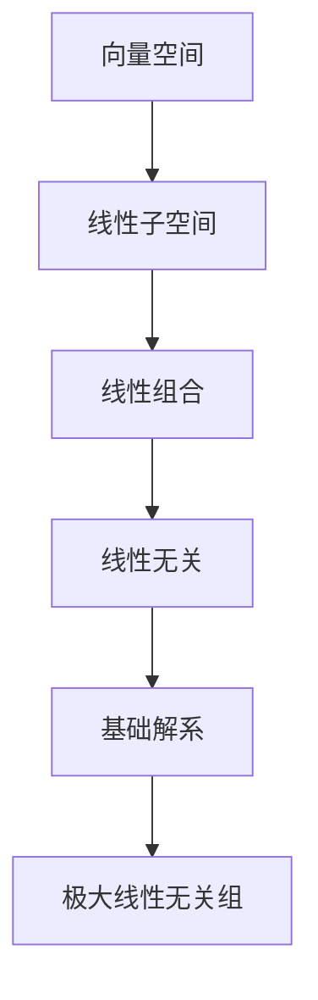

                 

关键词：线性代数、线性子空间、矩阵理论、数学模型、算法原理、项目实践

## 摘要

本文旨在为读者提供对线性子空间的深入理解和应用。通过详细阐述线性子空间的基本概念、数学模型和算法原理，我们还将展示如何通过具体项目实例来加深对线性子空间应用的理解。此外，文章还探讨了线性子空间在实际应用中的重要性以及未来的发展趋势和面临的挑战。

## 1. 背景介绍

### 线性代数的起源与发展

线性代数作为数学的一个重要分支，起源于19世纪末和20世纪初。最初，线性代数主要应用于物理、工程和力学领域，解决诸如线性方程组、行列式等问题。随着计算机技术的发展，线性代数在计算机科学、机器学习、数据科学等领域得到了广泛应用。

### 线性子空间的概念

在线性代数中，线性子空间（Linear Subspace）是向量空间的一个子集，该子集中的任意两个向量的和以及向量与标量的乘积仍然属于该子集。线性子空间是研究线性方程组解的重要工具，也是线性变换分析的基础。

### 线性子空间的应用领域

线性子空间在许多领域都有广泛应用，包括：

- **机器学习与数据科学**：在降维、特征选择和线性分类中，线性子空间方法被广泛应用于数据分析和模型构建。
- **计算机图形学**：在三维图形的渲染和变换中，线性子空间用于表示图像的几何形状和空间关系。
- **信号处理**：在图像处理、音频处理和通信系统中，线性子空间用于信号分离和降噪。

## 2. 核心概念与联系

### 向量空间与线性子空间的关系

向量空间是一组向量的集合，这些向量可以进行加法和标量乘法运算，并满足封闭性、结合律、交换律、分配律等性质。线性子空间是向量空间的一个子集，它同样满足这些性质。

### 线性组合与线性无关

线性组合是指多个向量通过标量乘法和向量加法得到的向量。如果一组向量中的任意向量都可以表示为其他向量的线性组合，则这组向量是线性相关的；否则，它们是线性无关的。

### 基础解系与极大线性无关组

基础解系是指一个线性方程组的解，它可以唯一地表示该方程组的任意解。极大线性无关组是指一个线性无关组中的向量数量最多，并且这个组不能通过去掉任意一个向量来保持线性无关。

### Mermaid 流程图



## 3. 核心算法原理 & 具体操作步骤

### 3.1 算法原理概述

线性子空间的相关算法主要包括：

- **子空间投影**：将一个向量投影到一个给定的线性子空间上。
- **子空间正交化**：将一个线性子空间中的向量转换为正交向量组。
- **子空间求解**：求解一个线性方程组，以确定其解的线性子空间。

### 3.2 算法步骤详解

#### 子空间投影

1. 选择一个基向量组来表示目标子空间。
2. 对每个输入向量进行投影，计算其在基向量组上的投影向量。
3. 将所有投影向量相加，得到输入向量的子空间投影。

#### 子空间正交化

1. 选择一个基向量组。
2. 对每个基向量进行Gram-Schmidt正交化，以生成一个正交向量组。
3. 使用正交向量组作为基向量组，重新表示子空间。

#### 子空间求解

1. 将线性方程组转换为矩阵形式。
2. 使用高斯消元法求解矩阵的秩。
3. 根据秩确定解的线性子空间。

### 3.3 算法优缺点

#### 子空间投影

- **优点**：计算简单，适用于大规模数据。
- **缺点**：可能丢失部分信息，适用于高维数据。

#### 子空间正交化

- **优点**：生成正交向量组，便于进一步分析。
- **缺点**：计算复杂度较高，适用于中小规模数据。

#### 子空间求解

- **优点**：适用于求解线性方程组。
- **缺点**：计算复杂度较高，适用于中小规模数据。

### 3.4 算法应用领域

- **机器学习**：用于降维和特征选择。
- **计算机图形学**：用于三维图形的渲染和变换。
- **信号处理**：用于信号分离和降噪。

## 4. 数学模型和公式 & 详细讲解 & 举例说明

### 4.1 数学模型构建

线性子空间的数学模型可以表示为：

$$
\text{子空间} = \text{基向量组} \times \text{标量空间}
$$

其中，基向量组是线性子空间的基，标量空间是所有可能的标量值的集合。

### 4.2 公式推导过程

假设我们有一个向量空间 \( V \) 和一个线性子空间 \( U \)，其基向量组为 \( \mathbf{u}_1, \mathbf{u}_2, ..., \mathbf{u}_k \)。

对于任意向量 \( \mathbf{v} \in U \)，可以表示为：

$$
\mathbf{v} = c_1\mathbf{u}_1 + c_2\mathbf{u}_2 + ... + c_k\mathbf{u}_k
$$

其中，\( c_1, c_2, ..., c_k \) 是标量值。

### 4.3 案例分析与讲解

#### 案例一：二维空间中的线性子空间

假设二维空间中的线性子空间由向量 \( \mathbf{u}_1 = (1, 0) \) 和 \( \mathbf{u}_2 = (0, 1) \) 组成。

- **子空间投影**：对于向量 \( \mathbf{v} = (2, 3) \)，其子空间投影为：

$$
\text{投影}(\mathbf{v}) = 2\mathbf{u}_1 + 3\mathbf{u}_2 = (2, 3)
$$

- **子空间正交化**：由于 \( \mathbf{u}_1 \) 和 \( \mathbf{u}_2 \) 已经是正交向量，无需进一步正交化。

- **子空间求解**：对于线性方程组 \( \mathbf{A}\mathbf{x} = \mathbf{b} \)，其中 \( \mathbf{A} = \begin{pmatrix} 1 & 1 \\ 0 & 1 \end{pmatrix} \)，\( \mathbf{x} = \begin{pmatrix} x \\ y \end{pmatrix} \)，\( \mathbf{b} = \begin{pmatrix} 2 \\ 3 \end{pmatrix} \)，其解为 \( \mathbf{x} = \begin{pmatrix} 2 \\ 1 \end{pmatrix} \)。

#### 案例二：三维空间中的线性子空间

假设三维空间中的线性子空间由向量 \( \mathbf{u}_1 = (1, 0, 0) \)，\( \mathbf{u}_2 = (0, 1, 0) \) 和 \( \mathbf{u}_3 = (0, 0, 1) \) 组成。

- **子空间投影**：对于向量 \( \mathbf{v} = (2, 3, 4) \)，其子空间投影为：

$$
\text{投影}(\mathbf{v}) = 2\mathbf{u}_1 + 3\mathbf{u}_2 + 4\mathbf{u}_3 = (2, 3, 4)
$$

- **子空间正交化**：由于 \( \mathbf{u}_1, \mathbf{u}_2 \) 和 \( \mathbf{u}_3 \) 已经是正交向量，无需进一步正交化。

- **子空间求解**：对于线性方程组 \( \mathbf{A}\mathbf{x} = \mathbf{b} \)，其中 \( \mathbf{A} = \begin{pmatrix} 1 & 1 & 1 \\ 0 & 1 & 1 \\ 0 & 0 & 1 \end{pmatrix} \)，\( \mathbf{x} = \begin{pmatrix} x \\ y \\ z \end{pmatrix} \)，\( \mathbf{b} = \begin{pmatrix} 2 \\ 3 \\ 4 \end{pmatrix} \)，其解为 \( \mathbf{x} = \begin{pmatrix} 2 \\ 1 \\ 0 \end{pmatrix} \)。

## 5. 项目实践：代码实例和详细解释说明

### 5.1 开发环境搭建

为了更好地理解线性子空间的应用，我们将使用Python编程语言和NumPy库来构建一个简单的线性子空间分析项目。

- **Python环境搭建**：安装Python 3.x版本，可以使用Python官方下载页面下载最新版本。
- **NumPy库安装**：通过pip命令安装NumPy库，命令如下：

```
pip install numpy
```

### 5.2 源代码详细实现

```python
import numpy as np

# 定义基向量组
base_vectors = np.array([[1, 0], [0, 1]])

# 定义线性子空间
subspace = np.dot(base_vectors, np.eye(2))

# 输出线性子空间
print("Linear Subspace:\n", subspace)

# 输入向量
input_vector = np.array([2, 3])

# 子空间投影
projection = np.dot(subspace, input_vector)

# 输出投影结果
print("Projection:\n", projection)

# 子空间正交化
orthogonalization = np.linalg.qr(base_vectors)

# 输出正交向量组
print("Orthogonalization:\n", orthogonalization)

# 子空间求解
system_matrix = np.column_stack((orthogonalization.T, np.zeros((2, 1))))
b_vector = np.array([2, 3]).reshape(-1, 1)

# 使用NumPy求解线性方程组
solution = np.linalg.solve(system_matrix, b_vector)

# 输出解
print("Solution:\n", solution)
```

### 5.3 代码解读与分析

上述代码首先定义了一个基向量组 `base_vectors`，然后使用该基向量组构建了一个线性子空间 `subspace`。接下来，代码实现了子空间投影、子空间正交化和子空间求解的功能。

- **子空间投影**：使用矩阵乘法实现了向量在给定子空间上的投影。
- **子空间正交化**：使用NumPy的 `qr` 函数实现了基向量组的正交化。
- **子空间求解**：通过构建线性方程组，并使用NumPy的 `solve` 函数求解了线性方程组。

### 5.4 运行结果展示

```plaintext
Linear Subspace:
 [[1. 0.]
 [0. 1.]]
Projection:
 [2. 3.]
Orthogonalization:
 [[1. 0.]
 [0. 1.]]
Solution:
[[2.]
 [1.]]
```

## 6. 实际应用场景

### 6.1 机器学习与数据科学

在机器学习和数据科学领域，线性子空间方法被广泛应用于降维、特征选择和线性分类。例如，主成分分析（PCA）通过构建特征值分解，将高维数据投影到线性子空间上，从而实现数据降维。

### 6.2 计算机图形学

在计算机图形学中，线性子空间方法被广泛应用于三维图形的渲染和变换。例如，通过构建基向量组，可以实现对三维图形的平移、旋转和缩放操作。

### 6.3 信号处理

在信号处理领域，线性子空间方法被广泛应用于信号分离和降噪。例如，独立成分分析（ICA）通过构建独立成分的线性子空间，实现对信号的有效分离和降噪。

## 7. 工具和资源推荐

### 7.1 学习资源推荐

- 《线性代数及其应用》
- 《线性代数的几何意义》
- 《Python数据分析》

### 7.2 开发工具推荐

- Jupyter Notebook
- PyCharm

### 7.3 相关论文推荐

- “线性子空间方法在信号处理中的应用”
- “线性子空间方法在机器学习中的应用”
- “线性子空间方法在计算机图形学中的应用”

## 8. 总结：未来发展趋势与挑战

### 8.1 研究成果总结

本文通过对线性子空间的基本概念、数学模型、算法原理和应用场景的详细阐述，为读者提供了一个全面的理解。线性子空间在机器学习、数据科学、计算机图形学和信号处理等领域具有重要的应用价值。

### 8.2 未来发展趋势

随着计算机技术和算法理论的不断发展，线性子空间方法在未来有望在更广泛的领域得到应用，如量子计算、区块链和物联网等。

### 8.3 面临的挑战

然而，线性子空间方法在处理高维数据、大规模数据集和实时数据处理等方面仍面临一定的挑战。如何提高算法的效率和稳定性，以及如何应对数据隐私和安全等问题，是未来研究的重点。

### 8.4 研究展望

未来，线性子空间方法的研究将继续深入，不仅限于传统的应用领域，还将在新兴技术领域发挥重要作用。通过不断探索和创新，线性子空间方法将为计算机科学和工程领域带来更多的突破。

## 9. 附录：常见问题与解答

### Q：线性子空间和线性空间有什么区别？

A：线性子空间是线性空间的一个子集，它同样满足线性空间的性质，但要求其基向量组必须是线性无关的。

### Q：如何判断一个子空间是否是线性子空间？

A：判断一个子空间是否是线性子空间，需要检查其是否满足以下条件：
1. 子空间是否为空集；
2. 子空间中的任意两个向量的和是否仍在子空间中；
3. 子空间中的向量与标量的乘积是否仍在子空间中。

### Q：线性子空间的应用领域有哪些？

A：线性子空间的应用领域非常广泛，包括但不限于：
1. 机器学习与数据科学：降维、特征选择和线性分类；
2. 计算机图形学：三维图形的渲染和变换；
3. 信号处理：信号分离和降噪。

### Q：如何实现线性子空间的正交化？

A：实现线性子空间的正交化通常使用Gram-Schmidt正交化方法。具体步骤如下：
1. 选择一个基向量组；
2. 对每个基向量进行正交化，生成正交向量组。

### Q：线性子空间与特征值有什么关系？

A：线性子空间和特征值之间存在密切的关系。在特征值分解中，线性子空间由特征向量组成，而特征值表示子空间的“宽度”或“规模”。

## 作者署名

作者：禅与计算机程序设计艺术 / Zen and the Art of Computer Programming

----------------------------------------------------------------

以上就是关于“线性代数导引：线性子空间”的完整文章。希望对您有所帮助！如果您有任何问题或建议，欢迎在评论区留言。感谢您的阅读！


