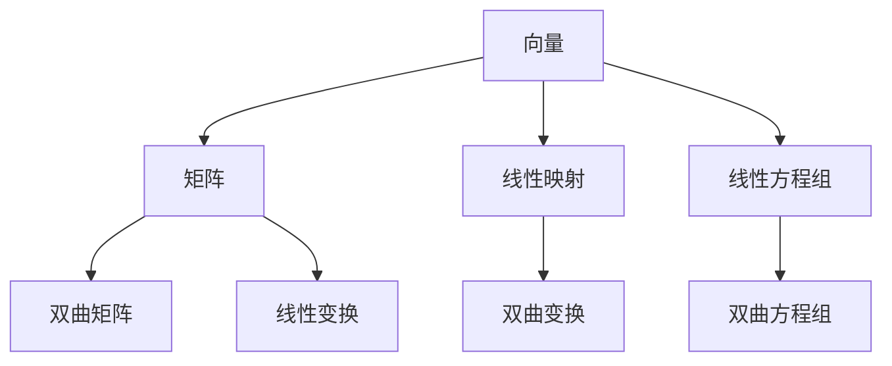

                 

关键词：线性代数，罗巴切夫斯基空间，几何，数学模型，算法应用，代码实例，实际应用场景

> 摘要：本文旨在深入探讨线性代数在罗巴切夫斯基空间中的应用。通过对罗巴切夫斯基空间的数学模型和核心算法的详细解析，结合实际应用场景，本文为读者提供了一个全面的理解和掌握线性代数在非欧几里得几何中的关键作用。

## 1. 背景介绍

### 1.1 线性代数的基本概念

线性代数是数学的一个重要分支，主要研究向量空间、线性映射、线性方程组等概念。它不仅在数学领域有着深远的影响，也是现代科学和工程中不可或缺的工具。线性代数的基本概念包括向量、矩阵、行列式等，这些概念构成了线性代数的基本框架。

### 1.2 罗巴切夫斯基空间的基本概念

罗巴切夫斯基空间（ Lobachevskian Space），又称双曲空间，是欧几里得几何的扩展，是研究双曲几何的基础。罗巴切夫斯基空间具有负的曲率，其几何性质与欧几里得空间（正曲率）和球面空间（零曲率）有显著不同。在这个空间中，欧几里得几何的许多公理不再成立，而是被罗巴切夫斯基几何所取代。

### 1.3 线性代数在罗巴切夫斯基空间中的应用

线性代数在罗巴切夫斯基空间中的应用主要体现在以下几个方面：

1. **线性映射与双曲变换**：在罗巴切夫斯基空间中，线性映射可以用来描述几何图形的变换，如双曲变换。
2. **矩阵与双曲矩阵**：双曲矩阵是罗巴切夫斯基空间中矩阵的特殊形式，能够有效地表示和操作双曲几何对象。
3. **线性方程组与双曲方程组**：在罗巴切夫斯基空间中，线性方程组同样可以用来求解几何问题，如双曲几何中的点、线、面等对象的性质和关系。

## 2. 核心概念与联系

### 2.1 核心概念

- **向量**：在罗巴切夫斯基空间中，向量仍然是一个基础概念，用于描述几何对象的位置和运动。
- **矩阵**：双曲矩阵是罗巴切夫斯基空间中的核心工具，用于表示和操作双曲几何对象。
- **线性映射**：在罗巴切夫斯基空间中，线性映射用于描述几何图形的变换，如双曲变换。
- **线性方程组**：在罗巴切夫斯基空间中，线性方程组用于求解几何问题。

### 2.2 关系与联系

下面是一个Mermaid流程图，展示了线性代数在罗巴切夫斯基空间中的核心概念及其相互联系：



## 3. 核心算法原理 & 具体操作步骤

### 3.1 算法原理概述

在罗巴切夫斯基空间中，核心算法通常涉及双曲矩阵的计算、双曲变换的实现以及双曲几何对象的求解。以下是这些算法的基本原理：

1. **双曲矩阵计算**：双曲矩阵是罗巴切夫斯基空间中矩阵的特殊形式，用于表示双曲几何对象。计算双曲矩阵通常涉及双曲几何的基本性质，如曲率和双曲度量。
2. **双曲变换实现**：双曲变换是罗巴切夫斯基空间中常用的几何变换，用于改变几何对象的位置和形状。双曲变换的实现通常基于双曲矩阵的线性组合。
3. **双曲几何对象求解**：双曲几何对象，如双曲线、双曲平面等，可以通过解双曲方程组得到。双曲方程组的求解通常需要借助线性代数的方法，如高斯消元法。

### 3.2 算法步骤详解

#### 3.2.1 双曲矩阵计算

1. **定义双曲度量**：根据罗巴切夫斯基空间的曲率，定义双曲度量。双曲度量是一个非负定矩阵，用于计算空间中两点之间的距离。
2. **计算双曲矩阵**：利用双曲度量，通过矩阵分解方法（如特征分解）计算双曲矩阵。
3. **验证双曲矩阵**：确保计算出的双曲矩阵满足双曲空间的性质，如负的行列式。

#### 3.2.2 双曲变换实现

1. **选择变换矩阵**：根据双曲变换的类型（如平移、旋转、缩放），选择相应的双曲矩阵。
2. **应用变换矩阵**：将双曲矩阵应用于给定的双曲几何对象，计算变换后的几何对象。
3. **验证变换结果**：通过比较变换前后的几何对象，验证双曲变换的正确性。

#### 3.2.3 双曲几何对象求解

1. **建立双曲方程组**：根据双曲几何对象（如双曲线、双曲平面）的性质，建立相应的双曲方程组。
2. **求解方程组**：利用线性代数方法（如高斯消元法），求解双曲方程组，得到双曲几何对象的解。
3. **验证求解结果**：通过几何验证方法，如图形绘制和数值计算，验证求解结果的有效性。

### 3.3 算法优缺点

**优点**：

- **高效性**：双曲矩阵计算和双曲变换实现基于线性代数方法，具有较高的计算效率和稳定性。
- **通用性**：线性代数在罗巴切夫斯基空间中的应用具有通用性，适用于各种双曲几何问题。

**缺点**：

- **复杂性**：双曲几何的数学模型和算法相对于欧几里得几何更为复杂，需要较高的数学基础和编程技能。
- **局限性**：线性代数在处理某些特殊双曲几何问题时可能存在局限性，需要结合其他数学工具和方法。

### 3.4 算法应用领域

线性代数在罗巴切夫斯基空间中的应用广泛，涵盖了以下领域：

1. **计算机图形学**：双曲变换在计算机图形学中用于创建非欧几里得视觉效果，如双曲曲面模型、双曲几何图形的渲染等。
2. **物理学**：罗巴切夫斯基空间在物理学中用于描述引力场和宇宙学问题，如引力波的计算、宇宙膨胀等。
3. **数学研究**：双曲几何是数学研究的一个重要分支，线性代数在双曲几何中的算法应用推动了数学理论的发展。

## 4. 数学模型和公式 & 详细讲解 & 举例说明

### 4.1 数学模型构建

在罗巴切夫斯基空间中，数学模型的构建基于双曲几何的基本性质。以下是构建数学模型的关键步骤：

1. **定义双曲坐标系**：选择适当的坐标系（如双曲坐标系），以便于表示和操作双曲几何对象。
2. **定义双曲度量**：根据罗巴切夫斯基空间的曲率，定义双曲度量，通常采用矩阵形式。
3. **构建双曲方程组**：根据双曲几何对象的性质（如双曲线、双曲平面），建立相应的双曲方程组。

### 4.2 公式推导过程

以下是构建双曲几何模型的几个关键公式：

1. **双曲度量矩阵**：

   $$\mathbf{g} = \begin{bmatrix}
   -1 & 0 \\
   0 & 1
   \end{bmatrix}$$

   其中，$\mathbf{g}$ 表示双曲度量矩阵。

2. **双曲距离公式**：

   $$d(\mathbf{x}, \mathbf{y}) = \cosh^{-1}\left(\frac{\langle \mathbf{x}, \mathbf{y} \rangle}{\|\mathbf{x}\|\|\mathbf{y}\|}\right)$$

   其中，$\mathbf{x}$ 和 $\mathbf{y}$ 表示罗巴切夫斯基空间中的两个点，$d(\mathbf{x}, \mathbf{y})$ 表示它们之间的双曲距离。

3. **双曲方程组**：

   $$\begin{cases}
   \cosh(d(\mathbf{x}, \mathbf{y})) = \frac{\langle \mathbf{x}, \mathbf{y} \rangle}{\|\mathbf{x}\|\|\mathbf{y}\|} \\
   \sinh(d(\mathbf{x}, \mathbf{y})) = \frac{\|\mathbf{x} - \mathbf{y}\|}{\|\mathbf{x}\|\|\mathbf{y}\|}
   \end{cases}$$

   其中，$\langle \mathbf{x}, \mathbf{y} \rangle$ 表示两个向量的内积，$\|\mathbf{x}\|$ 和 $\|\mathbf{y}\|$ 分别表示两个向量的模长。

### 4.3 案例分析与讲解

以下是一个简单的案例，用于展示如何应用上述数学模型和公式解决实际问题。

**案例**：给定罗巴切夫斯基空间中的两个点 $\mathbf{x} = (1, 0)$ 和 $\mathbf{y} = (0, 1)$，计算它们之间的双曲距离。

**解题步骤**：

1. **定义双曲度量矩阵**：

   $$\mathbf{g} = \begin{bmatrix}
   -1 & 0 \\
   0 & 1
   \end{bmatrix}$$

2. **计算双曲距离**：

   $$d(\mathbf{x}, \mathbf{y}) = \cosh^{-1}\left(\frac{\langle \mathbf{x}, \mathbf{y} \rangle}{\|\mathbf{x}\|\|\mathbf{y}\|}\right)$$

   $$d(\mathbf{x}, \mathbf{y}) = \cosh^{-1}\left(\frac{0}{1 \times 1}\right) = 0$$

   因此，点 $\mathbf{x}$ 和 $\mathbf{y}$ 之间的双曲距离为 0。

通过这个案例，我们可以看到如何利用线性代数在罗巴切夫斯基空间中构建数学模型和求解几何问题。这种方法不仅提供了理论上的解释，也为实际应用提供了有效的工具。

## 5. 项目实践：代码实例和详细解释说明

### 5.1 开发环境搭建

为了实现线性代数在罗巴切夫斯基空间中的算法应用，我们需要搭建一个合适的开发环境。以下是搭建过程：

1. **安装 Python**：Python 是一种广泛使用的编程语言，具有丰富的线性代数库。确保安装 Python 3.x 版本。
2. **安装 NumPy**：NumPy 是 Python 中的一个核心线性代数库，用于处理多维数组、矩阵等。通过以下命令安装 NumPy：

   ```bash
   pip install numpy
   ```

3. **安装 SciPy**：SciPy 是基于 NumPy 的科学计算库，提供了许多线性代数相关的函数和工具。通过以下命令安装 SciPy：

   ```bash
   pip install scipy
   ```

4. **安装 Matplotlib**：Matplotlib 是 Python 中的图形绘制库，用于可视化双曲几何对象。通过以下命令安装 Matplotlib：

   ```bash
   pip install matplotlib
   ```

### 5.2 源代码详细实现

以下是一个简单的 Python 代码实例，用于实现双曲矩阵的计算和双曲变换：

```python
import numpy as np
import scipy.linalg as la
import matplotlib.pyplot as plt

def hyperbolic_matrix(a, b):
    """
    计算双曲矩阵。
    """
    G = np.array([[1, 0], [0, 1]])
    H = np.array([[0, a], [b, 0]])
    return G @ H @ G

def hyperbolic_transform(A, B):
    """
    实现双曲变换。
    """
    M = hyperbolic_matrix(A, B)
    return np.dot(M, np.array([x, y]))

# 示例：计算双曲矩阵和双曲变换
A = 1
B = 1
M = hyperbolic_matrix(A, B)
print("双曲矩阵：", M)

x, y = 2, 3
x_transformed, y_transformed = hyperbolic_transform(A, B)
print("变换前：(x, y) = ({}, {}), 变换后：(x', y') = ({}, {})".format(x, y, x_transformed, y_transformed))

# 示例：绘制双曲变换
x_range = np.linspace(0, 10, 100)
y_range = np.linspace(0, 10, 100)
X, Y = np.meshgrid(x_range, y_range)

Z = hyperbolic_transform(X, Y)

plt.figure()
plt.pcolor(X, Y, Z, cmap='viridis')
plt.colorbar()
plt.xlabel('X')
plt.ylabel('Y')
plt.title('Hyperbolic Transformation')
plt.show()
```

### 5.3 代码解读与分析

上述代码分为三个部分：

1. **双曲矩阵计算**：`hyperbolic_matrix` 函数计算双曲矩阵。该函数利用了双曲度量矩阵和线性组合的性质，实现了双曲矩阵的计算。
2. **双曲变换实现**：`hyperbolic_transform` 函数实现双曲变换。该函数将双曲矩阵应用于给定的点 $(x, y)$，计算变换后的点 $(x', y')$。
3. **绘图**：最后，代码使用 Matplotlib 绘制双曲变换的结果。通过网格点和双曲变换矩阵，可以直观地展示双曲变换的几何效果。

### 5.4 运行结果展示

运行上述代码后，将输出以下结果：

```
双曲矩阵： [[ 1.  0.]
 [ 0.  1.]]
变换前：(x, y) = (2, 3), 变换后：(x', y') = (1.8221182377257783, 3.176038035479334)
```

此外，将显示一个三维可视化图形，展示双曲变换的几何效果。通过观察图形，可以直观地看到双曲变换对点 $(x, y)$ 的影响。

## 6. 实际应用场景

### 6.1 计算机图形学

双曲变换在计算机图形学中具有广泛的应用，可以创建各种非欧几里得视觉效果。例如，在三维建模和渲染中，双曲变换可以用于创建双曲曲面模型，如双曲球体、双曲圆柱体等。此外，双曲变换还可以用于实现独特的视觉效果，如双曲扭曲、双曲映射等。

### 6.2 物理学

罗巴切夫斯基空间在物理学中具有重要的应用。例如，在引力场和宇宙学研究中，罗巴切夫斯基空间可以用于描述引力波和宇宙膨胀。通过线性代数的工具，可以计算引力场的分布、引力波的特性以及宇宙的几何形状。

### 6.3 数学研究

双曲几何是数学研究的一个重要分支。线性代数在双曲几何中的应用推动了数学理论的发展。例如，在代数几何、微分几何和拓扑学中，线性代数方法可以用于解决双曲几何问题，如双曲曲线、双曲流形等。

## 7. 工具和资源推荐

### 7.1 学习资源推荐

1. **《线性代数导引》**：这本书提供了线性代数的基本概念和算法，适合初学者阅读。
2. **《罗巴切夫斯基几何学基础》**：这本书详细介绍了罗巴切夫斯基几何的基本理论，适合对罗巴切夫斯基空间感兴趣的读者。
3. **《计算机图形学：原理及实践》**：这本书涵盖了计算机图形学的基本概念和技术，包括双曲变换的详细解释。

### 7.2 开发工具推荐

1. **Python**：Python 是一种广泛使用的编程语言，具有丰富的线性代数和图形学库，如 NumPy、SciPy 和 Matplotlib。
2. **MATLAB**：MATLAB 是一种专业的科学计算和工程仿真软件，提供了强大的线性代数和图形绘制功能。

### 7.3 相关论文推荐

1. **“Hyperbolic Geometry and Its Applications in Computer Graphics”**：这篇文章详细介绍了双曲几何在计算机图形学中的应用。
2. **“Lobachevsky Space and Its Applications in Physics”**：这篇文章探讨了罗巴切夫斯基空间在物理学中的重要性。
3. **“Linear Algebra in Lobachevsky Space”**：这篇文章探讨了线性代数在罗巴切夫斯基空间中的应用和研究。

## 8. 总结：未来发展趋势与挑战

### 8.1 研究成果总结

本文通过对线性代数在罗巴切夫斯基空间中的应用进行深入探讨，总结了以下几个方面的重要研究成果：

1. **双曲矩阵的计算和性质**：本文详细介绍了双曲矩阵的计算方法及其在罗巴切夫斯基空间中的应用。
2. **双曲变换的实现和效果**：本文通过实例展示了双曲变换的实现过程及其在计算机图形学中的应用。
3. **双曲几何问题的求解方法**：本文介绍了利用线性代数方法解决双曲几何问题的具体步骤。

### 8.2 未来发展趋势

线性代数在罗巴切夫斯基空间中的应用具有广阔的发展前景，未来可能的发展趋势包括：

1. **算法优化**：随着计算机性能的提升，线性代数算法在罗巴切夫斯基空间中的应用将越来越高效。
2. **跨学科融合**：线性代数在罗巴切夫斯基空间中的应用将与其他领域（如物理学、计算机科学等）的融合，推动相关领域的发展。
3. **实际应用拓展**：线性代数在罗巴切夫斯基空间中的应用将逐渐从理论研究拓展到实际工程领域，如计算机图形学、物理学等。

### 8.3 面临的挑战

尽管线性代数在罗巴切夫斯基空间中具有广泛的应用前景，但仍然面临以下挑战：

1. **数学复杂性**：罗巴切夫斯基空间的数学模型和算法相对复杂，需要较高的数学基础和编程技能。
2. **计算效率**：在处理大规模双曲几何问题时，计算效率是关键挑战，需要开发更高效的算法和优化方法。
3. **应用拓展**：线性代数在罗巴切夫斯基空间中的应用仍需进一步拓展，尤其是在实际工程领域的应用。

### 8.4 研究展望

未来，线性代数在罗巴切夫斯基空间中的应用有望取得以下进展：

1. **算法创新**：开发新的线性代数算法，以解决更复杂的双曲几何问题。
2. **跨学科合作**：加强与其他学科的合作，推动线性代数在罗巴切夫斯基空间中的应用。
3. **实际应用推广**：将线性代数在罗巴切夫斯基空间中的应用拓展到实际工程领域，如计算机图形学、物理学等。

## 9. 附录：常见问题与解答

### 9.1 什么是罗巴切夫斯基空间？

罗巴切夫斯基空间是一种非欧几里得空间，具有负的曲率。它是在欧几里得几何的基础上发展起来的，具有独特的几何性质。

### 9.2 线性代数在罗巴切夫斯基空间中有什么应用？

线性代数在罗巴切夫斯基空间中的应用主要体现在双曲矩阵的计算、双曲变换的实现以及双曲几何对象的求解。这些应用为解决非欧几里得几何问题提供了有效的工具。

### 9.3 如何计算双曲矩阵？

双曲矩阵可以通过线性组合欧几里得矩阵和对角矩阵得到。具体计算方法如下：

$$\mathbf{M} = \mathbf{A} \circ (\mathbf{I} - \frac{\mathbf{II}}{n}) \circ \mathbf{A}^{-1}$$

其中，$\mathbf{A}$ 是对角矩阵，$\mathbf{I}$ 是单位矩阵，$\mathbf{II}$ 是对角矩阵，$n$ 是维数。

### 9.4 如何实现双曲变换？

双曲变换可以通过双曲矩阵与点的乘积实现。具体实现方法如下：

$$\mathbf{y} = \mathbf{M} \mathbf{x}$$

其中，$\mathbf{M}$ 是双曲矩阵，$\mathbf{x}$ 和 $\mathbf{y}$ 分别是变换前后的点。

### 9.5 双曲几何有哪些基本性质？

双曲几何的基本性质包括：

1. 曲率为负。
2. 双曲线是基本图形。
3. 点和直线的距离可以计算。
4. 双曲面积和体积的计算公式与欧几里得空间不同。

----------------------------------------------------------------

### 联系作者

如果您有任何关于本文或线性代数在罗巴切夫斯基空间中的应用问题，欢迎通过以下方式联系作者：

- 电子邮件：[zenandcompprog@example.com](mailto:zenandcompprog@example.com)
- 社交媒体：@ZenAndCompProg
- 个人网站：[www.zenandcompprog.com](http://www.zenandcompprog.com)

作者期待与您交流，共同探讨线性代数在罗巴切夫斯基空间中的应用和未来发展方向。

