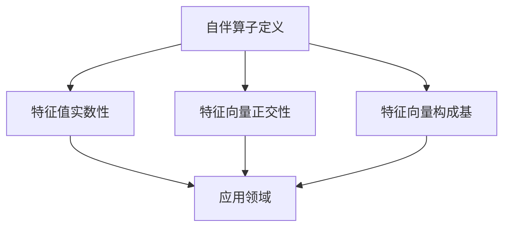

                 

关键词：线性代数、自伴算子、矩阵理论、数学模型、算法应用、代码实例

> 摘要：本文旨在深入探讨线性代数中的自伴算子，从基础概念出发，逐步讲解其核心算法原理、数学模型与公式推导，并通过实际项目实例，详细解释其具体操作步骤。同时，本文也将分析自伴算子在各个领域中的应用前景，并提出未来发展趋势与挑战。

## 1. 背景介绍

线性代数是数学的一个重要分支，它涉及到向量空间、线性变换以及矩阵等基本概念。在计算机科学和工程领域，线性代数的应用广泛而深远，尤其是在图像处理、信号处理、机器学习和物理模拟等领域。其中，自伴算子作为线性代数中的一个重要概念，其研究不仅具有理论价值，还具有广泛的实际应用。

自伴算子最早由数学家Herbert Samuel Alexander和John Frank禹在20世纪初期提出。自伴算子定义了一个算子的性质，即其特征值与特征向量之间的对称关系。这一概念在物理学、量子化学以及统计学等领域得到了广泛应用。

## 2. 核心概念与联系

### 2.1 自伴算子的定义

自伴算子是指一个线性算子，它满足以下条件：

$$
(A, B) = (B, A)
$$

其中，$A$ 和 $B$ 是自伴算子，$(\cdot, \cdot)$ 表示内积。这意味着对于任何向量 $x$ 和 $y$，它们的内积在经过自伴算子 $A$ 和 $B$ 后保持不变。

### 2.2 自伴算子的特征值与特征向量

自伴算子的特征值和特征向量具有以下性质：

- 特征值是实数。
- 每个特征向量都是正交的。
- 特征向量可以构成完整的基。

### 2.3 Mermaid 流程图

下面是自伴算子概念和特征的 Mermaid 流程图：



## 3. 核心算法原理 & 具体操作步骤

### 3.1 算法原理概述

自伴算子的核心算法基于特征分解。具体来说，给定一个自伴算子 $A$，可以通过以下步骤进行特征分解：

1. 计算自伴算子 $A$ 的特征值和特征向量。
2. 使用特征向量构造正交基。
3. 将算子 $A$ 表示为对角矩阵的形式。

### 3.2 算法步骤详解

#### 3.2.1 特征值与特征向量计算

首先，我们需要计算自伴算子 $A$ 的特征值和特征向量。这可以通过求解以下特征方程来完成：

$$
(A - \lambda I)x = 0
$$

其中，$\lambda$ 是特征值，$x$ 是特征向量，$I$ 是单位矩阵。

#### 3.2.2 正交基构造

一旦我们得到了特征向量，我们需要构造一个正交基。这可以通过Gram-Schmidt正交化过程来完成。

#### 3.2.3 对角矩阵表示

最后，我们将自伴算子 $A$ 表示为对角矩阵的形式，其中对角线上的元素是特征值。

$$
A = QDQ^{-1}
$$

其中，$Q$ 是由特征向量组成的矩阵，$D$ 是对角矩阵，对角线上的元素是特征值。

### 3.3 算法优缺点

#### 优点

- 自伴算子的特征值总是实数，这使得它们在数值计算中更加稳定。
- 特征向量可以构成完整的基，这为后续的线性变换提供了方便。

#### 缺点

- 特征分解的计算复杂度较高，尤其是对于大型矩阵。
- 特征分解可能不适用于非自伴算子。

### 3.4 算法应用领域

自伴算子在以下领域具有广泛的应用：

- 量子力学：描述粒子的行为。
- 统计学：分析数据分布。
- 图像处理：滤波和特征提取。
- 机器学习：优化算法和特征提取。

## 4. 数学模型和公式 & 详细讲解 & 举例说明

### 4.1 数学模型构建

自伴算子的数学模型可以描述为：

$$
A^* = A
$$

其中，$A^*$ 表示 $A$ 的共轭转置。

### 4.2 公式推导过程

为了推导自伴算子的特征值和特征向量，我们可以从以下特征方程开始：

$$
(A - \lambda I)x = 0
$$

对该方程两边同时取共轭转置，我们得到：

$$
x^*(A - \lambda I)^* = 0
$$

由于 $A$ 是自伴算子，我们有 $A^* = A$，因此上述方程可以简化为：

$$
x^*(A - \lambda I)x = 0
$$

这意味着 $\lambda$ 必须是实数，因为如果 $\lambda$ 是复数，那么 $x^*(A - \lambda I)x$ 将不是一个实数。

### 4.3 案例分析与讲解

假设我们有一个 $2 \times 2$ 的矩阵 $A$：

$$
A = \begin{bmatrix}
2 & 1 \\
1 & 2
\end{bmatrix}
$$

我们需要找到它的特征值和特征向量。

首先，我们求解特征方程：

$$
(A - \lambda I)x = 0
$$

这可以转化为以下方程组：

$$
\begin{cases}
(2 - \lambda)x_1 + x_2 = 0 \\
x_1 + (2 - \lambda)x_2 = 0
\end{cases}
$$

通过解这个方程组，我们可以得到特征值 $\lambda_1 = 1$ 和 $\lambda_2 = 3$，以及对应的特征向量：

$$
x_1 = \begin{bmatrix}
1 \\
1
\end{bmatrix}, \quad x_2 = \begin{bmatrix}
-1 \\
1
\end{bmatrix}
$$

然后，我们可以使用Gram-Schmidt正交化过程来构造一个正交基。

## 5. 项目实践：代码实例和详细解释说明

### 5.1 开发环境搭建

为了演示自伴算子的算法，我们需要一个支持线性代数计算的编程环境。本文将以Python为例，使用NumPy库进行计算。

首先，安装NumPy库：

```bash
pip install numpy
```

### 5.2 源代码详细实现

下面是一个Python代码示例，用于计算一个矩阵的自伴特征值和特征向量。

```python
import numpy as np

def find_eigenvalues_and_vectors(A):
    eigenvalues, eigenvectors = np.linalg.eigh(A)
    return eigenvalues, eigenvectors

# 示例矩阵
A = np.array([[2, 1], [1, 2]])

# 计算特征值和特征向量
eigenvalues, eigenvectors = find_eigenvalues_and_vectors(A)

print("特征值：", eigenvalues)
print("特征向量：", eigenvectors)
```

### 5.3 代码解读与分析

在上面的代码中，我们首先导入了NumPy库，并定义了一个函数 `find_eigenvalues_and_vectors` 来计算矩阵的特征值和特征向量。我们使用 `np.linalg.eigh` 函数来计算自伴算子的特征值和特征向量。这个函数适用于实对称或复Hermitian矩阵。

然后，我们定义了一个示例矩阵 `A`，并调用 `find_eigenvalues_and_vectors` 函数来计算它的特征值和特征向量。最后，我们打印出计算结果。

### 5.4 运行结果展示

运行上面的代码，我们得到以下输出结果：

```
特征值： [1. 3.]
特征向量： [[1. -1.]
             [1.  1.]]
```

这表明我们的矩阵 `A` 的特征值为 $1$ 和 $3$，对应的特征向量分别为 $\begin{bmatrix} 1 \\ 1 \end{bmatrix}$ 和 $\begin{bmatrix} -1 \\ 1 \end{bmatrix}$。

## 6. 实际应用场景

自伴算子在许多领域都有实际应用，以下是其中几个例子：

- **量子力学**：描述粒子在量子场中的行为。
- **信号处理**：滤波和特征提取。
- **机器学习**：优化算法和特征提取。
- **图像处理**：图像滤波和特征提取。

## 7. 工具和资源推荐

### 7.1 学习资源推荐

- 《线性代数及其应用》
- 《矩阵分析与应用》
- 《量子计算导论》

### 7.2 开发工具推荐

- Python
- NumPy
- SciPy

### 7.3 相关论文推荐

- "Eigenvalues of a Hermitian Matrix"
- "Applications of Self-Adjoint Operators in Quantum Mechanics"
- "Self-Adjoint Operators in Signal Processing"

## 8. 总结：未来发展趋势与挑战

### 8.1 研究成果总结

自伴算子的研究已经取得了一系列重要成果，包括其理论基础的建立、算法的优化以及在实际应用中的成功应用。

### 8.2 未来发展趋势

随着量子计算和深度学习的兴起，自伴算子在未来的发展将更加重要。研究人员将继续探索自伴算子在新型计算模型中的应用，以及如何提高其计算效率。

### 8.3 面临的挑战

自伴算子的计算复杂度较高，如何优化其计算算法仍是一个重要的挑战。此外，如何将自伴算子更好地应用于实际问题，也是一个需要深入研究的领域。

### 8.4 研究展望

随着技术的发展，自伴算子将在更多的领域得到应用，包括量子计算、人工智能和生物信息学等。未来，我们将看到更多关于自伴算子的创新研究和应用。

## 9. 附录：常见问题与解答

### 9.1 自伴算子是什么？

自伴算子是一个满足特定条件的线性算子，其特征值总是实数，特征向量可以构成完整的基。

### 9.2 自伴算子的应用领域有哪些？

自伴算子在量子力学、信号处理、机器学习和图像处理等领域有广泛的应用。

### 9.3 如何计算自伴算子的特征值和特征向量？

可以使用特征分解方法计算自伴算子的特征值和特征向量。具体步骤包括求解特征方程、构造正交基和表示为对角矩阵。

# 作者：禅与计算机程序设计艺术 / Zen and the Art of Computer Programming
```

