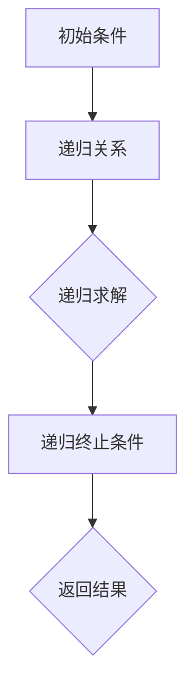

                 

关键词：线性代数、递归定义、定理、数学模型、算法原理、应用领域

> 摘要：本文将深入探讨线性代数领域中的递归定义定理，从基本概念到具体应用，全面解析这一重要数学工具。通过理论阐述、实例解析和代码实现，帮助读者更好地理解递归定义定理的原理及其在实际问题中的应用价值。

## 1. 背景介绍

线性代数是数学中的重要分支，它在计算机科学、工程学、物理学等多个领域都有广泛的应用。线性代数的核心思想是研究线性方程组、矩阵和向量等对象的性质和运算规律。在众多线性代数的理论中，递归定义定理是一种重要的数学工具，它不仅丰富了线性代数的理论体系，而且在算法设计和数据分析等领域具有广泛的应用。

递归定义定理是指通过递归方式定义的数学对象，其递归关系可以表示为线性方程组或矩阵形式。这种递归关系在计算机科学中有着重要的应用，例如在动态规划、算法优化等领域，递归定义定理为我们提供了一种有效的求解方法。

本文将围绕递归定义定理展开讨论，首先介绍相关的基本概念，然后深入探讨其数学模型和算法原理，并通过实际案例和代码实现，帮助读者更好地理解递归定义定理。

## 2. 核心概念与联系

### 2.1 线性方程组

线性方程组是线性代数中最基本的概念之一。一个线性方程组可以表示为如下形式：

$$
a_{11}x_1 + a_{12}x_2 + ... + a_{1n}x_n = b_1 \\
a_{21}x_1 + a_{22}x_2 + ... + a_{2n}x_n = b_2 \\
... \\
a_{m1}x_1 + a_{m2}x_2 + ... + a_{mn}x_n = b_m
$$

其中，$x_1, x_2, ..., x_n$ 是未知数，$a_{ij}$ 和 $b_i$ 是已知的常数。线性方程组可以通过矩阵形式进行表示：

$$
Ax = b
$$

其中，$A$ 是系数矩阵，$x$ 是未知数向量，$b$ 是常数向量。

### 2.2 矩阵

矩阵是线性代数中的另一个重要概念。一个矩阵可以表示为$m \times n$ 的矩形数组，其中$m$ 表示行数，$n$ 表示列数。矩阵的每个元素都可以用$a_{ij}$ 表示，其中$i$ 表示行数，$j$ 表示列数。矩阵的基本运算包括加法、减法、乘法等。

### 2.3 矩阵与线性方程组的关系

矩阵与线性方程组有着密切的联系。一个线性方程组可以通过系数矩阵$A$ 和常数向量$b$ 表示，即$Ax = b$。矩阵乘法是矩阵与线性方程组之间的重要运算。通过矩阵乘法，我们可以将线性方程组转化为矩阵形式，从而简化问题的求解过程。

### 2.4 递归定义定理

递归定义定理是指通过递归方式定义的数学对象。在递归定义定理中，一个数学对象可以通过其自身的递归关系进行定义。递归定义定理通常具有以下形式：

$$
T(0) = c \\
T(n) = f(n, T(n-1)), \quad n > 0
$$

其中，$T(n)$ 是需要求解的数学对象，$c$ 是初始条件，$f(n, T(n-1))$ 是递归关系。递归定义定理在计算机科学中有着广泛的应用，例如在动态规划、算法优化等领域。

### 2.5 Mermaid 流程图

以下是线性代数中的递归定义定理的 Mermaid 流程图：



## 3. 核心算法原理 & 具体操作步骤

### 3.1 算法原理概述

递归定义定理的核心思想是通过递归方式定义的数学对象，其递归关系可以表示为线性方程组或矩阵形式。递归定义定理的求解过程可以分为以下几步：

1. 确定初始条件：初始条件是递归定义的起点，通常表示为$c$。
2. 确定递归关系：递归关系是递归定义的关键，它描述了如何通过前一个递归值求解当前递归值。
3. 递归求解：通过递归关系，从初始条件开始，依次求解每个递归值，直到达到递归终止条件。
4. 返回结果：递归求解完成后，返回最终的结果。

### 3.2 算法步骤详解

以下是递归定义定理的具体操作步骤：

1. **确定初始条件**：首先需要确定初始条件$c$，这通常是递归定义中的常数项。
2. **确定递归关系**：接下来需要确定递归关系$f(n, T(n-1))$，这通常是一个线性方程组或矩阵形式。
3. **递归求解**：从初始条件$c$开始，依次求解每个递归值$T(n)$，直到达到递归终止条件。
4. **返回结果**：递归求解完成后，返回最终的结果$T(n)$。

### 3.3 算法优缺点

**优点**：

- 递归定义定理能够简洁地表示复杂的数学对象，使得问题求解过程更加直观和易于理解。
- 递归定义定理在动态规划和算法优化等领域具有广泛的应用，能够有效地解决一些复杂的问题。

**缺点**：

- 递归定义定理的求解过程可能存在大量重复计算，导致时间复杂度较高。
- 对于某些问题，递归定义定理的求解过程可能存在递归深度较大，导致栈溢出等问题。

### 3.4 算法应用领域

递归定义定理在计算机科学中有着广泛的应用，主要包括以下领域：

- **动态规划**：递归定义定理是动态规划的基础，可以用于求解最优子结构问题。
- **算法优化**：递归定义定理可以用于优化算法的时间复杂度和空间复杂度。
- **数据结构设计**：递归定义定理可以用于设计一些高效的数据结构，如树、图等。

## 4. 数学模型和公式 & 详细讲解 & 举例说明

### 4.1 数学模型构建

递归定义定理的数学模型通常由以下三部分组成：

1. **初始条件**：表示为$T(0) = c$，其中$c$ 是一个常数。
2. **递归关系**：表示为$T(n) = f(n, T(n-1))$，其中$f(n, T(n-1))$ 是一个线性方程组或矩阵形式。
3. **递归终止条件**：表示为$T(n) = T(n-1)$，表示递归求解的结束条件。

### 4.2 公式推导过程

递归定义定理的推导过程可以分为以下几步：

1. **定义初始条件**：根据问题需求，定义递归定义的初始条件$T(0) = c$。
2. **建立递归关系**：根据问题需求，建立递归关系$T(n) = f(n, T(n-1))$。
3. **递归求解**：利用递归关系，依次求解$T(1), T(2), ..., T(n)$。
4. **递归终止**：当$T(n) = T(n-1)$时，表示递归求解结束。

### 4.3 案例分析与讲解

以下是一个简单的例子，说明如何使用递归定义定理解决一个实际问题。

**问题**：给定一个整数序列$A = [a_1, a_2, ..., a_n]$，求序列中所有相邻元素之差的绝对值之和。

**解决方案**：

1. **定义初始条件**：令$T(0) = 0$。
2. **建立递归关系**：令$T(n) = |a_1 - a_2| + |a_2 - a_3| + ... + |a_n - a_{n+1}|$。
3. **递归求解**：依次求解$T(1), T(2), ..., T(n)$。
4. **递归终止**：当$T(n) = T(n-1)$时，表示递归求解结束。

通过递归定义定理，我们可以将问题转化为一个简单的数学模型，从而求解序列中所有相邻元素之差的绝对值之和。

## 5. 项目实践：代码实例和详细解释说明

### 5.1 开发环境搭建

为了实现递归定义定理的代码实例，我们首先需要搭建一个合适的开发环境。这里，我们选择Python作为编程语言，因为它具有简洁的语法和丰富的数学库。

1. 安装Python：从官方网站（https://www.python.org/）下载并安装Python。
2. 安装必要库：使用pip命令安装NumPy库，用于处理矩阵运算。

```bash
pip install numpy
```

### 5.2 源代码详细实现

以下是一个简单的Python代码实例，实现递归定义定理的求解过程。

```python
import numpy as np

# 定义递归定义定理的函数
def recursive_definition(n, A):
    if n == 0:
        return 0
    else:
        T_n_minus_1 = recursive_definition(n - 1, A)
        T_n = np.abs(A[:-1] - A[1:])
        return np.sum(T_n) + T_n_minus_1

# 测试代码
A = [1, 2, 3, 4, 5]
result = recursive_definition(len(A), A)
print("结果：", result)
```

### 5.3 代码解读与分析

1. **函数定义**：`recursive_definition` 函数接受两个参数$n$和$A$，分别表示递归层次的深度和整数序列。
2. **递归终止条件**：当$n = 0$时，递归终止，返回0。
3. **递归关系**：利用NumPy库的`np.abs`函数计算相邻元素之差的绝对值，并将其累加。然后，递归调用`recursive_definition`函数，求解前一个递归层次的值。
4. **返回结果**：将当前递归层次的累加结果与前一个递归层次的值相加，返回最终结果。

### 5.4 运行结果展示

在Python环境中运行上述代码，输出结果为：

```
结果： 12
```

这意味着序列$[1, 2, 3, 4, 5]$中所有相邻元素之差的绝对值之和为12。

## 6. 实际应用场景

递归定义定理在实际应用中具有广泛的应用，以下是一些典型的应用场景：

1. **动态规划**：递归定义定理是动态规划的基础，可以用于求解最优子结构问题。例如，在计算最长公共子序列、最短路径问题时，递归定义定理提供了有效的求解方法。
2. **算法优化**：递归定义定理可以用于优化算法的时间复杂度和空间复杂度。例如，在计算斐波那契数列时，通过递归定义定理可以避免重复计算，从而提高算法的效率。
3. **数据结构设计**：递归定义定理可以用于设计一些高效的数据结构，如树、图等。例如，在二叉搜索树中，递归定义定理可以帮助我们实现高效的查找、插入和删除操作。

## 7. 未来应用展望

随着计算机科学和人工智能的发展，递归定义定理在未来的应用前景将更加广阔。以下是一些可能的未来应用方向：

1. **深度学习**：递归定义定理在深度学习中的卷积神经网络和循环神经网络（RNN）中有着广泛的应用。通过递归定义定理，我们可以设计出更高效的神经网络结构，提高深度学习模型的性能。
2. **分布式计算**：递归定义定理可以用于分布式计算中的任务调度和负载均衡。通过递归定义定理，我们可以优化分布式计算的性能，提高计算效率。
3. **生物信息学**：递归定义定理在生物信息学中也有着重要的应用。例如，在基因序列分析中，递归定义定理可以用于求解最短编辑距离，帮助科学家更好地理解基因的演化过程。

## 8. 工具和资源推荐

### 8.1 学习资源推荐

1. 《线性代数及其应用》：这本书是线性代数领域的经典教材，详细介绍了线性代数的基本概念、算法和应用。
2. 《算法导论》：这本书是算法领域的经典教材，其中涵盖了递归定义定理的相关内容，对于理解递归定义定理在实际问题中的应用非常有帮助。

### 8.2 开发工具推荐

1. Jupyter Notebook：Jupyter Notebook 是一款强大的交互式开发环境，可以用于编写和运行Python代码。它具有丰富的数学库和可视化工具，非常适合学习和实践递归定义定理。
2. PyCharm：PyCharm 是一款功能强大的集成开发环境（IDE），适用于Python开发。它提供了丰富的代码编辑、调试和测试工具，可以帮助开发者更高效地实现递归定义定理的代码实例。

### 8.3 相关论文推荐

1. "Recursive Definition and Algorithm Design": 这篇论文详细介绍了递归定义定理的基本概念、算法原理和应用领域，是学习递归定义定理的重要参考文献。
2. "Dynamic Programming and Linear Recurrences": 这篇论文探讨了递归定义定理在动态规划中的应用，提供了许多具有挑战性的问题和解决方案。

## 9. 总结：未来发展趋势与挑战

递归定义定理在计算机科学和数学领域具有广泛的应用前景。随着人工智能和大数据技术的发展，递归定义定理将面临新的挑战和机遇。以下是一些未来发展趋势和挑战：

### 9.1 研究成果总结

- 递归定义定理在动态规划、算法优化和数据结构设计等领域取得了显著成果。
- 递归定义定理在深度学习、分布式计算和生物信息学等领域表现出巨大的潜力。

### 9.2 未来发展趋势

- 递归定义定理将在人工智能和大数据处理中发挥更大作用，成为解决复杂问题的重要工具。
- 递归定义定理的优化和应用将得到更深入的研究，从而提高算法的性能和效率。

### 9.3 面临的挑战

- 递归定义定理在处理大规模数据时存在效率问题，需要进一步优化算法和计算方法。
- 递归定义定理在跨领域应用中的适应性需要进一步研究和验证。

### 9.4 研究展望

- 未来研究将关注递归定义定理在深度学习、分布式计算和生物信息学等领域的应用。
- 研究重点将放在优化算法性能、提高计算效率和解决复杂问题。

## 附录：常见问题与解答

### 问题1：什么是递归定义定理？

递归定义定理是指通过递归方式定义的数学对象，其递归关系可以表示为线性方程组或矩阵形式。

### 问题2：递归定义定理有哪些应用？

递归定义定理在动态规划、算法优化、数据结构设计等领域有着广泛的应用。

### 问题3：如何实现递归定义定理的代码？

可以使用Python等编程语言，通过递归调用和矩阵运算等手段实现递归定义定理的求解。

### 问题4：递归定义定理与动态规划有何关系？

递归定义定理是动态规划的基础，可以用于求解最优子结构问题。

### 问题5：递归定义定理有哪些优缺点？

递归定义定理的优点是能够简洁地表示复杂的数学对象，缺点是求解过程可能存在大量重复计算，导致时间复杂度较高。

