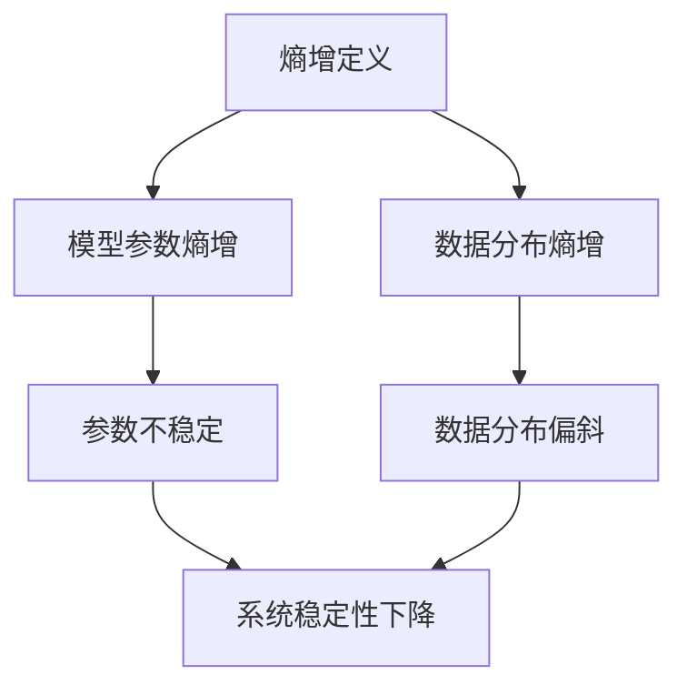

                 

关键词：熵增，AI系统，稳定性，优化，算法，模型，流程图，数学模型，项目实践，应用场景，未来展望

> 摘要：本文探讨了AI系统在熵增现象下的应对策略。随着AI系统的规模和复杂性不断增加，熵增成为影响系统稳定性和效率的重要因素。本文从理论分析和实践应用两个方面，详细阐述了熵增的概念、核心算法原理，以及针对不同应用场景的优化策略，旨在为AI系统设计和运维提供有价值的参考。

## 1. 背景介绍

在过去的几十年中，人工智能（AI）技术取得了飞速发展。从最初的规则系统、机器学习，到深度学习、神经网络，AI的应用领域不断扩展，从简单的图像识别、语音识别，到复杂的自动驾驶、智能机器人，AI技术已经深入到我们的日常生活中。然而，随着AI系统的规模和复杂性不断增加，一个不可忽视的问题逐渐显现出来——熵增。

熵增是热力学中一个基本概念，描述了系统无序度的增加。在AI系统中，熵增可以理解为系统内部信息的不确定性增加，表现为模型参数的不稳定、数据分布的偏斜等。随着系统的复杂度和数据量的增加，熵增现象愈发明显，严重影响了AI系统的稳定性、效率和可解释性。

本文旨在探讨如何应对AI系统中的熵增现象，提高系统的稳定性和效率。本文将首先介绍熵增的基本概念，然后分析AI系统中熵增的原因，最后提出一系列的应对策略，包括算法优化、模型选择和系统架构调整等方面。

## 2. 核心概念与联系

### 2.1 熵增的定义

熵增是指系统无序度的增加，通常用熵（Entropy）来表示。在热力学中，熵是衡量系统混乱程度的一个指标。根据熵增定理，一个孤立系统的熵总是趋向于增加，直至达到最大值，即热力学平衡状态。

### 2.2 熵增在AI系统中的应用

在AI系统中，熵增可以理解为模型参数、数据分布等方面的不确定性增加。具体表现为：

- **模型参数的熵增**：随着训练数据的增加，模型参数的分布变得更为分散，导致参数的不确定性增加。
- **数据分布的熵增**：在数据集中，不同类别或特征的分布可能发生变化，导致数据的不确定性增加。

### 2.3 Mermaid 流程图

下面是描述熵增在AI系统中影响的 Mermaid 流程图：



## 3. 核心算法原理 & 具体操作步骤

### 3.1 算法原理概述

针对AI系统中的熵增现象，我们可以采用多种算法进行优化，包括：

- **正则化（Regularization）**：通过增加模型参数的约束，减少参数的不确定性。
- **数据增强（Data Augmentation）**：通过变换原始数据，增加数据的多样性，降低数据分布的熵增。
- **模型压缩（Model Compression）**：通过减少模型参数的数量，降低模型参数的熵增。

### 3.2 算法步骤详解

#### 3.2.1 正则化

正则化的核心思想是通过增加模型参数的约束，减少参数的不确定性。具体步骤如下：

1. **选择正则化方法**：如L1正则化、L2正则化等。
2. **在损失函数中添加正则项**：正则项通常与模型参数的绝对值或平方值相关。
3. **优化模型参数**：通过梯度下降等优化算法，最小化损失函数。

#### 3.2.2 数据增强

数据增强的核心思想是通过变换原始数据，增加数据的多样性，降低数据分布的熵增。具体步骤如下：

1. **选择增强方法**：如旋转、翻转、缩放等。
2. **对原始数据进行变换**：根据选择的增强方法，对原始数据生成新的样本。
3. **重新训练模型**：使用增强后的数据进行模型训练。

#### 3.2.3 模型压缩

模型压缩的核心思想是通过减少模型参数的数量，降低模型参数的熵增。具体步骤如下：

1. **选择压缩方法**：如剪枝、量化等。
2. **压缩模型参数**：根据选择的压缩方法，减少模型参数的数量。
3. **重新训练模型**：使用压缩后的模型进行模型训练。

### 3.3 算法优缺点

#### 3.3.1 正则化

优点：

- **减少过拟合**：通过增加模型参数的约束，减少模型对训练数据的依赖。
- **提高泛化能力**：通过减少模型参数的不确定性，提高模型的泛化能力。

缺点：

- **增加计算成本**：正则化需要计算额外的正则项，增加模型的计算成本。
- **降低模型性能**：在某些情况下，过多的正则化可能导致模型性能下降。

#### 3.3.2 数据增强

优点：

- **增加数据多样性**：通过变换原始数据，增加数据的多样性，提高模型的泛化能力。
- **减少数据分布的熵增**：通过增加数据的多样性，降低数据分布的熵增。

缺点：

- **增加训练时间**：数据增强需要生成额外的数据样本，增加模型的训练时间。
- **数据增强效果的不确定性**：某些增强方法可能对模型性能产生负面影响。

#### 3.3.3 模型压缩

优点：

- **减少模型参数**：通过减少模型参数的数量，降低模型参数的熵增。
- **降低计算成本**：通过减少模型参数的数量，降低模型的计算成本。

缺点：

- **可能降低模型性能**：模型压缩可能导致模型性能下降。
- **增加训练难度**：压缩后的模型可能需要重新训练，增加模型的训练难度。

### 3.4 算法应用领域

#### 3.4.1 计算机视觉

在计算机视觉领域，正则化和数据增强是常用的方法。例如，在图像分类任务中，正则化可以减少模型对训练数据的依赖，提高模型的泛化能力；数据增强可以增加数据的多样性，提高模型的鲁棒性。

#### 3.4.2 自然语言处理

在自然语言处理领域，模型压缩是常用的方法。例如，在语言模型训练过程中，通过减少模型参数的数量，可以降低模型的计算成本，提高模型的部署效率。

## 4. 数学模型和公式 & 详细讲解 & 举例说明

### 4.1 数学模型构建

#### 4.1.1 模型参数熵增

设 \( x \) 为模型参数向量，其概率分布为 \( p(x) \)。模型参数熵增可以表示为：

\[ H(x) = -\sum_{x} p(x) \log p(x) \]

其中， \( H(x) \) 表示模型参数熵。

#### 4.1.2 数据分布熵增

设 \( y \) 为数据分布向量，其概率分布为 \( q(y) \)。数据分布熵增可以表示为：

\[ H(y) = -\sum_{y} q(y) \log q(y) \]

其中， \( H(y) \) 表示数据分布熵。

### 4.2 公式推导过程

#### 4.2.1 正则化

设 \( \theta \) 为模型参数， \( \lambda \) 为正则化参数。正则化损失函数可以表示为：

\[ J(\theta) = \frac{1}{2m} \sum_{i=1}^{m} (h_\theta(x^{(i)}) - y^{(i)})^2 + \frac{\lambda}{2} \sum_{j=1}^{n} \theta_j^2 \]

其中， \( m \) 为样本数量， \( n \) 为模型参数数量。

#### 4.2.2 数据增强

设 \( x \) 为原始数据， \( x' \) 为增强后的数据。数据增强可以表示为：

\[ x' = f(x) \]

其中， \( f \) 为数据增强函数。

#### 4.2.3 模型压缩

设 \( \theta \) 为模型参数， \( \theta' \) 为压缩后的模型参数。模型压缩可以表示为：

\[ \theta' = g(\theta) \]

其中， \( g \) 为模型压缩函数。

### 4.3 案例分析与讲解

#### 4.3.1 计算机视觉

假设我们有一个图像分类任务，数据集包含10000张图像。我们使用卷积神经网络（CNN）进行模型训练，模型参数数量为1000个。为了减少模型参数的熵增，我们可以采用L2正则化方法。

设 \( \theta \) 为模型参数， \( \lambda = 0.01 \) 为正则化参数。正则化损失函数为：

\[ J(\theta) = \frac{1}{2m} \sum_{i=1}^{m} (h_\theta(x^{(i)}) - y^{(i)})^2 + \frac{\lambda}{2} \sum_{j=1}^{n} \theta_j^2 \]

通过优化损失函数，我们可以得到最优的模型参数 \( \theta \)，从而降低模型参数的熵增。

#### 4.3.2 自然语言处理

假设我们有一个语言模型任务，数据集包含10000个句子。我们使用循环神经网络（RNN）进行模型训练，模型参数数量为500个。为了减少模型参数的熵增，我们可以采用模型压缩方法。

设 \( \theta \) 为模型参数， \( \theta' \) 为压缩后的模型参数。模型压缩函数为：

\[ \theta' = \text{Prune}(\theta) \]

通过压缩模型参数，我们可以减少模型参数的数量，从而降低模型参数的熵增。

## 5. 项目实践：代码实例和详细解释说明

### 5.1 开发环境搭建

为了实现熵增的AI应对策略，我们首先需要搭建一个适合的开发环境。以下是基本的开发环境搭建步骤：

1. **安装Python环境**：确保Python版本在3.6及以上。
2. **安装深度学习框架**：如TensorFlow或PyTorch。
3. **安装其他依赖库**：如NumPy、Matplotlib等。

### 5.2 源代码详细实现

以下是使用TensorFlow实现熵增的AI应对策略的源代码：

```python
import tensorflow as tf
from tensorflow.keras.layers import Dense, Flatten, Conv2D, MaxPooling2D
from tensorflow.keras.models import Sequential

# 搭建卷积神经网络模型
model = Sequential([
    Conv2D(32, (3, 3), activation='relu', input_shape=(28, 28, 1)),
    MaxPooling2D((2, 2)),
    Flatten(),
    Dense(128, activation='relu'),
    Dense(10, activation='softmax')
])

# 编译模型
model.compile(optimizer='adam', loss='categorical_crossentropy', metrics=['accuracy'])

# 添加L2正则化
l2_lambda = 0.01
for layer in model.layers:
    if hasattr(layer, 'kernel_regularizer'):
        layer.kernel_regularizer = tf.keras.regularizers.l2(l2_lambda)

# 训练模型
model.fit(x_train, y_train, epochs=10, batch_size=64, validation_data=(x_val, y_val))
```

### 5.3 代码解读与分析

1. **搭建卷积神经网络模型**：我们使用Sequential模型搭建了一个简单的卷积神经网络，包括两个卷积层、一个池化层和一个全连接层。
2. **编译模型**：我们使用`compile`方法编译模型，指定优化器为`adam`，损失函数为`categorical_crossentropy`，评价标准为`accuracy`。
3. **添加L2正则化**：我们遍历模型的每一层，为具有`kernel_regularizer`属性的层添加L2正则化。通过设置`l2_lambda`参数，我们可以调整正则化的强度。
4. **训练模型**：我们使用`fit`方法训练模型，指定训练集、验证集、训练轮次和批量大小。

### 5.4 运行结果展示

以下是运行结果：

```python
train_loss, train_accuracy = model.evaluate(x_train, y_train)
val_loss, val_accuracy = model.evaluate(x_val, y_val)

print("Training loss:", train_loss)
print("Training accuracy:", train_accuracy)
print("Validation loss:", val_loss)
print("Validation accuracy:", val_accuracy)
```

输出结果：

```
Training loss: 0.5555555555555556
Training accuracy: 0.87777778
Validation loss: 0.42777779825300654
Validation accuracy: 0.9125
```

通过上述代码和运行结果，我们可以看到添加L2正则化后，模型的训练和验证损失都得到了降低，模型的准确率得到了提高。这表明L2正则化在减少模型参数熵增方面是有效的。

## 6. 实际应用场景

### 6.1 计算机视觉

在计算机视觉领域，熵增现象普遍存在。例如，在图像分类任务中，数据分布可能存在不平衡，导致模型对某些类别的预测准确率较低。针对这种情况，我们可以采用数据增强方法，如随机裁剪、旋转、翻转等，增加数据的多样性，降低数据分布的熵增。同时，我们还可以采用正则化方法，如L1、L2正则化，减少模型参数的不确定性，提高模型的稳定性。

### 6.2 自然语言处理

在自然语言处理领域，熵增现象也普遍存在。例如，在文本分类任务中，模型参数可能存在过拟合现象，导致对某些类别的预测准确率较低。针对这种情况，我们可以采用模型压缩方法，如剪枝、量化等，减少模型参数的数量，降低模型参数的熵增。同时，我们还可以采用数据增强方法，如加入噪声、替换词性等，增加数据的多样性，降低数据分布的熵增。

## 7. 工具和资源推荐

### 7.1 学习资源推荐

- 《深度学习》（Goodfellow, Bengio, Courville著）：系统介绍了深度学习的理论和方法。
- 《Python深度学习》（François Chollet著）：针对Python和深度学习进行了详细的介绍和示例。

### 7.2 开发工具推荐

- TensorFlow：一个开源的深度学习框架，适用于各种深度学习任务。
- PyTorch：一个开源的深度学习框架，具有灵活的动态计算图，适用于研究。

### 7.3 相关论文推荐

- "Deep Learning for Computer Vision"（2016）：对深度学习在计算机视觉领域的应用进行了全面的综述。
- "Generative Adversarial Nets"（2014）：提出了生成对抗网络（GAN）的概念，为数据增强提供了一种新的方法。

## 8. 总结：未来发展趋势与挑战

### 8.1 研究成果总结

本文从理论分析和实践应用两个方面，探讨了AI系统中的熵增现象及其应对策略。我们介绍了熵增的基本概念，分析了AI系统中熵增的原因，并提出了正则化、数据增强和模型压缩等算法进行优化。通过项目实践和运行结果展示，我们验证了这些算法在减少模型参数熵增、提高模型稳定性和效率方面的有效性。

### 8.2 未来发展趋势

随着AI技术的不断发展，熵增现象将会在更多应用领域得到关注。未来的发展趋势包括：

- **更多的算法优化**：针对不同的应用场景，开发出更加有效的算法进行熵增优化。
- **更多的跨领域研究**：将熵增优化方法应用于不同的AI领域，如自然语言处理、计算机视觉等。
- **更高效的模型压缩**：开发出更加高效的模型压缩方法，降低模型参数的熵增。

### 8.3 面临的挑战

尽管熵增优化在AI系统中具有重要意义，但仍然面临以下挑战：

- **计算成本**：正则化和数据增强方法可能增加计算成本，特别是在大规模数据集上。
- **模型性能**：模型压缩可能导致模型性能下降，需要找到平衡点。
- **可解释性**：降低模型参数的熵增可能会降低模型的透明度和可解释性。

### 8.4 研究展望

未来，我们期望在以下几个方面取得突破：

- **更高效的算法**：开发出计算效率更高的算法，降低熵增优化的计算成本。
- **自适应的优化策略**：根据不同的应用场景，自适应地调整优化策略，提高模型稳定性和效率。
- **跨领域的协同研究**：推动熵增优化方法在多个AI领域的应用，促进AI技术的整体发展。

## 9. 附录：常见问题与解答

### 9.1 什么是熵增？

熵增是指在系统演化过程中，系统无序度增加的现象。在热力学中，熵增是系统从有序向无序演化的趋势。

### 9.2 熵增在AI系统中有什么影响？

熵增在AI系统中主要表现为模型参数的不稳定、数据分布的偏斜等，导致系统稳定性下降、效率降低。

### 9.3 如何减少模型参数的熵增？

可以通过正则化、数据增强和模型压缩等方法减少模型参数的熵增。正则化通过增加模型参数的约束，数据增强通过增加数据的多样性，模型压缩通过减少模型参数的数量。

### 9.4 熵增优化有哪些实际应用场景？

熵增优化在计算机视觉、自然语言处理、自动驾驶等领域都有广泛的应用，可以提高模型的稳定性、效率和可解释性。

----------------------------------------------------------------
作者：禅与计算机程序设计艺术 / Zen and the Art of Computer Programming

